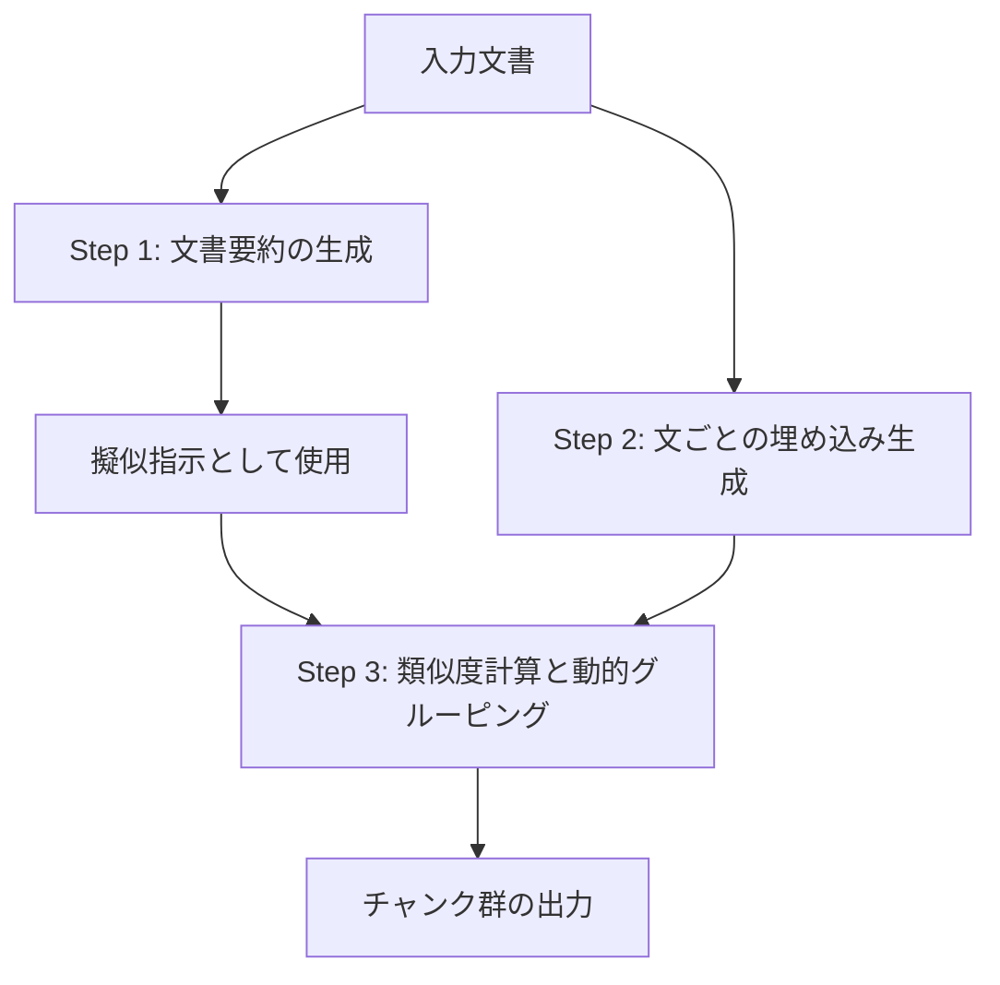

## 論文概要（Abstract）

本記事は [ACL 2025 Findings](https://aclanthology.org/2025.findings-acl.422/)（Wang et al., 2025）の解説記事です。

RAGシステムにおける文書チャンキングは検索品質に直結する重要な工程であるが、広く使われているルールベースのチャンキング手法（固定サイズ分割、再帰分割等）は最適な分割を保証しない。著者らは**PIC（Pseudo-Instruction for document Chunking）**を提案している。PICは文書要約を擬似指示（pseudo-instruction）として利用し、各文と要約の意味的類似度を計算して動的にチャンクを生成する。追加の訓練が不要で、LLMの呼び出しも不要なため、Semantic Chunking等の手法に比べて計算コストが低い。オープンドメインQAベンチマークでの実験で、検索精度（Hits@k）とエンドツーエンドのQA性能（Exact Match）の改善を報告している。

この記事は [Zenn記事: Haystackの文書前処理パイプラインでQA検索精度を段階改善する](https://zenn.dev/0h_n0/articles/17ae57aaf8443b) の深掘りです。

## 情報源

- **会議名**: ACL 2025（Association for Computational Linguistics）Findings
- **年**: 2025
- **URL**: [https://aclanthology.org/2025.findings-acl.422/](https://aclanthology.org/2025.findings-acl.422/)
- **著者**: Zhitong Wang, Cheng Gao, Chaojun Xiao, Yufei Huang, Shuzheng Si, Kangyang Luo, Yuzhuo Bai, Wenhao Li, Tangjian Duan, Chuancheng Lv, Guoshan Lu, Gang Chen, Fanchao Qi, Maosong Sun
- **ページ**: pp. 8063–8075
- **DOI**: 10.18653/v1/2025.findings-acl.422

## カンファレンス情報

**ACL（Association for Computational Linguistics）**は自然言語処理の最高峰国際会議の1つで、毎年数千件の投稿から厳選された論文が発表される。ACL 2025はウィーンで開催された。Findingsは本会議と同レベルの査読を通過した論文のうち、メイン会議の枠に収まらなかった高品質な論文が掲載されるトラックである。

## 背景と動機

RAGパイプラインでは、文書をチャンクに分割し、各チャンクをベクトル化して検索可能にする。この分割工程の品質が後続の検索・生成の精度を決定する。著者らは既存手法の3つの課題を指摘している。

**固定サイズ分割の問題**: 文書を均等な長さで機械的に分割するため、文の途中で切断されたり、意味的に無関係な文が1つのチャンクに含まれたりする。Zenn記事でも`split_by="word"`で「AWSのS3バケットに...」のような文が途中で切れた事例が紹介されている。

**Semantic Chunkingの計算コスト**: 隣接文の埋め込み類似度に基づくSemantic Chunkingは局所的な文脈のみを見るため、文書全体のテーマとの整合性が保証されない。さらに、LLMベースのチャンキング（LumberChunker等）はAPIコストが高い。

**ルールベースの限界**: `split_by="sentence"`や`split_by="passage"`は文・段落の境界を利用するが、どの文をまとめるべきかの判断基準がない。

PICはこれらの課題に対し、文書要約を「何について分割すべきか」の指示として活用することで、文書全体のテーマに整合したチャンク境界を低コストで決定する。

## 技術的詳細（Technical Details）

### PICのアルゴリズム

PICは3つのステップで構成される。



**Step 1: 文書要約の生成（Pseudo-Instruction Construction）**

文書全体の要約を生成し、これを擬似指示として使用する。要約は文書の主要テーマを凝縮しているため、「この文書はどのような話題について書かれているか」という指示として機能する。

**Step 2: 文レベルの埋め込み生成**

文書を文単位に分割し、各文の埋め込みベクトルを生成する。同時に、擬似指示（要約）の埋め込みベクトルも生成する。

**Step 3: 類似度計算と動的グルーピング**

各文と擬似指示の意味的類似度を計算し、類似度のパターンに基づいて文を動的にグループ化する。類似度が急激に変化する箇所をチャンク境界として検出する。

$$
\text{sim}(s_i, \text{summary}) = \cos(e_{s_i}, e_{\text{summary}})
$$

ここで $s_i$ は $i$ 番目の文、$e_{s_i}$ はその埋め込みベクトル、$e_{\text{summary}}$ は文書要約の埋め込みベクトルである。

連続する文の類似度パターンを分析し、テーマの遷移が検出された箇所でチャンクを分割する。これにより、文書の主要テーマに沿った意味的に一貫したチャンクが生成される。

### PICの特徴

**追加訓練不要**: 既存の埋め込みモデル（Sentence Transformers等）をそのまま使用する。ファインチューニングは不要。

**LLM呼び出し不要**: 要約生成は軽量なモデルでも可能であり、チャンキング処理自体はLLMを呼び出さない。LumberChunker（LLMベース）と比較して計算コストが大幅に低い。

**文書全体のテーマとの整合性**: 隣接文の局所的な類似度のみを見るSemantic Chunkingと異なり、文書全体の要約に対する各文の位置づけを考慮する。

```python
from sentence_transformers import SentenceTransformer
import numpy as np


def pic_chunking(
    document: str,
    summary: str,
    model_name: str = "intfloat/multilingual-e5-large",
    threshold: float = 0.5,
) -> list[list[str]]:
    """PIC方式による文書チャンキングの概念的実装

    Args:
        document: 入力文書テキスト
        summary: 文書要約（擬似指示として使用）
        model_name: 埋め込みモデル名
        threshold: チャンク境界判定の類似度閾値

    Returns:
        チャンクのリスト（各チャンクは文のリスト）
    """
    model = SentenceTransformer(model_name)

    sentences = split_into_sentences(document)

    summary_embedding = model.encode(summary)
    sentence_embeddings = model.encode(sentences)

    similarities = [
        cosine_similarity(se, summary_embedding)
        for se in sentence_embeddings
    ]

    chunks = []
    current_chunk = [sentences[0]]

    for i in range(1, len(sentences)):
        sim_diff = abs(similarities[i] - similarities[i - 1])
        if sim_diff > threshold:
            chunks.append(current_chunk)
            current_chunk = [sentences[i]]
        else:
            current_chunk.append(sentences[i])

    if current_chunk:
        chunks.append(current_chunk)

    return chunks


def cosine_similarity(a: np.ndarray, b: np.ndarray) -> float:
    """コサイン類似度を計算する"""
    return float(np.dot(a, b) / (np.linalg.norm(a) * np.linalg.norm(b)))


def split_into_sentences(text: str) -> list[str]:
    """テキストを文単位に分割する"""
    import re
    return [s.strip() for s in re.split(r'(?<=[。．.!?])', text) if s.strip()]
```

### Haystackとの対応関係

PICのアプローチはHaystackの既存コンポーネントの組み合わせで近似できる。

| PICのステップ | Haystackでの対応 |
|---|---|
| 文書要約の生成 | `ChatPromptBuilder` + LLMで要約生成 |
| 文レベルの埋め込み | `SentenceTransformersDocumentEmbedder` |
| 類似度ベースのグルーピング | カスタム`Component`として実装 |

Zenn記事で解説されている`DocumentSplitter`の`split_by="sentence"`は文境界での分割のみを行い、PICのように「どの文をまとめるべきか」の判断機能は持たない。PICの考え方を取り入れるには、カスタムコンポーネントとして実装するか、`meta_fields_to_embed`で文書要約をメタデータとして埋め込むことで部分的に代替できる。

## 実験結果（Results）

### 評価ベンチマーク

著者らはNaturalQuestionsやTriviaQA等のオープンドメインQAベンチマークで評価を行っている。

### 評価指標

- **Hits@k**: 上位k件の検索結果に正解チャンクが含まれる割合
- **Exact Match（EM）**: 生成された回答が正解と完全一致する割合
- **F1スコア**: 回答の精度と再現率の調和平均

### 比較対象のベースライン

| 手法 | カテゴリ | 特徴 |
|---|---|---|
| 固定サイズ分割 | ルールベース | トークン数で均等分割 |
| 再帰分割 | ルールベース | 区切り文字の優先度に基づく分割 |
| Semantic Chunking | 埋め込みベース | 隣接文の類似度に基づく分割 |
| LumberChunker | LLMベース | LLMがナラティブの遷移を検出 |
| **PIC** | 要約ガイド | 文書要約を擬似指示として使用 |

著者らはPICがルールベースの手法と比較してHits@kおよびExact Matchの両指標で改善を示したと報告している。特に、固定サイズ分割と比較した場合の検索精度の改善が顕著であったと述べている。

### PICの比較優位性

PICの主な優位点は、Semantic Chunkingが「隣接文の局所的な類似度」のみを考慮するのに対し、PICは「文書全体のテーマに対する各文の関連度」を考慮する点にある。これにより、文書の主要テーマに沿った一貫性のあるチャンクが生成される。

ただし、PICは文書要約の品質に依存するという制約がある。要約が不正確または不完全な場合、チャンキングの品質も低下する。著者らはアブレーション実験で要約品質がチャンキング精度に与える影響を検証している。

## 実装のポイント（Implementation）

**要約モデルの選択**: 文書要約は軽量なモデル（BART、Pegasus等）で十分であり、GPT-4クラスのLLMは不要。要約の目的はチャンキングのガイドであり、人間が読む高品質な要約は必要ない。

**類似度閾値の調整**: 閾値が高すぎるとチャンクが細かくなりすぎ（過分割）、低すぎると大きなチャンクが生成される（不足分割）。著者らはデータセットごとの最適値を探索しており、一般的には0.3〜0.7の範囲で調整することが推奨される。

**Haystackでの実装方針**: PICをHaystackパイプラインに統合するには、`@component`デコレータでカスタムコンポーネントを作成し、`DocumentSplitter`の代替として配置する。入力は`Document`のリスト、出力も`Document`のリスト（分割済み）となる。

```python
from haystack import component, Document


@component
class PICDocumentSplitter:
    """PIC方式による文書分割コンポーネント"""

    def __init__(
        self,
        model_name: str = "intfloat/multilingual-e5-large",
        similarity_threshold: float = 0.5,
    ):
        self.model_name = model_name
        self.similarity_threshold = similarity_threshold

    @component.output_types(documents=list[Document])
    def run(self, documents: list[Document]) -> dict:
        """文書をPIC方式で分割する

        Args:
            documents: 入力文書のリスト

        Returns:
            分割された文書のリスト
        """
        result_docs = []
        for doc in documents:
            summary = self._generate_summary(doc.content)
            chunks = pic_chunking(
                document=doc.content,
                summary=summary,
                model_name=self.model_name,
                threshold=self.similarity_threshold,
            )
            for i, chunk_sentences in enumerate(chunks):
                chunk_text = " ".join(chunk_sentences)
                result_docs.append(
                    Document(
                        content=chunk_text,
                        meta={**doc.meta, "chunk_index": i},
                    )
                )
        return {"documents": result_docs}

    def _generate_summary(self, text: str) -> str:
        """文書要約を生成する（簡易実装）"""
        sentences = text.split("。")[:5]
        return "。".join(sentences) + "。"
```

## Production Deployment Guide

### AWS実装パターン（コスト最適化重視）

**トラフィック量別の推奨構成**:

| 規模 | 月間リクエスト | 推奨構成 | 月額コスト | 主要サービス |
|------|--------------|---------|-----------|------------|
| **Small** | ~3,000 (100/日) | Serverless | $50-150 | Lambda + Bedrock + DynamoDB |
| **Medium** | ~30,000 (1,000/日) | Hybrid | $300-800 | Lambda + ECS Fargate + ElastiCache |
| **Large** | 300,000+ (10,000/日) | Container | $2,000-5,000 | EKS + Karpenter + EC2 Spot |

**コスト試算の注意事項**: 上記は2026年9月時点のAWS ap-northeast-1（東京）リージョン料金に基づく概算値です。最新料金は [AWS料金計算ツール](https://calculator.aws/) で確認してください。

### Terraformインフラコード

```hcl
module "vpc" {
  source  = "terraform-aws-modules/vpc/aws"
  version = "~> 5.0"

  name = "pic-rag-vpc"
  cidr = "10.0.0.0/16"
  azs  = ["ap-northeast-1a", "ap-northeast-1c"]
  private_subnets = ["10.0.1.0/24", "10.0.2.0/24"]

  enable_nat_gateway   = false
  enable_dns_hostnames = true
}

resource "aws_iam_role" "lambda_role" {
  name = "pic-rag-lambda-role"
  assume_role_policy = jsonencode({
    Version = "2012-10-17"
    Statement = [{
      Action    = "sts:AssumeRole"
      Effect    = "Allow"
      Principal = { Service = "lambda.amazonaws.com" }
    }]
  })
}

resource "aws_lambda_function" "pic_chunker" {
  filename      = "lambda.zip"
  function_name = "pic-rag-chunker"
  role          = aws_iam_role.lambda_role.arn
  handler       = "index.handler"
  runtime       = "python3.12"
  timeout       = 120
  memory_size   = 2048

  environment {
    variables = {
      EMBEDDING_MODEL = "intfloat/multilingual-e5-large"
      SIMILARITY_THRESHOLD = "0.5"
    }
  }
}

resource "aws_dynamodb_table" "chunk_store" {
  name         = "pic-chunk-store"
  billing_mode = "PAY_PER_REQUEST"
  hash_key     = "doc_id"
  range_key    = "chunk_id"

  attribute {
    name = "doc_id"
    type = "S"
  }

  attribute {
    name = "chunk_id"
    type = "S"
  }

  ttl {
    attribute_name = "expire_at"
    enabled        = true
  }
}
```

### セキュリティベストプラクティス

- **IAMロール**: 最小権限の原則
- **シークレット管理**: Secrets Manager使用
- **暗号化**: DynamoDB/S3全てKMS暗号化

### 運用・監視設定

```python
import boto3

cloudwatch = boto3.client('cloudwatch')
cloudwatch.put_metric_alarm(
    AlarmName='pic-chunker-duration',
    ComparisonOperator='GreaterThanThreshold',
    EvaluationPeriods=2,
    MetricName='Duration',
    Namespace='AWS/Lambda',
    Period=300,
    Statistic='Average',
    Threshold=60000,
    AlarmDescription='PICチャンカーの処理時間異常'
)
```

### コスト最適化チェックリスト

- [ ] ~100 req/日 → Lambda + Bedrock (Serverless) - $50-150/月
- [ ] ~1000 req/日 → ECS Fargate + Bedrock (Hybrid) - $300-800/月
- [ ] 10000+ req/日 → EKS + Spot Instances (Container) - $2,000-5,000/月
- [ ] Spot Instances優先（最大90%削減）
- [ ] Reserved Instances: 1年コミットで72%削減
- [ ] Bedrock Batch API: 50%割引
- [ ] Prompt Caching: 30-90%削減
- [ ] モデル選択: 開発はHaiku、本番はSonnet
- [ ] max_tokens設定で過剰生成防止
- [ ] AWS Budgets: 月額予算設定
- [ ] CloudWatch アラーム: 処理時間・トークンスパイク検知
- [ ] Cost Anomaly Detection: 自動異常検知
- [ ] 未使用リソース削除
- [ ] タグ戦略: 環境別コスト可視化
- [ ] S3ライフサイクルポリシー: 古いキャッシュ自動削除
- [ ] DynamoDB TTL: チャンクキャッシュの自動期限切れ
- [ ] Lambda メモリサイズ最適化
- [ ] アイドル時スケールダウン
- [ ] 日次コストレポート自動送信
- [ ] 開発環境: 夜間停止

## 実運用への応用（Practical Applications）

PICの「文書要約を擬似指示としてチャンキングをガイドする」という考え方は、Haystackの既存パイプラインに2つの形で応用できる。

**応用1: meta_fields_to_embedとの組み合わせ**: 文書要約をメタデータとして付与し、`meta_fields_to_embed=["summary"]`で埋め込みに含める。これによりチャンク分割後も文書全体のテーマ情報がベクトル空間に反映される。PICのような動的分割は行わないが、検索時の文脈補完効果が得られる。

**応用2: カスタムSplitterコンポーネント**: PICのアルゴリズムをHaystackの`@component`として実装し、`DocumentSplitter`の代替として使用する。計算コストは埋め込みモデルの推論分だけ増加するが、LLMベースの手法と比較して大幅に安価である。

**応用3: バッチインデクシングでの利用**: PICの処理時間は埋め込み計算に支配されるため、リアルタイムのチャンキングには適さないが、バッチインデクシングでは十分に実用的である。夜間バッチで文書を前処理し、日中はチャンク済みのベクトルDBに対して高速検索を行う構成が現実的である。

## 関連研究（Related Work）

- **LumberChunker**（EMNLP 2024 Findings）: LLMを使ってナラティブの自然な遷移を検出するチャンキング手法。高精度だがLLM API呼び出しコストが高い。PICは埋め込みモデルのみを使用し計算コストを削減している
- **Semantic Chunking**: 隣接文の埋め込み類似度に基づくチャンキング。局所的な文脈のみを考慮するため、文書全体のテーマとの整合性は保証されない。PICは文書要約をグローバルな参照点として使用する
- **Late Chunking**（Jina AI, 2024）: 長コンテキスト埋め込みモデルで文書全体をトークンレベルで埋め込んだ後にチャンク境界を適用する手法。チャンキング前に文脈を反映できるが、長コンテキストモデルが必要

## まとめと今後の展望

PICは文書要約を擬似指示としてチャンキングをガイドするシンプルかつ効果的な手法であり、追加訓練やLLM呼び出しを必要としない点で実用性が高い。Haystackの`DocumentSplitter`が提供するルールベースの分割（word / sentence / passage）では達成できない「文書テーマへの整合性」を、低コストで実現する。ただし、PICは単一階層のチャンキングであり、HiChunkのような多階層構造やAuto-Merge検索との組み合わせは今後の課題として残されている。

## 参考文献

- **Conference URL**: [https://aclanthology.org/2025.findings-acl.422/](https://aclanthology.org/2025.findings-acl.422/)
- **DOI**: [10.18653/v1/2025.findings-acl.422](https://doi.org/10.18653/v1/2025.findings-acl.422)
- **Related Zenn article**: [https://zenn.dev/0h_n0/articles/17ae57aaf8443b](https://zenn.dev/0h_n0/articles/17ae57aaf8443b)
- **LumberChunker**: [https://arxiv.org/abs/2406.17526](https://arxiv.org/abs/2406.17526)

---

:::message
この記事はAI（Claude Code）により自動生成されました。内容の正確性については原論文と照合していますが、最新情報は公式ソースもご確認ください。
:::
