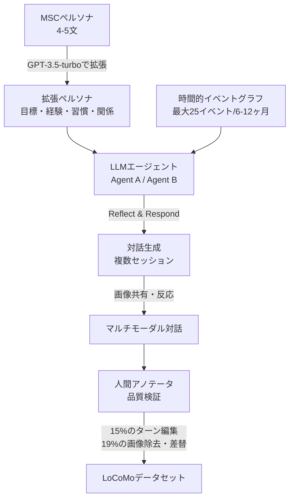
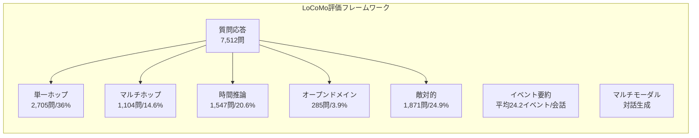

本記事は [Evaluating Very Long-Term Conversational Memory of LLM Agents](https://arxiv.org/abs/2402.17753)（ACL 2024）の解説記事です。

## 論文概要（Abstract）

既存の長期対話研究は最大5セッション程度の評価にとどまっており、数十セッションにわたる超長期対話でのLLM性能は未検証であった。著者らは、ペルソナと時間的イベントグラフに基づくLLMエージェントアーキテクチャを活用した機械・人間協調パイプラインにより、高品質な超長期対話データセット**LoCoMo**を構築している。LoCoMoは平均300ターン・9,000トークン・最大35セッションの対話を含み、質問応答・イベント要約・マルチモーダル対話生成の3タスクで評価を行う。著者らの実験では、長コンテキストLLMやRAGは改善をもたらすものの、人間の性能には大幅に及ばないと報告されている。

この記事は [Zenn記事: Mem0×Gemini 3.8 Flashで長期記憶チャットボットを構築しトークンを72%削減する](https://zenn.dev/0h_n0/articles/2f2a6e4179b88f) の深掘りです。

## 情報源

- **会議名**: ACL 2024（62nd Annual Meeting of the Association for Computational Linguistics）
- **年**: 2024
- **URL**: [https://arxiv.org/abs/2402.17753](https://arxiv.org/abs/2402.17753)
- **著者**: Adyasha Maharana, Dong-Ho Lee, Sergey Tulyakov, Mohit Bansal, Francesco Barbieri, Yuwei Fang
- **プロジェクトページ**: [https://snap-research.github.io/locomo/](https://snap-research.github.io/locomo/)
- **ライセンス**: CC BY-NC-SA 4.0

## カンファレンス情報

ACL（Association for Computational Linguistics）は自然言語処理・計算言語学分野の最高峰会議の一つである。2024年はタイ・バンコクで開催された。Long Paper枠の採択率は例年20-25%程度であり、厳格な査読プロセスを経て採択されている。本論文はSnap Research、UNC Chapel Hill、Microsoft Researchの共同研究として発表された。

## 技術的詳細（Technical Details）

### データ生成パイプライン

LoCoMoのデータ生成は、LLMによる対話生成と人間による品質検証を組み合わせた機械・人間協調パイプラインで構成される。

**ペルソナ生成**: MSCデータセットの4-5文のペルソナ文をGPT-3.5-turboで拡張し、目標・過去の経験・日常習慣・対人関係・名前・年齢・性別を含む包括的なペルソナを生成する。

**時間的イベントグラフ**: 各エージェントに対し、6-12ヶ月にわたる最大25個の因果関係で結ばれたイベント列を生成する。最初に$k=3$個のイベントを生成し、その出力を次のバッチの入力として反復的にイベントを追加する。グラフ $\mathcal{G}$ はイベント $e_i$、タイムスタンプ $t_i$、因果リンク $l=(e_i, e_j)$ で構成される。

**エージェントアーキテクチャ**: 各エージェントは二重記憶システムを持つ。短期記憶としてセッション要約 $w_k$（会話履歴 $h_k$ と前回の要約 $w_{k-1}$ から生成）、長期記憶として観察データベース（各ターン $h_{kj}$ から抽出した断定的発言 $o_{kj}$ の集合）を保持する。応答生成時、エージェントは最新の要約・検索された観察・現在の会話履歴・ペルソナ文・セッション間に発生したイベント $\{e \in \mathcal{G} \mid t_k^s < t_i^e < t_{k+1}^s\}$ を条件として利用する。

**マルチモーダル機能**: エージェントは画像キャプションを生成してキーワードに変換し、Web画像を検索して共有する。受信側はBLIP-2キャプショニングで画像内容を解釈して反応する。これにより、テキストだけでなく画像を介したコミュニケーションの記憶も評価対象となる。1会話あたり平均32.3枚の画像が含まれる。

**人間検証**: アノテータは長距離の矛盾除去、無関連画像の除去、イベントグラフへのグラウンディング検証を実施した。著者らによると、全ターンの約15%が編集され、約19%の画像が除去または差し替えられている。

### データセット統計

| 指標 | LoCoMo | MSC（従来手法） | 比率 |
|------|--------|---------------|------|
| 会話数 | 50 | — | — |
| 平均セッション数 | 19.3 | ~5 | 3.9x |
| 平均ターン数/会話 | 304.9 | ~50 | 6.1x |
| 平均トークン数/会話 | 9,209.2 | ~1,000 | 9.2x |
| 平均トークン数/ターン | 30.2 | — | — |
| 平均画像数/会話 | 32.3 | 0 | — |
| 時間スパン | ~6ヶ月 | 数日 | — |

従来のMSCデータセット（Xu et al., 2022）と比較して、LoCoMoはトークン数で9倍、ターン数で6倍、セッション数で4倍の規模を持つ。

### 評価タスク

**タスク1: 質問応答（7,512問）**

5つの推論カテゴリに分類される。

- **単一ホップ（2,705問, 36%）**: 単一セッションから回答可能な質問。例:「Aliceの好きな映画は?」
- **マルチホップ（1,104問, 14.6%）**: 複数セッションの情報を統合して回答する質問。例:「BobがAliceに勧めた本を読んだ後、Aliceはどのような感想を述べたか?」
- **時間推論（1,547問, 20.6%）**: 時間的手がかりに基づく質問。例:「Bobが転職した後、最初にAliceと話した話題は何か?」
- **オープンドメイン（285問, 3.9%）**: 対話情報と常識・世界知識を組み合わせる質問
- **敵対的（1,871問, 24.9%）**: 回答不可能な質問に対して正しく拒否できるかを試す質問

**タスク2: イベント要約**

指定された期間の対話からイベントを抽出し、グラウンドトゥルースの時間的イベントグラフと比較する。平均24.2個のイベントが各会話に含まれる。

**タスク3: マルチモーダル対話生成**

数週間から数ヶ月にわたるセッションを踏まえ、ペルソナの一貫性と物語の連続性を維持しながら対話と画像を生成する。

### 評価指標

| タスク | 指標 | 詳細 |
|--------|------|------|
| 質問応答 | F1スコア | 正規化された完全一致/部分一致 |
| イベント要約 | FactScore（精度/再現率/F1）, ROUGE-1/2/L | 事実性に焦点を当てた評価 |
| 対話生成 | BLEU-1/2, ROUGE-L, MM-Relevance | 語彙的・意味的指標の複合 |

## 実験結果（Results）

### 質問応答の結果

著者らの実験結果（論文Table 3より）を以下に示す。

**ベースモデル（4Kコンテキスト）**:

| モデル | 全体F1 | 単一ホップ | マルチホップ | 時間推論 | 敵対的 |
|--------|--------|----------|-----------|---------|--------|
| Mistral-Instruct-7B | 13.9% | — | — | — | — |
| Llama-2-Chat-70B | 17.9% | — | — | — | — |
| GPT-3.5-turbo | 22.4% | — | — | — | — |
| GPT-4-turbo | 32.1% | — | — | — | 70.2% |
| **人間** | **87.9%** | — | — | — | — |

著者らは、人間のF1スコア87.9%に対し、GPT-4-turboでも32.1%にとどまり、56ポイントの差があると報告している。

**長コンテキストモデル（GPT-3.5-turbo-16K）**:

| コンテキスト長 | 全体F1 | 敵対的質問F1 |
|--------------|--------|------------|
| 4K | 24.1% | 12.8% |
| 8K | 25.2% | — |
| 12K | 33.5% | — |
| 16K | 37.8% | 2.1% |

コンテキスト長の拡大により全体F1は改善するが、敵対的質問のF1は12.8%から2.1%へ大幅に低下している。著者らは「LLMは長いコンテキストを与えられると、対話やイベントを誤った話者に帰属させるハルシネーションを容易に生成する」と指摘している。

**RAGベースの結果（GPT-3.5-turbo-16K + 観察検索）**:

| 検索数（Top-k） | 全体F1 |
|----------------|--------|
| Top-5 | 41.4% |
| Top-10 | 38.8% |
| Top-25 | 38.0% |
| Top-50 | 37.8% |

Top-5の観察検索が41.4%で最良の性能を示し、検索数を増やすとノイズにより性能が低下する傾向が確認されている。これはMem0のようなメモリシステムにおいて、検索精度と検索量のバランスが重要であることを示唆する結果である。著者らは、観察（assertion）ベースのRAGがセッション要約ベースのRAGよりも一貫して高い性能を示したと報告している。

### イベント要約の結果

著者らの実験結果（論文Table 5より）:

| モデル | ROUGE-1 | FactScore精度 | FactScore再現率 | FactScore F1 |
|--------|---------|-------------|---------------|-------------|
| Mistral-7B | 29.4 | 27.1 | 19.8 | 23.0 |
| Llama-70B | 28.1 | 36.3 | 22.7 | 28.3 |
| GPT-3.5-turbo | 41.1 | 45.3 | 46.5 | 45.9 |
| GPT-4-turbo | 38.8 | 51.6 | 41.8 | 45.1 |
| GPT-3.5-turbo-16K | 36.2 | 42.3 | 37.8 | 39.9 |

注目すべき点として、長コンテキストモデル（GPT-3.5-turbo-16K）がベースの4Kモデルよりもイベント要約で性能が低下している。著者らは精度で3.0ポイント、再現率で8.7ポイントの低下を報告しており、コンテキスト拡大が必ずしも有効でないことを示している。

### 誤り分析

著者らはイベント要約における5つの誤りカテゴリを特定している: (1) 情報欠落（時間的・因果的接続の失敗）、(2) ハルシネーション、(3) 対話手がかりの誤解（皮肉・ユーモアの解釈失敗）、(4) 話者帰属の誤り、(5) 重要度判断の誤り。

## 実運用への応用（Practical Applications）

**Mem0の評価基盤**: LoCoMoはMem0が公式ベンチマークとして採用しており、Mem0 V3ではLoCoMoスコア92.5を達成したと報告されている。Zenn記事で解説しているMem0の記憶管理アプローチ（セッション要約と観察データベースの二重構造）は、LoCoMoの実験でRAG（観察検索）が最良の性能を示した知見と整合する。

**メモリシステムの設計指針**: LoCoMoの実験結果から、以下の実践的な指針が得られる。(1) 検索数はTop-5程度が最適であり、過度な検索はノイズとなる。(2) 長コンテキストの利用は敵対的質問でのハルシネーションリスクを増大させるため、RAGによる選択的検索が安全である。(3) 時間推論は現行LLMの弱点であり、明示的な時間インデックスの付与が有効である。

**チャットボットの品質評価**: プロダクション環境のチャットボットに対して、LoCoMoの5つのQAカテゴリ（単一ホップ・マルチホップ・時間推論・オープンドメイン・敵対的）を参考にした評価セットを構築することで、記憶能力を多角的に測定できる。特に敵対的質問による「知らないことを知らないと言えるか」の評価は、プロダクション品質の確保に重要である。

## 関連研究（Related Work）

- **Beyond Goldfish Memory（MSC）**（Xu et al., 2022）: 最大5セッションの長期対話データセット。LoCoMoはMSCを拡張し、セッション数を4倍、トークン数を9倍に拡大した。LoCoMoの設計はMSCのペルソナ文を基盤としている。
- **Generative Agents**（Park et al., 2023）: LLMベースの仮想エージェントが記憶・反省・計画を行うアーキテクチャ。LoCoMoのエージェント設計（短期記憶と長期観察データベースの二重構造）はこの研究のReflection機構に影響を受けている。
- **Conversation Chronicles**（Jang et al., 2023）: 時間的・関係的ダイナミクスを含む対話データセット。LoCoMoは時間的イベントグラフを導入することで、より構造化された時間推論の評価を可能にしている。
- **FactScore**（Min et al., 2023）: 原子的事実単位での精度評価手法。LoCoMoのイベント要約タスクの評価指標として採用されている。イベントを原子的事実に分解し、精度と再現率を算出することで、要約の網羅性と正確性を定量的に測定する。

## まとめと今後の展望

LoCoMoは、LLMの超長期対話記憶能力を評価する初のベンチマークとして、平均300ターン・9,000トークンの対話に対する質問応答・イベント要約・マルチモーダル対話生成の3タスクを提供している。著者らの実験では、GPT-4-turboでさえ人間の87.9%に対して32.1%にとどまり、長コンテキストLLMとRAGは改善をもたらすが依然として大きな差が存在すると報告されている。Mem0をはじめとするメモリ管理システムの評価基盤として、LoCoMoはプロダクション品質の記憶システム開発に不可欠なベンチマークとなっている。

今後の方向性として、著者らはより大規模なデータセットの構築、マルチモーダル評価の拡充、およびエージェントの時間推論能力の向上を課題として挙げている。

## 参考文献

- **Conference URL**: [https://arxiv.org/abs/2402.17753](https://arxiv.org/abs/2402.17753)
- **Project Page**: [https://snap-research.github.io/locomo/](https://snap-research.github.io/locomo/)
- **Related Zenn article**: [https://zenn.dev/0h_n0/articles/2f2a6e4179b88f](https://zenn.dev/0h_n0/articles/2f2a6e4179b88f)
