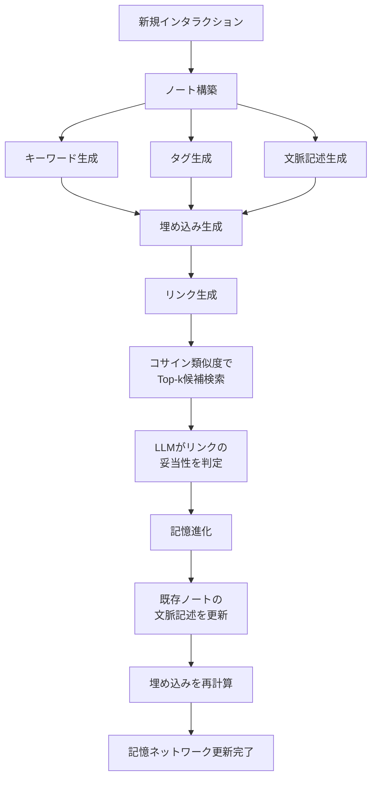

## 論文概要（Abstract）

本記事は [A-MEM: Agentic Memory for LLM Agents](https://arxiv.org/abs/2502.12110)（NeurIPS 2025）の解説記事です。

LLMエージェントは外部ツールを用いて複雑なタスクを処理できるが、過去の経験を活用するには記憶システムが不可欠である。既存の記憶システムは基本的な保存・検索を提供するものの、記憶の構造的な整理が十分でない。著者らはZettelkasten（ツェッテルカステン）方式の原則に従い、動的なインデキシングとリンク生成によって相互接続された知識ネットワークを構築するエージェント型記憶システムを提案している。6つの基盤モデルでの実験により、既存のSOTAベースラインに対する優位性が報告されている。

この記事は [Zenn記事: Mem0×Gemini 3.8 Flashで長期記憶チャットボットを構築しトークンを72%削減する](https://zenn.dev/0h_n0/articles/2f2a6e4179b88f) の深掘りです。

## 情報源

- **会議名**: NeurIPS 2025（Conference on Neural Information Processing Systems）
- **年**: 2025
- **URL**: [https://arxiv.org/abs/2502.12110](https://arxiv.org/abs/2502.12110)
- **著者**: Wujiang Xu, Zujie Liang, Kai Mei, Hang Gao, Juntao Tan, Yongfeng Zhang
- **分野**: cs.CL（計算言語学）, cs.HC（ヒューマンコンピュータインタラクション）

## カンファレンス情報

NeurIPSは機械学習・人工知能分野の最高峰会議の1つであり、採択率は例年25-30%程度で推移している。A-MEMはLLMエージェントの記憶管理という実用的課題に対し、知識管理手法の原理を応用した手法としてNeurIPS 2025に採択されている。

## 背景と動機（Background & Motivation）

### Zettelkasten方式とは

Zettelkastenは社会学者ニクラス・ルーマンが体系化した知識管理手法であり、以下の3原則に基づく。

1. **原子性（Atomicity）**: 1つのノートに1つの概念を記録する
2. **リンク（Linking）**: ノート間に意味的な接続を張り、知識のネットワークを形成する
3. **継続的進化（Evolution）**: 新しい知識の追加時に既存ノートの文脈を更新する

### 既存手法の課題

従来のLLM記憶システムには以下の制約がある。

- **MemoryBank**: エビングハウスの忘却曲線に基づく動的更新を行うが、記憶間の構造的関連を扱えない
- **ReadAgent**: エピソード分割とgistingによる圧縮を行うが、記憶の進化機構がない
- **MemGPT**: メインコンテキストとアーカイブの二層構造で管理するが、記憶間のリンク生成を行わない

これらの手法はいずれも「保存と検索」の域を出ず、記憶を相互に接続して知識ネットワークとして発展させる仕組みを持たない。A-MEMはZettelkastenの原則をLLM記憶管理に適用することで、この構造的組織化の欠如を解決する。

## 技術的詳細（Technical Details）

### メモリノート構造

A-MEMの各記憶ノート$m_i$は7つの属性で構成される。

$$
m_i = (c_i, t_i, K_i, G_i, X_i, e_i, L_i)
$$

ここで、
- $c_i$: 元のインタラクション内容（原文テキスト）
- $t_i$: タイムスタンプ
- $K_i$: LLMが生成したキーワード集合
- $G_i$: LLMが生成したタグ集合
- $X_i$: LLMが生成した文脈的記述（contextual description）
- $e_i$: 密ベクトル埋め込み（dense embedding）
- $L_i$: リンクされた記憶の集合

埋め込みベクトル$e_i$は、ノートの全属性を結合してエンコードする。

$$
e_i = f_{\text{enc}}(\text{concat}(c_i, K_i, G_i, X_i))
$$

$f_{\text{enc}}$はSentence Transformerなどの埋め込みモデルである。

### パイプライン全体像

A-MEMの動作は3段階で構成される。



### Stage 1: ノート構築（Note Construction）

新しいインタラクションが入力されると、LLMがプロンプトテンプレート$P_{s1}$を用いてキーワード、タグ、文脈記述を生成する。

```python
from dataclasses import dataclass, field
from sentence_transformers import SentenceTransformer

@dataclass
class MemoryNote:
    """A-MEMのメモリノート構造"""
    content: str           # 元のインタラクション内容
    timestamp: str         # YYYYMMDDHHmm形式
    keywords: list[str]    # LLM生成キーワード
    tags: list[str]        # LLM生成タグ
    context: str           # LLM生成の文脈記述
    embedding: list[float] = field(default_factory=list)
    links: list[str] = field(default_factory=list)

def construct_note(
    content: str,
    llm_client: object,
    encoder: SentenceTransformer,
) -> MemoryNote:
    """インタラクションからメモリノートを構築する

    Args:
        content: 新規インタラクションのテキスト
        llm_client: キーワード・タグ・文脈生成用LLMクライアント
        encoder: 埋め込みモデル

    Returns:
        構築されたメモリノート
    """
    # LLMにキーワード・タグ・文脈記述を生成させる
    attributes = llm_client.generate(
        prompt=CONSTRUCT_PROMPT.format(content=content)
    )
    note = MemoryNote(
        content=content,
        timestamp=get_current_timestamp(),
        keywords=attributes["keywords"],
        tags=attributes["tags"],
        context=attributes["context_description"],
    )
    # 全属性を結合して埋め込みを生成
    combined = f"{content} {' '.join(note.keywords)} "
    combined += f"{' '.join(note.tags)} {note.context}"
    note.embedding = encoder.encode(combined).tolist()
    return note
```

### Stage 2: リンク生成（Link Generation）

新規ノートの埋め込み$e_n$と既存ノート$e_j$の間でコサイン類似度を計算し、Top-k候補を取得する。

$$
s_{n,j} = \frac{e_n \cdot e_j}{\|e_n\| \|e_j\|}
$$

候補に対してLLMがプロンプト$P_{s2}$を用いてリンクの妥当性を判定する。単純な閾値ベースではなく、LLMが意味的な関連性を評価する点がA-MEMの特徴である。

```python
import numpy as np

def generate_links(
    new_note: MemoryNote,
    memory_store: list[MemoryNote],
    llm_client: object,
    top_k: int = 5,
) -> list[str]:
    """既存記憶との意味的リンクを生成する"""
    if not memory_store:
        return []
    # コサイン類似度でTop-k候補を取得
    query_vec = np.array(new_note.embedding)
    similarities = []
    for note in memory_store:
        stored_vec = np.array(note.embedding)
        cos_sim = np.dot(query_vec, stored_vec) / (
            np.linalg.norm(query_vec) * np.linalg.norm(stored_vec)
        )
        similarities.append((note, cos_sim))
    candidates = sorted(similarities, key=lambda x: x[1], reverse=True)[:top_k]
    # LLMがリンクの妥当性を判定
    linked_ids = []
    for candidate, score in candidates:
        should_link = llm_client.generate(
            prompt=LINK_PROMPT.format(
                new_note=new_note.content,
                candidate=candidate.content,
            )
        )
        if should_link["decision"]:
            linked_ids.append(candidate.timestamp)
    return linked_ids
```

### Stage 3: 記憶進化（Memory Evolution）

新規ノートが追加されると、リンクされた既存ノートの文脈記述$X_j$をLLMが更新する。プロンプト$P_{s3}$を用いて、新しい情報を踏まえた文脈の再解釈を行い、埋め込みも再計算する。この進化機構により、記憶ネットワーク全体が新しい知識を反映して継続的に洗練される。

## 実装のポイント

著者らの公開実装（[GitHub: agiresearch/a-mem](https://github.com/agiresearch/a-mem)、MITライセンス）から読み取れる実装上の要点を以下に整理する。

- **ベクトルDB**: ChromaDBを使用。メモリノートの埋め込みをセマンティックインデックスとして格納し、コサイン類似度検索を高速化している
- **埋め込みモデル**: デフォルトでall-MiniLM-L6-v2（Sentence Transformers）を使用。384次元の軽量モデルで、記憶の追加頻度が高いシナリオでのレイテンシを抑えている
- **LLMバックエンド**: OpenAI APIおよびOllamaに対応。ノート構築・リンク判定・記憶進化の3箇所でLLM呼び出しが発生するため、1回の記憶追加で最低3回のAPI呼び出しが必要となる
- **リンク候補数（Top-k）**: 論文ではk=5が基本設定。kを大きくするとLLM呼び出し回数が増加し、コストとレイテンシのトレードオフが生じる

## 実験結果（Results）

### LoCoMoベンチマーク

LoCoMoは長期対話データセットであり、会話あたり約9Kトークン、35セッション、7,512のQAペアを含む。著者らはGPT-4o-miniでの実験結果を以下のように報告している（論文Table 1より）。

| カテゴリ | A-MEM (F1) | MemGPT (F1) | MemoryBank (F1) | ReadAgent (F1) |
|---------|-----------|-------------|----------------|---------------|
| Multi Hop | **27.02** | 26.65 | 18.02 | 15.87 |
| Temporal | **45.85** | 25.52 | 22.83 | 21.45 |
| Single Hop | **44.65** | 38.12 | 33.75 | 31.22 |
| Open Domain | **12.14** | 10.87 | 8.95 | 7.63 |

特にTemporal Reasoning（時間推論）カテゴリでMemGPTに対し+20.33ポイントの改善を示している。これは記憶進化機構により、時間的文脈が既存ノートに反映されるためと著者らは分析している。

### DialSimベンチマーク

DialSimはTV番組（Friends, The Big Bang Theory, The Office）から構成されるQAデータセットで、約350,000トークン・1,000以上の質問を含む。A-MEMはF1=3.45を達成し、LoCoMoベースラインの2.55に対し35%、MemGPTの1.18に対し192%の改善を示したと報告されている。

### アブレーション実験

リンク生成（LG）と記憶進化（ME）の各モジュールの寄与を検証したアブレーション実験の結果は以下の通りである（論文Table 3より、GPT-4o-mini、Multi Hopカテゴリ）。

| 構成 | F1 |
|-----|-----|
| A-MEM（完全版） | **27.02** |
| w/o ME（進化なし） | 21.35 |
| w/o LG & ME（リンク・進化なし） | 9.65 |

リンク生成の除去でF1が約17ポイント低下し、記憶進化の除去でさらに約6ポイント低下する。著者らはリンク生成が基盤的な構造を提供し、記憶進化がその上でのさらなる洗練を担うと結論づけている。

## Production Deployment Guide

### AWS実装パターン（コスト最適化重視）

A-MEMのプロダクション環境では、ベクトルDB（ChromaDB相当）とLLM API呼び出しが主要コンポーネントとなる。1回の記憶追加で3回のLLM呼び出しが発生する点がコスト設計の鍵である。

| 構成 | トラフィック | サービス構成 | 月額概算 |
|------|-----------|------------|---------|
| Small | ~100 req/日 | Lambda + Bedrock + OpenSearch Serverless | $80-200 |
| Medium | ~1,000 req/日 | ECS Fargate + Bedrock + OpenSearch | $400-900 |
| Large | 10,000+ req/日 | EKS + Spot + OpenSearch + ElastiCache | $2,500-5,500 |

コスト試算はap-northeast-1（東京）リージョンの2026年9月時点の料金に基づく概算値であり、実際のコストはトラフィックパターンやバースト使用量により変動する。

**コスト削減テクニック**: Bedrock Batch APIで非リアルタイムの記憶進化処理を50%削減、Prompt Cachingでノート構築プロンプトのシステム部分を30-90%削減、Spot Instancesで推論ワーカーを最大90%削減できる。

### Terraformインフラコード

**Small構成（Serverless）**:

```hcl
# A-MEM Serverless構成: Lambda + Bedrock + OpenSearch Serverless
resource "aws_lambda_function" "amem_handler" {
  function_name = "amem-memory-handler"
  runtime       = "python3.12"
  handler       = "handler.lambda_handler"
  memory_size   = 512   # 埋め込み計算にメモリが必要
  timeout       = 60    # LLM 3回呼び出しのため余裕を持たせる
  role          = aws_iam_role.amem_lambda.arn

  environment {
    variables = {
      OPENSEARCH_ENDPOINT = aws_opensearchserverless_collection.amem.collection_endpoint
      BEDROCK_MODEL_ID    = "anthropic.claude-3-haiku-20240307-v1:0"
      EMBEDDING_MODEL_ID  = "amazon.titan-embed-text-v2:0"
    }
  }
}

resource "aws_opensearchserverless_collection" "amem" {
  name = "amem-memory-store"
  type = "VECTORSEARCH"  # ベクトル検索用コレクション
}

resource "aws_dynamodb_table" "amem_links" {
  name         = "amem-memory-links"
  billing_mode = "PAY_PER_REQUEST"  # オンデマンドでコスト最適化
  hash_key     = "note_id"
  range_key    = "linked_note_id"

  attribute {
    name = "note_id"
    type = "S"
  }
  attribute {
    name = "linked_note_id"
    type = "S"
  }
}

resource "aws_cloudwatch_metric_alarm" "bedrock_cost" {
  alarm_name  = "amem-bedrock-token-spike"
  namespace   = "AWS/Bedrock"
  metric_name = "InputTokenCount"
  statistic   = "Sum"
  period      = 3600
  threshold   = 100000  # 1時間あたり10万トークン超過で通知
  alarm_actions = [aws_sns_topic.alerts.arn]
  comparison_operator = "GreaterThanThreshold"
}
```

**Large構成（Container）**:

```hcl
# A-MEM Container構成: EKS + Karpenter + Spot
module "eks" {
  source          = "terraform-aws-modules/eks/aws"
  version         = "~> 20.0"
  cluster_name    = "amem-cluster"
  cluster_version = "1.31"

  vpc_id     = module.vpc.vpc_id
  subnet_ids = module.vpc.private_subnets
}

resource "kubectl_manifest" "karpenter_provisioner" {
  yaml_body = yamlencode({
    apiVersion = "karpenter.sh/v1"
    kind       = "NodePool"
    metadata   = { name = "amem-spot-pool" }
    spec = {
      template = {
        spec = {
          requirements = [
            { key = "karpenter.sh/capacity-type", operator = "In", values = ["spot", "on-demand"] },
            { key = "node.kubernetes.io/instance-type", operator = "In",
              values = ["m7g.xlarge", "m7g.2xlarge", "c7g.xlarge"] },
          ]
        }
      }
      limits   = { cpu = "64", memory = "256Gi" }
      disruption = { consolidationPolicy = "WhenEmptyOrUnderutilized" }
    }
  })
}

resource "aws_budgets_budget" "amem_monthly" {
  name         = "amem-monthly-budget"
  budget_type  = "COST"
  limit_amount = "5000"
  limit_unit   = "USD"
  time_unit    = "MONTHLY"

  notification {
    comparison_operator = "GREATER_THAN"
    threshold           = 80
    threshold_type      = "PERCENTAGE"
    notification_type   = "ACTUAL"
    subscriber_sns_topic_arns = [aws_sns_topic.alerts.arn]
  }
}
```

### 運用・監視設定

```python
# CloudWatch Logs Insights: 記憶追加レイテンシ分析
QUERY_LATENCY = """
fields @timestamp, note_construction_ms, link_generation_ms, evolution_ms
| stats avg(note_construction_ms) as avg_construct,
        avg(link_generation_ms) as avg_link,
        avg(evolution_ms) as avg_evolve,
        pct(note_construction_ms + link_generation_ms + evolution_ms, 95) as p95_total
  by bin(1h)
"""

# X-Ray トレーシング: 3段階パイプラインの計装
from aws_xray_sdk.core import xray_recorder, patch_all
patch_all()  # boto3自動計装

@xray_recorder.capture("amem_add_memory")
def add_memory(content: str) -> dict:
    """記憶追加の全段階をトレースする"""
    subsegment = xray_recorder.begin_subsegment("note_construction")
    note = construct_note(content)
    xray_recorder.end_subsegment()

    subsegment = xray_recorder.begin_subsegment("link_generation")
    note.links = generate_links(note, memory_store)
    xray_recorder.end_subsegment()

    subsegment = xray_recorder.begin_subsegment("memory_evolution")
    evolve_linked_memories(note)
    xray_recorder.end_subsegment()
    return {"note_id": note.timestamp, "links": len(note.links)}
```

### コスト最適化チェックリスト

**アーキテクチャ選択**:
- [ ] トラフィック量に応じた構成選択（Serverless / Hybrid / Container）
- [ ] リアルタイム記憶追加とバッチ進化処理の分離検討

**リソース最適化**:
- [ ] EKS: Spot Instances優先（Karpenter spot-first設定）
- [ ] Reserved Instances: OpenSearch 1年コミットで最大40%削減
- [ ] Lambda: メモリ512MB-1024MBで埋め込み計算を最適化
- [ ] OpenSearch Serverless: OCU自動スケーリング設定
- [ ] Savings Plans: Compute Savings Plansで全体15-20%削減

**LLMコスト削減**:
- [ ] Bedrock Batch API: 記憶進化処理を非同期バッチ化（50%削減）
- [ ] Prompt Caching: ノート構築プロンプトのシステム部キャッシュ（30-90%削減）
- [ ] モデル選択: ノート構築にClaude Haiku、リンク判定にClaude Sonnet
- [ ] トークン制限: 文脈記述の最大長を500トークンに制限

**監視・アラート**:
- [ ] AWS Budgets: 月額予算の80%で通知設定
- [ ] CloudWatch: Bedrockトークンスパイク検知（1時間10万トークン閾値）
- [ ] Cost Anomaly Detection: Bedrock/OpenSearch/Lambda対象
- [ ] 日次コストレポート: SNS経由で自動配信

**リソース管理**:
- [ ] 未使用メモリノートのTTL設定（DynamoDBのTTL属性）
- [ ] タグ戦略: Environment/Service/CostCenterタグ必須
- [ ] OpenSearchインデックスのライフサイクルポリシー（90日でwarm tier移行）
- [ ] 開発環境: 夜間・週末のEKSノード停止
- [ ] ChromaDB互換のOpenSearchマッピング定期最適化

## 実運用への応用（Practical Applications）

Zenn記事で解説されているMem0は固定スキーマによる記憶管理を行うのに対し、A-MEMはLLM自身が記憶の構造を動的に決定する。プロダクション環境では以下の使い分けが考えられる。

- **Mem0が適するケース**: ユーザプロファイルのような定型的な記憶。スキーマが安定しておりLLM呼び出しコストを抑えたい場合
- **A-MEMが適するケース**: カスタマーサポートの対話履歴や技術調査ログなど、記憶間の関連が重要で時間経過とともに文脈が変化する場合

A-MEMの記憶進化機構は1回の追加で3回のLLM呼び出しを必要とするため、リアルタイム性が求められる場合は記憶進化をバッチ処理に分離する設計が現実的である。

## まとめと今後の展望

A-MEMはZettelkastenの3原則（原子性・リンク・進化）をLLMエージェントの記憶管理に適用し、LoCoMoベンチマークのTemporal ReasoningでMemGPTに対し+20ポイントの改善を達成している。リンク生成と記憶進化の両モジュールが性能に寄与することがアブレーション実験で確認されている。今後の課題として、著者らはスケーラビリティ（記憶数増加時のリンク生成コスト）と、マルチモーダル記憶への拡張を挙げている。

## 参考文献

- **Conference URL**: [https://arxiv.org/abs/2502.12110](https://arxiv.org/abs/2502.12110)
- **Code**: [https://github.com/agiresearch/a-mem](https://github.com/agiresearch/a-mem)（MITライセンス）
- **Related Zenn article**: [https://zenn.dev/0h_n0/articles/2f2a6e4179b88f](https://zenn.dev/0h_n0/articles/2f2a6e4179b88f)
