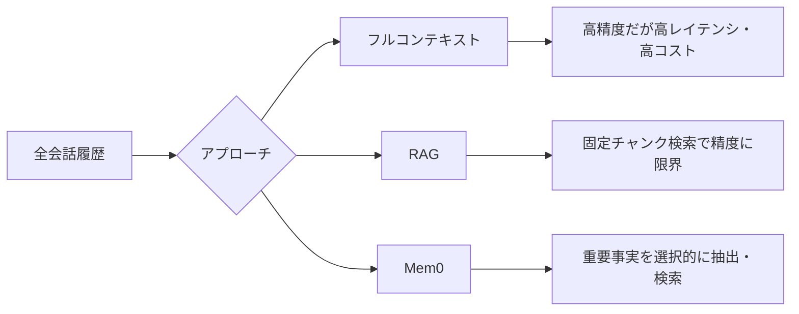
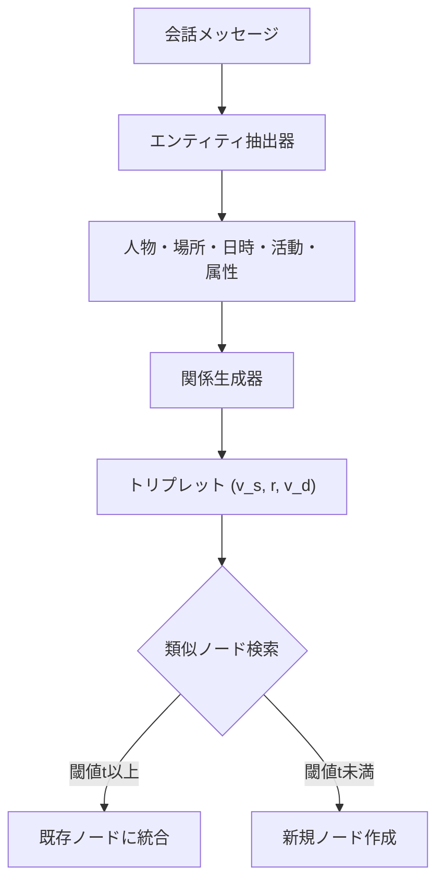

本記事は [Mem0: Building Production-Ready AI Agents with Scalable Long-Term Memory](https://arxiv.org/abs/2504.19413) の解説記事です。

## 論文概要（Abstract）

LLMは文脈に沿った応答の生成に優れるが、固定長のコンテキストウィンドウが長期にわたるマルチセッション対話での一貫性維持を困難にしている。Mem0は会話から重要な情報を動的に抽出・統合・検索するメモリ中心のアーキテクチャであり、拡張版のMem0gはグラフベースのメモリ表現によって複雑な関係構造の捕捉を可能にする。LoCoMoベンチマークにおいて、著者らはMem0がOpenAIのメモリ機能に対しLLM-as-a-Judge指標で26%の相対改善を達成し、フルコンテキスト手法と比較してp95レイテンシを91%削減、トークンコストを90%以上削減したと報告している。

この記事は [Zenn記事: Mem0×Gemini 3.8 Flashで長期記憶チャットボットを構築しトークンを72%削減する](https://zenn.dev/0h_n0/articles/2f2a6e4179b88f) の深掘りです。

## 情報源

- **arXiv ID**: 2504.19413
- **URL**: [https://arxiv.org/abs/2504.19413](https://arxiv.org/abs/2504.19413)
- **著者**: Prateek Chhikara, Dev Khant, Saket Aryan, Taranjeet Singh, Deshraj Yadav
- **発表年**: 2025（ECAI 2025 採択）
- **分野**: cs.CL, cs.AI

## 背景と動機（Background & Motivation）

LLMの固定長コンテキストウィンドウは、マルチセッション対話での情報一貫性維持を困難にする。フルコンテキスト手法はレイテンシとコストでスケールせず、RAGは固定チャンク検索のためユーザ固有の重要事実の選択的取得に不向きである。MemGPTやMemoryBank等の既存手法はプロダクション環境での低レイテンシ・コスト効率を十分に考慮していなかった。著者らは抽出・統合・検索の3段階パイプラインによるスケーラブルなアーキテクチャを提案している。



## 主要な貢献（Key Contributions）

- **貢献1: 動的メモリパイプライン** — 会話からの重要情報の抽出、既存メモリとの統合（ADD/UPDATE/DELETE/NOOP）、意味的類似度に基づく検索を一貫して処理するアーキテクチャを設計した。
- **貢献2: グラフベースメモリ拡張（Mem0g）** — エンティティをノード、関係をエッジとする有向ラベル付きグラフによるメモリ表現を導入し、時系列推論で基本版より約2.6ポイントの性能向上を実現した。
- **貢献3: プロダクション指標での評価** — 精度だけでなく検索レイテンシ（p50/p95）、トークン消費量、メモリ構築時間など実運用上の指標を体系的に評価した。

## 技術的詳細（Technical Details）

### Mem0のメモリパイプライン

Mem0のアーキテクチャは抽出フェーズと更新フェーズの2段階で構成される。

#### 抽出フェーズ

ユーザとアシスタントのメッセージペア $(m_{t-1}, m_t)$ を入力として、2つの文脈情報を組み合わせてメモリを抽出する。

$$
\Omega = \varphi(P(m_{t-1}, m_t, S, \{m_{t-m}, \ldots, m_{t-2}\}))
$$

ここで、
- $\Omega = \{\omega_1, \omega_2, \ldots, \omega_n\}$: 抽出されたメモリの集合
- $\varphi$: LLMによる抽出関数
- $P$: プロンプトテンプレート
- $S$: データベースに保存された会話サマリ
- $m$: 直近メッセージのウィンドウサイズ（$m=10$）

直近メッセージとサマリの双方を文脈とすることで、局所的な文脈と全体的な流れの両方を捕捉する。

#### 更新フェーズ

抽出された各メモリ $\omega_i$ について、既存のメモリストアから意味的類似度の高い上位 $s$ 件（$s=10$）を取得し、LLMのfunction calling機能を用いて以下の4つの操作のいずれかを決定する。

| 操作 | 条件 | 処理内容 |
|------|------|---------|
| ADD | 既存メモリに意味的等価物が存在しない | 新規メモリとして追加 |
| UPDATE | 既存メモリを補完する情報がある | 既存メモリに情報を追加・修正 |
| DELETE | 既存メモリと矛盾する | 矛盾するメモリを削除 |
| NOOP | 変更不要 | 何も行わない |

これによりメモリストアは常に最新かつ矛盾のない状態に維持される。

### Mem0g: グラフベースメモリ拡張

Mem0gはMem0のメモリ表現をグラフ構造に拡張したものであり、有向ラベル付きグラフ $G = (V, E, L)$ として定義される。

- $V$: エンティティ（人物、場所、概念）を表すノードの集合
- $E \subseteq V \times V$: エンティティ間の関係を表すエッジの集合
- $L$: 各エッジに付与される意味的ラベルの集合

#### 2段階の抽出プロセス



1. **エンティティ抽出器**: 会話から人物、場所、日時、活動、属性などの情報要素を特定する
2. **関係生成器**: 抽出されたエンティティ間の関係をトリプレット $(v_s, r, v_d)$ として導出する（$v_s$: ソースエンティティ、$r$: 関係ラベル、$v_d$: デスティネーションエンティティ）

#### ストレージと更新戦略

エンティティの埋め込みベクトルを計算し、類似度が閾値 $t$ を超える場合は既存ノードに統合する。矛盾する関係は「無効」マークで時系列推論を保全する。グラフDBにはNeo4jを使用している。

#### 双方向検索メカニズム

Mem0gでは2種類の検索戦略を併用する。

1. **エンティティ中心検索**: クエリからエンティティを識別し、当該ノードの入出エッジを探索して関連するメモリを取得する
2. **セマンティックトリプレット検索**: クエリ全体を密ベクトルにエンコードし、保存されたトリプレットとの類似度で検索する

## アルゴリズム（Algorithm）

### メモリ抽出・統合パイプライン

```python
from dataclasses import dataclass
from enum import Enum
from typing import Optional

class MemoryOp(Enum):
    """メモリ操作の種別"""
    ADD = "add"
    UPDATE = "update"
    DELETE = "delete"
    NOOP = "noop"

def extract_memories(
    current_pair: tuple[str, str],
    recent_messages: list[str],
    conversation_summary: str,
    llm: "LLMClient",
    m: int = 10,
) -> list[str]:
    """会話ペアからメモリを抽出する

    Args:
        current_pair: (user_message, assistant_response)
        recent_messages: 直近m件のメッセージ
        conversation_summary: 会話全体のサマリ
        llm: LLMクライアント
        m: 直近メッセージのウィンドウサイズ

    Returns:
        抽出されたメモリのリスト
    """
    context = recent_messages[-m:]
    prompt = build_extraction_prompt(current_pair, context, conversation_summary)
    return llm.extract(prompt)

def consolidate_memory(
    new_memory: str,
    existing_memories: list["Memory"],
    llm: "LLMClient",
    s: int = 10,
) -> tuple[MemoryOp, Optional[str]]:
    """新規メモリを既存メモリと統合する（function callingで操作を決定）"""
    top_s = retrieve_similar(new_memory, existing_memories, top_k=s)
    decision = llm.function_call(
        prompt=build_consolidation_prompt(new_memory, top_s),
        functions=["add", "update", "delete", "noop"],
    )
    return MemoryOp(decision.operation), decision.content
```

### Mem0gのグラフ更新

```python
@dataclass
class Triple:
    """グラフメモリのトリプレット (source, relation, destination)"""
    source: str
    relation: str
    destination: str
    valid: bool = True

def update_graph_memory(
    triples: list[Triple],
    graph_db: "Neo4jClient",
    embed_fn: "EmbeddingFunction",
    threshold: float = 0.85,
) -> None:
    """トリプレットをグラフDBに統合する（類似ノードは統合、矛盾は無効化）"""
    for triple in triples:
        src_emb, dst_emb = embed_fn(triple.source), embed_fn(triple.destination)
        src_node = graph_db.find_similar_node(src_emb, threshold) \
                   or graph_db.create_node(triple.source, src_emb)
        dst_node = graph_db.find_similar_node(dst_emb, threshold) \
                   or graph_db.create_node(triple.destination, dst_emb)
        for edge in graph_db.find_conflicting_edges(src_node, dst_node):
            edge.valid = False  # 矛盾する関係を無効化（時系列保全）
        graph_db.create_edge(src_node, triple.relation, dst_node)
```

## 実装のポイント（Implementation）

著者らは推論・抽出にGPT-4o-miniを、埋め込みにtext-embedding-3-smallを使用しており、温度パラメータは再現性のため0に設定している。実装上の留意点は以下の通りである。

- **ウィンドウサイズの調整**: 直近メッセージ数 $m=10$ と類似メモリ取得数 $s=10$ はLoCoMoベンチマークでの実験に基づく設定であり、ドメインや対話の長さに応じた調整が必要となる
- **メモリ統合のプロンプト設計**: ADD/UPDATE/DELETE/NOOPの判定はLLMのfunction callingに依存するため、プロンプトの質が統合精度を左右する。特にUPDATEとADDの境界判定が難しく、既存メモリとの意味的類似度の閾値設計が重要である
- **Mem0gのレイテンシトレードオフ**: Mem0gはp50検索レイテンシが0.476秒とMem0（0.148秒）の約3.2倍であり、グラフ操作のオーバーヘッドが存在する。時系列推論が不要な用途ではMem0基本版の方が適している
- **Neo4jのスキーマ設計**: エンティティノードの統合閾値 $t$ が低すぎると異なるエンティティが統合され、高すぎると重複ノードが増加する

## Production Deployment Guide

### AWS実装パターン（コスト最適化重視）

Mem0のメモリパイプラインをAWSにデプロイする際の構成を、トラフィック量別に示す。コスト試算は2026年9月時点のap-northeast-1（東京）リージョン料金に基づく概算値であり、実際のコストはトラフィックパターンやバースト使用量により変動する。

| 構成 | トラフィック | 主要サービス | 月額概算 |
|------|------------|------------|---------|
| Small | ~100 req/日 | Lambda + DynamoDB + Bedrock | $50-150 |
| Medium | ~1,000 req/日 | ECS Fargate + ElastiCache + Aurora Serverless | $300-800 |
| Large | 10,000+ req/日 | EKS + Karpenter + Neptune + OpenSearch | $2,000-5,000 |

**Small**: Lambda + DynamoDB(On-Demand) + Bedrock(Claude 3.5 Haiku) + Titan Embeddings。**Medium**: ECS Fargate(0.5vCPU x2) + ElastiCache(Redis) + Aurora Serverless v2。**Large**: EKS + Karpenter/Spot + Neptune(Mem0g用) + OpenSearch Service。

コスト削減: Spot Instances（最大90%削減）、Reserved Instances 1年コミット（72%削減）、Bedrock Batch API（50%削減）、Prompt Caching（30-90%削減）。

### Terraformインフラコード

**Small構成（Serverless）** --- Lambda + DynamoDB + Bedrock:

```hcl
resource "aws_dynamodb_table" "mem0_memories" {
  name         = "mem0-memories"
  billing_mode = "PAY_PER_REQUEST"  # On-Demand: 低トラフィックに最適
  hash_key     = "user_id"
  range_key    = "memory_id"
  attribute { name = "user_id";  type = "S" }
  attribute { name = "memory_id"; type = "S" }
  server_side_encryption { enabled = true }
  point_in_time_recovery { enabled = true }
}

resource "aws_iam_role_policy" "mem0_bedrock" {
  role = aws_iam_role.mem0_lambda.id
  policy = jsonencode({
    Version = "2012-10-17"
    Statement = [
      { Effect = "Allow", Action = ["bedrock:InvokeModel"],
        Resource = "arn:aws:bedrock:ap-northeast-1::foundation-model/*" },
      { Effect = "Allow",
        Action = ["dynamodb:GetItem","dynamodb:PutItem",
                  "dynamodb:UpdateItem","dynamodb:DeleteItem","dynamodb:Query"],
        Resource = aws_dynamodb_table.mem0_memories.arn }
    ]
  })
}

resource "aws_lambda_function" "mem0_pipeline" {
  function_name = "mem0-memory-pipeline"
  runtime       = "python3.12"
  handler       = "handler.lambda_handler"
  role          = aws_iam_role.mem0_lambda.arn
  timeout       = 60
  memory_size   = 512
  environment {
    variables = {
      DYNAMODB_TABLE = aws_dynamodb_table.mem0_memories.name
      BEDROCK_MODEL  = "anthropic.claude-3-5-haiku-20241022-v1:0"
    }
  }
  tracing_config { mode = "Active" }  # X-Ray有効化
}
```

**Large構成（Container）** --- EKS + Karpenter + Spot:

```hcl
module "eks" {
  source          = "terraform-aws-modules/eks/aws"
  version         = "~> 20.0"
  cluster_name    = "mem0-cluster"
  cluster_version = "1.31"
  vpc_id          = module.vpc.vpc_id
  subnet_ids      = module.vpc.private_subnets
  cluster_endpoint_public_access = false  # プライベートアクセスのみ
}

resource "kubectl_manifest" "karpenter_nodepool" {
  yaml_body = yamlencode({
    apiVersion = "karpenter.sh/v1"
    kind       = "NodePool"
    metadata   = { name = "mem0-spot" }
    spec = {
      template.spec.requirements = [
        { key = "karpenter.sh/capacity-type", operator = "In",
          values = ["spot", "on-demand"] },
        { key = "node.kubernetes.io/instance-type", operator = "In",
          values = ["m7i.xlarge", "m7a.xlarge", "m6i.xlarge"] }
      ]
      limits     = { cpu = "64", memory = "256Gi" }
      disruption = { consolidationPolicy = "WhenEmptyOrUnderutilized" }
    }
  })
}

resource "aws_budgets_budget" "mem0_monthly" {
  name         = "mem0-monthly-budget"
  budget_type  = "COST"
  limit_amount = "5000"
  limit_unit   = "USD"
  time_unit    = "MONTHLY"
  notification {
    comparison_operator       = "GREATER_THAN"
    threshold                 = 80
    threshold_type            = "PERCENTAGE"
    notification_type         = "ACTUAL"
    subscriber_email_addresses = ["ops-team@example.com"]
  }
}
```

セキュリティ要件: IAMロールは最小権限の原則に従い、Secrets Managerでシークレットを管理する。S3/DynamoDB/EBSは全てKMS暗号化を有効化し、CloudTrail/Configで監査ログを記録する。

### 運用・監視設定

**CloudWatch Logs Insights クエリ**（トークン異常検知）:

```
fields @timestamp, @message
| filter @message like /bedrock/
| stats sum(input_tokens) as total_input, sum(output_tokens) as total_output by bin(1h)
| filter total_input > 100000
| sort @timestamp desc
```

**X-Ray トレーシング + Cost Explorer レポート**:

```python
from aws_xray_sdk.core import xray_recorder, patch_all
import boto3
from datetime import date, timedelta

patch_all()  # boto3自動計装

@xray_recorder.capture("mem0_extract")
def extract_and_consolidate(
    user_msg: str, assistant_msg: str, user_id: str
) -> list[str]:
    """メモリ抽出・統合をX-Rayでトレースする"""
    xray_recorder.current_subsegment().put_annotation("user_id", user_id)
    # ... 抽出・統合処理
    return []

def daily_cost_report() -> dict[str, float]:
    """日次コストレポートを取得し$100/日超過でSNS通知する"""
    ce = boto3.client("ce", region_name="us-east-1")
    today = date.today()
    resp = ce.get_cost_and_usage(
        TimePeriod={"Start": (today - timedelta(days=1)).isoformat(),
                    "End": today.isoformat()},
        Granularity="DAILY", Metrics=["UnblendedCost"],
        Filter={"Dimensions": {"Key": "SERVICE",
                "Values": ["Amazon Bedrock", "AWS Lambda"]}},
        GroupBy=[{"Type": "DIMENSION", "Key": "SERVICE"}],
    )
    costs = {g["Keys"][0]: float(g["Metrics"]["UnblendedCost"]["Amount"])
             for g in resp["ResultsByTime"][0]["Groups"]}
    if sum(costs.values()) > 100:
        boto3.client("sns", region_name="ap-northeast-1").publish(
            TopicArn="arn:aws:sns:ap-northeast-1:ACCOUNT:mem0-cost-alert",
            Message=f"Daily cost: ${sum(costs.values()):.2f}")
    return costs
```

### コスト最適化チェックリスト

**アーキテクチャ**: トラフィック量で構成選択（Serverless/Hybrid/Container）、時系列推論不要ならMem0基本版

**リソース最適化**: Spot Instances優先（90%削減）、Reserved Instances 1年コミット（72%削減）、Savings Plans検討、Lambdaメモリ512-1024MBで検証、アイドル時スケールダウン

**LLMコスト削減**: Bedrock Batch APIでオフライン処理（50%削減）、Prompt Caching（30-90%削減）、ADD/NOOPはHaiku・UPDATEはSonnetに振り分け、トークン数制限

**監視**: AWS Budgets月次アラート、CloudWatchアラーム、Cost Anomaly Detection、日次レポート+SNS

**リソース管理**: 未使用リソース削除、`Project=mem0`タグ、メモリアーカイブポリシー、開発環境夜間停止、Logs保持期間最適化

## 実験結果（Results）

### LoCoMoベンチマークでの性能比較

LoCoMoベンチマークは平均600ターン・約26,000トークンの長期対話10件で構成される。著者らは論文Table 1で以下の結果を報告している（LLM-as-a-Judge: 事実正確性・関連性・完全性・文脈適切性の4軸、10回の平均$\pm$1$\sigma$）。

| 手法 | Single-hop (J) | Multi-hop (J) | Open-domain (J) | Temporal (J) |
|------|---------------|---------------|-----------------|-------------|
| Mem0 | 67.13$\pm$0.65 | **51.15**$\pm$0.31 | 72.93$\pm$0.11 | 55.51$\pm$0.34 |
| Mem0g | 65.71$\pm$0.45 | 47.19$\pm$0.67 | 75.71$\pm$0.21 | **58.13**$\pm$0.44 |
| Zep | 61.70$\pm$0.32 | — | **76.60**$\pm$0.13 | — |
| A-Mem | — | — | — | 49.91$\pm$0.31 |

Single-hop/Multi-hopではMem0基本版が優位であり、密な自然言語メモリが事実検索に適していることを示す。Temporalではグラフ構造が有効でMem0gが2.6ポイント高い。Open-domainではZepが僅差（0.89ポイント差）で優位である。

### レイテンシとコスト効率

論文Table 2より、デプロイメント指標を示す。

| 手法 | 検索p95 (秒) | 総合p95 (秒) | J (%) |
|------|-------------|-------------|-------|
| Mem0 | 0.200 | 1.440 | 66.88 |
| Mem0g | 0.657 | 2.590 | 68.44 |
| Full-context | — | 17.117 | 72.90 |
| RAG (k=2, 256) | — | 1.907 | 60.97 |

Mem0はフルコンテキスト手法に対してp95総合レイテンシを91%削減している（1.440秒 vs 17.117秒）。トークン消費量はMem0が約7,000、Mem0gが約14,000、Zepが600,000以上であり、Mem0は90%以上のコスト削減を実現している。メモリ構築時間はMem0が1分未満、Zepは数時間を要すると報告されている。

## 実運用への応用（Practical Applications）

Mem0のアーキテクチャは長期的なユーザコンテキスト維持が求められるシステムに適用可能である。パーソナライズドチャットボット（Zenn記事のMem0×Gemini構成がこの実装例）、カスタマーサポートエージェント（問い合わせ履歴・購入製品の記憶）、教育用AIチューター（学習進捗の追跡）が代表的なユースケースである。

ただし著者らの実験はLoCoMoベンチマーク（10件の会話データ）に限定されており、大規模環境でのメモリ増大に伴うスケーラビリティ検証は今後の課題である。メモリ抽出・統合にLLMを使用するため、LLM呼び出しのコストとレイテンシがシステム全体の制約となりうる点にも注意が必要である。

## 関連研究（Related Work）

- **MemGPT** (Packer et al., 2023): 仮想メモリ階層でLLMが自律的にメモリ管理を行う。Mem0はこのアイデアを発展させ、明示的な抽出・統合パイプラインでプロダクション対応のレイテンシを実現している
- **A-Mem** (Yu et al., 2025): Zettelkasten着想の自律メモリモジュール。temporal推論J=49.91だが、Mem0g（J=58.13）には及ばない
- **ReadAgent** (Lee et al., 2024): ページ単位の読解戦略による長文理解。動的更新機能がなくマルチセッション対話には制約がある

## まとめと今後の展望

Mem0は抽出・統合・検索の3段階パイプラインにより、プロダクション水準のレイテンシとコスト効率で長期対話を実現する。Mem0gはグラフ構造で時系列推論を強化するが、レイテンシ増加のトレードオフがある。著者らは今後の方向としてMem0gのレイテンシ最適化、階層的アーキテクチャ、マルチモーダル拡張を挙げている。

## 参考文献

- **arXiv**: [https://arxiv.org/abs/2504.19413](https://arxiv.org/abs/2504.19413)
- **Code**: [https://github.com/mem0ai/mem0](https://github.com/mem0ai/mem0)
- **Zenn記事**: [https://zenn.dev/0h_n0/articles/2f2a6e4179b88f](https://zenn.dev/0h_n0/articles/2f2a6e4179b88f)
- **LoCoMo**: Maharana et al., ACL 2024
- **MemGPT**: Packer et al., 2023
- **A-Mem**: Yu et al., 2025
