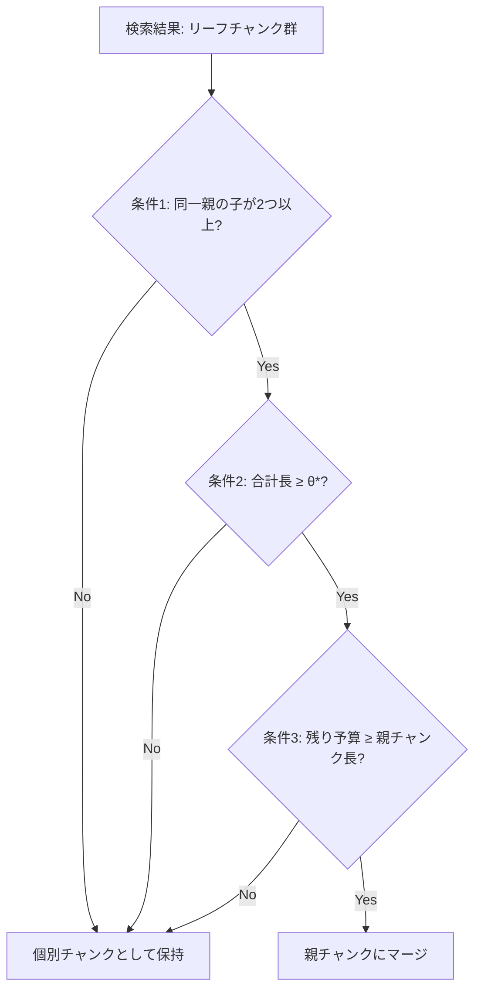

## 論文概要（Abstract）

本記事は [arXiv:2509.11552](https://arxiv.org/abs/2509.11552)（Lu et al., 2025）の解説記事です。

RAGシステムにおいて文書チャンキングは検索精度を左右する重要な工程であるにもかかわらず、その評価手法は未整備だった。著者らはチャンキング手法を体系的に評価するベンチマーク**HiCBench**と、階層的チャンク構造＋Auto-Merge検索を組み合わせたフレームワーク**HiChunk**を提案している。HiChunkはファインチューニング済み言語モデルで文書を複数階層に構造化し、検索時にはAuto-Merge アルゴリズムで子チャンクを親チャンクへ動的に統合する。実験では既存のFixed-size・Semantic・LLMベースのチャンキング手法と比較し、Evidence RecallおよびFact-Covメトリクスで一貫した改善を報告している。

この記事は [Zenn記事: Haystackの文書前処理パイプラインでQA検索精度を段階改善する](https://zenn.dev/0h_n0/articles/17ae57aaf8443b) の深掘りです。

## 情報源

- **arXiv ID**: 2509.11552
- **URL**: [https://arxiv.org/abs/2509.11552](https://arxiv.org/abs/2509.11552)
- **著者**: Wensheng Lu, Keyu Chen, Ruizhi Qiao, Xing Sun
- **発表年**: 2025
- **分野**: cs.CL（Computation and Language）
- **ページ数**: 17ページ、5図、6表

## 背景と動機（Background & Motivation）

RAG（Retrieval-Augmented Generation）では、文書をチャンクに分割してベクトルDBに格納し、クエリに類似するチャンクを検索してLLMに渡す。このチャンキング工程は検索品質に直結するが、著者らは既存ベンチマークに2つの課題を指摘している。第一に、既存のQAベンチマーク（NaturalQuestions等）はエビデンスが疎（1〜2文）であり、チャンクサイズを変えても検索結果に差が出にくい。第二に、チャンキング手法のRAGパイプライン全体への影響を測定するエンドツーエンドの評価枠組みが不足している。この2点を解決するため、エビデンス密度の高いQAペアを持つHiCBenchと、階層構造を活用するHiChunkフレームワークを提案している。

## 主要な貢献（Key Contributions）

- **HiCBenchベンチマーク**: 手動で多階層の文書構造アノテーションを付与し、エビデンス密度の異なる3タイプのQAペア（T₀/T₁/T₂）を構築した評価基盤
- **HiChunkフレームワーク**: ファインチューニング済みLM（Qwen3-4B）による階層的文書構造認識と、動的閾値によるAuto-Merge検索アルゴリズム
- **体系的比較**: Fixed-size、Semantic Chunker、LumberChunkerなど既存手法との定量比較と、チャンク精度・検索精度・応答品質の各段階での評価

## 技術的詳細（Technical Details）

### HiCBenchの設計

HiCBenchでは、エビデンス密度に応じて3種類のタスクを定義している。

| タスクタイプ | エビデンス特性 | チャンクサイズ |
|---|---|---|
| T₀（Evidence-Sparse） | 1〜2文のエビデンス | — |
| T₁（Single-Chunk Dense） | 512〜4096語のチャンク内に密集 | 512–4096語 |
| T₂（Multi-Chunk Dense） | 256〜2048語の複数チャンクに分散 | 256–2048語 |

QAペアの生成にはLLMを使用し、品質フィルタとして**Fact-Cov**メトリクスを導入している。これは全文コンテキストから生成した応答の事実カバレッジが5回の試行中80%以上であることを条件としている。エビデンス抽出はLLMを5回反復し、4回以上出現した文のみを採用するコンセンサス投票方式を取る。

### 階層的文書構造化

HiChunkフレームワークの第一段階では、文書を文単位にトークナイズした後、ファインチューニング済みLM（Qwen3-4Bベース）が各文境界でチャンキングポイントを識別する。モデルはGov-report、Qasper、Wiki-727の3データセットで訓練されている。

```python
# HiChunkの階層構造化の概念的な処理フロー
def hierarchical_chunking(document: str, model, levels: list[int]) -> dict:
    """文書を階層的にチャンク分割する

    Args:
        document: 入力文書テキスト
        model: チャンキングポイント識別用のファインチューニング済みLM
        levels: 階層レベルのリスト（例: [1, 2]）

    Returns:
        階層構造を持つチャンク辞書
    """
    sentences = tokenize_sentences(document)
    chunk_points = model.predict_boundaries(sentences, levels=levels)

    hierarchy = {}
    for level in levels:
        boundaries = chunk_points[level]
        hierarchy[f"L{level}"] = split_at_boundaries(sentences, boundaries)

    return hierarchy
```

長文書（最大推論長16,384トークン超）に対しては、オーバーラップ付きセグメント分割で局所的なチャンクポイントを推定し、グローバルに統合する反復推論手法を採用している。単一のL1チャンクしか存在しない場合には、既知の構造情報から残余テキスト行を参照して階層判定を補正する「階層ドリフト防止」機構を備える。

**訓練設定**:
- 学習率: $1 \times 10^{-5}$
- バッチサイズ: 64
- 最大訓練長: 8,192トークン
- 最大推論長: 16,384トークン

### Auto-Merge検索アルゴリズム

Auto-Merge検索は、リーフ（子チャンク）レベルで検索されたチャンクを、条件を満たす場合に親チャンクへ動的に統合するポスト処理アルゴリズムである。クエリランク順にチャンクを走査し、以下の3条件をすべて満たすとき親チャンクへマージする。

**条件1**: 親チャンク $p$ の子チャンクのうち、検索結果に含まれるものが2つ以上存在する

**条件2**: 検索結果に含まれる子チャンクの合計長が適応的閾値 $\theta^*$ 以上である

$$
\sum_{n \in (\text{node}_{\text{ret}} \cap p.\text{children})} \text{len}(n) \geq \theta^*(tk_{\text{cur}}, p)
$$

ここで適応的閾値 $\theta^*$ は以下で定義される：

$$
\theta^*(tk_{\text{cur}}, p) = \frac{\text{len}(p)}{3} \times \left(1 + \frac{tk_{\text{cur}}}{T}\right)
$$

- $tk_{\text{cur}}$: 現在のトークン使用量
- $T$: トークン予算の上限
- $\text{len}(p)$: 親チャンクの長さ

この閾値は $\text{len}(p)/3$ から $2 \times \text{len}(p)/3$ まで動的に変化する。トークン予算の消費が少ない段階では閾値が低く設定され、高ランクのチャンクから優先的にマージが行われる。

**条件3**: 残りトークン予算が親チャンクの長さ以上である

$$
T - tk_{\text{cur}} \geq \text{len}(p)
$$



Zenn記事で解説されているHaystackの`AutoMergingRetriever`は`threshold`パラメータで子チャンクのヒット割合を固定閾値で判定するが、HiChunkのAuto-Mergeはトークン予算に応じて閾値を動的に調整する点が異なる。これにより、高ランクチャンクには積極的にマージを適用し、低ランクではマージを抑制するランク感度の高い検索が実現される。

## 実験結果（Results）

### チャンキング精度（F1スコア）

著者らはチャンキングの境界検出精度をF1スコアで評価している（論文Table 3より）。

| データセット | F1(L₁) | F1(L₂) | F1(全体) |
|---|---|---|---|
| Qasper | 0.6742 | 0.5169 | 0.9441 |
| Gov-Report | 0.9505 | 0.8895 | 0.9882 |
| HiCBench | 0.4841 | 0.3140 | 0.5450 |

Gov-Reportでは全体F1が0.99に迫る高精度を達成しているが、HiCBenchでは0.55と相対的に低い。著者らはこれをHiCBenchの文書構造の多様性に起因すると分析している。

### RAGパイプライン性能（HiCBench T₁タスク、Qwen3-32Bによる回答生成）

論文Table 5より、トークン予算ごとの比較結果を示す。

| 手法 | Evidence Recall | Fact-Cov | Rouge-L |
|---|---|---|---|
| FC200（Fixed 200語） | 74.06 | 63.20 | 35.70 |
| SC（Semantic Chunker） | 72.83 | 62.45 | 34.91 |
| LC（LumberChunker） | 75.21 | 64.78 | 36.12 |
| **HC200+AM（HiChunk + Auto-Merge）** | **81.03** | **68.12** | **37.29** |

HC200+AMはFixed-sizeに対してEvidence Recallで+6.97ポイント、Fact-Covで+4.92ポイントの改善を報告している。

### 処理速度

論文Table 6より、1文書あたりの処理時間を比較する。

| 手法 | 処理時間（秒/文書） |
|---|---|
| Semantic Chunker | 3.09 |
| HiChunk | 14.58 |
| LumberChunker | 37.39 |

HiChunkはSemantic Chunkerの約4.7倍の処理時間を要するが、LumberChunker（LLMベース）の約2.6倍高速である。ファインチューニング済みの小型LMを使用することで、LLMベースの手法より計算コストを抑えている。

## 実装のポイント（Implementation）

**階層レベル数の選択**: 著者らの実験ではL1〜L4（さらに無制限のLA）を検証し、L3までEvidence Recallが改善した後プラトーに達すると報告している。実用上はL1-L2の2階層構成が精度と計算コストのバランスに優れる。

**トークン予算の設定**: Auto-Mergeの動的閾値はトークン予算$T$に依存する。著者らは2k、2.5k、3k、3.5k、4kトークンで評価しており、3k〜4kの範囲が安定した性能を示している。

**ファインチューニングの代替**: Qwen3-4Bのファインチューニングが困難な場合、Haystackの`HierarchicalDocumentSplitter`で`block_sizes`を設定し、`AutoMergingRetriever`の`threshold`パラメータで閾値を固定する構成が簡易的な代替となる。HiChunkの動的閾値ほどの柔軟性はないが、実装コストは大幅に低い。

## Production Deployment Guide

### AWS実装パターン（コスト最適化重視）

**トラフィック量別の推奨構成**:

| 規模 | 月間リクエスト | 推奨構成 | 月額コスト | 主要サービス |
|------|--------------|---------|-----------|------------|
| **Small** | ~3,000 (100/日) | Serverless | $50-150 | Lambda + Bedrock + DynamoDB |
| **Medium** | ~30,000 (1,000/日) | Hybrid | $300-800 | Lambda + ECS Fargate + ElastiCache |
| **Large** | 300,000+ (10,000/日) | Container | $2,000-5,000 | EKS + Karpenter + EC2 Spot |

**Small構成の詳細** (月額$50-150):
- **Lambda**: 1GB RAM, 60秒タイムアウト ($20/月)
- **Bedrock**: Claude 3.5 Haiku, Prompt Caching有効 ($80/月)
- **DynamoDB**: On-Demand ($10/月)
- **CloudWatch**: 基本監視 ($5/月)
- **API Gateway**: REST API ($5/月)

**コスト削減テクニック**:
- Spot Instances使用で最大90%削減（EKS + Karpenter）
- Bedrock Batch API使用で50%削減
- Prompt Caching有効化で30-90%削減

**コスト試算の注意事項**: 上記は2026年9月時点のAWS ap-northeast-1（東京）リージョン料金に基づく概算値です。実際のコストはトラフィックパターン、リージョン、バースト使用量により変動します。最新料金は [AWS料金計算ツール](https://calculator.aws/) で確認してください。

### Terraformインフラコード

**Small構成 (Serverless): Lambda + Bedrock + DynamoDB**

```hcl
module "vpc" {
  source  = "terraform-aws-modules/vpc/aws"
  version = "~> 5.0"

  name = "hichunk-rag-vpc"
  cidr = "10.0.0.0/16"
  azs  = ["ap-northeast-1a", "ap-northeast-1c"]
  private_subnets = ["10.0.1.0/24", "10.0.2.0/24"]

  enable_nat_gateway   = false
  enable_dns_hostnames = true
}

resource "aws_iam_role" "lambda_bedrock" {
  name = "hichunk-lambda-bedrock-role"

  assume_role_policy = jsonencode({
    Version = "2012-10-17"
    Statement = [{
      Action    = "sts:AssumeRole"
      Effect    = "Allow"
      Principal = { Service = "lambda.amazonaws.com" }
    }]
  })
}

resource "aws_iam_role_policy" "bedrock_invoke" {
  role = aws_iam_role.lambda_bedrock.id
  policy = jsonencode({
    Version = "2012-10-17"
    Statement = [{
      Effect   = "Allow"
      Action   = ["bedrock:InvokeModel", "bedrock:InvokeModelWithResponseStream"]
      Resource = "arn:aws:bedrock:ap-northeast-1::foundation-model/anthropic.claude-3-5-haiku*"
    }]
  })
}

resource "aws_lambda_function" "rag_handler" {
  filename      = "lambda.zip"
  function_name = "hichunk-rag-handler"
  role          = aws_iam_role.lambda_bedrock.arn
  handler       = "index.handler"
  runtime       = "python3.12"
  timeout       = 60
  memory_size   = 1024

  environment {
    variables = {
      BEDROCK_MODEL_ID    = "anthropic.claude-3-5-haiku-20241022-v1:0"
      DYNAMODB_TABLE      = aws_dynamodb_table.chunk_cache.name
      ENABLE_PROMPT_CACHE = "true"
    }
  }
}

resource "aws_dynamodb_table" "chunk_cache" {
  name         = "hichunk-chunk-cache"
  billing_mode = "PAY_PER_REQUEST"
  hash_key     = "chunk_hash"

  attribute {
    name = "chunk_hash"
    type = "S"
  }

  ttl {
    attribute_name = "expire_at"
    enabled        = true
  }
}
```

### セキュリティベストプラクティス

- **IAMロール**: 最小権限の原則（Bedrock InvokeModelのみ許可）
- **ネットワーク**: Lambda VPC内配置、パブリックサブネット不使用
- **シークレット管理**: AWS Secrets Manager使用、環境変数へのハードコード禁止
- **暗号化**: S3/DynamoDB全てKMS暗号化

### 運用・監視設定

**CloudWatch Logs Insights クエリ**:

```sql
fields @timestamp, model_id, input_tokens, output_tokens
| stats sum(input_tokens + output_tokens) as total_tokens by bin(1h)
| filter total_tokens > 100000
```

**CloudWatch アラーム**:

```python
import boto3

cloudwatch = boto3.client('cloudwatch')
cloudwatch.put_metric_alarm(
    AlarmName='hichunk-token-spike',
    ComparisonOperator='GreaterThanThreshold',
    EvaluationPeriods=1,
    MetricName='TokenUsage',
    Namespace='AWS/Bedrock',
    Period=3600,
    Statistic='Sum',
    Threshold=500000,
    ActionsEnabled=True,
    AlarmActions=['arn:aws:sns:ap-northeast-1:123456789:cost-alerts'],
    AlarmDescription='Bedrockトークン使用量異常'
)
```

### コスト最適化チェックリスト

- [ ] ~100 req/日 → Lambda + Bedrock (Serverless) - $50-150/月
- [ ] ~1000 req/日 → ECS Fargate + Bedrock (Hybrid) - $300-800/月
- [ ] 10000+ req/日 → EKS + Spot Instances (Container) - $2,000-5,000/月
- [ ] EC2: Spot Instances優先（最大90%削減、Karpenter自動管理）
- [ ] Reserved Instances: 1年コミットで72%削減
- [ ] Bedrock Batch API: 50%割引（非リアルタイム処理）
- [ ] Prompt Caching: 30-90%削減
- [ ] モデル選択: 開発はHaiku ($0.25/MTok)、本番複雑タスクはSonnet ($3/MTok)
- [ ] max_tokens設定で過剰生成防止
- [ ] AWS Budgets: 月額予算設定（80%で警告、100%でアラート）
- [ ] CloudWatch アラーム: トークン使用量スパイク検知
- [ ] Cost Anomaly Detection: 自動異常検知
- [ ] 未使用リソース削除: Lambda Insights, Trusted Advisor活用
- [ ] タグ戦略: 環境別（dev/staging/prod）でコスト可視化
- [ ] S3ライフサイクルポリシー: 古いキャッシュ30日で自動削除
- [ ] DynamoDB TTL: チャンクキャッシュの自動期限切れ
- [ ] Lambda メモリサイズ最適化（CloudWatch Insights分析）
- [ ] ECS/EKS: アイドル時スケールダウン（夜間0台）
- [ ] 日次コストレポート: SNS/Slackへ自動送信
- [ ] 開発環境: 夜間停止（Auto Start/Stop）

## 実運用への応用（Practical Applications）

HiChunkの階層チャンキング＋Auto-Merge検索は、Zenn記事で解説されているHaystackの`HierarchicalDocumentSplitter`＋`AutoMergingRetriever`パターンの学術的裏付けを与える。特にエビデンスが複数箇所に分散する長文書（技術マニュアル、法律文書、研究論文）では、階層構造を活用した検索が有効であることが実験的に示されている。

一方で、HiChunkの階層構造化にはファインチューニング済みLMが必要であり、Haystackの`HierarchicalDocumentSplitter`のようなルールベース（`block_sizes`指定）の手法と比較すると導入コストが高い。著者らの報告する処理時間（14.58秒/文書）は、リアルタイムのインデクシングには適さず、バッチ処理での利用が現実的である。

## 関連研究（Related Work）

- **LumberChunker**（EMNLP 2024 Findings）: LLMを用いて長文のナラティブテキストを自然な内容遷移で分割する手法。HiChunkはファインチューニング済み小型LMを使用することで処理速度を2.6倍改善している
- **RAPTOR**（2024）: 文書を再帰的にクラスタリング・要約して抽象度の異なる階層ツリーを構築する手法。QuALITYベンチマークで20ポイントの絶対精度向上を報告している
- **Late Chunking**（2024）: 長コンテキスト埋め込みモデルで文書全体をトークンレベルで埋め込んだ後にチャンク境界を適用する手法。事前のチャンキングによる文脈喪失を回避する

## まとめと今後の展望

HiChunkは階層的な文書構造認識とAuto-Merge検索の組み合わせにより、特にエビデンス密度の高い文書でのRAG検索品質を改善することを示した。Haystackの`HierarchicalDocumentSplitter`＋`AutoMergingRetriever`を使用しているユーザにとって、Auto-Mergeの閾値設計（特に動的閾値の考え方）と階層レベル数の選定に関する著者らの知見は実装の指針となる。今後の研究方向として、著者らはドメイン適応（法律・医療等の専門文書への汎化）と、マルチモーダル文書（表・図を含むPDF）への拡張を示唆している。

## 参考文献

- **arXiv**: [https://arxiv.org/abs/2509.11552](https://arxiv.org/abs/2509.11552)
- **Related Zenn article**: [https://zenn.dev/0h_n0/articles/17ae57aaf8443b](https://zenn.dev/0h_n0/articles/17ae57aaf8443b)
- **RAPTOR**: [https://arxiv.org/abs/2401.18059](https://arxiv.org/abs/2401.18059)
- **LumberChunker**: [https://arxiv.org/abs/2406.17526](https://arxiv.org/abs/2406.17526)

---

:::message
この記事はAI（Claude Code）により自動生成されました。内容の正確性については原論文と照合していますが、最新情報は公式ソースもご確認ください。
:::
