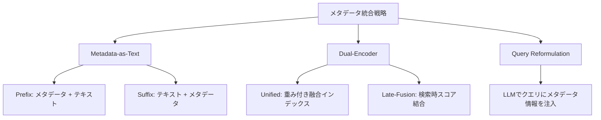

## 論文概要（Abstract）

本記事は [arXiv:2601.11863](https://arxiv.org/abs/2601.11863)（Yousuf et al., 2026、ECIR 2026採択）の解説記事です。

RAGシステムにおいて、チャンクの意味的類似度だけでは文書間のあいまいさを解消できない場合がある。特に規制文書や定型文書のように言語表現が重複するコーパスでは、メタデータ（企業名・年度・セクション等）を検索に組み込むことが重要になる。著者らは5つのメタデータ統合戦略を体系的に比較し、Prefix埋め込みとUnified Dual-Encoderが一貫してベースラインを上回ることを報告している。さらに、メタデータ統合が埋め込み空間に与える影響を理論的に分析し、文書内凝集度の向上・文書間混同の低減・関連/非関連チャンクの分離拡大という3つの効果を実証している。

この記事は [Zenn記事: Haystackの文書前処理パイプラインでQA検索精度を段階改善する](https://zenn.dev/0h_n0/articles/17ae57aaf8443b) の深掘りです。

## 情報源

- **arXiv ID**: 2601.11863
- **URL**: [https://arxiv.org/abs/2601.11863](https://arxiv.org/abs/2601.11863)
- **著者**: Raquib Bin Yousuf, Shengzhe Xu, Mandar Sharma, Andrew Neeser, Chris Latimer, Naren Ramakrishnan
- **発表年**: 2026
- **採択会議**: ECIR 2026（48th European Conference on Information Retrieval）
- **分野**: cs.IR（Information Retrieval）

## 背景と動機（Background & Motivation）

RAGの標準的なパイプラインでは、文書をチャンクに分割し、各チャンクを埋め込みベクトルに変換してベクトルDBに格納する。クエリもベクトル化してコサイン類似度で検索するが、著者らはこのアプローチに根本的な限界を指摘している。

規制文書（SEC 10-Kフォーム等）では、異なる企業・年度の文書が類似した表現を使用するため、チャンクのテキスト類似度だけでは「どの企業のどの年度の情報か」を識別できない。Zenn記事で解説されているHaystackの`meta_fields_to_embed`パラメータはまさにこの課題に対応する機能であり、本論文はその背後にある理論的根拠と複数のメタデータ統合戦略の体系的比較を提供する。

## 主要な貢献（Key Contributions）

- **5つのメタデータ統合戦略の体系的比較**: Metadata-as-Text（Prefix/Suffix）、Unified Dual-Encoder、Late-Fusion Dual-Encoder、Query-Side Reformulationの定量評価
- **埋め込み空間の理論的分析**: メタデータ統合が文書内凝集度・文書間混同・スコア分散に与える影響の数理的定式化（Proposition 1〜3）
- **RAGMATE-10Kデータセットの公開**: SEC 10-K文書25件、4,490チャンク、120評価クエリを含む公開ベンチマーク

## 技術的詳細（Technical Details）

### 5つのメタデータ統合戦略

著者らは以下の5戦略を定義・比較している。



#### 1. Metadata-as-Text（MaT）— Prefix / Suffix

最もシンプルな戦略。メタデータフィールドを文字列に変換してチャンクテキストに連結し、既存のテキスト埋め込みモデルでベクトル化する。

$$
\tilde{c}_i^{\text{pre}} = \text{concat}(s(m_i), c_i), \quad \tilde{c}_i^{\text{suf}} = \text{concat}(c_i, s(m_i))
$$

ここで $s(m_i)$ はメタデータのシリアライズ関数で、`"company:Apple;form:10-K;section:Risk Factors;year:2023"` のようなヘッダ文字列を生成する。Haystackの`meta_fields_to_embed`はこのPrefix方式に相当する。

$$
\text{Score}_{\text{MaT}}(q, i) = \cos(e_q, \tilde{e}_i) \quad \text{where} \quad \tilde{e}_i = f_\theta(\tilde{c}_i)
$$

#### 2. Unified Single-Index Dual-Encoder

テキストとメタデータをそれぞれ個別にエンコードし、L2正規化後に重み付き和で融合した単一インデックスを構築する。

$$
e_i^{\text{sum}}(\alpha) = \frac{\alpha \cdot \hat{e}_i^{\text{text}} + (1 - \alpha) \cdot \hat{e}_i^{\text{meta}}}{\|\alpha \cdot \hat{e}_i^{\text{text}} + (1 - \alpha) \cdot \hat{e}_i^{\text{meta}}\|_2}
$$

ここで $\alpha \in [0, 1]$ はテキストとメタデータの重みを制御するハイパーパラメータ、$\hat{e}_i^{\text{text}}$ と $\hat{e}_i^{\text{meta}}$ はそれぞれL2正規化済みの埋め込みベクトルである。

$$
\text{Score}_{\text{sum}}(q, i; \alpha) = \cos(e_q^{\text{text}}, e_i^{\text{sum}}(\alpha))
$$

#### 3. Late-Fusion Dual-Encoder

テキストとメタデータのインデックスを分離し、検索時にスコアを線形結合する。

$$
\text{Score}_{\text{late}}(q, i; \alpha) = (1 - \alpha) \cdot \cos(e_q^{\text{text}}, e_i^{\text{text}}) + \alpha \cdot \cos(e_q^{\text{text}}, e_i^{\text{meta}})
$$

2回のベクトル検索が必要だが、テキストとメタデータの寄与度を診断しやすい利点がある。

#### 4. Query-Side Reformulation

LLMを使ってクエリにメタデータスキーマの手がかり（企業名・年度・セクション等）を注入し、凍結されたテキストエンコーダで埋め込む。文書側のインデックスは変更しない。

### 埋め込み空間への影響（理論的分析）

著者らはメタデータ統合の効果を3つの命題として定式化している。

**命題1（文書内凝集度の向上）**: メタデータ付きチャンクは同一文書内でのコサイン類似度が上昇する。

$$
\mathbb{E}_{i,j \in d}[\cos(\tilde{e}_i, \tilde{e}_j)] > \mathbb{E}_{i,j \in d}[\cos(e_i, e_j)]
$$

**命題2（文書間混同の低減）**: 異なる文書のチャンク間のコサイン類似度が低下する。

$$
\mathbb{E}_{i \in d_1, j \in d_2, d_1 \neq d_2}[\cos(\tilde{e}_i, \tilde{e}_j)] < \mathbb{E}_{i \in d_1, j \in d_2, d_1 \neq d_2}[\cos(e_i, e_j)]
$$

**命題3（スコア分散の増大）**: 関連チャンクと非関連チャンクの分離が明確化される。

これらの命題を検証するため、著者らはCohen's d効果量、Fisher判別スコア、AUC、KS距離を含む6指標で測定している。

### RAGMATE-10Kデータセット

- **構成**: テクノロジー企業5社（Apple, Alphabet, Adobe, Oracle, Nvidia）のSEC 10-K文書25件
- **チャンキング**: 350トークン、50トークンオーバーラップ、合計4,490チャンク
- **クエリ**: 30のテンプレートから企業・年度別に具体化した120テストクエリ
- **メタデータスキーマ**: company_name, form_type, section, fiscal_year_end, period_of_report, filed_date, exchange_listings, SIC_code の8フィールド

## 実験結果（Results）

### 検索精度の比較（OpenAI text-embedding-3-small、k=5）

論文Table 2aより、一般的な質問と詳細な質問での検索精度を示す。

**一般的な質問（General Questions）**:

| 手法 | Context@5 | Title@5 | Avg Rank | Failure率 |
|---|---|---|---|---|
| メタデータなし | 33.33% | 78.33% | 21.61 | 10.00% |
| Meta-Prefix | 55.00% | 83.33% | 10.22 | 3.33% |
| Meta-Suffix | 48.33% | 88.33% | 11.49 | 1.67% |
| Unified Dual-Encoder | **63.33%** | **88.33%** | **7.84** | 3.33% |
| Late-Fusion | 36.67% | 78.33% | 10.80 | 15.00% |
| Query Reformulation | 41.38% | 82.76% | 11.04 | 22.41% |

**詳細な質問（In-Depth Questions）**:

| 手法 | Context@5 | Title@5 | Avg Rank | Failure率 |
|---|---|---|---|---|
| メタデータなし | 31.67% | 75.00% | 21.63 | 15.00% |
| Meta-Prefix | **65.00%** | **93.33%** | **8.46** | 5.00% |
| Meta-Suffix | 53.33% | 86.67% | 10.52 | 3.33% |
| Unified Dual-Encoder | 60.00% | 83.33% | 8.84 | 6.67% |

Meta-Prefixは詳細な質問でContext@5を31.67%から65.00%へ**+33.33ポイント**改善している。これはHaystackの`meta_fields_to_embed`に相当する戦略であり、Zenn記事で解説している「タイトル情報なしでは取得できなかった関連文書が検索上位に現れるようになった」という公式チュートリアルの報告と整合する。

### 埋め込み空間の分析（Table 3より）

Unified Dual-Encoderのメタデータ統合前後での埋め込み空間変化を示す。

| 指標 | メタデータなし | Unified Dual-Encoder（変化量） | Meta-Prefix（変化量） |
|---|---|---|---|
| 平均マージン | 0.054 | +0.098 | +0.101 |
| Cohen's d | 0.450 | +1.800 | +1.440 |
| Fisher判別スコア F | 0.102 | +2.425 | +1.692 |
| AUC | 0.625 | +0.315 | +0.283 |
| KS距離 | 0.190 | +0.520 | +0.461 |

Cohen's dが0.450から2.250（Unified）に上昇しており、大きな効果量（large effect size > 0.8）を示している。

### フィールド別アブレーション

著者らは8つのメタデータフィールドのうち、どのフィールドが検索精度に寄与するかをアブレーション実験で検証している。

- **企業名・年度を除外**: Title@KとContext@Kの両方が大幅に低下 → グローバル識別子が文書レベルの検索精度を駆動
- **セクション名を除外**: Context@Kが緩やかに低下、Title@Kは影響なし → セクション情報はチャンクレベルの精度を補完

この結果は、Haystackの`meta_fields_to_embed`で**全てのメタデータを埋め込むのではなく、意味のあるフィールドに限定すべき**というZenn記事の注意点を定量的に裏付けている。

## 実装のポイント（Implementation）

**Prefix方式の推奨**: 実装の容易さと精度のバランスから、著者らはMeta-Prefix方式を推奨している。Haystackでは`meta_fields_to_embed=["title", "category"]`の指定がこれに相当する。

**Unified Dual-Encoderの利点**: Prefix方式を上回る場合があり、かつインデックスの保守性に優れる。テキストとメタデータのエンコーダを分離することで、メタデータスキーマの変更時にテキスト埋め込みの再計算が不要になる。

**Late-FusionとQuery Reformulationは非推奨**: 著者らの実験ではベースライン（メタデータなし）を下回る場合があり、Late-Fusionは最適な$\alpha$が0.3〜0.6と不安定で、Query ReformulationはFailure率が22〜40%と高い。

**メタデータフィールドの選択**: Zenn記事で指摘されているように、ファイルパスやタイムスタンプなど検索に無関係なフィールドを埋め込むとノイズになる。著者らのアブレーション結果からも、グローバル識別子（企業名・年度等）とセクション情報が有効であることが示されている。

## Production Deployment Guide

### AWS実装パターン（コスト最適化重視）

**トラフィック量別の推奨構成**:

| 規模 | 月間リクエスト | 推奨構成 | 月額コスト | 主要サービス |
|------|--------------|---------|-----------|------------|
| **Small** | ~3,000 (100/日) | Serverless | $50-150 | Lambda + Bedrock + DynamoDB |
| **Medium** | ~30,000 (1,000/日) | Hybrid | $300-800 | Lambda + ECS Fargate + ElastiCache |
| **Large** | 300,000+ (10,000/日) | Container | $2,000-5,000 | EKS + Karpenter + EC2 Spot |

**コスト試算の注意事項**: 上記は2026年9月時点のAWS ap-northeast-1（東京）リージョン料金に基づく概算値です。最新料金は [AWS料金計算ツール](https://calculator.aws/) で確認してください。

### Terraformインフラコード

**Small構成 (Serverless): Lambda + Bedrock + DynamoDB**

```hcl
module "vpc" {
  source  = "terraform-aws-modules/vpc/aws"
  version = "~> 5.0"

  name = "metadata-rag-vpc"
  cidr = "10.0.0.0/16"
  azs  = ["ap-northeast-1a", "ap-northeast-1c"]
  private_subnets = ["10.0.1.0/24", "10.0.2.0/24"]

  enable_nat_gateway   = false
  enable_dns_hostnames = true
}

resource "aws_iam_role" "lambda_bedrock" {
  name = "metadata-rag-lambda-role"
  assume_role_policy = jsonencode({
    Version = "2012-10-17"
    Statement = [{
      Action    = "sts:AssumeRole"
      Effect    = "Allow"
      Principal = { Service = "lambda.amazonaws.com" }
    }]
  })
}

resource "aws_iam_role_policy" "bedrock_invoke" {
  role = aws_iam_role.lambda_bedrock.id
  policy = jsonencode({
    Version = "2012-10-17"
    Statement = [{
      Effect   = "Allow"
      Action   = ["bedrock:InvokeModel"]
      Resource = "arn:aws:bedrock:ap-northeast-1::foundation-model/anthropic.claude-3-5-haiku*"
    }]
  })
}

resource "aws_lambda_function" "rag_handler" {
  filename      = "lambda.zip"
  function_name = "metadata-rag-handler"
  role          = aws_iam_role.lambda_bedrock.arn
  handler       = "index.handler"
  runtime       = "python3.12"
  timeout       = 60
  memory_size   = 1024

  environment {
    variables = {
      BEDROCK_MODEL_ID    = "anthropic.claude-3-5-haiku-20241022-v1:0"
      DYNAMODB_TABLE      = aws_dynamodb_table.metadata_cache.name
    }
  }
}

resource "aws_dynamodb_table" "metadata_cache" {
  name         = "metadata-rag-cache"
  billing_mode = "PAY_PER_REQUEST"
  hash_key     = "query_hash"

  attribute {
    name = "query_hash"
    type = "S"
  }

  ttl {
    attribute_name = "expire_at"
    enabled        = true
  }
}
```

### セキュリティベストプラクティス

- **IAMロール**: 最小権限の原則（Bedrock InvokeModelのみ許可）
- **シークレット管理**: AWS Secrets Manager使用、環境変数へのハードコード禁止
- **暗号化**: DynamoDB KMS暗号化、S3 SSE-KMS

### 運用・監視設定

```python
import boto3

cloudwatch = boto3.client('cloudwatch')
cloudwatch.put_metric_alarm(
    AlarmName='metadata-rag-token-spike',
    ComparisonOperator='GreaterThanThreshold',
    EvaluationPeriods=1,
    MetricName='TokenUsage',
    Namespace='AWS/Bedrock',
    Period=3600,
    Statistic='Sum',
    Threshold=500000,
    ActionsEnabled=True,
    AlarmActions=['arn:aws:sns:ap-northeast-1:123456789:cost-alerts'],
    AlarmDescription='Bedrockトークン使用量異常'
)
```

### コスト最適化チェックリスト

- [ ] ~100 req/日 → Lambda + Bedrock (Serverless) - $50-150/月
- [ ] ~1000 req/日 → ECS Fargate + Bedrock (Hybrid) - $300-800/月
- [ ] 10000+ req/日 → EKS + Spot Instances (Container) - $2,000-5,000/月
- [ ] Spot Instances優先（最大90%削減）
- [ ] Reserved Instances: 1年コミットで72%削減
- [ ] Bedrock Batch API: 50%割引（非リアルタイム処理）
- [ ] Prompt Caching: 30-90%削減
- [ ] モデル選択: 開発はHaiku、本番複雑タスクはSonnet
- [ ] max_tokens設定で過剰生成防止
- [ ] AWS Budgets: 月額予算設定
- [ ] CloudWatch アラーム: トークン使用量スパイク検知
- [ ] Cost Anomaly Detection: 自動異常検知
- [ ] 未使用リソース削除
- [ ] タグ戦略: 環境別コスト可視化
- [ ] S3ライフサイクルポリシー: 古いキャッシュ自動削除
- [ ] DynamoDB TTL: キャッシュの自動期限切れ
- [ ] Lambda メモリサイズ最適化
- [ ] アイドル時スケールダウン
- [ ] 日次コストレポート自動送信
- [ ] 開発環境: 夜間停止

## 実運用への応用（Practical Applications）

本論文の知見はHaystackの`meta_fields_to_embed`の設定指針として直接活用できる。特に以下の点が実運用で重要である。

**メタデータフィールドの優先順位**: 著者らのアブレーション結果から、グローバル識別子（文書タイトル、カテゴリ）が最も効果的であり、ファイルパスや更新日時は含めるべきでない。Haystackでは`meta_fields_to_embed=["title", "category"]`が推奨される設定となる。

**Prefix方式の十分性**: UnifiedやLate-Fusionのような高度な手法は実装コストが高い割に、Prefix方式を大幅に上回るわけではない。Haystackの`meta_fields_to_embed`で実現できるPrefix方式は、精度と実装容易性のバランスに優れた選択肢である。

## 関連研究（Related Work）

- **EnrichIndex**（Chen et al., 2025）: LLMを使ってオフラインで検索インデックスをメタデータで拡充する手法。本論文のQuery Reformulationに近いが、クエリ側ではなくインデックス側を拡充する
- **tRAG**: ドメイン固有の検証済みタームを各チャンクのインデックス表現に付加する手法。本論文のMeta-Prefix方式の特殊ケースと位置づけられる
- **Anthropic Contextual Retrieval**（2024）: 各チャンクに文書レベルのコンテキストを付加してから埋め込む手法。Prefix方式のバリエーション

## まとめと今後の展望

メタデータ統合はRAGの検索精度を大幅に改善する手法であり、特にPrefix方式（Haystackの`meta_fields_to_embed`に相当）は実装の容易さと効果のバランスに優れている。著者らの理論分析が示すように、メタデータの埋め込みは文書内凝集度を高め、文書間混同を低減し、関連/非関連チャンクの分離を拡大する。ただし、全てのメタデータフィールドを無差別に埋め込むとノイズとなるため、文書タイトルやカテゴリなど意味のあるフィールドに限定することが重要である。

## 参考文献

- **arXiv**: [https://arxiv.org/abs/2601.11863](https://arxiv.org/abs/2601.11863)
- **RAGMATE-10K Dataset**: 論文付録にて公開
- **Related Zenn article**: [https://zenn.dev/0h_n0/articles/17ae57aaf8443b](https://zenn.dev/0h_n0/articles/17ae57aaf8443b)
- **Haystack Tutorial 39**: [https://haystack.deepset.ai/tutorials/39_embedding_metadata_for_improved_retrieval](https://haystack.deepset.ai/tutorials/39_embedding_metadata_for_improved_retrieval)

---

:::message
この記事はAI（Claude Code）により自動生成されました。内容の正確性については原論文と照合していますが、最新情報は公式ソースもご確認ください。
:::
