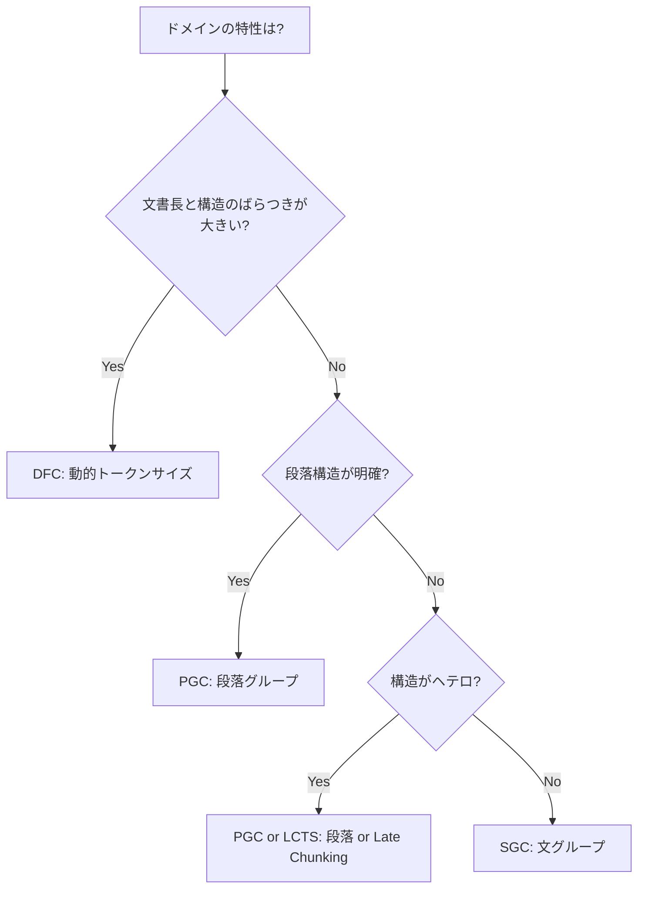

## 論文概要（Abstract）

本記事は [arXiv:2603.06976](https://arxiv.org/abs/2603.06976)（Shaukat et al., 2026）の解説記事です。

RAGシステムにおけるチャンキング手法の選択は検索精度を大きく左右するが、手法間の体系的な比較は不足していた。著者らは**36種のチャンキング手法**（固定サイズ、セマンティック、構造認識、階層的、適応的、LLMベース）を**5つの埋め込みモデル**（bge-m3、all-MiniLM-L6-v2、potion-8M/4M/2M）で、**6つの知識ドメイン**（生物学、物理学、医療、法律、数学、農学）にわたって評価している。主要な発見として、Paragraph Group Chunking（PGC）がnDCG@5で平均0.459を達成し、固定文字サイズ分割（0.244）の約1.9倍の性能を示したと報告している。さらに、チャンキング戦略と埋め込みモデルが「相補的な利益」をもたらすこと、すなわち大型モデルでも不適切なチャンキングでは性能上限が存在することを実証している。

この記事は [Zenn記事: Haystackの文書前処理パイプラインでQA検索精度を段階改善する](https://zenn.dev/0h_n0/articles/17ae57aaf8443b) の深掘りです。

## 情報源

- **arXiv ID**: 2603.06976
- **URL**: [https://arxiv.org/abs/2603.06976](https://arxiv.org/abs/2603.06976)
- **著者**: Muhammad Arslan Shaukat, Muntasir Adnan, Carlos C. N. Kuhn
- **投稿日**: 2026年3月7日
- **分野**: cs.IR（Information Retrieval）

## 背景と動機（Background & Motivation）

RAGパイプラインの設計ではLLMの選択やプロンプトエンジニアリングに注目が集まるが、著者らは「チャンキング手法の選択がRAGパイプライン全体の性能ボトルネックになりうる」と指摘している。既存の研究では少数のチャンキング手法を限定的なドメインで比較するにとどまり、手法の数・ドメインの多様性・埋め込みモデルとの相互作用を網羅した大規模な比較は行われていなかった。

本論文は36手法×5モデル×6ドメインの**1,080構成**を評価する初の包括的ベンチマークであり、Zenn記事で解説されている`DocumentSplitter`の`split_by`パラメータ（word / sentence / passage）の選択に定量的な根拠を提供する。

## 主要な貢献（Key Contributions）

- **36種のチャンキング手法の体系的分類**: 7カテゴリ（ルールベース、再帰/階層、セマンティック、適応的、Late Chunking、LLMベース、ハイブリッド）に分類した包括的な手法カタログ
- **チャンキング×埋め込みの相互作用分析**: 「チャンキング戦略の選択は埋め込みモデルの選択よりも性能への影響が大きい」という発見
- **ドメイン別の最適手法マッピング**: 各ドメインで最適なチャンキング戦略が異なることの実証
- **効率性のパレートフロンティア分析**: 精度とインデックスサイズ・処理時間のトレードオフを定量化

## 技術的詳細（Technical Details）

### 36種のチャンキング手法の分類

著者らは36手法を7カテゴリに分類している。以下にZenn記事との対応関係を含めて整理する。

#### ルールベース（9手法）

| 手法 | パラメータ | Haystackでの対応 |
|---|---|---|
| Fixed Character Chunking (FCC) | char_size=100, overlap=10 | — |
| Fixed Token Chunking (FC) | token_size=50, overlap=0 | `DocumentSplitter(split_by="word")` |
| Overlapping Token Chunking (OFC) | token_size=50, overlap=10 | `DocumentSplitter(split_by="word", split_overlap=10)` |
| Sliding Window (SWC) | window=50, step=25 | `DocumentSplitter` + overlap設定 |
| Length Aware Chunking (LAC) | target=500, tolerance=100 | — |
| Sentence Based Chunking (SBC) | 文境界 | `DocumentSplitter(split_by="sentence", split_length=1)` |
| Sentence Group Chunking (SGC) | sentences=3, overlap=1 | `DocumentSplitter(split_by="sentence", split_length=3, split_overlap=1)` |
| Paragraph Based Chunking (PBC) | 段落境界 | `DocumentSplitter(split_by="passage", split_length=1)` |
| **Paragraph Group Chunking (PGC)** | paragraphs=2, overlap=1 | `DocumentSplitter(split_by="passage", split_length=2, split_overlap=1)` |

**PGC（Paragraph Group Chunking）**がZenn記事で解説されている`split_by="passage"`に直接対応し、本論文で最も高い性能を示した手法である。

#### 再帰/階層（3手法）

| 手法 | 特徴 |
|---|---|
| Recursive Chunking (RC) | 区切り文字の優先度で分割 |
| Recursive Token Fallback (RTF) | トークンベースのフォールバック付き |
| Parent-Child Chunking (PCC) | 親チャンク≤500トークン、子チャンク≤100トークン |

PCC（Parent-Child Chunking）はHaystackの`HierarchicalDocumentSplitter`に対応する。

#### セマンティック/トピックベース（4手法）

| 手法 | 特徴 |
|---|---|
| Semantic Embedding Based (SEBC) | 埋め込み類似度でグルーピング |
| Semantic Similarity Threshold (SSTC) | 類似度閾値=0.6 |
| Topic Based (TBC) | トピック距離閾値=0.4 |
| Semantic Boundary Detection (SBDC) | セマンティック境界検出 |

#### 適応的/動的（3手法）

| 手法 | 特徴 |
|---|---|
| **Dynamic Token Size (DFC)** | min=50, max=200トークン |
| Content Density Adaptive (CDAC) | base_size=1000 |
| Semantic Variance Adaptive (SVAC) | sensitivity=0.2 |

DFC（Dynamic Token Size Chunking）はドメインによってはPGCを上回る性能を示している。

#### Late Chunking（3手法）、LLMベース（2手法）、ハイブリッド（11手法）

Late ChunkingはJina AIが提案した手法で、文書全体をまず長コンテキストモデルで埋め込んでからチャンク境界を適用する。LLMベースはLLMに境界検出やセグメンテーションを委任する手法で、計算コストが高い。ハイブリッドは構造ベースとセマンティックベースの手法を組み合わせる。

### 5つの埋め込みモデル

| モデル | 次元数 | 特徴 |
|---|---|---|
| BAAI/bge-m3 | 1024 | 多言語対応、Dense/Sparse/Multi-vector |
| all-MiniLM-L6-v2 | 384 | 蒸留MiniLM、汎用 |
| potion-8M | 256 | 静的単語埋め込み |
| potion-4M | 128 | 静的単語埋め込み |
| potion-2M | 64 | 静的単語埋め込み |

モデル性能の階層: bge-m3（平均nDCG@5≈0.456）> all-MiniLM-L6-v2（0.416）> potion系。

### 評価指標

主要指標として**nDCG@5**（Normalized Discounted Cumulative Gain@5）を採用。これはランク位置を考慮した段階的関連度メトリクスである。

$$
\text{nDCG@}k = \frac{\text{DCG@}k}{\text{IDCG@}k}, \quad \text{DCG@}k = \sum_{i=1}^{k} \frac{2^{r_i} - 1}{\log_2(i + 1)}
$$

ここで $r_i$ は $i$ 番目の検索結果の関連度（0=無関係、1=部分的に関連、2=完全に関連）。

補助指標としてHit@5、MRR@5、Precision@1を使用。関連度の判定にはMixtral-8x22B-Instruct-v0.1をLLMジャッジとして使用し、人間との相関はPearson r=0.879、Cohen's κ=0.813を達成している。

## 実験結果（Results）

### 全体性能ランキング（全ドメイン・全モデル平均）

論文の結果より、主要な手法の全体性能を示す。

| ランク | 手法 | nDCG@5 | Precision@1 | Hit@5 |
|---|---|---|---|---|
| 1 | **PGC（段落グループ）** | 0.459 | 24% | 59% |
| 2 | DFC（動的トークン） | 0.441 | — | — |
| 3 | LBDC（LLM境界検出） | 0.415 | — | — |
| ... | ... | ... | ... | ... |
| 最下位 | FCC（固定文字） | 0.244 | 2-3% | — |

PGCは固定文字分割と比較してPrecision@1で**約10倍**（24% vs 2-3%）の精度を達成している。この差はZenn記事で解説されている`split_by`パラメータの選択がいかに検索精度に影響するかを如実に示している。

### ドメイン別の最適手法

著者らの実験結果から、ドメインごとに最適なチャンキング手法が異なることが明らかになった。

| ドメイン | 最適手法 | nDCG@5 | 理由 |
|---|---|---|---|
| 物理学 | DFC（動的トークン） | 0.648 | 科学テキストのセマンティックセクションに動的適応 |
| 医療 | DFC（動的トークン） | 0.621 | 文書長と構造のばらつきが大きく、適応的サイズ調整が有効 |
| 生物学 | DFC（動的トークン） | 0.534 | 同上 |
| 法律 | PGC（段落グループ） | 0.78 (Hit@5) | 法律文書は複数段落にわたる論点が多い |
| 数学 | PGC（段落グループ） | — | 定義・定理・証明が連続する段落構造 |
| 農学 | PGC/HPGC | — | 段落認識型戦略が安定 |



この結果はZenn記事の「分割戦略の選定フロー」を補完するものであり、`split_by="passage"`（PGCに相当）が法律・数学・農学ドメインで有効である一方、科学・医療ドメインでは動的サイズ調整が優れることを示している。

### チャンキング×埋め込みモデルの相互作用

著者らは「チャンキング戦略の選択は埋め込みモデルの選択よりも性能への影響が大きい」という重要な発見を報告している。

**相補的利益**: 大型埋め込みモデル（bge-m3）でも不適切なチャンキング（FCC等）では性能上限が存在する。逆に、適切なチャンキング（PGC等）を使えば小型モデル（potion-2M）でも一定の性能が得られる。

**ランキングの安定性**: 埋め込みモデルを変えても、チャンキング手法の相対的なランキングはほぼ安定している。bge-m3でPGCが最適であれば、all-MiniLM-L6-v2でもPGCが最適であることが多い。

$$
\text{Corr}(\text{embedding dimensionality}, \text{performance}) < 0.2
$$

埋め込み次元数と性能の相関が0.2未満であることは、チャンキング戦略がモデルアーキテクチャよりも性能を支配する要因であることを示している。

### 効率性の比較

著者らの報告による、主要手法の効率性比較を示す。

| 手法 | RAM (MB) | チャンキング時間 (秒) | クエリ遅延 (ms) |
|---|---|---|---|
| PGC（段落グループ） | 873 | 6.26 | 3.72 |
| DFC（動的トークン） | 883 | 7.27 | 5.49 |
| LCPI（Late Chunking） | 859 | 6.01 | 3.75 |
| TBC（トピックベース） | 2,849 | 133.79 | 4.37 |
| LSTC（LLMベース） | 5,672 | 10.02 | 3.84 |

PGCはチャンキング時間6.26秒、クエリ遅延3.72msと、精度・効率の両面で優れている。トピックベース（TBC）のチャンキング時間133.79秒やLLMベース（LSTC）のRAM 5,672MBと比較すると、PGCの実用性の高さが際立つ。

### Precision対Recallのトレードオフ

著者らは「細粒度のセマンティックチャンキングは、関連情報が複数チャンクに分散するため、Hit@5は向上するがPrecision@1は低下する」という非対称的なトレードオフを指摘している。

PGCはこのトレードオフにおいて好ましいバランスを達成しており、過度に断片化されたチャンク（Hit@5は高いがPrecision@1が低い）も、過度に粗いチャンク（ノイズが多い）も避けている。

## 実装のポイント（Implementation）

**Haystack `DocumentSplitter` のパラメータ指針**: 本論文の結果を基に、Zenn記事の`DocumentSplitter`設定を以下のように推奨する。

**一般的なQAシステム（デフォルト）**:
```python
DocumentSplitter(
    split_by="sentence",
    split_length=3,
    split_overlap=1,
    split_threshold=2,
)
```
SGC（Sentence Group Chunking）に相当。多くのドメインで安定した性能を発揮する。

**法律・学術文書**:
```python
DocumentSplitter(
    split_by="passage",
    split_length=2,
    split_overlap=1,
)
```
PGC（Paragraph Group Chunking）に相当。本論文で最高性能を記録した手法。

**科学・医療文書**:
動的トークンサイズ（DFC）に相当する手法はHaystackの標準コンポーネントには存在しないため、カスタムコンポーネントとして実装する必要がある。

**埋め込みモデルの選択**: 本論文の結果から、bge-m3がall-MiniLM-L6-v2を一貫して上回っている。Zenn記事で使用されている`intfloat/multilingual-e5-large`は本論文の評価対象に含まれていないが、bge-m3と同クラスの多言語モデルであり、同様の性能が期待される。

**split_thresholdの重要性**: Zenn記事で指摘されているように、`split_threshold`を設定しないと末尾に短いチャンクが生成される。本論文の結果でも、短いチャンクはPrecision@1を低下させる要因として指摘されている。

## 実運用への応用（Practical Applications）

**ドメイン適応型チャンキング戦略**: 本論文の最も実用的な知見は「ドメインごとに最適なチャンキング手法が異なる」ということである。マルチドメインのRAGシステムでは、`FileTypeRouter`でファイル形式ごとにルーティングするのと同様に、ドメインごとに異なる`DocumentSplitter`設定を適用するアーキテクチャが有効である。

**チャンキング戦略のA/Bテスト**: 本論文が示す1,080構成のベンチマーク結果は、自組織のデータセットで最適な構成を探索する際の出発点となる。まずPGC（`split_by="passage"`）を試し、次にSGC（`split_by="sentence"`）と比較するのが効率的な探索順序である。

**埋め込みモデル選択よりチャンキングを優先**: 著者らが報告する「チャンキング戦略が埋め込みモデルよりも性能への影響が大きい」という発見は、RAGシステムの最適化において重要な示唆を与える。高価な埋め込みモデルへの切り替えよりも、チャンキング戦略の改善を先に検討すべきである。

## 関連研究（Related Work）

- **AutoChunker**（ACL 2025 Industry Track）: 構造化テキストのチャンキングとその評価に焦点を当てた手法。本論文はAutoChunkerを含むより広範な手法を比較対象としている
- **Late Chunking**（Jina AI, 2024）: 長コンテキスト埋め込みモデルで文書全体を埋め込んでからチャンク境界を適用する手法。本論文ではLCPI/LCSI/LCTSの3変種を評価し、ドメインによってはPGCに匹敵する性能を報告している
- **LumberChunker**（EMNLP 2024 Findings）: LLMベースのナラティブ分割手法。本論文のLBDCカテゴリに含まれ、計算コストの高さ（RAM 5,672MB）が指摘されている

## まとめと今後の展望

36種のチャンキング手法の体系的比較から、以下の知見が得られた。第一に、Paragraph Group Chunking（PGC、Haystackの`split_by="passage", split_length=2, split_overlap=1`に相当）が全体として最も高い精度を示した。第二に、チャンキング戦略の選択は埋め込みモデルの選択よりも性能への影響が大きく、両者は相補的に機能する。第三に、最適なチャンキング手法はドメインに依存し、科学・医療では動的サイズ調整（DFC）、法律・数学では段落グループ（PGC）が有効である。

Haystackユーザにとっては、`DocumentSplitter`の`split_by`パラメータを`"passage"`に設定することが多くの場合に最適な選択肢であり、`split_overlap=1`の設定も重要であるという実用的な指針が得られた。

## 参考文献

- **arXiv**: [https://arxiv.org/abs/2603.06976](https://arxiv.org/abs/2603.06976)
- **Related Zenn article**: [https://zenn.dev/0h_n0/articles/17ae57aaf8443b](https://zenn.dev/0h_n0/articles/17ae57aaf8443b)
- **AutoChunker (ACL 2025)**: [https://aclanthology.org/2025.acl-industry.69](https://aclanthology.org/2025.acl-industry.69)
- **Late Chunking**: [https://arxiv.org/abs/2409.04701](https://arxiv.org/abs/2409.04701)

---

:::message
この記事はAI（Claude Code）により自動生成されました。内容の正確性については原論文と照合していますが、最新情報は公式ソースもご確認ください。
:::
