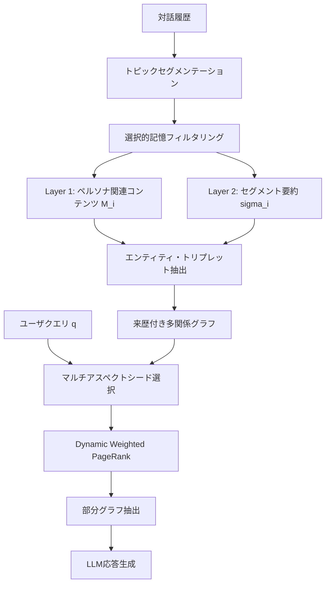

## 論文概要（Abstract）

本記事は [MemORAI: Memory Organization and Retrieval via Adaptive Graph Intelligence](https://arxiv.org/abs/2605.01386)（ACL Findings 2026）の解説記事です。

LLMは長期対話に必要な永続記憶を持たない。著者らはMemORAIを提案し、選択的記憶フィルタリングによる二層圧縮、ターンレベル来歴追跡の多関係グラフ、Dynamic Weighted PageRankによるクエリ適応的検索を統合している。LoCoMo・LongMemEvalで13ベースラインを上回る性能を報告している。

この記事は [Zenn記事: Mem0×Gemini 3.8 Flashで長期記憶チャットボットを構築しトークンを72%削減する](https://zenn.dev/0h_n0/articles/2f2a6e4179b88f) の深掘りです。

## 情報源

- **arXiv ID**: 2605.01386
- **URL**: [https://arxiv.org/abs/2605.01386](https://arxiv.org/abs/2605.01386)
- **著者**: Hung Pham Van, Nguyen Manh Hieu, Khang Pham Tran Tuan et al.
- **発表年**: 2026（ACL Findings 2026 採択）
- **分野**: cs.CL（Computation and Language）

## 背景と動機（Background & Motivation）

Zenn記事で扱ったMem0のようなシステムはベクトル検索ベースの記憶管理を提供するが、著者らは既存手法に3つの構造的問題を指摘している。第一に、対話全体を無差別に記憶すると重要情報が埋もれる**情報希釈**。第二に、事実がどの対話ターンに由来するかの**来歴追跡の欠如**。第三に、クエリ文脈を考慮しない**一様な重み付け検索**。MemORAIはこの3点を統合的に解決するフレームワークである。

## 主要な貢献（Key Contributions）

- **選択的記憶フィルタリング**: LLMゲートでペルソナ関連内容のみ保持し二層圧縮で記憶効率向上
- **来歴付き多関係グラフ**: エンティティ・ターン・セグメントの3種ノードで事実出典をターンレベル追跡
- **クエリ適応的部分グラフ検索**: Dynamic Weighted PageRankでクエリに応じてエッジ重みを動的変化

## 技術的詳細（Technical Details）

### 全体アーキテクチャ

パイプラインは4段階から構成される。



### 二層圧縮メカニズム（Dual-Layer Compression）

著者らは対話を意味的に一貫したセグメント $S_i$ に分割した後、各セグメントに二層のフィルタリングを適用する。

**Layer 1（選択的記憶フィルタリング）**: LLMゲートがセグメント $S_i$ 中のペルソナ関連内容を識別し、集合 $M_i \subseteq S_i$ を出力する。保持対象は伝記的事実、嗜好、目標に紐づくやり取りである。

**Layer 2（セグメント要約）**: Layer 1で除外された汎用的な内容について、LLMがセグメントレベルの要約 $\sigma_i$ を生成する。これにより $M_i$ からは失われるグローバルな文脈を保持する。

記憶ストアには $M_i$ と $\sigma_i$ の両方が格納され、Mem0のような全文記憶方式と比較してノイズ抑制と文脈保持を両立させている。

### 来歴付きグラフ構造

3種のノードと3種のエッジで構成される異種グラフである。

| ノード種別 | 格納情報 |
|---|---|
| Entity（エンティティ） | name, description, turn_ids |
| Turn（ターン） | text, segment_id, turn_id |
| Segment（セグメント） | summary $\sigma_i$, segment_id |

エッジは Entity-Relation-Entity（関係トリプレット）、Entity-Turn（出典ターン）、Turn-Segment（所属セグメント）の3種で、関係エッジには `source_turns` が付与される。ある事実がどの対話ターンで言及されたかをグラフ構造から直接辿れる。

### Dynamic Weighted PageRank

Dynamic Weighted PageRankではクエリ $q$ に応じてエッジ重みを動的に計算する。

エッジ重み関数 $w(u \to v)$ は以下のように定義される:

$$
w(u \to v) = \begin{cases}
\text{sim}(q, e.\text{desc}) & u = e,\; v = \tau \\
\text{sim}(q, r.\text{desc}) & u \xrightarrow{r} v \\
\frac{1}{|\tau|} \sum_{e \in \tau} \text{sim}(q, e.\text{desc}) & u = \tau,\; v = s
\end{cases}
$$

ここで、
- $q$: ユーザクエリ
- $e$: エンティティノード
- $\tau$: ターンノード
- $s$: セグメントノード
- $r$: 関係（リレーション）
- $\text{sim}(\cdot, \cdot)$: クエリと説明文の埋め込み間のコサイン類似度

PageRankの反復更新式は以下の通りである:

$$
\text{PR}_{t+1}(v) = (1 - d) \cdot \text{seed}(v) + d \cdot S(v)
$$

$$
S(v) = \sum_{u \to v} \frac{w(u \to v)}{\sum_{u \to *} w(u \to *)} \cdot \text{PR}_t(u)
$$

ここで、
- $d$: ダンピング係数（シードノードへのリセット確率を制御）
- $\text{seed}(v)$: マルチアスペクト並列検索で特定された初期シードノードのスコア
- $\text{PR}_t(u)$: 反復 $t$ におけるノード $u$ のPageRankスコア

従来のPageRankと異なり、クエリとの意味的類似度でエッジ重みを条件付けし、関連サブグラフにスコアを集中させる。

### クエリ適応的検索の擬似コード

```python
import numpy as np

def query_adaptive_retrieval(
    query: str, graph: dict, nodes: dict, embed_fn: callable,
    damping: float = 0.85, max_iter: int = 20, top_k: int = 10,
) -> list[str]:
    """Dynamic Weighted PageRankによるクエリ適応的検索

    Args:
        query: ユーザクエリ
        graph: 隣接リスト {node_id: [(neighbor_id, rel_desc), ...]}
        nodes: ノード辞書 {id: {description, embedding}}
        embed_fn: テキストを埋め込みベクトルに変換する関数
    """
    q_emb = embed_fn(query)
    cos = lambda a, b: float(np.dot(a, b) / max(np.linalg.norm(a) * np.linalg.norm(b), 1e-9))

    # Step 1: シードノード選択（コサイン類似度 > 0.5）
    seeds = {nid: cos(q_emb, n["embedding"]) for nid, n in nodes.items()
             if cos(q_emb, n["embedding"]) > 0.5}

    # Step 2: クエリ条件付きエッジ重み計算
    ew = {(u, v): cos(q_emb, embed_fn(rd))
          for u, nbrs in graph.items() for v, rd in nbrs}

    # Step 3: PageRank反復（クエリ適応的重み付き）
    pr = {nid: seeds.get(nid, 0.0) for nid in nodes}
    for _ in range(max_iter):
        pr_new = {}
        for v in nodes:
            incoming = [(u, r) for u, nbrs in graph.items() for nb, r in nbrs if nb == v]
            s_v = sum(ew.get((u, v), 0.0)
                      / max(sum(ew.get((u, n), 0.0) for n, _ in graph.get(u, [])), 1e-9)
                      * pr[u] for u, _ in incoming)
            pr_new[v] = (1 - damping) * seeds.get(v, 0.0) + damping * s_v
        pr = pr_new

    # Step 4: 上位ノードから1ホップ部分グラフ抽出
    return [nid for nid, _ in sorted(pr.items(), key=lambda x: x[1], reverse=True)[:top_k]]
```

## 実験結果（Results）

### 応答生成品質（論文 Table 1 より）

著者らはLoCoMo-10およびLongMemEval-sで13ベースラインと比較している。

| 手法 | GPT4o-J (%) | F1 | BLEU | ROUGE-L | BERTScore |
|---|---|---|---|---|---|
| **MemORAI** | **60.22** | **56.71** | **33.00** | **56.58** | **91.71** |
| HippoRAG 2 | 45.62 | 16.66 | — | — | — |
| SeCom | 43.81 | 21.33 | — | — | — |
| A-Mem | 35.25 | 15.19 | — | — | — |
| MemGAS | 41.07 | 17.66 | — | — | — |

*LoCoMo-10の結果。GPT4o-Jはgpt-4oジャッジスコア。*

LongMemEval-sでもGPT4o-J 75.55%、F1 45.99で全ベースラインを上回っている。

### 検索精度（論文 Table 2, 3 より）

| ベンチマーク | 粒度 | Recall@3 | Recall@5 | Recall@10 |
|---|---|---|---|---|
| LongMemEval-s | セッション | 90.17 | 94.56 | 98.54 |
| LongMemEval-s | ターン | 71.13 | 82.64 | 91.63 |
| LoCoMo-10 | セッション | 72.05 | 81.63 | 92.03 |
| LoCoMo-10 | ターン | 42.63 | 51.97 | 64.68 |

### アブレーション結果（論文 Table 4-8 より）

| 除去コンポーネント | LoCoMo Turn R@10 | 変化 |
|---|---|---|
| なし（full） | 64.68 | — |
| トピックセグメンテーション | 27.61 | -37.07 |
| 選択的フィルタリング | 57.32 | -7.36 |
| 動的エッジ重み → 均一 | 62.01 | -2.67 |
| 部分グラフ → 全グラフ | 51.77 | -12.91 |

トリプレット付加の効果も顕著で、LoCoMo GPT4o-Jが51.66から60.22に向上している。著者らは3要素がいずれも不可欠と結論付けている。

## 実装のポイント（Implementation）

- **セグメンテーションコスト**: LLMによるトピック分割は長い対話で推論コストが増大する。ウィンドウベースの漸進的処理が推奨される
- **二層圧縮のプロンプト設計**: Layer 1のペルソナ判定は伝記的事実・嗜好・目標の3カテゴリを明示的にプロンプトに含める必要がある
- **グラフDB選択**: 3種ノード+3種エッジの異種グラフにはプロパティグラフDB（Neptune、Neo4j）が適している
- **PageRank収束**: 20反復で十分だが、大規模グラフではダンピング係数 $d$ の調整が必要

## Production Deployment Guide

### AWS実装パターン（コスト最適化重視）

| 構成 | トラフィック | 主要サービス | 月額概算 |
|---|---|---|---|
| Small | ~100 req/日 | Lambda + Neptune Serverless + OpenSearch Serverless + Bedrock | $120-250 |
| Medium | ~1,000 req/日 | ECS Fargate + Neptune db.r6g.large + OpenSearch + Bedrock | $500-1,200 |
| Large | 10,000+ req/日 | EKS + Neptune db.r6g.2xlarge + OpenSearch + Bedrock Batch | $2,500-5,500 |

2026年9月時点 ap-northeast-1概算。Small内訳: Neptune Serverless $50-80、OpenSearch Serverless $60-100、Lambda $5-15、Bedrock $5-55。

**コスト削減**: Batch APIで非同期セグメンテーション50%削減、Prompt Cachingで30-90%削減、Neptune Serverless自動スケールでアイドル時NCU最小化。

### Terraformインフラコード

**Small構成（Serverless）**:

```hcl
# Neptune Serverless（グラフDB: 来歴付き多関係グラフ格納）
resource "aws_neptune_cluster" "memorai" {
  cluster_identifier = "memorai-graph"
  engine             = "neptune"
  serverless_v2_scaling_configuration {
    min_capacity = 1.0   # アイドル時コスト最小化
    max_capacity = 8.0
  }
  storage_encrypted = true
  kms_key_arn       = aws_kms_key.memorai.arn
  tags = { Project = "memorai" }
}

# OpenSearch Serverless（埋め込みベクトル検索: シードノード選択用）
resource "aws_opensearchserverless_collection" "embeddings" {
  name = "memorai-embeddings"
  type = "VECTORSEARCH"
}

# Lambda（クエリ適応検索 + PageRank実行）
resource "aws_lambda_function" "retrieval" {
  function_name = "memorai-retrieval"
  runtime       = "python3.12"
  handler       = "handler.lambda_handler"
  memory_size   = 1024
  timeout       = 30
  role          = aws_iam_role.lambda_memorai.arn
  environment {
    variables = {
      NEPTUNE_ENDPOINT = aws_neptune_cluster.memorai.endpoint
      BEDROCK_MODEL_ID = "anthropic.claude-sonnet-4-20250514"
    }
  }
  tracing_config { mode = "Active" }  # X-Ray有効化
}

# IAM最小権限: Neptune読取 + OpenSearch + Bedrock推論のみ
resource "aws_iam_role_policy" "lambda_memorai" {
  role   = aws_iam_role.lambda_memorai.id
  policy = jsonencode({
    Version = "2012-10-17"
    Statement = [
      { Effect = "Allow", Action = ["neptune-db:connect", "neptune-db:ReadDataViaQuery"],
        Resource = aws_neptune_cluster.memorai.arn },
      { Effect = "Allow", Action = ["aoss:APIAccessAll"],
        Resource = aws_opensearchserverless_collection.embeddings.arn },
      { Effect = "Allow", Action = ["bedrock:InvokeModel"],
        Resource = "arn:aws:bedrock:ap-northeast-1::foundation-model/*" }
    ]
  })
}
```

### 運用・監視設定

**CloudWatch Logs Insights クエリ**（トークン使用量異常検知）:

```
fields @timestamp, @message
| filter @message like /bedrock/
| stats sum(input_tokens + output_tokens) as total_tokens by bin(1h)
| sort total_tokens desc | limit 24
```

**X-Ray トレーシング**（boto3自動計装 + PageRank計測）:

```python
from aws_xray_sdk.core import xray_recorder, patch_all
patch_all()

@xray_recorder.capture("memorai_retrieval")
def retrieve_memory(query: str, session_id: str) -> dict:
    """グラフ記憶検索にX-Rayトレースを付与する"""
    sub = xray_recorder.current_subsegment()
    sub.put_annotation("session_id", session_id)
    result = run_dynamic_pagerank(query, session_id)
    sub.put_metadata("nodes_retrieved", len(result))
    return result
```

**Cost Explorer 日次レポート**（$100/日超過でSNS通知）:

```python
import boto3
from datetime import date, timedelta

def daily_cost_report() -> None:
    """日次コストレポートを取得しSNS通知する"""
    ce = boto3.client("ce")
    resp = ce.get_cost_and_usage(
        TimePeriod={"Start": str(date.today() - timedelta(1)), "End": str(date.today())},
        Granularity="DAILY", Metrics=["UnblendedCost"],
        Filter={"Tags": {"Key": "Project", "Values": ["memorai"]}},
        GroupBy=[{"Type": "DIMENSION", "Key": "SERVICE"}],
    )
    total = sum(float(g["Metrics"]["UnblendedCost"]["Amount"])
                for r in resp["ResultsByTime"] for g in r["Groups"])
    if total > 100:
        boto3.client("sns").publish(
            TopicArn="arn:aws:sns:ap-northeast-1:ACCOUNT:memorai-alerts",
            Subject="MemORAI Cost Alert", Message=f"Daily: ${total:.2f}")
```

### コスト最適化チェックリスト

**アーキテクチャ**: ~100 req/日 Serverless / ~1,000 req/日 Hybrid / 10,000+ Container

**リソース最適化**: Neptune Serverless min NCU=1.0 / Lambda 1024MB / Reserved 1年40%削減 / Savings Plans / OpenSearch OCU下限

**LLMコスト削減**: Batch API 50%削減 / Prompt Caching 30-90%削減 / Haiku+Sonnet使い分け / トークン数制限

**監視**: AWS Budgets月額上限 / CloudWatch NCU+トークン / Cost Anomaly Detection / 日次SNS通知

**リソース管理**: 未使用スナップショット削除 / Project/Environment/Ownerタグ必須 / インデックス90日ライフサイクル / 開発環境夜間停止 / CloudTrail有効化

## 実運用への応用（Practical Applications）

Zenn記事で構築したMem0ベースのチャットボットに対し、MemORAIの技術は3つの観点で応用可能である。第一に、Mem0のベクトル検索にDynamic Weighted PageRankを追加レイヤーとして組み込むことで、複数セッションにまたがる記憶検索精度を改善できる。第二に、選択的フィルタリングは記憶保存段階でノイズを除去するため、Zenn記事で達成した72%トークン削減との両立が可能である。第三に、ターンレベルの来歴追跡は「なぜこの記憶を保持しているか」の説明責任を果たす機構として、プロダクション環境で実用的価値が高い。

## 関連研究（Related Work）

- **HippoRAG 2**: 海馬インデキシング理論に着想を得たグラフベースRAG。LoCoMo GPT4o-J 45.62%でMemORAIに14.6pt劣る
- **Mem0**: Zenn記事の基盤技術。MemORAIはグラフ構造と来歴追跡を追加した発展形
- **A-Mem**: エージェント的記憶管理。LoCoMo GPT4o-J 35.25%

## まとめと今後の展望

MemORAIは3技術の統合によりLoCoMo・LongMemEvalで既存手法を上回り、アブレーションで各要素の必要性を示した。Mem0ベースのシステムに対し検索精度と来歴追跡の面で補完的な技術である。著者らはマルチモーダル記憶やクロスユーザ知識共有への拡張を今後の方向として挙げている。

## 参考文献

- **arXiv**: [https://arxiv.org/abs/2605.01386](https://arxiv.org/abs/2605.01386)
- **Related Zenn article**: [https://zenn.dev/0h_n0/articles/2f2a6e4179b88f](https://zenn.dev/0h_n0/articles/2f2a6e4179b88f)
