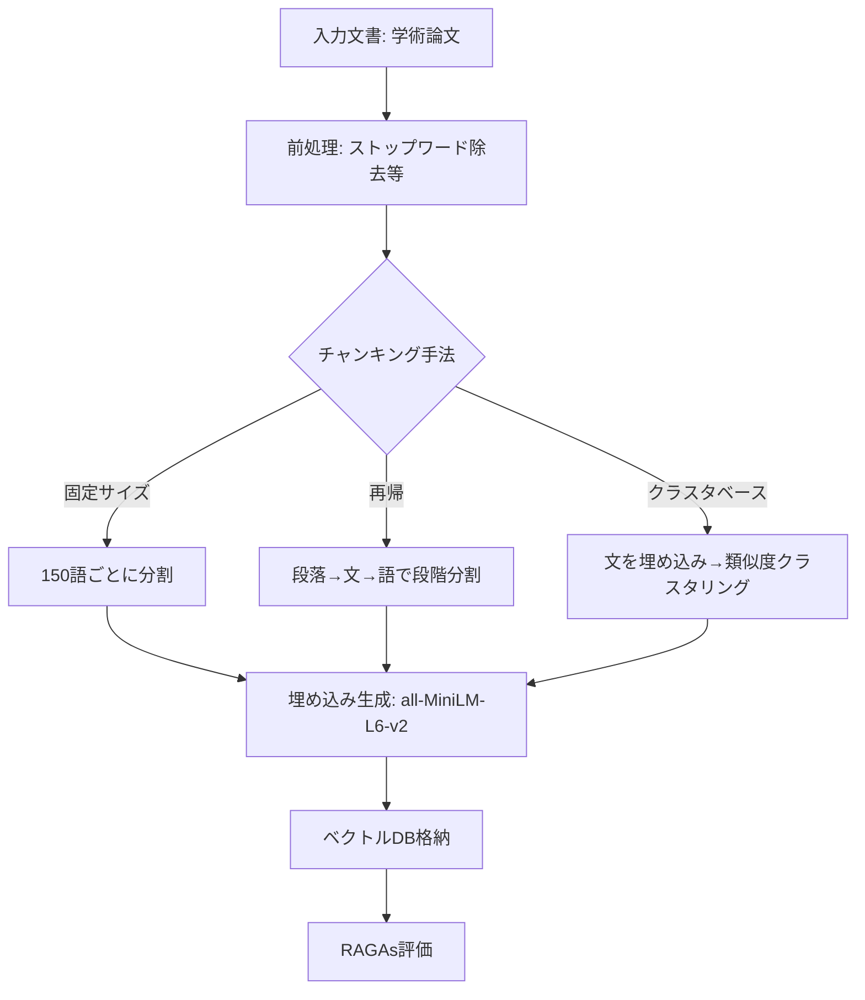

## 論文概要（Abstract）

本記事は [arXiv:2607.01852](https://arxiv.org/abs/2607.01852)（Kreileder et al., 2026）の解説記事です。

RAGシステムにおけるチャンキング戦略の評価において、「複雑な手法が常にシンプルな手法より優れるとは限らない」ことを示した研究である。著者らは固定サイズ、再帰、クラスタベースセマンティックの3種のチャンキング手法を学術論文（修士論文13件）で比較し、RAGAs（Retrieval Augmented Generation Assessment）フレームワークで評価している。実験の結果、クラスタベースのセマンティックチャンキングはシンプルな手法を一貫して上回ることがなく、かつRAGAs評価フレームワーク自体にも信頼性の課題があることを報告している。

この記事は [Zenn記事: Haystackの文書前処理パイプラインでQA検索精度を段階改善する](https://zenn.dev/0h_n0/articles/17ae57aaf8443b) の深掘りです。

## 情報源

- **arXiv ID**: 2607.01852
- **URL**: [https://arxiv.org/abs/2607.01852](https://arxiv.org/abs/2607.01852)
- **著者**: Valentin J. J. Kreileder, Johannes Reisinger, Andreas Fischer
- **投稿日**: 2026年7月2日
- **分野**: cs.IR（Information Retrieval）、cs.AI、cs.CL

## 背景と動機（Background & Motivation）

多くのRAG研究では、セマンティックチャンキングや階層的チャンキングなどの高度な手法が固定サイズ分割より優れると報告されている。しかし、これらの比較は多くの場合、短い文書や多様なドメインの混合データセットで行われており、長文の構造化された文書（学術論文、技術マニュアル等）での有効性は十分に検証されていなかった。

著者らは、実際の学術環境で発生する長文書（10,000〜27,000語）に対してチャンキング手法を評価し、さらにRAGAs評価フレームワークの信頼性自体も検証する必要があると指摘している。この研究は、Zenn記事で紹介されている`DocumentSplitter`の分割戦略選択において、「常にセマンティック分割が優れるわけではない」という重要な注意点を提供する。

## 主要な貢献（Key Contributions）

- **学術文書に対する3チャンキング手法の比較**: 固定サイズ、再帰、クラスタベースセマンティックの定量比較
- **RAGAsフレームワークの信頼性検証**: Faithfulness指標の44%失敗率を発見し、評価指標自体の限界を指摘
- **質問タイプ別の性能分析**: 固定質問（著者名・タイトル等）とドキュメント固有質問で異なる傾向を発見
- **文書前処理の重要性**: チャンキング手法の選択以前に、文書のフォーマット・構造の前処理が検索精度に大きく影響することの実証

## 技術的詳細（Technical Details）

### 3つのチャンキング戦略

著者らは以下の3手法を比較している。

| 手法 | 分割方式 | パラメータ | Haystackでの対応 |
|---|---|---|---|
| **固定サイズ** | 均等な語数で分割 | 150語、15語オーバーラップ | `DocumentSplitter(split_by="word", split_length=150, split_overlap=15)` |
| **再帰** | 区切り文字の優先度で段階的に分割 | 150語上限 | LangChainの`RecursiveCharacterTextSplitter`に相当 |
| **クラスタベースセマンティック** | 文の埋め込み類似度でクラスタリング | all-MiniLM-L6-v2、single-linkage | カスタム実装が必要 |



### 実験構成

著者らは16GB VRAM制約の下、以下のモデル構成で実験を行っている。

- **生成モデル**: llama3.2:3b（小型LLM）
- **評価モデル**: deepseek-r1:8b
- **埋め込みモデル**: all-MiniLM-L6-v2（384次元）

**データセット**: 学術修士論文13件、文書長10,232〜26,960語（中央値約16,000語）、合計10の質問（固定質問5件 + ドキュメント固有質問5件）

合計**390測定値**（13文書 × 3チャンキング手法 × 10質問）を生成。

### RAGAs評価指標

著者らは2つの主要指標を使用している。

**Context F1**: Context RecallとContext Precisionの調和平均。

$$
\text{Context F1} = \frac{2 \times \text{Context Recall} \times \text{Context Precision}}{\text{Context Recall} + \text{Context Precision}}
$$

**Answer Quality Score (AQS)**: FaithfulnessとAnswer Relevancyの調和平均。

$$
\text{AQS} = \frac{2 \times F \times AR}{F + AR}
$$

ここで $F$ はFaithfulness（回答が検索された文脈に忠実か）、$AR$ はAnswer Relevancy（回答が質問に関連しているか）である。調和平均を使用することで、いずれかの指標が低い場合にAQSが大きく低下する。

### 質問タイプの区別

著者らは質問を2カテゴリに分類し、チャンキング手法の影響が質問タイプによって異なることを示している。

**固定質問（Fixed Questions）**: 著者名、タイトル、指導教員など、論文の冒頭部分に記載される定型情報に関する質問。

**ドキュメント固有質問（Free/Document-Specific Questions）**: 論文の本文から検索が必要な、内容に踏み込んだ質問。

## 実験結果（Results）

### Faithfulness指標の信頼性問題

著者らが報告した最も注目すべき発見は、RAGAsのFaithfulness計算が**全測定値の44%で失敗**したことである。

| チャンキング手法 | Faithfulness失敗率 |
|---|---|
| 再帰 | 47% |
| 固定サイズ | 44% |
| クラスタベース | 42% |

著者らはこの高い失敗率を評価フレームワーク自体の限界として指摘している。特に、固定質問では検索スコア（Context F1）がゼロに近いにもかかわらず、生成スコア（AQS）が中程度を示すケースがあり、「検索と生成が分離している」という矛盾を報告している。

### 質問タイプ別の結果

**固定質問（著者名・タイトル等）**:
- Context F1: 全チャンキング手法で中央値0（検索がほぼ機能しない）
- AQS: 低い中央値だが、外れ値で1.00に達するケースあり
- 解釈: 定型情報は論文の冒頭にあり、チャンキング手法の違いが検索に反映されにくい

**ドキュメント固有質問（本文検索が必要）**:
- Context F1: 再帰が中央値約0.5でリード、固定サイズが約0.3、クラスタベースが最低
- AQS: 固定サイズと再帰がともに中央値約0.65、再帰が最も四分位範囲が狭い（安定）。クラスタベースは中央値0.40で最低

### クラスタベースセマンティックチャンキングが優れなかった理由

著者らは「クラスタベースセマンティックチャンキングは実装された構成では一貫した改善を示さず、計算の複雑さを追加するだけであった」と結論づけている。具体的な要因として以下を挙げている。

1. **埋め込みモデルの制約**: ハードウェア制約（16GB VRAM）によりall-MiniLM-L6-v2（384次元）を使用。先行研究ではより大型のモデルでセマンティックチャンキングの効果を報告しているが、小型モデルでは意味的境界の検出精度が不足する可能性がある

2. **学術文書の構造的特性**: 学術論文は章・節・段落が明確に構造化されているため、セマンティックな類似度分析よりも構造的な境界（段落・セクション）に基づく分割の方が適している

3. **前処理の残留ノイズ**: 「予備的な成果物やドットリーダーがインデクシングと検索の両方を汚染する」と報告されており、チャンキング手法の選択以前に前処理の品質が性能を制約している

4. **データセットの性質の違い**: 先行研究は短い文書や多様なドメインの混合データセットで評価しているが、本研究は長文の構造化された学術論文に特化しており、結果の直接比較が困難

### Zenn記事との関連

この結果はZenn記事で述べられている`split_by="sentence"`の推奨と整合する。学術文書のように構造が明確な文書では、複雑なセマンティック分割よりも文や段落単位のシンプルな分割が実用的である。ただし、本論文の結果はall-MiniLM-L6-v2という比較的小型のモデルに限定されており、`intfloat/multilingual-e5-large`のような大型モデルでは異なる結果が得られる可能性がある。

## 実装のポイント（Implementation）

**前処理の品質が最優先**: 著者らの実験が示す最も重要な教訓は、チャンキング手法の選択以前に文書の前処理品質が検索精度を制約するということである。Haystackの`DocumentCleaner`を適切に設定し、ヘッダー・フッター・ページ番号・目次のドットリーダーなどのノイズを除去することが先決である。

**RAGAs評価の注意点**: RAGAsフレームワークは広く使われているが、著者らの実験ではFaithfulness計算の44%が失敗している。RAGAsを用いてチャンキング戦略を比較する場合、Faithfulness以外の指標（Context Recall、Answer Relevancy）を主要指標とし、Faithfulnessは参考値として扱うことが推奨される。

**シンプルな手法から始める**: セマンティックチャンキングのような計算コストの高い手法に移行する前に、まず`DocumentSplitter(split_by="sentence", split_length=3, split_overlap=1)`のようなシンプルな構成でベースラインを確立すべきである。本論文の結果は、特に構造化された長文書ではシンプルな手法が十分に競争力を持つことを示している。

**質問タイプに応じた評価設計**: 著者らの実験が示すように、定型情報の検索とコンテンツ検索では結果が大きく異なる。チャンキング戦略の評価には、実際のユースケースに即した質問を用意し、質問タイプ別の性能分析を行うことが重要である。

```python
from haystack.components.preprocessors import DocumentCleaner, DocumentSplitter

cleaner = DocumentCleaner(
    remove_empty_lines=True,
    remove_extra_whitespaces=True,
    remove_repeated_substrings=True,
)

splitter_baseline = DocumentSplitter(
    split_by="sentence",
    split_length=3,
    split_overlap=1,
    split_threshold=2,
)
```

## 実運用への応用（Practical Applications）

本論文の知見は、RAGシステムの設計と評価において以下の実用的示唆を与える。

**チャンキング手法選択のガイドライン**: 構造化された長文書（技術マニュアル、法律文書、学術論文）では、`split_by="sentence"`や`split_by="passage"`のようなシンプルなルールベース手法から始め、定量評価で改善が確認された場合のみセマンティック手法に移行する段階的アプローチが推奨される。

**評価パイプラインの構築**: RAGAsのFaithfulness指標の信頼性問題を踏まえ、評価パイプラインでは複数の指標を組み合わせる。Context F1で検索精度を、Answer Relevancyで回答品質を評価し、Faithfulnessは補助指標として位置づける。

**文書タイプ別の最適化**: Zenn記事の`FileTypeRouter`で文書タイプを分類した後、各タイプに最適なチャンキング戦略を適用するアーキテクチャが有効である。学術論文は`split_by="passage"`、短い記事は`split_by="sentence"`など。

## 関連研究（Related Work）

- **Shaukat et al.（2026, arXiv:2603.06976）**: 36種のチャンキング手法を6ドメインで評価した大規模ベンチマーク。本論文と相補的であり、ドメイン依存性と埋め込みモデルとの相互作用を詳細に分析している
- **HiChunk（Lu et al., 2025）**: 階層チャンキング＋Auto-Merge検索による手法。本論文がフラットな手法比較に焦点を当てるのに対し、HiChunkは階層構造の活用に焦点を当てている
- **LumberChunker（EMNLP 2024 Findings）**: LLMベースのナラティブ分割。本論文のクラスタベース手法とは異なるセマンティック分割アプローチ

## まとめと今後の展望

本論文は「複雑なチャンキング手法が常にシンプルな手法より優れるとは限らない」という重要な知見を提供している。特に構造化された長文書では、再帰チャンキングや固定サイズチャンキングがクラスタベースのセマンティックチャンキングと同等以上の性能を示した。また、RAGAs評価フレームワークのFaithfulness指標の高い失敗率（44%）は、チャンキング戦略の比較研究において評価手法自体の検証が不可欠であることを示している。

Haystackユーザにとっての実用的な示唆は、`DocumentCleaner`による前処理を十分に行った上で、シンプルな`DocumentSplitter`設定（`split_by="sentence"`, `split_length=3`, `split_overlap=1`）から始め、段階的に最適化を進めるべきということである。Zenn記事で推奨されている`split_by="sentence"`の構成は、本論文の結果からも学術文書に対して合理的な選択肢であることが裏付けられている。

著者らは今後の課題として、より大型の埋め込みモデルでの再評価、異なるクラスタリングアルゴリズムの検証、人間のアノテーションに基づくRAGAs指標の妥当性検証を挙げている。

## 参考文献

- **arXiv**: [https://arxiv.org/abs/2607.01852](https://arxiv.org/abs/2607.01852)
- **RAGAs Framework**: [https://docs.ragas.io/](https://docs.ragas.io/)
- **Related Zenn article**: [https://zenn.dev/0h_n0/articles/17ae57aaf8443b](https://zenn.dev/0h_n0/articles/17ae57aaf8443b)

---

:::message
この記事はAI（Claude Code）により自動生成されました。内容の正確性については原論文と照合していますが、最新情報は公式ソースもご確認ください。
:::
