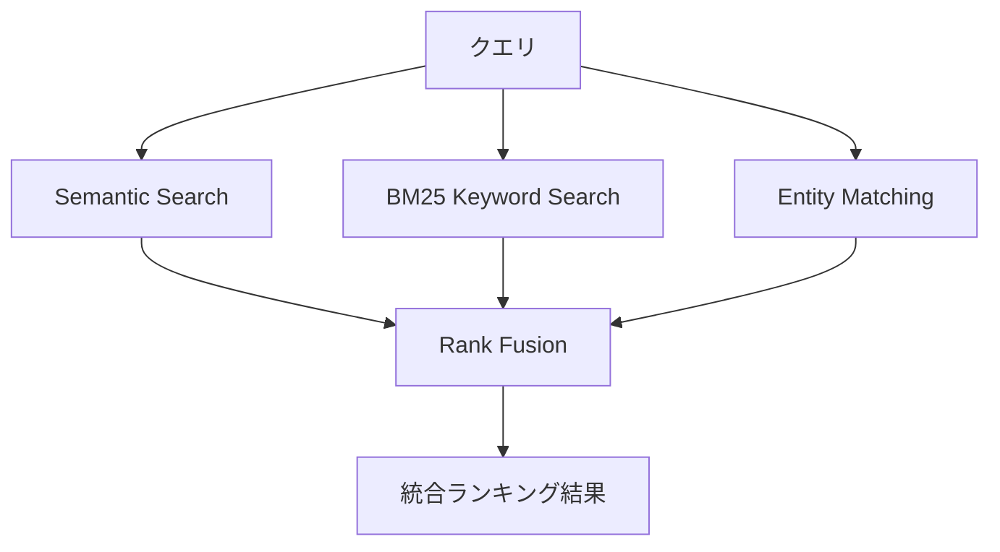

## ブログ概要（Summary）

本記事は [Mem0公式ブログ: Introducing The Token-Efficient Memory Algorithm](https://mem0.ai/blog/mem0-the-token-efficient-memory-algorithm) の解説記事です。

Mem0は2026年4月にV3メモリアルゴリズムを公開した。従来の2パス抽出を単一LLMコールに置き換えるSingle-Pass ADD-Only Extractionと、固有名詞を独立レイヤで管理するEntity Linking、意味類似度・BM25・エンティティマッチングを並列実行するMulti-Signal Retrievalの3つの改良により、LoCoMoベンチマークで71.4から92.5（+21.1）、LongMemEvalで67.8から94.4（+26.6）へと精度を大幅に向上させた。同時に、検索1回あたりのトークン使用量を約6,800トークンに抑え、フルコンテキスト方式（25,000+トークン）と比較して3-4倍の効率化を達成している。

この記事は [Zenn記事: Mem0×Gemini 3.8 Flashで長期記憶チャットボットを構築しトークンを72%削減する](https://zenn.dev/0h_n0/articles/2f2a6e4179b88f) の深掘りです。

## 情報源

- **種別**: 企業テックブログ（Mem0自社公式ブログ）
- **URL**: [https://mem0.ai/blog/mem0-the-token-efficient-memory-algorithm](https://mem0.ai/blog/mem0-the-token-efficient-memory-algorithm)
- **組織**: Mem0（YCombinator支援スタートアップ）
- **発表日**: 2026年4月

なお、以下で紹介するベンチマーク結果はMem0チーム自身による計測値であり、第三者による独立検証ではない点に留意されたい。

## 技術的背景（Technical Background）

LLMベースのエージェントやチャットボットが長期記憶を必要とする場面では、会話全文をプロンプトに含めるフルコンテキスト方式がベースラインとなる。しかし、セッションが長期化すると25,000トークンを超えるコンテキストが必要になり、レイテンシ・コストの両面で実用性が低下する。

Mem0 V2まではこの課題に対し「2パス方式」で対処していた。第1パスで新規ファクトを抽出し、第2パスで既存メモリとの重複を検出・マージする。この方式はLLMを2回呼び出すため抽出レイテンシが大きく、DELETE操作によって過去の状態変化履歴が失われるという問題があった。例えば「ユーザが東京からニューヨークに引っ越した」という情報をDELETEで上書きすると、「以前は東京に住んでいた」という事実が消える。

V3アルゴリズムはこれらの課題を根本から再設計し、抽出・格納・検索の各段階で効率と精度を同時に改善している。

## 実装アーキテクチャ（Architecture）

### Single-Pass ADD-Only Extraction

V3の最も重要な変更は、2パス抽出を単一のLLMコールに置き換えた点にある。Mem0公式ブログによると、このアプローチは抽出レイテンシを約半分に削減する。

動作原理は以下の通りである。

```python
def extract_facts_v3(
    conversation: list[dict[str, str]],
    existing_memories: list[str],
) -> list[str]:
    """V3 Single-Pass ADD-Only Extraction（擬似コード）

    Args:
        conversation: 現在の会話ターン
        existing_memories: 既存メモリのリスト

    Returns:
        新規追加すべきファクトのリスト
    """
    prompt = build_extraction_prompt(
        conversation=conversation,
        existing_memories=existing_memories,
        instruction="既存メモリと重複しない新規ファクトのみを抽出せよ",
    )
    # LLMを1回だけ呼び出す（DELETEやUPDATEは行わない）
    new_facts: list[str] = llm_call(prompt)
    return new_facts
```

従来のDELETE/UPDATE操作を排除したことで、過去の状態変化が履歴として保存される。「2024年に東京に住んでいた」「2025年にニューヨークに引っ越した」という2つのファクトが並存し、時系列的な推論が可能になる。

### Agent-Generated Facts

V3ではエージェント（アシスタント）側の出力もファクトとして格納対象にしている。具体的には、予約確認（「フライトを予約しました: 成田→JFK, 3月15日」）やレコメンデーション結果（「前回イタリアンレストランを提案」）をユーザ発話と同等の優先度で記憶する。

これにより、エージェントが過去に何を行ったかを追跡でき、重複提案の回避や文脈の一貫性維持に寄与する。

### Entity Linking Layer

Entity Linkingは、抽出されたファクトから固有名詞・複合フレーズ（人名、地名、製品名など）を識別し、専用のルックアップレイヤに埋め込みベクトルとして格納する仕組みである。

エンティティ抽出とスコアリングの概念を数式で表現すると以下のようになる。

$$
E = \text{EntityExtract}(f) \quad \forall f \in \mathcal{F}
$$

ここで、$\mathcal{F}$は全ファクト集合、$E$は抽出されたエンティティ集合を表す。各エンティティ$e \in E$は埋め込みベクトル$\mathbf{v}_e$として格納される。

検索時には、クエリ$q$から抽出したエンティティ$E_q$と格納済みエンティティ$E$とのマッチングスコア$s_{\text{entity}}$を計算する。

$$
s_{\text{entity}}(q, f) = \max_{e_q \in E_q, \, e_f \in E_f} \cos(\mathbf{v}_{e_q}, \mathbf{v}_{e_f})
$$

ここで$E_f$はファクト$f$に関連付けられたエンティティ集合、$\cos(\cdot, \cdot)$はコサイン類似度である。

このレイヤにより、「田中さんの好きなレストランは？」のような固有名詞を含むクエリで、意味的類似度だけでは取りこぼしやすいメモリを効率的に検索できる。

### Multi-Signal Retrieval

V3の検索パイプラインは3つの独立したスコアリングを並列実行し、Rank Fusionで統合する。



各シグナルのスコア計算は以下の通りである。

1. **Semantic similarity**: クエリとファクトの埋め込みベクトル間のコサイン類似度 $s_{\text{sem}}(q, f) = \cos(\mathbf{v}_q, \mathbf{v}_f)$
2. **BM25**: 語彙レベルのキーワードマッチング $s_{\text{bm25}}(q, f)$
3. **Entity matching**: 前述のエンティティ間コサイン類似度 $s_{\text{entity}}(q, f)$

統合にはReciprocal Rank Fusion（RRF）を用いる。

$$
\text{RRF}(f) = \sum_{r \in \{sem, bm25, entity\}} \frac{1}{k + \text{rank}_r(f)}
$$

ここで$k$はスムージング定数（典型的には60）、$\text{rank}_r(f)$は各ランキングにおけるファクト$f$の順位である。RRFは各ランキングの絶対スコアに依存せず順位のみで統合するため、スケールの異なるスコアを正規化なしに組み合わせられる利点がある。

## パフォーマンス最適化（Performance）

### ベンチマーク結果

Mem0公式ブログの計測によると、V3は複数のベンチマークで旧アルゴリズムを大幅に上回る結果を示している。

| ベンチマーク | 旧アルゴリズム | V3 | 改善幅 |
|-------------|---------------|-----|-------|
| LoCoMo | 71.4 | 92.5 | +21.1 |
| LongMemEval | 67.8 | 94.4 | +26.6 |
| BEAM (1Mトークン) | — | 64.1 | — |
| BEAM (10Mトークン) | — | 48.6 | — |

カテゴリ別の改善も顕著である。LoCoMoでは時間的クエリが+29.3、マルチホップ推論が+25.2の改善を示している。LongMemEvalではアシスタントメモリ想起が+51.8と特に大きい改善幅を記録している。

### トークン使用量

Mem0公式ブログの計測によると、検索1回あたりの平均トークン使用量は以下の通りである。

| ベンチマーク | 平均トークン数 |
|-------------|--------------|
| LoCoMo | 6,956 |
| LongMemEval | 6,787 |
| BEAM (1M) | 6,719 |
| BEAM (10M) | 6,914 |

注目すべきは、1Mトークンと10Mトークンのコーパスで使用トークン数がほぼ同等（6,719 vs 6,914）である点で、メモリ量の増大に対してトークン消費がスケールしないことを示唆している。フルコンテキスト方式の25,000+トークンと比較すると、3-4倍のトークン削減に相当する。

## 運用での学び（Production Lessons）

### 公式ブログが認める制限事項

Mem0公式ブログは自らの限界を率直に認めている。「fact-level and entity-level retrieval are still insufficient for the hardest long-range memory tasks」と明記しており、特に以下の2点を課題として挙げている。

1. **時間的推論**: 「先月と今月で好みがどう変わったか」のような時系列を跨ぐ推論は、ファクト単位の検索では困難
2. **マルチセッションのイベント順序付け**: 長期間にわたる複数セッションのイベントを時系列で正しく整列させるには、より豊かな時間表現（temporal representations）が必要

BEAM（10Mトークン）でスコアが48.6に留まる点もこの制限を反映している。超長期・大規模記憶では、ファクト抽出＋エンティティリンクの枠組みだけでは対応しきれない領域が残っている。

### 運用上の考慮点

ADD-Only方式は履歴を保持する一方でストレージが単調増加するため、長期運用ではガベージコレクション戦略（古い・低関連度のファクトの期限切れ処理）が必要になると考えられる。またEntity Linkingの精度はエンティティ抽出モデルの品質に依存するため、ドメイン固有の固有名詞（社内用語、略語など）への対応にはカスタマイズが求められる可能性がある。

## Production Deployment Guide

### AWS実装パターン（コスト最適化重視）

V3メモリアルゴリズムの本番環境は、ベクトルストア（Semantic Search）、BM25インデックス（Keyword Search）、エンティティストア（Entity Matching）、LLM（ファクト抽出）の4コンポーネントで構成される。以下はAWSでの推奨構成である。コスト試算は2026年9月時点のap-northeast-1リージョン料金に基づく概算値であり、実際のコストはトラフィックパターンやバースト使用量により変動する。

| 構成 | トラフィック | 主要サービス | 月額概算 |
|------|------------|-------------|---------|
| Small | ~100 req/日 | Lambda + OpenSearch Serverless + DynamoDB + Bedrock | $80-200 |
| Medium | ~1,000 req/日 | ECS Fargate + OpenSearch + ElastiCache + Bedrock | $400-900 |
| Large | 10,000+ req/日 | EKS + OpenSearch (3ノード) + ElastiCache + Bedrock Batch | $2,500-5,500 |

Small構成ではLambdaでファクト抽出とMulti-Signal Retrievalを処理し、OpenSearch Serverlessでベクトル検索とBM25を統合、DynamoDBでエンティティ埋め込みを管理する。Bedrock（Claude Haiku等）でファクト抽出LLMコールを行い、1日100リクエスト・各6,800トークンで月間トークンコストは$5-15程度に収まる。Spot Instancesは最大90%、Reserved Instancesは最大72%のコスト削減が見込める。Bedrock Batch APIで50%、Prompt Caching有効化で30-90%の追加削減も可能である。

### Terraformインフラコード

**Small構成（Serverless）**:

```hcl
# Mem0 V3 Memory Algorithm - Small構成
# Lambda + OpenSearch Serverless + DynamoDB + Bedrock

resource "aws_opensearchserverless_collection" "memory_store" {
  name = "mem0-memory-store"
  type = "VECTORSEARCH"
}

resource "aws_dynamodb_table" "entity_store" {
  name         = "mem0-entity-store"
  billing_mode = "PAY_PER_REQUEST"
  hash_key     = "entity_id"

  attribute {
    name = "entity_id"
    type = "S"
  }

  server_side_encryption {
    enabled = true
  }

  point_in_time_recovery {
    enabled = true
  }
}

resource "aws_lambda_function" "memory_retrieval" {
  function_name = "mem0-multi-signal-retrieval"
  runtime       = "python3.12"
  handler       = "handler.lambda_handler"
  timeout       = 30
  memory_size   = 512

  environment {
    variables = {
      OPENSEARCH_ENDPOINT = aws_opensearchserverless_collection.memory_store.collection_endpoint
      ENTITY_TABLE        = aws_dynamodb_table.entity_store.name
      BEDROCK_MODEL_ID    = "anthropic.claude-3-haiku-20240307-v1:0"
      RRF_K               = "60"
    }
  }

  tracing_config {
    mode = "Active"  # X-Ray有効化
  }
}

# コスト監視アラーム
resource "aws_budgets_budget" "mem0_monthly" {
  name         = "mem0-monthly-budget"
  budget_type  = "COST"
  limit_amount = "200"
  limit_unit   = "USD"
  time_unit    = "MONTHLY"

  notification {
    comparison_operator       = "GREATER_THAN"
    threshold                 = 80
    threshold_type            = "PERCENTAGE"
    notification_type         = "ACTUAL"
    subscriber_sns_topic_arns = [aws_sns_topic.cost_alert.arn]
  }
}
```

**Large構成（Container）**:

```hcl
# Mem0 V3 Memory Algorithm - Large構成
# EKS + OpenSearch + ElastiCache + Bedrock

module "eks" {
  source          = "terraform-aws-modules/eks/aws"
  version         = "~> 20.0"
  cluster_name    = "mem0-cluster"
  cluster_version = "1.31"

  vpc_id     = module.vpc.vpc_id
  subnet_ids = module.vpc.private_subnets

  eks_managed_node_groups = {
    spot = {
      capacity_type  = "SPOT"          # Spot優先で最大90%コスト削減
      instance_types = ["m6i.xlarge", "m5.xlarge", "m6a.xlarge"]
      min_size       = 2
      max_size       = 10
      desired_size   = 3
    }
  }
}

resource "aws_opensearch_domain" "memory_search" {
  domain_name    = "mem0-memory"
  engine_version = "OpenSearch_2.17"

  cluster_config {
    instance_type          = "r6g.large.search"
    instance_count         = 3
    zone_awareness_enabled = true
  }

  encrypt_at_rest { enabled = true }
  node_to_node_encryption { enabled = true }
}

resource "aws_elasticache_replication_group" "entity_cache" {
  replication_group_id = "mem0-entity-cache"
  description          = "Entity embedding cache for retrieval boost"
  engine               = "redis"
  node_type            = "cache.r6g.large"
  num_cache_clusters   = 2
  at_rest_encryption_enabled = true
  transit_encryption_enabled = true
}
```

### 運用・監視設定

```python
# CloudWatch Logs Insights: トークン使用量異常検知
QUERY_TOKEN_ANOMALY = """
fields @timestamp, tokens_used, retrieval_latency_ms
| filter event = "mem0_retrieval"
| stats avg(tokens_used) as avg_tokens,
        pct(tokens_used, 95) as p95_tokens,
        avg(retrieval_latency_ms) as avg_latency
  by bin(1h)
| filter avg_tokens > 10000
"""

# X-Ray トレーシング設定
import aws_xray_sdk.core as xray
from aws_xray_sdk.core import patch_all

xray.configure(sampling=True)
patch_all()  # boto3自動計装

def traced_multi_signal_retrieval(query: str) -> list[dict]:
    """Multi-Signal Retrieval with X-Ray tracing"""
    segment = xray.begin_subsegment("multi_signal_retrieval")
    segment.put_annotation("query_length", len(query))

    sem_score = semantic_search(query)      # Subsegment自動生成
    bm25_score = bm25_search(query)
    entity_score = entity_match(query)

    results = rank_fusion(sem_score, bm25_score, entity_score)
    segment.put_metadata("result_count", len(results))
    segment.put_metadata("total_tokens", sum(r["tokens"] for r in results))
    xray.end_subsegment()
    return results
```

```python
# Cost Explorer日次レポート
import boto3
from datetime import date, timedelta

def daily_cost_report() -> None:
    """Bedrock/Lambda/OpenSearchの日次コストを取得しSNS通知"""
    ce = boto3.client("ce")
    response = ce.get_cost_and_usage(
        TimePeriod={
            "Start": str(date.today() - timedelta(days=1)),
            "End": str(date.today()),
        },
        Granularity="DAILY",
        Filter={"Tags": {"Key": "Project", "Values": ["mem0-v3"]}},
        Metrics=["UnblendedCost"],
        GroupBy=[{"Type": "DIMENSION", "Key": "SERVICE"}],
    )
    total = sum(
        float(g["Metrics"]["UnblendedCost"]["Amount"])
        for r in response["ResultsByTime"]
        for g in r["Groups"]
    )
    if total > 100:
        sns = boto3.client("sns")
        sns.publish(
            TopicArn="arn:aws:sns:ap-northeast-1:ACCOUNT:mem0-cost-alert",
            Message=f"Mem0 V3 daily cost: ${total:.2f} (threshold: $100)",
        )
```

### コスト最適化チェックリスト

**アーキテクチャ選択**:
- [ ] トラフィック量に応じた構成選択（Small: Serverless / Medium: Hybrid / Large: Container）
- [ ] OpenSearch ServerlessとProvisionedの分岐点（~500 req/日）を評価

**リソース最適化**:
- [ ] EC2/EKS: Spot Instances優先（最大90%削減）
- [ ] Reserved Instances: 1年コミットで最大72%削減
- [ ] Savings Plans: Compute Savings Plansの検討
- [ ] Lambda: メモリサイズ最適化（512MB推奨、Power Tuningで検証）
- [ ] EKS: Karpenterによるアイドル時自動スケールダウン

**LLMコスト削減**:
- [ ] Bedrock Batch APIで非同期抽出（50%削減）
- [ ] Prompt Caching有効化（既存メモリリストのキャッシュで30-90%削減）
- [ ] モデル選択: 抽出にはHaiku、複雑な推論にはSonnetを使い分け
- [ ] トークン数制限: 検索結果のTop-K削減で6,800トークン以下を維持

**監視・アラート**:
- [ ] AWS Budgets: 月額予算アラート（80%閾値）
- [ ] CloudWatch: トークン使用量スパイク検知アラーム
- [ ] Cost Anomaly Detection: 異常コスト自動検知
- [ ] 日次コストレポート: SNS通知で$100/日超過を監視

**リソース管理**:
- [ ] 未使用OpenSearchインデックスの定期削除
- [ ] タグ戦略: Project/Environment/Teamタグ必須
- [ ] DynamoDB TTL: 期限切れエンティティの自動削除
- [ ] 開発環境: 夜間・週末の自動停止（EventBridge Scheduler）
- [ ] S3ライフサイクル: ログの90日後Glacier移行

## 学術研究との関連（Academic Connection）

Mem0 V3のMulti-Signal Retrievalは、情報検索分野のハイブリッド検索（Semantic + Lexical）の実践的応用である。Reciprocal Rank Fusionは2009年にCordon et al.が提案した手法で、異なるランキングの統合に広く使われている。

関連する記憶アルゴリズムとの比較では、A-MEM（Autonomous Memory）はメモリの自己組織化に焦点を当てており、エンティティリンクのような明示的な構造化は行わない。MemORAIはRAGベースのメモリ拡張を採用しているが、BM25やエンティティマッチングとの並列検索は行わず単一シグナルでの検索に留まる。フルコンテキスト方式は精度上限が高い可能性があるが、25,000+トークンのコストが実用上の制約となる。Mem0 V3は「ファクト抽出＋マルチシグナル検索」という中間地点で精度とコストのバランスを取っている点が特徴的である。

## まとめと実践への示唆

Mem0 V3アルゴリズムは、Single-Pass ADD-Only Extraction、Entity Linking Layer、Multi-Signal Retrievalの3つの改良を組み合わせることで、長期記憶の精度と効率を同時に改善した。Mem0公式ブログの計測によると、LoCoMoで+21.1、LongMemEvalで+26.6の精度向上と、検索あたり約6,800トークンという効率を両立している。

実務への示唆として、ADD-Only設計は状態変化の追跡を可能にし、Agent-Generated Factsはエージェントの行動履歴管理に有用である。一方、超長期記憶（BEAM 10Mトークンで48.6）や時間的推論には依然課題が残っており、より豊かな時間表現の研究が今後の方向性として示されている。

## 参考文献

- **Blog URL**: [https://mem0.ai/blog/mem0-the-token-efficient-memory-algorithm](https://mem0.ai/blog/mem0-the-token-efficient-memory-algorithm)
- **Mem0 GitHub**: [https://github.com/mem0ai/mem0](https://github.com/mem0ai/mem0)
- **LoCoMo Benchmark**: [https://arxiv.org/abs/2402.18379](https://arxiv.org/abs/2402.18379)
- **LongMemEval**: [https://arxiv.org/abs/2407.15838](https://arxiv.org/abs/2407.15838)
- **Reciprocal Rank Fusion**: Cormack, G. V., Clarke, C. L. A., & Buettcher, S. (2009). Reciprocal Rank Fusion outperforms Condorcet and individual Rank Learning Methods. SIGIR 2009.
- **Related Zenn article**: [https://zenn.dev/0h_n0/articles/2f2a6e4179b88f](https://zenn.dev/0h_n0/articles/2f2a6e4179b88f)
