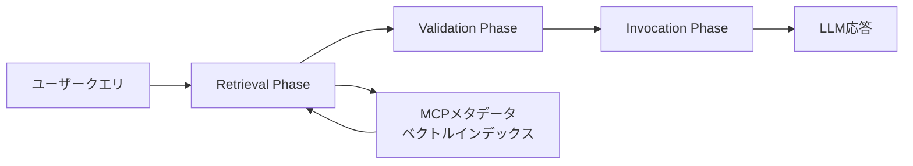

## 論文概要（Abstract）

本記事は [RAG-MCP: Mitigating Prompt Bloat in LLM Tool Selection via Retrieval-Augmented Generation](https://arxiv.org/abs/2505.03275)（Gan & Sun, 2025）の解説記事です。

LLMが外部ツールを活用する際、MCP（Model Context Protocol）で定義されたツール記述をプロンプトに含めることで「プロンプト膨張」が発生し、コンテキストウィンドウが枯渇する問題がある。著者らはRAG-MCPを提案し、セマンティック検索によるツール絞り込みをLLM呼び出し前段に配置することで、プロンプトトークンを50%以上削減しつつ精度を43.13%（ベースライン13.62%比3倍以上）に向上させたと報告している。

この記事は [Zenn記事: MCPサーバーとAGENTS.mdでコードレビュー基盤を構築しツール呼び出しを65分の1に削減する](https://zenn.dev/0h_n0/articles/840943d6211848) の深掘りです。

## 情報源

- **arXiv ID**: 2505.03275
- **URL**: [https://arxiv.org/abs/2505.03275](https://arxiv.org/abs/2505.03275)
- **著者**: Tiantian Gan, Qiyao Sun
- **投稿日**: 2025年5月6日
- **分野**: cs.AI（Artificial Intelligence）, cs.SE（Software Engineering）

## 背景と動機（Background & Motivation）

2024年11月にAnthropicが公開したModel Context Protocol（MCP）は、LLMと外部ツールの統合を標準化するオープンプロトコルとして急速に普及した。2025年4月時点で4,400以上のMCPサーバーが登録されており、この急成長は2つの課題を生んでいる。

**1. プロンプト膨張（Prompt Bloat）**: 全ツールのスキーマ記述をプロンプトに含めると、コンテキストウィンドウの大部分がツール定義で消費される。100個のMCPツールを含めた場合にプロンプトトークンが2,133に達し、タスク推論に割り当てられる容量が圧迫される。

**2. 選択複雑性（Selection Complexity）**: 多数のツール記述が存在すると、LLMは意味的に類似したツール間の判別に失敗し、存在しないAPIをハルシネーションするリスクが増大する。著者らはGPT-4が実在しないAPIを生成した事例を引用している。

Zenn記事ではAGENTS.mdとMCPサーバーで呼び出し回数を65分の1に削減するアプローチを紹介しているが、本論文はツール選択そのものの効率化という相補的な課題に取り組んでいる。

## 主要な貢献（Key Contributions）

- **RAG-MCPフレームワークの提案**: 検索（Retrieval）・検証（Validation）・呼び出し（Invocation）の3段階パイプラインにより、ツール選択をLLMプロンプトから分離するアーキテクチャ
- **プロンプトトークン50%以上の削減**: ベースライン（Blank Conditioning）の2,133トークンに対し、RAG-MCPは1,084トークンで同等以上の精度を達成
- **ツール選択精度の3倍向上**: 43.13% vs 13.62%（ベースライン）の精度改善をMCP Stress Testで実証
- **スケーラビリティの実証**: ツールプール1〜100の範囲でポジション依存の精度分布を可視化し、検索ベースアプローチの有効範囲と限界を定量化

## 技術的詳細（Technical Details）

### RAG-MCPフレームワークの3段階パイプライン

従来の「全ツール記述をプロンプトに注入」するアプローチを3段階に分解し、プロンプト膨張を構造的に解消する。



#### Phase 1: Retrieval（検索フェーズ）

ユーザーのタスク記述を軽量リトリーバー（Qwen）でエンコードし、インデックス化されたMCPメタデータに対してセマンティック検索を実行する。メタデータにはMCPサーバーの名前、説明文、スキーマが含まれる。

ベクトル空間でのコサイン類似度に基づく。クエリ$q$とMCPメタデータ$m_i$のエンベディングを$\mathbf{e}_q$, $\mathbf{e}_{m_i}$とすると、類似度は以下で計算される。

$$
\text{sim}(q, m_i) = \frac{\mathbf{e}_q \cdot \mathbf{e}_{m_i}}{||\mathbf{e}_q|| \cdot ||\mathbf{e}_{m_i}||}
$$

ここで、
- $\mathbf{e}_q \in \mathbb{R}^d$: ユーザークエリの埋め込みベクトル
- $\mathbf{e}_{m_i} \in \mathbb{R}^d$: $i$番目のMCPメタデータの埋め込みベクトル
- $d$: 埋め込み次元数

上位$k$件の候補MCPが次のValidation Phaseに渡される。

$$
\text{TopK}(q) = \underset{S \subseteq \mathcal{M}, |S|=k}{\arg\max} \sum_{m_i \in S} \text{sim}(q, m_i)
$$

ここで$\mathcal{M}$は登録済みMCPサーバーの全集合を表す。

#### Phase 2: Validation（検証フェーズ）

検索で取得したMCP候補に対して、合成テストクエリを生成し応答互換性を検証する。候補MCPのスキーマ情報に基づいてfew-shotの例示クエリを自動生成し、期待通りの応答形式を返すかをサニティチェックすることで、セマンティック類似度は高いが互換性のないMCPを排除する。

#### Phase 3: Invocation（呼び出しフェーズ）

検証を通過した最適なMCPのスキーマ情報のみをLLMプロンプトに注入する。従来は全MCPの記述をプロンプトに含める必要があったが、RAG-MCPでは選択された1つのみで済む。プロンプト中のツール記述量が$O(N)$から$O(1)$に削減され（$N$: 登録MCP数）、LLMはタスク推論にコンテキスト容量を集中でき、未使用MCPサーバーのインスタンス化も不要となる。

### アルゴリズム

論文中に正式な擬似コードは掲載されていないが、フレームワークの処理フローを以下に整理する。

```python
import numpy as np


def rag_mcp_pipeline(
    query: str, mcp_index: list[dict], retriever, llm, top_k: int = 5
) -> str | None:
    """RAG-MCPパイプラインの処理フロー

    Args:
        query: ユーザーのタスク記述
        mcp_index: インデックス化されたMCPメタデータ群
        retriever: 埋め込みエンコーダ（Qwen等）
        llm: タスク実行用LLM（Qwen-max等）
        top_k: Retrieval Phaseで取得する候補数
    """
    # Phase 1: Retrieval - セマンティック検索でtop-k候補を取得
    q_emb = retriever.encode(query)
    candidates = sorted(
        mcp_index,
        key=lambda m: np.dot(q_emb, m["embedding"])
        / (np.linalg.norm(q_emb) * np.linalg.norm(m["embedding"])),
        reverse=True,
    )[:top_k]

    # Phase 2: Validation - 合成クエリで互換性チェック
    validated = [c for c in candidates if test_compatibility(c, query)]
    if not validated:
        return None

    # Phase 3: Invocation - 最適MCPスキーマのみをプロンプトに注入
    best = validated[0]
    return llm.generate(inject_mcp_schema(query, best["tools_schema"]))
```

## 実装のポイント（Implementation）

RAG-MCPを実装する際の技術的な注意点を整理する。

**リトリーバーモデルの選定**: 著者らはQwenをリトリーバーとして使用しているが、汎用テキスト埋め込みモデルではツールスキーマの構造情報が十分に捉えられない可能性がある。ToolBench等のツール選択データセットでファインチューニングしたモデルの使用が考えられる。

**インデックス粒度**: MCPサーバー単位かツール単位かで検索精度が変わる。論文はサーバー単位だが、ツール単位のインデックスはより細粒度のマッチングを可能にする一方、インデックスサイズが増大する。

**Validation Phaseのキャッシュ**: 合成テストクエリの生成と互換性テストはLLM呼び出しを伴うため、結果をキャッシュし再検証を省略する戦略が実運用では有効である。

**単一MCP選択の制約**: 1つのMCPのみをプロンプトに注入する設計のため、複数ツール連携タスクには未対応。マルチツールワークフローへの拡張が今後の課題である。

## Production Deployment Guide

AWSでのプロダクションデプロイ構成を示す。コスト試算は2026年9月時点のAWS ap-northeast-1リージョン料金に基づく概算値であり、実際のコストはトラフィックパターンにより変動する。

### AWS実装パターン（コスト最適化重視）

MCPツール選択パイプラインのトラフィック量別推奨構成を示す。

| 構成 | トラフィック | サービス構成 | 月額概算 |
|------|-------------|-------------|---------|
| Small | ~100 req/日 | Lambda + Bedrock + DynamoDB + S3 | $50-150 |
| Medium | ~1,000 req/日 | ECS Fargate + Bedrock + ElastiCache + S3 | $300-800 |
| Large | 10,000+ req/日 | EKS + Karpenter + Spot + OpenSearch + S3 | $2,000-5,000 |

**Small内訳**: Lambda $5-15 + Bedrock $20-80 + DynamoDB $5-10 + S3 $1-3。**Medium内訳**: ECS Fargate 2vCPU/4GB $80-150 + Bedrock $100-400 + ElastiCache $30-50 + S3/CloudFront $10-20。**Large内訳**: EKS Control Plane $75 + Karpenter Spot $100-300 + OpenSearch $150-300 + Bedrock $1,000-3,000 + S3 $20-50。

**コスト削減テクニック**:
- Spot Instances活用でEKSワーカーノードを最大90%削減
- Bedrock Batch APIで非同期評価タスクを50%削減
- Prompt Caching有効化で同一MCPスキーマ注入時のトークンコストを30-90%削減
- Validation結果のElastiCacheキャッシュでLLM呼び出し回数を削減

### Terraformインフラコード

#### Small構成（Serverless）

```hcl
# RAG-MCP Small構成: Lambda + Bedrock + DynamoDB
terraform {
  required_version = ">= 1.9"
  required_providers {
    aws = { source = "hashicorp/aws", version = "~> 5.80" }
  }
}

provider "aws" { region = "ap-northeast-1" }

resource "aws_iam_role" "rag_mcp_lambda" {
  name = "rag-mcp-lambda-role"
  assume_role_policy = jsonencode({
    Version = "2012-10-17"
    Statement = [{ Action = "sts:AssumeRole", Effect = "Allow",
      Principal = { Service = "lambda.amazonaws.com" } }]
  })
}

resource "aws_iam_role_policy" "rag_mcp_policy" {
  name = "rag-mcp-policy"
  role = aws_iam_role.rag_mcp_lambda.id
  policy = jsonencode({
    Version = "2012-10-17"
    Statement = [
      { Effect = "Allow", Action = ["bedrock:InvokeModel"],
        Resource = "arn:aws:bedrock:ap-northeast-1::foundation-model/*" },
      { Effect = "Allow", Action = ["dynamodb:GetItem", "dynamodb:PutItem", "dynamodb:Query"],
        Resource = aws_dynamodb_table.mcp_metadata.arn },
      { Effect = "Allow", Action = ["s3:GetObject"],
        Resource = "${aws_s3_bucket.vector_index.arn}/*" },
    ]
  })
}

resource "aws_dynamodb_table" "mcp_metadata" {
  name         = "rag-mcp-metadata"
  billing_mode = "PAY_PER_REQUEST"  # On-Demand: コスト最適
  hash_key     = "mcp_id"
  attribute { name = "mcp_id"; type = "S" }
  server_side_encryption { enabled = true }
}

resource "aws_lambda_function" "rag_mcp" {
  function_name = "rag-mcp-pipeline"
  role          = aws_iam_role.rag_mcp_lambda.arn
  handler       = "handler.lambda_handler"
  runtime       = "python3.12"
  timeout       = 60
  memory_size   = 1024  # 埋め込み計算に十分なメモリ
  environment {
    variables = {
      MCP_TABLE_NAME   = aws_dynamodb_table.mcp_metadata.name
      BEDROCK_MODEL_ID = "anthropic.claude-sonnet-4-20250514"
    }
  }
  tracing_config { mode = "Active" }
}
```

#### Large構成（Container）

```hcl
# RAG-MCP Large構成: EKS + Karpenter + Spot
module "eks" {
  source  = "terraform-aws-modules/eks/aws"
  version = "~> 20.31"
  cluster_name    = "rag-mcp-cluster"
  cluster_version = "1.31"
  vpc_id     = module.vpc.vpc_id
  subnet_ids = module.vpc.private_subnets
  cluster_endpoint_public_access = false
  eks_managed_node_groups = {
    system = { instance_types = ["t3.medium"], min_size = 1, max_size = 2,
               desired_size = 1, capacity_type = "ON_DEMAND" }
  }
}

resource "kubectl_manifest" "karpenter_nodepool" {
  yaml_body = yamlencode({
    apiVersion = "karpenter.sh/v1", kind = "NodePool"
    metadata = { name = "rag-mcp-spot" }
    spec = { template = { spec = {
      requirements = [
        { key = "karpenter.sh/capacity-type", operator = "In",
          values = ["spot", "on-demand"] },
        { key = "node.kubernetes.io/instance-type", operator = "In",
          values = ["c6i.xlarge", "c6i.2xlarge", "c7i.xlarge"] },
      ]
      nodeClassRef = { name = "default" }
    } }, limits = { cpu = "32", memory = "64Gi" },
    disruption = { consolidationPolicy = "WhenEmptyOrUnderutilized",
                   consolidateAfter = "30s" } }
  })
}

resource "aws_budgets_budget" "rag_mcp" {
  name = "rag-mcp-monthly", budget_type = "COST"
  limit_amount = "5000", limit_unit = "USD", time_unit = "MONTHLY"
  notification {
    comparison_operator = "GREATER_THAN", threshold = 80
    threshold_type = "PERCENTAGE", notification_type = "ACTUAL"
    subscriber_email_addresses = ["ops-team@example.com"]
  }
}
```

### 運用・監視設定

#### CloudWatch Logs Insights クエリ

```
# コスト異常検知: 1時間あたりのトークン使用量スパイク
fields @timestamp, prompt_tokens, completion_tokens
| filter event = "rag_mcp_invocation"
| stats sum(prompt_tokens) as total_prompt, count(*) as req_count by bin(1h)
| filter total_prompt > 100000

# レイテンシ分析: Retrieval/Validation/Invocation各フェーズのP95
fields @timestamp, phase, duration_ms
| filter event = "rag_mcp_phase_complete"
| stats percentile(duration_ms, 95) as p95, avg(duration_ms) as avg_ms by phase
```

#### CloudWatch アラーム・X-Ray設定

```python
import boto3
from aws_xray_sdk.core import xray_recorder, patch_all

patch_all()  # X-Ray自動計装
cloudwatch = boto3.client("cloudwatch", region_name="ap-northeast-1")

def setup_token_alarm(function_name: str, sns_topic_arn: str) -> None:
    """Bedrockトークン使用量スパイク検知アラーム"""
    cloudwatch.put_metric_alarm(
        AlarmName=f"rag-mcp-{function_name}-token-spike",
        MetricName="InputTokenCount", Namespace="AWS/Bedrock",
        Statistic="Sum", Period=3600, EvaluationPeriods=1,
        Threshold=50000, ComparisonOperator="GreaterThanThreshold",
        AlarmActions=[sns_topic_arn],
    )

def daily_cost_report(sns_topic_arn: str) -> dict:
    """日次コストレポート: $100/日超過でSNS通知"""
    from datetime import date, timedelta
    ce = boto3.client("ce", region_name="us-east-1")
    today = date.today()
    resp = ce.get_cost_and_usage(
        TimePeriod={"Start": str(today - timedelta(days=1)), "End": str(today)},
        Granularity="DAILY", Metrics=["UnblendedCost"],
        GroupBy=[{"Type": "DIMENSION", "Key": "SERVICE"}],
        Filter={"Tags": {"Key": "Project", "Values": ["rag-mcp"]}},
    )
    total = sum(float(g["Metrics"]["UnblendedCost"]["Amount"])
                for r in resp["ResultsByTime"] for g in r["Groups"])
    if total > 100:
        boto3.client("sns", region_name="ap-northeast-1").publish(
            TopicArn=sns_topic_arn, Subject="RAG-MCP Cost Alert",
            Message=f"Daily cost ${total:.2f} exceeded $100 threshold")
    return {"date": str(today - timedelta(days=1)), "total_cost": total}
```

### コスト最適化チェックリスト

**アーキテクチャ選択**: トラフィック100 req/日以下→Serverless、1,000 req/日→Hybrid（ECS Fargate）、10,000+→Container（EKS + Karpenter）

**リソース最適化**: Spot Instances優先（最大90%削減）/ Reserved Instances 1年コミット（最大72%削減）/ Lambda Power Tuning / ECS/EKS夜間スケールダウン / Savings Plans検討

**LLMコスト削減**: Bedrock Batch API（非同期50%削減）/ Prompt Caching（MCPスキーマ部分30-90%削減）/ Retrieval/Validationに軽量モデル使用 / トークン数上限設定 / ElastiCacheでValidation結果キャッシュ

**監視・アラート**: AWS Budgets $5,000/月 / CloudWatchトークン・レイテンシアラーム / Cost Anomaly Detection / 日次コストレポート（$100/日超過でSNS通知）

**リソース管理**: 未使用インデックス定期削除 / Projectタグ戦略 / S3ライフサイクル（90日→Glacier）/ 開発環境夜間停止 / CloudWatch Logs保持30日

## 実験結果（Results）

### MCPBench Web Search サブセットでの評価

著者らはModelScope MCPBenchのWeb Search サブセットを用いて評価を実施している。各手法で20回の独立試行を行い、自動正解判定にはDeepSeek-v3を使用している。1試行あたり最大10ラウンドのインタラクションが許可されている。ベースLLMにはQwen-max-0125を使用している。

| 手法 | 精度（%） | 平均プロンプトトークン | 平均完了トークン |
|------|----------|---------------------|----------------|
| RAG-MCP | 43.13 | 1,084 | 78.14 |
| Actual Match | 18.20 | 1,646 | 23.60 |
| Blank Conditioning | 13.62 | 2,133.84 | 162.25 |

（論文Table 1より）

ベースラインは、全MCP記述を同時にプロンプトに含めるBlank Conditioning、キーワードフィルタリングで候補を削減するActual Match、ベクトルインデックスでセマンティックランキングするRAG-MCPの3手法である。RAG-MCPはBlank Conditioningに対してプロンプトトークンを49.2%削減（2,133→1,084）し、精度を216%向上（13.62%→43.13%）させている。完了トークンについては、RAG-MCPの78.14はActual Matchの23.60より多く、著者らはこの増加を「より深い推論と検証ステップ」の反映と分析している。

### MCP Stress Test: ポジション別精度分布

著者らはNeedle-in-a-Haystackテストに着想を得たMCP Stress Testを設計している。ツールプールサイズ$N$を1から100まで変化させ、1つの正解MCPと$N-1$のディストラクターMCPを提示して選択精度を測定する。

**ポジション分析**（論文Figure 3より）: 位置1-30では90%以上の成功率、位置31-70では意味的に類似したディストラクター増加により変動が増大、位置71-100では精度が大幅低下する。RAG-MCPは中規模プール（30程度）で高い信頼性を持つ一方、大規模プールでは限界が顕在化する。

### 性能向上の要因分析

著者らは優位性を3点に帰している。(1) 最関連スキーマのみの注入で判断境界の拡散を防止する焦点フィルタリング、(2) トークン削減で空いた容量をタスク推論に転用するプロンプト効率、(3) 検索フェーズのLLM推論からの分離によるスケーラビリティである。

## 実運用への応用（Practical Applications）

AGENTS.mdがツールの使用ルールを記述する「静的なガイダンス」であるのに対し、RAG-MCPはクエリに応じてツールを動的に選択する「動的なフィルタリング」を提供する。両者は相補的に機能する。

**適用シナリオ**: マルチテナントSaaSでテナント別インデックスを構築し認可ツールのみ候補に含める構成、新規MCP追加時にインデックス更新のみで対応する段階的導入、トークン50%削減によるAPIコスト削減（1日1,000リクエストで月額$100-300削減）が考えられる。

**スケーリング課題**: 実験はツールプール100までで、1,000以上のツールに対する検索精度は未検証。階層的インデックスや適応的検索が今後の課題である。

## 関連研究（Related Work）

- **Toolformer**（Schick et al., NeurIPS 2023）: LLMが自律的にAPI呼び出しを学習する手法。ツール数増加時のスケーラビリティは未検討であり、RAG-MCPは検索フェーズの分離でこの課題に対処している
- **Gorilla**（Patil et al., NeurIPS 2024）: API documentationでファインチューニングされたLLM。リトリーバーでAPIドキュメントを取得するアプローチはRAG-MCPと類似するが、MCPプロトコル対応は含まない
- **ReAct**（Yao et al., ICLR 2023）: 推論と行動を交互に実行するフレームワーク。ツール候補の事前絞り込みは行わないため、プロンプト膨張の問題が残る
- **Hi-RAG**（Tian et al., Expert Systems 2026）: 階層的検索インターフェースによるスケーラブルなツール選択を提案。RAG-MCPが指摘した大規模プールでの精度劣化に対処する後続研究

## まとめと今後の展望

RAG-MCPは、MCPツール選択における「プロンプト膨張」に対してRAGに基づく構造的な解決策を提示した論文である。プロンプトトークン50%以上の削減と精度3倍向上が報告されている。

限界として、ツールプール100までの評価に限定されていること、Validation Phaseの実装詳細が不明確なこと、精度43.13%に改善余地があること、単一MCP選択でマルチツール連携が未対応であることが挙げられる。Hi-RAG（Tian et al., 2026）のような後続研究が階層的検索で大規模プールへの対応に取り組んでおり、MCPエコシステムの拡大に伴いツール選択効率化は一層重要なテーマとなる。

## 参考文献

- **arXiv**: [https://arxiv.org/abs/2505.03275](https://arxiv.org/abs/2505.03275)
- **MCPBench**: [https://github.com/modelscope/mcpbench](https://github.com/modelscope/mcpbench)
- **MCP公式**: [https://modelcontextprotocol.io/](https://modelcontextprotocol.io/)
- **Related Zenn article**: [https://zenn.dev/0h_n0/articles/840943d6211848](https://zenn.dev/0h_n0/articles/840943d6211848)
