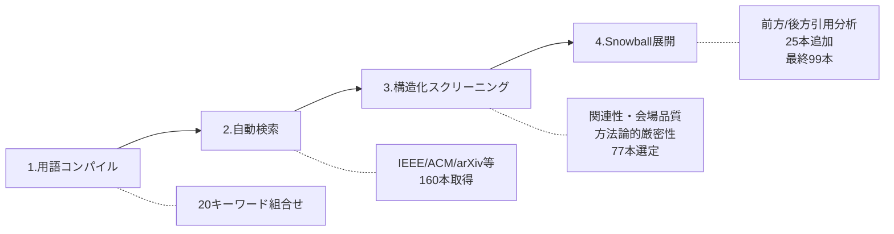

## 論文概要（Abstract）

本記事は [A Survey of Code Review Benchmarks and Evaluation Practices in Pre-LLM and LLM Era](https://arxiv.org/abs/2602.13377)（Khan et al., 2026）の解説記事です。

著者らは2015年から2025年にかけて発表されたコードレビュー自動化に関する研究99本を体系的にサーベイし、Pre-LLM時代（58本）とLLM時代（41本）のベンチマークおよび評価手法の変遷を分析している。5ドメイン・18タスクからなる多層的な分類体系（タクソノミー）を構築し、各時代でどのタスクが研究の中心にあったか、どのような評価指標が使われてきたかを定量的に明らかにしている。特に、Change Understanding and Analysis領域がPre-LLM時代には14データセットを持つ研究の柱であったのに対し、LLM時代にはわずか1データセットにまで縮小したことや、動的ランタイム評価（ビルド成功率、テスト検証、開発者受入率）がほぼ不在であることなど、現状のベンチマーク設計における重大な課題を特定している。

この記事は [Zenn記事: MCPサーバーとAGENTS.mdでコードレビュー基盤を構築しツール呼び出しを65分の1に削減する](https://zenn.dev/0h_n0/articles/840943d6211848) の深掘りです。

## 情報源

- **arXiv ID**: 2602.13377
- **URL**: [https://arxiv.org/abs/2602.13377](https://arxiv.org/abs/2602.13377)
- **著者**: Taufiqul Islam Khan, Shaowei Wang, Haoxiang Zhang, Tse-Hsun Chen
- **発表年**: 2026
- **分野**: cs.SE（Software Engineering）

## 背景と動機（Background & Motivation）

コードレビューはソフトウェア開発における品質保証の中核プロセスであり、欠陥の早期発見、知識共有、コード品質の維持に寄与する。近年、LLMの登場によりコードレビューの自動化研究は急速に拡大しているが、著者らは現状のベンチマーク環境に以下の問題を指摘している。

第一に、ベンチマークが散在しており設計方針が研究ごとに大きく異なるため、研究間の比較が困難である。第二に、既存のベンチマークがコードレビューのどの能力を実際に評価しているのかが不明確である。第三に、ソフトウェア開発ライフサイクル（SDLC）全体を意識した体系的なベンチマーク設計が存在しない。

著者らは「despite its central role in quality and maintenance, there is no systematic SDLC-aware benchmark landscape for review tasks」と述べており、本サーベイはこの空白を埋めるための最初の体系的な試みとして位置づけられている。Zenn記事で構築したMCPサーバーによるコードレビュー基盤のように、LLMを活用したレビュー自動化が実用化されつつある現在、その評価基盤の成熟度を把握することは実務的にも重要である。

## 主要な貢献（Key Contributions）

- **5ドメイン・18タスクの分類体系（タクソノミー）の構築**: コードレビュー自動化研究を体系的に整理する多層分類体系を設計し、各研究をタスクレベルで分類
- **Pre-LLM時代とLLM時代の定量的比較分析**: 99本の論文から抽出したデータセット、評価指標、言語カバレッジ、粒度などのメタデータを時代間で比較
- **未解決課題と今後の方向性の特定**: Change Understanding領域の衰退、動的評価の不在、クロスタスク評価の欠如など、ベンチマーク設計の具体的な課題を特定
- **体系的サーベイ方法論**: 4段階の収集プロセスとCohenのKappa=0.81の評価者間一致度による品質保証

## 技術的詳細（Technical Details）

### サーベイ方法論（4段階収集プロセス）

著者らは以下の4段階で論文を収集・選定している。

**Stage 1 — 用語コンパイル**: 「code review automation」「LLM for code review」など20種のキーワード組合せを設計。

**Stage 2 — 自動検索**: IEEE Xplore、ACM Digital Library、arXiv、Google Scholarを対象に2015-2025年の文献を検索し、160本を取得。

**Stage 3 — 構造化スクリーニング**: 関連性、会場品質、方法論的厳密性の3基準で選定し、データセットを公開している論文に限定して77本に絞り込み。

**Stage 4 — Snowball展開**: 選定済み論文の前方引用・後方引用を分析し、25本を追加して最終的に99本を確定。タスクラベリングの評価者間一致度はCohenのKappa=0.81と報告されている。

### 5ドメイン・18タスクの分類体系

著者らが構築したタクソノミーは、コードレビューのワークフロー全体を5つのドメインに分割し、各ドメインをさらに具体的なタスクに細分化している。

```mermaid
graph TD
    CR[コードレビュー自動化] --> D1[Review Prioritization<br/>/ Selection]
    CR --> D2[Change Understanding<br/>& Analysis]
    CR --> D3[Peer Review]
    CR --> D4[Review Assessment<br/>& Analysis]
    CR --> D5[Code Refinement]
    D1 --> T1[Change Quality Prediction]
    D1 --> T2[Review Prioritization]
    D2 --> T3[Relevant Change Identification]
    D2 --> T4[Impact Analysis]
    D2 --> T5[Change Decomposition]
    D2 --> T6[Visualization]
    D3 --> T7[Issue Localization]
    D3 --> T8[Review Comment Generation]
    D3 --> T9[Issue Labeling / Classification]
    D3 --> T10[Refactoring Identification]
    D3 --> T11[Defective Change Prediction]
    D3 --> T12[Security Detection]
    D4 --> T13[Review Quality Evaluation]
    D4 --> T14[Comment-Code Compliance]
    D4 --> T15[Review Summarization]
    D4 --> T16[Sentiment / Toxicity Analysis]
    D5 --> T17[Code Revision]
    D5 --> T18[Code Refactoring]
```

以下、各ドメインの概要を示す。

#### Domain 1: Review Prioritization / Selection（2タスク）

レビュー対象の優先度判定に関するドメイン。限られたレビュー工数をどの変更に割り当てるべきかを判断する。

- **Change Quality Prediction**: コード変更が受理されるか却下されるかを予測する。Pre-LLM時代のデータセットは35,640〜166,215サンプル規模で、3〜74プロジェクトを対象としている
- **Review Prioritization**: レビューの緊急度・重要度に基づいて処理順序を決定する

#### Domain 2: Change Understanding and Analysis（4タスク）

コード変更の内容理解と影響分析に関するドメイン。本サーベイで最も大きな時代間ギャップが発見された領域である。

- **Relevant Change Identification**: 変更セット内の関連箇所を特定する
- **Impact Analysis**: 変更がシステム全体に与える影響を分析する
- **Change Decomposition**: 大規模な変更を論理的なサブ変更に分解する
- **Visualization**: 変更の構造やレビュー活動を視覚的に表現する

著者らは、この領域がPre-LLM時代には14データセットを持つ研究の柱であったのに対し、LLM時代にはわずか1データセットにまで縮小したと報告している。タスクが消滅したのではなく、エンドツーエンドの生成プロセスに統合される形で独立した評価対象でなくなったことが要因と分析されている。

#### Domain 3: Peer Review（6タスク）

コードレビューの中核プロセスに関するドメイン。LLM時代において全データセットの約60%を占める最大の研究領域である。

- **Issue Localization**: コード中の問題箇所を特定する
- **Review Comment Generation**: レビューコメントを自動生成する。Pre-LLM時代で57,260〜151,019サンプル、LLM時代ではCodeReviewerが328,000 diff hunksを提供
- **Issue Labeling / Classification**: 検出した問題をカテゴリ分類する
- **Refactoring Identification**: リファクタリングの機会を検出する
- **Defective Change Prediction**: 欠陥を含む可能性の高い変更を予測する。27,000〜251,000サンプル規模
- **Security Detection**: セキュリティ上の脆弱性を検出する

Zenn記事で構築したMCPサーバーによるコードレビュー基盤は、主にReview Comment GenerationとIssue Localizationに該当する。本サーベイの分類体系を参照することで、カバーしていないタスク（Impact AnalysisやChange Decomposition等）を認識し、将来的な機能拡張の方向性を検討できる。

#### Domain 4: Review Assessment and Analysis（4タスク）

レビュー自体の品質を評価・分析するドメイン。

- **Review Quality Evaluation**: レビューコメントの有用性や品質を評価する
- **Comment-Code Compliance**: コメントとコードの整合性を検証する
- **Review Summarization**: レビュー議論を要約する
- **Sentiment / Toxicity Analysis**: レビューコメントの感情分析や毒性検出を行う

#### Domain 5: Code Refinement（2タスク）

レビュー結果に基づくコード修正に関するドメイン。

- **Code Revision**: レビューコメントに基づいてコードを修正する。Pre-LLM時代で17,194〜630,858メソッド規模のデータセットが存在
- **Code Refactoring**: コードの構造改善を行う

### Pre-LLM時代 vs LLM時代の比較分析

著者らは99本の論文を時代別に分析し、以下の主要な変遷を報告している。

| 観点 | Pre-LLM時代（58本） | LLM時代（41本） |
|------|---------------------|-----------------|
| 主要焦点 | Change Understanding中心、タスク分布が均等 | Peer Review中心（全データセットの約60%） |
| 言語カバレッジ | 単一言語中心（59%が1言語） | 多言語中心（34%が9言語以上をカバー） |
| 評価指標 | 分類指標中心（AUC, Precision, Recall, F-measure） | 分類指標 + 生成指標（BLEU, ROUGE, Exact Match） |
| 変更粒度 | ファイル / メソッド / チャンクと多様 | チャンクレベルdiff中心 |
| 研究スコープ | 個別タスクに特化 | エンドツーエンド生成ワークフロー |
| 発表会場 | トップ会議中心（ICSE, FSE, MSR） | arXivプレプリントの比率増加（17本） |

**タスク分布の変化**: Pre-LLM時代ではChange Understanding and Analysis、Peer Review、Code Refinementが比較的均等に研究されていたが、LLM時代ではPeer Reviewへの集中が顕著である。これは、LLMの自然言語生成能力がレビューコメント生成タスクと親和性が高いためと著者らは分析している。

**言語カバレッジの拡大**: Pre-LLM時代はJavaを中心とした単一言語研究が過半数を占めていたが、LLM時代では事前学習済みモデルの多言語対応力を活かし、34%の研究が9言語以上を対象としている。CodeReviewerデータセット（Li et al., 2022）は1,161プロジェクト、328,000 diff hunksをカバーする大規模ベンチマークであり、この傾向を代表する。

**評価指標の変化**: Pre-LLM時代はAUC、Precision、Recall、F-measureなどの分類指標が中心であった。LLM時代ではこれらに加えて、BLEU、ROUGE、Exact Matchなどのテキスト生成指標が導入されている。ただし、著者らはBLEUスコアのみでレビューコメントの有用性を測ることの限界を指摘しており、動的な評価指標の必要性を主張している。

## 実験結果（データセット分析）

### 主要データセットの規模比較

著者らは99本の論文から抽出したデータセットのメタデータを分析している。以下は時代別の主要データセット規模である。

| タスク | Pre-LLM時代 | LLM時代 |
|--------|-----------|---------|
| Change Quality Prediction | 35,640〜166,215サンプル | - |
| Review Comment Generation | 57,260〜151,019サンプル | CodeReviewer: 328,000 diff hunks |
| Code Revision | 17,194〜630,858メソッド | CodeFuse-CR-Bench等 |
| Defective Change Prediction | - | 27,000〜251,000サンプル |
| Change Type Recognition | - | 900サンプル（199プロジェクト） |

データセット規模は84サンプルから230万サンプルまで幅広く、プロジェクト数も1から11,289まで大きな差がある。著者らは「only about half release replicable datasets（約半数のみが再現可能なデータセットを公開している）」と報告しており、再現性の課題を指摘している。

### 発表会場の分布

99本の論文は47以上の会場に分散しており、主要会場はICSE（12本）、MSR（7本）、SANER（6本）、FSE（6本）である。LLM時代では17本がarXivプレプリントとして発表されており、査読付き会議への投稿前の段階で公開される研究が増加している。

### 発見された4つの主要課題

著者らは分析を通じて以下の4つの課題を特定している。

**課題1: Change Understanding and Analysisの衰退**

Pre-LLM時代に14データセットを持つ研究の柱であった領域が、LLM時代にはわずか1データセットにまで縮小している。Impact Analysis（影響分析）やChange Decomposition（変更分解）はレビュー品質に直結する重要タスクであるにもかかわらず、LLM向けのベンチマークが存在しない。

**課題2: 動的ランタイム評価の不在**

現行のベンチマークはBLEUやExact Matchなどの静的テキスト比較指標に依存しており、LLMが生成した修正コードのビルド成功率、テスト通過率、実際の開発者受入率といった動的評価がほぼ行われていない。著者らはこれを「a significant gap in practical evaluation」と指摘している。

**課題3: 複合サブタスク・多段階ワークフローのベンチマーク不在**

現実のコードレビューは単一タスクで完結するものではなく、変更理解、問題特定、コメント生成、コード修正という複数のステップが連鎖する。しかし、この多段階ワークフロー全体を評価するベンチマークは存在しない。

**課題4: マクロレベルタスクのLLMベンチマーク不足**

ファイル間の影響分析やコミットの論理的分解など、プロジェクト全体の構造を把握する必要があるマクロレベルのタスクに対するLLMベンチマークが不足している。

## 実運用への応用（Practical Applications）

本サーベイの知見は、LLMベースのコードレビューツールを構築・評価する実務者にとって以下の示唆を持つ。

**タスクカバレッジの自己診断**: 5ドメイン・18タスクのタクソノミーを参照マップとして、自社のレビュー自動化ツールがどのタスクをカバーし、どのタスクが未対応かを体系的に評価できる。Zenn記事で構築したMCPサーバーによるレビュー基盤は主にPeer Reviewドメインに位置するが、Change DecompositionやImpact Analysisへの拡張可能性を本タクソノミーから検討できる。

**評価指標の選定**: BLEU/ROUGEなどの静的指標だけでなく、生成された修正コードのビルド可否やテスト通過率を評価に組み込むことで、レビュー自動化ツールの実用的な品質を測定できる。著者らの提言に基づけば、CI/CDパイプラインと統合した動的評価フレームワークの構築が望ましい。

**多言語対応の優先度判断**: LLM時代の研究では34%が9言語以上を対象としており、多言語対応はベースライン要件となりつつある。レビュー自動化ツールの言語カバレッジを決定する際、この傾向を参考にできる。

**ベンチマークの選択**: CodeReviewer（328,000 diff hunks、1,161プロジェクト）やCodeFuse-CR-Benchなど、LLM時代の大規模ベンチマークを自社ツールの評価に活用できる。ただし、著者らが指摘するように約半数の研究のみがデータセットを公開しているため、利用可能なベンチマークの確認が必要である。

## 関連研究（Related Work）

- **CodeReviewer（Li et al., 2022）**: 328,000 diff hunksを含む大規模データセットを構築し、コードレビューの事前学習モデルを提案。本サーベイにおいてLLM時代のベンチマークの代表例として位置づけられている
- **CodeReviewQA（Lin et al., 2025a）**: コードレビューを質問応答形式で評価するベンチマーク。従来の生成指標とは異なるアプローチでレビュー能力を測定する
- **SWR-Bench（2026）**: 実世界のコードレビューコメント生成におけるLLM性能を評価するベンチマーク。本サーベイが指摘する「動的評価の不在」に対する取り組みの一つとして関連する
- **CodeFuse-CR-Bench（Guo et al., 2025b）**: 企業環境でのコードレビューを対象としたベンチマーク。実運用環境のレビューデータに基づく評価を提供する

## 今後の展望

著者らは以下の4つの方向性を提言している。

1. **LLMベンチマークの対象タスク拡大**: Change Decomposition、Impact Analysis、Visualizationなど、LLM時代にベンチマークが不在となったタスクへの対応
2. **動的ランタイム評価の導入**: ビルド成功率、テスト通過率、開発者受入率などの実行時評価指標の標準化
3. **タクソノミーに基づく細粒度ベンチマーク**: 18タスクのそれぞれに対して専用のベンチマークを設計し、LLMの能力を細粒度で評価する
4. **クロスタスク評価**: タスク間の依存関係を考慮した多段階ワークフローの評価。変更理解から修正提案まで一貫して評価するエンドツーエンドベンチマークの設計

## まとめ

本サーベイは、コードレビュー自動化のベンチマーク設計における現状と課題を体系的に明らかにした研究である。5ドメイン・18タスクのタクソノミーは、レビュー自動化ツールの能力を俯瞰的に把握するための参照フレームワークとして有用である。

特に、Change Understanding領域のLLMベンチマーク不在と動的ランタイム評価の欠如は、現在のLLMベースのレビューツールが「正しい出力を生成しているか」だけでなく「実際に役立つレビューを行っているか」を測定できていないことを示唆している。Zenn記事で構築したMCPサーバーベースのレビュー基盤をはじめ、LLMを活用したコードレビューの実用化が進む中で、著者らが提言する動的評価やクロスタスク評価の導入は、ツールの品質保証において今後重要になると考えられる。

## 参考文献

- **arXiv**: [https://arxiv.org/abs/2602.13377](https://arxiv.org/abs/2602.13377)
- **Related Zenn article**: [MCPサーバーとAGENTS.mdでコードレビュー基盤を構築しツール呼び出しを65分の1に削減する](https://zenn.dev/0h_n0/articles/840943d6211848)
- **CodeReviewer**: Li et al., "CodeReviewer: Pre-Training for Automating Code Review Activities," 2022
- **SWR-Bench**: [https://arxiv.org/abs/2509.01494](https://arxiv.org/abs/2509.01494)

---

*本記事はAIによって生成されました。論文の解説記事であり、筆者自身が実験を行ったものではありません。内容の正確性については原論文をご確認ください。*
