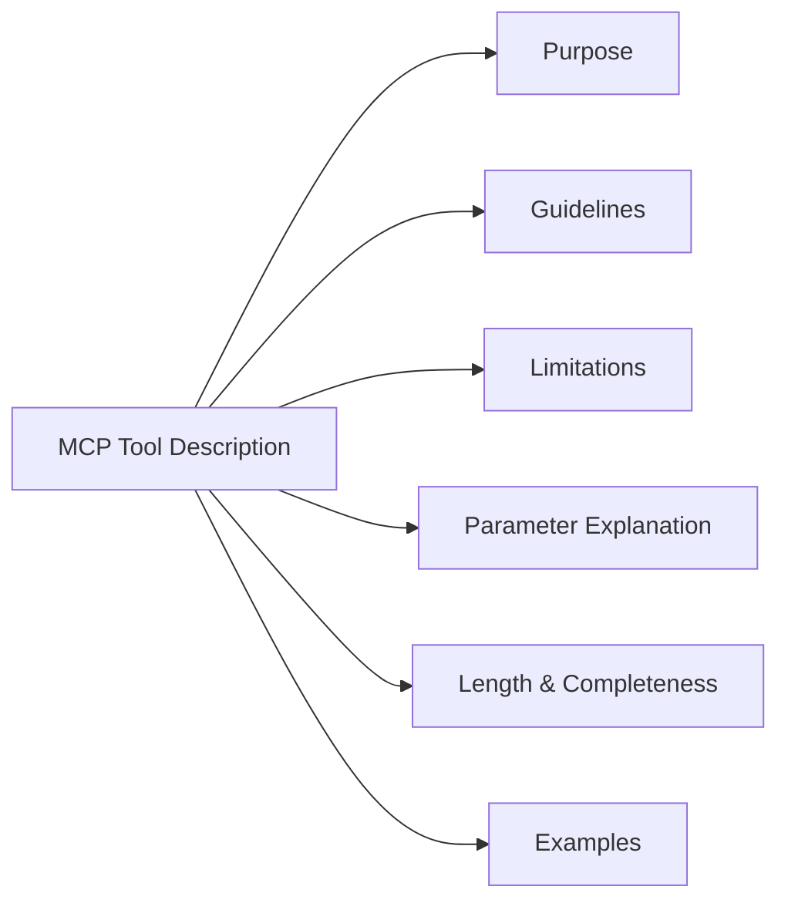
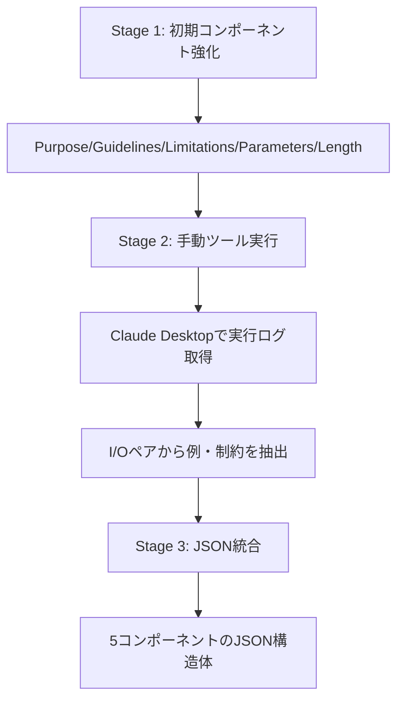

本記事は [Model Context Protocol (MCP) Tool Descriptions Are Smelly! Towards Improving AI Agent Efficiency with Augmented MCP Tool Descriptions](https://arxiv.org/abs/2602.14878) の解説記事です。

## 論文概要（Abstract）

Model Context Protocol（MCP）はFoundation Model（FM）ベースのエージェントが外部ツールと対話するための標準仕様だが、FMがツールを正しく選択・実行するには自然言語によるツール記述が不可欠である。著者らは103のMCPサーバーに含まれる856ツールを調査し、ツール記述の品質を6つのコンポーネントに基づくルーブリックで評価した。その結果、97.1%のツール記述に少なくとも1つの「smell」が含まれることを報告している。記述の改善（augmentation）はタスク成功率を中央値で5.85ポイント向上させるが、実行ステップ数は67.46%増加し、16.67%のケースでリグレッションが発生するというトレードオフも明らかにしている。

この記事は [Zenn記事: MCPサーバーとAGENTS.mdでコードレビュー基盤を構築しツール呼び出しを65分の1に削減する](https://zenn.dev/0h_n0/articles/840943d6211848) の深掘りです。

## 情報源

- **arXiv ID**: 2602.14878
- **URL**: [arXiv:2602.14878](https://arxiv.org/abs/2602.14878)
- **著者**: Mohammed Mehedi Hasan, Hao Li, Gopi Krishnan Rajbahadur, Bram Adams, Ahmed E. Hassan
- **投稿年**: 2026年2月（v3: 2026年5月31日）
- **分野**: Software Engineering (cs.SE), Emerging Technologies (cs.ET)

## 背景と動機（Background & Motivation）

MCPはAnthropicが提唱した標準プロトコルであり、2024年末の公開以降、GitHub・Slack・各種データベースなど多数のサーバー実装が公開されている。MCPでは各ツールに自然言語の記述（description）が付与され、FMはこの記述をもとにどのツールを呼び出すか、どのようなパラメータを渡すかを判断する。

しかし、ツール記述の品質に関する体系的な調査はこれまで存在しなかった。記述が不明確・不完全であれば、FMは誤ったツールを選択したり、不正確なパラメータを渡したりする可能性がある。従来のコード品質におけるコードsmellの概念と同様に、ツール記述にも「smell」が存在しうるという仮説のもと、著者らはMCPエコシステム全体にわたる大規模な実証調査を実施した。

## 主要な貢献（Key Contributions）

- **貢献1**: MCPツール記述のための構造化スコアリングルーブリックの開発。Anthropic公式ドキュメントと15のコミュニティソースに基づき、6つのコンポーネントを定義
- **貢献2**: FMベースの自動smell検出器の構築と、856ツール/103サーバーに対する大規模実証分析
- **貢献3**: ツール記述の改善プロセスとTool Description Routerの実装。改善による成功率向上とコスト増のトレードオフを定量評価
- **貢献4**: コンポーネントレベルのアブレーション分析。コンパクトな記述でトークン消費を削減しつつ信頼性を維持できることを実証

## 技術的詳細（Technical Details）

### ツール記述のSmell分類

著者らは文献調査とオープンコーディングにより、ツール記述を構成する6つのコンポーネントを特定した。各コンポーネントについて5段階のLikertスケール（1-5点）でスコアリングし、スコア3未満を「smelly」と定義している。



| コンポーネント | 説明 | Smell該当率 |
|:---|:---|:---:|
| Purpose | ツールが何をするのか、いつ使うべきか | 56.0% |
| Guidelines | 使用手順、前提条件、他ツールとの関係 | 89.3% |
| Limitations | 制約事項、エッジケース、非対応機能 | 89.8% |
| Parameter Explanation | パラメータの意味、型、デフォルト値 | 84.3% |
| Length & Completeness | 記述の十分さ（3-4文以上推奨） | 79.1% |
| Examples | 入力・出力の具体例 | 77.9% |

著者らの分析によれば、smellの出現率は公式サーバーとコミュニティサーバーの間で統計的に有意な差がないことが確認されている（Mann-Whitney U検定、全コンポーネントで$p > 0.17$）。

### ルーブリック開発プロセス

ルーブリック開発は以下の4段階で行われた。

1. **公式ドキュメント調査**: Anthropic MCPドキュメントからツール記述のベストプラクティスを抽出
2. **コミュニティソース調査**: 15のコミュニティソース（チュートリアル、ブログ、Reddit、研究論文）をLLM支援で調査
3. **オープンコーディング**: 2名の評価者が独立にコーディングし、Jaccard類似度0.92を達成
4. **5段階スコアリング**: 各コンポーネントに対してLikertスケール（1: 非常に悪い - 5: 非常に良い）を設計

### Smell検出手法: LLM-as-Jury

著者らはマルチモデルLLM-as-Juryアプローチを採用している。3つの異なるFM（GPT-4.1-mini、Claude Haiku 3.5、Qwen3-30B-A3B）が各ツール記述を独立に評価し、スコアの中央値を採用する方式である。

評価者間信頼性はIntraclass Correlation Coefficient（ICC）で測定されている。

$$
\text{ICC}(2,1) = \frac{\text{MS}_R - \text{MS}_E}{\text{MS}_R + (k-1)\text{MS}_E + \frac{k(\text{MS}_C - \text{MS}_E)}{n}}
$$

ここで、
- $\text{MS}_R$: 行（ツール）間の平均平方
- $\text{MS}_C$: 列（モデル）間の平均平方
- $\text{MS}_E$: 誤差の平均平方
- $k$: 評価者数（= 3）
- $n$: ツール数

各コンポーネントのICC(2,1)は0.62-0.90の範囲であり、90ツールに対する手動バリデーションではWeighted Cohen's Kappa 0.72-0.89を達成したと報告されている。

| コンポーネント | ICC(2,1) | Cohen's Kappa |
|:---|:---:|:---:|
| Purpose | 0.82 | 0.85 |
| Guidelines | 0.85 | 0.72 |
| Limitations | 0.84 | 0.84 |
| Parameter Explanation | 0.90 | 0.89 |
| Length & Completeness | 0.76 | 0.88 |
| Examples | 0.62 | 0.75 |

### 記述改善（Augmentation）プロセス

ツール記述の改善は3段階で実施されている。



1. **Stage 1（初期コンポーネント強化）**: Purpose、Guidelines、Limitations、Parameters、Lengthの5コンポーネントをFMで改善
2. **Stage 2（手動ツール実行）**: 各ツールに対して2-4以上のテストタスク（成功ケース、エッジケース、失敗ケース）を手動で作成し、Claude Desktopの実行ログからI/Oペアを抽出してExamplesとLimitationsを補強
3. **Stage 3（JSON統合）**: 5つのコンポーネントを統合したJSON構造体として各ツールに付与（Length/Completenessはメタ次元として除外）

### アブレーション分析

著者らはRQ3において、各コンポーネントの寄与度を検証するアブレーション実験を実施している。主要な発見は以下の通りである。

- **Purposeは必須**: 性能が維持される全ての有効な組合せにPurposeが含まれていた
- **Examplesは除去可能**: Examplesを除去しても統計的に有意な性能低下は観測されなかった
- **コンパクト記述**: Purpose + Guidelines、Purpose + Parametersなどの小規模な組合せでも、全コンポーネント適用時と同等の信頼性を維持しつつトークン消費を削減できることが報告されている

### MCP-Universeベンチマーク

評価にはMCP-Universeベンチマーク（231タスク、6ドメイン、202ツール）が使用されている。評価対象モデルはGPT-4.1、Qwen3-Coder-480B、GLM-4.5-355B、Qwen3-Next-80Bの4モデルである。

評価指標は3種類が定義されている。

- **Success Rate（SR）**: 全ての評価者をパスしたタスクの割合
- **Average Evaluator（AE）**: タスクあたりの評価者パス率の平均
- **Average Steps（AS）**: タスクあたりのFM/ツール対話ステップ数の平均

## 実装のポイント（Implementation）

### Tool Description Router

著者らは記述の切り替えとアブレーション実験を支援するTool Description Routerを実装している。このRouterはMCPクライアントの拡張として動作し、以下の機能を提供する。

```python
from dataclasses import dataclass
from typing import Optional

@dataclass
class ToolDescription:
    """MCPツール記述の構造化表現

    Attributes:
        name: ツール名
        purpose: ツールの目的と使用場面
        guidelines: 使用手順と前提条件
        limitations: 制約事項とエッジケース
        parameters: パラメータの詳細説明
        examples: 入出力の具体例
    """
    name: str
    purpose: str
    guidelines: Optional[str] = None
    limitations: Optional[str] = None
    parameters: Optional[str] = None
    examples: Optional[str] = None

    def assemble(self, components: list[str]) -> str:
        """指定コンポーネントのみを含む記述を生成

        Args:
            components: 含めるコンポーネント名のリスト

        Returns:
            組み立てられたツール記述文字列
        """
        parts: list[str] = []
        for comp in components:
            value = getattr(self, comp, None)
            if value:
                parts.append(f"[{comp.upper()}]: {value}")
        return "\n".join(parts)
```

- **実行時切り替え**: オリジナル記述と改善版記述をランタイムで切り替え
- **コンポーネントレベル組み立て**: 指定したコンポーネントのみを含む記述を動的に生成
- **PostgreSQLバックエンド**: 記述のバージョン管理と永続化

### Smell検出の実装パターン

3モデルの評価結果を収集し、各コンポーネントについて中央値を採用する。中央値の採用により単一モデルの偏りを緩和し、外れ値に対するロバスト性を確保する設計である。スコア3未満のコンポーネントが1つ以上存在すれば、そのツール記述を「smelly」と判定する。

## Production Deployment Guide

この論文のTool Description RouterとSmell検出パイプラインをAWS上でプロダクション運用するための構成を示す。コスト試算は2026年9月時点のAWS ap-northeast-1（東京）リージョン料金に基づく概算値であり、実際のコストはトラフィックパターン、リージョン、バースト使用量により変動する。

### AWS実装パターン（コスト最適化重視）

| 構成 | トラフィック | アーキテクチャ | 月額コスト |
|:---|:---|:---|:---:|
| Small | ~100 req/日 | Lambda + DynamoDB + Bedrock | $50-150 |
| Medium | ~1,000 req/日 | ECS Fargate + RDS PostgreSQL + Bedrock | $300-800 |
| Large | 10,000+ req/日 | EKS + Karpenter + Spot + RDS | $2,000-5,000 |

**コスト削減テクニック**:
- Spot Instancesで計算ノード最大90%削減
- Reserved Instances（RDS）で最大72%削減
- Bedrock Batch APIでsmell検出バッチ処理50%削減
- Prompt Caching有効化でルーブリック評価30-90%削減

### Terraformインフラコード

**Small構成（Serverless）**:

```hcl
# --- Small構成: Lambda + DynamoDB + Bedrock ---
# MCP Tool Description Smell Detector

terraform {
  required_version = ">= 1.9"
  required_providers {
    aws = { source = "hashicorp/aws", version = "~> 5.80" }
  }
}

provider "aws" { region = "ap-northeast-1" }

# IAMロール（最小権限）
resource "aws_iam_role" "smell_detector" {
  name = "mcp-smell-detector-role"
  assume_role_policy = jsonencode({
    Version = "2012-10-17"
    Statement = [{
      Action = "sts:AssumeRole"
      Effect = "Allow"
      Principal = { Service = "lambda.amazonaws.com" }
    }]
  })
}

resource "aws_iam_role_policy" "smell_detector" {
  name = "mcp-smell-detector-policy"
  role = aws_iam_role.smell_detector.id
  policy = jsonencode({
    Version = "2012-10-17"
    Statement = [
      {
        Effect   = "Allow"
        Action   = ["bedrock:InvokeModel"]
        Resource = "arn:aws:bedrock:ap-northeast-1::foundation-model/anthropic.claude-3-5-haiku-*"
      },
      {
        Effect   = "Allow"
        Action   = ["dynamodb:GetItem", "dynamodb:PutItem", "dynamodb:Query"]
        Resource = aws_dynamodb_table.descriptions.arn
      },
      {
        Effect   = "Allow"
        Action   = ["logs:CreateLogGroup", "logs:CreateLogStream", "logs:PutLogEvents"]
        Resource = "arn:aws:logs:ap-northeast-1:*:*"
      }
    ]
  })
}

# DynamoDB（ツール記述キャッシュ、On-Demandでコスト最適化）
resource "aws_dynamodb_table" "descriptions" {
  name         = "mcp-tool-descriptions"
  billing_mode = "PAY_PER_REQUEST"
  hash_key     = "server_name"
  range_key    = "tool_name"

  attribute {
    name = "server_name"
    type = "S"
  }
  attribute {
    name = "tool_name"
    type = "S"
  }

  server_side_encryption { enabled = true }
  point_in_time_recovery { enabled = true }
}

# Lambda関数
resource "aws_lambda_function" "smell_detector" {
  function_name = "mcp-smell-detector"
  role          = aws_iam_role.smell_detector.arn
  runtime       = "python3.12"
  handler       = "handler.lambda_handler"
  timeout       = 30
  memory_size   = 512
  filename      = "lambda.zip"

  environment {
    variables = {
      TABLE_NAME = aws_dynamodb_table.descriptions.name
      MODEL_ID   = "anthropic.claude-3-5-haiku-20241022-v1:0"
    }
  }

  tracing_config { mode = "Active" }
}

# CloudWatchアラーム（コスト監視）
resource "aws_cloudwatch_metric_alarm" "lambda_errors" {
  alarm_name          = "mcp-smell-detector-errors"
  comparison_operator = "GreaterThanThreshold"
  evaluation_periods  = 2
  metric_name         = "Errors"
  namespace           = "AWS/Lambda"
  period              = 300
  statistic           = "Sum"
  threshold           = 5
  alarm_description   = "Lambda error rate exceeded threshold"

  dimensions = {
    FunctionName = aws_lambda_function.smell_detector.function_name
  }
}
```

**Large構成（Container）**: `terraform-aws-modules/eks/aws` v20.31でEKS 1.31クラスタを構成し、Karpenter NodePoolでSpot優先（`m6i.large`, `m6a.large`, `m5.large`）の自動スケーリングを設定する。`consolidationPolicy: WhenEmptyOrUnderutilized`で不要ノードを30秒後に自動回収し、`aws_budgets_budget`で月額$5,000の80%到達時にアラートを発行する。

### 運用・監視設定

**CloudWatch Logs Insights クエリ（コスト異常検知）**:

```
fields @timestamp, @message
| filter @message like /bedrock/
| stats sum(input_tokens + output_tokens) as total_tokens by bin(1h) as hour
| sort hour desc
| limit 24
```

**CloudWatch アラーム（Bedrockトークン使用量）**:

```python
import boto3

cloudwatch = boto3.client("cloudwatch", region_name="ap-northeast-1")

cloudwatch.put_metric_alarm(
    AlarmName="bedrock-token-spike",
    MetricName="InputTokenCount",
    Namespace="AWS/Bedrock",
    Statistic="Sum",
    Period=3600,
    EvaluationPeriods=1,
    Threshold=100000,
    ComparisonOperator="GreaterThanThreshold",
    AlarmActions=["arn:aws:sns:ap-northeast-1:123456789012:ops-alerts"],
    Dimensions=[{"Name": "ModelId", "Value": "anthropic.claude-3-5-haiku-*"}],
)
```

**X-Ray トレーシング**: `aws_xray_sdk.core`の`patch_all()`でboto3を自動計装し、`@xray_recorder.capture`デコレータでsmell検出関数をトレースする。`put_annotation`でserver_name、`put_metadata`でtool_countとsmelly_countを記録する。

**Cost Explorer自動レポート**: `ce.get_cost_and_usage`で日次コストを取得し、Projectタグでフィルタリング。日次合計が$100を超過した場合にSNS通知を発行する。

### コスト最適化チェックリスト

**アーキテクチャ選択**:
- [ ] トラフィック量に応じた構成選択（~100 req/日: Serverless、~1000: Hybrid、10000+: Container）
- [ ] smell検出のバッチ/リアルタイム要件を確認

**リソース最適化**:
- [ ] EC2: Spot Instances優先（m6i.large Spotで最大90%削減）
- [ ] RDS: Reserved Instances 1年コミット（最大72%削減）
- [ ] Savings Plans検討（Compute Savings Plans）
- [ ] Lambda: メモリサイズ最適化（Power Tuningで検証）
- [ ] ECS/EKS: Karpenterでアイドル時自動スケールダウン

**LLMコスト削減**:
- [ ] Bedrock Batch API使用（バッチsmell検出で50%削減）
- [ ] Prompt Caching有効化（ルーブリック部分を固定、30-90%削減）
- [ ] モデル選択ロジック（初期スクリーニングはHaiku、詳細分析はSonnet）
- [ ] トークン数制限（ツール記述の最大長を設定）
- [ ] アブレーション結果を活用し、不要コンポーネントを除外してトークン削減

**監視・アラート**:
- [ ] AWS Budgets設定（月額予算の80%で警告）
- [ ] CloudWatchアラーム（Lambda エラー率、Bedrockトークンスパイク）
- [ ] Cost Anomaly Detection有効化
- [ ] 日次コストレポート（SNS通知）

**リソース管理**:
- [ ] 未使用リソース定期削除（古いLambdaバージョン、不要なスナップショット）
- [ ] タグ戦略（Project, Environment, Owner タグ必須）
- [ ] DynamoDB TTLによるキャッシュライフサイクル管理
- [ ] 開発環境の夜間・週末自動停止

## 実験結果（Results）

### RQ1: Smell の普及度

著者らの調査では、856ツールのうち97.1%が少なくとも1つのsmellを含んでいた（論文Table 3より）。コンポーネント別では、Limitations（89.8%）とGuidelines（89.3%）が最も高いsmell該当率を示し、Purpose（56.0%）が相対的に低かった。

公式サーバー（23サーバー）とコミュニティサーバー（80サーバー）の間でsmell該当率に統計的な有意差はなかった（Mann-Whitney U検定、全コンポーネントで$p > 0.17$）。MCP-Universeベンチマークに含まれるツールと残りのコーパスの間にも大きな差はなく（Cliff's $\delta$: -0.15 to -0.14）、エコシステム全体にわたる系統的な品質問題であることが示唆されている。

### RQ2: 記述改善の効果

全コンポーネントの改善（Full Augmentation）を適用した場合の結果は以下の通りである（論文Table 5より）。

| 指標 | 変化量（中央値） |
|:---|:---:|
| Success Rate（SR） | +5.85 pp |
| Average Evaluator（AE） | +15.12% |
| Average Steps（AS） | +67.46% |
| リグレッション発生率 | 16.67% |

成功率は向上するものの、実行ステップ数の大幅な増加はトークンコストの増加を意味する。著者らは「改善による性能向上は自明ではなく、実行コストとのトレードオフが存在する」と結論づけている。

### RQ3: コンポーネントアブレーション

コンポーネント単位のアブレーション実験により、以下の知見が得られている。

- **Purposeは全有効組合せに含まれる**: ツールの目的記述は性能維持に不可欠
- **Examplesの除去は統計的に有意な低下を引き起こさない**: トークン消費の削減に有効
- **ドメイン・モデル依存**: 最適なコンポーネント組合せはドメインとモデルにより異なる

この結果は、実運用において全コンポーネントを常に適用する必要はなく、Purposeを基盤としつつドメインに応じたコンパクトな記述が有効であることを示唆している。

## 実運用への応用（Practical Applications）

### MCPサーバー開発者への示唆

本論文の知見は、MCPサーバーを開発・公開する際のツール記述品質基準として直接適用できる。特に以下の点が重要である。

1. **Purposeの明確化が最優先**: 何をするツールか、いつ使うべきかを明確に記述する
2. **Guidelines・Limitationsの追加**: 使用手順と制約事項を明記することで、FMの誤った呼び出しを防止する
3. **Examplesは費用対効果で判断**: トークンコストが問題になる場合はExamplesを省略してもよい

### エージェントフレームワークへの組み込み

Zenn記事で紹介したAGENTS.mdのようなツール定義においても、本論文のsmell分類は記述品質の自己診断ツールとして活用できる。CI/CDパイプラインにsmell検出を組み込むことで、デプロイ前のツール記述品質検証が実現可能である。アブレーション結果を活用し、Purpose + ドメイン固有コンポーネントのみのコンパクト記述でトークンコストを削減する戦略も有効である。

## 関連研究（Related Work）

- **MCP仕様とエコシステム**: Anthropicが2024年末に公開したModel Context Protocolは、ツール呼び出しの標準化を目指す仕様であり、本論文はそのエコシステムにおける品質調査の先駆的研究である
- **コードsmellとの類似性**: Fowlerらのコードsmell概念をツール記述に拡張し、SE品質保証手法をAIエージェント領域に適用
- **LLM-as-Judge**: Zhengらの研究に基づくマルチモデル評価手法を、ツール記述の品質評価に特化させて適用している

## まとめと今後の展望

### まとめ

著者らは103のMCPサーバーから856ツールの記述品質を体系的に調査し、97.1%にsmellが存在することを明らかにした。6つのコンポーネントに基づくスコアリングルーブリックと自動smell検出器を構築し、記述改善による成功率向上（+5.85 pp）とステップ数増加（+67.46%）のトレードオフを定量的に報告している。アブレーション分析により、Purposeを中心としたコンパクトな記述でトークン効率と信頼性を両立できることが示されている。

### 今後の展望

1. **自動修復パイプライン**: smell検出と記述改善を自動化し、CI/CDに統合
2. **ドメイン適応**: ドメインごとの最適コンポーネント組合せの自動推薦
3. **マルチモーダル対応**: 画像・音声ツールの記述品質評価への拡張

## 参考文献

- **arXiv**: [Model Context Protocol (MCP) Tool Descriptions Are Smelly! (arXiv:2602.14878)](https://arxiv.org/abs/2602.14878)
- **MCP仕様**: [Model Context Protocol - Anthropic](https://modelcontextprotocol.io/)
- **Related Zenn article**: [MCPサーバーとAGENTS.mdでコードレビュー基盤を構築しツール呼び出しを65分の1に削減する](https://zenn.dev/0h_n0/articles/840943d6211848)
