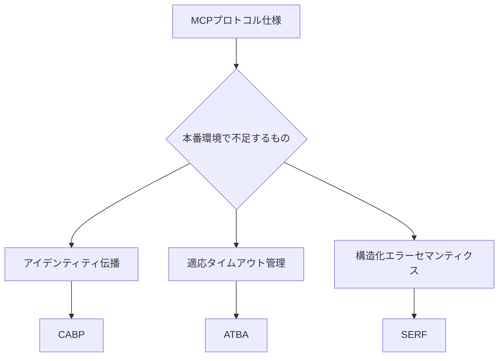
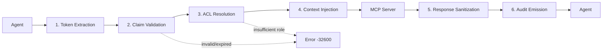

本記事は [Bridging Protocol and Production: Design Patterns for Deploying AI Agents with Model Context Protocol](https://arxiv.org/abs/2603.13417) の解説記事です。

## 論文概要（Abstract）

MCPは2026年初頭時点で10,000以上のアクティブサーバーと月間9,700万回のSDKダウンロードを記録しているが、エージェントがツールを本番環境で安全に運用する方法は標準化されていない。著者はエンタープライズデプロイの経験から、アイデンティティ伝播・適応タイムアウト・構造化エラーセマンティクスの3つの欠落を特定し、それぞれを埋めるメカニズムを提案している。

この記事は [Zenn記事: MCPサーバーとAGENTS.mdでコードレビュー基盤を構築しツール呼び出しを65分の1に削減する](https://zenn.dev/0h_n0/articles/840943d6211848) の深掘りです。

## 情報源

- **arXiv ID**: 2603.13417
- **URL**: [https://arxiv.org/abs/2603.13417](https://arxiv.org/abs/2603.13417)
- **著者**: Vasundra Srinivasan
- **発表年**: 2026年3月
- **分野**: Software Engineering (cs.SE), Artificial Intelligence (cs.AI), Multiagent Systems (cs.MA)

## 背景と動機（Background & Motivation）

MCPはJSON-RPCベースのプロトコルで、エージェントとツール間の相互運用性を実現する基盤を提供している。しかし著者は、以下の3つのギャップが本番運用を困難にしていると報告している。



1つ目はMCPにユーザーID/テナントIDを付与する標準メカニズムがなくマルチテナント環境でのデータ分離が困難なこと、2つ目は逐次ツール呼び出しで各ツールのレイテンシが異なるにもかかわらず均一な静的タイムアウトが適用されること、3つ目はツールエラーが非構造化テキストで返されエージェントが復旧可否を判別できないことである。

## 主要な貢献（Key Contributions）

- **貢献1: Context-Aware Broker Protocol（CABP）** --- JSON-RPCをアイデンティティスコープルーティングで拡張する6段階のブローカーパイプラインを設計し、マルチテナント環境でのクロステナントデータ漏洩ゼロと15ms未満のレイテンシオーバーヘッドを目標としている。
- **貢献2: Adaptive Timeout Budget Allocation（ATBA）** --- 逐次的ツール呼び出しにおけるタイムアウトを予算配分問題として定式化し、ツールごとのp99レイテンシに比例した動的予算割り当てとカスケードトリガーによるサープラス再配分を提案している。
- **貢献3: Structured Error Recovery Framework（SERF）** --- 6カテゴリのエラー分類と機械可読な復旧アクションを含む構造化エラーレスポンススキーマを定義し、自律復旧率60%以上とエラー後のハルシネーション70%以上削減を仮説として提示している。

## 技術的詳細（Technical Details）

### メカニズム1: Context-Aware Broker Protocol（CABP）

CABPはエージェントとMCPサーバーの間にミドルウェアとして配置されるブローカーであり、以下の6段階パイプラインでリクエストを処理する。



**ステージ1: Token Extraction** --- AuthorizationヘッダーからJWTを解析し、クレーム（`user_id`、`tenant_id`、`roles`、`scopes`）を抽出する。

**ステージ2: Claim Validation** --- JWTの署名をissuerの公開鍵セット（JWKS）で検証し、有効期限とissuerの信頼性を確認する。失敗時は `Error(-32600, "Invalid or expired token")` を返す。

**ステージ3: ACL Resolution** --- ユーザーのロールとツールの `allowed_roles` の共通集合を検証する。

$$
\text{roles} \cap \text{ACL}(T_i).\text{allowed\_roles} \neq \emptyset
$$

ここで $T_i$ は要求されたツールである。共通集合が空の場合は権限不足エラーを返す。

**ステージ4: Context Injection** --- リクエストにブローカーコンテキストを付与して転送する。

$$
R' = R \cup \{\_\text{broker\_context}: C\}
$$

ここで $R$ は元のリクエスト、$C = \{\text{user\_id}, \text{tenant\_id}, \text{roles}[], \text{scopes}[]\}$ はクレーム構造体である。MCPサーバーはパラメータではなくこのコンテキストからアイデンティティを読み取る。

**ステージ5: Response Sanitization** --- レスポンスにフィルタ関数 $F$ を適用し、テナントIDが一致しないレコードを除外する。

$$
F(\text{response}, \text{tenant\_id}) = \{r \in \text{response} \mid r.\text{tenant\_id} = C.\text{tenant\_id}\}
$$

これにより、MCPサーバー側のフィルタリング漏れに対する多層防御を実現する。

**ステージ6: Audit Emission** --- リクエストID、アイデンティティ、ツール名、ステータス、レイテンシ、タイムスタンプを含む構造化ログを記録する。クロステナントアクセスの試行は非ゼロ検出時にアラートを発行する。

仮説H1ではクロステナントデータ漏洩ゼロ、H2ではリクエストあたり15ms未満のレイテンシオーバーヘッドを検証対象としている。

### メカニズム2: Adaptive Timeout Budget Allocation（ATBA）

ATBAは逐次的なMCPツールチェーンのタイムアウトを予算配分問題として定式化する。$n$ 個のツール $T_1, \ldots, T_n$ を逐次呼び出すとき、各ツール $T_i$ のレイテンシ分布 $L_i$（直近 $w=100$ 回の観測ウィンドウから推定）に基づいて予算 $b_i$ を割り当てる。

$$
b_i = \frac{p_{99}(L_i)}{\sum_{j=1}^{n} p_{99}(L_j)} \times (B - B_{\text{reserve}})
$$

ここで、
- $b_i$: ツール $T_i$ に割り当てられるタイムアウト予算
- $p_{99}(L_i)$: ツール $T_i$ のp99レイテンシ
- $B$: プランナーターン全体の予算（典型的には100秒）
- $B_{\text{reserve}}$: オーバーヘッド予約（$0.10 \times B$ を推奨）

#### カスケードトリガーメカニズム

ツール $T_i$ が $t_i < b_i$ で完了した場合（サープラスが発生）、未使用分を残りのツールに均等再配分する。

$$
\forall j > i: \quad b_j \leftarrow b_j + \frac{b_i - t_i}{n - i}
$$

この仕組みにより、チェーン前半のツールが早期完了した場合に後半のツールに余裕を持たせることが可能になる。

#### 具体例: 4ツールチェーン

論文のTable 2より、$B = 100\text{s}$、$B_{\text{reserve}} = 10\text{s}$ とした場合の予算配分は以下の通りである。

| ツール | p99レイテンシ | 静的配分 | ATBA配分 |
|--------|--------------|---------|---------|
| FetchResources | 200ms | 25.0s | 17.1s |
| FetchServices | 150ms | 25.0s | 12.9s |
| FetchUsageLimits | 300ms | 25.0s | 25.7s |
| CreateLimitRequest | 400ms | 25.0s | 34.3s |

静的均一配分（各25秒）では、高レイテンシツールに不十分な予算しか割り当てられないのに対し、ATBAはp99レイテンシに比例した配分によりチェーン全体の完了率を改善する。著者はH3として静的配分比40%以上のタイムアウト削減、H4としてカスケードトリガーによる25%以上のリカバリ率を仮説として設定している。

#### レイテンシ目標の指針

論文では以下のレイテンシ閾値を提案している。

| 操作タイプ | 目標レイテンシ | 対応策 |
|-----------|-------------|-------|
| 読み取り専用 | 500ms未満 | 同期処理 |
| 中程度のクエリ | 2秒未満 | 同期処理 |
| 書き込み操作 | 5秒未満 | 同期処理 |
| 10秒超の操作 | - | MCP Tasks（非同期）として実装 |

### メカニズム3: Structured Error Recovery Framework（SERF）

SERFはMCPのツールエラーに機械可読なセマンティクスを付与するフレームワークである。MCPには2層のエラーモデルが存在する。

- **Tier 1（プロトコルエラー）**: JSON-RPCの標準エラーコード（-32700 Parse Error、-32600 Invalid Request等）で、フレームワークが自動処理する。
- **Tier 2（ツールエラー）**: `CallToolResult` の `isError: true` で返される業務ロジックエラーで、エージェントのコンテキストに注入されLLMが推論に使用する。

SERFはTier 2を以下の6カテゴリに分類し、各カテゴリに対する復旧戦略をマッピングする。

| カテゴリ | トリガー条件 | 復旧戦略 | リトライ可否 |
|---------|------------|---------|------------|
| INVALID_INPUT | パラメータ検証失敗 | エージェントが入力を再構成してリトライ | 条件付き |
| RESOURCE_NOT_FOUND | ID検索失敗 | パラメータを確認、見つからなければエスカレーション | 不可 |
| RESOURCE_EXHAUSTED | クォータ・制限到達 | リソース切替またはユーザーへエスカレーション | 不可 |
| PERMISSION_DENIED | 認可不足 | ユーザーへエスカレーション | 不可 |
| UPSTREAM_FAILURE | 一時的な依存先障害 | 指数バックオフでリトライ | 可 |
| INTERNAL_ERROR | サーバー側未処理例外 | リトライなしでエスカレーション | 不可 |

#### 構造化エラーレスポンスのスキーマ

```json
{
  "isError": true,
  "serf": {
    "category": "RESOURCE_EXHAUSTED",
    "retryable": false,
    "retry_after_ms": null,
    "suggested_actions": [
      {"action": "SWITCH_RESOURCE", "params": {"field": "project_id"}},
      {"action": "ESCALATE_TO_USER", "message": "クォータ上限に達しました"}
    ],
    "context": {"current_usage_pct": 95, "limit": 1000}
  }
}
```

`suggested_actions` はエージェントのコンテキストに注入され、LLMがその内容を読み取って復旧行動を決定する。著者はH5として自律復旧率60%以上（非構造化エラーの25%以下との比較）、H6としてエラー後のハルシネーション70%以上削減を仮説として設定している。

### 5つの設計次元

論文は本番障害モードを以下の5次元で整理している。

**次元1: Server Contract Design** --- アクション指向の命名（`FetchUsageLimits`）と2-4文の説明が推奨される。バージョンサフィックス（`_v2`）ではなくオプショナルフィールド追加で後方互換性を維持する。

**次元2: User Context** --- CABPがこの次元に対応する。入力パラメータ方式（脆弱）、ブローカー（推奨）、ネイティブサポート（将来）の3アプローチを比較している。

**次元3: Timeouts and Async** --- 個別ツール・チェーン・プランナー予算・孤立レスポンスの4障害シナリオを文書化し、10秒超操作にはMCP Tasksパターンを推奨している。

**次元4: Error Handling and Resilience** --- SERFに加え、冪等性キー（書き込み操作に24時間TTL）、サーキットブレーカー、レート制限（429 + Retry-After）を推奨している。

**次元5: Observability and Instrumentation** --- 計測は4カテゴリ（リクエスト単位、集約メトリクス、ヘルスチェック、セキュリティ）に分類される（論文Table 3）。OpenTelemetryでエージェント → ブローカー → MCPサーバー → 下流APIのエンドツーエンドトレースを実現する。

### 本番障害モード（障害事例）

論文は3つの障害事例を報告している。(1) **Phantom Tool**: 「get_usage_info」という曖昧な名前のツールがエージェントにスキップされ続け、`FetchUsageLimits`への改名と説明文追加で解決した。(2) **Silent Egress Failure**: ネットワークポリシーの問題がヘルスチェック未設置により2日間検出されず、空結果が誤解釈された。(3) **Retry Storm**: 上流API障害時に`retryable`フラグなしの汎用エラーが返され、エージェントの3回リトライで重複リクエストが作成された。

## 実装のポイント（Implementation）

**ブローカーの実装規模** --- 著者はExpress.jsまたはFlaskで約200行のコードでブローカーを実装できると報告している。トークンリフレッシュへの対応としてリクエストごとのJWT検証が推奨されている。

**レイテンシ分布の推定** --- ATBAはp99レイテンシの推定に直近100回の観測ウィンドウを使用する。初期デプロイ時は保守的な静的値から開始し、観測データ蓄積後に動的配分へ移行するアプローチが現実的である。

**SERFのLLM連携** --- `suggested_actions`テキストの品質が復旧成功率に直結する。「project_idを別の値に変更してリトライ」のような具体的で行動可能な表現が求められる。

**セキュリティ** --- 論文Table 4より、脅威モデルは4つに分類される。プロンプトインジェクション（レスポンスサニタイズ + スキーマ強制）、データ流出（入力最小化 + ブローカー監査）、権限昇格（ブローカーACL + 書き込み確認）、DoS（タイムアウト + サーキットブレーカー）である。

## Production Deployment Guide

### AWS実装パターン（コスト最適化重視）

MCPブローカー + エージェント + MCPサーバーの本番構成をAWSで実現するパターンを、トラフィック量別に整理する。以下のコスト試算は2026年9月時点のAWS ap-northeast-1（東京）リージョン料金に基づく概算値であり、実際のコストはトラフィックパターンやバースト使用量により変動する。

| 構成 | トラフィック | 主要サービス | 月額概算 |
|------|-----------|------------|---------|
| Small | ~100 req/日 | Lambda + API Gateway + DynamoDB | $50-150 |
| Medium | ~1,000 req/日 | ECS Fargate + ALB + ElastiCache | $300-800 |
| Large | 10,000+ req/日 | EKS + Karpenter + Spot Instances | $2,000-5,000 |

**Small構成**: ブローカーをLambda、MCPサーバーを別のLambdaとして配置し、DynamoDBにACL設定と冪等性キーを保存する。Provisioned Concurrency（2-5）でコールドスタートを抑制する。

**Medium構成**: ECS Fargateタスクとして配置し、ElastiCacheにJWKSキャッシュとレイテンシ観測データを保存する。Fargate Spotで最大70%削減が可能である。

**Large構成**: EKS上にデプロイし、KarpenterでSpot Instances優先の自動スケーリングを適用する。OpenTelemetry CollectorをDaemonSetとして配置し、X-Rayへトレースを送信する。

### Terraformインフラコード

#### Small構成（Serverless）

```hcl
# MCP Broker - Lambda + API Gateway + DynamoDB (2026年9月時点)
terraform {
  required_version = ">= 1.9"
  required_providers {
    aws = { source = "hashicorp/aws", version = "~> 5.60" }
  }
}

provider "aws" { region = "ap-northeast-1" }

resource "aws_iam_role" "broker_lambda" {
  name = "mcp-broker-lambda-role"
  assume_role_policy = jsonencode({
    Version = "2012-10-17"
    Statement = [{ Action = "sts:AssumeRole", Effect = "Allow",
      Principal = { Service = "lambda.amazonaws.com" } }]
  })
}

resource "aws_dynamodb_table" "acl" {
  name         = "mcp-broker-acl"
  billing_mode = "PAY_PER_REQUEST"  # 低トラフィックではOn-Demand
  hash_key     = "tool_name"
  attribute { name = "tool_name"; type = "S" }
  server_side_encryption { enabled = true }
}

resource "aws_dynamodb_table" "idempotency" {
  name         = "mcp-idempotency-keys"
  billing_mode = "PAY_PER_REQUEST"
  hash_key     = "idempotency_key"
  attribute { name = "idempotency_key"; type = "S" }
  ttl { attribute_name = "expires_at"; enabled = true }  # 24時間TTL
  server_side_encryption { enabled = true }
}

resource "aws_lambda_function" "broker" {
  function_name    = "mcp-broker"
  runtime          = "python3.12"
  handler          = "broker.handler"
  role             = aws_iam_role.broker_lambda.arn
  timeout          = 30
  memory_size      = 256  # ブローカーは軽量処理
  filename         = "broker.zip"
  source_code_hash = filebase64sha256("broker.zip")
  tracing_config { mode = "Active" }  # X-Ray有効化
  environment {
    variables = {
      ACL_TABLE = aws_dynamodb_table.acl.name
      IDEMPOTENCY_TABLE = aws_dynamodb_table.idempotency.name
      JWKS_URL = var.jwks_url
    }
  }
}
```

#### Large構成（Container）

```hcl
# MCP Broker on EKS + Karpenter + Spot Instances
module "eks" {
  source          = "terraform-aws-modules/eks/aws"
  version         = "~> 20.24"
  cluster_name    = "mcp-broker-cluster"
  cluster_version = "1.31"
  vpc_id          = module.vpc.vpc_id
  subnet_ids      = module.vpc.private_subnets
  cluster_endpoint_public_access = false  # プライベートのみ
  eks_managed_node_groups = {
    system = {
      instance_types = ["m7i.large"]
      min_size = 2; max_size = 4; desired_size = 2
      capacity_type = "ON_DEMAND"
    }
  }
}

# Karpenter NodePool - Spot優先
resource "kubectl_manifest" "karpenter_nodepool" {
  yaml_body = yamlencode({
    apiVersion = "karpenter.sh/v1"
    kind = "NodePool"
    metadata = { name = "mcp-workload" }
    spec = {
      template = { spec = { requirements = [
        { key = "karpenter.sh/capacity-type", operator = "In",
          values = ["spot", "on-demand"] },
        { key = "node.kubernetes.io/instance-type", operator = "In",
          values = ["m7i.xlarge", "m7a.xlarge", "m6i.xlarge"] }
      ] } }
      limits = { cpu = "100", memory = "400Gi" }
      disruption = { consolidationPolicy = "WhenEmptyOrUnderutilized",
        consolidateAfter = "30s" }
    }
  })
}
```

### 運用・監視設定

**CloudWatch Logs Insights**: ツール別P95/P99レイテンシ分析とクロステナントアクセス検知の2クエリを常時実行する。

**CloudWatch アラーム設定（Python）**:

```python
import boto3

cloudwatch = boto3.client("cloudwatch", region_name="ap-northeast-1")

def create_broker_latency_alarm(function_name: str, threshold_ms: float = 500) -> dict:
    """ブローカーP95レイテンシ異常検知アラームを作成する。"""
    return cloudwatch.put_metric_alarm(
        AlarmName=f"mcp-broker-{function_name}-p95-latency",
        MetricName="Duration", Namespace="AWS/Lambda",
        Statistic="p95", Period=300, EvaluationPeriods=3,
        Threshold=threshold_ms,
        ComparisonOperator="GreaterThanThreshold",
        Dimensions=[{"Name": "FunctionName", "Value": function_name}],
        AlarmActions=[sns_topic_arn],
    )
```

**X-Ray トレーシング設定（Python）**:

```python
from aws_xray_sdk.core import xray_recorder, patch_all

patch_all()  # boto3, requests等を自動計装

@xray_recorder.capture("broker_pipeline")
def handle_request(event: dict) -> dict:
    """CABPの6段階パイプラインをトレース対象として実行する。"""
    subsegment = xray_recorder.current_subsegment()
    subsegment.put_annotation("tool_name", event.get("tool_name", "unknown"))
    subsegment.put_annotation("tenant_id", event.get("tenant_id", "unknown"))
    result = execute_broker_pipeline(event)
    subsegment.put_metadata("response_size", len(str(result)))
    return result
```

### コスト最適化チェックリスト

| カテゴリ | チェック項目 |
|---------|------------|
| アーキテクチャ | トラフィック量に応じた構成選択（~100 req/日: Serverless、~1,000: Hybrid、10,000+: Container） |
| リソース最適化 | Spot Instances優先（Karpenter設定）/ Reserved 1年コミット72%削減 / Lambda Power Tuning / Karpenter consolidation有効化 |
| LLMコスト | Bedrock Batch API 50%削減 / Prompt Caching 30-90%削減 / タスク別モデル選択 / max_tokens適正化 |
| 監視 | AWS Budgets 80%閾値 / CloudWatch P95アラーム / Cost Anomaly Detection / クロステナント試行ゼロ目標 |
| リソース管理 | 未使用リソース定期削除 / タグ戦略 / DynamoDB TTL自動クリーンアップ / 開発環境夜間停止 |

## 実運用への応用（Practical Applications）

Zenn記事ではMCPサーバーとAGENTS.mdを組み合わせたコードレビュー基盤を構築し、ツール呼び出しを65分の1に削減した事例を紹介している。本論文の提案は、このようなMCPベースのシステムを本番環境に移行する際に直面する課題に対応する。

**マルチテナント対応**: CABPにより、MCPサーバー側のコード変更なしにチームごとのリポジトリアクセス制御とレビュー結果の分離が実現できる。

**レビューパイプラインの信頼性**: リポジトリ取得 → diff解析 → コメント投稿の逐次呼び出しにおいて、ATBAがdiff解析のような高レイテンシ操作に十分な予算を配分し、チェーン全体の完了率を改善する。

**障害時の自動復旧**: SERFにより`RESOURCE_EXHAUSTED`では代替ブランチへの切り替え、`UPSTREAM_FAILURE`ではバックオフ付きリトライといった復旧行動をエージェントが自律的に実行できる。

## 関連研究（Related Work）

- **Hou et al.**: 16シナリオの脅威分類を構築。CABPはデータ流出・権限昇格シナリオに対する具体的緩和策を提供する。
- **Hasan et al.**: 1,899のオープンソースMCPサーバーの実証研究で、7.2%に一般的脆弱性、5.5%にツールポイズニングの問題を報告した。
- **Li et al. (CA-MCP)**: マルチエージェント向け共有メモリストアを提案。CABPが単一リクエストのアイデンティティスコーピングに焦点を当てるのに対し、協調シナリオでのコンテキスト共有を対象としている。
- **Dhar et al.**: プロダクションエージェントAIワークフローの一般的設計指針を提示。本論文はMCPに特化した形式化で差別化される。

## まとめと今後の展望

本論文はMCPと本番環境のギャップをCABP、ATBA、SERFの3メカニズムで埋めることを提案し、各メカニズムを検証可能な仮説（H1-H6）として定式化している。5つの設計次元と障害事例カタログは実践的な設計ガイドとして機能する。MCPの簡潔さはプロトタイピングを容易にするが、信頼性のあるエージェントツール統合にはインフラレベルのメカニズムが不可欠であると著者は結論付けている。

## 参考文献

- **arXiv**: [https://arxiv.org/abs/2603.13417](https://arxiv.org/abs/2603.13417)
- **Related Zenn article**: [https://zenn.dev/0h_n0/articles/840943d6211848](https://zenn.dev/0h_n0/articles/840943d6211848)
