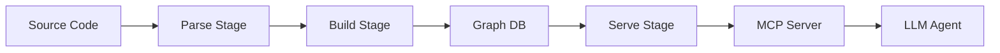
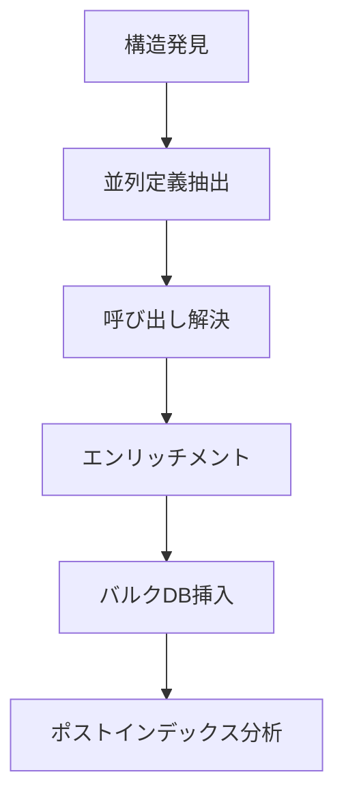

## 論文概要（Abstract）

本記事は [Codebase-Memory: Tree-Sitter-Based Knowledge Graphs for LLM Code Exploration via MCP](https://arxiv.org/abs/2603.27277)（Vogel et al., 2026）の解説記事です。

LLMベースのコーディングエージェントがソースコードを探索する際、ファイルを繰り返し読み込むことで数千トークンを消費する問題がある。著者らは、Tree-Sitterを用いてソースコードから永続的なナレッジグラフを構築し、MCPサーバーを通じてLLMに構造化されたクエリインターフェースを提供するオープンソースシステム「Codebase-Memory」を提案している。31言語の実OSSリポジトリで評価した結果、Explorer Agent（ファイル直接読み込み）と比較して、品質スコア90%を維持しつつ、トークン消費を10分の1、ツール呼び出しを2.1分の1に削減したと報告している。

この記事は [Zenn記事: MCPサーバーとAGENTS.mdでコードレビュー基盤を構築しツール呼び出しを65分の1に削減する](https://zenn.dev/0h_n0/articles/840943d6211848) の深掘りです。Zenn記事ではMCPサーバーによるコードレビュー基盤の構築を扱っているが、本論文はMCPサーバーの背後にナレッジグラフを配置することで、コード探索そのものを効率化するアプローチを提示している。

## 情報源

- **arXiv ID**: 2603.27277
- **URL**: [https://arxiv.org/abs/2603.27277](https://arxiv.org/abs/2603.27277)
- **著者**: Martin Vogel, Falk Meyer-Eschenbach, Severin Kohler, Elias Grunewald, Felix Balzer
- **投稿日**: 2026年3月28日
- **分野**: cs.SE（Software Engineering）, cs.AI, cs.PL

## 背景と動機（Background & Motivation）

LLMベースのコーディングエージェント（Claude Code、GitHub Copilot Agent等）は、コードベースを理解するためにファイルを逐次読み込む。大規模リポジトリでは「関数Aの呼び出し元を全て列挙する」といったクエリに対し、エージェントは`grep`やファイル読み込みを繰り返す必要があり、1クエリあたり約10,000トークンを消費する。これはコスト増大だけでなく、コンテキストウィンドウの浪費による応答品質の低下にもつながる。

従来のコード解析ツール（LSP、ctags等）は個別のシンボル検索には有効だが、「関数Aから関数Bへの全呼び出しパスを列挙する」「変更が影響するモジュールを特定する」といったグラフ構造を要するクエリには対応できない。著者らは、ソースコードの構造をナレッジグラフとして永続化し、MCPプロトコルを通じてLLMに公開することで、この問題を解決している。

Zenn記事で解説されているMCPサーバー構成では、ツール定義によるコードレビュー効率化が主題だった。本論文はその基盤技術として、MCPサーバーが提供するツールの背後にあるナレッジグラフの設計と構築手法を詳細に論じている。

## 主要な貢献（Key Contributions）

- **66言語対応のコードナレッジグラフ構築**: Tree-Sitterを用いて関数、クラス、呼び出し関係、インポート、HTTP通信等を抽出し、型付きノードとエッジからなるグラフを構築する汎用パイプライン
- **6戦略カスケードによる呼び出し解決**: Import map、サフィックスマッチング、ファジーマッチングの6段階で静的解析の限界を補完し、約80%の呼び出しを高信頼度で解決
- **MCPサーバーによる14ツールの公開**: コールパストレーシング、影響分析、ハブ検出等のグラフクエリをMCPツールとして型付きインターフェースで提供
- **31言語での定量評価**: Explorer Agent比でトークン10倍削減、ツール呼び出し2.1倍削減を達成しつつ、品質スコア90%を維持

## 技術的詳細（Technical Details）

### 3ステージアーキテクチャ

Codebase-Memoryは Parse, Build, Serve の3ステージで構成される。



#### Parse Stage: Tree-Sitterによる構造抽出

Tree-Sitterは66言語に対応したインクリメンタルパーサーであり、ソースコードからCST（Concrete Syntax Tree）を生成する。Codebase-Memoryはこのパーサーを用いて、各言語の文法定義に基づき以下の構造を抽出する。

- **定義**: 関数、メソッド、クラス、インターフェース、列挙型、型エイリアス
- **呼び出しサイト**: 関数呼び出し、メソッド呼び出し、非同期呼び出し
- **依存関係**: import文、require文、use文
- **参照**: 型参照、変数参照

Go、C、C++については、Tree-Sitterの構文解析だけでは型情報が不十分なため、LSPスタイルの型解決を追加実装している。これにより、メソッドのレシーバ型やテンプレートの特殊化を正確に追跡できると著者らは述べている。

#### Build Stage: マルチフェーズパイプライン

Build Stageは並列ワーカープールを用いたマルチフェーズパイプラインで構成される。



1. **構造発見**: ファイルシステムを走査し、言語別にファイルをグルーピング
2. **並列定義抽出**: ワーカープールで各ファイルからシンボル定義を並列抽出
3. **呼び出し解決**: 6戦略カスケード（後述）で呼び出しサイトを定義にリンク
4. **HTTP/セマンティック関係のエンリッチメント**: HTTPルート定義とHTTP呼び出しのマッチング、デコレータパターンの検出
5. **バルクDB挿入**: ノードとエッジをバッチでデータベースに挿入
6. **ポストインデックス分析**: ハブノード検出、循環依存検出、モジュール結合度計算

### グラフスキーマ

著者らが設計したグラフスキーマは、8種類の型付きノードと11種類の有向エッジで構成される。

**ノード型**:

| ノード型 | 説明 | 属性例 |
|---------|------|--------|
| Project | リポジトリ全体 | name, language |
| Package | パッケージ/モジュール | path |
| Function | 関数/メソッド | name, signature, line_start, line_end |
| Class | クラス | name, methods_count |
| Interface | インターフェース | name |
| Enum | 列挙型 | name, variants |
| Type | 型エイリアス | name, definition |
| Route | HTTPエンドポイント | method, path, handler |

**エッジ型**:

| エッジ型 | 方向 | 意味 |
|---------|------|------|
| CALLS | Function -> Function | 同期呼び出し |
| HTTP_CALLS | Function -> Route | HTTP経由の呼び出し |
| ASYNC_CALLS | Function -> Function | 非同期呼び出し |
| CONTAINS | Package -> Function/Class | 包含関係 |
| DEFINES | Class -> Function | メソッド定義 |
| IMPLEMENTS | Class -> Interface | インターフェース実装 |
| INHERITS | Class -> Class | 継承関係 |
| USES_TYPE | Function -> Type/Class | 型使用 |
| IMPORTS | Package -> Package | インポート依存 |
| TESTS | Function -> Function | テスト対象関係 |
| DECORATES | Function -> Function | デコレータ適用 |

このスキーマにより、「関数Aを変更した場合に影響を受ける全関数」（CALLS/HTTP_CALLSエッジの逆引きBFS）や「クラスBを実装する全クラス」（IMPLEMENTSエッジの探索）といったクエリをグラフ走査で効率的に実行できる。

### 呼び出し解決の6戦略カスケード

静的解析における呼び出し解決は、動的型付け言語や高階関数の存在により困難な問題である。著者らは以下の6戦略を信頼度の降順で適用するカスケード方式を採用している。

| 優先度 | 戦略 | 信頼度 | 解決率への寄与 |
|-------|------|--------|-------------|
| 1 | Import map | 0.95 | 高 |
| 2 | Import map suffix | 0.85 | 中 |
| 3 | Same module | 0.90 | 高 |
| 4 | Unique name lookup | 0.75 | 低 |
| 5 | Suffix matching | 0.55 | 低 |
| 6 | Fuzzy matching | 0.30-0.40 | 低 |

著者らは、戦略1-3で約80%の呼び出しを解決できると報告している。信頼度スコアは各解決結果に付与され、LLMがクエリ結果を解釈する際に曖昧さの程度を把握できる。

**戦略1: Import map**は、ファイル先頭のimport文から完全修飾名を構築し、呼び出しサイトの名前と照合する。Pythonの`from module import func`やTypeScriptの`import { func } from './module'`のように、インポート元が明示されている場合に高い精度で解決できる。

**戦略3: Same module**は、同一ファイル内での呼び出しを解決する。ローカル関数の呼び出しは多くの場合インポートを伴わないため、この戦略が補完する。

**戦略6: Fuzzy matching**は、編集距離やトークン類似度を用いて名前の近い定義を候補として提示する。信頼度が低いため、他の戦略で解決できなかった場合にのみ適用される。

擬似コードで表現すると以下のようになる。

```python
from dataclasses import dataclass


@dataclass
class Resolution:
    """呼び出し解決の結果を表すデータクラス。

    Attributes:
        target: 解決先の関数定義ノードID
        confidence: 解決の信頼度 (0.0-1.0)
        strategy: 使用した解決戦略名
    """
    target: str
    confidence: float
    strategy: str


def resolve_call(
    call_site: str,
    import_map: dict[str, str],
    module_symbols: dict[str, list[str]],
    global_symbols: dict[str, list[str]],
) -> Resolution | None:
    """6戦略カスケードで呼び出しサイトを解決する。

    Args:
        call_site: 呼び出しサイトの識別子
        import_map: インポート文から構築した名前->定義のマップ
        module_symbols: モジュール内のシンボル一覧
        global_symbols: グローバルなシンボル一覧

    Returns:
        Resolution or None: 解決結果。解決できない場合はNone
    """
    strategies = [
        ("import_map", 0.95, lambda: import_map.get(call_site)),
        ("import_suffix", 0.85, lambda: _suffix_match(call_site, import_map)),
        ("same_module", 0.90, lambda: _module_lookup(call_site, module_symbols)),
        ("unique_name", 0.75, lambda: _unique_lookup(call_site, global_symbols)),
        ("suffix_match", 0.55, lambda: _suffix_global(call_site, global_symbols)),
        ("fuzzy_match", 0.35, lambda: _fuzzy_match(call_site, global_symbols)),
    ]
    for name, confidence, resolver in strategies:
        if (target := resolver()) is not None:
            return Resolution(target=target, confidence=confidence, strategy=name)
    return None
```

### MCPサーバーの14ツール

Serve StageではMCPサーバーが14個の型付きツールを公開する。Zenn記事で解説されているMCPツール定義のパターンと共通するが、本論文ではグラフクエリに特化したツールセットを設計している。

主要なツールを以下に示す。

| ツール名 | 機能 | 入力パラメータ |
|---------|------|---------------|
| find_function | 関数定義の検索 | name, language, file_path |
| get_callers | 指定関数の呼び出し元一覧 | function_id, depth |
| get_callees | 指定関数の呼び出し先一覧 | function_id, depth |
| trace_call_path | 2関数間の呼び出しパス | source_id, target_id, max_depth |
| impact_analysis | 変更影響分析 | function_id, change_type |
| find_hubs | 高結合度ノードの検出 | min_connections, node_type |
| get_dependencies | パッケージ依存関係 | package_id, direction |
| find_tests | テスト関数の検索 | function_id |

`trace_call_path`は2つの関数間の全呼び出しパスをBFS/DFSで列挙する。`impact_analysis`は指定関数を変更した場合に影響を受ける関数をCALLS/HTTP_CALLSエッジの逆方向に探索して返す。これらのツールにより、LLMは1回のツール呼び出しで従来の複数ファイル読み込みに相当する情報を取得できる。

## 実装のポイント（Implementation）

### インデックス性能

著者らが報告するインデックス性能は以下の通りである。

| リポジトリ | ノード数 | エッジ数 | 初回インデックス時間 |
|-----------|---------|---------|-------------------|
| 中規模OSS（約49K行） | 49,000 | 196,000 | 約6秒 |
| Linuxカーネル | 2,100,000 | 4,900,000 | 約3分 |

インクリメンタル再インデックスは約1.2秒で完了すると報告されており、ファイル保存時のフックで自動実行しても開発ワークフローを阻害しないレベルである。

### クエリレイテンシ

グラフクエリのレイテンシは1ms未満であると著者らは報告している。これはExplorer Agentの10-30秒（ファイル読み込み＋grep実行）と比較して100倍以上高速であり、LLMのツール呼び出しのオーバーヘッド（ネットワーク往復等）がボトルネックになるレベルである。

### セキュリティ設計

Codebase-Memoryはコードベースの構造情報をデータベースに永続化するため、セキュリティが重要な設計要素となる。著者らは8層のCIセキュリティスイートを実装している。

1. **静的allow-list**: 許可されたバイナリ・ライブラリのみ実行可能
2. **バイナリ文字列スキャン**: ビルド成果物に含まれる文字列を検査
3. **ネットワーク出口監視**: straceで外部通信を監視し、想定外の通信をブロック
4. **VirusTotal連携**: ビルド成果物のマルウェアスキャン
5. **SLSA**: ビルド来歴（provenance）の検証
6. **CodeQL**: 静的解析によるセキュリティ脆弱性検出
7. **OpenSSF Scorecard**: オープンソースセキュリティのベストプラクティス評価
8. **依存関係監査**: サプライチェーン攻撃の検出

## Production Deployment Guide

本論文のCodebase-Memoryは実装が公開されたオープンソースシステムであるため、プロダクション環境へのデプロイパターンを示す。

> **注記**: 以下のコスト試算は2026年9月時点のAWS東京リージョン（ap-northeast-1）料金に基づく概算値です。実際のコストはトラフィックパターン、リージョン、バースト使用量により変動します。最新料金は[AWS料金計算ツール](https://calculator.aws/)で確認してください。

### AWS実装パターン（コスト最適化重視）

Codebase-Memoryのデプロイは、グラフDB + MCPサーバー + インデクサの3コンポーネントで構成される。トラフィック量別の推奨構成を以下に示す。

| 構成 | トラフィック | コンポーネント | 月額概算 |
|------|------------|--------------|---------|
| Small | ~100 req/日 | Lambda + DynamoDB + S3 | $50-120 |
| Medium | ~1,000 req/日 | ECS Fargate + Neptune Serverless | $400-900 |
| Large | 10,000+ req/日 | EKS + Neptune + ElastiCache | $2,500-5,500 |

**Small構成の詳細**:
- Lambda（MCPサーバー）: 256MB、30秒タイムアウト、~$5/月
- DynamoDB On-Demand（グラフストレージ）: 隣接リスト パターンで実装、~$15/月
- S3（インデックスキャッシュ）: ~$1/月
- CloudWatch Logs: ~$5/月
- 合計: $50-120/月（Bedrock API費用を含む場合）

**Medium構成の詳細**:
- ECS Fargate（MCPサーバー + インデクサ）: 0.5 vCPU / 1GB RAM x 2タスク、~$60/月
- Neptune Serverless（グラフDB）: 2.5-8 NCU、~$250/月
- NAT Gateway: ~$35/月
- CloudWatch + X-Ray: ~$15/月

**Large構成の詳細**:
- EKS（コントロールプレーン）: ~$75/月
- EC2 Spot Instances（ワーカー）: m6i.xlarge x 3、Spot価格で~$120/月
- Neptune（プロビジョンド）: db.r6g.xlarge、~$600/月
- ElastiCache（クエリキャッシュ）: cache.r6g.large、~$200/月

**コスト削減テクニック**:
- Neptune Serverless: アイドル時にNCUが自動スケールダウンし、未使用時のコストを削減
- Spot Instances: インデクサワーカーをSpotで実行し最大90%削減
- S3 Intelligent-Tiering: インデックスキャッシュの自動階層化
- Reserved Instances: Neptuneの1年リザーブドで最大40%削減

### Terraformインフラコード

**Small構成（Serverless: Lambda + DynamoDB）**:

```hcl
# Codebase-Memory Small構成
# Lambda + DynamoDB隣接リストパターン

terraform {
  required_version = ">= 1.9"
  required_providers {
    aws = {
      source  = "hashicorp/aws"
      version = "~> 5.60"
    }
  }
}

provider "aws" {
  region = "ap-northeast-1"
}

# DynamoDB: 隣接リストパターンでグラフを格納
resource "aws_dynamodb_table" "code_graph" {
  name         = "codebase-memory-graph"
  billing_mode = "PAY_PER_REQUEST"
  hash_key     = "PK"  # NODE#<id> or EDGE#<src>
  range_key    = "SK"   # META or TARGET#<dst>

  attribute {
    name = "PK"
    type = "S"
  }
  attribute {
    name = "SK"
    type = "S"
  }
  attribute {
    name = "GSI1PK"
    type = "S"
  }
  attribute {
    name = "GSI1SK"
    type = "S"
  }

  # 逆引きインデックス（呼び出し元検索用）
  global_secondary_index {
    name            = "GSI1"
    hash_key        = "GSI1PK"
    range_key       = "GSI1SK"
    projection_type = "ALL"
  }

  point_in_time_recovery { enabled = true }
  server_side_encryption { enabled = true }

  tags = {
    Project     = "codebase-memory"
    Environment = "production"
    CostCenter  = "ai-tools"
  }
}

# Lambda: MCPサーバー
resource "aws_lambda_function" "mcp_server" {
  function_name = "codebase-memory-mcp"
  runtime       = "provided.al2023"
  handler       = "bootstrap"
  memory_size   = 256
  timeout       = 30
  architectures = ["arm64"]  # Graviton: x86比20%安価

  s3_bucket = aws_s3_bucket.deploy.id
  s3_key    = "lambda/mcp-server.zip"

  environment {
    variables = {
      DYNAMODB_TABLE = aws_dynamodb_table.code_graph.name
      LOG_LEVEL      = "INFO"
    }
  }

  role = aws_iam_role.lambda_exec.arn

  tracing_config { mode = "Active" }  # X-Ray有効化
}

# IAMロール（最小権限）
resource "aws_iam_role" "lambda_exec" {
  name = "codebase-memory-lambda"
  assume_role_policy = jsonencode({
    Version = "2012-10-17"
    Statement = [{
      Action    = "sts:AssumeRole"
      Effect    = "Allow"
      Principal = { Service = "lambda.amazonaws.com" }
    }]
  })
}

resource "aws_iam_role_policy" "lambda_policy" {
  name = "codebase-memory-lambda-policy"
  role = aws_iam_role.lambda_exec.id
  policy = jsonencode({
    Version = "2012-10-17"
    Statement = [
      {
        Effect   = "Allow"
        Action   = ["dynamodb:GetItem", "dynamodb:Query", "dynamodb:BatchGetItem"]
        Resource = [
          aws_dynamodb_table.code_graph.arn,
          "${aws_dynamodb_table.code_graph.arn}/index/*"
        ]
      },
      {
        Effect   = "Allow"
        Action   = ["logs:CreateLogGroup", "logs:CreateLogStream", "logs:PutLogEvents"]
        Resource = "arn:aws:logs:*:*:*"
      },
      {
        Effect   = "Allow"
        Action   = ["xray:PutTraceSegments", "xray:PutTelemetryRecords"]
        Resource = "*"
      }
    ]
  })
}

# S3: デプロイ用
resource "aws_s3_bucket" "deploy" {
  bucket_prefix = "codebase-memory-deploy-"
}

# CloudWatchアラーム: Lambda実行時間
resource "aws_cloudwatch_metric_alarm" "lambda_duration" {
  alarm_name          = "codebase-memory-lambda-duration"
  comparison_operator = "GreaterThanThreshold"
  evaluation_periods  = 3
  metric_name         = "Duration"
  namespace           = "AWS/Lambda"
  period              = 300
  statistic           = "p99"
  threshold           = 25000  # 25秒（タイムアウト30秒の83%）
  alarm_actions       = []     # SNSトピックARNを設定

  dimensions = {
    FunctionName = aws_lambda_function.mcp_server.function_name
  }
}
```

**Large構成（Container: EKS + Karpenter + Neptune）**:

```hcl
# Codebase-Memory Large構成
# EKS + Karpenter + Neptune

module "eks" {
  source  = "terraform-aws-modules/eks/aws"
  version = "~> 20.24"

  cluster_name    = "codebase-memory"
  cluster_version = "1.31"

  vpc_id     = module.vpc.vpc_id
  subnet_ids = module.vpc.private_subnets

  # Karpenter用のIAM設定
  enable_cluster_creator_admin_permissions = true

  cluster_addons = {
    karpenter = { most_recent = true }
  }
}

# Karpenter NodePool: Spot優先
resource "kubectl_manifest" "karpenter_nodepool" {
  yaml_body = yamlencode({
    apiVersion = "karpenter.sh/v1"
    kind       = "NodePool"
    metadata   = { name = "codebase-memory" }
    spec = {
      template = {
        spec = {
          requirements = [
            { key = "karpenter.sh/capacity-type", operator = "In", values = ["spot", "on-demand"] },
            { key = "node.kubernetes.io/instance-type", operator = "In",
              values = ["m6i.xlarge", "m6i.2xlarge", "m7i.xlarge", "m7i.2xlarge"] },
            { key = "topology.kubernetes.io/zone", operator = "In",
              values = ["ap-northeast-1a", "ap-northeast-1c"] }
          ]
          nodeClassRef = { name = "default" }
        }
      }
      limits   = { cpu = "32", memory = "128Gi" }
      disruption = {
        consolidationPolicy = "WhenEmptyOrUnderutilized"
        consolidateAfter    = "30s"
      }
    }
  })
}

# Neptune: グラフDB
resource "aws_neptune_cluster" "graph" {
  cluster_identifier  = "codebase-memory"
  engine              = "neptune"
  engine_version      = "1.3.4.0"
  availability_zones  = ["ap-northeast-1a", "ap-northeast-1c"]
  storage_encrypted   = true
  skip_final_snapshot = false

  neptune_cluster_parameter_group_name = aws_neptune_cluster_parameter_group.graph.name
}

resource "aws_neptune_cluster_instance" "graph" {
  count              = 2
  cluster_identifier = aws_neptune_cluster.graph.id
  instance_class     = "db.r6g.xlarge"
  engine             = "neptune"
}

resource "aws_neptune_cluster_parameter_group" "graph" {
  family = "neptune1.3"
  name   = "codebase-memory"

  parameter {
    name  = "neptune_query_timeout"
    value = "30000"  # 30秒
  }
}

# AWS Budgets: コストアラート
resource "aws_budgets_budget" "monthly" {
  name         = "codebase-memory-monthly"
  budget_type  = "COST"
  limit_amount = "6000"
  limit_unit   = "USD"
  time_unit    = "MONTHLY"

  notification {
    comparison_operator       = "GREATER_THAN"
    threshold                 = 80
    threshold_type            = "PERCENTAGE"
    notification_type         = "ACTUAL"
    subscriber_email_addresses = ["ops-team@example.com"]
  }
}
```

### 運用・監視設定

**CloudWatch Logs Insights クエリ**（コスト異常検知）:

```
fields @timestamp, tool_name, tokens_used, latency_ms
| filter tool_name in ["trace_call_path", "impact_analysis", "get_callers"]
| stats sum(tokens_used) as total_tokens, avg(latency_ms) as avg_latency,
         count(*) as call_count by bin(1h) as hour
| filter total_tokens > 50000
| sort hour desc
```

**CloudWatch アラーム設定**（Python）:

```python
import boto3


def create_mcp_alarms(function_name: str, sns_topic_arn: str) -> None:
    """Codebase-Memory MCPサーバーのCloudWatchアラームを作成する。

    Args:
        function_name: Lambda関数名
        sns_topic_arn: 通知先SNSトピックARN
    """
    cw = boto3.client("cloudwatch", region_name="ap-northeast-1")

    # Lambda同時実行数スパイク検知
    cw.put_metric_alarm(
        AlarmName=f"{function_name}-concurrency-spike",
        MetricName="ConcurrentExecutions",
        Namespace="AWS/Lambda",
        Statistic="Maximum",
        Period=60,
        EvaluationPeriods=3,
        Threshold=50,
        ComparisonOperator="GreaterThanThreshold",
        Dimensions=[{"Name": "FunctionName", "Value": function_name}],
        AlarmActions=[sns_topic_arn],
    )
```

**X-Ray トレーシング設定**（Python）:

```python
from aws_xray_sdk.core import xray_recorder, patch_all


def init_tracing(service_name: str = "codebase-memory-mcp") -> None:
    """X-Rayトレーシングを初期化する。

    Args:
        service_name: サービス名（X-Rayサービスマップに表示）
    """
    xray_recorder.configure(service=service_name)
    patch_all()  # boto3, requests等を自動計装


def trace_graph_query(tool_name: str, query_params: dict) -> None:
    """グラフクエリにX-Rayアノテーションを付与する。

    Args:
        tool_name: MCPツール名
        query_params: クエリパラメータ
    """
    segment = xray_recorder.current_segment()
    segment.put_annotation("tool_name", tool_name)
    segment.put_metadata("query_params", query_params, "mcp")
```

**Cost Explorer日次レポート**（Python）:

```python
import boto3
from datetime import date, timedelta


def get_daily_cost_report() -> dict:
    """Codebase-Memory関連の日次コストレポートを取得する。

    Returns:
        サービス別コストの辞書
    """
    ce = boto3.client("ce", region_name="us-east-1")
    today = date.today()
    yesterday = today - timedelta(days=1)

    response = ce.get_cost_and_usage(
        TimePeriod={"Start": str(yesterday), "End": str(today)},
        Granularity="DAILY",
        Metrics=["UnblendedCost"],
        Filter={
            "Tags": {
                "Key": "Project",
                "Values": ["codebase-memory"],
            }
        },
        GroupBy=[{"Type": "DIMENSION", "Key": "SERVICE"}],
    )

    costs: dict[str, float] = {}
    for group in response["ResultsByTime"][0]["Groups"]:
        service = group["Keys"][0]
        amount = float(group["Metrics"]["UnblendedCost"]["Amount"])
        costs[service] = amount

    total = sum(costs.values())
    if total > 100:  # $100/日超過でアラート
        sns = boto3.client("sns", region_name="ap-northeast-1")
        sns.publish(
            TopicArn="arn:aws:sns:ap-northeast-1:ACCOUNT:cost-alert",
            Subject=f"Codebase-Memory daily cost alert: ${total:.2f}",
            Message=f"Daily cost exceeded $100: ${total:.2f}\n{costs}",
        )
    return costs
```

### コスト最適化チェックリスト

**アーキテクチャ選択**:
- [ ] トラフィック~100 req/日 -> Small（Lambda + DynamoDB）
- [ ] トラフィック~1,000 req/日 -> Medium（ECS + Neptune Serverless）
- [ ] トラフィック10,000+ req/日 -> Large（EKS + Neptune + ElastiCache）

**リソース最適化**:
- [ ] Lambda: Graviton（arm64）で20%コスト削減
- [ ] Lambda: メモリサイズをPower Tuningで最適化
- [ ] EC2/EKS: Spot Instancesを優先（インデクサワーカー）
- [ ] Neptune: Serverlessモードでアイドル時コスト削減
- [ ] Neptune: 1年Reserved Instanceで40%削減
- [ ] ElastiCache: Reserved Nodeで最大50%削減

**グラフDB最適化**:
- [ ] DynamoDB: On-Demandモードで過剰プロビジョニング回避
- [ ] Neptune: クエリタイムアウト設定（無限ループ防止）
- [ ] インクリメンタルインデックス: 差分のみ更新（フルリビルド回避）
- [ ] クエリ結果キャッシュ: ElastiCache or Lambda内キャッシュ

**監視・アラート**:
- [ ] AWS Budgets: 月額予算アラート設定
- [ ] CloudWatch: Lambda実行時間・同時実行数アラーム
- [ ] Cost Anomaly Detection: 自動異常検知有効化
- [ ] 日次コストレポート: SNS通知で毎朝確認

**リソース管理**:
- [ ] タグ戦略: Project/Environment/CostCenterタグ必須
- [ ] 未使用リソース: 月次で未使用Neptune/ElastiCache確認
- [ ] ログ保持期間: CloudWatch Logsの保持期間設定（30日）
- [ ] 開発環境: 夜間・週末のEKSノード自動停止

## 実験結果（Results）

### MCP Agent vs Explorer Agentの比較

著者らは31言語の実OSSリポジトリを用いて、MCP Agent（Codebase-Memory使用）とExplorer Agent（ファイル直接読み込み）を比較評価している。評価はコード探索タスク（関数の呼び出し元列挙、依存関係の追跡、変更影響分析等）に対する応答品質、トークン消費、ツール呼び出し回数で測定されている。

| 指標 | MCP Agent | Explorer Agent | 比率 |
|------|-----------|---------------|------|
| 品質スコア | 0.83 | 0.92 | 90% |
| ツール呼び出し/クエリ | 2.3 | 4.8 | 2.1倍削減 |
| トークン/クエリ | ~1,000 | ~10,000 | 10倍削減 |
| レイテンシ | <1ms | 10-30s | 100倍以上高速 |

品質スコアはMCP Agentが0.83でExplorer Agentの0.92の90%を達成している。著者らは、この10%の品質低下はトークン消費10倍削減との比較で許容範囲内であると述べている。品質低下の主な原因は、静的解析の限界に起因する呼び出し解決の漏れ（特に動的ディスパッチやリフレクション経由の呼び出し）であると分析している。

### 言語別の性能差

著者らは31言語で評価を実施しているが、言語によって品質スコアに差異がある。

- **高品質言語（0.85以上）**: TypeScript、Python、Java、Go等の型情報が豊富またはインポート構文が明確な言語
- **中品質言語（0.70-0.85）**: JavaScript（CommonJS混在）、Ruby等の動的型付け言語
- **低品質言語（0.58）**: C言語（マクロ多用）。プリプロセッサマクロの展開が必要なケースで、Tree-Sitterの構文解析だけでは関数呼び出しを検出できない

C言語で品質0.58という結果は、本システムの制約を明確に示している。マクロ展開やプリプロセッサディレクティブは静的解析の範囲外であり、この改善には前処理段階でのマクロ展開が必要になると著者らは述べている。

### インデックス性能

初回インデックスは中規模リポジトリ（49Kノード、196Kエッジ）で約6秒、Linuxカーネル（2.1Mノード、4.9Mエッジ）で約3分を要する。インクリメンタル再インデックスは変更ファイルのみを対象とし、約1.2秒で完了する。

### 制約と限界

著者らは以下の制約を明示している。

1. **単一LLMバックエンド**: 評価はClaude Opus 4.6のみで実施。他のLLM（GPT-4、Gemini等）での性能は未検証
2. **静的解析の限界**: 動的ディスパッチ（仮想関数呼び出し、リフレクション）は追跡不可
3. **マクロ依存コード**: C/C++のプリプロセッサマクロは構文解析前に展開されず、呼び出し解決精度が低下
4. **クエリ結果上限**: 100,000行の上限があり、超大規模リポジトリの全網羅クエリには不向き

## 実運用への応用（Practical Applications）

### Zenn記事との関連

Zenn記事ではMCPサーバーとAGENTS.mdを組み合わせてコードレビュー基盤を構築し、ツール呼び出しを65分の1に削減する手法を解説している。本論文のCodebase-Memoryは、そのMCPサーバーの背後にナレッジグラフを配置することで、コード構造の把握自体を効率化するアプローチである。

両者を組み合わせることで、以下のワークフローが実現できる。

1. **コード変更時**: Codebase-Memoryが変更の影響範囲をグラフクエリで特定（`impact_analysis`ツール）
2. **レビュー時**: AGENTS.mdで定義されたレビュー基準に基づき、影響範囲のコードをレビュー
3. **テスト時**: 変更に関連するテスト関数を`find_tests`ツールで特定し、選択的に実行

### 大規模コードベースでの活用

Linuxカーネル規模（2.1Mノード）のコードベースでも3分でインデックスが完了する性能は、エンタープライズ環境での実用性を示している。CI/CDパイプラインにインデクサを組み込み、マージ時に自動的にグラフを更新するワークフローが考えられる。

### 既存ツールとの統合

Codebase-MemoryはMCPプロトコルを採用しているため、MCP対応のLLMツール（Claude Code、Cursor等）からそのまま利用できる。既存のLSPサーバーやctagsとは異なり、グラフ構造を活用したクエリ（呼び出しパス追跡、影響分析等）が可能な点が差別化要因である。

## 関連研究（Related Work）

- **aider** (Gauthier, 2024): LLMベースのコーディングアシスタント。ファイル全体をコンテキストに投入するアプローチで、大規模リポジトリではトークン消費が問題となる。Codebase-Memoryはグラフクエリにより必要な情報のみを取得する点で改善している
- **Repomix** (2025): リポジトリ全体をLLMに渡すためのコンテキスト圧縮ツール。テキストベースの圧縮であり、構造的なクエリには対応できない。Codebase-Memoryはグラフ構造を保持する点で異なる
- **CodeGraph** (Zhang et al., 2025): コードのナレッジグラフ構築に関する研究。本論文はMCPプロトコルを通じたLLM統合と、66言語対応の実用性で差別化している
- **MCP (Model Context Protocol)**: Anthropicが提案したLLMとツール間の標準プロトコル。Zenn記事で詳しく解説されている。Codebase-Memoryはこのプロトコルのサーバー実装として、コード構造クエリに特化したツールを提供している

## まとめと今後の展望

Codebase-Memoryは、Tree-Sitterベースのコード解析とナレッジグラフ、MCPサーバーを組み合わせることで、LLMエージェントのコード探索を効率化するシステムである。31言語での評価では、品質スコア90%を維持しつつ、トークン消費を10倍、ツール呼び出しを2.1倍削減することを著者らは実証している。6戦略カスケードによる呼び出し解決は静的解析の限界を補完する実用的なアプローチであり、約80%の呼び出しを高信頼度で解決できると報告されている。

一方で、C言語のマクロ依存コード（品質0.58）や動的ディスパッチの追跡不可といった制約も明確であり、単一LLMバックエンド（Claude Opus 4.6）での評価にとどまっている点は今後の検証が必要である。プロダクション環境への導入に際しては、言語ごとの品質差を考慮した運用設計が求められる。

## 参考文献

- **arXiv**: [https://arxiv.org/abs/2603.27277](https://arxiv.org/abs/2603.27277)
- **Related Zenn article**: [https://zenn.dev/0h_n0/articles/840943d6211848](https://zenn.dev/0h_n0/articles/840943d6211848)
- **Tree-Sitter**: [https://tree-sitter.github.io/tree-sitter/](https://tree-sitter.github.io/tree-sitter/)
- **Model Context Protocol (MCP)**: [https://modelcontextprotocol.io/](https://modelcontextprotocol.io/)

---

:::message
この記事はAI（Claude Code）により自動生成されました。内容の正確性については原論文と照合していますが、最新情報は公式ソースもご確認ください。
:::
