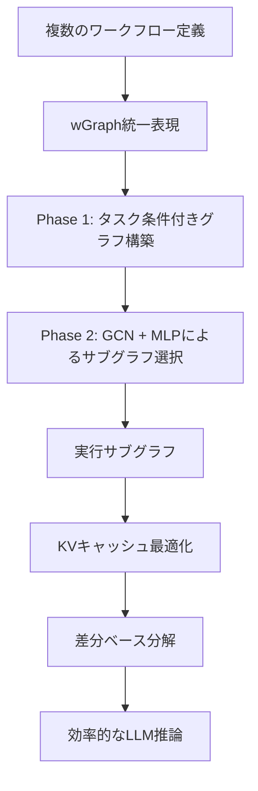
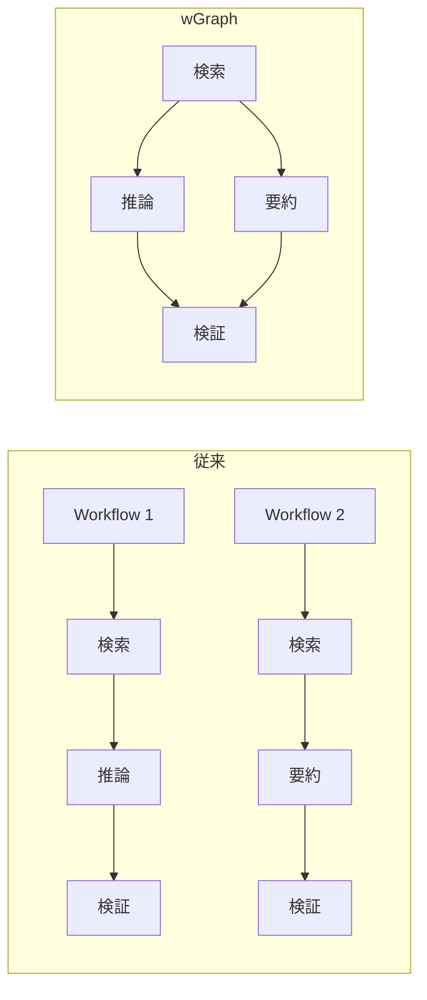
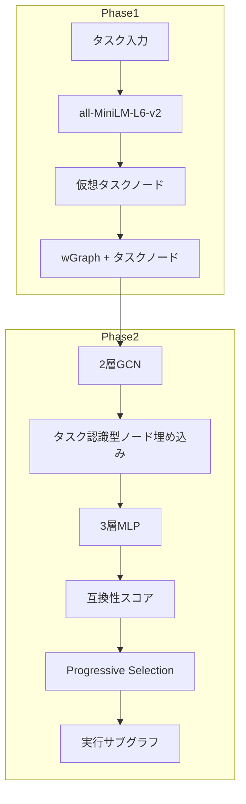

## 論文概要（Abstract）

本記事は [GraphFlow: A Graph-Based Workflow Management for Efficient LLM-Agent Serving](https://arxiv.org/abs/2605.22566) の解説記事です。

GraphFlowは、LLMエージェントの複数ワークフローを**有向非巡回グラフ（DAG）**で統一的に表現し、タスクに応じた最適なワークフローをGNN（Graph Neural Network）で適応的に生成するフレームワークである。著者らは、ワークフロー間で共通するオペレーションをグラフ上のノードとして共有することで、KVキャッシュのメモリ使用量を約4倍削減しつつ、5つのベンチマークで平均4.95ポイントの精度向上を達成したと報告している。

この記事は [Zenn記事: LangGraph v1.0ステートマシン設計パターン：条件分岐・並列実行・HILを実装する](https://zenn.dev/0h_n0/articles/bba30ad1314785) の深掘りです。

## 情報源

- **会議名**: ICML 2026（International Conference on Machine Learning）
- **年**: 2026
- **URL**: [https://arxiv.org/abs/2605.22566](https://arxiv.org/abs/2605.22566)
- **著者**: Ao Li, Shangpeng Yang, Fahao Chen, et al.
- **arXiv ID**: 2605.22566

## カンファレンス情報

ICML（International Conference on Machine Learning）は、機械学習分野における最高峰の国際会議の1つである。NeurIPS、ICLRとともにML分野のトップ3カンファレンスと位置付けられ、採択率は通常20-25%程度と非常に競争率が高い。GraphFlowはICML 2026に採択されており、LLMエージェントの効率的な推論サービング（serving）という実用的な課題に対して、グラフ理論とGNNを組み合わせた手法を提案している。

## 技術的詳細（Technical Details）

### 全体アーキテクチャ

GraphFlowの全体パイプラインは、(1) 複数ワークフローをDAGに統合するwGraph構築、(2) タスクに応じたワークフロー生成、(3) KVキャッシュ最適化の3段階で構成される。



### wGraph統一表現

GraphFlowの基盤となるのが**wGraph**と呼ばれる統一グラフ表現である。従来のLLMエージェントフレームワークでは、各ワークフローが独立して定義され、ワークフロー間で共通するオペレーション（ツール呼び出し、推論ステップ、検証モジュール等）が重複していた。wGraphは、これらを1つのDAGに統合する。

wGraphの構成要素は以下の通りである。

- **ノード**: 各ノードは原子的なオペレーション（atomic operation）を表す。具体的には、ツール呼び出し（API実行、DB検索等）、推論ステップ（CoT推論、要約等）、検証モジュール（出力検証、フォーマットチェック等）がノードとして定義される
- **エッジ**: 2つのオペレーション間の構造的・機能的依存関係を表す有向辺。あるオペレーションの出力が別のオペレーションの入力となる場合にエッジが張られる

従来の個別ワークフロー定義との違いを図示すると以下のようになる。



wGraphでは、「検索」と「検証」がワークフロー1・2の間で共有されている点が重要である。このオペレーションレベルの共有により、KVキャッシュの再利用やワークフロー生成の効率化が可能になる。

### 適応的ワークフロー生成（2フェーズ）

与えられたタスクに対して最適なワークフローをwGraphから抽出する処理は、2つのフェーズで構成される。

#### Phase 1: タスク条件付きグラフ構築（Task-Conditioned Graph Construction）

入力タスクの情報をwGraphに注入するため、仮想タスクノード$v_{\text{task}}$をwGraphに追加する。このノードは全てのオペレーションノードと双方向に接続され、タスク情報がグラフ全体に伝播するようにする。

具体的には、タスクの自然言語記述を事前学習済み埋め込みモデル（all-MiniLM-L6-v2、384次元）でベクトル化し、タスクノードの初期特徴量$\mathbf{h}_{\text{task}}^{(0)}$とする。各オペレーションノード$v_i$の初期特徴量$\mathbf{h}_i^{(0)}$も同様にオペレーションの記述から生成される。

#### Phase 2: GNNベース + MLPによるインスタンス化

Phase 1で構築したタスク条件付きグラフに対して、2層のGCN（Graph Convolutional Network）でノード埋め込みを更新する。

$$
\mathbf{h}_i^{(l+1)} = \sigma\left(\sum_{j \in \mathcal{N}(i)} \frac{1}{\sqrt{|\mathcal{N}(i)||\mathcal{N}(j)|}}\mathbf{W}^{(l)}\mathbf{h}_j^{(l)}\right)
$$

ここで、
- $\mathbf{h}_i^{(l)}$: ノード$i$の$l$層目の特徴量ベクトル
- $\mathcal{N}(i)$: ノード$i$の隣接ノード集合
- $\mathbf{W}^{(l)}$: $l$層目の学習可能な重み行列
- $\sigma$: 活性化関数（ReLU）

GCNで得られたタスク認識型ノード埋め込み$\mathbf{h}_i^{(L)}$を用いて、3層MLPが各エッジの互換性スコアを計算する。

$$
s_{i,j} = \text{MLP}\left(\text{Concat}\left[\mathbf{h}_i, \mathbf{h}_j, \mathbf{h}_{\text{task}}\right]\right)
$$

ここで、
- $s_{i,j}$: ノード$i$からノード$j$へのエッジの互換性スコア
- $\mathbf{h}_i, \mathbf{h}_j$: GCN出力のノード埋め込み
- $\mathbf{h}_{\text{task}}$: タスクノードの埋め込み
- $\text{Concat}[\cdot]$: ベクトルの連結

この互換性スコアに基づき、**Progressive Selection**（逐次的選択）によって連結な実行サブグラフを構築する。学習時にはGumbel-Sigmoid再パラメータ化を用いて離散的なエッジ選択を微分可能にしている。



### KVキャッシュ最適化（差分ベース分解）

LLMエージェントのサービングにおいて、KVキャッシュのメモリ消費は大きなボトルネックとなる。GraphFlowは、wGraphのオペレーション共有構造を活用した**差分ベースのKVキャッシュ分解**を提案している。

あるパス$\mathcal{P}$上のオペレーション$v$に対するKVキャッシュを、コンテキスト非依存のベース部分とトポロジ依存の残差部分に分解する。

$$
KV(\mathcal{P}, v) = KV_{\text{base}}(v) + \Delta KV(\mathcal{P}, v)
$$

ここで、
- $KV(\mathcal{P}, v)$: パス$\mathcal{P}$上でオペレーション$v$を実行する際の完全なKVキャッシュ
- $KV_{\text{base}}(v)$: オペレーション$v$のコンテキスト非依存KVキャッシュ（一度計算すれば再利用可能）
- $\Delta KV(\mathcal{P}, v)$: パス$\mathcal{P}$の先行オペレーション列に依存するスパースな残差

著者らは、$\Delta KV(\mathcal{P}, v)$がスパースであることを実験的に確認している。論文によると、Key行列のエントリの75%以上、Value行列のエントリの70%以上が小さな閾値以下に収まると報告されている。この性質を利用し、**パス枝刈り（Path Pruning）**により、頻出パスに対してのみ残差を実体化（materialize）することで、メモリ使用量を大幅に削減する。

具体的な効果として、GSM8Kデータセットにおいて50GBのKVキャッシュメモリが11GBまで削減されたと報告されている（論文の実験結果より）。

## 実装のポイント（Implementation）

### 学習設定

著者らが報告している学習設定は以下の通りである。

| パラメータ | 値 |
|-----------|-----|
| オプティマイザ | AdamW |
| 学習率 | 1e-4 |
| Weight Decay | 1e-2 |
| エポック数 | 20 |
| バッチサイズ | 64 |
| 埋め込みモデル | all-MiniLM-L6-v2（384次元） |
| GCN | 2層、隠れ層256次元 |
| MLP | 3層、隠れ層128次元 |
| 再パラメータ化 | Gumbel-Sigmoid |

### 評価対象LLM

以下の3モデルで評価が行われている。

- **Qwen-2.5-7B**: Alibaba Cloudが開発した7Bパラメータモデル
- **Llama-3.1-8B**: Metaが開発した8Bパラメータモデル
- **Gemma-2-9B**: Googleが開発した9Bパラメータモデル

### 実装上の注意点

- **埋め込みモデルの選択**: all-MiniLM-L6-v2は384次元と比較的低次元であり、推論時のオーバーヘッドが小さい。ただし、オペレーション記述の意味的類似度を適切に捉えるために、ドメイン固有のfine-tuningが必要になる場合がある
- **GCN層数**: 2層に設定されているが、wGraphが大規模化した場合にはover-smoothing問題に注意が必要である。著者らは2層で十分な性能が得られることを確認している
- **Gumbel-Sigmoid温度**: 学習初期は高温度（探索重視）、後半は低温度（搾取重視）にスケジューリングすることで安定した学習が可能になる

```python
import torch
import torch.nn as nn
from torch_geometric.nn import GCNConv


class GraphFlowSelector(nn.Module):
    """GraphFlowのワークフロー選択モジュール

    wGraph上でタスク条件付きのサブグラフ選択を行う。
    2層GCNでノード埋め込みを更新し、MLPでエッジスコアを計算する。

    Args:
        input_dim: 入力特徴量の次元数（all-MiniLM-L6-v2では384）
        hidden_dim: GCN隠れ層の次元数
        mlp_hidden_dim: MLP隠れ層の次元数
    """

    def __init__(
        self,
        input_dim: int = 384,
        hidden_dim: int = 256,
        mlp_hidden_dim: int = 128,
    ) -> None:
        super().__init__()
        # 2層GCN
        self.gcn1 = GCNConv(input_dim, hidden_dim)
        self.gcn2 = GCNConv(hidden_dim, hidden_dim)

        # 3層MLP（エッジスコア計算）
        # 入力: concat[h_i, h_j, h_task] = hidden_dim * 3
        self.edge_mlp = nn.Sequential(
            nn.Linear(hidden_dim * 3, mlp_hidden_dim),
            nn.ReLU(),
            nn.Linear(mlp_hidden_dim, mlp_hidden_dim),
            nn.ReLU(),
            nn.Linear(mlp_hidden_dim, 1),
        )

    def forward(
        self,
        x: torch.Tensor,
        edge_index: torch.Tensor,
        task_node_idx: int,
        candidate_edges: torch.Tensor,
        temperature: float = 1.0,
    ) -> torch.Tensor:
        """タスク条件付きエッジスコアを計算

        Args:
            x: ノード特徴量 (num_nodes, input_dim)
            edge_index: エッジインデックス (2, num_edges)
            task_node_idx: タスクノードのインデックス
            candidate_edges: スコア計算対象のエッジ (2, num_candidates)
            temperature: Gumbel-Sigmoid温度パラメータ

        Returns:
            エッジ選択確率 (num_candidates,)
        """
        # GCNでノード埋め込みを更新
        h = torch.relu(self.gcn1(x, edge_index))
        h = self.gcn2(h, edge_index)  # (num_nodes, hidden_dim)

        # タスクノード埋め込み
        h_task = h[task_node_idx]  # (hidden_dim,)

        # 各候補エッジのスコアを計算
        src, dst = candidate_edges[0], candidate_edges[1]
        h_src = h[src]  # (num_candidates, hidden_dim)
        h_dst = h[dst]  # (num_candidates, hidden_dim)
        h_task_expanded = h_task.unsqueeze(0).expand_as(h_src)

        edge_features = torch.cat(
            [h_src, h_dst, h_task_expanded], dim=-1
        )  # (num_candidates, hidden_dim * 3)

        logits = self.edge_mlp(edge_features).squeeze(-1)  # (num_candidates,)

        # Gumbel-Sigmoid再パラメータ化（学習時のみ）
        if self.training:
            gumbel_noise = -torch.log(
                -torch.log(torch.rand_like(logits) + 1e-8) + 1e-8
            )
            scores = torch.sigmoid((logits + gumbel_noise) / temperature)
        else:
            scores = torch.sigmoid(logits)

        return scores
```

## Production Deployment Guide

GraphFlowのwGraph管理とGNNベースのワークフロー選択をプロダクション環境にデプロイする際の設計パターンを示す。

### AWS実装パターン（コスト最適化重視）

GraphFlowは(1) wGraph管理・GNN推論、(2) LLMエージェント実行、(3) KVキャッシュストレージの3コンポーネントで構成される。トラフィック量に応じた推奨構成を以下に示す。

| 構成 | トラフィック | サービス構成 | 月額概算 |
|------|------------|------------|---------|
| Small | ~100 req/日 | Lambda + Bedrock + DynamoDB | $80-200 |
| Medium | ~1,000 req/日 | ECS Fargate + ElastiCache + Bedrock | $400-1,000 |
| Large | 10,000+ req/日 | EKS + Karpenter (Spot) + ElastiCache Cluster | $2,500-6,000 |

**コスト試算の注意事項**: 上記は2026年9月時点のAWS ap-northeast-1（東京）リージョン料金に基づく概算値である。実際のコストはトラフィックパターン、バースト使用量、LLMモデルの選択により変動する。最新料金はAWS料金計算ツールで確認を推奨する。

**Small構成の内訳**:
- Lambda（GNN推論 + ワークフロー選択）: 256MB、平均実行時間2秒、月$5-15
- Bedrock（LLM推論）: Claudeまたは同等モデル、月$50-150（トークン量依存）
- DynamoDB（wGraph保存、On-Demand）: 月$5-10
- S3（KVキャッシュベース保存）: 月$3-5

**コスト削減テクニック**:
- Spot Instances活用（Large構成）で最大90%削減
- Reserved Instances（1年コミット）で最大72%削減
- Bedrock Batch API使用で50%削減（非同期タスクの場合）
- KVキャッシュベース部分の事前計算でLLM推論コストを30-50%削減

### Terraformインフラコード

#### Small構成（Serverless）

```hcl
# GraphFlow Serverless構成
# Lambda + Bedrock + DynamoDB

terraform {
  required_version = ">= 1.9"
  required_providers {
    aws = {
      source  = "hashicorp/aws"
      version = "~> 5.60"
    }
  }
}

provider "aws" {
  region = "ap-northeast-1"
}

# DynamoDB: wGraph保存
resource "aws_dynamodb_table" "wgraph" {
  name         = "graphflow-wgraph"
  billing_mode = "PAY_PER_REQUEST" # コスト最適化: On-Demand
  hash_key     = "graph_id"
  range_key    = "node_id"

  attribute {
    name = "graph_id"
    type = "S"
  }

  attribute {
    name = "node_id"
    type = "S"
  }

  server_side_encryption {
    enabled = true # KMS暗号化
  }

  point_in_time_recovery {
    enabled = true
  }

  tags = {
    Project = "graphflow"
    Env     = "production"
  }
}

# S3: KVキャッシュベース保存
resource "aws_s3_bucket" "kv_cache" {
  bucket = "graphflow-kv-cache-base"

  tags = {
    Project = "graphflow"
  }
}

resource "aws_s3_bucket_server_side_encryption_configuration" "kv_cache" {
  bucket = aws_s3_bucket.kv_cache.id

  rule {
    apply_server_side_encryption_by_default {
      sse_algorithm = "aws:kms"
    }
  }
}

# IAMロール（最小権限）
resource "aws_iam_role" "lambda_graphflow" {
  name = "graphflow-lambda-role"

  assume_role_policy = jsonencode({
    Version = "2012-10-17"
    Statement = [{
      Action = "sts:AssumeRole"
      Effect = "Allow"
      Principal = {
        Service = "lambda.amazonaws.com"
      }
    }]
  })
}

resource "aws_iam_role_policy" "lambda_policy" {
  name = "graphflow-lambda-policy"
  role = aws_iam_role.lambda_graphflow.id

  policy = jsonencode({
    Version = "2012-10-17"
    Statement = [
      {
        Effect = "Allow"
        Action = [
          "dynamodb:GetItem",
          "dynamodb:Query",
          "dynamodb:BatchGetItem"
        ]
        Resource = aws_dynamodb_table.wgraph.arn
      },
      {
        Effect = "Allow"
        Action = [
          "bedrock:InvokeModel"
        ]
        Resource = "arn:aws:bedrock:ap-northeast-1::foundation-model/*"
      },
      {
        Effect = "Allow"
        Action = [
          "s3:GetObject",
          "s3:PutObject"
        ]
        Resource = "${aws_s3_bucket.kv_cache.arn}/*"
      },
      {
        Effect = "Allow"
        Action = [
          "logs:CreateLogGroup",
          "logs:CreateLogStream",
          "logs:PutLogEvents"
        ]
        Resource = "arn:aws:logs:*:*:*"
      }
    ]
  })
}

# Lambda関数
resource "aws_lambda_function" "graphflow" {
  function_name = "graphflow-workflow-selector"
  role          = aws_iam_role.lambda_graphflow.arn
  handler       = "handler.lambda_handler"
  runtime       = "python3.12"
  memory_size   = 256
  timeout       = 30

  environment {
    variables = {
      WGRAPH_TABLE   = aws_dynamodb_table.wgraph.name
      KV_CACHE_BUCKET = aws_s3_bucket.kv_cache.id
      BEDROCK_MODEL  = "anthropic.claude-sonnet-4-20250514"
    }
  }

  tracing_config {
    mode = "Active" # X-Ray有効化
  }

  filename = "lambda_package.zip"

  tags = {
    Project = "graphflow"
  }
}

# CloudWatchアラーム: Lambda実行時間監視
resource "aws_cloudwatch_metric_alarm" "lambda_duration" {
  alarm_name          = "graphflow-lambda-duration-high"
  comparison_operator = "GreaterThanThreshold"
  evaluation_periods  = 3
  metric_name         = "Duration"
  namespace           = "AWS/Lambda"
  period              = 300
  statistic           = "p95"
  threshold           = 25000 # 25秒（タイムアウト30秒の83%）
  alarm_description   = "Lambda P95レイテンシが25秒超過"

  dimensions = {
    FunctionName = aws_lambda_function.graphflow.function_name
  }
}
```

#### Large構成（Container）

```hcl
# GraphFlow Container構成
# EKS + Karpenter + ElastiCache

module "eks" {
  source  = "terraform-aws-modules/eks/aws"
  version = "~> 20.24"

  cluster_name    = "graphflow-cluster"
  cluster_version = "1.31"

  vpc_id     = module.vpc.vpc_id
  subnet_ids = module.vpc.private_subnets

  eks_managed_node_groups = {
    system = {
      instance_types = ["m7i.large"]
      min_size       = 2
      max_size       = 4
      desired_size   = 2
    }
  }

  tags = {
    Project = "graphflow"
  }
}

# Karpenter: Spot優先の自動スケーリング
resource "kubectl_manifest" "karpenter_provisioner" {
  yaml_body = yamlencode({
    apiVersion = "karpenter.sh/v1"
    kind       = "NodePool"
    metadata = {
      name = "graphflow-gpu"
    }
    spec = {
      template = {
        spec = {
          requirements = [
            {
              key      = "karpenter.sh/capacity-type"
              operator = "In"
              values   = ["spot", "on-demand"] # Spot優先
            },
            {
              key      = "node.kubernetes.io/instance-type"
              operator = "In"
              values   = ["g5.xlarge", "g5.2xlarge"]
            }
          ]
        }
      }
      limits = {
        cpu    = "128"
        memory = "512Gi"
      }
      disruption = {
        consolidationPolicy = "WhenEmptyOrUnderutilized"
        consolidateAfter    = "30s"
      }
    }
  })
}

# ElastiCache: KVキャッシュ高速アクセス
resource "aws_elasticache_replication_group" "kv_cache" {
  replication_group_id = "graphflow-kv-cache"
  description          = "GraphFlow KV cache store"
  node_type            = "cache.r7g.large"
  num_cache_clusters   = 2
  engine               = "redis"
  engine_version       = "7.1"
  port                 = 6379

  at_rest_encryption_enabled = true
  transit_encryption_enabled = true

  tags = {
    Project = "graphflow"
  }
}

# AWS Budgets: 月額予算アラート
resource "aws_budgets_budget" "graphflow" {
  name         = "graphflow-monthly"
  budget_type  = "COST"
  limit_amount = "6000"
  limit_unit   = "USD"
  time_unit    = "MONTHLY"

  notification {
    comparison_operator       = "GREATER_THAN"
    threshold                 = 80
    threshold_type            = "PERCENTAGE"
    notification_type         = "ACTUAL"
    subscriber_email_addresses = ["alerts@example.com"]
  }
}
```

### 運用・監視設定

**CloudWatch Logs Insights クエリ（コスト異常検知）**:

```
fields @timestamp, @message
| filter @message like /bedrock/
| stats sum(token_count) as total_tokens by bin(1h) as hour
| sort hour desc
| limit 24
```

**CloudWatch アラーム設定（Python boto3）**:

```python
import boto3

cloudwatch = boto3.client("cloudwatch", region_name="ap-northeast-1")

# Bedrockトークン使用量スパイク検知
cloudwatch.put_metric_alarm(
    AlarmName="graphflow-bedrock-token-spike",
    MetricName="InputTokenCount",
    Namespace="AWS/Bedrock",
    Statistic="Sum",
    Period=3600,
    EvaluationPeriods=1,
    Threshold=500000,
    ComparisonOperator="GreaterThanThreshold",
    AlarmActions=["arn:aws:sns:ap-northeast-1:ACCOUNT:graphflow-alerts"],
)
```

**X-Ray トレーシング設定**:

```python
from aws_xray_sdk.core import xray_recorder, patch_all

patch_all()  # boto3自動計装

@xray_recorder.capture("workflow_selection")
def select_workflow(task_input: str) -> dict:
    """ワークフロー選択をトレース付きで実行"""
    subsegment = xray_recorder.current_subsegment()
    subsegment.put_annotation("task_type", task_input[:50])
    subsegment.put_metadata("gcn_layers", 2)
    result = graphflow_selector.predict(task_input)
    subsegment.put_metadata("selected_nodes", len(result["nodes"]))
    return result
```

**Cost Explorer日次レポート（Python）**:

```python
import boto3
from datetime import datetime, timedelta

ce = boto3.client("ce", region_name="ap-northeast-1")

def daily_cost_report() -> dict:
    """日次コストレポートを取得"""
    end = datetime.utcnow().strftime("%Y-%m-%d")
    start = (datetime.utcnow() - timedelta(days=1)).strftime("%Y-%m-%d")

    response = ce.get_cost_and_usage(
        TimePeriod={"Start": start, "End": end},
        Granularity="DAILY",
        Metrics=["UnblendedCost"],
        Filter={
            "Tags": {
                "Key": "Project",
                "Values": ["graphflow"],
            }
        },
        GroupBy=[{"Type": "DIMENSION", "Key": "SERVICE"}],
    )
    return response["ResultsByTime"]
```

### コスト最適化チェックリスト

**アーキテクチャ選択**:
- [ ] トラフィック量に応じた構成選定（Small/Medium/Large）
- [ ] 非同期処理可能なタスクはBatch API活用

**リソース最適化**:
- [ ] EC2/EKS: Spot Instances優先（最大90%削減）
- [ ] Reserved Instances: 1年コミットで最大72%削減
- [ ] Savings Plans: Compute Savings Plans検討
- [ ] Lambda: メモリサイズ最適化（Power Tuning）
- [ ] ECS/EKS: アイドル時はKarpenterでスケールダウン

**LLMコスト削減**:
- [ ] Bedrock Batch API使用（非同期で50%削減）
- [ ] Prompt Caching有効化（30-90%削減）
- [ ] KVキャッシュベース事前計算でLLM再計算を回避
- [ ] トークン数制限（max_tokens設定）
- [ ] 軽量モデルでの事前フィルタリング

**監視・アラート**:
- [ ] AWS Budgets設定（月額上限）
- [ ] CloudWatchアラーム（トークンスパイク検知）
- [ ] Cost Anomaly Detection有効化
- [ ] 日次コストレポート（SNS通知）

**リソース管理**:
- [ ] 未使用リソース定期削除
- [ ] タグ戦略（Project/Env/Owner）
- [ ] S3ライフサイクルポリシー（古いKVキャッシュ自動削除）
- [ ] 開発環境の夜間・休日自動停止
- [ ] ElastiCacheノード数の定期見直し

## 実験結果（Results）

### ベンチマーク比較

著者らは5つのベンチマークで評価を行い、以下の結果を報告している（論文Table 2より）。

| データセット | 評価指標 | Vanilla | GraphFlow | 改善幅 |
|-------------|---------|---------|-----------|--------|
| GSM8K | Accuracy | 81.5% | 92.1% | +10.6 pts |
| MATH | Accuracy | 60.4% | 76.4% | +16.0 pts |
| HotpotQA | F1 | 60.7% | 70.4% | +9.7 pts |
| HumanEval | Pass@1 | 69.2% | 86.2% | +17.0 pts |
| MBPP | Pass@1 | 62.5% | 74.7% | +12.2 pts |

上記はQwen-2.5-7Bでの結果であり、全モデル・全データセットでの平均改善幅は4.95ポイントと報告されている。

### ベースライン比較

著者らは7つのベースラインと比較しており、GraphFlowが全てにおいて優位であったと報告している。比較対象は以下の通りである。

- **MetaGPT**: マルチエージェントフレームワーク（ロールベースのワークフロー）
- **LLMCompiler**: LLM呼び出しの自動並列化
- **TaskWeaver**: コード生成ベースのタスク実行
- **AgentKB**: 知識ベース統合型エージェント
- **AutoFlow**: 自動ワークフロー生成
- **AFlow**: 適応的フロー制御
- **Vanilla**: ワークフロー最適化なしのベースライン

### メモリ削減効果

KVキャッシュ最適化による効果も顕著であり、論文によると約4倍のメモリ削減が達成されている。GSM8Kデータセットでの具体例として、KVキャッシュメモリが50GBから11GBに削減されたと報告されている。これは差分ベース分解により、KVキャッシュのベース部分を一度計算して再利用し、スパースな残差部分のみをパスごとに計算する手法の効果である。

## 実運用への応用（Practical Applications）

### LangGraphとの接続

関連Zenn記事「[LangGraph v1.0ステートマシン設計パターン：条件分岐・並列実行・HILを実装する](https://zenn.dev/0h_n0/articles/bba30ad1314785)」で解説されているLangGraphのステートマシン設計パターンは、GraphFlowのwGraphと概念的に共通する部分がある。

- **LangGraphの条件分岐**: wGraphにおけるエッジの選択的活性化に相当する。GraphFlowでは、GNN+MLPが自動的にエッジを選択するのに対し、LangGraphでは開発者が明示的に条件関数を定義する
- **LangGraphの並列実行**: wGraphのDAG構造が本質的に並列実行可能なオペレーションを表現している。GraphFlowのProgressive Selectionは、並列実行可能なノード群を自動的に特定する
- **LangGraphのHIL（Human-in-the-Loop）**: wGraphにHIL検証ノードを組み込むことで、GraphFlowの自動ワークフロー生成にも人間の介入ポイントを設定可能である

### プロダクション適用時の考慮事項

- **ワークフロー数の増加**: wGraphはオペレーション共有によりスケーラブルだが、ノード数が数千を超える場合はGCNのメッセージパッシングのオーバーヘッドに注意が必要である
- **KVキャッシュの永続化**: ベース部分をRedis/ElastiCacheに保存し、リクエスト間で再利用することで推論レイテンシを削減可能である
- **wGraphの動的更新**: 新しいツールやオペレーションの追加に伴い、wGraphを動的に拡張する仕組みが必要となる。GCNの再学習コストを抑えるためにincremental learningの導入が考えられる

## 関連研究（Related Work）

- **MetaGPT** (Hong et al., 2023): ソフトウェア開発を模倣したマルチエージェントフレームワーク。ロールベースのワークフロー定義を採用しており、GraphFlowのようなオペレーションレベルの共有は行わない
- **LLMCompiler** (Kim et al., 2024): LLMのfunction calling呼び出しを自動並列化するフレームワーク。コンパイラのアナロジーに基づく最適化を行うが、ワークフロー間の共有は考慮していない
- **AFlow** (Zhang et al., 2024): コードベースの自動ワークフロー生成。MCTSを用いた探索により最適なフローを発見するが、GraphFlowのGNNベースのアプローチとは異なる
- **AutoFlow** (Chen et al., 2025): 自動ワークフロー生成フレームワーク。GraphFlowとの主な違いはwGraphによる統一表現とKVキャッシュ最適化の有無にある

## まとめ

GraphFlowは、LLMエージェントの複数ワークフローをwGraphで統一的に表現し、GNNベースの適応的ワークフロー生成とKVキャッシュの差分ベース分解を組み合わせたフレームワークである。著者らは5つのベンチマークで平均4.95ポイントの精度向上と約4倍のメモリ削減を達成したと報告している。

wGraphのオペレーション共有という考え方は、LangGraphのようなステートマシンベースのエージェントフレームワークにおいても、共通サブグラフの抽出・再利用として応用可能であり、エージェントサービングの効率化に向けた重要な方向性を示している。

## 参考文献

- **arXiv**: [https://arxiv.org/abs/2605.22566](https://arxiv.org/abs/2605.22566)
- **Conference**: ICML 2026
- **Related Zenn article**: [https://zenn.dev/0h_n0/articles/bba30ad1314785](https://zenn.dev/0h_n0/articles/bba30ad1314785)
