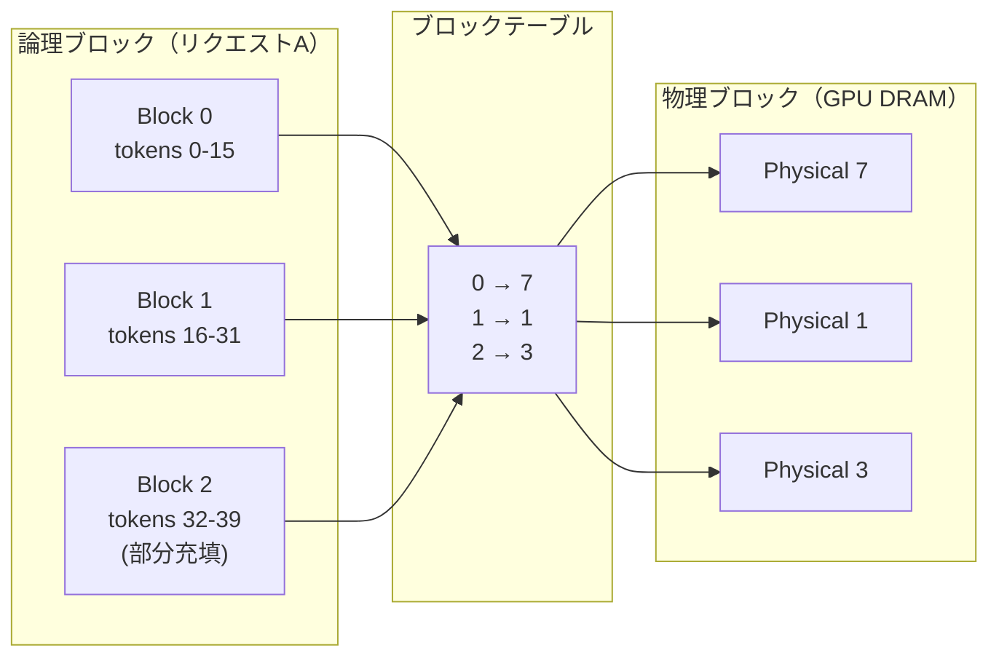
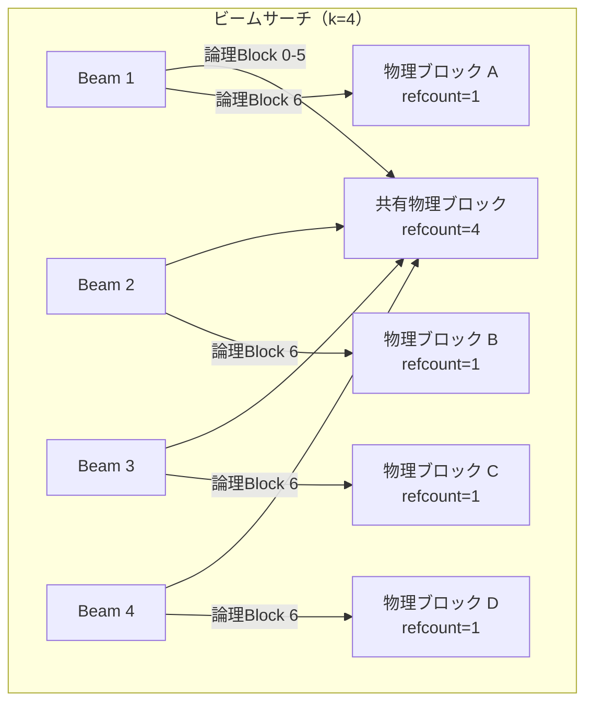

本記事は [Efficient Memory Management for Large Language Model Serving with PagedAttention](https://arxiv.org/abs/2309.06180)（SOSP 2023 採択）の解説記事です。

## 論文概要（Abstract）

大規模言語モデル（LLM）の高スループット推論にはリクエストのバッチ処理が不可欠だが、各リクエストのKVキャッシュは巨大かつ動的に伸縮するため、既存システムではフラグメンテーションと冗長な複製によりメモリの60-80%が浪費されていた。著者らはOSの仮想メモリ・ページング技術に着想を得たPagedAttentionアルゴリズムを提案し、これを基盤とするvLLMシステムでKVキャッシュのメモリ浪費をほぼゼロに削減し、FasterTransformerやOrcaと比較して2-4倍のスループット改善を達成したと報告している。

この記事は [Zenn記事: vLLM Prefix Caching×EAGLE 3.1で社内ボットのTTFTを70%短縮する](https://zenn.dev/0h_n0/articles/9b4970864077dd) の深掘りです。

## 情報源

- **会議名**: SOSP 2023（29th ACM Symposium on Operating Systems Principles）
- **年**: 2023
- **URL**: [https://arxiv.org/abs/2309.06180](https://arxiv.org/abs/2309.06180)
- **著者**: Woosuk Kwon, Zhuohan Li, Siyuan Zhuang, Ying Sheng, Lianmin Zheng et al.（UC Berkeley）
- **発表形式**: Full paper

## カンファレンス情報

SOSPはオペレーティングシステム分野の最高峰国際会議であり、1967年から隔年開催されている。採択率は例年15-20%程度と競争率が高い。OS技術（仮想メモリ・ページング）をML推論基盤に応用するアプローチがシステムコミュニティから認められた点は注目に値する。

## 技術的詳細（Technical Details）

### 既存システムのメモリ浪費問題

LLM推論において、各リクエストのKVキャッシュは自己回帰生成に伴い動的に成長する。著者らの分析によると、既存システム（FasterTransformer、Orca等）ではKVキャッシュメモリの20.4-38.2%しか実際のトークン状態の保存に使われていない（論文Section 3より）。浪費は以下の3種類に分類される。

- **予約浪費（Reservation waste）**: 最大系列長分のメモリを事前確保するため、実際の生成長が短い場合に未使用領域が発生する
- **内部フラグメンテーション**: リクエストごとの事前割り当てサイズが実際の使用量を超過する
- **外部フラグメンテーション**: 異なるサイズの事前割り当てブロック間に利用不能な隙間が生じる

### PagedAttentionアルゴリズム

PagedAttentionの核心はOSの仮想メモリのページング技術をKVキャッシュ管理に適用する点にある。

#### 論理ブロックと物理ブロック

各リクエストのKVキャッシュを固定サイズ$B$トークン分の**ブロック**に分割する。

- **論理ブロック（Logical block）**: リクエストのKV系列を連続的に表現する抽象単位。トークン位置$[0, B)$が論理ブロック0、$[B, 2B)$が論理ブロック1に対応する
- **物理ブロック（Physical block）**: GPU DRAMに実際に確保される記憶領域。物理アドレス空間上で連続している必要はない
- **ブロックテーブル（Block table）**: OSのページテーブルに相当し、各リクエストの論理ブロック番号から物理ブロック番号へのマッピングを管理する



著者らはブロックサイズ$B$について、ShareGPTデータセットでは16-128トークンが最良の性能を示し、デフォルト値を$B = 16$に設定したと報告している。

#### ページドアテンション計算

標準的なself-attentionの計算式は以下の通りである。

$$
\mathbf{o}_i = \text{softmax}\left(\frac{\mathbf{q}_i \mathbf{K}^\top}{\sqrt{d}}\right) \mathbf{V}
$$

ここで、
- $\mathbf{q}_i$: 位置$i$のクエリベクトル（$\mathbb{R}^d$）
- $\mathbf{K}$: 全位置のキー行列（$\mathbb{R}^{n \times d}$）
- $\mathbf{V}$: 全位置のバリュー行列（$\mathbb{R}^{n \times d}$）
- $d$: ヘッド次元数

PagedAttentionではキー行列$\mathbf{K}$とバリュー行列$\mathbf{V}$がブロック単位で非連続に配置されるため、ブロックごとに分割して計算する。$N = \lceil n / B \rceil$個のブロックについて、

$$
\mathbf{o}_i = \sum_{j=0}^{N-1} \frac{\exp(\mathbf{q}_i \mathbf{K}_j^\top / \sqrt{d}) \cdot \mathbf{V}_j}{\sum_{k=0}^{N-1} \exp(\mathbf{q}_i \mathbf{K}_k^\top / \sqrt{d}) \cdot \mathbf{1}}
$$

ここで$\mathbf{K}_j$と$\mathbf{V}_j$は物理ブロック$\text{BlockTable}[j]$から取得されるKVベクトルである。カーネルは各ブロックを独立にフェッチするため、物理メモリ上の配置が非連続であっても正しく動作する。

### メモリ共有メカニズム

#### Copy-on-Write（CoW）

並列サンプリングやビームサーチでは、複数の生成系列が同一のプロンプトプレフィックスを共有する。物理ブロックに参照カウントを導入し、複数の論理ブロックが同一の物理ブロックを参照可能にする。書き込みが発生した時点で初めて物理ブロックをコピーする。



著者らは、ビームサーチ（$k=4$）でメモリ使用量を37.6-55.2%削減できたと報告している（論文Table 3より）。

#### プレフィックス共有

事前定義されたプレフィックスの物理ブロックを予約し、同一プレフィックスを持つ複数リクエストで共有する。著者らは1-shot翻訳タスクで1.67倍、5-shotで3.58倍のスループット向上を報告している。この仕組みがZenn記事で解説されているvLLMのPrefix Cachingの基盤技術である。

### vLLMシステムアーキテクチャ

vLLMは以下の3コンポーネントで構成される。

- **集中スケジューラ**: バッチ実行の調整とメモリ割り当て判断を担当する。First-Come-First-Servedポリシーでリクエストをスケジュールし、メモリ不足時はプリエンプション（スワップアウトまたは再計算）を行う
- **KVキャッシュマネージャ**: ブロック割り当ての管理とブロックテーブルの維持を行う。OSのメモリアロケータに相当する
- **GPUワーカー**: 各イテレーションでスケジューラから提供される物理ブロックIDを用いてモデル推論を実行する

### アルゴリズム

以下にPagedAttentionカーネルの処理フローを擬似コードで示す。

```python
import torch
from dataclasses import dataclass

@dataclass
class BlockTable:
    """論理ブロック→物理ブロックのマッピングテーブル"""
    mapping: dict[int, int]
    block_size: int

def paged_attention(
    query: torch.Tensor,        # (1, d)
    key_cache: torch.Tensor,    # (num_physical_blocks, B, d)
    value_cache: torch.Tensor,  # (num_physical_blocks, B, d)
    block_table: BlockTable,
    context_len: int,
) -> torch.Tensor:
    """PagedAttentionの擬似実装（ブロック単位の非連続KVアクセス）"""
    B, d = block_table.block_size, query.shape[-1]
    num_blocks = (context_len + B - 1) // B
    scale = d ** -0.5
    exp_sums = torch.zeros(1)
    weighted_values = torch.zeros(1, d)

    for logical_idx in range(num_blocks):
        physical_idx = block_table.mapping[logical_idx]
        k_block = key_cache[physical_idx]   # (B, d)
        v_block = value_cache[physical_idx] # (B, d)
        if logical_idx == num_blocks - 1:
            valid = context_len - logical_idx * B
            k_block, v_block = k_block[:valid], v_block[:valid]
        exp_scores = torch.exp((query @ k_block.T) * scale)
        exp_sums += exp_scores.sum(dim=-1)
        weighted_values += exp_scores @ v_block

    return weighted_values / exp_sums.unsqueeze(-1)
```

## 実装のポイント

### ブロックサイズの選択

著者らはブロックサイズ$B$について以下のトレードオフを報告している。

- $B$が小さい: 内部フラグメンテーションは減少するが、ブロックテーブルのオーバーヘッドが増加し、カーネルの並列度が低下する
- $B$が大きい: カーネル効率は向上するが、最終ブロックの内部フラグメンテーションが増加する
- 推奨値: ShareGPTデータセットでは$B = 16$がデフォルト。系列長分布に応じて16-128の範囲で調整する

### CUDAカーネル最適化

著者らは3つのカスタムCUDAカーネルを実装している。

1. **Fused reshape and block write**: KVベクトルのリシェイプとブロックへの書き込みを融合し、カーネル起動オーバーヘッドを削減
2. **Fused block read and attention**: FasterTransformerのアテンションカーネルを改修し、ブロックテーブル参照とcoalesced memory accessを実現
3. **Fused block copy**: Copy-on-Write操作をバッチ化して一度のカーネル呼び出しで処理

これらのカスタムカーネルにより、アテンション計算のレイテンシはFasterTransformerと比較して20-26%増加するが、メモリ効率の改善によるバッチサイズ拡大がこのオーバーヘッドを上回ると著者らは報告している。

### メモリ不足時のプリエンプション

KVキャッシュ用の物理ブロックが不足した場合、vLLMは2つの戦略を提供する。

- **スワッピング**: KVキャッシュブロックをCPUメモリに退避し、後でGPUに復元する
- **再計算**: KVキャッシュを破棄し、リクエストが再スケジュールされた際にプロンプトから再計算する

## Production Deployment Guide

### AWS実装パターン（コスト最適化重視）

vLLMベースのLLM推論サービスをAWSにデプロイする際の構成を示す。コスト試算は2026年9月時点のap-northeast-1（東京）リージョン概算値であり、実際のコストはトラフィックパターンやバースト使用量により変動する。最新料金はAWS料金計算ツールで確認を推奨する。

**トラフィック量別の推奨構成**:

| 構成 | トラフィック | サービス構成 | 月額概算 |
|------|------------|-------------|---------|
| Small | ~100 req/日 | Lambda + Bedrock | $50-150 |
| Medium | ~1000 req/日 | ECS Fargate + vLLM (GPU) | $800-2,000 |
| Large | 10000+ req/日 | EKS + Spot GPU Instances + vLLM | $3,000-8,000 |

- **Small**: Lambda + Bedrock。月$5(Lambda) + $30-100(Bedrock) + $5(DynamoDB)
- **Medium**: ECS Fargate + vLLM（g5.xlarge, A10G 24GB）。月$700-1,200(GPU) + $50(ALB/CW)
- **Large**: EKS + Karpenter + g5 Spot。月$74(EKS) + $1,500-4,000(Spot GPU) + $100(NAT)

**コスト削減**: Spot最大70%削減、Reserved 1年40%削減、PagedAttentionによるバッチサイズ拡大でインスタンス数削減、Prefix Caching有効化

### Terraformインフラコード

**Small構成（Serverless）**:

```hcl
# vLLM推論サービス - Small構成（Bedrock + Lambda）
# 2026-09時点のap-northeast-1リージョン想定

resource "aws_iam_role" "inference_lambda" {
  name = "vllm-inference-lambda-role"
  assume_role_policy = jsonencode({
    Version = "2012-10-17"
    Statement = [{
      Action = "sts:AssumeRole", Effect = "Allow"
      Principal = { Service = "lambda.amazonaws.com" }
    }]
  })
}

resource "aws_iam_role_policy" "bedrock_invoke" {
  name = "bedrock-invoke"
  role = aws_iam_role.inference_lambda.id
  policy = jsonencode({
    Version = "2012-10-17"
    Statement = [{
      Effect = "Allow", Action = ["bedrock:InvokeModel"]
      Resource = "arn:aws:bedrock:ap-northeast-1::foundation-model/*"
    }]
  })
}

resource "aws_lambda_function" "inference" {
  function_name = "vllm-inference"
  runtime       = "python3.12"
  handler       = "handler.lambda_handler"
  role          = aws_iam_role.inference_lambda.arn
  timeout       = 120
  memory_size   = 256
  filename      = "lambda.zip"
  environment { variables = { MODEL_ID = "anthropic.claude-3-haiku-20240307-v1:0" } }
}

resource "aws_dynamodb_table" "request_log" {
  name         = "vllm-inference-log"
  billing_mode = "PAY_PER_REQUEST"
  hash_key     = "request_id"
  attribute { name = "request_id"; type = "S" }
  server_side_encryption { enabled = true }
}
```

**Large構成（EKS + Karpenter + Spot）**:

```hcl
# vLLM推論サービス - Large構成（EKS + GPU Spot）

module "eks" {
  source          = "terraform-aws-modules/eks/aws"
  version         = "~> 20.0"
  cluster_name    = "vllm-inference"
  cluster_version = "1.31"
  vpc_id          = module.vpc.vpc_id
  subnet_ids      = module.vpc.private_subnets
  cluster_endpoint_public_access  = false
  cluster_endpoint_private_access = true
  cluster_encryption_config = {
    provider_key_arn = aws_kms_key.eks.arn
    resources        = ["secrets"]
  }
}

resource "kubectl_manifest" "karpenter_nodepool" {
  yaml_body = yamlencode({
    apiVersion = "karpenter.sh/v1"
    kind       = "NodePool"
    metadata   = { name = "vllm-gpu" }
    spec = {
      template.spec = {
        requirements = [
          { key = "karpenter.sh/capacity-type", operator = "In", values = ["spot", "on-demand"] },
          { key = "node.kubernetes.io/instance-type", operator = "In",
            values = ["g5.xlarge", "g5.2xlarge", "g5.4xlarge"] },
        ]
        nodeClassRef = { name = "default" }
      }
      limits     = { cpu = "64", "nvidia.com/gpu" = "8" }
      disruption = { consolidationPolicy = "WhenEmptyOrUnderutilized", consolidateAfter = "60s" }
    }
  })
}

resource "aws_budgets_budget" "monthly" {
  name         = "vllm-inference-monthly"
  budget_type  = "COST"
  limit_amount = "5000"
  limit_unit   = "USD"
  time_unit    = "MONTHLY"
  notification {
    comparison_operator        = "GREATER_THAN"
    threshold                  = 80
    threshold_type             = "PERCENTAGE"
    notification_type          = "ACTUAL"
    subscriber_email_addresses = ["ops@example.com"]
  }
}
```

### 運用・監視設定

**CloudWatch Logs Insights クエリ**:

```
# コスト異常検知: 1時間あたりのトークン使用量
fields @timestamp, prompt_tokens, completion_tokens
| stats sum(prompt_tokens) as total_prompt, sum(completion_tokens) as total_completion by bin(1h)
| filter total_prompt > 100000 or total_completion > 50000

# レイテンシ分析（P95, P99）
fields @timestamp, duration_ms
| stats percentile(duration_ms, 95) as p95, percentile(duration_ms, 99) as p99 by bin(5m)
```

**CloudWatch アラーム・X-Ray・Cost Explorer設定**:

```python
import boto3
from datetime import datetime, timedelta
from aws_xray_sdk.core import xray_recorder, patch_all

patch_all()  # boto3自動計装

cloudwatch = boto3.client("cloudwatch", region_name="ap-northeast-1")
ce = boto3.client("ce", region_name="us-east-1")
sns = boto3.client("sns", region_name="ap-northeast-1")

def create_latency_alarm(function_name: str, threshold_ms: float = 5000) -> dict:
    """P99レイテンシ異常検知アラームを作成する"""
    return cloudwatch.put_metric_alarm(
        AlarmName=f"{function_name}-p99-latency",
        MetricName="Duration", Namespace="AWS/Lambda",
        Statistic="p99", Period=300, EvaluationPeriods=3,
        Threshold=threshold_ms,
        ComparisonOperator="GreaterThanThreshold",
        AlarmActions=["arn:aws:sns:ap-northeast-1:123456789:vllm-alerts"],
        Dimensions=[{"Name": "FunctionName", "Value": function_name}],
    )

@xray_recorder.capture("vllm_inference")
def invoke_model(prompt: str, model_id: str) -> dict:
    """X-Rayトレーシング付きモデル呼び出し"""
    subsegment = xray_recorder.current_subsegment()
    subsegment.put_annotation("model_id", model_id)
    subsegment.put_metadata("prompt_length", len(prompt))
    return {"status": "ok"}

def daily_cost_report() -> None:
    """日次コストレポートを取得し$100超過でSNS通知"""
    end = datetime.utcnow().strftime("%Y-%m-%d")
    start = (datetime.utcnow() - timedelta(days=1)).strftime("%Y-%m-%d")
    result = ce.get_cost_and_usage(
        TimePeriod={"Start": start, "End": end},
        Granularity="DAILY", Metrics=["UnblendedCost"],
        Filter={"Tags": {"Key": "Project", "Values": ["vllm-inference"]}},
        GroupBy=[{"Type": "DIMENSION", "Key": "SERVICE"}],
    )
    total = sum(
        float(g["Metrics"]["UnblendedCost"]["Amount"])
        for r in result["ResultsByTime"] for g in r["Groups"]
    )
    if total > 100:
        sns.publish(
            TopicArn="arn:aws:sns:ap-northeast-1:123456789:vllm-alerts",
            Subject=f"vLLM日次コスト超過: ${total:.2f}",
            Message=f"日次コストが$100を超過: ${total:.2f}",
        )
```

### コスト最適化チェックリスト

**アーキテクチャ選択**: トラフィック量で構成を選択（Serverless/ECS/EKS）、GPU要件確認、PagedAttentionメモリ効率を考慮したサイジング

**リソース最適化**: g5 Spot優先（最大70%削減）、Reserved Instances 1年コミット（最大40%削減）、Savings Plans検討、Lambda Power Tuning、Karpenterアイドル時スケールダウン

**LLM推論コスト削減**: Prefix Caching有効化、ブロックサイズ調整（16-128）、Continuous Batching有効化、投機的デコーディング（EAGLE等）

**監視・アラート**: AWS Budgets月次予算（80%/100%通知）、CloudWatch P99レイテンシアラーム、Cost Anomaly Detection ML検知、日次コストレポートSNS通知

**リソース管理**: 未使用GPU/ENI/EBS定期削除、Project/Environment/Ownerタグ必須化、ECRイメージライフサイクルポリシー、開発環境夜間停止

## 実験結果（Results）

著者らはOPT-13B、OPT-66B、OPT-175B、LLaMA-13Bの4モデルでShareGPTおよびAlpacaデータセットを用いた評価を実施している。

| システム | モデル | データセット | 正規化スループット |
|---------|--------|------------|-----------------|
| FasterTransformer | OPT-13B | ShareGPT | 1.0× (ベースライン) |
| Orca (Max) | OPT-13B | ShareGPT | 1.0-2.9× |
| Orca (Oracle) | OPT-13B | ShareGPT | 2.2-3.7× |
| **vLLM** | **OPT-13B** | **ShareGPT** | **最大22×** |

（論文Figure 10-12より。正規化スループットはFasterTransformer基準）

著者らはvLLMの主要な改善要因として以下を報告している。

- **同時バッチサイズ拡大**: メモリ浪費の削減によりOrcaの2.2倍（Oracle比）、4.3倍（Max比）のリクエストを同時処理可能
- **長系列での効果増大**: ShareGPT（平均出力長がAlpacaの8.4倍）でより大きな改善が得られる。長い系列ほどKVキャッシュの浪費割合が増加するため
- **ビームサーチ**: $k=4$のビームサーチではCoWによるメモリ共有によりOrcaの2.3倍のスループットを達成

アテンションカーネル単体のレイテンシは20-26%増加するが、バッチサイズ拡大による全体スループット改善が上回ると著者らは報告している。

## 実運用への応用（Practical Applications）

本論文で提案されたブロックベースKVキャッシュ管理は、以下の実運用機能の基盤を提供している。

- **Prefix Caching**: 関連Zenn記事で解説されているように、共通プレフィックスの物理ブロックを再利用することでTTFT（Time to First Token）を大幅に短縮できる。PagedAttentionのブロックテーブル機構がこの機能を実現している
- **投機的デコーディング**: EAGLE等の手法と組み合わせる際、draft modelとtarget modelのKVキャッシュを効率的に管理できる
- **マルチテナント推論**: 複数ユーザーのリクエストをContinuous Batchingで処理する際、PagedAttentionのオンデマンドブロック割り当てにより、メモリ利用率を最大化しつつ公平なスケジューリングが可能

## まとめと今後の展望

PagedAttentionはOSのページング技術をKVキャッシュ管理に応用し、既存システムで60-80%に達していたメモリ浪費をほぼゼロに削減した。vLLMはこの技術により2-4倍のスループット改善を達成した。今後は分散推論でのKVキャッシュ転送最適化、disaggregated prefill/decodeとの統合が研究されている。

## 参考文献

- **Conference URL**: [https://arxiv.org/abs/2309.06180](https://arxiv.org/abs/2309.06180)
- **Code**: [https://github.com/vllm-project/vllm](https://github.com/vllm-project/vllm)
- **Related Zenn article**: [https://zenn.dev/0h_n0/articles/9b4970864077dd](https://zenn.dev/0h_n0/articles/9b4970864077dd)
