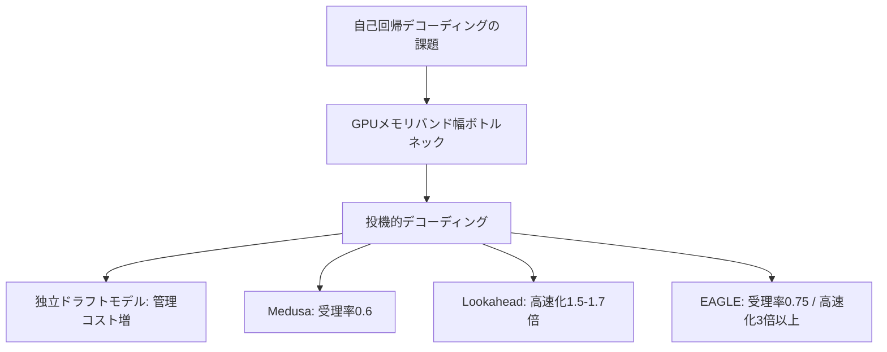

本記事は [EAGLE: Speculative Sampling Requires Rethinking Feature Uncertainty](https://arxiv.org/abs/2401.15077)（ICML 2024 採択）の解説記事です。

## 論文概要（Abstract）

大規模言語モデル（LLM）の自己回帰デコーディングは逐次的にトークンを生成するため推論が低速である。著者らはEAGLE（Extrapolation Algorithm for Greater Language-model Efficiency）を提案し、特徴量（second-to-top-layer）レベルでの自己回帰がトークンレベルより規則的であること、および特徴量の不確実性がドラフトモデルの性能を制約していることを示している。1ステップ先行トークン列を入力に組み込むことで不確実性を解消し、LLaMA2-Chat 70Bで2.97--3.52倍のレイテンシ短縮を達成したと報告されている（論文Table 2より）。

この記事は [Zenn記事: vLLM Prefix Caching×EAGLE 3.1で社内ボットのTTFTを70%短縮する](https://zenn.dev/0h_n0/articles/9b4970864077dd) の深掘りです。

## 情報源

- **arXiv ID**: 2401.15077
- **URL**: [https://arxiv.org/abs/2401.15077](https://arxiv.org/abs/2401.15077)
- **著者**: Yuhui Li, Fangyun Wei, Chao Zhang, Hongyang Zhang
- **発表年**: 2024年（ICML 2024 採択）
- **分野**: cs.LG, cs.CL

## 背景と動機（Background & Motivation）

LLMの推論はトークンを1つずつ生成する自己回帰デコーディングに依存しており、各ステップでモデル全体のフォワードパスが必要となる。バッチサイズ1ではGPUメモリバンド幅がボトルネックとなり、ハードウェア利用率が低い。

投機的デコーディングは小型ドラフトモデルで複数トークン候補を生成し、ターゲットモデルが1回のフォワードパスで検証する手法である。しかし、独立ドラフトモデル（Leviathan et al., 2023）はモデル管理コストが増大し、Medusa（Cai et al., 2024）はトークンレベル予測の受理率が約0.6にとどまり、Lookahead（Fu et al., 2024）は高速化が1.5--1.7倍に制限される。



## 主要な貢献（Key Contributions）

- **観察1: 特徴量レベルの自己回帰はトークンレベルより容易** --- second-to-top-layerの特徴量ベクトルはトークンより高い規則性を持ち、特徴量レベルのみで1.9倍の高速化を達成している（トークンレベルは1.5倍）。
- **観察2: 不確実性の同定と解消** --- サンプリングのランダム性により同じ文脈でも後続特徴量列が分岐する。1ステップ先行トークンを入力に含めることでこの不確実性を解消する。
- **EAGLE手法** --- 1層Transformerデコーダのドラフトモデルで高精度な特徴量予測を実現し、ターゲットモデルのLMヘッドと埋め込み層を凍結再利用することで追加パラメータを最小化している。
- **出力分布の保証** --- 木構造ドラフトに対するマルチラウンド投機的サンプリングにより、貪欲・非貪欲いずれの設定でもターゲットモデルと同一の出力分布を維持する。

## 技術的詳細（Technical Details）

### 特徴量レベル自己回帰の動機

LLMの出力層は隠れ状態$\mathbf{h}_i$をLMヘッド$W_{\text{lm}}$で語彙空間に射影する：

$$
p(t_{i+1} \mid t_{1:i}) = \text{softmax}(W_{\text{lm}} \mathbf{h}_i)
$$

ここで、$\mathbf{h}_i \in \mathbb{R}^{d}$はsecond-to-top-layerの特徴量、$W_{\text{lm}} \in \mathbb{R}^{V \times d}$はLMヘッドの重み行列、$V$は語彙サイズである。著者らは$\mathbf{h}_i$がトークン$t_i$よりも滑らかな空間上に存在し、連続ベクトルの回帰問題として扱えることを観察している。

### 不確実性の解消メカニズム

位置$i$でトークン$t_{i+1}$が確率的にサンプリングされると、特徴量$\mathbf{h}_{i+1}$は$t_{i+1}$に依存して変化する。EAGLEは1ステップ先行トークン$t_{i+1}$をドラフトモデルの入力に含め、$(\mathbf{h}_i, t_{i+1})$のペアから$\mathbf{h}_{i+1}$を予測する。$t_{i+1}$はLMヘッドから既に得られているため追加フォワードパスは不要である。

### EAGLEドラフトモデルのアーキテクチャ

ドラフトモデルは3つのコンポーネントで構成される：

1. **埋め込み層**（凍結）: トークン$t_{i+1}$を$\mathbf{e}_{i+1} \in \mathbb{R}^d$に変換
2. **自己回帰ヘッド**（訓練対象）: $[\mathbf{h}_i; \mathbf{e}_{i+1}] \in \mathbb{R}^{2d}$を全結合層で$\mathbb{R}^d$に射影し、1層Transformerデコーダで処理
3. **LMヘッド**（凍結）: 予測特徴量$\hat{\mathbf{h}}_{i+1}$をトークン確率に変換

```python
import torch
import torch.nn as nn


class EAGLEDraftModel(nn.Module):
    """EAGLEのドラフトモデル。

    ターゲットLLMの特徴量と1ステップ先行トークン埋め込みを結合し、
    次ステップの特徴量を予測する。

    Args:
        hidden_dim: ターゲットLLMの隠れ次元
        num_heads: Transformerデコーダのヘッド数
        target_embed: ターゲットLLMの埋め込み層（凍結）
        target_lm_head: ターゲットLLMのLMヘッド（凍結）
    """

    def __init__(
        self,
        hidden_dim: int,
        num_heads: int,
        target_embed: nn.Embedding,
        target_lm_head: nn.Linear,
    ) -> None:
        super().__init__()
        self.fc = nn.Linear(2 * hidden_dim, hidden_dim)
        self.decoder_layer = nn.TransformerDecoderLayer(
            d_model=hidden_dim, nhead=num_heads,
            dim_feedforward=hidden_dim * 4, batch_first=True,
        )
        self.embed = target_embed
        self.lm_head = target_lm_head
        for p in [*self.embed.parameters(), *self.lm_head.parameters()]:
            p.requires_grad = False

    def forward(
        self, features: torch.Tensor, next_tokens: torch.Tensor,
    ) -> tuple[torch.Tensor, torch.Tensor]:
        """次ステップの特徴量とトークン確率を予測する。

        Args:
            features: ターゲットLLMの特徴量 (batch, seq_len, hidden_dim)
            next_tokens: 1ステップ先行トークンID (batch, seq_len)

        Returns:
            predicted_features: 予測特徴量 (batch, seq_len, hidden_dim)
            logits: トークンのロジット (batch, seq_len, vocab_size)
        """
        token_embeds = self.embed(next_tokens)
        fused = torch.cat([features, token_embeds], dim=-1)
        predicted_features = self.decoder_layer(self.fc(fused), self.fc(fused))
        return predicted_features, self.lm_head(predicted_features)
```

### 訓練手順

損失関数は回帰損失と分類損失の組み合わせである：

$$
\mathcal{L} = \text{SmoothL1}(\mathbf{h}_{i+1}, \hat{\mathbf{h}}_{i+1}) + 0.1 \cdot \text{CrossEntropy}(p_{i+2}, \hat{p}_{i+2})
$$

訓練にはShareGPTの68,000対話を使用し、AdamW（$\beta_1=0.9, \beta_2=0.95$）、学習率$3 \times 10^{-5}$を採用している。特徴量にUniform(-0.1, 0.1)のランダムノイズを付加するデータ拡張により、推論時の誤差伝播に対するロバスト性を向上させている。70Bモデルで4基のA100（40GB）にて1--2日で訓練完了と報告されている。

### 木構造ドラフトと検証

EAGLEは木構造のドラフトを生成する。各ノードで上位$k$個（$k=4$）のトークン候補に分岐し、5回のフォワードパスで10以上の候補を並列生成する。検証フェーズでターゲットモデルが1回のフォワードパスで木全体を評価する。採択確率は以下で計算される：

$$
\alpha_j = \min\left(1, \frac{p_j(\hat{t}_j)}{\hat{p}_j(\hat{t}_j)}\right)
$$

ここで$p_j$はターゲット確率、$\hat{p}_j$はドラフト確率である。棄却時は$p'(t) = \text{normalize}(\max(0, p(t) - \hat{p}(t)))$からリサンプリングし、出力分布の同一性を数学的に保証する。

## 実装のポイント（Implementation）

### 訓練可能パラメータ数

| ターゲットモデル | ドラフトパラメータ | 比率 |
|:---:|:---:|:---:|
| 7B | 0.24B | 3.4% |
| 13B | 0.37B | 2.8% |
| 33B | 0.56B | 1.7% |
| 70B | 0.99B | 1.4% |

- **KVキャッシュ管理**: ドラフトモデルは独立したKVキャッシュを持つ。木構造ドラフト生成時のキャッシュ管理が実装の難所。
- **gpt-fast連携**: 量子化（int4）と組み合わせてLLaMA2-Chat 7Bで160.4 tokens/sを達成（バニラFP16の24.5 tokens/sに対し6.5倍、論文Table 5より）。
- **木構造の幅**: $k$を増やすと受理率は上がるが検証コストも増大する。$k=4$が精度・コストのバランス点として採用されている。

## Production Deployment Guide

EAGLEはvLLM等のLLM推論サービスに統合して本番適用できる。以下はAWS上の構成例である。コスト試算は2026年9月時点のap-northeast-1料金に基づく概算値であり、最新料金はAWS料金計算ツールで確認を推奨する。

### AWS実装パターン（コスト最適化重視）

| 構成 | トラフィック | 主要サービス | 月額概算 |
|:---|:---|:---|:---|
| Small | ~100 req/日 | Lambda + Bedrock + DynamoDB | $45-110 |
| Medium | ~1,000 req/日 | ECS Fargate + vLLM (g5.xlarge) + ALB | $455-665 |
| Large | 10,000+ req/日 | EKS + Karpenter + Spot (g5.2xlarge x3) + ElastiCache | $1,025-1,865 |

Medium以上ではvLLMコンテナにEAGLEドラフトモデルを同梱し`--speculative-model`フラグで有効化する。EAGLE有効化によりスループットが約2倍となるため、同一トラフィックでGPUノード数を40-60%削減可能。Spot Instancesで最大70%、Reserved Instances（1年）で追加30-40%のコスト削減が見込める。

### Terraformインフラコード

**Small構成（Serverless）**:

```hcl
# EAGLE推論 Small構成: Lambda + Bedrock + DynamoDB
terraform {
  required_version = ">= 1.9"
  required_providers {
    aws = { source = "hashicorp/aws", version = "~> 5.70" }
  }
}
provider "aws" { region = "ap-northeast-1" }

resource "aws_iam_role" "lambda_exec" {
  name = "eagle-inference-lambda-role"
  assume_role_policy = jsonencode({
    Version = "2012-10-17"
    Statement = [{ Action = "sts:AssumeRole", Effect = "Allow",
      Principal = { Service = "lambda.amazonaws.com" } }]
  })
}

resource "aws_iam_role_policy" "lambda_policy" {
  name = "bedrock-dynamo"
  role = aws_iam_role.lambda_exec.id
  policy = jsonencode({
    Version = "2012-10-17"
    Statement = [
      { Effect = "Allow", Action = ["bedrock:InvokeModel", "bedrock:InvokeModelWithResponseStream"],
        Resource = "arn:aws:bedrock:ap-northeast-1::foundation-model/*" },
      { Effect = "Allow", Action = ["dynamodb:GetItem", "dynamodb:PutItem", "dynamodb:Query"],
        Resource = aws_dynamodb_table.cache.arn },
      { Effect = "Allow", Action = ["logs:CreateLogGroup", "logs:CreateLogStream", "logs:PutLogEvents"],
        Resource = "arn:aws:logs:ap-northeast-1:*:*" },
    ]
  })
}

resource "aws_dynamodb_table" "cache" {
  name = "eagle-response-cache"; billing_mode = "PAY_PER_REQUEST"; hash_key = "prompt_hash"
  attribute { name = "prompt_hash"; type = "S" }
  ttl { attribute_name = "expires_at"; enabled = true }
  server_side_encryption { enabled = true }
}

resource "aws_lambda_function" "inference" {
  function_name = "eagle-llm-inference"; role = aws_iam_role.lambda_exec.arn
  runtime = "python3.12"; handler = "handler.main"; timeout = 30; memory_size = 256
  filename = "lambda.zip"
  environment { variables = { CACHE_TABLE = aws_dynamodb_table.cache.name,
    MODEL_ID = "anthropic.claude-3-5-haiku-20241022-v1:0", ENABLE_CACHE = "true" } }
  tracing_config { mode = "Active" }
}
```

**Large構成（Container）**:

```hcl
# EAGLE推論 Large構成: EKS + Karpenter + Spot
module "eks" {
  source = "terraform-aws-modules/eks/aws"; version = "~> 20.31"
  cluster_name = "eagle-inference"; cluster_version = "1.31"
  vpc_id = module.vpc.vpc_id; subnet_ids = module.vpc.private_subnets
  enable_cluster_creator_admin_permissions = true
}

resource "kubectl_manifest" "karpenter_nodepool" {
  yaml_body = yamlencode({
    apiVersion = "karpenter.sh/v1"; kind = "NodePool"
    metadata = { name = "gpu-spot" }
    spec = { template = { spec = {
      requirements = [
        { key = "karpenter.sh/capacity-type", operator = "In", values = ["spot", "on-demand"] },
        { key = "node.kubernetes.io/instance-type", operator = "In", values = ["g5.2xlarge", "g5.4xlarge"] },
      ]
      nodeClassRef = { group = "karpenter.k8s.aws", kind = "EC2NodeClass", name = "gpu" }
    } }, limits = { cpu = "64", "nvidia.com/gpu" = "8" },
    disruption = { consolidationPolicy = "WhenEmptyOrUnderutilized", consolidateAfter = "60s" } }
  })
}

resource "aws_budgets_budget" "monthly" {
  name = "eagle-inference-monthly"; budget_type = "COST"
  limit_amount = "2000"; limit_unit = "USD"; time_unit = "MONTHLY"
  notification { comparison_operator = "GREATER_THAN"; threshold = 80
    threshold_type = "PERCENTAGE"; notification_type = "ACTUAL"
    subscriber_email_addresses = ["ops-team@example.com"] }
}
```

### 運用・監視設定

```
# CloudWatch Logs Insights: EAGLE受理率・レイテンシ分析
fields @timestamp, acceptance_rate, tokens_per_step, latency_ms
| filter event = "speculative_decode_complete"
| stats avg(acceptance_rate) as avg_accept, pct(latency_ms, 95) as p95, pct(latency_ms, 99) as p99
  by bin(1h)
```

```python
import boto3

cloudwatch = boto3.client("cloudwatch", region_name="ap-northeast-1")

def create_eagle_alarms(function_name: str, sns_topic_arn: str) -> None:
    """EAGLE推論の受理率低下とレイテンシスパイクを監視する。"""
    cloudwatch.put_metric_alarm(
        AlarmName=f"{function_name}-low-acceptance-rate",
        MetricName="AcceptanceRate", Namespace="EAGLE/Inference",
        Statistic="Average", Period=300, EvaluationPeriods=3,
        Threshold=0.5, ComparisonOperator="LessThanThreshold",
        AlarmActions=[sns_topic_arn],
    )
    cloudwatch.put_metric_alarm(
        AlarmName=f"{function_name}-high-latency",
        MetricName="InferenceLatency", Namespace="EAGLE/Inference",
        Statistic="p99", Period=300, EvaluationPeriods=2,
        Threshold=5000, ComparisonOperator="GreaterThanThreshold",
        AlarmActions=[sns_topic_arn],
    )
```

### コスト最適化チェックリスト

**アーキテクチャ選択**:
- [ ] ~100 req/日 → Serverless（Bedrock）
- [ ] 100-5,000 req/日 → ECS Fargate + vLLM
- [ ] 5,000+ req/日 → EKS + Karpenter + Spot

**リソース最適化**:
- [ ] GPU推論ノードはSpot Instances優先（最大70%削減）
- [ ] Reserved Instances 1年コミット（最大40%削減）
- [ ] Savings Plans検討
- [ ] Lambda: メモリ256MBに最適化
- [ ] EKS: Karpenterで未使用ノード60秒後に自動縮退

**LLMコスト削減**:
- [ ] EAGLE有効化でGPUノード40-60%削減
- [ ] Prefix Caching有効化（TTFT 70%短縮）
- [ ] Bedrock Batch API（非リアルタイムで50%削減）
- [ ] max_tokens設定で過剰生成防止
- [ ] モデル選択ロジック（Haiku/Sonnet振り分け）

**監視・アラート**:
- [ ] AWS Budgets（月額80%で通知）
- [ ] CloudWatch受理率アラーム（0.5未満で警告）
- [ ] Cost Anomaly Detection有効化
- [ ] 日次コストレポート（SNS通知）

**リソース管理**:
- [ ] 未使用S3アーティファクト削除
- [ ] タグ戦略（Project/Environment/Owner）
- [ ] ECRイメージライフサイクル（5世代保持）
- [ ] 開発環境の夜間自動停止
- [ ] CloudWatch Logs保持期間（90日）

## 実験結果（Results）

MT-bench（Temperature=0）における主要結果を示す（論文Table 2より）。

| モデル | EAGLE | Medusa | Lookahead | 平均受理トークン数($\tau$) |
|:---|:---:|:---:|:---:|:---:|
| Vicuna 7B | 2.90-3.33x | 2.37x | 1.51x | 3.94 |
| Vicuna 13B | 3.03-3.58x | 2.40x | 1.62x | 3.98 |
| LLaMA2-Chat 7B | 2.78-3.17x | --- | 1.53x | 3.62 |
| LLaMA2-Chat 13B | 3.01-3.76x | --- | 1.69x | 3.90 |
| LLaMA2-Chat 70B | 2.97-3.52x | --- | --- | 3.81 |
| Mixtral 8x7B | 1.50x | --- | --- | 3.25 |

タスク別ではHumanEval（コード生成）で3.33-3.76倍、GSM8K（数学推論）で3.01-3.25倍と、出力パターンの予測可能性が高いタスクで受理率が向上する傾向が確認されている。非貪欲設定（Temperature=1）でもLLaMA2-Chat 70Bで2.65-2.92倍の高速化を維持している。

Mixtral 8x7B（MoE）では1.50倍にとどまる。著者らはMoE特有のルーティング不確実性が特徴量予測を困難にしていると分析している。

## 実運用への応用（Practical Applications）

EAGLEはvLLM 0.6.x以降でネイティブサポートされており、`--speculative-model`フラグで有効化できる。Zenn記事で報告されているPrefix Cachingとの併用により、TTFT（Time to First Token）を70%短縮できる。

- **レイテンシ削減**: バッチサイズ1で2.7-3.5倍短縮。チャットボットやリアルタイム応答に適する。
- **スループット向上**: 同一ハードウェアで1.97倍。推論サーバ台数削減によるコスト最適化が可能。
- **デプロイ容易性**: ドラフトモデルはターゲットの1.4-3.4%のパラメータ。ターゲットのファインチューニング不要で既存パイプラインに後付け可能。
- **制約**: MoEモデルでは高速化が1.5倍に制限される。バッチサイズ増大時はGPU演算がボトルネックとなり恩恵が減少する。

## 関連研究（Related Work）

- **Speculative Decoding（Leviathan et al., 2023）**: 独立小型モデルをドラフトとする先駆的手法。モデル2本の管理が必要。
- **Medusa（Cai et al., 2024）**: 複数LMヘッド追加でトークン並列予測。受理率約0.6でEAGLEの0.75に劣り、ターゲットの追加訓練が必要。
- **Lookahead Decoding（Fu et al., 2024）**: n-gramプールによる訓練不要手法。高速化は1.5-1.7倍だが追加パラメータ不要。
- **SpecInfer（Miao et al., 2024）**: 複数小型モデルで木構造ドラフト生成。EAGLEはターゲット内部特徴量を直接活用する点で異なる。

## まとめと今後の展望

EAGLEは特徴量レベル自己回帰と不確実性解消により、Medusa比1.6倍、Lookahead比2倍の高速化を達成している。追加パラメータはモデルサイズの1.4-3.4%で、出力分布を厳密に保証する実用的な手法である。

今後はMoEモデル最適化、EAGLE-2（2024年6月）での動的木構造ドラフト、vLLMやTGIへの統合深化が進んでおり、プロダクション採用の障壁は低下し続けている。

## 参考文献

- **arXiv**: [https://arxiv.org/abs/2401.15077](https://arxiv.org/abs/2401.15077)
- **Code**: [https://github.com/SafeAILab/EAGLE](https://github.com/SafeAILab/EAGLE)
- **Related Zenn article**: [https://zenn.dev/0h_n0/articles/9b4970864077dd](https://zenn.dev/0h_n0/articles/9b4970864077dd)
