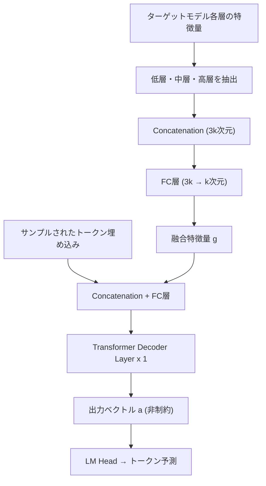

本記事は [EAGLE-3: Scaling up Inference Acceleration of Large Language Models via Training-Time Test](https://arxiv.org/abs/2503.01840) の解説記事です。

## 論文概要（Abstract）

大規模言語モデル（LLM）の逐次的な生成特性はレイテンシとコストの両面で課題となっており、投機的サンプリング（speculative sampling）がその有効な解決策として広く用いられている。EAGLEは特徴レベルでの自己回帰により高い精度のドラフト生成を実現したが、訓練データのスケーリングによる性能改善が限定的であるという問題を抱えていた。EAGLE-3は特徴予測を廃止して直接トークン予測に移行し、多層特徴融合とtraining-time testにより、EAGLE-2比で平均1.4倍の速度改善と最大6.5倍の推論加速を達成した手法である。

この記事は [Zenn記事: vLLM Prefix Caching×EAGLE 3.1で社内ボットのTTFTを70%短縮する](https://zenn.dev/0h_n0/articles/9b4970864077dd) の深掘りです。

## 情報源

- **arXiv ID**: 2503.01840
- **URL**: [https://arxiv.org/abs/2503.01840](https://arxiv.org/abs/2503.01840)
- **著者**: Yuhui Li（Peking University / Microsoft Research）, Fangyun Wei（Microsoft Research）, Chao Zhang, Hongyang Zhang（University of Waterloo / Vector Institute）
- **発表年**: 2025
- **分野**: cs.CL（Computation and Language）

## 背景と動機（Background & Motivation）

LLMの推論高速化においてspeculative samplingは標準的な手法となっている。EAGLEはターゲットモデルの最上層特徴量を再利用し、特徴レベルでの自己回帰を行うことでドラフト精度を向上させた。しかし、LLMコミュニティにおいて訓練データのスケーリングがモデル性能向上の有効な手段として広く認知されている一方で、著者らはEAGLEでは訓練データを増やしても性能改善が限定的であることを発見した。

この原因として著者らが特定したのが**特徴予測の制約**である。EAGLEの損失関数は特徴予測損失 $l_{\text{fea}}$ とトークン予測損失 $l_{\text{token}}$ の2成分で構成されている。特徴予測損失はStep 1のみの訓練でStep 2以降の多段予測能力を獲得するために必要だったが、最終的な目標がトークン予測である以上、特徴予測は追加の制約としてドラフトモデルの表現力を制限し、データスケーリングの恩恵を妨げていた。

## 主要な貢献（Key Contributions）

- **直接トークン予測への移行**: 特徴予測損失 $l_{\text{fea}}$ を廃止し、トークン予測損失のみでドラフトモデルを訓練する設計に変更。ドラフトモデルの出力をターゲットモデルのLM headの制約から解放し、表現力を向上させた
- **多層特徴融合（Multi-layer Feature Fusion）**: 最上層特徴量のみに依存するEAGLEの設計を改め、低層・中層・高層の特徴量を結合・次元削減して入力とする手法を導入。異なる抽象度の意味情報を統合的に活用する
- **Training-Time Test**: 訓練時に推論時の多段生成をシミュレーションする手法。ドラフトモデルの出力を次段の入力として使用し、訓練と推論の分布差を解消する
- **訓練データスケーリングの実現**: 従来手法では観察されなかった「データ量に応じた性能向上曲線」を実現し、訓練データの増加がドラフト精度の改善に直結する設計を確立した

## 技術的詳細（Technical Details）

### EAGLEの特徴予測制約の問題

EAGLEのドラフトモデルはターゲットモデルの最上層特徴量 $\mathbf{f}_t$ を入力として受け取り、次時刻の特徴量 $\hat{\mathbf{f}}_{t+1}$ を予測する。訓練時の損失関数は以下の通りである：

$$
\mathcal{L}_{\text{EAGLE}} = l_{\text{fea}} + l_{\text{token}}
$$

ここで $l_{\text{fea}}$ は特徴予測損失、$l_{\text{token}}$ はトークン予測損失である。

推論時、ドラフトモデルは Step 1 でターゲットモデルの真の特徴量 $\mathbf{f}_1, \mathbf{f}_2, \ldots, \mathbf{f}_t$ を入力として使用するが、Step 2 以降ではドラフトモデル自身の出力 $\hat{\mathbf{a}}_{t+1}$ を入力として使用する必要がある。特徴予測制約を除去すると $\hat{\mathbf{a}}_{t+1}$ と真の特徴量 $\mathbf{f}_{t+1}$ の分布が大きく乖離し、Step 2 での受理率が著しく低下する問題が生じる。

### Training-Time Test

著者らはこの分布シフト問題を解決するため、訓練時に推論時の多段生成を模倣する**training-time test**を提案した。具体的には、訓練時に以下の3ステップを連続的に実行する：

- **Step 1**: ターゲットモデルの融合特徴量 $\mathbf{g}_1, \mathbf{g}_2, \ldots, \mathbf{g}_t$ をそのまま入力として使用
- **Step 2**: 最後のトークン位置の入力をドラフトモデル自身の出力 $\mathbf{a}$ に置き換え（$\mathbf{g}_1, \ldots, \mathbf{g}_{t-1}, \mathbf{a}_t$）
- **Step 3**: さらにドラフトモデル出力で置き換える位置を増やし、推論時の入力分布を再現

この訓練戦略により、ドラフトモデルは自身の出力が入力として戻ってくる状況に適応し、多段予測での受理率低下を防止する。

### 多層特徴融合

EAGLEが最上層特徴量のみを使用するのに対し、EAGLE-3はターゲットモデルの**低層・中層・高層**の3つのレイヤーから特徴量を抽出し融合する：

$$
\mathbf{g}_t = \text{FC}\left([\mathbf{f}_t^{\text{low}}; \mathbf{f}_t^{\text{mid}}; \mathbf{f}_t^{\text{high}}]\right)
$$

ここで、
- $\mathbf{f}_t^{\text{low}}, \mathbf{f}_t^{\text{mid}}, \mathbf{f}_t^{\text{high}}$: それぞれ低層、中層、高層の特徴量ベクトル（各 $k$ 次元）
- $[\cdot;\cdot;\cdot]$: 結合（concatenation）操作、結合後は $3k$ 次元
- $\text{FC}$: 全結合層による次元削減（$3k \to k$）
- $\mathbf{g}_t$: 融合後の特徴量ベクトル（$k$ 次元、$k$ はターゲットモデルの隠れ層次元）

低層は構文情報、中層は意味情報、高層は推論情報を捉えており、統合によりドラフトモデルが豊富な文脈を利用できる。

### ドラフトモデルのアーキテクチャ



ドラフトモデルの構成要素は以下の通りである：

1. **入力処理**: 融合特徴量 $\mathbf{g}$ とサンプルされたトークンの埋め込みを結合し、FC層で処理
2. **デコーダ**: 単一のTransformerデコーダ層
3. **出力**: LM headの制約を受けない自由なベクトル $\mathbf{a}$ を生成

EAGLE-3の損失関数はシンプルにトークン予測損失のみとなる：

$$
\mathcal{L}_{\text{EAGLE-3}} = l_{\text{token}}
$$

### アルゴリズム

```python
import torch
import torch.nn as nn


class EAGLE3DraftModel(nn.Module):
    """EAGLE-3ドラフトモデルの概要実装

    Args:
        hidden_size: ターゲットモデルの隠れ層次元数
        vocab_size: 語彙サイズ
    """

    def __init__(self, hidden_size: int, vocab_size: int) -> None:
        super().__init__()
        # Multi-layer feature fusion: 3k -> k
        self.feature_fusion = nn.Linear(hidden_size * 3, hidden_size)
        # Token embedding + fused feature -> hidden
        self.input_proj = nn.Linear(hidden_size * 2, hidden_size)
        # Single transformer decoder layer
        self.decoder = nn.TransformerDecoderLayer(
            d_model=hidden_size, nhead=hidden_size // 64,
            dim_feedforward=hidden_size * 4, batch_first=True,
        )
        self.lm_head = nn.Linear(hidden_size, vocab_size, bias=False)

    def forward(
        self,
        f_low: torch.Tensor,   # (B, L, k) 低層特徴量
        f_mid: torch.Tensor,   # (B, L, k) 中層特徴量
        f_high: torch.Tensor,  # (B, L, k) 高層特徴量
        token_emb: torch.Tensor,  # (B, L, k) トークン埋め込み
    ) -> torch.Tensor:
        """ドラフトトークンを直接予測（特徴予測損失なし）"""
        # 多層特徴融合: concat(3k) -> FC -> k
        g = self.feature_fusion(torch.cat([f_low, f_mid, f_high], dim=-1))
        # 融合特徴 + トークン埋め込みを結合
        x = self.input_proj(torch.cat([g, token_emb], dim=-1))
        x = self.decoder(x, torch.zeros_like(x[:, :1, :]))
        return self.lm_head(x)  # (B, L, vocab_size)
```

### 受理確率と投機的サンプリング

EAGLE-3はEAGLE-2と同様にdynamic draft treeを使用する。投機的サンプリングの受理確率は以下で定義される：

$$
\alpha = \min\left(1, \frac{p_{j+i}(\hat{t}_{j+i})}{\hat{p}_{j+i}(\hat{t}_{j+i})}\right)
$$

ここで、
- $p_{j+i}(\hat{t}_{j+i})$: ターゲットモデルによるトークン $\hat{t}_{j+i}$ の確率
- $\hat{p}_{j+i}(\hat{t}_{j+i})$: ドラフトモデルによるトークン $\hat{t}_{j+i}$ の確率

EAGLE-3ではドラフトツリーの深さをEAGLE-2の6から**8**に拡大し、ノード数50（70Bモデルでは48）の動的ツリーを構築する。受理長 $\tau$ の向上（EAGLE-2の平均4.16 $\to$ EAGLE-3の平均6.14）により、1回の検証サイクルで受理されるトークン数が大幅に増加した。

## 実装のポイント（Implementation）

EAGLE-3の実装において重要な点は以下の通りである：

**訓練データ**: ShareGPT（約68Kエントリ）とUltraChat-200K（約464Kエントリ）を使用し、EAGLEの約8倍のデータ量で訓練する。推論モデル（DeepSeek-R1-Distillなど）にはOpenThoughts-114k-mathを追加する。

**訓練ハイパーパラメータ**: AdamWオプティマイザ（$\beta = (0.9, 0.95)$）、勾配クリッピング0.5、学習率 $5 \times 10^{-5}$ を使用する。

**アテンションマスクの修正**: Training-time testでは、元の訓練データに対する標準的な因果マスクをドラフト予測部分では対角マスクに変換する。これにより、ドラフト出力が正しい位置のみを参照する。

**推論フレームワークとの統合**: SGLangおよびvLLMとの統合が実装済みであり、production環境ではバッチサイズ64でも1.38倍のスループット改善を維持する。

**公式リポジトリ**: [https://github.com/SafeAILab/EAGLE](https://github.com/SafeAILab/EAGLE)

## Production Deployment Guide

### AWS実装パターン（コスト最適化重視）

EAGLE-3のドラフトモデルはターゲットモデルと同一GPU上で動作するため追加GPU調達は不要だが、GPU RAMの追加消費（約2-5%）を考慮する。

**コスト試算の注意事項**: 以下は2026年9月時点のAWS ap-northeast-1（東京）リージョンの概算値である。最新料金はAWS料金計算ツールで確認を推奨する。

| 構成 | トラフィック | インフラ | GPU | 月額概算 |
|------|-------------|---------|-----|---------|
| Small | ~100 req/日 | SageMaker Endpoint | g5.xlarge (A10G) | $150-300 |
| Medium | ~1000 req/日 | ECS + SageMaker | g5.2xlarge | $800-1,500 |
| Large | 10000+ req/日 | EKS + Karpenter + Spot | p4d.24xlarge (A100) | $3,000-6,000 |

**Small**: vLLM + EAGLE-3コンテナをSageMakerにデプロイ。8Bモデルはg5.xlarge（A10G 24GB）で動作する。**Medium**: ECS Fargateでルーティング、SageMaker Real-time Endpointでバッチサイズ16-32の並行処理を実行。**Large**: EKS上でvLLM/SGLangをデプロイし、Karpenterで Spot Instances（最大70%削減）を優先活用する。

**コスト削減テクニック**: Spot Instances（最大70%削減）、Reserved Instances（1年で最大40%削減）、Prefix Caching併用（KV Cache再利用 + ドラフト加速）、バッチ最適化（EAGLE-3はBS64でも1.38倍維持）。

### Terraformインフラコード

**Small構成（SageMaker）**:

```hcl
# EAGLE-3推論 - Small構成（SageMaker + vLLM）
resource "aws_sagemaker_model" "eagle3" {
  name               = "eagle3-vllm-inference"
  execution_role_arn = aws_iam_role.sagemaker_exec.arn
  primary_container {
    image          = "763104351884.dkr.ecr.ap-northeast-1.amazonaws.com/djl-inference:0.29.0-lmi12.0.0-cu124"
    model_data_url = "s3://${aws_s3_bucket.model.id}/eagle3/model.tar.gz"
    environment = {
      OPTION_MODEL_ID          = "/opt/ml/model"
      OPTION_SPECULATIVE_MODEL = "/opt/ml/model/eagle3-draft"
      OPTION_SPEC_DEC_LEN      = "8"    # EAGLE-3ドラフト深さ
    }
  }
}

resource "aws_sagemaker_endpoint_configuration" "eagle3" {
  name = "eagle3-config"
  production_variants {
    variant_name = "primary"
    model_name   = aws_sagemaker_model.eagle3.name
    instance_type = "ml.g5.xlarge"  # A10G 24GB
    initial_instance_count = 1
  }
}
```

**Large構成（EKS + Karpenter + Spot）**:

```hcl
# EAGLE-3推論 - Large構成（EKS + Spot GPU）
module "eks" {
  source = "terraform-aws-modules/eks/aws"
  version = "~> 20.24"
  cluster_name = "eagle3-inference"
  cluster_version = "1.31"
  vpc_id = module.vpc.vpc_id
  subnet_ids = module.vpc.private_subnets
}

resource "kubectl_manifest" "gpu_nodepool" {
  yaml_body = yamlencode({
    apiVersion = "karpenter.sh/v1"
    kind = "NodePool"
    metadata = { name = "eagle3-gpu" }
    spec = {
      template.spec.requirements = [
        { key = "karpenter.sh/capacity-type", operator = "In", values = ["spot", "on-demand"] },
        { key = "node.kubernetes.io/instance-type", operator = "In", values = ["p4d.24xlarge", "g5.12xlarge"] }
      ]
      limits = { "nvidia.com/gpu" = "16" }
    }
  })
}
```

### 運用・監視設定

**CloudWatch Logs Insights**（レイテンシ分析）:

```
fields @timestamp, @message
| filter @message like /inference_latency/
| stats avg(latency_ms) as avg, percentile(latency_ms, 95) as p95,
        percentile(latency_ms, 99) as p99, avg(accepted_tokens) as avg_accepted
  by bin(1h)
| sort @timestamp desc
```

**CloudWatchアラーム + Cost Explorer（Python）**:

```python
import boto3
from datetime import datetime, timedelta
from typing import Any


def setup_eagle3_monitoring(
    endpoint_name: str, sns_topic_arn: str
) -> dict[str, Any]:
    """EAGLE-3エンドポイントの監視設定

    Args:
        endpoint_name: SageMakerエンドポイント名
        sns_topic_arn: 通知先SNSトピックARN

    Returns:
        作成したアラームとコスト情報
    """
    cw = boto3.client("cloudwatch", region_name="ap-northeast-1")

    # P99レイテンシアラーム
    cw.put_metric_alarm(
        AlarmName=f"{endpoint_name}-latency-p99",
        MetricName="ModelLatency", Namespace="AWS/SageMaker",
        Statistic="p99", Period=300, Threshold=5000000,
        ComparisonOperator="GreaterThanThreshold",
        EvaluationPeriods=3, AlarmActions=[sns_topic_arn],
        Dimensions=[
            {"Name": "EndpointName", "Value": endpoint_name},
            {"Name": "VariantName", "Value": "primary"},
        ],
    )

    # 日次コストレポート
    ce = boto3.client("ce", region_name="us-east-1")
    end = datetime.utcnow().strftime("%Y-%m-%d")
    start = (datetime.utcnow() - timedelta(days=7)).strftime("%Y-%m-%d")
    cost = ce.get_cost_and_usage(
        TimePeriod={"Start": start, "End": end},
        Granularity="DAILY", Metrics=["UnblendedCost"],
        Filter={"Tags": {"Key": "Project", "Values": ["eagle3-inference"]}},
    )
    return {"alarms_created": True, "cost_data": cost}
```

### コスト最適化チェックリスト

**アーキテクチャ選択**:
- [ ] トラフィック量で構成を選択（~100: Serverless、~1000: Hybrid、10000+: Container）
- [ ] EAGLE-3のバッチサイズ別スループットを考慮してインスタンスサイズを決定
- [ ] vLLM使用時はPrefix Cachingとの併用を検討

**リソース最適化**:
- [ ] GPU Spot Instances優先（p4d.24xlargeで最大70%削減）
- [ ] Reserved Instances: 1年コミットで40%削減
- [ ] Savings Plans: SageMaker Savings Plansで最大64%削減
- [ ] GPU RAM使用率のモニタリング（ドラフトモデル分の追加消費を考慮）
- [ ] Karpenterによるアイドル時スケールダウン

**LLMコスト削減**:
- [ ] ドラフト深さの最適化（モデルサイズに応じて6-8に調整）
- [ ] ドラフトツリーノード数の調整（50がデフォルト、メモリ制約時は削減）
- [ ] Continuous batchingの有効化（SGLang/vLLM）
- [ ] 入力トークン数の上限設定（max_model_len）

**監視・アラート**:
- [ ] AWS Budgets: 月額予算の80%/100%で通知
- [ ] CloudWatch: P99レイテンシ、エラー率、受理トークン数を監視
- [ ] Cost Anomaly Detection有効化
- [ ] 日次コストレポートのSNS通知設定

**リソース管理**:
- [ ] 未使用SageMakerエンドポイントの定期削除
- [ ] Projectタグの統一（コスト配分用）
- [ ] S3モデルアーティファクトのライフサイクルポリシー
- [ ] 開発環境エンドポイントの夜間停止（Scheduled Scaling）
- [ ] ECRイメージのライフサイクルポリシー

## 実験結果（Results）

著者らは4つのターゲットモデル（Vicuna 13B、LLaMA-3.1 8B、LLaMA-3.3 70B、DeepSeek-R1-Distill-LLaMA 8B）と5つのタスク（MT-bench、HumanEval、GSM8K、Alpaca、CNN/DailyMail）で評価を行っている。

**Temperature=0（貪欲デコーディング）での主要結果**（論文Table 1より）:

| モデル | 手法 | MT-bench | HumanEval | GSM8K | Alpaca | CNN/DM | 平均 |
|--------|------|----------|-----------|-------|--------|--------|------|
| Vicuna 13B | EAGLE-2 | 4.26x | 4.96x | 4.22x | 4.25x | 3.40x | 4.22x |
| Vicuna 13B | EAGLE-3 | 5.58x | **6.47x** | 5.32x | 5.16x | 5.01x | **5.51x** |
| LLaMA-3.1 8B | EAGLE-2 | 3.16x | 3.66x | 3.39x | 3.28x | 2.65x | 3.23x |
| LLaMA-3.1 8B | EAGLE-3 | 4.40x | 4.85x | 4.48x | 4.82x | 3.65x | **4.44x** |
| LLaMA-3.3 70B | EAGLE-2 | 2.83x | 3.12x | 2.83x | 3.03x | 2.44x | 2.85x |
| LLaMA-3.3 70B | EAGLE-3 | 4.11x | 4.79x | 4.34x | 4.30x | 3.27x | **4.12x** |

全モデル・全タスクにおいてEAGLE-3がEAGLE-2を上回り、平均受理長 $\tau$ はEAGLE-2の3.78-4.83からEAGLE-3の5.84-6.62へと大幅に向上している。最大6.47倍の速度向上はVicuna 13B + HumanEvalの組み合わせで達成されている。

**SGLangでのスループット結果**（論文Table 5より、H100、LLaMA-3.1 8B、MT-bench）:

| バッチサイズ | EAGLE | EAGLE-3 |
|-------------|-------|---------|
| 1 | - | 2.36x (373 tok/s vs 158 tok/s) |
| 8 | 1.23x | 1.62x |
| 32 | 0.94x | 1.32x |
| 64 | 0.99x | **1.38x** |

EAGLEがバッチサイズ24以上でスループット低下を示すのに対し、EAGLE-3はバッチサイズ64でも1.38倍の改善を維持している点が実用上重要である。

**Ablation結果**（論文Table 3より、LLaMA-3.1 8B）:

| 変更 | MT-bench速度 | MT-bench $\tau$ | GSM8K速度 | GSM8K $\tau$ |
|------|-------------|----------------|-----------|-------------|
| EAGLE-2（ベースライン） | 3.16x | 4.05 | 3.39x | 4.24 |
| +特徴制約の除去 | 3.82x | 5.37 | 3.77x | 5.22 |
| +多層融合（EAGLE-3） | 4.40x | 6.13 | 4.48x | 6.23 |

特徴制約の除去により $\tau$ が約1.0向上し、多層融合の追加でさらに約0.8向上している。両方の改善が相補的に貢献していることが確認できる。

## 実運用への応用（Practical Applications）

EAGLE-3は以下の観点でプロダクション環境への適用が有望である。

**推論フレームワークとの統合**: SGLangおよびvLLMへの統合が公式に提供されている。関連Zenn記事で解説されているvLLM Prefix Cachingとの併用により、KV Cacheの再利用によるTTFT短縮とEAGLE-3によるトークン生成加速を同時に実現できる。

**バッチ処理での優位性**: EAGLEがバッチサイズ増加に伴いスループット改善が消失する問題（バッチサイズ24以上で1.0x未満）があったのに対し、EAGLE-3はバッチサイズ64でも1.38倍を維持する。複数ユーザーの同時リクエストを処理するサービス環境では、この特性が直接的なコスト効率の向上につながる。

**推論モデルへの対応**: DeepSeek-R1-Distill-LLaMA 8Bでの評価（平均4.16倍の速度向上）から、長いChain-of-Thoughtを生成する推論モデルに対しても有効であることが示されている。推論モデルの長い出力ほど投機的デコーディングの恩恵が大きくなるため、実用上の価値が高い。

## 関連研究（Related Work）

- **EAGLE / EAGLE-2**: EAGLE-3の前身。EAGLEは特徴レベルの自己回帰によるドラフト生成、EAGLE-2はcontext-aware dynamic draft treeを導入。両者とも特徴予測損失が表現力を制約するという限界があった
- **Medusa**: ターゲットモデルの最上層特徴量に複数のMLPヘッドを追加し、各位置のトークンを独立に予測する手法。EAGLE-3は自己回帰的なドラフト生成によりMedusaより高い受理率を達成している
- **HASS**: EAGLEの特徴予測の不正確さによるエラー蓄積を軽減するため多段シミュレーションを導入した手法。ただしHASSは特徴予測損失を保持しており、EAGLE-3のように制約を完全に除去するアプローチとは動機が異なる
- **SpecInfer**: 複数の小規模ドラフトモデルを並列に使用する手法。単一ドラフトモデルで高い受理率を達成するEAGLE-3とは設計思想が対照的

## まとめと今後の展望

EAGLE-3はEAGLEシリーズの特徴予測制約を根本的に解消し、直接トークン予測と多層特徴融合により平均1.4倍（EAGLE-2比）の速度改善を達成した。training-time testによる訓練・推論間の分布差解消は、ドラフトモデルの設計において新たな方向性を示している。

実務面では、SGLang/vLLMとの統合によるバッチ環境での安定したスループット改善が、サービス運用におけるコスト効率の向上に直結する。今後は、より大規模なドラフトモデル（2層以上のデコーダ）やMixture-of-Expertsモデルへの適用、さらなるデータスケーリングによるドラフト精度の向上が研究方向として考えられる。

## 参考文献

- **arXiv**: [https://arxiv.org/abs/2503.01840](https://arxiv.org/abs/2503.01840)
- **Code**: [https://github.com/SafeAILab/EAGLE](https://github.com/SafeAILab/EAGLE)
- **Related Zenn article**: [https://zenn.dev/0h_n0/articles/9b4970864077dd](https://zenn.dev/0h_n0/articles/9b4970864077dd)
