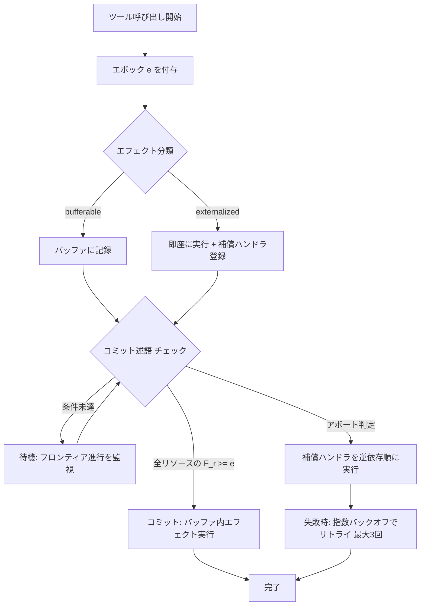

本記事は [Atomix: Timely, Transactional Tool Use for Reliable Agentic Workflows](https://arxiv.org/abs/2602.14849) の解説記事です。

## 論文概要（Abstract）

LLMエージェントが外部ツールを通じて複数ステップのワークフローを実行する際、障害や並列実行が不完全な状態変更を残す問題が生じている。著者らはこの問題に対し、進捗認識トランザクション（progress-aware transaction）を導入するAtomixフレームワークを提案している。Atomixはツール呼び出しごとに論理タイムスタンプ（エポック）を付与し、リソースごとのフロンティアで完了済み作業を追跡することで、投機的実行の安全な管理と障害復旧を実現する。約2,000行のPythonライブラリシムとして実装され、WebArena・OSWorld・$\tau$-benchの3ベンチマークにおいて、30%の障害注入下でベースラインの成功率3.3%に対し57.2%を達成したと報告されている。

この記事は [Zenn記事: LangGraph v1.0ステートマシン設計パターン：条件分岐・並列実行・HILを実装する](https://zenn.dev/0h_n0/articles/bba30ad1314785) の深掘りです。

## 情報源

- **arXiv ID**: 2602.14849
- **URL**: [arXiv:2602.14849](https://arxiv.org/abs/2602.14849)
- **著者**: Bardia Mohammadi, Nearchos Potamitis, Lars Klein, Akhil Arora, Laurent Bindschaedler
- **投稿年**: 2026年2月（v2: 2026年5月29日）
- **分野**: Machine Learning (cs.LG)

## 背景と動機（Background & Motivation）

LLMエージェントがファイル操作、API呼び出し、データベース更新などの外部ツールを使って多段階タスクを実行するケースが増加している。LangGraphやTemporalなどの既存フレームワークはツールの副作用を即座に外部化（externalize）するため、途中でエラーが発生すると中途半端な状態変更が残存する。例えば、メール送信後のカレンダー登録が失敗した場合、送信済みメールを取り消すことはできない。また、投機的実行（speculation）において未確定の結果が他のタスクに伝播し、汚染（contamination）を引き起こす問題もある。チェックポイント・ロールバック方式（AgentGitなど）はこの問題を部分的に緩和するが、リソースごとの順序管理や投機的実行の隔離が欠如しており、長時間ワークロードでの性能低下が報告されている。

## 主要な貢献（Key Contributions）

- **貢献1**: 進捗認識トランザクション（progress-aware transaction）の形式的定義。エポックとフロンティアに基づくコミット述語により、ツール副作用の可視性を厳密に制御する機構を提案
- **貢献2**: エフェクト分類体系（bufferable/externalized、reversible/irreversible）の導入。副作用の性質に応じた遅延実行・補償ハンドラ・冪等性管理を統一的に扱うフレームワークを設計
- **貢献3**: WebArena・OSWorld・$\tau$-benchの3ベンチマークにおける包括的評価。30%障害注入下でベースライン比10倍以上の成功率向上、投機的実行の汚染率0%、不可逆エフェクトの漏洩0件を実証

## 技術的詳細（Technical Details）

### 進捗認識トランザクション（Progress-Aware Transactions）

Atomixの中核概念はエポック（epoch）とフロンティア（frontier）である。各ツール呼び出しに対して単調増加する論理タイムスタンプ（エポック）$e$が付与される。リソース$r$ごとにフロンティア$F(r)$が定義され、そのリソースに対して完了が確認された最小のエポック番号を保持する。

コミット述語は以下のように定式化される。

$$
\text{commit}(T) \iff \forall r \in \text{resources}(T): F(r) \geq \text{epoch}(T)
$$

ここで、
- $T$: トランザクション
- $\text{resources}(T)$: トランザクション$T$が接触するリソースの集合
- $F(r)$: リソース$r$のフロンティア（完了が確認された最小エポック）
- $\text{epoch}(T)$: トランザクション$T$に付与されたエポック

この述語は「トランザクションがコミットされるのは、そのトランザクションが接触する全てのリソースについて、フロンティアがそのトランザクションのエポック以上に到達した場合に限る」ことを意味する。著者らはこの機構により3つの安全性不変条件を保証すると報告している。

1. **エフェクトクラスによる原子性**: bufferableエフェクトはコミットまで不可視、externalizedエフェクトは補償ハンドラで管理
2. **正確に1回のエフェクト実行**: 冪等性キーにより重複実行を防止
3. **進捗安全なコミットゲーティング**: フロンティアの進行なしにはコミットが成立しない

### トランザクションライフサイクル

以下のフローはAtomixにおけるトランザクションの処理フローを示す。



### エフェクト分類体系（Effect Taxonomy）

著者らはツール副作用を2つの軸で分類している。

**実行タイミングによる分類**:
- **Bufferable（遅延可能）**: ファイル書き込み、データベース更新など。コミット確定まで実行が遅延され、他のトランザクションからは不可視
- **Externalized（即時外部化）**: メール送信、外部API呼び出しなど。実行を遅延できないため即座に実行し、補償ハンドラ（compensation handler）を登録

**可逆性による分類**:
- **Reversible（可逆）**: ファイル削除（バックアップから復元可能）、データベースレコード更新（旧値保持）
- **Irreversible（不可逆）**: メール送信、課金API呼び出し。コミット確定まで実行をゲートする

各エフェクトの記録には以下の情報が含まれる。

- **リソーススコープ**: 階層パス（例: `fs:/repo/src/**`）でリソースを識別
- **冪等性キー**: 重複実行を防止するための一意識別子
- **補償ハンドラ**: アボート時に副作用を打ち消すための逆操作
- **ペイロードメタデータ**: エフェクトの詳細情報
- **アーティファクト**: `(epoch, trace_id)`ペアで追跡可能性を確保

記録先はJSON LinesまたはSQLiteであり、障害発生時のリプレイデバッグに活用できる。

### 並列実行の制御（Concurrent Execution）

Atomixはリソースごとの直列化をフロンティアにより実現する。グローバルロックを使用せず、各リソースのフロンティアが独立に進行するため、異なるリソースにアクセスするトランザクションは完全に並列に実行される。

著者らは以下の性能特性を報告している。

- **コーディネーションスループット**: 約14,200 tx/secの調整処理能力
- **安全性優先**: liveness（活性）よりsafety（安全性）を優先する設計方針
- **1ステップあたりのオーバーヘッド**: 7.7マイクロ秒（ツールレイテンシの0.01%未満）

リソース競合が発生した場合、後続のトランザクションはフロンティアの進行を待機するため、デッドロックのリスクは排除されている。ただし、この設計はリソース競合が激しい場合にスループットが低下する可能性がある。

### コミットとアボートの処理

**コミット処理**: バッファ内のエフェクトがコミット確定時に一括実行される。externalizedエフェクトはすでに実行済みであるため、コミット時の追加処理は不要である。

**アボート処理**: 以下の手順で実行される。

1. 補償ハンドラを依存関係の逆順に実行
2. 失敗した補償は指数バックオフ（最大3回）でリトライ
3. 3回のリトライ後も失敗した場合はログに記録し、手動介入を要求

## 実装のポイント（Implementation）

Atomixは約2,000行のPythonで実装されたライブラリシムである。既存のエージェントフレームワークに最小限の変更で統合できるよう設計されている。

### ツールアダプタ

以下の4種類のツールアダプタが提供されている。

| アダプタ | 対象 | リソーススコープ例 |
|:---|:---|:---|
| Filesystem | ファイル操作 | `fs:/repo/src/**` |
| Browser | WebArena | `web:shop.example.com/cart` |
| GUI | OSWorld | `gui:desktop/app/window` |
| Structured API | REST/GraphQL | `api:service/endpoint` |

### エフェクト記録の実装パターン

```python
from dataclasses import dataclass, field
from typing import Callable, Optional


@dataclass(frozen=True)
class Effect:
    """ツール副作用の記録

    Attributes:
        epoch: 論理タイムスタンプ
        trace_id: 分散トレーシング用ID
        resource_scope: 階層パスによるリソース識別子
        idempotency_key: 重複実行防止キー
        effect_class: "bufferable" or "externalized"
        reversible: 可逆かどうか
        payload: エフェクトの詳細データ
        compensation: アボート時の補償ハンドラ
    """
    epoch: int
    trace_id: str
    resource_scope: str
    idempotency_key: str
    effect_class: str  # "bufferable" | "externalized"
    reversible: bool = True
    payload: dict = field(default_factory=dict)
    compensation: Optional[Callable] = None


@dataclass
class Frontier:
    """リソースごとの進捗追跡

    Attributes:
        resource: リソース識別子
        min_completed_epoch: 完了が確認された最小エポック
    """
    resource: str
    min_completed_epoch: int = 0

    def advance(self, epoch: int) -> None:
        """フロンティアを指定エポックまで進める

        Args:
            epoch: 進行先エポック
        """
        if epoch > self.min_completed_epoch:
            self.min_completed_epoch = epoch

    def can_commit(self, tx_epoch: int) -> bool:
        """指定エポックのトランザクションがコミット可能か判定

        Args:
            tx_epoch: トランザクションのエポック

        Returns:
            フロンティアがtx_epoch以上であればTrue
        """
        return self.min_completed_epoch >= tx_epoch
```

### 統合パターン

著者らはAtomixを既存ツールに統合する際のパターンとして、ラッパー方式を採用している。既存のツール関数をAtomixのトランザクションマネージャでラップし、エフェクトの記録と進捗追跡を透過的に行う。この設計により、既存のLangGraphやCrewAIのワークフローに対して最小限のコード変更で統合できると報告されている。

## Production Deployment Guide

Atomixのトランザクション管理基盤をAWS上でプロダクション運用するための構成を示す。コスト試算は2026年9月時点のAWS ap-northeast-1（東京）リージョン料金に基づく概算値であり、実際のコストはトラフィックパターン、リージョン、エージェント実行頻度により変動する。

### AWS実装パターン（コスト最適化重視）

| 構成 | エージェント実行頻度 | アーキテクチャ | 月額コスト |
|:---|:---|:---|:---:|
| Small | ~100 実行/日 | Lambda + DynamoDB + SQS | $80-200 |
| Medium | ~1,000 実行/日 | ECS Fargate + RDS PostgreSQL + ElastiCache | $400-1,200 |
| Large | 10,000+ 実行/日 | EKS + Karpenter + Spot + Aurora | $3,000-8,000 |

Atomixのアーキテクチャはエフェクト記録とフロンティア管理が中核であるため、永続化層の信頼性が最重要となる。

### Terraformインフラコード

**Small構成（Serverless: エフェクト記録 + フロンティア管理）**:

```hcl
# --- Small構成: Lambda + DynamoDB (エフェクト記録・フロンティア管理) ---
# Atomix Transaction Coordinator

terraform {
  required_version = ">= 1.9"
  required_providers {
    aws = { source = "hashicorp/aws", version = "~> 5.80" }
  }
}

provider "aws" { region = "ap-northeast-1" }

# DynamoDB: エフェクトログ（JSON Lines相当の永続化）
resource "aws_dynamodb_table" "effect_log" {
  name         = "atomix-effect-log"
  billing_mode = "PAY_PER_REQUEST"
  hash_key     = "trace_id"
  range_key    = "epoch"

  attribute {
    name = "trace_id"
    type = "S"
  }
  attribute {
    name = "epoch"
    type = "N"
  }

  # リプレイデバッグ用にPITR有効化
  point_in_time_recovery { enabled = true }
  server_side_encryption { enabled = true }

  # 30日後に自動削除（コスト最適化）
  ttl { attribute_name = "ttl_expire" enabled = true }
}

# DynamoDB: フロンティア状態管理
resource "aws_dynamodb_table" "frontier_state" {
  name         = "atomix-frontier-state"
  billing_mode = "PAY_PER_REQUEST"
  hash_key     = "resource_scope"

  attribute {
    name = "resource_scope"
    type = "S"
  }

  server_side_encryption { enabled = true }
}

# Lambda: トランザクションコーディネータ
resource "aws_iam_role" "tx_coordinator" {
  name = "atomix-tx-coordinator-role"
  assume_role_policy = jsonencode({
    Version = "2012-10-17"
    Statement = [{
      Action    = "sts:AssumeRole"
      Effect    = "Allow"
      Principal = { Service = "lambda.amazonaws.com" }
    }]
  })
}

resource "aws_iam_role_policy" "tx_coordinator" {
  name = "atomix-tx-coordinator-policy"
  role = aws_iam_role.tx_coordinator.id
  policy = jsonencode({
    Version = "2012-10-17"
    Statement = [
      {
        Effect   = "Allow"
        Action   = ["dynamodb:GetItem", "dynamodb:PutItem", "dynamodb:UpdateItem", "dynamodb:Query"]
        Resource = [
          aws_dynamodb_table.effect_log.arn,
          aws_dynamodb_table.frontier_state.arn
        ]
      },
      {
        Effect   = "Allow"
        Action   = ["logs:CreateLogGroup", "logs:CreateLogStream", "logs:PutLogEvents"]
        Resource = "arn:aws:logs:ap-northeast-1:*:*"
      },
      {
        Effect   = "Allow"
        Action   = ["sqs:SendMessage", "sqs:ReceiveMessage", "sqs:DeleteMessage"]
        Resource = aws_sqs_queue.compensation_queue.arn
      }
    ]
  })
}

# SQS: 補償ハンドラ用キュー（アボート時の逆順実行）
resource "aws_sqs_queue" "compensation_queue" {
  name                       = "atomix-compensation-queue"
  visibility_timeout_seconds = 300
  message_retention_seconds  = 1209600  # 14日
  redrive_policy = jsonencode({
    deadLetterTargetArn = aws_sqs_queue.compensation_dlq.arn
    maxReceiveCount     = 3  # 指数バックオフ3回に対応
  })
}

resource "aws_sqs_queue" "compensation_dlq" {
  name                      = "atomix-compensation-dlq"
  message_retention_seconds = 1209600
}

resource "aws_lambda_function" "tx_coordinator" {
  function_name = "atomix-tx-coordinator"
  role          = aws_iam_role.tx_coordinator.arn
  runtime       = "python3.12"
  handler       = "coordinator.handler"
  timeout       = 60
  memory_size   = 512
  filename      = "coordinator.zip"

  environment {
    variables = {
      EFFECT_TABLE   = aws_dynamodb_table.effect_log.name
      FRONTIER_TABLE = aws_dynamodb_table.frontier_state.name
      COMP_QUEUE_URL = aws_sqs_queue.compensation_queue.url
    }
  }

  tracing_config { mode = "Active" }
}

# CloudWatchアラーム: 補償失敗の監視
resource "aws_cloudwatch_metric_alarm" "compensation_dlq" {
  alarm_name          = "atomix-compensation-dlq-messages"
  comparison_operator = "GreaterThanThreshold"
  evaluation_periods  = 1
  metric_name         = "ApproximateNumberOfMessagesVisible"
  namespace           = "AWS/SQS"
  period              = 300
  statistic           = "Sum"
  threshold           = 0
  alarm_description   = "Compensation handler failures detected"

  dimensions = {
    QueueName = aws_sqs_queue.compensation_dlq.name
  }
}
```

**Large構成（Container）**: `terraform-aws-modules/eks/aws` v20.31でEKS 1.31クラスタを構成し、Karpenter NodePoolでSpot優先（`m6i.large`, `m6a.large`, `m5.large`）の自動スケーリングを設定する。フロンティア状態はAurora PostgreSQL Serverless v2に格納し、エフェクトログはS3 + Athenaによるコスト効率の高いアーカイブ構成とする。`consolidationPolicy: WhenEmptyOrUnderutilized`で不要ノードを30秒後に自動回収し、`aws_budgets_budget`で月額$8,000の80%到達時にアラートを発行する。

### 運用・監視設定

**CloudWatch Logs Insights クエリ（トランザクション異常検知）**:

```
fields @timestamp, trace_id, resource_scope, epoch
| filter effect_class = "externalized" AND status = "compensation_failed"
| stats count(*) as failed_compensations by resource_scope, bin(1h) as hour
| sort failed_compensations desc
| limit 20
```

**フロンティア進行の監視**: フロンティアが一定時間進行しない場合はデッドロックの可能性を示す。`frontier_stall_seconds`メトリクスをカスタムメトリクスとして発行し、5分以上の停滞でアラートを発行する。

**X-Ray トレーシング**: `aws_xray_sdk.core`の`patch_all()`でboto3を自動計装し、`@xray_recorder.capture`デコレータでコミット判定関数をトレースする。`put_annotation`でtrace_id、`put_metadata`でepoch、resource_scope、effect_classを記録する。

### コスト最適化チェックリスト

**アーキテクチャ選択**:
- [ ] エージェント実行頻度に応じた構成選択（~100/日: Serverless、~1000: Hybrid、10000+: Container）
- [ ] エフェクトログの保持期間を要件に応じて設定（DynamoDB TTL / S3 Lifecycle）

**リソース最適化**:
- [ ] EC2: Spot Instances優先（Karpenterで最大90%削減）
- [ ] Aurora: Serverless v2で自動スケーリング（アイドル時0.5 ACU）
- [ ] DynamoDB: On-Demand課金でバースト対応
- [ ] Lambda: Power Tuningでメモリサイズ最適化

**監視・アラート**:
- [ ] 補償DLQの監視（失敗した補償の即時検知）
- [ ] フロンティア停滞アラーム（デッドロック検知）
- [ ] AWS Budgets設定（月額予算の80%で警告）
- [ ] Cost Anomaly Detection有効化

## 実験結果（Results）

### ベンチマーク評価

著者らは3つのベンチマークで30%の障害注入（fault injection）を行い、Atomixのトランザクション付き実行（Tx-Full）とベースライン（トランザクションなし）を比較している（論文Table 1より）。

| ベンチマーク | Tx-Full | ベースライン | 主要指標 |
|:---|:---:|:---:|:---|
| WebArena | 57.2% $\pm$ 6.7% | 3.3% | 成功率（30%障害注入） |
| OSWorld | 37% $\pm$ 8.8% | 0% | 成功率 |
| $\tau$-bench | 53.5% | 0% $\to$ 41%（CR） | 障害復旧率 |

WebArenaでは30%の障害注入下でベースラインの成功率がわずか3.3%であるのに対し、Tx-Fullは57.2%を達成している。OSWorldではベースラインが完全に失敗する（0%）環境でも37%の成功率を維持している。

### チェックポイント・ロールバック（CR）との比較

$\tau$-benchにおいて、Atomix（Tx-Full）はチェックポイント・ロールバック方式（AgentGitベース）との比較で、特に長時間ワークロードで優位性を示している。

- **Tx-Full**: 53.5%の障害復旧率
- **CR方式**: 41%（初期障害時は0%からリカバリ）
- **差分要因**: CRはリソースごとの順序管理（per-resource ordering）を欠くため、長い依存チェーンで不整合が蓄積する

### 投機的実行の隔離

投機的実行（speculation）における汚染率について、著者らは以下を報告している。

- **Atomix**: 0%の汚染率（投機的エフェクトはフロンティア進行まで不可視）
- **ベースライン**: 100%の汚染率（投機的結果が即座に他のタスクに伝播）

### 不可逆エフェクトのゲーティング

不可逆エフェクト（メール送信など）に対するゲーティングの効果として、以下が報告されている。

- **Atomix**: 漏洩メール0件（コミット確定まで送信をゲート）
- **CR方式**: 1,351件の重複メール送信（チェックポイント間で実行済みメールがロールバック不可）

### オーバーヘッド

Atomixのトランザクション管理に伴うオーバーヘッドは1ステップあたり7.7マイクロ秒であり、ツール呼び出しのレイテンシ（通常ミリ秒〜秒オーダー）の0.01%未満である。著者らはこのオーバーヘッドが実用上無視できるレベルであると結論づけている。

## 実運用への応用（Practical Applications）

### LangGraphとの補完関係

[Zenn記事](https://zenn.dev/0h_n0/articles/bba30ad1314785)で解説されているLangGraph v1.0のステートマシン設計パターンにおいて、条件分岐・並列実行・HIL（Human-in-the-Loop）の各パターンは状態遷移の管理に焦点を当てている。Atomixはこれらのパターンを補完する形で、ツール副作用の原子性と障害復旧を担保する。

具体的には、LangGraphのチェックポイント機構がエージェントの内部状態（StateGraph上の状態）の永続化を担うのに対し、Atomixは外部リソースに対する副作用の一貫性を保証する。LangGraphの並列実行パターンでは複数のノードが同時にツールを呼び出す可能性があるが、Atomixのリソースごとのフロンティア管理によって、並列ツール呼び出し間の競合状態を安全に処理できる。

### 適用が有効なユースケース

1. **マルチツール連携ワークフロー**: 複数の外部サービス（メール、カレンダー、データベース、ファイルシステム）を跨ぐタスク
2. **障害頻度の高い環境**: ネットワーク不安定、外部APIのレート制限、間欠的なサービス障害が頻発する環境
3. **不可逆操作を含むワークフロー**: 課金、メール送信、公開APIへのデータ投入など、取り消しが困難な操作を含む場合

### 適用上の制約

現時点のAtomixはシングルプロセスで動作するライブラリシムであり、分散環境での利用は想定されていない。マルチノードでのフロンティア同期やエフェクトログの分散管理は将来課題として挙げられている。また、エフェクトの分類（bufferable/externalized）はツールアダプタの実装者が手動で指定する必要があり、誤分類のリスクが存在する。

## 関連研究（Related Work）

### LangGraph / Temporal

LangGraphはステートマシンベースのエージェントオーケストレーションフレームワークであり、チェックポイント機構による状態永続化を提供する。TemporalはDurable Executionパターンによりワークフローの信頼性を確保する。ただし、いずれもツール副作用の即時外部化を前提としており、投機的実行の隔離やリソースごとの進捗追跡は提供しない。

### AgentGit（Checkpoint-Rollback）

チェックポイント・ロールバック方式はVCSのコミット・リバートに着想を得たアプローチであり、エージェントの状態を定期的にスナップショットし、障害時にロールバックする。著者らはCR方式がリソースごとの順序管理（per-resource ordering）を欠くことを指摘し、$\tau$-benchにおいて長時間ワークロードでの性能差（53.5% vs 41%）を報告している。

### Sagaパターン

分散トランザクションにおけるSagaパターンは補償トランザクションによる整合性確保を提供するが、進捗述語（progress predicate）に基づく安全な可視性制御を欠いている。AtomixのフロンティアベースのコミットゲーティングはSagaを拡張し、投機的実行環境における副作用の安全な管理を可能にしている。

## まとめと今後の展望（Conclusion & Future Work）

Atomixは、LLMエージェントのツール実行における障害復旧と並列実行の安全性を、進捗認識トランザクションにより形式的に保証するフレームワークである。3つのベンチマークにおいて、30%の障害注入下でベースライン比10倍以上の成功率向上を達成し、投機的実行の汚染率0%、不可逆エフェクトの漏洩0件を実現している。1ステップあたり7.7マイクロ秒のオーバーヘッドは実用上無視できるレベルである。

**現時点の制約**:

- シングルプロセス実装であり、分散環境は未対応
- エフェクト分類の手動指定が必要（自動分類は将来課題）
- リソース競合が激しい場合のスループット低下

**今後の展望として著者らは以下を挙げている**:

- 分散バージョンの開発（マルチノードでのフロンティア同期）
- エフェクト分類の自動推論
- より多様なツールアダプタの提供
- 大規模マルチエージェントシステムへの適用

## 参考文献

1. Mohammadi, B., Potamitis, N., Klein, L., Arora, A., & Bindschaedler, L. (2026). Atomix: Timely, Transactional Tool Use for Reliable Agentic Workflows. arXiv:2602.14849.
2. LangGraph Documentation. [https://langchain-ai.github.io/langgraph/](https://langchain-ai.github.io/langgraph/)
3. Temporal Documentation. [https://docs.temporal.io/](https://docs.temporal.io/)
4. Garcia-Molina, H., & Salem, K. (1987). Sagas. ACM SIGMOD Record.
