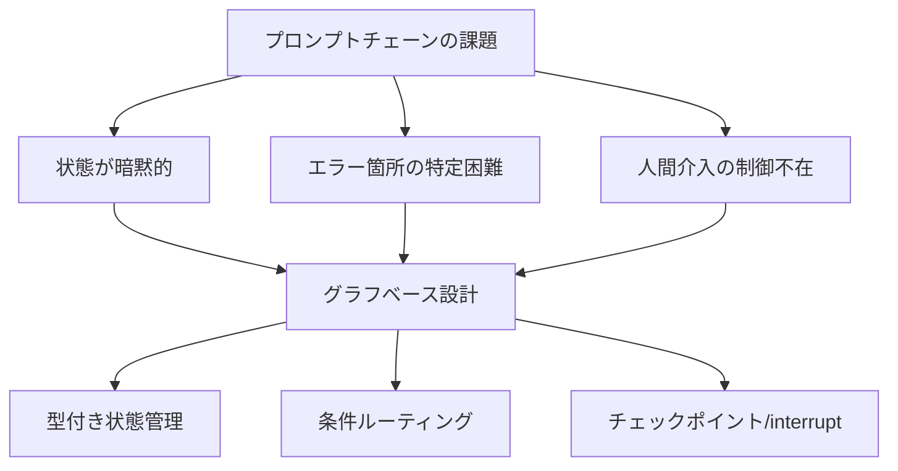
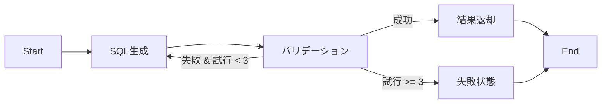
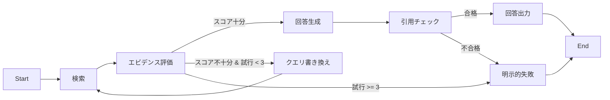
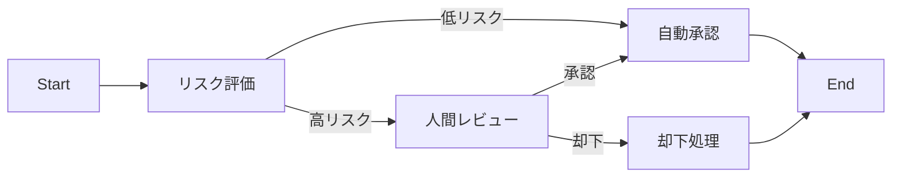

本記事は [Graph-Based Agentic AI with LangGraph: Workflow Pathways for Long-Running Stateful Business Processes](https://arxiv.org/abs/2607.19297) の解説記事です。

## 論文概要（Abstract）

LLMベースのエージェントが単発の質問応答を超えて長時間稼働するビジネスプロセスに適用される場面が増えている。しかし、プロンプトチェーンだけでは状態管理・エラー回復・人間介入の制御が困難になる。著者らはLangGraphを用いた3つの実行可能レシピ（SQL分析の修復ループ、エビデンスゲーティングRAG、HITL承認フロー）を提示し、グラフベースのワークフロー設計がエージェントの検査・修復・一時停止・再開・ガバナンスをどのように容易にするかを論じている。著者らは「グラフがLLMを賢くするかではなく、グラフがワークフローの検査・修復・一時停止・再開・ガバナンスを容易にするかが有用な問いである」と述べている。

この記事は [Zenn記事: LangGraph v1.0ステートマシン設計パターン：条件分岐・並列実行・HILを実装する](https://zenn.dev/0h_n0/articles/bba30ad1314785) の深掘りです。

## 情報源

- **arXiv ID**: 2607.19297
- **URL**: [https://arxiv.org/abs/2607.19297](https://arxiv.org/abs/2607.19297)
- **著者**: Daniel Pearson, Sidney Shapiro, Emiliano Sebastian Gonzalez Venegas, Sanad Al-Khatib, Aurora Pinzon Arzola
- **発表年**: 2026年7月
- **分野**: Artificial Intelligence (cs.AI), Software Engineering (cs.SE)

## 背景と動機（Background & Motivation）

LLMエージェントを業務プロセスに組み込む際、プロンプトのみのロジックでは状態が暗黙的にコンテキストウィンドウに埋め込まれ、ステップ間の中間成果物が失われる。エラー箇所の特定が困難であり、人間介入ポイントの制御が構造化されていない。

著者らはグラフベースのオーケストレーションが解決策になると主張している。有向グラフにより各ノードの入出力が型で定義され、条件分岐が決定論的関数として明示化される。チェックポイント機構によりノード境界で永続化が行われ、プロセス再起動をまたいだ一時停止・再開が可能になる。



## 主要な貢献（Key Contributions）

- **貢献1: 3つの実行可能レシピ** --- SQL分析の修復ループ、エビデンスゲーティングRAG、HITL承認フローの3パターンをTypedDict状態スキーマ付きで実装し、それぞれの状態遷移を有向グラフとして構造化している。
- **貢献2: 設計原則の体系化** --- 型付き状態管理、条件ルーティング、チェックポイント/interruptの3つの設計原則を抽出し、LangGraphに限らない汎用的なエージェントワークフロー設計指針として整理している。
- **貢献3: 技術選定フレームワーク** --- LangGraph、Plain SDK、スキーマファーストツール（DSPy等）のどれを選ぶべきかの判断基準を提示し、「ワークフローの複雑度」「状態永続化の要否」「人間介入の有無」を軸とした選定マトリクスを提案している。

## 技術的詳細（Technical Details）

### レシピ1: SQL分析の修復ループ

著者らは最初のレシピとして、自然言語の質問をSQLクエリに変換し、実行エラー時に自動修復を試みるワークフローを提示している。状態スキーマ`SQLState`はTypedDictで定義され、質問文、データベーススキーマ、生成SQL、エラーメッセージ、試行回数、結果行を保持する。

```python
from typing import TypedDict, Optional
from langgraph.graph import StateGraph, END

class SQLState(TypedDict):
    """SQL分析ワークフローの型付き状態。

    各フィールドがワークフローのステップ間で
    共有される中間成果物として機能する。
    """
    question: str
    db_schema: str
    generated_sql: str
    error_message: Optional[str]
    attempt_count: int
    result_rows: Optional[list[dict]]
```

ワークフローは以下の有向グラフで表現される。生成ノードがSQLを出力し、バリデーションノードが構文・実行エラーを検査する。バリデーション失敗時はエラーコンテキストを付与して生成ノードにリダイレクトされる。試行回数が予算（著者らの実装では3回）を超えた場合はfail状態に遷移する。



条件ルーティング関数は小さく決定論的に実装される。著者らはルーティング関数にLLM呼び出しを含めず、状態フィールドの値のみで分岐先を決定することを推奨している。

```python
def route_after_validation(state: SQLState) -> str:
    """バリデーション結果に基づくルーティング。

    状態フィールドの値のみで分岐先を決定論的に決定する。
    """
    if state["error_message"] is None:
        return "return_results"
    if state["attempt_count"] >= 3:
        return "fail"
    return "generate_sql"

graph = StateGraph(SQLState)
graph.add_node("generate_sql", generate_sql_node)
graph.add_node("validate", validate_node)
graph.set_entry_point("generate_sql")
graph.add_edge("generate_sql", "validate")
graph.add_conditional_edges(
    "validate", route_after_validation,
    {"return_results": "return_results",
     "generate_sql": "generate_sql", "fail": "fail"},
)
```

この設計の重要な特徴は、エラーメッセージが状態に永続化されることにより、再生成時にLLMが前回の失敗理由を参照できる点である。著者らはこれを「エラーコンテキストの蓄積」と呼び、プロンプトチェーンでは実現困難な修復品質の向上が期待できると述べている。

### レシピ2: エビデンスゲーティングRAG

2つ目のレシピは、検索拡張生成（RAG）において、エビデンスの品質が不十分な場合にリトリーバルをループさせるワークフローである。著者らは`RAGState`スキーマを定義し、クエリ、検索結果、エビデンススコア、生成回答、引用チェック結果を保持する。

```python
from typing import TypedDict, Optional

class RAGState(TypedDict):
    """エビデンスゲーティングRAGの型付き状態。

    弱いエビデンスや引用チェック失敗を
    構造的に検出・処理するための状態管理。
    """
    query: str
    retrieved_docs: list[dict]
    evidence_score: float
    generated_answer: Optional[str]
    citation_check_passed: Optional[bool]
    retrieval_attempts: int
```



著者らが強調しているのは、引用チェックに失敗した場合にハルシネーションを含む回答を返すのではなく、明示的に失敗状態に遷移させる設計である。著者らは「ハルシネーションよりも明示的な失敗のほうが業務プロセスにおいて安全である」と述べている。

```python
def route_after_evidence(state: RAGState) -> str:
    """エビデンススコアに基づくルーティング。

    閾値はドメインに応じて調整する。
    著者らの実装ではスコア0.7を閾値としている。

    Returns:
        遷移先ノードのラベル文字列
    """
    if state["evidence_score"] >= 0.7:
        return "generate_answer"
    if state["retrieval_attempts"] >= 3:
        return "explicit_fail"
    return "rewrite_query"
```

エビデンスゲーティングの設計原則として、著者らはエビデンススコアの閾値がドメインごとに調整可能であること、リトリーバルの再試行時にクエリ書き換えを行い同一クエリの繰り返しを避けること、引用チェックは生成後に独立したノードとして実行し生成ノードの責務と分離することの3点を挙げている。

### レシピ3: HITL承認フロー

3つ目のレシピは、リスクスコアリングに基づいて人間の承認を要求するワークフローである。著者らは`ReviewState`にリスクスコアフィールドを含め、高リスク判定時に`interrupt()`でワークフローを一時停止し、人間のレビュー後に`Command(resume=...)`で再開する設計を提示している。

```python
from typing import TypedDict, Optional
from langgraph.types import interrupt, Command

class ReviewState(TypedDict):
    """HITL承認フローの型付き状態。"""
    proposal: str
    risk_score: float
    human_decision: Optional[str]
    final_output: Optional[str]


def human_review_node(state: ReviewState) -> dict:
    """高リスク時に人間の承認を要求するノード。

    interrupt()で一時停止し、Command(resume=...)で再開。
    """
    decision = interrupt({
        "proposal": state["proposal"],
        "risk_score": state["risk_score"],
        "message": "高リスク案件です。承認または却下してください。",
    })
    return {"human_decision": decision}
```



著者らはチェックポイント機構がノード境界で永続化される点を強調している。サーバー再起動後もinterrupt状態が維持され、人間のレビューが数日後に行われても正しく再開できる。

### 型付き状態管理とReducer

著者らは3つのレシピに共通する設計原則として、TypedDictとReducerによる型付き状態管理を提唱している。Reducerはリストフィールドへの追記など、状態更新の合成方法を定義する仕組みである。例えば`Annotated[list[str], add]`と宣言すると、各ノードの出力が既存リストに追加される。著者らはこの設計により、中間成果物がステップをまたいで永続化され、デバッグ時に任意のノードの入出力を検査できると述べている。

### 条件ルーティングの実装パターン

著者らは「小さく決定論的なルート関数」を推奨している。ルート関数は状態フィールドを読み取ってラベル文字列を返す純粋関数であり、LLM呼び出しやI/O操作を含めるべきではない。この設計により、状態のモックを入力するだけで分岐の網羅テストが可能になり、著者らはこれを「ワークフロー契約テスト」と呼んでいる。

## 実装のポイント（Implementation Notes）

著者らが実装上の指針として繰り返し強調しているのは以下の4点である。

**第一に、状態とプロンプトロジックの分離。** 状態スキーマはワークフローの構造を定義し、プロンプトは各ノード内部のLLM呼び出しに限定する。

**第二に、ルート関数の決定論性。** LLMの判断が必要な場合は、判断結果を状態フィールドに書き込むノードを別途設け、ルート関数はその結果フィールドを読むだけにする。

**第三に、失敗の明示化。** 著者らは「静かに低品質な出力を返すよりも、明示的に失敗するほうが後段のプロセスにとって安全である」と述べている。

**第四に、チェックポイントの活用範囲。** ノード境界で自動永続化されるため、HITLフローだけでなくバッチ処理やAPI呼び出しの途中結果にも追加コストなしで耐障害性が得られる。

## 本番デプロイメントガイド（Production Deployment Guide）

著者らの3レシピを本番環境にデプロイする際の構成パターンを、ワークロード規模別に整理する。以下のコスト試算は2026年9月時点のAWS東京リージョン（ap-northeast-1）の公開料金に基づく参考値であり、実際のコストはリクエストパターンやデータ量に依存する。

### 規模別アーキテクチャ選定

| 規模 | 日次リクエスト | レイテンシ要件 | 推奨構成 | 月額概算 |
|------|--------------|--------------|---------|---------|
| Small | ~1,000 | 30秒以内 | Lambda + DynamoDB + SQS | $50-150 |
| Medium | ~10,000 | 10秒以内 | ECS Fargate + Aurora Serverless | $300-800 |
| Large | ~100,000+ | 5秒以内 | EKS + Karpenter + Aurora | $1,500-5,000 |

### Small規模: Lambda + DynamoDB

小規模なワークフローでは、各ノードをLambda関数として実装し、DynamoDBにチェックポイント状態を永続化する構成が適している。Step Functionsがグラフの条件ルーティングを担当する。

```hcl
# Terraform: Small規模のLangGraphワークフロー基盤

resource "aws_dynamodb_table" "workflow_checkpoint" {
  name         = "langgraph-checkpoint"
  billing_mode = "PAY_PER_REQUEST"
  hash_key     = "thread_id"
  range_key    = "checkpoint_ns"

  attribute {
    name = "thread_id"
    type = "S"
  }

  attribute {
    name = "checkpoint_ns"
    type = "S"
  }

  ttl {
    attribute_name = "expires_at"
    enabled        = true
  }
}

resource "aws_lambda_function" "workflow_node" {
  function_name = "langgraph-sql-repair"
  runtime       = "python3.12"
  handler       = "handler.lambda_handler"
  timeout       = 30
  memory_size   = 512

  environment {
    variables = {
      CHECKPOINT_TABLE = aws_dynamodb_table.workflow_checkpoint.name
      MAX_ATTEMPTS     = "3"
    }
  }
}

resource "aws_sqs_queue" "workflow_queue" {
  name                       = "langgraph-workflow"
  visibility_timeout_seconds = 60

  redrive_policy = jsonencode({
    deadLetterTargetArn = aws_sqs_queue.workflow_dlq.arn
    maxReceiveCount     = 3
  })
}
```

### Large規模: EKS + Karpenter

大規模環境ではEKSクラスタ上にワークフローサーバーを配置し、Karpenterによるオートスケーリングでコスト効率を最適化する。Aurora PostgreSQLがチェックポイントストアとして機能する。

```hcl
# Terraform: Large規模のLangGraphワークフロー基盤

module "eks" {
  source  = "terraform-aws-modules/eks/aws"
  version = "~> 20.0"

  cluster_name    = "langgraph-workflow"
  cluster_version = "1.31"
  vpc_id          = module.vpc.vpc_id
  subnet_ids      = module.vpc.private_subnets

  eks_managed_node_groups = {
    system = {
      instance_types = ["m7i.large"]
      min_size = 2
      max_size = 4
    }
  }
}

resource "kubectl_manifest" "karpenter_node_pool" {
  yaml_body = yamlencode({
    apiVersion = "karpenter.sh/v1"
    kind       = "NodePool"
    metadata   = { name = "workflow-nodes" }
    spec = {
      template = {
        spec = {
          requirements = [
            {
              key      = "karpenter.sh/capacity-type"
              operator = "In"
              values   = ["spot", "on-demand"]
            },
            {
              key      = "node.kubernetes.io/instance-type"
              operator = "In"
              values   = ["m7i.xlarge", "m7i.2xlarge", "c7i.xlarge"]
            },
          ]
        }
      }
      limits     = { cpu = "100", memory = "400Gi" }
      disruption = {
        consolidationPolicy = "WhenEmptyOrUnderutilized"
        consolidateAfter    = "60s"
      }
    }
  })
}

resource "aws_rds_cluster" "checkpoint_store" {
  cluster_identifier = "langgraph-checkpoint"
  engine             = "aurora-postgresql"
  engine_version     = "16.4"
  database_name      = "langgraph"

  serverlessv2_scaling_configuration {
    min_capacity = 0.5
    max_capacity = 16.0
  }
}
```

### モニタリング構成

CloudWatchを用いた監視では、ワークフローの各ノードの実行時間・失敗率・リトライ回数を追跡する。`LangGraph/Workflows`名前空間に`NodeDuration`、`NodeSuccess`、`AttemptCount`の3メトリクスを送信し、ワークフロー名とノード名をディメンションとして設定する。

```python
import boto3
from typing import Any

cloudwatch = boto3.client("cloudwatch", region_name="ap-northeast-1")


def emit_node_metrics(
    workflow_name: str,
    node_name: str,
    duration_ms: float,
    success: bool,
    attempt: int = 1,
) -> None:
    """ワークフローノードの実行メトリクスをCloudWatchに送信する。

    Args:
        workflow_name: ワークフロー名（例: "sql-repair"）
        node_name: ノード名（例: "generate_sql"）
        duration_ms: 実行時間（ミリ秒）
        success: 成功したかどうか
        attempt: 試行回数（リトライ回数の追跡用）
    """
    dims = [
        {"Name": "Workflow", "Value": workflow_name},
        {"Name": "Node", "Value": node_name},
    ]
    cloudwatch.put_metric_data(
        Namespace="LangGraph/Workflows",
        MetricData=[
            {"MetricName": "NodeDuration", "Value": duration_ms,
             "Unit": "Milliseconds", "Dimensions": dims},
            {"MetricName": "NodeSuccess", "Value": 1.0 if success else 0.0,
             "Unit": "Count", "Dimensions": dims},
            {"MetricName": "AttemptCount", "Value": float(attempt),
             "Unit": "Count", "Dimensions": dims},
        ],
    )
```

### コスト最適化チェックリスト

本番デプロイ時に確認すべきコスト最適化項目を以下に整理する。

- DynamoDBのTTLで完了済みチェックポイントを自動削除する（保持期間7-30日）
- LambdaのProvisioned Concurrencyは必要時のみ設定し、通常はオンデマンド実行
- KarpenterのSpotインスタンス比率を70%以上に設定し、ノードの冪等性を確保
- Aurora Serverless v2のmin_capacityを0.5 ACUに設定しアイドル時コストを抑制
- CloudWatch Logs保持期間を30日に制限し、長期保存はS3 Glacierに移行
- SQSデッドレターキューを監視し、失敗ワークフローの再処理パイプラインを構築

## 実験結果（Evaluation）

本論文はベンチマーク論文ではない。著者らは従来のモデル精度評価とは異なるアプローチとして「ワークフロー契約テスト」を提案している。契約テストとは、各ノードの入出力型と条件分岐のカバレッジをテストするものであり、ワークフローの正しさを構造的に検証する手法である。

具体的には、(1)各ルート関数にモック状態を入力して分岐先を検証する**状態遷移テスト**、(2)各ノードの出力が後続ノードの入力型と一致することを型チェッカーで検証する**型整合性テスト**、(3)ワークフロー全体を通じた状態の一貫性を検証する**エンドツーエンド契約テスト**の3種類を実施している。

著者らはこの評価アプローチについて、「LLMの出力品質はモデルとプロンプトに依存するが、ワークフローの構造的正しさはグラフ定義とルーティング関数のみに依存する。後者は決定論的にテスト可能であり、CI/CDパイプラインに組み込める」と述べている。

## 実運用への応用（Practical Applications）

### Zenn記事との接続

[Zenn記事: LangGraph v1.0ステートマシン設計パターン](https://zenn.dev/0h_n0/articles/bba30ad1314785)ではLangGraphの条件分岐・並列実行・HILの実装パターンを取り上げている。本論文はこれらのパターンを業務プロセスに適用する際の具体的な設計指針を提供するものであり、以下の点で相互補完的な関係にある。

**SQL分析ワークフロー**: 自然言語からのSQLクエリ生成において、修復ループパターンにより初回失敗時もエラーコンテキストを蓄積して自動再生成できる。

**RAGアプリケーション**: エビデンスゲーティングにより、企業内文書検索やカスタマーサポートで不確実な回答をユーザーに提示するリスクを低減する。

**承認ワークフロー**: 金融取引の承認、契約書レビューなど、人間の判断が法的に求められる業務プロセスにHITLパターンが適用可能である。

### 技術選定への示唆

著者らによれば、以下の条件のうち2つ以上に該当する場合はLangGraphの採用を検討すべきである。(1)条件分岐がある、(2)ステップ間で状態永続化が必要、(3)人間の介入ポイントがある、(4)リトライやフォールバックが必要、(5)実行履歴の検査が必要。逆に、単一のLLM呼び出しで完結する処理にはPlain SDKで十分であると述べている。

## 関連研究（Related Works）

著者らの論文に関連する研究として、以下のアプローチが挙げられる。

**GraphFlow（2025）**: ワークフローをDAGとして表現するフレームワーク。巡回を許可しないため修復ループのようなサイクルには対応していない。著者らのアプローチはサイクルを許可する有向グラフであり、修復やリトリーバルの再試行を自然に表現できる。

**Atomix / CrewAI（2024-2025）**: マルチエージェントフレームワーク。エージェント間の協調に焦点を当てるのに対し、LangGraphは単一エージェント内のワークフロー制御に焦点を当てている。著者らは両者を組み合わせ、各エージェント内部にLangGraphワークフローを配置する構成が可能であると述べている。

**DSPy（Khattab et al., 2023-2026）**: プロンプトをモジュールとして扱い自動最適化するフレームワーク。著者らはDSPyがプロンプト最適化に強い一方、状態永続化やHITLフローのサポートがLangGraphに比べて限定的であると指摘している。両者を組み合わせ、各ノード内部のプロンプトをDSPyで最適化しつつワークフロー全体をLangGraphで管理するアプローチも提案されている。

## まとめと今後の展望

著者らはLangGraphを用いた3つの実装レシピを通じて、グラフベースのワークフロー設計が長期稼働ビジネスプロセスにおける状態管理・エラー回復・人間介入の制御を構造化する有効な手段であることを示している。

本論文の限界として、ベンチマークデータセットでの定量評価が含まれていない点、LangGraph固有のAPIに依存しており他フレームワークへの移植性が議論されていない点、大規模本番環境での運用実績が報告されていない点が挙げられる。

今後の展望として、マルチエージェントシステムとの統合（各エージェント内部にLangGraphワークフローを配置）や、DSPyとの統合によるプロンプト自動最適化が実務的に有用な研究方向である。

## 参考文献

1. Pearson, D., Shapiro, S., Gonzalez Venegas, E. S., Al-Khatib, S., & Pinzon Arzola, A. (2026). Graph-Based Agentic AI with LangGraph: Workflow Pathways for Long-Running Stateful Business Processes. arXiv:2607.19297.
2. LangGraph Documentation. [https://langchain-ai.github.io/langgraph/](https://langchain-ai.github.io/langgraph/)
3. Khattab, O., et al. (2023). DSPy: Compiling Declarative Language Model Calls into Self-Improving Pipelines. arXiv:2310.03714.
4. Wu, Q., et al. (2023). AutoGen: Enabling Next-Gen LLM Applications via Multi-Agent Conversation Framework. arXiv:2308.08155.
5. CrewAI Documentation. [https://docs.crewai.com/](https://docs.crewai.com/)
