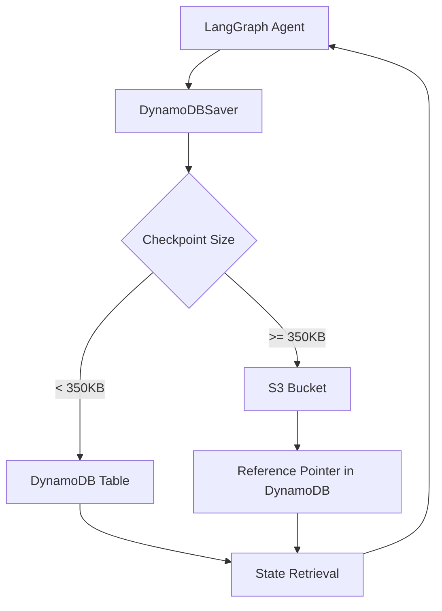

## ブログ概要（Summary）

本記事は [Build Durable AI Agents with LangGraph and Amazon DynamoDB](https://aws.amazon.com/blogs/database/build-durable-ai-agents-with-langgraph-and-amazon-dynamodb/) の解説記事です。

AWS公式ブログにおいて、Lee Hannigan氏（Sr. DynamoDB Database Engineer）は、LangGraphのチェックポイント機構をAmazon DynamoDBで永続化する`DynamoDBSaver`コネクタを紹介している。プロトタイプで使われる`MemorySaver`（インメモリ保存）はプロセス停止でデータを喪失するが、`DynamoDBSaver`に置き換えることで、障害復旧・Human-in-the-Loop（HITL）・長期対話の3つのプロダクションユースケースに対応できると説明されている。350KB未満のチェックポイントはDynamoDBに直接保存し、それ以上はS3にオフロードするハイブリッド戦略を採用している。

この記事は [Zenn記事: LangGraph v1.0ステートマシン設計パターン：条件分岐・並列実行・HILを実装する](https://zenn.dev/0h_n0/articles/bba30ad1314785) の深掘りです。Zenn記事ではLangGraphのステートマシン設計パターン（条件分岐・並列実行・HITL）を扱っているが、本ブログはそのステートマシンの「状態」をプロダクション環境でどう永続化するかという実装課題に焦点を当てている。

## 情報源

- **種別**: 企業テックブログ（AWS Database Blog）
- **URL**: [https://aws.amazon.com/blogs/database/build-durable-ai-agents-with-langgraph-and-amazon-dynamodb/](https://aws.amazon.com/blogs/database/build-durable-ai-agents-with-langgraph-and-amazon-dynamodb/)
- **組織**: Amazon Web Services（AWS）
- **著者**: Lee Hannigan, Sr. DynamoDB Database Engineer
- **発表日**: 2026年1月13日

## 技術的背景（Technical Background）

LangGraphは、LLMベースのエージェントをステートマシンとして構築するフレームワークである。各ノード（処理ステップ）がグラフ上のエッジで接続され、状態遷移に応じてエージェントの振る舞いが決定される。Zenn記事で解説した条件分岐やHITLパターンは、すべてこの状態遷移モデルの上に成り立っている。

しかし、ブログでは開発時に使われる`MemorySaver`について「ephemeral and local. When the process stops, the data is lost. If you run multiple workers, each instance keeps its own memory」と指摘している。つまり、プロセス再起動でチェックポイントが失われ、複数ワーカー間で状態共有もできない。

この問題に対し、ブログではLangGraphが提供する3つのコア概念を整理している。

- **Thread**: チェックポイントを束ねる一意識別子。`thread_id`を指定することで、同一スレッド上の実行履歴を蓄積する
- **Checkpoint**: ワークフローの各ステップ（super-step）で保存される状態スナップショット。`StateSnapshot`オブジェクトとして、`config`、`metadata`、`state channel values`、`next nodes`、`task information`を含む
- **Persistence**: チェックポイントの保存先と保存方法を決定する仕組み。`checkpointer`実装を差し替えることで保存先を変更できる

ブログでは「a simple two-node graph creates four checkpoints」と述べており、STARTの空チェックポイント、node_a入力前、node_a出力後、node_b出力後（END）の4つのスナップショットが自動生成されると説明されている。この設計により、任意のステップから再開が可能になる。

## 実装アーキテクチャ（Architecture）

### DynamoDBSaverのハイブリッドストレージ戦略

`DynamoDBSaver`は`langgraph-checkpoint-aws`パッケージで提供されるチェックポインタ実装である。ブログでは、チェックポイントサイズに応じた自動的なストレージ分岐を採用していると説明されている。



**350KB閾値の設計根拠**: DynamoDBのアイテムサイズ上限は400KBであり、チェックポイントデータに加えてメタデータ（`thread_id`、`checkpoint_id`、タイムスタンプ等）を格納する余地を確保するため、350KBを閾値としている。350KB以上のチェックポイントはS3にアップロードし、DynamoDBにはS3オブジェクトへの参照ポインタのみを保存する。ブログでは、取得時にはこの分岐が透過的に処理され「transparently loads large payloads from S3」と述べている。

### DynamoDBテーブルスキーマ

ブログで示されているテーブル構成は以下の通りである。

| 属性 | 型 | 役割 |
|------|------|------|
| PK | String（パーティションキー） | スレッドIDベースのキー |
| SK | String（ソートキー） | チェックポイントIDベースのキー |
| ttl | Number | TTLによる自動有効期限 |

パーティションキー`PK`とソートキー`SK`の組み合わせにより、特定スレッドの全チェックポイントをQueryで効率的に取得できる。

### IAMポリシー

ブログでは、DynamoDBSaverの動作に必要なIAM権限を以下の2グループに分けて説明している。

**DynamoDBアクセス権限**:
- `dynamodb:GetItem` -- 個別チェックポイントの取得
- `dynamodb:PutItem` -- 新規チェックポイントの保存
- `dynamodb:Query` -- スレッドIDによるチェックポイント検索
- `dynamodb:BatchGetItem` -- 複数チェックポイントの一括取得
- `dynamodb:BatchWriteItem` -- 複数チェックポイントの一括書き込み

**S3アクセス権限**（350KB以上のチェックポイント用）:
- `s3:PutObject` -- チェックポイントデータのアップロード
- `s3:GetObject` -- チェックポイントデータの取得
- `s3:DeleteObject` -- 期限切れチェックポイントの削除
- `s3:PutObjectTagging` -- ライフサイクル管理用タグ付け

加えて、S3バケットのライフサイクル設定用に`s3:GetBucketLifecycleConfiguration`と`s3:PutBucketLifecycleConfiguration`も必要である。

### 基本実装

ブログで示されている実装コードを以下に示す。

```python
from langgraph.graph import StateGraph, START, END
from langgraph_checkpoint_aws import DynamoDBSaver
from typing import TypedDict, Annotated
import operator


class State(TypedDict):
    """LangGraphの状態定義

    Attributes:
        foo: 単一値の状態フィールド
        bar: リスト型の状態フィールド（追記型）
    """
    foo: str
    bar: Annotated[list[str], operator.add]


def node_a(state: State) -> dict[str, str]:
    """ノードAの処理"""
    return {"foo": "processed_by_a"}


def node_b(state: State) -> dict[str, list[str]]:
    """ノードBの処理"""
    return {"bar": ["result_from_b"]}


# DynamoDB永続化の設定
checkpointer = DynamoDBSaver(
    table_name="my_langgraph_checkpoints_table",
    region_name="us-east-1",
    ttl_seconds=86400 * 30,  # 30日間でチェックポイント自動削除
    enable_checkpoint_compression=True,  # 圧縮によるコスト削減
    s3_offload_config={
        "bucket_name": "amzn-s3-demo-bucket",
    }
)

# グラフ構築とコンパイル
workflow = StateGraph(State)
workflow.add_node("node_a", node_a)
workflow.add_node("node_b", node_b)
workflow.add_edge(START, "node_a")
workflow.add_edge("node_a", "node_b")
workflow.add_edge("node_b", END)

graph = workflow.compile(checkpointer=checkpointer)

# スレッドIDを指定して実行
config = {"configurable": {"thread_id": "99"}}
result = graph.invoke({"foo": "", "bar": []}, config)
```

ブログでは「Moving from prototype to production is as simple as changing your checkpointer」と述べており、`MemorySaver`から`DynamoDBSaver`への移行はcheckpointerの差し替えのみで完了すると説明されている。

### チェックポイントの取得

保存済みチェックポイントの取得方法も示されている。

```python
# 最新の状態スナップショットを取得
config = {"configurable": {"thread_id": "99"}}
latest_checkpoint = graph.get_state(config)

# 特定のチェックポイントIDを指定して取得
checkpoint_id: str = latest_checkpoint.config.get(
    "configurable", {}
).get("checkpoint_id", "")

specific_config = {
    "configurable": {
        "thread_id": "99",
        "checkpoint_id": checkpoint_id,
    }
}
specific_checkpoint = graph.get_state(specific_config)
```

## Production Deployment Guide

### AWS実装パターン（コスト最適化重視）

DynamoDBSaverを用いたLangGraphエージェントのプロダクション構成を、トラフィック量別に整理する。

**コスト試算の注意事項**: 以下のコスト試算は2026年9月時点のAWS ap-northeast-1（東京）リージョン料金に基づく概算値である。実際のコストはトラフィックパターン、チェックポイントサイズ、リージョン選択により変動する。最新料金はAWS料金計算ツールで確認を推奨する。

| 構成 | トラフィック | 主要サービス | 月額概算 |
|------|-------------|-------------|---------|
| Small | ~100 req/日 | Lambda + DynamoDB On-Demand | $30-80 |
| Medium | ~1,000 req/日 | ECS Fargate + DynamoDB Provisioned | $200-500 |
| Large | 10,000+ req/日 | EKS + Spot + DynamoDB DAX | $1,500-4,000 |

**Small構成（~100 req/日）**: Lambda関数でLangGraphエージェントを実行し、DynamoDB On-Demandモードでチェックポイントを保存する。S3はLargeチェックポイント用のみ。コールドスタートの影響はあるが、低トラフィック環境ではコスト効率が最も高い。

**Medium構成（~1,000 req/日）**: ECS Fargateでコンテナを常時起動し、DynamoDB Provisionedモードでスループットを確保する。Auto Scalingを組み合わせることで、ピーク時の対応と低負荷時のコスト削減を両立する。

**Large構成（10,000+ req/日）**: EKS + Spot Instancesでコンテナオーケストレーションを行い、DynamoDB DAXでチェックポイント読み取りのレイテンシを削減する。Karpenterによる自動スケーリングで、Spot Instancesを優先的に利用することでコストを最大90%削減できる。

**コスト削減テクニック**:
- Spot Instances活用: On-Demand比で最大90%削減（EKS Large構成）
- DynamoDB Reserved Capacity: Provisioned構成で最大72%削減（1年コミット）
- S3 Intelligent-Tiering: アクセス頻度に応じた自動階層化
- チェックポイント圧縮: `enable_checkpoint_compression=True`でストレージコスト削減
- TTL設定: 不要なチェックポイントの自動削除でストレージコスト抑制

### Terraformインフラコード

#### Small構成（Serverless）

```hcl
# DynamoDB チェックポイントテーブル
resource "aws_dynamodb_table" "langgraph_checkpoints" {
  name         = "langgraph-checkpoints"
  billing_mode = "PAY_PER_REQUEST"  # On-Demandモードでコスト最適化
  hash_key     = "PK"
  range_key    = "SK"

  attribute {
    name = "PK"
    type = "S"
  }

  attribute {
    name = "SK"
    type = "S"
  }

  ttl {
    attribute_name = "ttl"
    enabled        = true
  }

  point_in_time_recovery {
    enabled = true  # 誤削除からの復旧用
  }

  server_side_encryption {
    enabled = true  # KMS暗号化
  }

  tags = {
    Project     = "langgraph-agent"
    Environment = "production"
    ManagedBy   = "terraform"
  }
}

# S3 チェックポイントオーバーフロー用バケット
resource "aws_s3_bucket" "checkpoint_overflow" {
  bucket = "langgraph-checkpoint-overflow-${data.aws_caller_identity.current.account_id}"

  tags = {
    Project     = "langgraph-agent"
    Environment = "production"
  }
}

resource "aws_s3_bucket_server_side_encryption_configuration" "checkpoint_overflow" {
  bucket = aws_s3_bucket.checkpoint_overflow.id

  rule {
    apply_server_side_encryption_by_default {
      sse_algorithm = "aws:kms"
    }
  }
}

resource "aws_s3_bucket_public_access_block" "checkpoint_overflow" {
  bucket = aws_s3_bucket.checkpoint_overflow.id

  block_public_acls       = true
  block_public_policy     = true
  ignore_public_acls      = true
  restrict_public_buckets = true
}

resource "aws_s3_bucket_lifecycle_configuration" "checkpoint_overflow" {
  bucket = aws_s3_bucket.checkpoint_overflow.id

  rule {
    id     = "expire-old-checkpoints"
    status = "Enabled"

    expiration {
      days = 30  # TTLと同期
    }
  }
}

# Lambda実行ロール（最小権限）
resource "aws_iam_role" "langgraph_lambda" {
  name = "langgraph-lambda-role"

  assume_role_policy = jsonencode({
    Version = "2012-10-17"
    Statement = [{
      Action = "sts:AssumeRole"
      Effect = "Allow"
      Principal = { Service = "lambda.amazonaws.com" }
    }]
  })
}

resource "aws_iam_role_policy" "langgraph_dynamodb" {
  name = "langgraph-dynamodb-access"
  role = aws_iam_role.langgraph_lambda.id

  policy = jsonencode({
    Version = "2012-10-17"
    Statement = [{
      Effect = "Allow"
      Action = [
        "dynamodb:GetItem",
        "dynamodb:PutItem",
        "dynamodb:Query",
        "dynamodb:BatchGetItem",
        "dynamodb:BatchWriteItem"
      ]
      Resource = aws_dynamodb_table.langgraph_checkpoints.arn
    }]
  })
}

resource "aws_iam_role_policy" "langgraph_s3" {
  name = "langgraph-s3-access"
  role = aws_iam_role.langgraph_lambda.id

  policy = jsonencode({
    Version = "2012-10-17"
    Statement = [{
      Effect = "Allow"
      Action = [
        "s3:PutObject",
        "s3:GetObject",
        "s3:DeleteObject",
        "s3:PutObjectTagging"
      ]
      Resource = "${aws_s3_bucket.checkpoint_overflow.arn}/*"
    },
    {
      Effect = "Allow"
      Action = [
        "s3:GetBucketLifecycleConfiguration",
        "s3:PutBucketLifecycleConfiguration"
      ]
      Resource = aws_s3_bucket.checkpoint_overflow.arn
    }]
  })
}

# CloudWatch アラーム（DynamoDB スロットリング検知）
resource "aws_cloudwatch_metric_alarm" "dynamodb_throttle" {
  alarm_name          = "langgraph-dynamodb-throttle"
  comparison_operator = "GreaterThanThreshold"
  evaluation_periods  = 2
  metric_name         = "ThrottledRequests"
  namespace           = "AWS/DynamoDB"
  period              = 300
  statistic           = "Sum"
  threshold           = 10
  alarm_description   = "DynamoDB throttling detected for checkpoint table"

  dimensions = {
    TableName = aws_dynamodb_table.langgraph_checkpoints.name
  }
}

data "aws_caller_identity" "current" {}
```

#### Large構成（Container + EKS）

```hcl
# EKSクラスタ
module "eks" {
  source  = "terraform-aws-modules/eks/aws"
  version = "~> 20.0"

  cluster_name    = "langgraph-agent-cluster"
  cluster_version = "1.31"

  vpc_id     = module.vpc.vpc_id
  subnet_ids = module.vpc.private_subnets

  # Spot優先のマネージドノードグループ
  eks_managed_node_groups = {
    spot = {
      instance_types = ["m6i.large", "m6a.large", "m5.large"]
      capacity_type  = "SPOT"  # 最大90%コスト削減
      min_size       = 2
      max_size       = 10
      desired_size   = 3
    }
    on_demand = {
      instance_types = ["m6i.large"]
      capacity_type  = "ON_DEMAND"  # Spot中断時のフォールバック
      min_size       = 1
      max_size       = 2
      desired_size   = 1
    }
  }
}

# DynamoDB Provisioned構成（大規模用）
resource "aws_dynamodb_table" "langgraph_checkpoints_large" {
  name         = "langgraph-checkpoints-large"
  billing_mode = "PROVISIONED"
  hash_key     = "PK"
  range_key    = "SK"

  read_capacity  = 100
  write_capacity = 50

  attribute {
    name = "PK"
    type = "S"
  }

  attribute {
    name = "SK"
    type = "S"
  }

  ttl {
    attribute_name = "ttl"
    enabled        = true
  }

  server_side_encryption {
    enabled = true
  }
}

# AWS Budgets（月額予算アラート）
resource "aws_budgets_budget" "langgraph_monthly" {
  name         = "langgraph-monthly-budget"
  budget_type  = "COST"
  limit_amount = "4000"
  limit_unit   = "USD"
  time_unit    = "MONTHLY"

  notification {
    comparison_operator       = "GREATER_THAN"
    threshold                 = 80
    threshold_type            = "PERCENTAGE"
    notification_type         = "FORECASTED"
    subscriber_email_addresses = ["ops-team@example.com"]
  }
}
```

### 運用・監視設定

**CloudWatch Logs Insights クエリ**（チェックポイント書き込み異常検知）:

```
fields @timestamp, @message
| filter @message like /checkpoint/
| stats count() as checkpoint_writes by bin(1h)
| sort @timestamp desc
| limit 24
```

**CloudWatch アラーム設定（Python boto3）**:

```python
import boto3

cloudwatch = boto3.client("cloudwatch", region_name="us-east-1")


def create_checkpoint_alarm(table_name: str, sns_topic_arn: str) -> None:
    """DynamoDBチェックポイントテーブルのスロットリングアラームを作成

    Args:
        table_name: DynamoDBテーブル名
        sns_topic_arn: 通知先SNSトピックARN
    """
    cloudwatch.put_metric_alarm(
        AlarmName=f"{table_name}-write-throttle",
        ComparisonOperator="GreaterThanThreshold",
        EvaluationPeriods=2,
        MetricName="WriteThrottleEvents",
        Namespace="AWS/DynamoDB",
        Period=300,
        Statistic="Sum",
        Threshold=5.0,
        ActionsEnabled=True,
        AlarmActions=[sns_topic_arn],
        AlarmDescription="Checkpoint write throttling detected",
        Dimensions=[
            {"Name": "TableName", "Value": table_name},
        ],
    )
```

**X-Ray トレーシング設定**:

```python
from aws_xray_sdk.core import xray_recorder, patch_all

# boto3の自動計装
patch_all()


def trace_checkpoint_operation(
    thread_id: str, checkpoint_size: int
) -> None:
    """チェックポイント操作にX-Rayアノテーションを追加

    Args:
        thread_id: LangGraphスレッドID
        checkpoint_size: チェックポイントサイズ（bytes）
    """
    segment = xray_recorder.current_segment()
    segment.put_annotation("thread_id", thread_id)
    segment.put_annotation("storage_type",
                           "s3" if checkpoint_size >= 350_000 else "dynamodb")
    segment.put_metadata("checkpoint_size_bytes", checkpoint_size)
```

**Cost Explorer 日次レポート**:

```python
import boto3
from datetime import datetime, timedelta


def get_daily_cost_report(service_filter: str = "DynamoDB") -> dict:
    """日次コストレポートを取得

    Args:
        service_filter: フィルタ対象のAWSサービス名

    Returns:
        日次コスト情報の辞書
    """
    ce = boto3.client("ce", region_name="us-east-1")
    today = datetime.utcnow().date()
    yesterday = today - timedelta(days=1)

    response = ce.get_cost_and_usage(
        TimePeriod={
            "Start": str(yesterday),
            "End": str(today),
        },
        Granularity="DAILY",
        Metrics=["UnblendedCost"],
        Filter={
            "Dimensions": {
                "Key": "SERVICE",
                "Values": [
                    f"Amazon {service_filter}",
                    "Amazon Simple Storage Service",
                ],
            }
        },
    )
    return response["ResultsByTime"][0]
```

### コスト最適化チェックリスト

**アーキテクチャ選択**:
- [ ] トラフィック量に応じた構成選択（Small: Serverless / Medium: Hybrid / Large: Container）
- [ ] DynamoDBの課金モード選択（On-Demand vs Provisioned）
- [ ] S3オーバーフローバケットの必要性評価（チェックポイントが常時350KB未満なら不要）

**リソース最適化**:
- [ ] EC2/EKS: Spot Instances優先設定（最大90%削減）
- [ ] DynamoDB: Reserved Capacity検討（1年コミットで最大72%削減）
- [ ] S3: Intelligent-Tiering有効化
- [ ] Lambda: メモリサイズ最適化（Power Tuning実施）
- [ ] EKS: Karpenterによる自動スケーリング設定

**チェックポイントコスト削減**:
- [ ] `enable_checkpoint_compression=True`設定（圧縮によるWCU/ストレージ削減）
- [ ] `ttl_seconds`設定（不要チェックポイントの自動有効期限）
- [ ] S3ライフサイクルポリシー設定（TTLと同期した自動削除）
- [ ] 状態サイズの設計見直し（350KB未満に収まるよう最適化）

**監視・アラート**:
- [ ] AWS Budgets設定（月額予算の80%で事前通知）
- [ ] CloudWatch アラーム（DynamoDBスロットリング検知）
- [ ] Cost Anomaly Detection有効化
- [ ] 日次コストレポートのSNS通知設定
- [ ] X-Rayトレーシング有効化（チェックポイント操作のレイテンシ可視化）

**リソース管理**:
- [ ] 未使用DynamoDBテーブルの削除
- [ ] S3バケットのライフサイクルポリシー設定
- [ ] 開発環境のDynamoDBテーブル夜間削除（再作成はTerraformで自動化）
- [ ] タグ戦略の統一（Project, Environment, ManagedBy）
- [ ] CloudTrail/Config有効化（監査証跡）

## パフォーマンス最適化（Performance）

### TTLによるテーブル肥大化防止

ブログでは`ttl_seconds`パラメータについて「automatic expiration of checkpoints at specified intervals」と説明している。TTLを設定することで、DynamoDBのバックグラウンド処理によりチェックポイントが自動削除される。ブログの例では30日（`86400 * 30`秒）が設定されているが、ユースケースに応じて適切な値を選択する必要がある。

**TTL値の設計指針**:
- 一時的なワークフロー（テスト、デバッグ）: 1-7日
- 通常のプロダクションワークフロー: 7-30日
- 監査要件のあるワークフロー: 90-365日（ただしコスト増に注意）

### チェックポイント圧縮

`enable_checkpoint_compression=True`により、状態データのシリアライズ後に圧縮が適用される。ブログでは「reduces checkpoint size before storage by serializing and compressing state data, which lowers both DynamoDB write costs and S3 storage costs while maintaining full state fidelity upon retrieval」と述べている。DynamoDBの書き込みコストはアイテムサイズ（1KB単位のWCU）に比例するため、圧縮による削減効果は直接的にコスト削減につながる。

### パーティションキー設計

DynamoDBの`PK`（パーティションキー）はスレッドIDベースで構成される。高スループット環境では、特定のパーティションにアクセスが集中するホットパーティション問題に注意が必要である。DynamoDBは自動的にパーティション分割を行うが、特定のスレッドに対する書き込みが極端に集中する場合は、アダプティブキャパシティの効果が出るまでスロットリングが発生する可能性がある。

## 運用での学び（Production Lessons）

### 障害復旧パターン

ブログでは障害復旧について「with in-memory checkpoints, you lose progress. With DynamoDBSaver, the workflow can query the last successful checkpoint and resume from there. This helps reduce re-computation, speed up recovery, and improve reliability」と説明している。

具体的には、ワークフロー実行中にプロセスがクラッシュした場合、同じ`thread_id`で再度`invoke`を呼ぶことで、最後に成功したチェックポイントから処理を再開できる。再計算が不要なため、障害復旧時間と計算コストの両方を削減できる。

```python
config = {"configurable": {"thread_id": "99"}}

try:
    graph.invoke({"input": "complex query"}, config)
except Exception:
    # エラーログ記録・アラート送信
    pass

# 後続処理で最後の成功チェックポイントから再開
# 完了済みステップは再実行されない
graph.invoke({}, config)
```

### HITLワークフロー管理

Zenn記事で扱ったHITL（Human-in-the-Loop）パターンにおいて、DynamoDBSaverは人間のレビュー待ち時間中の状態保持を担保する。ブログでは「Agent generates a response...Human reviews in a separate process/UI...Checkpoint is safely stored in DynamoDB...After approval, resume」というフローが示されている。

インメモリ保存では、レビュー待ちの間にプロセスが終了すると状態が失われるが、DynamoDB永続化によりサーバーの再起動やデプロイを挟んでもワークフローの再開が保証される。これはZenn記事で解説した`interrupt_before`や`interrupt_after`パターンの本番運用に不可欠な要素である。

### 長期対話の永続化

数日にわたる対話セッションでは、セッション間で状態を維持する必要がある。ブログでは「Day 1: Customer starts inquiry」「Day 2: Customer provides more info」「Day 3: Agent completes task」という例を挙げ、DynamoDBSaverにより複数日にまたがる対話が永続化されると説明している。

この場合、TTL設定とストレージコストのバランスが重要になる。長期対話のチェックポイントが蓄積するとストレージコストが増大するため、圧縮の有効化とTTLの適切な設定が運用上の鍵となる。

## 学術研究との関連（Academic Connection）

DynamoDBSaverが実現する「耐久性のある実行」は、分散システムにおけるDurable Execution（耐久実行）の概念と密接に関連している。Temporal（旧Cadence、Microsoft/Uber発）は、ワークフローの各ステップをイベントソーシングにより永続化し、プロセス障害時の再開を保証するフレームワークとして広く知られている。LangGraphのチェックポイント機構は、このDurable ExecutionパターンをLLMエージェントに適用したものと位置づけられる。

また、ブログ内でAmazon Bedrock AgentCore Runtimeへの言及があり「a fully managed runtime environment that handles scaling, monitoring, and infrastructure management」と説明されている。これはDurable Executionのマネージドサービス化という方向性を示しており、Temporalのマネージドサービス（Temporal Cloud）と同様のアプローチである。

チェックポイントによる状態永続化は、分散合意（Raft, Paxos）における永続ログとも概念的に共通する。ただし、LangGraphのチェックポイントは厳密な合意プロトコルではなく、単一ノードの状態スナップショットである点に留意が必要である。

## まとめと実践への示唆

本ブログは、LangGraphエージェントの状態永続化という実務上の課題に対し、DynamoDBSaverによる実用的な解決策を提示している。350KBを閾値としたDynamoDB/S3ハイブリッドストレージ、TTLによる自動有効期限、圧縮によるコスト削減という3つの機能により、プロトタイプから本番環境への移行を`checkpointer`の差し替えだけで実現できる。

Zenn記事で解説したLangGraphの設計パターン（条件分岐・並列実行・HITL）を本番運用する際には、本ブログで示されたDynamoDB永続化の導入が実質的に必須となる。特にHITLパターンでは、人間のレビュー待ち時間中の状態保持が不可欠であり、インメモリ保存では対応できない。

ただし、ブログではDynamoDBSaverのベンチマーク結果（レイテンシ、スループット）は示されておらず、大規模環境での性能特性は独自に検証する必要がある。また、350KBの閾値が固定値であるかカスタマイズ可能であるかについても明示されていない。

## 参考文献

- **Blog URL**: [Build Durable AI Agents with LangGraph and Amazon DynamoDB](https://aws.amazon.com/blogs/database/build-durable-ai-agents-with-langgraph-and-amazon-dynamodb/)
- **langgraph-checkpoint-aws**: [GitHub - langgraph-checkpoint-aws](https://github.com/langchain-ai/langgraph/tree/main/libs/checkpoint-aws)
- **LangGraph Documentation**: [https://langchain-ai.github.io/langgraph/](https://langchain-ai.github.io/langgraph/)
- **Amazon Bedrock AgentCore**: [https://aws.amazon.com/bedrock/agentcore/](https://aws.amazon.com/bedrock/agentcore/)
- **Related Zenn article**: [LangGraph v1.0ステートマシン設計パターン：条件分岐・並列実行・HILを実装する](https://zenn.dev/0h_n0/articles/bba30ad1314785)
