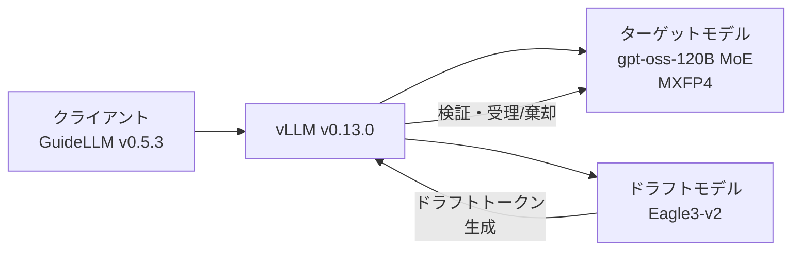

本記事は [Red Hat Developer: Performance improvements with speculative decoding in vLLM for gpt-oss](https://developers.redhat.com/articles/2026/04/16/performance-improvements-speculative-decoding-vllm-gpt-oss) の解説記事です。

## ブログ概要（Summary）

Red HatのHarshith Umesh氏が、vLLM v0.13.0上でEAGLE-3投機的デコーディングをgpt-oss-120B（MoE、MXFP4量子化）に適用し、ShareGPT・MLPerf・SWE-benchの3データセットで体系的にベンチマークした結果を報告している。出力スループットは10-21%向上、ITLは4-18%改善し、200並列リクエストでも性能向上が持続することを実証した。SWE-benchワークロードでは100万出力トークンあたりのコストが$4.41から$3.56へ19.4%削減された。

この記事は [Zenn記事: vLLM Prefix Caching×EAGLE 3.1で社内ボットのTTFTを70%短縮する](https://zenn.dev/0h_n0/articles/9b4970864077dd) の深掘りです。

## 情報源

- **種別**: 企業テックブログ
- **URL**: [https://developers.redhat.com/articles/2026/04/16/performance-improvements-speculative-decoding-vllm-gpt-oss](https://developers.redhat.com/articles/2026/04/16/performance-improvements-speculative-decoding-vllm-gpt-oss)
- **組織**: Red Hat（Harshith Umesh）
- **発表日**: 2026年4月16日（最終更新: 2026年4月20日）

## 技術的背景（Technical Background）

投機的デコーディング（Speculative Decoding）は、LLM推論のトークン生成速度を改善する手法である。基本的な考え方は、小さなドラフトモデルで複数トークンを先行生成し、ターゲットモデルで一括検証することで、自己回帰デコーディングの逐次的なボトルネックを緩和する。

しかし、投機的デコーディングには「低並列度でしか効果がない」という通説が存在する。高並列度ではGPU演算がすでに飽和しているため、ドラフトモデルの追加計算がオーバーヘッドになるという理論的根拠がある。Red Hatの記事では、この通説を大規模ベンチマークで検証し、200並列リクエストでも性能向上が持続することを実証した点が重要な貢献である。

EAGLE-3はドラフトモデルの一種で、ターゲットモデルの隠れ状態を利用して次トークン候補を高速に生成する。従来のEAGLE/EAGLE-2と比較して、MoE（Mixture of Experts）モデルとの親和性が高く、量子化モデルとの組み合わせでも安定した受理率を達成できる。

## 実装アーキテクチャ（Architecture）

### 実験構成

Red Hatの記事では以下の構成でベンチマークを実施している。

**ハードウェア・ソフトウェア**:
- GPU: NVIDIA H200-PCIe-141GB
- 推論エンジン: vLLM v0.13.0
- ベンチマークツール: GuideLLM v0.5.3
- ターゲットモデル: `openai/gpt-oss-120b`（MoEアーキテクチャ、MXFP4量子化）
- ドラフトモデル: `nvidia/gpt-oss-120b-Eagle3-v2`（EAGLE-3方式）

**テンソル並列構成**: TP=1（単一GPU）およびTP=2（2GPU並列）

### ベンチマーク設計

3つのデータセットで異なるワークロード特性をカバーしている。

| データセット | プロンプト数 | 平均プロンプト長 | 中央値 | ワークロード特性 |
|:------------|:-----------|:---------------|:------|:---------------|
| ShareGPT | 600 | 122トークン | 72トークン | マルチターン会話、デコード集約型 |
| MLPerf | 600 | 5,011トークン | 4,593トークン | 企業向け要約タスク |
| SWE-bench | 600 | 556トークン | 355トークン | コード生成ワークロード |

各データセットは100プロンプトずつ6セットに分割し、並列度（1, 5, 25, 50, 100, 200）ごとに重複なく割り当てている。Red Hatの記事では、集約指標として幾何平均を採用し、外れ値やスケール差に頑健な比較を実現していると説明されている。



### 投機的デコーディングのフロー

投機的デコーディングの処理フローを数式で整理する。ドラフトモデル$M_d$がステップ$t$で$K$個のトークン候補$\hat{y}_{t+1}, \ldots, \hat{y}_{t+K}$を生成し、ターゲットモデル$M_T$が一括で検証する。

$$
P_{\text{accept}}(\hat{y}_{t+k}) = \min\left(1, \frac{p_{M_T}(\hat{y}_{t+k} \mid y_{\leq t+k-1})}{p_{M_d}(\hat{y}_{t+k} \mid y_{\leq t+k-1})}\right)
$$

ここで、
- $p_{M_T}$: ターゲットモデルの出力確率分布
- $p_{M_d}$: ドラフトモデルの出力確率分布
- $K$: ドラフトトークン数（Red Hatの実験では2, 3, 4を比較）
- $\hat{y}_{t+k}$: $k$番目のドラフトトークン

受理率が高いほど1回のターゲットモデル実行で複数トークンが確定し、実効スループットが向上する。

## Production Deployment Guide

### AWS実装パターン（コスト最適化重視）

Red Hatの記事で示されたH200上の投機的デコーディング構成をAWSで実現するためのパターンを示す。コスト試算は2026年9月時点のap-northeast-1リージョン料金に基づく概算値であり、実際のコストはトラフィックパターンやバースト使用量により変動する。最新料金はAWS料金計算ツールで確認を推奨する。

**トラフィック量別の推奨構成**:

| 構成 | トラフィック | インフラ | GPU | 月額概算 |
|:-----|:-----------|:--------|:----|:---------|
| Small | ~100 req/日 | SageMaker Serverless + S3 | なし（Bedrock利用） | $50-150 |
| Medium | ~1,000 req/日 | ECS Fargate + vLLM コンテナ | 1x g6e.12xlarge (L40S) | $800-2,000 |
| Large | 10,000+ req/日 | EKS + Karpenter + Spot | 2x p5.48xlarge (H200) | $5,000-15,000 |

**Small構成**: Bedrock上のClaude/Mistralモデルで投機的デコーディング不要のユースケースに対応。月額は従量課金のみ。

**Medium構成**: vLLMコンテナをFargate上で稼働。L40S GPU搭載のg6eインスタンスで小〜中規模モデルの投機的デコーディングを実行。ECS Service Auto Scalingでトラフィックに追従する。

**Large構成**: H200搭載のp5インスタンスをEKS + Karpenterで管理。Spot Instances優先でオンデマンド比最大90%削減を狙う。Red Hatの記事で報告されたTP=2構成を再現可能。

**コスト削減テクニック**:
- Spot Instances: p5.48xlarge Spotで最大70-90%削減
- Reserved Instances: 1年コミットで最大40%削減（GPU系）
- 投機的デコーディング自体が19.4%のコスト削減効果（Red Hatの実測値）
- Prefix Caching: vLLMデフォルト有効、繰り返しプロンプトで追加削減

### Terraformインフラコード

**Small構成（Serverless: Lambda + Bedrock）**:

```hcl
# small_serverless/main.tf
# vLLM投機的デコーディング記事のSmall構成
# Lambda + Bedrock（GPU不要のユースケース向け）

terraform {
  required_version = ">= 1.9"
  required_providers {
    aws = { source = "hashicorp/aws", version = "~> 5.70" }
  }
}

provider "aws" { region = "ap-northeast-1" }

# --- IAM ---
resource "aws_iam_role" "lambda_role" {
  name = "vllm-proxy-lambda-role"
  assume_role_policy = jsonencode({
    Version = "2012-10-17"
    Statement = [{
      Action = "sts:AssumeRole"
      Effect = "Allow"
      Principal = { Service = "lambda.amazonaws.com" }
    }]
  })
}

resource "aws_iam_role_policy" "lambda_bedrock" {
  name = "bedrock-invoke"
  role = aws_iam_role.lambda_role.id
  policy = jsonencode({
    Version = "2012-10-17"
    Statement = [
      {
        Effect   = "Allow"
        Action   = ["bedrock:InvokeModel", "bedrock:InvokeModelWithResponseStream"]
        Resource = "arn:aws:bedrock:ap-northeast-1::foundation-model/*"
      },
      {
        Effect   = "Allow"
        Action   = ["logs:CreateLogGroup", "logs:CreateLogStream", "logs:PutLogEvents"]
        Resource = "arn:aws:logs:*:*:*"
      }
    ]
  })
}

# --- Lambda ---
resource "aws_lambda_function" "inference_proxy" {
  function_name = "vllm-inference-proxy"
  runtime       = "python3.12"
  handler       = "handler.lambda_handler"
  role          = aws_iam_role.lambda_role.arn
  timeout       = 120              # Bedrock応答待ち
  memory_size   = 512              # コスト最適化: 最小限のメモリ
  filename      = "lambda.zip"

  environment {
    variables = {
      MODEL_ID    = "anthropic.claude-sonnet-4-20250514"
      MAX_TOKENS  = "4096"
    }
  }
}

# --- DynamoDB (リクエストログ) ---
resource "aws_dynamodb_table" "request_log" {
  name         = "vllm-request-log"
  billing_mode = "PAY_PER_REQUEST"  # On-Demand: 低トラフィック最適
  hash_key     = "request_id"

  attribute {
    name = "request_id"
    type = "S"
  }

  server_side_encryption { enabled = true }  # KMS暗号化
  point_in_time_recovery { enabled = true }
}

# --- CloudWatch アラーム (コスト監視) ---
resource "aws_cloudwatch_metric_alarm" "lambda_cost" {
  alarm_name          = "vllm-lambda-invocation-spike"
  comparison_operator = "GreaterThanThreshold"
  evaluation_periods  = 1
  metric_name         = "Invocations"
  namespace           = "AWS/Lambda"
  period              = 3600
  statistic           = "Sum"
  threshold           = 500         # 1時間500回超過で通知
  alarm_actions       = []          # SNS ARNを設定
  dimensions = { FunctionName = aws_lambda_function.inference_proxy.function_name }
}
```

**Large構成（Container: EKS + Karpenter + Spot）**:

```hcl
# large_container/main.tf
# vLLM投機的デコーディングのLarge構成
# EKS + Karpenter + Spot Instances (H200)

terraform {
  required_version = ">= 1.9"
  required_providers {
    aws  = { source = "hashicorp/aws", version = "~> 5.70" }
    helm = { source = "hashicorp/helm", version = "~> 2.15" }
  }
}

provider "aws" { region = "ap-northeast-1" }

# --- EKS Cluster ---
module "eks" {
  source          = "terraform-aws-modules/eks/aws"
  version         = "~> 20.0"
  cluster_name    = "vllm-spec-decode"
  cluster_version = "1.31"
  vpc_id          = var.vpc_id
  subnet_ids      = var.private_subnet_ids

  cluster_endpoint_public_access = false  # セキュリティ: プライベートのみ

  eks_managed_node_groups = {
    system = {
      instance_types = ["m7i.large"]
      min_size       = 2
      max_size       = 3
      desired_size   = 2
    }
  }
}

# --- Karpenter (Spot優先GPU AutoScaling) ---
resource "helm_release" "karpenter" {
  name       = "karpenter"
  repository = "oci://public.ecr.aws/karpenter"
  chart      = "karpenter"
  version    = "1.1.0"
  namespace  = "kube-system"

  set { name = "controller.resources.requests.cpu"; value = "500m" }
  set { name = "controller.resources.requests.memory"; value = "512Mi" }
}

# --- Karpenter NodePool (p5 Spot優先) ---
resource "kubectl_manifest" "gpu_nodepool" {
  yaml_body = yamlencode({
    apiVersion = "karpenter.sh/v1"
    kind       = "NodePool"
    metadata   = { name = "gpu-vllm" }
    spec = {
      template = {
        spec = {
          requirements = [
            { key = "node.kubernetes.io/instance-type", operator = "In", values = ["p5.48xlarge"] },
            { key = "karpenter.sh/capacity-type", operator = "In", values = ["spot", "on-demand"] },
          ]
          nodeClassRef = { group = "karpenter.k8s.aws", kind = "EC2NodeClass", name = "gpu" }
        }
      }
      disruption = {
        consolidationPolicy = "WhenEmptyOrUnderutilized"
        consolidateAfter    = "60s"
      }
      limits = { "nvidia.com/gpu" = "8" }  # H200 8枚まで
    }
  })
}

# --- Secrets Manager (モデル設定) ---
resource "aws_secretsmanager_secret" "vllm_config" {
  name                    = "vllm-spec-decode-config"
  recovery_window_in_days = 7
}

resource "aws_secretsmanager_secret_version" "vllm_config" {
  secret_id     = aws_secretsmanager_secret.vllm_config.id
  secret_string = jsonencode({
    target_model = "openai/gpt-oss-120b"
    draft_model  = "nvidia/gpt-oss-120b-Eagle3-v2"
    num_speculative_tokens = 3
    tensor_parallel_size   = 2
  })
}

# --- AWS Budgets (月額アラート) ---
resource "aws_budgets_budget" "gpu_budget" {
  name         = "vllm-gpu-monthly"
  budget_type  = "COST"
  limit_amount = "15000"
  limit_unit   = "USD"
  time_unit    = "MONTHLY"

  notification {
    comparison_operator       = "GREATER_THAN"
    threshold                 = 80
    threshold_type            = "PERCENTAGE"
    notification_type         = "ACTUAL"
    subscriber_email_addresses = ["ops-team@example.com"]
  }
}
```

### 運用・監視設定

**CloudWatch Logs Insights クエリ（コスト異常検知）**:

```
# 1時間あたりのトークン使用量を集計
fields @timestamp, @message
| filter @message like /output_tokens/
| stats sum(output_tokens) as total_output,
        sum(prompt_tokens) as total_input,
        count(*) as request_count
  by bin(1h)
| sort @timestamp desc
```

**CloudWatch Logs Insights クエリ（レイテンシ分析）**:

```
# TTFT・ITL の P95/P99 分析
fields @timestamp, ttft_ms, itl_ms
| stats pct(ttft_ms, 95) as ttft_p95,
        pct(ttft_ms, 99) as ttft_p99,
        pct(itl_ms, 95) as itl_p95,
        pct(itl_ms, 99) as itl_p99,
        avg(itl_ms) as itl_avg
  by bin(5m)
```

**CloudWatch アラーム設定（Python）**:

```python
import boto3
from typing import Any

def create_vllm_alarms(function_name: str, sns_topic_arn: str) -> list[dict[str, Any]]:
    """vLLM推論のCloudWatchアラームを作成する。

    Args:
        function_name: Lambda関数名またはECSサービス名
        sns_topic_arn: 通知先SNSトピックARN

    Returns:
        作成されたアラームのリスト
    """
    cw = boto3.client("cloudwatch", region_name="ap-northeast-1")
    alarms = []

    # トークン使用量スパイク検知
    resp = cw.put_metric_alarm(
        AlarmName=f"{function_name}-token-spike",
        MetricName="OutputTokensPerHour",
        Namespace="VLLMMetrics",
        Statistic="Sum",
        Period=3600,
        EvaluationPeriods=1,
        Threshold=500000,  # 1時間50万トークン超過
        ComparisonOperator="GreaterThanThreshold",
        AlarmActions=[sns_topic_arn],
    )
    alarms.append(resp)
    return alarms
```

**X-Ray トレーシング設定（Python）**:

```python
from aws_xray_sdk.core import xray_recorder, patch_all
from aws_xray_sdk.core.models.subsegment import Subsegment

# boto3 自動計装
patch_all()

def trace_vllm_request(prompt: str, model_id: str) -> Subsegment:
    """vLLMリクエストのX-Rayトレースを記録する。

    Args:
        prompt: 入力プロンプト
        model_id: 使用モデルID

    Returns:
        X-Rayサブセグメント
    """
    subsegment = xray_recorder.begin_subsegment("vllm_inference")
    subsegment.put_annotation("model_id", model_id)
    subsegment.put_metadata("prompt_length", len(prompt))
    subsegment.put_metadata("speculative_decoding", True)
    subsegment.put_metadata("num_draft_tokens", 3)
    return subsegment
```

**Cost Explorer自動レポート（Python）**:

```python
import boto3
from datetime import datetime, timedelta
from typing import Any

def get_daily_gpu_cost_report() -> dict[str, Any]:
    """日次GPU関連コストレポートを取得する。

    Returns:
        サービス別コスト辞書
    """
    ce = boto3.client("ce", region_name="us-east-1")
    end = datetime.utcnow().strftime("%Y-%m-%d")
    start = (datetime.utcnow() - timedelta(days=1)).strftime("%Y-%m-%d")

    response = ce.get_cost_and_usage(
        TimePeriod={"Start": start, "End": end},
        Granularity="DAILY",
        Metrics=["BlendedCost"],
        Filter={
            "Or": [
                {"Dimensions": {"Key": "SERVICE", "Values": ["Amazon Elastic Kubernetes Service"]}},
                {"Dimensions": {"Key": "SERVICE", "Values": ["Amazon EC2"]}},
                {"Dimensions": {"Key": "SERVICE", "Values": ["Amazon SageMaker"]}},
            ]
        },
        GroupBy=[{"Type": "DIMENSION", "Key": "SERVICE"}],
    )

    costs: dict[str, float] = {}
    for group in response["ResultsByTime"][0].get("Groups", []):
        service = group["Keys"][0]
        amount = float(group["Metrics"]["BlendedCost"]["Amount"])
        costs[service] = amount

    total = sum(costs.values())
    if total > 100.0:
        _send_sns_alert(f"GPU日次コスト ${total:.2f} が$100を超過")

    return {"date": start, "costs": costs, "total": total}


def _send_sns_alert(message: str) -> None:
    """SNS経由でコストアラートを送信する。"""
    sns = boto3.client("sns", region_name="ap-northeast-1")
    sns.publish(
        TopicArn="arn:aws:sns:ap-northeast-1:123456789012:cost-alerts",
        Subject="vLLM GPU Cost Alert",
        Message=message,
    )
```

### コスト最適化チェックリスト

**アーキテクチャ選択**:
- [ ] トラフィック量に応じた構成を選択（Small: Serverless / Medium: Hybrid / Large: Container）
- [ ] 投機的デコーディングの有効/無効をワークロード特性で判断（デコード集約型で効果大）

**リソース最適化**:
- [ ] EC2/EKS: Spot Instances優先（p5 Spotで最大70-90%削減）
- [ ] Reserved Instances: GPU系1年コミットで最大40%削減
- [ ] Savings Plans: Compute Savings Plansで柔軟にコスト削減
- [ ] Lambda: メモリサイズ最適化（Power Tuningで測定）
- [ ] EKS: Karpenter consolidationPolicy で未使用ノード自動終了
- [ ] vLLM: TP=2構成でGPUあたりスループット向上を確認

**LLMコスト削減**:
- [ ] 投機的デコーディング有効化（19.4%コスト削減 Red Hat実測値）
- [ ] Prefix Caching有効化（vLLMデフォルトON、繰り返しプロンプトで効果大）
- [ ] ドラフトトークン数を3に設定（2-3がスイートスポット）
- [ ] Bedrock Batch API使用（非リアルタイム処理で50%削減）
- [ ] トークン数制限（max_tokens設定で無駄な生成を抑制）

**監視・アラート**:
- [ ] AWS Budgets: 月額予算アラート設定（80%/100%閾値）
- [ ] CloudWatch: トークン使用量スパイク検知アラーム
- [ ] Cost Anomaly Detection: 自動異常検知有効化
- [ ] 日次コストレポート: Cost Explorer APIで自動取得・SNS通知
- [ ] X-Ray: 推論レイテンシのトレーシング有効化

**リソース管理**:
- [ ] 未使用GPUインスタンス自動停止（Karpenter TTL設定）
- [ ] タグ戦略: `Environment`, `Team`, `CostCenter` タグ必須
- [ ] S3ライフサイクルポリシー: 推論ログ90日でGlacier移行
- [ ] 開発環境: 夜間・週末のGPUノード自動停止（CronJob）
- [ ] ECRイメージ: ライフサイクルポリシーで古いイメージ自動削除

## パフォーマンス最適化（Performance）

### ShareGPTベンチマーク結果

Red Hatの記事では、ShareGPTデータセット（マルチターン会話、デコード集約型）で以下の結果が報告されている。数値は6並列度（1, 5, 25, 50, 100, 200）の幾何平均である。

| 指標 | ベースライン | 投機的デコーディング | 改善率 |
|:-----|:-----------|:-----------------|:------|
| 出力スループット (tok/s) | 970.9 | 1,171.7 | **+20.7%** |
| 総スループット (tok/s) | 1,098.7 | 1,329.0 | +21.0% |
| TTFT P95 (s) | 7.31 | 6.52 | +10.8% |
| ITL P95 (ms) | 13.7 | 12.0 | +12.4% |
| TPOT P95 (ms) | 14.68 | 13.66 | +6.9% |
| リクエストレイテンシ中央値 (s) | 25.8 | 20.6 | +20.3% |

並列度100でのピークスループットは2,574 tok/s（ベースライン2,024 tok/s、+27.2%）に達している。

### MLPerfベンチマーク結果

企業向け要約タスク（平均プロンプト長5,011トークン）では、プロンプト処理（プリフィル）のコストが大きいため、投機的デコーディングの改善幅はShareGPTより控えめとなっている。

**TP=1構成**:

| 指標 | ベースライン | 投機的デコーディング | 改善率 |
|:-----|:-----------|:-----------------|:------|
| 出力スループット (tok/s) | 1,051.0 | 1,150.5 | +9.5% |
| TTFT P95 (s) | 10.17 | 9.10 | +10.5% |
| ITL P95 (ms) | 16.5 | 15.9 | +6.6% |

**TP=2構成**:

| 指標 | ベースライン | 投機的デコーディング | 改善率 |
|:-----|:-----------|:-----------------|:------|
| 出力スループット (tok/s) | 1,500.6 | 1,740.8 | **+16.0%** |
| TTFT P95 (s) | 6.18 | 6.75 | **-9.3%** |
| ITL P95 (ms) | 11.2 | 10.2 | +9.0% |

Red Hatの記事では、TP=2構成でTTFTが9.3%悪化した点について「ドラフトモデルのプリフィル時の追加計算が、TP=2で既に効率的に利用されているGPUリソースと競合するため」と説明されている。

### SWE-benchベンチマーク結果

コード生成ワークロードでは最も高い性能向上が観測されている。

| 指標 | ベースライン | 投機的デコーディング | 改善率 |
|:-----|:-----------|:-----------------|:------|
| 出力スループット (tok/s) | 1,143.87 | 1,377.94 | **+20.5%** |
| TTFT P95 (s) | 14.92 | 14.97 | -0.3% |
| ITL P95 (ms) | 13.63 | 11.24 | **+17.5%** |
| リクエストレイテンシ中央値 (s) | 35.30 | 29.68 | +15.9% |

ピークスループットは並列度100で約3,250 tok/sに到達している。並列度200でもリクエストレイテンシ中央値が約52.5s vs 約63.5s（17%改善）と、性能向上が維持されている。

### ドラフトトークン数の最適化

Red Hatの記事では、ShareGPTデータセットでドラフトトークン数2, 3, 4を比較している。

| ドラフト数 | 受理率 | 平均受理長 | 出力スループット (tok/s) | TTFT P95 (s) | ITL P95 (ms) |
|:----------|:------|:---------|:---------------------|:------------|:------------|
| 2 | 45.4% | 1.91 | 1,160.6 | 6.29 | 11.6 |
| 3 | 35.6% | 2.07 | 1,171.7 | 6.52 | 12.0 |
| 4 | 28.3% | 2.13 | 1,078.4 | 6.70 | 12.9 |

Red Hatの記事では「2または3ドラフトトークンがスイートスポット」と報告されている。3ドラフトは2ドラフトに対してスループットが1.0%上回るが、TTFTは3.6%、ITLは3.3%悪化する。4ドラフトではスループットが8.0%低下し、過剰なドラフト生成のオーバーヘッドが利得を上回っている。プロダクションワークロードでは並列度が高い環境で3ドラフトが優れるため、Red Hatは3ドラフトを採用している。

### コスト分析

Red Hatの記事では、H200インスタンスのコストを$41.62/時間（AWSオンデマンド相当）として、SWE-benchのピーク稼働時（TP=1、並列度100）のコストを算出している。

$$
\text{Cost per 1M output tokens} = \frac{1{,}000{,}000}{\text{OutputTokens/s}} \times \frac{\text{GPUCost/h}}{3600}
$$

| 構成 | 出力スループット | 100万トークンあたりコスト |
|:-----|:---------------|:-----------------------|
| ベースライン | 2,620.89 tok/s | $4.41 |
| 投機的デコーディング | 3,250.07 tok/s | $3.56 |

**削減額: $0.85/1Mトークン（19.4%削減）**。モデル重みの変更や出力品質への影響なしでこの削減を達成している点が重要である。

## 運用での学び（Production Lessons）

### 高並列度での性能持続

Red Hatの記事で最も重要な知見は、200並列リクエストでも投機的デコーディングの性能向上が持続するという実証結果である。従来の通説では「投機的デコーディングは低QPS環境でのみ有効」とされていたが、この結果はその仮定を覆している。

具体的には、ShareGPTで並列度100においてTTFT P95が約10.0s vs 12.3s（18.7%改善）、並列度200でも約13.7s vs 約16.4sと改善が継続している。

### ワークロード互換性

3つのデータセットの結果から、投機的デコーディングの効果はワークロード特性に依存する。

- **デコード集約型**（ShareGPT）: 最大の改善（出力スループット+20.7%）
- **プリフィル集約型**（MLPerf）: 控えめな改善（TP=1で+9.5%）
- **コード生成**（SWE-bench）: 高い改善（出力スループット+20.5%、ITL+17.5%）

### TTFTトレードオフ

TP=2構成のMLPerfでTTFTが9.3%悪化した事例は、投機的デコーディング導入時の重要な注意点である。プリフィルフェーズでのドラフトモデルのGPUリソース競合は、長いプロンプトかつ高いテンソル並列度で顕著になる。TTFTが重要なユースケース（チャットボットの初期応答等）では、TP構成とドラフトトークン数の慎重なチューニングが必要である。

## 学術研究との関連（Academic Connection）

Red Hatの実験で使用されているEAGLE-3は、EAGLE（Li et al., 2024）およびEAGLE-2の後継手法であり、ターゲットモデルの隠れ状態を利用した自己回帰ドラフト生成を行う。元の投機的デコーディング（Leviathan et al., 2023; Chen et al., 2023）がターゲットモデルと独立したドラフトモデルを使用するのに対し、EAGLEファミリーはターゲットモデルの特徴量を共有することで高い受理率を実現する。Red Hatの記事は、これらの手法を実プロダクション規模（200並列、MoEモデル、MXFP4量子化）で検証した産業応用事例として位置付けられる。

## まとめと実践への示唆

Red Hatの記事は、投機的デコーディングが「低並列度専用の最適化」ではなく、プロダクション規模で安定した効果を発揮することを3データセット・6並列度の体系的ベンチマークで実証した。導入時の実践的指針として、ドラフトトークン数は2-3が最適、プリフィル集約型ワークロードでのTTFT悪化に注意、TP=2構成での挙動を事前検証、という3点が挙げられる。モデル変更なしで19.4%のコスト削減を達成できる点は、推論コスト最適化の有力な選択肢となる。

## 参考文献

- **Blog URL**: [https://developers.redhat.com/articles/2026/04/16/performance-improvements-speculative-decoding-vllm-gpt-oss](https://developers.redhat.com/articles/2026/04/16/performance-improvements-speculative-decoding-vllm-gpt-oss)
- **vLLM**: [https://github.com/vllm-project/vllm](https://github.com/vllm-project/vllm)
- **EAGLE**: Li, Y., et al. "EAGLE: Speculative Sampling Requires Rethinking Feature Uncertainty." ICML 2024.
- **Speculative Decoding**: Leviathan, Y., et al. "Fast Inference from Transformers via Speculative Decoding." ICML 2023.
- **GuideLLM**: [https://github.com/neuralmagic/guidellm](https://github.com/neuralmagic/guidellm)
- **Related Zenn article**: [https://zenn.dev/0h_n0/articles/9b4970864077dd](https://zenn.dev/0h_n0/articles/9b4970864077dd)
