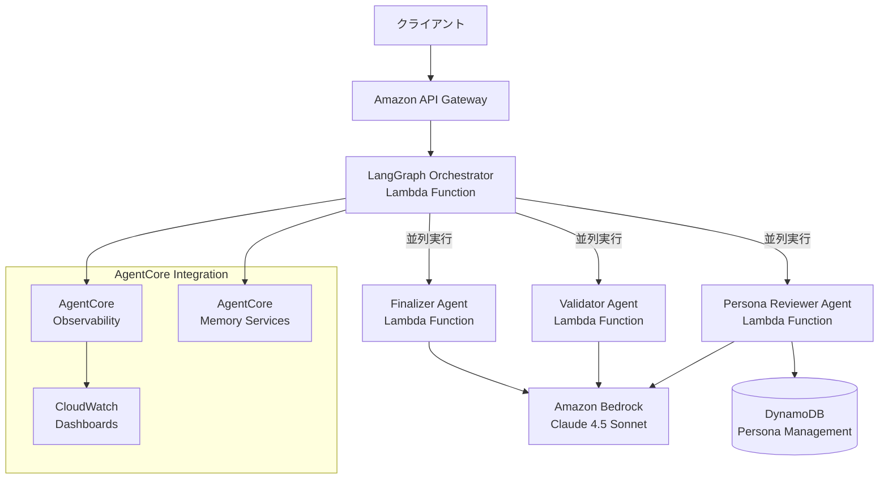
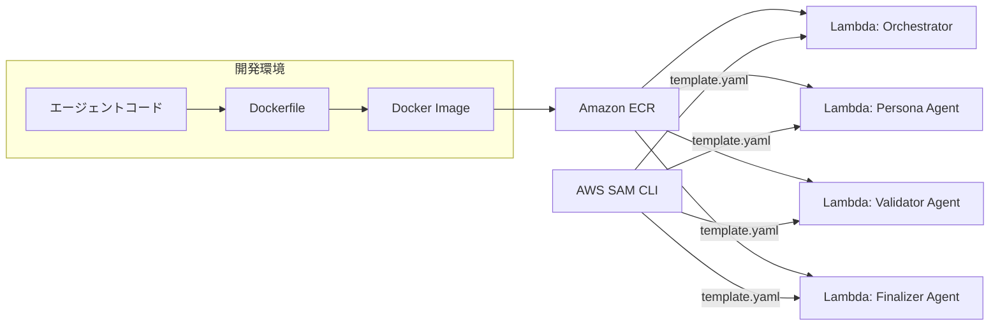

## ブログ概要（Summary）

本記事は [Build highly scalable serverless LangGraph multi-agent systems in AWS with Amazon Bedrock AgentCore](https://aws.amazon.com/blogs/machine-learning/build-highly-scalable-serverless-langgraph-multi-agent-systems-in-aws-with-amazon-bedrock-agentcore/) の解説記事です。

AWSのKanishk Mahajan氏（Principal AI/ML, AWS Professional Services）とAkshay Parkhi氏（ML Engineer, AWS）が2026年5月26日に公開したこのブログでは、LangGraphのグラフベース実行モデルをAWS LambdaとStep Functionsによるサーバーレス基盤上で動作させ、Amazon Bedrock AgentCoreの可観測性・メモリサービスを統合したマルチエージェントアーキテクチャが紹介されている。マーケティングキャンペーンレビューシステムを具体的なユースケースとして、3つの専門エージェントが並列に動作する実装パターンが詳解されている。

この記事は [Zenn記事: LangGraph v1.0ステートマシン設計パターン：条件分岐・並列実行・HILを実装する](https://zenn.dev/0h_n0/articles/bba30ad1314785) の深掘りです。

## 情報源

- **種別**: AWS公式テックブログ（Machine Learning Blog）
- **URL**: [https://aws.amazon.com/blogs/machine-learning/build-highly-scalable-serverless-langgraph-multi-agent-systems-in-aws-with-amazon-bedrock-agentcore/](https://aws.amazon.com/blogs/machine-learning/build-highly-scalable-serverless-langgraph-multi-agent-systems-in-aws-with-amazon-bedrock-agentcore/)
- **組織**: Amazon Web Services（AWS Professional Services / ML Engineering）
- **発表日**: 2026年5月26日
- **著者**: Kanishk Mahajan, Akshay Parkhi

なお、以下で紹介するアーキテクチャパターンはAWSのマネージドサービスを前提としたものであり、他クラウドへの直接的な移植にはサービス固有の差異を考慮する必要がある。

## 技術的背景（Technical Background）

### マルチエージェントシステムのスケーリング課題

LLMベースのマルチエージェントシステムを本番環境で運用する際、単一マシン上でのオーケストレーションには複数の制約がある。エージェント数の増加に伴うメモリ消費の増大、トラフィック急増時のスケーリング遅延、そしてエージェント間の状態管理の複雑化である。

ブログでは、LangGraphの明示的なグラフベース実行モデルがこの課題への解決策として位置づけられている。ブログでは「LangGraph's explicit graph-based execution model enables deterministic coordination, parallelism, and conditional routing between agents」と説明されており、各ノードが離散的なエージェント関数として動作し、エッジが制御フローを定義するステートフルな実行グラフによって、決定論的な協調動作が実現されると述べている。

### サーバーレスとLangGraphの統合が求められる理由

従来のLangGraphデプロイでは、常時稼働のサーバー（EC2インスタンスやECSコンテナ）上でグラフの実行ランタイムを維持する方式が一般的であった。しかし、この方式ではトラフィックがない時間帯にもコンピュートリソースが確保され続け、コスト効率が低下する。特にマルチエージェントシステムでは、各エージェントが独立したLLM呼び出しを行うため、リクエストごとのレイテンシが大きく、同時実行時のリソース競合が発生しやすい。

AWS LambdaとStep Functionsの組み合わせにより、各エージェント関数が独立したLambda関数としてデプロイされ、トラフィックに応じた自動スケーリングが実現される。ブログでは、この構成によりインフラストラクチャの管理負荷を削減しつつ、数百の同時エージェント実行を処理可能なスケーラビリティが得られると説明されている。

### Amazon Bedrock AgentCoreの役割

Amazon Bedrock AgentCoreは、エージェントの運用に必要な可観測性とメモリ管理の機能を提供するマネージドサービスである。ブログでは、AgentCoreが以下の3つの機能をカバーすると説明されている。

1. **可観測性（Observability）**: レイテンシ、トークン使用量、エラーレートのリアルタイム計測
2. **メモリサービス（Memory Services）**: 会話コンテキストの保持と長期知識の蓄積
3. **セッション管理**: 独立したエージェント実行間での状態共有

これらの機能により、開発者はオーケストレーションロジックの実装に集中でき、運用基盤の構築にかかる工数を削減できる。

## 実装アーキテクチャ（Architecture）

### 3コンポーネントアーキテクチャの全体像

ブログで紹介されているアーキテクチャは、LangGraphオーケストレーション・サーバーレスインフラストラクチャ・AgentCore統合の3つのコンポーネントから構成されている。



### ユースケース: マーケティングキャンペーンレビューシステム

ブログでは、マーケティングキャンペーンのコンテンツをレビューする実用的なユースケースが取り上げられている。3つの専門エージェントが並列に動作し、それぞれ異なる観点からコンテンツを評価する。

1. **Persona Reviewer Agent**: 異なるデモグラフィック（年齢層、地域、職業など）の視点からコンテンツの訴求力を分析する。DynamoDBに格納されたペルソナ定義を参照し、各ターゲット層に対するコンテンツの共感度を評価する。
2. **Validator Agent**: 法的要件（広告規制、著作権、プライバシー）およびブランドガイドラインへの準拠を検証する。
3. **Finalizer Agent**: 上記2つのエージェントからのフィードバックを統合し、具体的な改善提案にまとめる。

### ステートフル実行グラフの設計

LangGraphの実行グラフでは、各ノードが1つのエージェント関数を表し、エッジが制御フローを定義する。ブログで示されている設計パターンを擬似コードで表現すると以下の通りである。

```python
from langgraph.graph import StateGraph, START, END
from typing import TypedDict


class CampaignState(TypedDict):
    """キャンペーンレビューの状態定義"""
    campaign_content: str
    persona_feedback: list[dict[str, str]]
    validation_results: dict[str, bool]
    final_recommendations: list[str]


def persona_review(state: CampaignState) -> dict:
    """ペルソナベースのコンテンツ分析（DynamoDB参照）"""
    personas = fetch_personas_from_dynamodb()
    feedback = [
        {"persona": p["name"], "analysis": invoke_bedrock(
            model_id="anthropic.claude-sonnet-4v5-20260514",
            prompt=build_persona_prompt(state["campaign_content"], p),
        )}
        for p in personas
    ]
    return {"persona_feedback": feedback}


def validate_compliance(state: CampaignState) -> dict:
    """法的・ブランドガイドライン準拠チェック"""
    return {"validation_results": invoke_bedrock(
        model_id="anthropic.claude-sonnet-4v5-20260514",
        prompt=build_validation_prompt(state["campaign_content"]),
    )}


# グラフ構築: persona_reviewとvalidate_complianceを並列実行
graph = StateGraph(CampaignState)
graph.add_node("persona_review", persona_review)
graph.add_node("validate_compliance", validate_compliance)
graph.add_node("finalize_review", finalize_review)

graph.add_edge(START, "persona_review")
graph.add_edge(START, "validate_compliance")
graph.add_edge("persona_review", "finalize_review")
graph.add_edge("validate_compliance", "finalize_review")
graph.add_edge("finalize_review", END)

app = graph.compile()
```

このグラフ構造のポイントは、`persona_review`と`validate_compliance`がSTARTノードから同時に実行される点にある。LangGraphは依存関係のないノードを自動的に並列化するため、2つのレビューが独立して進行し、両方の完了後に`finalize_review`が起動する。

### Dockerコンテナ化とデプロイ

ブログでは、各エージェントをDockerコンテナとしてパッケージングし、Lambda関数としてデプロイする方式が採用されている。コンテナ化により、LangGraph（0.3.31）やLangChain（0.2.0+）などの依存ライブラリを含む実行環境を一貫して管理できる。



技術スタックの要件として、ブログではPython 3.11+、Node.js 18.x+、Docker 20.x+、AWS SAM CLI 1.100.0+が挙げられている。

### Amazon API Gatewayによるインターフェース

クライアントからのリクエストはAmazon API Gateway RESTインターフェースを通じてオーケストレーターLambda関数に到達する。API Gatewayはリクエストの認証・認可、レート制限、リクエスト/レスポンス変換を担い、オーケストレーターは受信したペイロードに基づいてLangGraphの実行グラフを開始する。

## 本番デプロイガイド（Production Deployment）

### インフラストラクチャのコード化

ブログで紹介されているアーキテクチャを本番環境にデプロイする際、AWS SAM（Serverless Application Model）テンプレートがインフラストラクチャ定義の中核となる。SAMテンプレートでは、Lambda関数のメモリサイズ、タイムアウト、同時実行数の制限などを宣言的に管理できる。

```yaml
# template.yaml（概念的な構成例）
AWSTemplateFormatVersion: '2010-09-09'
Transform: AWS::Serverless-2016-10-31

Globals:
  Function:
    Runtime: python3.11
    Timeout: 300
    MemorySize: 1024

Resources:
  OrchestratorFunction:
    Type: AWS::Serverless::Function
    Properties:
      PackageType: Image
      ReservedConcurrentExecutions: 100
      Events:
        ApiEvent:
          Type: Api
          Properties:
            Path: /review
            Method: post

  PersonaReviewerFunction:
    Type: AWS::Serverless::Function
    Properties:
      PackageType: Image
      MemorySize: 2048
      Timeout: 600
```

### コスト最適化の設計指針

サーバーレスマルチエージェントシステムのコスト構造は、主にLambda実行時間、Bedrock APIのトークン消費、DynamoDBのリード/ライトユニットの3つから構成される。

**Lambda関数のチューニング**: ブログで示されている構成では、各エージェントがBedrock APIへのリクエストを含むため、Lambda関数のタイムアウトは300〜600秒に設定する必要がある。メモリサイズについては、LangGraphランタイムとPython依存ライブラリの読み込みを考慮して1024MB以上が推奨される。AWS Lambda Power Tuningツールを用いて、メモリサイズとコスト/パフォーマンスの最適なバランスを特定することが望ましい。

**Bedrock APIの使用量管理**: Claude 4.5 Sonnet（`anthropic.claude-sonnet-4v5-20260514`）を利用する場合、入力/出力トークンの価格に基づいてリクエストあたりのコストが決まる。各エージェントが独立してBedrock APIを呼び出すため、並列実行時のトータルトークン消費量は単一エージェント構成の$N$倍（$N$はエージェント数）となる。プロンプトキャッシュの活用やシステムプロンプトの共通化により、入力トークンの重複を削減できる。

**DynamoDB**: ペルソナ管理テーブルにはオンデマンドキャパシティモード（PAY_PER_REQUEST）が適しており、トラフィックパターンに応じた自動スケーリングが行われる。

### CI/CDパイプラインの構築

本番デプロイの自動化には、AWS SAM CLIの`sam build`と`sam deploy`を中心としたパイプラインが有効である。Docker Build、ECRへのPush、ステージングへのSAM Deploy、API Gateway経由の統合テスト、本番デプロイの順に実行し、各エージェントのレスポンス品質とレイテンシを段階的に検証する。

## パフォーマンス最適化（Performance Optimization）

### AgentCore Observabilityによるリアルタイム監視

ブログでは、Amazon Bedrock AgentCoreの可観測性機能を用いたリアルタイム監視が詳しく解説されている。AgentCoreは各エージェント実行のスパン（span）、トレース（trace）、セッション（session）を自動的に収集し、CloudWatch Dashboardsで可視化する。

監視対象として、以下の3つのメトリクスが重要であると説明されている。

1. **レイテンシ（Latency）**: 各エージェントの処理時間を個別に計測。並列実行時のクリティカルパス（最も遅いエージェントの完了時間）がシステム全体のレイテンシを決定する
2. **トークン使用量（Token Usage）**: エージェントごとの入力/出力トークン数。コスト見積もりと異常検知に利用
3. **エラーレート（Error Rates）**: Bedrock API呼び出しの失敗率、Lambda関数のタイムアウト率

### トレーシングの実装パターン

AgentCoreのトレーシング機能は、LangGraphの実行グラフ上の各ノードにスパンを自動付与する。ブログの説明に基づくと、以下のような階層的なトレース構造が生成される。

```
Session: campaign-review-001
└── Trace: review-execution-abc123
    ├── Span: orchestrator (120ms)
    │   ├── Span: persona_review (4,200ms)
    │   │   ├── Span: dynamodb_fetch_personas (45ms)
    │   │   ├── Span: bedrock_invoke_persona1 (1,800ms)
    │   │   └── Span: bedrock_invoke_persona2 (2,100ms)
    │   ├── Span: validate_compliance (3,100ms)
    │   │   └── Span: bedrock_invoke_validation (2,900ms)
    │   └── Span: finalize_review (2,500ms)
    │       └── Span: bedrock_invoke_finalizer (2,300ms)
    └── Total: 6,820ms (並列実行のため合計ではない)
```

このトレース構造から、`persona_review`と`validate_compliance`が並列実行されていることが確認でき、並列実行のクリティカルパスが`persona_review`の4,200msであることが読み取れる。

### CloudWatch Dashboardの構成

ブログでは、CloudWatch Dashboardsを用いた運用モニタリングの構成が示されている。具体的には以下のウィジェットが推奨されている。

- **エージェント別レイテンシのパーセンタイル（p50/p90/p99）**: 各エージェントの応答時間分布を把握し、SLO（Service Level Objective）との乖離を検知する
- **トークン使用量の時系列推移**: 日次・週次のトークン消費傾向を追跡し、コスト予測の精度を向上させる
- **エラーレートのアラーム**: エラーレートが閾値（例: 5%）を超えた場合にSNS経由で通知する

## 運用での学び（Operational Insights）

### 共有メモリパターン

ブログで紹介されている重要な設計パターンの一つが、AgentCoreメモリサービスを用いた独立エージェント間のメモリ共有である。従来のマルチエージェントシステムでは、エージェント間の情報共有にメッセージパッシングやキューイングを用いることが多かった。AgentCoreのメモリサービスは、セッションベースの共有ストアとして機能し、以下の2つのレベルでメモリを管理する。

1. **会話コンテキスト（Conversational Context）**: 現在のセッション内での対話履歴。マルチターン会話において、前回のレビュー結果や修正依頼の内容を保持する
2. **長期知識（Long-term Knowledge）**: セッションを跨いで蓄積される知識。過去のキャンペーンレビュー結果、頻出する問題パターン、ブランドガイドラインの更新履歴などが含まれる

```python
from agentcore import MemoryClient

memory = MemoryClient(session_id="campaign-review-001")

# 長期知識から過去のレビューパターンを取得
historical = memory.retrieve(query="past review insights", memory_type="long_term", top_k=5)

# 現在セッションのコンテキストを取得
session_ctx = memory.retrieve(query="current campaign", memory_type="conversational")

# エージェント実行後にメモリを永続化
memory.store(content=result, memory_type="long_term", metadata={"agent": "persona_reviewer"})
```

### マルチターン会話のサポート

ブログでは、キャンペーンレビューが1回の実行で完結しないケースが想定されている。例えば、最初のレビュー結果に基づいてマーケティング担当者がコンテンツを修正し、再度レビューを依頼するフローである。AgentCoreのメモリサービスが会話コンテキストを保持するため、2回目のレビューでは前回のフィードバックとの差分に焦点を当てた分析が可能になる。

### エラーハンドリングと耐障害性

サーバーレスマルチエージェントシステムでは、以下のエラーパターンへの対処が必要となる。

- **Bedrock APIのスロットリング**: 並列実行時のレート制限対策として、指数バックオフリトライとリザーブドキャパシティの確保が有効である
- **Lambda関数のタイムアウト**: LLM推論は数十秒を要するため、ブログの構成では300秒以上のタイムアウトが設定されている
- **部分的な失敗**: LangGraphの条件分岐で失敗エージェントをスキップし、利用可能な結果のみで最終レポートを生成するフォールバック戦略が有効である

```python
def should_finalize(state: CampaignState) -> str:
    """条件分岐: 部分的な結果でも最終レポートを生成"""
    has_persona = len(state.get("persona_feedback", [])) > 0
    has_validation = state.get("validation_results") is not None

    if has_persona or has_validation:
        return "finalize_review"
    return "error_handler"
```

## 学術研究との関連（Academic Context）

### マルチエージェントオーケストレーション研究

ブログで紹介されているLangGraphの実行グラフモデルは、マルチエージェントシステム（MAS）の古典的な研究、特にContract Net Protocol（Smith, 1980）やBlackboard Architecture（Hayes-Roth, 1985）の現代的な実装と位置づけられる。Contract Net Protocolではタスクの委譲と結果の集約を定式化し、Blackboard Architectureでは共有データ構造を介したエージェント間の協調を定義した。

LangGraphのステートフル実行グラフは、これらの概念をDAG（有向非巡回グラフ）として形式化し、各ノードが独立したLLMエージェントとして機能する。ブログのアーキテクチャでは、StateGraphが共有ブラックボードの役割を担い、各ノードが状態の読み書きを通じて間接的に協調する。

### 可観測性とエージェントの信頼性

AgentCoreの可観測性機能は、LLMエージェントの本番運用における信頼性確保の観点から重要な設計要素である。分散トレーシング（OpenTelemetry互換）をエージェント実行に適用することで、障害の根本原因分析やパフォーマンスのボトルネック特定が可能となる。学術的にはRuntime Verification（実行時検証）の分野で研究されてきた概念が、LLMエージェントの運用基盤に適用されている形と見ることができる。

## まとめと実践への示唆

本ブログでは、LangGraph・AWS Lambda/Step Functions・Amazon Bedrock AgentCoreを組み合わせたスケーラブルなサーバーレスマルチエージェントアーキテクチャが提案されている。その核心は以下の3点に集約される。

1. **グラフベースの決定論的オーケストレーション**: LangGraphのStateGraphにより、エージェント間の制御フローが明示的に定義され、並列実行と条件分岐が宣言的に管理される
2. **サーバーレスによる運用負荷の削減**: Lambda関数へのコンテナデプロイにより、スケーリングとインフラ管理がAWSに委譲される。コスト構造はリクエストベースとなり、アイドル時のリソース消費がゼロになる
3. **AgentCoreによる本番運用基盤**: 可観測性（スパン・トレース・セッション）と共有メモリの統合により、マルチエージェントシステムの本番運用に必要な監視・状態管理基盤が提供される

実践的な導入にあたっては、以下の点を考慮すべきである。

- **コスト見積もり**: 各エージェントが独立してBedrock APIを呼び出すため、エージェント数に比例してトークンコストが増加する。事前にトークン消費量のシミュレーションを行い、予算制約に応じたエージェント数とプロンプト設計を決定する
- **コールドスタートの影響**: Dockerコンテナベースのデプロイでは、Lambda関数のコールドスタート時にコンテナイメージの展開とランタイム初期化が発生する。Provisioned Concurrency（プロビジョニング済み同時実行数）の設定により、レイテンシ要件を満たす構成を検討する
- **段階的な導入**: まず単一エージェントをLambdaにデプロイし、AgentCoreの可観測性を活用してパフォーマンス特性を把握した上で、マルチエージェント構成に拡張する

## 参考文献

1. Kanishk Mahajan, Akshay Parkhi. "Build highly scalable serverless LangGraph multi-agent systems in AWS with Amazon Bedrock AgentCore." AWS Machine Learning Blog, May 26, 2026. [https://aws.amazon.com/blogs/machine-learning/build-highly-scalable-serverless-langgraph-multi-agent-systems-in-aws-with-amazon-bedrock-agentcore/](https://aws.amazon.com/blogs/machine-learning/build-highly-scalable-serverless-langgraph-multi-agent-systems-in-aws-with-amazon-bedrock-agentcore/)
2. LangGraph Documentation. [https://langchain-ai.github.io/langgraph/](https://langchain-ai.github.io/langgraph/)
3. Amazon Bedrock AgentCore Documentation. [https://docs.aws.amazon.com/bedrock/latest/userguide/agents-core.html](https://docs.aws.amazon.com/bedrock/latest/userguide/agents-core.html)
4. Amazon Bedrock - Claude Models. [https://docs.aws.amazon.com/bedrock/latest/userguide/model-parameters-anthropic-claude-messages.html](https://docs.aws.amazon.com/bedrock/latest/userguide/model-parameters-anthropic-claude-messages.html)
5. AWS Lambda Container Image Support. [https://docs.aws.amazon.com/lambda/latest/dg/images-create.html](https://docs.aws.amazon.com/lambda/latest/dg/images-create.html)
6. Smith, R.G. "The Contract Net Protocol: High-Level Communication and Control in a Distributed Problem Solver." IEEE Transactions on Computers, C-29(12), 1980.
7. Hayes-Roth, B. "A Blackboard Architecture for Control." Artificial Intelligence, 26(3), 1985.
