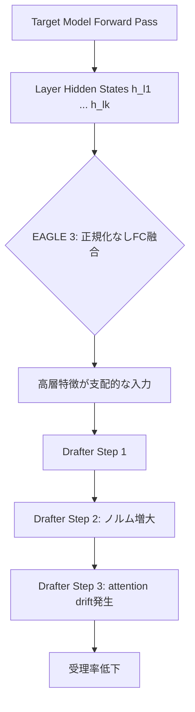
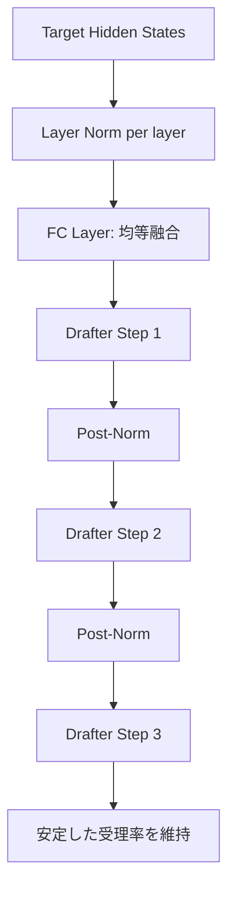

## ブログ概要（Summary）

本記事は [vLLM Blog: EAGLE 3.1](https://vllm.ai/blog/2026-05-26-eagle-3-1) の解説記事です。

vLLMプロジェクトの公式ブログにおいて、EAGLE 3.1が投機的デコーディング（speculative decoding）における「attention drift」問題を解決する2つのアーキテクチャ改善を導入したと報告されている。投機的デコーディングでは、軽量なドラフトモデルが複数トークンを先行生成し、ターゲットモデルが一括検証することで推論を高速化するが、投機の深さが増すにつれてドラフトモデルの注意がsinkトークンから自身の生成トークンへ偏移する問題が生じていた。EAGLE 3.1はFC正規化（FC normalization）とPost-norm隠れ状態フィードバックの2つの手法でこの問題に対処し、長コンテキストワークロードで最大2倍の受理長（acceptance length）改善、GB200上のKimi K2.6でconcurrency 1において2.03倍のスループット向上を達成したと報告されている。

この記事は [Zenn記事: vLLM Prefix Caching×EAGLE 3.1で社内ボットのTTFTを70%短縮する](https://zenn.dev/0h_n0/articles/9b4970864077dd) の深掘りです。Zenn記事ではPrefix CachingとEAGLE 3.1の組み合わせによるTTFT短縮を実践的に解説しているが、本記事ではEAGLE 3.1の内部メカニズム、特にattention drift問題の原因と解決策の技術的詳細に焦点を当てる。

## 情報源

- **種別**: 企業テックブログ（vLLM公式ブログ）
- **URL**: [https://vllm.ai/blog/2026-05-26-eagle-3-1](https://vllm.ai/blog/2026-05-26-eagle-3-1)
- **組織**: vLLM Project（EAGLE Team, vLLM Team, TorchSpec Team, NVIDIA）
- **発表日**: 2026年5月26日

## 技術的背景（Technical Background）

### 投機的デコーディングの概要

投機的デコーディング（speculative decoding）は、自己回帰型LLMの推論高速化手法である。基本的なアイデアは、軽量なドラフトモデル（drafter）が$k$個のトークンを先行生成し、ターゲットモデル（verifier）がそれらを1回のフォワードパスで並列に検証するという分業構造にある。

検証では、ドラフトモデルの出力確率$q(x_t \mid x_{<t})$とターゲットモデルの出力確率$p(x_t \mid x_{<t})$を比較し、以下の受理確率に基づいてトークンを受理または棄却する。

$$
\alpha_t = \min\left(1,\, \frac{p(x_t \mid x_{<t})}{q(x_t \mid x_{<t})}\right)
$$

ここで、$\alpha_t$が受理確率、$p$がターゲットモデルの分布、$q$がドラフトモデルの分布である。連続して受理されるトークン数（受理長, acceptance length）が大きいほど、1回の検証で多くのトークンが確定し、スループットが向上する。

### EAGLEシリーズの進化

EAGLEシリーズは、ターゲットモデルの中間隠れ状態（hidden states）をドラフトモデルの入力に活用する手法である。

- **EAGLE**: ターゲットモデルの最終層隠れ状態を特徴量としてドラフトモデルに入力し、出力トークンの確率分布を高精度に予測する
- **EAGLE-2**: トークンツリー（token tree）の動的構築を導入し、信頼度の高い分岐を優先的に展開することで受理率を向上させた
- **EAGLE-3**: ターゲットモデルの複数層の隠れ状態をFC（fully-connected）層で融合し、より豊富な特徴量をドラフトモデルに提供する設計に拡張した

EAGLE 3では複数層の隠れ状態を融合することで精度を向上させたが、投機の深さが増すと性能が劣化する「attention drift」問題が残っていた。EAGLE 3.1はこの問題に正面から取り組んだ改善版である。

## 実装アーキテクチャ（Architecture）

### Attention Drift問題の定義

ブログでは、attention driftを「投機の深さが増すにつれて、ドラフトモデルがsinkトークンから自身の生成トークンへ注意を移行させる現象」と説明している。sinkトークンとは、シーケンス先頭に位置し、後続の全トークンから高いattentionウェイトを受けるトークンである。自己回帰モデルではsinkトークンへの注意が文脈全体の要約として機能しているが、ドラフトモデルがこの注意パターンを維持できなくなると、生成品質が劣化し受理率が低下する。

この問題には2つの根本原因がある。

**原因1: 融合入力表現の不均衡（Imbalanced Fused Input Representation）**

EAGLE 3では、ターゲットモデルの複数層の隠れ状態をFC層で融合する。しかし、高層の隠れ状態は低層よりも大きなノルムを持つ傾向がある。正規化なしで融合すると、高層の特徴が支配的になり、ドラフトモデルの入力表現が偏る。

ターゲットモデルの各層$l$の隠れ状態を$\mathbf{h}^{(l)} \in \mathbb{R}^{d}$とすると、EAGLE 3のFC融合は以下のように表現できる。

$$
\mathbf{z} = \text{FC}\left(\left[\mathbf{h}^{(l_1)};\, \mathbf{h}^{(l_2)};\, \dots;\, \mathbf{h}^{(l_k)}\right]\right)
$$

ここで、$[\cdot;\cdot]$は連結（concatenation）を表す。$\|\mathbf{h}^{(l_k)}\| \gg \|\mathbf{h}^{(l_1)}\|$の場合、FC層の出力$\mathbf{z}$は高層の特徴に支配され、低層の微細な文脈情報が失われる。

**原因2: 隠れ状態ノルムの増大（Hidden-State Magnitude Growth）**

ドラフトモデルが複数ステップにわたって自身の出力を再帰的にフィードバックする際、残差接続（residual connection）の正規化が不十分だと、隠れ状態のノルムがステップごとに増大する。

$$
\mathbf{h}_{t+1} = \mathbf{h}_t + f(\mathbf{h}_t)
$$

正規化なしの残差パスでは、$\|\mathbf{h}_t\|$がステップ$t$とともに単調増加し得る。ノルムが増大すると、softmaxに入力されるattentionスコアのスケールが変動し、注意分布が不安定になる。



### EAGLE 3.1の解決策

EAGLE 3.1は上記の2つの原因に対し、それぞれ対応する解決策を導入している。

**解決策1: FC正規化（FC Normalization）**

各ターゲット隠れ状態に対し、FC層への入力前に正規化を適用する。ブログでは「FC normalization applied after each target hidden state and before the FC layer」と述べている。

$$
\hat{\mathbf{h}}^{(l)} = \text{Norm}\left(\mathbf{h}^{(l)}\right)
$$

$$
\mathbf{z} = \text{FC}\left(\left[\hat{\mathbf{h}}^{(l_1)};\, \hat{\mathbf{h}}^{(l_2)};\, \dots;\, \hat{\mathbf{h}}^{(l_k)}\right]\right)
$$

ここで、$\text{Norm}$はRMSNormまたはLayerNormである。正規化により各層の隠れ状態が同一スケールに揃えられ、FC層が全層の特徴を均等に学習できるようになる。

**解決策2: Post-norm隠れ状態フィードバック**

ドラフトモデルのデコーディングステップ間で、正規化後の隠れ状態をフィードバックする。ブログでは「Post-norm hidden states fed into the next decoding step」と述べており、この設計について「the post-norm design makes the method behave more like recursively invoking the drafter across decoding steps, rather than simply appending additional layers to the target model」と説明している。

$$
\mathbf{h}_{t+1}^{\text{input}} = \text{Norm}\left(\mathbf{h}_t^{\text{output}}\right)
$$

各デコーディングステップの出力隠れ状態を正規化してから次のステップの入力とすることで、ノルムの増大を抑制し、ステップ間の安定性を維持する。これにより、ドラフトモデルの再帰的な呼び出しが安定化し、深い投機でもattentionパターンが保たれる。



### vLLMでの統合

EAGLE 3.1はvLLMにおいて「config-driven extension of the existing EAGLE 3 implementation」として統合されている。ブログでは、既存のEAGLE 3チェックポイントとの完全な後方互換性が維持されると明記されている。

```bash
# vLLMでのEAGLE 3.1サービング例（ブログより）
vllm serve nvidia/Kimi-K2.6-NVFP4 \
  --trust-remote-code \
  --tensor-parallel-size 4 \
  --speculative-config '{"model":"lightseekorg/kimi-k2.6-eagle3.1-mla","method":"eagle3","num_speculative_tokens":3}'
```

設定変更のポイントは`speculative-config`のJSONオブジェクトであり、ドラフトモデルのパスを`eagle3.1`対応のチェックポイントに差し替えるだけで移行できる。`method`パラメータは`eagle3`のままであり、EAGLE 3.1の正規化ロジックはモデルチェックポイント側の設定で自動的に有効化される。

以下に、Pythonから`AsyncLLMEngine`経由でEAGLE 3.1を利用する場合のコード例を示す。

```python
from vllm import AsyncLLMEngine, AsyncEngineArgs, SamplingParams
from vllm.config import SpeculativeConfig


def create_eagle31_engine(
    model_name: str = "nvidia/Kimi-K2.6-NVFP4",
    drafter_model: str = "lightseekorg/kimi-k2.6-eagle3.1-mla",
    tensor_parallel_size: int = 4,
    num_speculative_tokens: int = 3,
) -> AsyncLLMEngine:
    """EAGLE 3.1を有効化したvLLMエンジンを構築する

    Args:
        model_name: ターゲットモデルのHuggingFace ID
        drafter_model: EAGLE 3.1ドラフトモデルのID
        tensor_parallel_size: テンソル並列数
        num_speculative_tokens: 1ステップあたりの投機トークン数

    Returns:
        AsyncLLMEngine: 投機的デコーディングが有効化されたエンジン
    """
    engine_args = AsyncEngineArgs(
        model=model_name,
        trust_remote_code=True,
        tensor_parallel_size=tensor_parallel_size,
        speculative_config=SpeculativeConfig(
            model=drafter_model,
            method="eagle3",
            num_speculative_tokens=num_speculative_tokens,
        ),
    )
    return AsyncLLMEngine.from_engine_args(engine_args)
```

## Production Deployment Guide

### AWS実装パターン（コスト最適化重視）

EAGLE 3.1によるLLM推論サービングをAWS上で構築する場合のトラフィック量別推奨構成を以下に示す。コスト試算は2026年9月時点のAWS ap-northeast-1（東京）リージョンの料金に基づく概算値であり、実際のコストはトラフィックパターン、モデルサイズ、バースト使用量により変動する。最新料金はAWS料金計算ツールで確認を推奨する。

| 構成 | トラフィック | GPU | 月額コスト | 構成詳細 |
|------|-------------|-----|-----------|---------|
| Small | ~100 req/日 | p4d.24xlarge x1 (Spot) | $3,000-5,000 | ECS Fargate + vLLM コンテナ、夜間停止 |
| Medium | ~1,000 req/日 | p4d.24xlarge x2 | $8,000-12,000 | ECS + ALB + Auto Scaling、予約インスタンス |
| Large | 10,000+ req/日 | p5.48xlarge x4 (EKS) | $25,000-40,000 | EKS + Karpenter + Spot混合、マルチAZ |

EAGLE 3.1を用いるLLM推論はGPUインスタンスが必須であり、Serverless構成（Lambda）は適用外となる。Spot Instancesの活用により最大70%のコスト削減が可能だが、Spotの中断リスクに対してはEKS上のKarpenterによる自動リプレースメントで対処する。

**コスト削減テクニック**:
- **Spot Instances**: GPU Spotは中断リスクがあるが、推論ワークロードはステートレスなため再スケジューリングが容易。p4d Spotで最大70%削減
- **Reserved Instances**: 24時間稼働が必要なMedium/Large構成では、1年コミットで最大40%削減
- **推論バッチング**: vLLMのcontinuous batchingにより、同一GPUで複数リクエストを並列処理しGPU利用率を最大化
- **EAGLE 3.1の効果**: 投機的デコーディングによりスループットが1.66-2.03倍に向上し、同一GPUリソースでより多くのリクエストを処理可能

### Terraformインフラコード

**Small構成（ECS + Spot GPU）**:

```hcl
# ECS + vLLM EAGLE 3.1 推論サービング
# Spot GPU インスタンスによるコスト最適化構成

resource "aws_ecs_cluster" "vllm_inference" {
  name = "vllm-eagle31-inference"

  setting {
    name  = "containerInsights"
    value = "enabled"
  }
}

resource "aws_ecs_cluster_capacity_providers" "gpu_spot" {
  cluster_name       = aws_ecs_cluster.vllm_inference.name
  capacity_providers = [aws_ecs_capacity_provider.gpu_spot.name]

  default_capacity_provider_strategy {
    capacity_provider = aws_ecs_capacity_provider.gpu_spot.name
    weight            = 1
  }
}

resource "aws_launch_template" "gpu_spot" {
  name_prefix   = "vllm-eagle31-"
  image_id      = data.aws_ami.ecs_gpu.id  # ECS GPU最適化AMI
  instance_type = "p4d.24xlarge"

  instance_market_options {
    market_type = "spot"
    spot_options {
      max_price          = "12.00"  # On-Demand $32.77の約37%
      spot_instance_type = "one-time"
    }
  }

  tag_specifications {
    resource_type = "instance"
    tags = {
      Name    = "vllm-eagle31-gpu"
      Project = "llm-inference"
    }
  }
}

# vLLM コンテナタスク定義
resource "aws_ecs_task_definition" "vllm_eagle31" {
  family                   = "vllm-eagle31"
  requires_compatibilities = ["EC2"]
  network_mode             = "awsvpc"

  container_definitions = jsonencode([{
    name  = "vllm-server"
    image = "${aws_ecr_repository.vllm.repository_url}:latest"
    gpuIds = ["0", "1", "2", "3"]  # 4 GPU for tensor parallel

    command = [
      "vllm", "serve", "nvidia/Kimi-K2.6-NVFP4",
      "--trust-remote-code",
      "--tensor-parallel-size", "4",
      "--speculative-config",
      "{\"model\":\"lightseekorg/kimi-k2.6-eagle3.1-mla\",\"method\":\"eagle3\",\"num_speculative_tokens\":3}"
    ]

    portMappings = [{
      containerPort = 8000
      protocol      = "tcp"
    }]

    logConfiguration = {
      logDriver = "awslogs"
      options = {
        "awslogs-group"         = aws_cloudwatch_log_group.vllm.name
        "awslogs-region"        = var.region
        "awslogs-stream-prefix" = "vllm"
      }
    }
  }])
}

# CloudWatch アラーム: GPU使用率低下検知
resource "aws_cloudwatch_metric_alarm" "gpu_utilization_low" {
  alarm_name          = "vllm-eagle31-gpu-underutilized"
  comparison_operator = "LessThanThreshold"
  evaluation_periods  = 3
  metric_name         = "GPUUtilization"
  namespace           = "AWS/ECS"
  period              = 300
  statistic           = "Average"
  threshold           = 20
  alarm_description   = "GPU利用率20%未満が15分継続: スケールダウンまたはインスタンス停止を検討"
  alarm_actions       = [aws_sns_topic.alerts.arn]
}
```

**Large構成（EKS + Karpenter + Spot混合）**:

```hcl
# EKS + Karpenter による自動スケーリングGPU推論基盤

module "eks" {
  source  = "terraform-aws-modules/eks/aws"
  version = "~> 20.0"

  cluster_name    = "vllm-eagle31-production"
  cluster_version = "1.31"

  vpc_id     = module.vpc.vpc_id
  subnet_ids = module.vpc.private_subnets

  cluster_endpoint_public_access = false  # セキュリティ: プライベートのみ

  eks_managed_node_groups = {
    system = {
      instance_types = ["m6i.xlarge"]
      min_size       = 2
      max_size       = 4
      desired_size   = 2
    }
  }
}

# Karpenter: Spot優先GPUノードプロビジョニング
resource "kubectl_manifest" "karpenter_nodepool" {
  yaml_body = yamlencode({
    apiVersion = "karpenter.sh/v1"
    kind       = "NodePool"
    metadata   = { name = "gpu-inference" }
    spec = {
      template = {
        spec = {
          requirements = [
            { key = "node.kubernetes.io/instance-type", operator = "In", values = ["p4d.24xlarge", "p5.48xlarge"] },
            { key = "karpenter.sh/capacity-type", operator = "In", values = ["spot", "on-demand"] },
          ]
          nodeClassRef = { name = "gpu-node" }
        }
      }
      limits   = { cpu = "384", "nvidia.com/gpu" = "32" }
      disruption = {
        consolidationPolicy = "WhenEmptyOrUnderutilized"
        consolidateAfter    = "30s"
      }
    }
  })
}

# AWS Budgets: 月額コスト上限アラート
resource "aws_budgets_budget" "gpu_inference" {
  name         = "vllm-eagle31-monthly"
  budget_type  = "COST"
  limit_amount = "45000"
  limit_unit   = "USD"
  time_unit    = "MONTHLY"

  notification {
    comparison_operator       = "GREATER_THAN"
    threshold                 = 80
    threshold_type            = "PERCENTAGE"
    notification_type         = "ACTUAL"
    subscriber_sns_topic_arns = [aws_sns_topic.budget_alerts.arn]
  }
}
```

### 運用・監視設定

**CloudWatch Logs Insights: 推論レイテンシ分析**:

```
# vLLM推論のP95/P99レイテンシとEAGLE受理長を分析
fields @timestamp, @message
| filter @message like /generation_metrics/
| parse @message '"latency_ms": *,' as latency_ms
| parse @message '"acceptance_length": *,' as acceptance_length
| parse @message '"num_speculative_tokens": *,' as spec_tokens
| stats avg(latency_ms) as avg_latency,
        pct(latency_ms, 95) as p95_latency,
        pct(latency_ms, 99) as p99_latency,
        avg(acceptance_length) as avg_acceptance_len
  by bin(1h)
| sort @timestamp desc
```

**CloudWatch アラーム設定（Python）**:

```python
import boto3


def create_vllm_alarms(
    sns_topic_arn: str,
    cluster_name: str = "vllm-eagle31-inference",
) -> list[str]:
    """vLLM EAGLE 3.1推論サービングの監視アラームを作成する

    Args:
        sns_topic_arn: 通知先SNSトピックのARN
        cluster_name: ECSクラスタ名またはEKSクラスタ名

    Returns:
        list[str]: 作成されたアラームのARNリスト
    """
    cw = boto3.client("cloudwatch", region_name="ap-northeast-1")
    alarm_arns: list[str] = []

    # レイテンシスパイク検知: P99が5秒超過
    cw.put_metric_alarm(
        AlarmName=f"{cluster_name}-latency-p99-spike",
        MetricName="InferenceLatencyP99",
        Namespace="vLLM/Inference",
        Statistic="Maximum",
        Period=300,
        EvaluationPeriods=2,
        Threshold=5000,  # 5秒
        ComparisonOperator="GreaterThanThreshold",
        AlarmActions=[sns_topic_arn],
        AlarmDescription="推論P99レイテンシ5秒超過: EAGLE受理率低下またはGPUメモリ不足の可能性",
    )

    # 受理長低下検知: 平均受理長が1.5未満
    cw.put_metric_alarm(
        AlarmName=f"{cluster_name}-acceptance-length-drop",
        MetricName="AverageAcceptanceLength",
        Namespace="vLLM/Inference",
        Statistic="Average",
        Period=600,
        EvaluationPeriods=3,
        Threshold=1.5,
        ComparisonOperator="LessThanThreshold",
        AlarmActions=[sns_topic_arn],
        AlarmDescription="EAGLE受理長1.5未満: ドラフトモデル品質劣化の兆候",
    )

    return alarm_arns
```

**X-Rayトレーシング設定（Python）**:

```python
from aws_xray_sdk.core import xray_recorder, patch_all


def configure_xray_tracing(service_name: str = "vllm-eagle31") -> None:
    """X-Rayトレーシングを設定しvLLM推論のボトルネックを可視化する

    Args:
        service_name: X-Rayサービス名
    """
    xray_recorder.configure(
        service=service_name,
        sampling=True,
        context_missing="LOG_ERROR",
    )
    patch_all()  # boto3, requests等の自動計装
```

**Cost Explorer日次レポート（Python）**:

```python
import boto3
from datetime import date, timedelta


def get_daily_gpu_cost(
    threshold_usd: float = 1500.0,
    sns_topic_arn: str | None = None,
) -> dict[str, float]:
    """GPU推論の日次コストを取得し閾値超過時にSNS通知する

    Args:
        threshold_usd: 通知閾値（USD/日）
        sns_topic_arn: 通知先SNSトピックARN

    Returns:
        dict[str, float]: サービス別日次コスト
    """
    ce = boto3.client("ce", region_name="us-east-1")
    today = date.today()
    yesterday = today - timedelta(days=1)

    response = ce.get_cost_and_usage(
        TimePeriod={
            "Start": yesterday.isoformat(),
            "End": today.isoformat(),
        },
        Granularity="DAILY",
        Metrics=["UnblendedCost"],
        Filter={
            "Tags": {
                "Key": "Project",
                "Values": ["llm-inference"],
            }
        },
        GroupBy=[{"Type": "DIMENSION", "Key": "SERVICE"}],
    )

    costs: dict[str, float] = {}
    total = 0.0
    for group in response["ResultsByTime"][0]["Groups"]:
        service = group["Keys"][0]
        amount = float(group["Metrics"]["UnblendedCost"]["Amount"])
        costs[service] = amount
        total += amount

    if total > threshold_usd and sns_topic_arn:
        sns = boto3.client("sns", region_name="ap-northeast-1")
        sns.publish(
            TopicArn=sns_topic_arn,
            Subject=f"GPU推論コスト超過: ${total:.2f}/日",
            Message=f"日次GPU推論コスト${total:.2f}が閾値${threshold_usd}を超過。\n詳細: {costs}",
        )

    return costs
```

### コスト最適化チェックリスト

**アーキテクチャ選択**:
- [ ] トラフィック量に応じた構成を選択（Small: ECS Spot / Medium: ECS RI / Large: EKS Karpenter）
- [ ] GPU世代とモデルサイズのマッチング（FP4量子化対応GPUの選定）

**リソース最適化**:
- [ ] Spot Instances優先（推論はステートレスなため中断リスクが低い）
- [ ] Reserved Instances: 24時間稼働ノードは1年コミットで40%削減
- [ ] Savings Plans: EC2 Savings Plansで柔軟なコミットメント
- [ ] 夜間・休日のスケールダウン（CloudWatch Events + Lambda）
- [ ] GPUメモリ使用率に基づくインスタンスサイズ最適化

**LLM推論コスト削減**:
- [ ] EAGLE 3.1有効化による1.66-2.03倍スループット向上
- [ ] `num_speculative_tokens`の最適化（3-5で受理率とオーバーヘッドのバランス）
- [ ] Prefix Caching有効化（Zenn記事参照）によるTTFT削減
- [ ] FP4/FP8量子化によるGPUメモリ削減と小型インスタンスへの移行
- [ ] Continuous batchingの`max_num_seqs`パラメータ調整

**監視・アラート**:
- [ ] AWS Budgets: 月額上限アラート設定
- [ ] CloudWatch: 推論レイテンシP95/P99アラーム
- [ ] EAGLE受理長モニタリング: 受理率低下の早期検知
- [ ] Cost Anomaly Detection: 異常コストの自動検知
- [ ] GPU利用率ダッシュボード: NVIDIA DCGM Exporterの導入

**リソース管理**:
- [ ] 未使用GPUインスタンスの自動検出と削除
- [ ] ECRイメージのライフサイクルポリシー（古いイメージを自動削除）
- [ ] タグ戦略: `Project`, `Environment`, `CostCenter`タグの統一
- [ ] 開発環境の夜間自動停止（EventBridge Scheduler）
- [ ] S3モデルキャッシュのライフサイクルルール設定

## パフォーマンス最適化（Performance）

### ベンチマーク結果

ブログでは、EAGLE 3.1のベンチマーク結果として以下の数値が報告されている。

**受理長（Acceptance Length）の改善**:

ブログでは「EAGLE 3.1 achieves up to 2× longer acceptance length compared with EAGLE 3」と報告されている。特に長コンテキストワークロードにおいて改善が顕著であり、attention drift問題の解決により投機の深さが増しても受理率が維持されるようになった。

**Kimi K2.6でのスループット測定（GB200上）**:

| Concurrency | スループット倍率 | 備考 |
|-------------|-----------------|------|
| 1 | 2.03x | 単一ユーザーの最大改善 |
| 4 | 1.71x | 中程度の並行リクエスト |
| 16 | 1.66x | 高並行リクエスト |

ブログでは、concurrencyが増加するとスループット倍率が低下する傾向が示されている。これは、高concurrencyではGPUのcompute boundが支配的になり、投機的デコーディングによるメモリバンド幅活用の余地が相対的に小さくなるためと考えられる。

**ロバスト性の改善**:

ブログでは、EAGLE 3.1がEAGLE 3と比較して以下のロバスト性改善を達成したと報告されている。

- **訓練から推論への外挿**: 訓練時と異なるプロンプト長・コンテキスト長でも安定した受理率を維持
- **長コンテキストロバスト性**: 長いコンテキストでの性能劣化が大幅に改善
- **チャットテンプレート耐性**: 異なるシステムプロンプトやチャットテンプレートに対して安定
- **環境間の受理長安定性**: 異なるデプロイ環境でも一貫した性能

## 運用での学び（Production Lessons）

### デプロイ上の考慮事項

EAGLE 3.1を本番環境にデプロイする際には、以下の実践的な考慮が必要である。

**ドラフトモデルの選定と管理**: ブログでは、EAGLE 3.1がEAGLE 3チェックポイントとの完全な後方互換性を維持していると述べている。既存のEAGLE 3ドラフトモデルをそのまま利用できるため、移行コストは低い。ただし、EAGLE 3.1専用に訓練されたドラフトモデル（例: `lightseekorg/kimi-k2.6-eagle3.1-mla`）を使用することで、FC正規化とPost-normフィードバックの効果を最大限に引き出せる。

**`num_speculative_tokens`の調整**: 投機トークン数はスループットと計算コストのトレードオフを決定する。ブログの例では3が使用されているが、ワークロードに応じて調整が必要である。値を大きくすると受理時のトークン数は増えるが、棄却時の無駄な計算も増加する。

**TorchSpecによる訓練**: ブログでは、TorchSpecが「efficient training support for EAGLE 3.1 and future speculative decoding algorithms」を提供していると述べている。自社モデル用にカスタムドラフトモデルを訓練する場合、TorchSpecのフレームワークを利用することで訓練オーバーヘッドを削減できる。

**モニタリング指標**: 本番環境では、平均受理長（average acceptance length）が最も重要なモニタリング指標となる。受理長が低下した場合、attention driftの再発（ドラフトモデルの品質劣化）、入力分布の変化（訓練時と異なるドメインのテキスト）、GPUメモリ不足によるバッチサイズ制約などが原因として考えられる。

## 学術研究との関連（Academic Connection）

EAGLE 3.1は、投機的デコーディングの研究系譜の中に位置づけられる。最初のEAGLE（Li et al.）はターゲットモデルの隠れ状態を活用したドラフトモデルの概念を提案し、EAGLE-2はトークンツリーの動的構築による受理率向上を導入した。EAGLE-3は複数層隠れ状態のFC融合で特徴量の質を改善し、EAGLE 3.1は正規化手法によってスケーラビリティの壁を突破した。ブログではこの進化について、単にドラフトモデルの精度を上げるだけでなく、ターゲットモデルとドラフトモデルの表現空間の整合性を維持する方向に研究が進んでいることが示唆されている。Medusa、DistillSpec等の他の投機的デコーディング手法との比較においても、EAGLE系列のhidden state活用アプローチが高い受理率を達成している点が特徴的である。

## まとめと実践への示唆

EAGLE 3.1は、FC正規化とPost-norm隠れ状態フィードバックという2つの正規化手法により、投機的デコーディングのattention drift問題を解決した。ブログでは、長コンテキストでの受理長が最大2倍に改善し、Kimi K2.6上でconcurrency 1において2.03倍のスループット向上が報告されている。vLLMへの統合は設定変更のみで完了し、既存のEAGLE 3チェックポイントとの後方互換性も維持されている。本番導入においては、受理長のモニタリングと`num_speculative_tokens`の調整が重要であり、Zenn記事で解説されているPrefix Cachingとの併用により、TTFTとスループットの両方を改善できる。

## 参考文献

- **Blog URL**: [https://vllm.ai/blog/2026-05-26-eagle-3-1](https://vllm.ai/blog/2026-05-26-eagle-3-1)
- **vLLM GitHub**: [https://github.com/vllm-project/vllm](https://github.com/vllm-project/vllm)
- **TorchSpec**: [https://github.com/vllm-project/torchspec](https://github.com/vllm-project/torchspec)
- **EAGLE Draft Model**: [https://huggingface.co/lightseekorg/kimi-k2.6-eagle3.1-mla](https://huggingface.co/lightseekorg/kimi-k2.6-eagle3.1-mla)
- **Related Zenn article**: [https://zenn.dev/0h_n0/articles/9b4970864077dd](https://zenn.dev/0h_n0/articles/9b4970864077dd)
