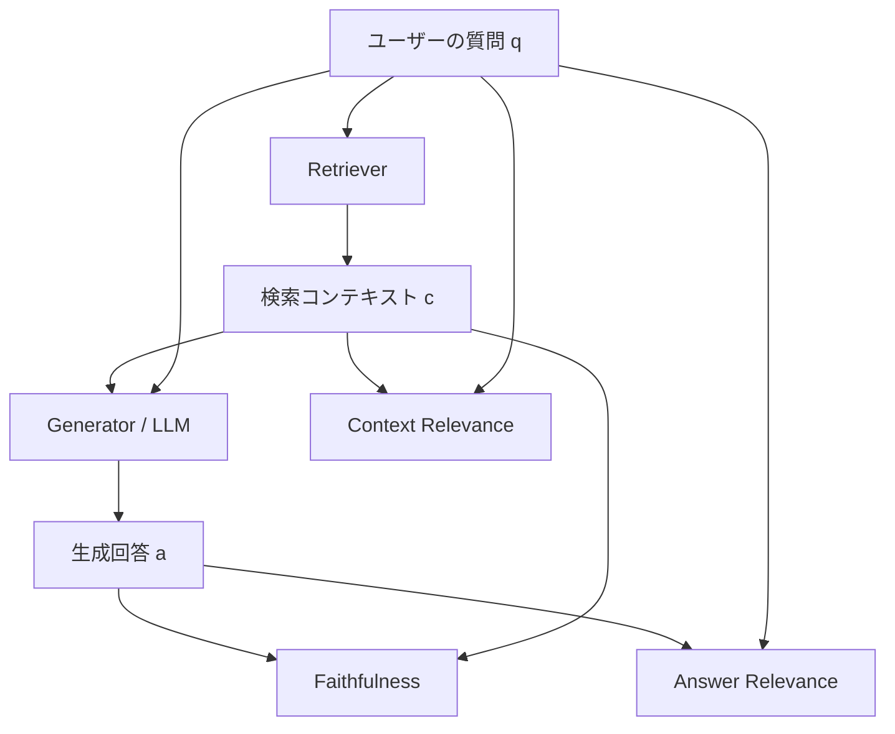
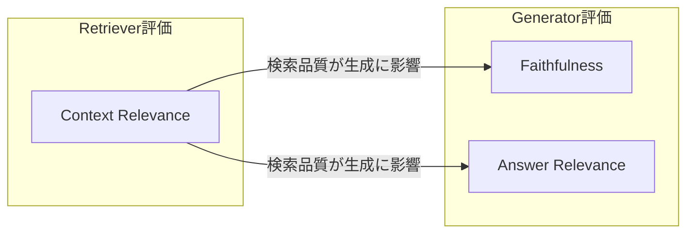

本記事は [RAGAS (arXiv:2309.15217)](https://arxiv.org/abs/2309.15217) の解説記事です。

## 論文概要（Abstract）

Retrieval Augmented Generation（RAG）はLLMの幻覚を抑制し最新情報を活用する手法として広く採用されているが、その評価には人手アノテーションや参照回答の作成が必要とされてきた。著者ら（Shahul Es, Jithin James, Luis Espinosa-Anke, Steven Schockaert）は、参照回答（ground truth）なしにRAGパイプラインを自動評価するフレームワークRAGASを提案している。RAGASはFaithfulness（忠実性）、Answer Relevance（回答関連性）、Context Relevance（文脈関連性）の3指標を定義し、各指標がRAGの異なる次元を評価する。WikiEvalデータセットでの実験により、RAGASの各指標が人手評価と高い相関を示すことが報告されている。本論文はEACL 2024（Demo track）に採択されている。

この記事は [Zenn記事: Arize Phoenix ExperimentsでRAGパイプラインを定量比較し最適化する](https://zenn.dev/0h_n0/articles/7582cd1a835ac4) の深掘りです。

## 情報源

- **arXiv ID**: 2309.15217
- **URL**: [https://arxiv.org/abs/2309.15217](https://arxiv.org/abs/2309.15217)
- **著者**: Shahul Es, Jithin James, Luis Espinosa-Anke, Steven Schockaert
- **発表**: EACL 2024 (Demo track)
- **分野**: Computational Linguistics (cs.CL)
- **GitHub**: [https://github.com/explodinggradients/ragas](https://github.com/explodinggradients/ragas)

## 背景と動機（Background & Motivation）

RAGパイプラインは、ユーザーの質問に対して外部知識ベースから関連文書を検索（Retrieval）し、それをLLMのコンテキストに付与して回答を生成（Generation）する。この構成により、LLM単体で発生するハルシネーションの抑制と、学習データに含まれない最新情報の活用が可能になる。

しかし、RAGパイプラインの品質評価には以下の課題が存在していた。

1. **参照回答の準備コスト**: 従来の評価では人手で正解回答を作成する必要があり、ドメインごとにアノテーションコストが発生する
2. **評価次元の欠如**: BLEUやROUGEのようなn-gramベースの指標では、検索品質と生成品質を分離して評価できない
3. **スケーラビリティの制約**: 人手評価はパイプラインの継続的な改善サイクルに組み込みにくい

著者らは、LLMそのものを評価器として活用し、参照回答なしにRAGの3つの次元（検索の関連性、回答の忠実性、回答の関連性）を独立に定量化するアプローチを提案している。



## 主要な貢献（Key Contributions）

- **貢献1: 参照不要の3指標体系** --- Faithfulness、Answer Relevance、Context Relevanceの3指標を定義し、RAGパイプラインの検索・生成の各段階を独立に評価可能とした。いずれも参照回答を必要としない。
- **貢献2: WikiEvalデータセット** --- Wikipedia記事50ページ（2022年以降のイベント）を基にChatGPTで生成し、二重人手アノテーション（Faithfulnessで95%合意率）で検証された評価用データセットを構築している。
- **貢献3: オープンソースフレームワーク** --- LangChainおよびLlamaIndexと統合可能なPythonライブラリとして公開し、本番環境でのRAG評価パイプライン構築を容易にしている。

## 技術的詳細（Technical Details）

### Faithfulness（忠実性）

Faithfulnessは、生成された回答が検索コンテキストによって支持されているかを測定する指標である。著者らは2段階のプロセスでこれを計算している。

**ステップ1: ステートメント分解**
LLMを用いて生成回答 $a$ を個別のステートメント集合 $S = \{s_1, s_2, \ldots, s_k\}$ に分解する。各 $s_i$ は一つの事実的主張に対応する。

**ステップ2: 検証**
各ステートメント $s_i$ について、検索コンテキスト $c$ によって支持されるか否かをLLMで判定する。支持されたステートメントの集合を $V \subseteq S$ とする。

Faithfulnessスコアは以下の式で計算される。

$$
F = \frac{|V|}{|S|}
$$

ここで $\|V\|$ は検索コンテキストによって支持されたステートメント数、$\|S\|$ はステートメント総数である。$F \in [0, 1]$ であり、1に近いほど回答がコンテキストに忠実であることを示す。

著者らは、WikiEvalデータセットでの人手アノテーションとの一致率（accuracy）が0.95であったと報告している。

### Answer Relevance（回答関連性）

Answer Relevanceは、生成された回答が元の質問に対してどの程度関連しているかを測定する。著者らは逆質問生成（reverse question generation）のアプローチを採用している。

**ステップ1: 逆質問生成**
LLMを用いて生成回答 $a$ から $n$ 個の潜在的な質問 $\{q_1, q_2, \ldots, q_n\}$ を生成する。「この回答が適切な返答となるような質問」を生成するプロンプトが使用される。

**ステップ2: 類似度計算**
元の質問 $q$ と各生成質問 $q_i$ の間でembedding類似度を計算する。著者らはtext-embedding-ada-002を使用している。

Answer Relevanceスコアは以下の式で計算される。

$$
AR = \frac{1}{n} \sum_{i=1}^{n} \mathrm{sim}(q, q_i)
$$

ここで $\mathrm{sim}(q, q_i)$ は質問 $q$ と生成質問 $q_i$ のコサイン類似度である。$n$ は生成する質問の数（デフォルトは3）。$AR \in [0, 1]$ であり、回答が質問に直接関連している場合、逆生成された質問は元の質問に類似するため高スコアとなる。

著者らは人手アノテーションとの一致率が0.78であったと報告している。

### Context Relevance（文脈関連性）

Context Relevanceは、検索されたコンテキストが質問に対してどの程度関連しているかを測定する。これはRetriever（検索器）の品質を評価する指標である。

**ステップ1: 重要文抽出**
LLMに検索コンテキスト $c$ から、質問 $q$ に回答するために不可欠な文のみを抽出させる。抽出された文の集合を $E$ とする。

**ステップ2: 比率計算**

$$
CR = \frac{|E|}{|S_c|}
$$

ここで $\|E\|$ は質問に不可欠と判定された文の数、$\|S_c\|$ は検索コンテキスト中の全文数である。$CR \in [0, 1]$ であり、検索コンテキストに無関係な文が多いほどスコアは低下する。

著者らは人手アノテーションとの一致率が0.70であったと報告している。Faithfulnessに比べて低いのは、「不可欠な文」の判断が主観的であるためと考えられる。

### 3指標の関係性

3つの指標はRAGパイプラインの異なる側面を独立に評価する設計となっている。



- **Context Relevance** はRetrieverの精度を評価する。検索結果にノイズが多いとCRが低下する
- **Faithfulness** はGeneratorがコンテキストに基づいて回答しているかを評価する。ハルシネーション検出に相当する
- **Answer Relevance** はGeneratorが質問に適切に回答しているかを評価する。冗長な回答や的外れな回答でARが低下する

## 実装のポイント（Implementation Guide）

RAGASライブラリを用いた基本的な評価パイプラインの実装を示す。以下のコードは型ヒントとDocstringを含み、本番利用を想定した構成である。

### 基本的な評価実行

```python
from dataclasses import dataclass
from ragas import evaluate
from ragas.metrics import faithfulness, answer_relevancy, context_relevancy
from datasets import Dataset


@dataclass(frozen=True)
class RAGSample:
    """RAG評価用の単一サンプル。

    Attributes:
        question: ユーザーの質問テキスト
        answer: RAGパイプラインが生成した回答テキスト
        contexts: Retrieverが検索した文脈テキストのリスト
    """
    question: str
    answer: str
    contexts: list[str]


def evaluate_rag_pipeline(
    samples: list[RAGSample],
) -> dict[str, float]:
    """RAGパイプラインの品質を3指標で評価する。

    Args:
        samples: 評価対象のRAGサンプルリスト

    Returns:
        各指標名をキー、スコア（0-1）を値とする辞書

    Raises:
        ValueError: samplesが空の場合
    """
    if not samples:
        raise ValueError("samples must not be empty")

    dataset = Dataset.from_dict({
        "question": [s.question for s in samples],
        "answer": [s.answer for s in samples],
        "contexts": [s.contexts for s in samples],
    })

    result = evaluate(
        dataset=dataset,
        metrics=[faithfulness, answer_relevancy, context_relevancy],
    )

    return {
        "faithfulness": result["faithfulness"],
        "answer_relevancy": result["answer_relevancy"],
        "context_relevancy": result["context_relevancy"],
    }
```

### カスタムLLMとEmbeddingの指定

本番環境ではOpenAI以外のLLMやembeddingモデルを使用するケースがある。RAGASはLangChainのLLMインターフェースを介して任意のモデルを指定できる。

```python
from ragas import evaluate
from ragas.metrics import faithfulness, answer_relevancy, context_relevancy
from langchain_openai import AzureChatOpenAI, AzureOpenAIEmbeddings
from datasets import Dataset


def evaluate_with_azure(
    dataset: Dataset,
    deployment_name: str = "gpt-4o",
    embedding_deployment: str = "text-embedding-3-small",
    azure_endpoint: str = "https://your-resource.openai.azure.com/",
) -> dict[str, float]:
    """Azure OpenAIを使用してRAGAS評価を実行する。

    Args:
        dataset: 評価用データセット
        deployment_name: Azure OpenAIのデプロイメント名
        embedding_deployment: Embeddingモデルのデプロイメント名
        azure_endpoint: Azure OpenAIのエンドポイントURL

    Returns:
        各指標名をキー、スコアを値とする辞書
    """
    llm = AzureChatOpenAI(
        azure_deployment=deployment_name,
        azure_endpoint=azure_endpoint,
        api_version="2024-08-01-preview",
        temperature=0.0,
    )

    embeddings = AzureOpenAIEmbeddings(
        azure_deployment=embedding_deployment,
        azure_endpoint=azure_endpoint,
        api_version="2024-08-01-preview",
    )

    result = evaluate(
        dataset=dataset,
        metrics=[faithfulness, answer_relevancy, context_relevancy],
        llm=llm,
        embeddings=embeddings,
    )

    return dict(result)
```

## 本番デプロイメントガイド（Production Deployment Guide）

RAGASを本番環境のRAG評価基盤として運用する際の構成パターンを整理する。以下のコスト試算は2026年9月時点のAWS東京リージョン（ap-northeast-1）の公開料金に基づく参考値であり、実際のコストはリクエストパターンやデータ量に依存する。

### 規模別アーキテクチャ選定

| 規模 | 日次評価件数 | レイテンシ要件 | 推奨構成 | 月額概算 |
|------|------------|--------------|---------|---------|
| Small | ~500 | バッチ（数時間） | Lambda + S3 + EventBridge | $30-100 |
| Medium | ~5,000 | 30分以内 | ECS Fargate + SQS + RDS | $200-600 |
| Large | ~50,000+ | ニアリアルタイム | EKS + Karpenter + Aurora + Kinesis | $1,000-3,500 |

### Small規模: Lambda + S3バッチ評価

小規模なRAG評価ではEventBridgeスケジュールでLambda関数を定期実行し、評価結果をS3に蓄積する構成が適している。RAGASの各指標計算にはLLM呼び出しが必要なため、Lambda のタイムアウトは十分に確保する。

```hcl
# Terraform: Small規模のRAGAS評価基盤

resource "aws_s3_bucket" "eval_results" {
  bucket = "ragas-eval-results-${var.environment}"
}

resource "aws_s3_bucket_lifecycle_configuration" "eval_lifecycle" {
  bucket = aws_s3_bucket.eval_results.id

  rule {
    id     = "archive-old-results"
    status = "Enabled"

    transition {
      days          = 90
      storage_class = "GLACIER_IR"
    }
  }
}

resource "aws_lambda_function" "ragas_evaluator" {
  function_name = "ragas-batch-evaluator"
  runtime       = "python3.12"
  handler       = "handler.lambda_handler"
  timeout       = 900
  memory_size   = 1024

  environment {
    variables = {
      RESULTS_BUCKET   = aws_s3_bucket.eval_results.bucket
      BATCH_SIZE       = "50"
      OPENAI_API_KEY   = data.aws_ssm_parameter.openai_key.value
    }
  }
}

resource "aws_scheduler_schedule" "daily_eval" {
  name       = "ragas-daily-evaluation"
  group_name = "default"

  schedule_expression = "cron(0 15 * * ? *)"

  flexible_time_window {
    mode = "OFF"
  }

  target {
    arn      = aws_lambda_function.ragas_evaluator.arn
    role_arn = aws_iam_role.scheduler_role.arn
  }
}
```

### モニタリング構成

RAGAS評価基盤では、各指標のスコア推移と評価レイテンシを監視する。閾値を下回った場合にアラートを発行し、RAGパイプラインの品質劣化を早期検知する。

```python
import boto3
from datetime import datetime, timezone


cloudwatch = boto3.client("cloudwatch", region_name="ap-northeast-1")


def emit_ragas_metrics(
    pipeline_name: str,
    faithfulness: float,
    answer_relevancy: float,
    context_relevancy: float,
    eval_duration_ms: float,
) -> None:
    """RAGAS評価結果をCloudWatchメトリクスとして送信する。

    Args:
        pipeline_name: RAGパイプライン名（例: "product-search"）
        faithfulness: Faithfulnessスコア（0-1）
        answer_relevancy: Answer Relevancyスコア（0-1）
        context_relevancy: Context Relevancyスコア（0-1）
        eval_duration_ms: 評価にかかった時間（ミリ秒）
    """
    dims = [{"Name": "Pipeline", "Value": pipeline_name}]
    ts = datetime.now(timezone.utc)

    cloudwatch.put_metric_data(
        Namespace="RAGAS/Evaluation",
        MetricData=[
            {"MetricName": "Faithfulness", "Value": faithfulness,
             "Unit": "None", "Dimensions": dims, "Timestamp": ts},
            {"MetricName": "AnswerRelevancy", "Value": answer_relevancy,
             "Unit": "None", "Dimensions": dims, "Timestamp": ts},
            {"MetricName": "ContextRelevancy", "Value": context_relevancy,
             "Unit": "None", "Dimensions": dims, "Timestamp": ts},
            {"MetricName": "EvalDuration", "Value": eval_duration_ms,
             "Unit": "Milliseconds", "Dimensions": dims, "Timestamp": ts},
        ],
    )
```

Faithfulnessが0.7を下回った場合にSNS通知を送るCloudWatchアラームを設定し、品質劣化を早期検知する構成が推奨される。

### コスト最適化チェックリスト

- LLM呼び出し回数の削減: サンプリング評価（全件ではなく日次100件のランダムサンプル）でコストを抑制
- Faithfulness計算のステートメント分解でトークン消費が大きいため、短い回答にはステートメント分解をスキップするロジックを追加
- S3ライフサイクルポリシーで90日経過した評価結果をGlacier IRに移行
- EventBridgeスケジュールをオフピーク時間帯（深夜）に設定しLLM APIの同時実行数を抑制
- DLQの滞留メッセージを監視し、失敗原因（API rate limit等）に応じてバッチサイズを動的調整

## 実験結果（Evaluation）

### WikiEvalデータセット

著者らは評価実験のためにWikiEvalデータセットを構築している。Wikipediaから2022年以降のイベントを扱う50ページを選択し、ChatGPTを用いて質問・回答・コンテキストのトリプレットを生成している。二重の人手アノテーションにより各指標のラベルが付与され、Faithfulnessに関しては95%のアノテーター間合意率が達成されている。

### 既存手法との比較

論文Table 1より、RAGASの各指標と既存のGPTベース評価手法（GPT Score、GPT Ranking）の人手評価との一致率を以下に示す。

| 指標 | RAGAS | GPT Score | GPT Ranking |
|------|-------|-----------|-------------|
| Faithfulness | 0.95 | 0.72 | 0.54 |
| Answer Relevance | 0.78 | 0.52 | 0.40 |
| Context Relevance | 0.70 | 0.63 | 0.52 |

RAGASのFaithfulness指標は0.95の一致率を達成しており、GPT Score（0.72）やGPT Ranking（0.54）を大幅に上回っている。著者らは、ステートメント分解と個別検証の2段階プロセスが、全体的なスコア付けよりも人間の判断プロセスに近いためと分析している。

Answer Relevanceは0.78であり、逆質問生成アプローチがGPT Score（0.52）に対して26ポイントの改善を示している。Context Relevanceは0.70であり、3指標中最も低いが、GPT Score（0.63）やGPT Ranking（0.52）よりは高い値を達成している。

### 指標間の相関

著者らは3指標間の相関も分析しており、FaithfulnessとContext Relevanceの間に正の相関を確認している。検索コンテキストの質が高い場合、生成器が忠実な回答を生成しやすくなるためと解釈できる。一方、Answer Relevanceは他の2指標と比較的独立しており、生成器の質問理解能力にも依存することを示唆している。

## 実運用への応用（Practical Applications）

### Zenn記事との接続

[Zenn記事: Arize Phoenix ExperimentsでRAGパイプラインを定量比較し最適化する](https://zenn.dev/0h_n0/articles/7582cd1a835ac4)ではArize Phoenixを用いたRAGパイプラインの定量比較手法を取り上げている。RAGASはArize Phoenixと組み合わせることで、実験管理（Phoenix）と品質指標（RAGAS）を統合した評価基盤を構築できる。以下の点で相互補完的な関係にある。

**評価指標の標準化**: RAGASの3指標を共通の評価基準として採用し、Arize Phoenixの実験機能でチャンク戦略やembeddingモデルの変更による影響を定量比較できる。

**継続的品質監視**: Arize Phoenixのトレーシング機能と組み合わせ、本番トラフィックからサンプリングしたクエリに対してRAGAS指標を定期計算し、品質劣化を検知するパイプラインが構築できる。

**ボトルネック特定**: Context Relevanceが低い場合はRetrieverの改善（embeddingモデル変更、チャンク戦略見直し）、Faithfulnessが低い場合はGenerator側の改善（プロンプト調整、モデル変更）と、RAGASの指標ごとに改善対象を特定できる。

### RAGパイプライン最適化への活用

RAGASを活用したRAGパイプラインの反復的改善プロセスを以下に示す。

1. **ベースライン計測**: 現行のRAGパイプラインに対して3指標を算出し、改善前の数値を記録する
2. **ボトルネック特定**: 最もスコアの低い指標を特定し、対応するコンポーネント（Retriever or Generator）に改善を集中する
3. **A/Bテスト**: 改善候補（例: チャンクサイズの変更、rerankerの追加）を適用し、同一データセットで再評価する
4. **回帰検知**: 改善が他の指標を悪化させていないかを確認する（例: reranker追加でCRは向上したがFが低下していないか）

## 関連研究（Related Works）

著者らの論文に関連する研究として、以下のアプローチが挙げられる。

**ARES（Saad-Falcon et al., 2023）**: 少量のラベル付きデータとPPIを組み合わせてRAG評価を行うフレームワーク。RAGASが完全に参照不要であるのに対し、ARESは少量の人手ラベルから信頼区間付きの推定を行う。ラベル付きデータが利用可能な場合はARESの方が統計的に頑健である。

**TruLens（2023）**: RAGアプリケーションの評価・トラッキングツール。RAGASと類似した指標を提供するが、LangChain/LlamaIndexとの統合性ではRAGASが先行している。

**G-Eval（Liu et al., 2023）**: LLMを用いたNLG評価フレームワーク。chain-of-thoughtで評価の質を向上させる。RAGASはRAGに特化した指標設計（特にFaithfulnessのステートメント分解）を行っている点で焦点が異なる。

**DeepEval（2024）**: RAGASと同様のmetric体系を持つオープンソース評価フレームワーク。Hallucination Scoreやtoxicity検出も提供するが、RAGASの3指標がデファクト標準として広く参照されている。

## まとめと今後の展望

著者らは参照回答不要のRAG評価フレームワークRAGASを提案し、Faithfulness（0.95）、Answer Relevance（0.78）、Context Relevance（0.70）の各指標が人手評価と高い一致率を示すことをWikiEvalデータセットで確認している。

本論文の限界として、評価にLLMを使用するためLLMの能力に依存する点、WikiEvalが50ページと小規模でドメイン固有タスクでの汎化性能が未検証である点、Context Relevanceの人手一致率（0.70）に改善の余地がある点が挙げられる。

今後の展望として、より小型で高速なLLMを評価器として使用することによるコスト削減、マルチモーダルRAG（画像・表を含む検索）への指標拡張、ドメイン適応型の評価プロンプト設計が実務的に有用な研究方向である。

## 参考文献

1. Shahul Es, Jithin James, Luis Espinosa-Anke, & Steven Schockaert. (2023). Ragas: Automated Evaluation of Retrieval Augmented Generation. arXiv:2309.15217. EACL 2024.
2. RAGAS Documentation. [https://docs.ragas.io/](https://docs.ragas.io/)
3. RAGAS GitHub. [https://github.com/explodinggradients/ragas](https://github.com/explodinggradients/ragas)
4. Saad-Falcon, J., Khattab, O., Potts, C., & Zaharia, M. (2023). ARES: An Automated Evaluation Framework for Retrieval-Augmented Generation Systems. arXiv:2311.09476.
5. Liu, Y., et al. (2023). G-Eval: NLG Evaluation using GPT-4 with Better Human Alignment. arXiv:2303.16634.
6. Lewis, P., et al. (2020). Retrieval-Augmented Generation for Knowledge-Intensive NLP Tasks. NeurIPS 2020. arXiv:2005.11401.
