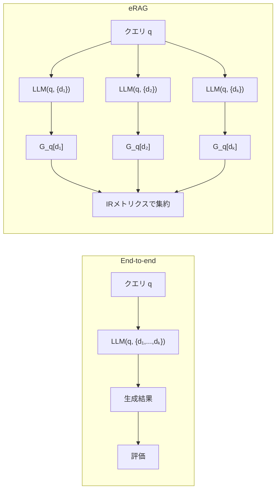

本記事は [eRAG (arXiv:2404.13781)](https://arxiv.org/abs/2404.13781) の解説記事です。

## 論文概要（Abstract）

Retrieval-Augmented Generation（RAG）の検索コンポーネントの品質評価は、従来エンドツーエンド（end-to-end）の方法で行われてきた。すなわち、検索された文書群をすべてLLMに入力し、最終的な生成結果を評価するアプローチである。しかしこの手法は計算コストが高く、大規模な検索評価には適さない。著者らは eRAG（evaluate Retrieval quality in retrieval-Augmented Generation）という新手法を提案している。eRAGは検索結果の各文書を個別にLLMに入力して下流タスクの性能を評価し、その結果を情報検索（IR）メトリクスで集約する。著者らは5つのKILTベンチマークデータセットで実験を行い、eRAGがエンドツーエンド評価と高い相関を示しつつ、GPUメモリ使用量を最大50分の1に削減できることを報告している。

この記事は [Zenn記事: Arize Phoenix ExperimentsでRAGパイプラインを定量比較し最適化する](https://zenn.dev/0h_n0/articles/7582cd1a835ac4) の深掘りです。

## 情報源

- **arXiv ID**: 2404.13781
- **URL**: [https://arxiv.org/abs/2404.13781](https://arxiv.org/abs/2404.13781)
- **著者**: Alireza Salemi, Hamed Zamani
- **発表年**: 2024年4月
- **分野**: Computation and Language (cs.CL), Information Retrieval (cs.IR)

## 背景と動機（Background & Motivation）

RAGシステムでは、検索コンポーネントがユーザーのクエリに関連する文書を外部コーパスから取得し、LLMが取得文書を参照して回答を生成する。このパイプラインにおいて検索品質の評価は極めて重要であるが、既存の評価手法には根本的な課題がある。

第一に、**エンドツーエンド評価の計算コスト**が高い。検索結果のランキングリスト全体をLLMに入力するため、文書数 $k$ に対して計算量が二次的に増大する。著者らはこの計算量を $O(lk^2d^2)$ と示している（$l$ はLLMの層数、$d$ は文書あたりのトークン数）。例えば50文書を入力する場合、T5-smallでも46〜75 GBのGPUメモリを必要とし、実験規模のスケーリングが困難になる。

第二に、**人手アノテーションによる検索評価の限界**がある。KILTベンチマークのProvenance（出典）アノテーションとエンドツーエンドRAG性能の相関を測定した結果、Kendallの $\tau$ はわずか0.181にとどまることが著者らの実験で明らかになっている。これは人手アノテーションがRAGの下流タスク性能を十分に反映しないことを示している。

第三に、**文書間の相互作用の不透明性**がある。エンドツーエンド評価では、個別の文書がどの程度生成品質に寄与しているかを分離できない。この問題により、検索品質の改善方向を特定することが困難になる。

```mermaid
graph TD
    A[RAG検索品質評価の課題] --> B[エンドツーエンド評価:<br/>計算コスト O&#40;lk²d²&#41;]
    A --> C[人手アノテーション:<br/>τ = 0.181の低相関]
    A --> D[文書間相互作用:<br/>個別寄与の分離不可]
    B --> E[eRAG: 文書単位評価]
    C --> E
    D --> E
    E --> F[計算コスト O&#40;lkd²&#41;]
    E --> G[高い相関 τ ≈ 0.5]
    E --> H[文書単位のスコアリング]
```



## 主要な貢献（Key Contributions）

- **貢献1: eRAG評価フレームワークの提案** --- 検索結果の各文書を個別にLLMで評価し、文書単位のスコアをIRメトリクス（Precision、Recall、MAP、MRR、NDCG、Hit Ratio）で集約する手法を提案している。これにより計算量を $O(lk^2d^2)$ から $O(lkd^2)$ に削減し、GPUメモリを最大50分の1に抑えている。
- **貢献2: 人手アノテーションの限界の実証** --- KILTベンチマークのProvenanceアノテーションとRAG性能の相関がKendallの $\tau$ = 0.181にとどまることを示し、「人手アノテーションによる検索品質評価は下流RAG性能とわずかな相関しか持たない」と報告している。
- **貢献3: 多面的なロバスト性検証** --- 文書数（5〜100）、LLMサイズ（60M〜7B）、検索手法（BM25、Contriever）、拡張手法（Stuffing、FiD）にわたるロバスト性を検証し、eRAGが幅広い条件で安定した相関を維持することを示している。

## 技術的詳細（Technical Details）

### eRAGの核心: 文書単位評価

eRAGの中核となるアイデアは、検索されたランキングリスト $\mathbf{R}_k = \{d_1, d_2, \ldots, d_k\}$ の各文書 $d$ を個別にLLMに入力し、下流タスクの性能を評価することにある。形式的には以下のように定義される。

$$
\mathcal{G}_q[d] = \mathcal{EM}(\mathcal{M}(q, \{d\}), y) \quad \forall d \in \mathbf{R}_k
$$

ここで各変数は以下を意味する。

- $\mathcal{M}$: RAGシステムで使用されるLLM
- $q$: ユーザーのクエリ
- $d$: ランキングリスト内の個別文書
- $\mathcal{EM}$: 下流タスクの評価関数（例: Exact Match、F1スコア、ROUGE-L）
- $y$: 期待される正解出力
- $\mathcal{G}_q[d]$: クエリ $q$ に対する文書 $d$ の有用性スコア（0または1の二値）

この定式化により、各文書に対して「その文書のみを参照した場合にLLMが正しい回答を生成できるか」というバイナリの有用性スコアが得られる。

### IRメトリクスによる集約

文書単位のスコア $\mathcal{G}_q[d]$ を得た後、eRAGはこれらのスコアをIRメトリクスで集約する。著者らは以下の6つのメトリクスを検証している。

**Precision@k**: 上位 $k$ 件中の有用文書の割合

$$
\text{Precision@}k = \frac{1}{k} \sum_{i=1}^{k} \mathcal{G}_q[d_i]
$$

**Recall@k**: 全有用文書のうち上位 $k$ 件に含まれる割合

$$
\text{Recall@}k = \frac{\sum_{i=1}^{k} \mathcal{G}_q[d_i]}{\sum_{d \in \mathcal{C}} \mathcal{G}_q[d]}
$$

**NDCG@k**: 順位を考慮した正規化割引累積利得

$$
\text{NDCG@}k = \frac{\text{DCG@}k}{\text{IDCG@}k}, \quad \text{DCG@}k = \sum_{i=1}^{k} \frac{\mathcal{G}_q[d_i]}{\log_2(i+1)}
$$

**MAP（Mean Average Precision）**: 有用文書が出現するたびのPrecisionの平均

$$
\text{MAP} = \frac{1}{|\{d : \mathcal{G}_q[d] = 1\}|} \sum_{i=1}^{k} \mathcal{G}_q[d_i] \cdot \text{Precision@}i
$$

これらに加えてMRR（Mean Reciprocal Rank）とHit Ratioも使用されている。

### 計算量の比較

エンドツーエンド評価とeRAGの計算量の差は、LLMのself-attention機構に起因する。$k$ 文書を同時に入力する場合、入力長は $kd$ トークンとなり、attention計算に $O(k^2d^2)$ が必要になる。一方eRAGでは各文書を個別に処理するため、1回のLLM呼び出しの計算量は $O(d^2)$ であり、$k$ 文書分で $O(kd^2)$ となる。

$$
\text{End-to-end}: O(l \cdot k^2 \cdot d^2) \quad \text{vs} \quad \text{eRAG}: O(l \cdot k \cdot d^2)
$$

ここで $l$ はTransformerの層数である。$k = 50$ の場合、理論上50倍の計算量削減が得られる。



### 拡張手法への対応

著者らは2つのLLM拡張手法に対してeRAGを適用している。

**Stuffing方式**: 全文書を1つのプロンプトに連結してLLMに入力する方式。エンドツーエンドでは $k$ 文書全体を入力するが、eRAGでは各文書を個別に入力する。

**Fusion-in-Decoder（FiD）方式**: 各文書を個別にエンコーダで処理し、デコーダで統合する方式。FiDではエンコーダ側の処理が本来文書単位であるため、eRAGとの親和性が高い。

## 実装のポイント（Implementation Notes）

eRAGの実装は比較的単純であり、既存のRAG評価パイプラインに少ない変更で組み込める。以下にPythonでの実装例を示す。

```python
from typing import Callable

import numpy as np


def evaluate_single_document(
    llm: Callable[[str, str], str],
    eval_fn: Callable[[str, str], bool],
    query: str,
    document: str,
    expected: str,
) -> int:
    """単一文書に対するeRAGスコアを計算する。

    Args:
        llm: クエリと文書を受け取り回答を生成する関数
        eval_fn: 生成結果と期待出力を比較する評価関数
        query: ユーザーのクエリ
        document: 評価対象の文書
        expected: 期待される正解出力

    Returns:
        有用性スコア（1: 有用、0: 非有用）
    """
    generated = llm(query, document)
    return 1 if eval_fn(generated, expected) else 0


def compute_erag_metrics(doc_scores: list[int]) -> dict[str, float]:
    """文書単位スコアからIRメトリクスを計算する。

    Args:
        doc_scores: 各文書の有用性スコアのリスト（ランキング順）

    Returns:
        各IRメトリクスの値を格納した辞書
    """
    scores = np.array(doc_scores)
    n = len(scores)
    total_relevant = max(int(np.sum(scores)), 1)

    precision = float(np.mean(scores))
    recall = float(np.sum(scores) / total_relevant)

    # NDCG@k
    discounts = np.log2(np.arange(2, n + 2))
    dcg = float(np.sum(scores / discounts))
    ideal_scores = np.sort(scores)[::-1]
    idcg = float(np.sum(ideal_scores / discounts))
    ndcg = dcg / idcg if idcg > 0 else 0.0

    # MAP
    precisions_at_i = np.cumsum(scores) / np.arange(1, n + 1)
    map_score = float(np.sum(precisions_at_i * scores) / total_relevant)

    # MRR
    relevant_positions = np.where(scores == 1)[0]
    mrr = float(1.0 / (relevant_positions[0] + 1)) if len(relevant_positions) > 0 else 0.0

    return {"precision": precision, "recall": recall, "ndcg": ndcg, "map": map_score, "mrr": mrr}


def run_erag_evaluation(
    llm: Callable[[str, str], str],
    eval_fn: Callable[[str, str], bool],
    query: str,
    ranked_docs: list[str],
    expected: str,
    k: int = 10,
) -> dict[str, float]:
    """eRAG評価のメインエントリポイント。

    ランキングリストの各文書を個別にLLMで評価し、
    IRメトリクスで集約して返す。
    """
    doc_scores = [
        evaluate_single_document(llm, eval_fn, query, doc, expected)
        for doc in ranked_docs[:k]
    ]
    return compute_erag_metrics(doc_scores)
```

実装上の注意点として、eRAGの文書単位LLM呼び出しは**完全に独立**であるため、バッチ処理や並列化が容易である。著者らは実験でこの特性を活用して評価を効率化していると報告している。

## 本番デプロイメントガイド（Production Deployment Guide）

eRAGをRAGパイプラインの検索品質モニタリングに組み込む際のアーキテクチャパターンを、ワークロード規模別に整理する。以下のコスト試算は2026年9月時点のAWS東京リージョン（ap-northeast-1）の公開料金に基づく参考値であり、実際のコストはリクエストパターンやデータ量に依存する。

### 規模別アーキテクチャ選定

| 規模 | 日次評価クエリ数 | レイテンシ要件 | 推奨構成 | 月額概算 |
|------|----------------|--------------|---------|---------|
| Small | ~500 | 非同期 | Lambda + SQS + DynamoDB | $30-100 |
| Medium | ~5,000 | 準リアルタイム | ECS Fargate + Aurora Serverless | $200-600 |
| Large | ~50,000+ | リアルタイム | EKS + GPU Node + Aurora | $2,000-8,000 |

### Small規模: Lambda + SQS 非同期バッチ

eRAGの文書単位評価は独立した処理であるため、SQSキューを介したLambda並列実行と親和性が高い。各クエリ-文書ペアを1メッセージとしてキューに投入し、Lambda関数がLLM APIを呼び出してスコアを計算する。結果はDynamoDBに蓄積し、別のLambda関数がIRメトリクスの集約を担当する。

```hcl
# Terraform: eRAG評価パイプライン（Small規模）

resource "aws_sqs_queue" "erag_eval_queue" {
  name                       = "erag-doc-evaluation"
  visibility_timeout_seconds = 120

  redrive_policy = jsonencode({
    deadLetterTargetArn = aws_sqs_queue.erag_eval_dlq.arn
    maxReceiveCount     = 3
  })
}

resource "aws_sqs_queue" "erag_eval_dlq" {
  name = "erag-doc-evaluation-dlq"
}

resource "aws_dynamodb_table" "erag_scores" {
  name         = "erag-doc-scores"
  billing_mode = "PAY_PER_REQUEST"
  hash_key     = "query_id"
  range_key    = "doc_rank"

  attribute {
    name = "query_id"
    type = "S"
  }

  attribute {
    name = "doc_rank"
    type = "N"
  }

  ttl {
    attribute_name = "expires_at"
    enabled        = true
  }
}

resource "aws_lambda_function" "erag_evaluator" {
  function_name = "erag-doc-evaluator"
  runtime       = "python3.12"
  handler       = "handler.evaluate_document"
  timeout       = 120
  memory_size   = 256

  environment {
    variables = {
      SCORES_TABLE = aws_dynamodb_table.erag_scores.name
      LLM_MODEL    = "anthropic.claude-sonnet-4-20250514"
      MAX_TOKENS   = "256"
    }
  }
}

resource "aws_lambda_function" "erag_aggregator" {
  function_name = "erag-metrics-aggregator"
  runtime       = "python3.12"
  handler       = "handler.aggregate_metrics"
  timeout       = 30
  memory_size   = 256

  environment {
    variables = {
      SCORES_TABLE  = aws_dynamodb_table.erag_scores.name
      METRICS_TABLE = aws_dynamodb_table.erag_metrics.name
    }
  }
}
```

### Large規模: EKS + GPUノード

大規模評価ではセルフホストLLM（Mistral 7B等）を用いたGPU推論が費用対効果に優れる。eRAGの利点として、各文書単位の推論が短い入力長で済むため、小型GPUインスタンスで十分な処理能力を確保できる。著者らの報告によれば、eRAGではT5-small使用時に約1.5 GBのGPUメモリで処理可能であり、エンドツーエンド評価の46〜75 GBと比較して大幅に削減される。EKSクラスタにg5.xlargeのGPUノードグループ（min 1、max 8）を配置し、Aurora PostgreSQL Serverless v2（0.5〜8.0 ACU）をスコアストアとして構成する。

### モニタリング構成

eRAG評価結果の推移をCloudWatchメトリクスで追跡し、検索品質の劣化を早期検知する。`RAG/EvaluationQuality`名前空間に`eRAG_precision`、`eRAG_ndcg`、`eRAG_map`の3メトリクスを送信し、PipelineとRetrieverをディメンションとして設定する。retriever更新やコーパス追加時にeRAGメトリクスの変動をアラート閾値（例: NDCG低下10%）と比較することで、品質回帰を防止する。

### コスト最適化チェックリスト

本番デプロイ時に確認すべきコスト最適化項目を以下に整理する。

- DynamoDBのTTLで評価完了後のスコアデータを自動削除する（保持期間14-30日）
- eRAGの文書単位呼び出しをバッチ化し、LLM APIのバッチエンドポイントを活用する（Anthropic Batch API等で最大50%のコスト削減）
- 評価用LLMは本番生成用LLMより小型のモデルで代替可能（著者らはT5-small 60Mパラメータでも有効な相関を報告）
- SQSデッドレターキューを監視し、LLM APIのレート制限エラーを検知して自動リトライ間隔を調整する
- CloudWatch Logs保持期間を30日に制限し、長期保存はS3 Glacierに移行する
- GPU推論を採用する場合、Spot Instanceの活用でコストを60-70%削減（eRAGの各評価は独立しているため中断耐性が高い）
- 定常評価と差分評価を使い分ける: コーパス更新時は影響を受けた文書のみ再評価し、全量再評価の頻度を抑える

## 実験結果（Evaluation）

### エンドツーエンド評価との相関

著者らは5つのKILTベンチマークデータセット（NQ、TriviaQA、HotpotQA、FEVER、WoW）を用いて、eRAGとエンドツーエンド評価のKendallの $\tau$ 相関を測定している。BM25検索器を使用した場合の結果は以下の通りである（論文Table 1より）。

| データセット | eRAG（NDCG） | Answer-containingベースライン |
|------------|-------------|--------------------------|
| NQ | 0.492 | 0.349 |
| TriviaQA | 0.474 | 0.298 |
| HotpotQA | 0.610 | 0.359 |
| FEVER | 0.386 | N/A |
| WoW | 0.467 | N/A |

eRAGはすべてのデータセットでanswer-containingベースライン（正解を含む文書かどうかで二値判定する手法）を上回る相関を示している。特にHotpotQAでは $\tau = 0.610$ と高い相関が得られている。これはHotpotQAがマルチホップ推論を要求するタスクであり、「正解文字列を含むか」という単純な基準では推論に必要な文書の有用性を捕捉できないためと著者らは分析している。

### 人手アノテーションとの比較

KILTベンチマークのProvenanceアノテーション（人手で付与された出典情報）に基づく検索評価は、エンドツーエンドRAG性能との相関がKendallの $\tau = 0.181$ にとどまる。著者らはこの結果について「人手アノテーションの使用は下流RAG性能とわずかな相関しか示さない」（"employing human annotations exhibits only a minor correlation with downstream RAG performance"）と述べている。eRAGの $\tau = 0.492$（NQ、BM25）と比較すると、eRAGが人手アノテーションの2.7倍の相関を達成していることがわかる。

### メモリ効率と実行速度

T5-smallとFiD拡張方式、50文書の条件での効率比較は以下の通りである（論文より）。

| データセット | 実行速度向上 | メモリ効率 |
|------------|-----------|----------|
| NQ | 2.6倍 | 15倍 |
| TriviaQA | 2.6倍 | 8.6倍 |
| HotpotQA | 2.6倍 | 9.5倍 |
| FEVER | 3.2倍 | 16.2倍 |
| WoW | 1.2倍 | 7.4倍 |

eRAGは約1.5 GBのGPUメモリで動作し、エンドツーエンド評価の46〜75 GBと比較して大幅なメモリ削減を達成している。この効率性により、単一のコンシューマ向けGPU（例: RTX 4090、24 GB VRAM）でも大規模な検索品質評価が実行可能になる。

### ロバスト性検証

著者らは以下の軸でeRAGのロバスト性を検証している。

- **文書数（5〜100）**: 文書数の変動に対して安定した相関を維持
- **LLMサイズ**: T5-small（60M）、T5-base（220M）、Mistral 7Bの3サイズで検証し、小型モデルでも有効な相関を確認
- **検索手法**: BM25（疎検索）とContriever（密検索）の両方で有効
- **拡張手法**: Stuffing方式とFiD方式の両方に適用可能

## 実運用への応用（Practical Applications）

eRAGの実用的な応用として、以下の3つのシナリオが考えられる。

**1. 検索コンポーネントのA/Bテスト**: RAGパイプラインにおいて検索手法を変更する際（例: BM25からハイブリッド検索への移行）、eRAGを用いて検索品質の変化を定量評価できる。エンドツーエンド評価と異なり低計算コストで実行できるため、開発サイクル内での迅速なイテレーションが可能になる。

**2. 検索品質の継続モニタリング**: 本番RAGシステムにおいて、定期的にサンプルクエリに対するeRAGスコアを計算し、検索品質の経時変化を監視できる。コーパス更新やインデックス再構築後の品質回帰を検知するアラートシステムの構築に適している。

**3. 文書単位の品質診断**: eRAGは各文書の有用性スコアを個別に算出するため、「どの文書が検索品質を下げているか」を特定できる。これにより、コーパスのクリーニングや検索チューニングの方向性を具体的に把握できる。

Zenn記事「[Arize Phoenix ExperimentsでRAGパイプラインを定量比較し最適化する](https://zenn.dev/0h_n0/articles/7582cd1a835ac4)」で扱われているArize Phoenix Experimentsとの組み合わせも有効である。Phoenix Experimentsが提供する実験管理フレームワーク上でeRAGメトリクスを追跡することで、検索品質の変化をエンドツーエンド性能の変化と対比しながら分析できる。

## 関連研究（Related Works）

- **KILT Benchmark** (Petroni et al., 2021): eRAGの主要な評価基盤。5つの知識集約型タスクを統一的に評価するベンチマークであり、Provenanceアノテーションを提供する。eRAGはこのアノテーションの限界を示す実験に使用している。
- **Fusion-in-Decoder (FiD)** (Izacard & Grave, 2021): 各文書を個別にエンコードしデコーダで統合するRAG手法。eRAGの文書単位評価はFiDのエンコーダ処理と構造的に類似しており、FiDベースのRAGシステムとの親和性が高い。
- **ARES** (Saad-Falcon et al., 2024): LLMを判定者としてRAGシステムを評価するフレームワーク。eRAGとの違いは、ARESが生成結果の品質を判定するのに対し、eRAGは検索結果の品質を文書単位で評価する点にある。
- **RAGAS** (Es et al., 2024): RAGパイプラインの各コンポーネントを個別メトリクスで評価するフレームワーク。eRAGが検索品質に特化しているのに対し、RAGASは忠実性・回答関連性・コンテキスト精度を包括的に評価する。

## まとめと今後の展望

eRAGは、RAGシステムの検索品質評価を文書単位に分解することで、計算量を $O(lk^2d^2)$ から $O(lkd^2)$ に削減し、GPUメモリ使用量を最大50分の1に抑える手法である。5つのKILTベンチマークデータセットでエンドツーエンド評価との高い相関（Kendallの $\tau$ 最大0.610）を示しつつ、人手アノテーション（$\tau = 0.181$）を大きく上回る評価精度を達成している。

著者らの実験結果は、LLMサイズ（60M〜7B）、検索手法（BM25、Contriever）、文書数（5〜100）にわたるロバスト性を示しており、eRAGが幅広いRAGシステム構成に適用可能であることを示唆している。特に小型モデル（T5-small）でも有効な相関が得られることから、評価コストをさらに抑制できる可能性がある。

今後の展望として、著者らはマルチホップ推論を要求するタスクにおける文書間の相互作用のモデリング、および生成品質と検索品質の統合的な評価フレームワークの構築を課題として挙げている。

## 参考文献

- Salemi, A., & Zamani, H. (2024). Evaluating Retrieval Quality in Retrieval-Augmented Generation. arXiv:2404.13781.
- Petroni, F., et al. (2021). KILT: a Benchmark for Knowledge Intensive Language Tasks. NAACL 2021.
- Izacard, G., & Grave, E. (2021). Leveraging Passage Retrieval with Generative Models for Open Domain Question Answering. EACL 2021.
- Saad-Falcon, J., et al. (2024). ARES: An Automated Evaluation Framework for Retrieval-Augmented Generation Systems. NAACL 2024.
- Es, S., et al. (2024). RAGAS: Automated Evaluation of Retrieval Augmented Generation. EACL 2024.
