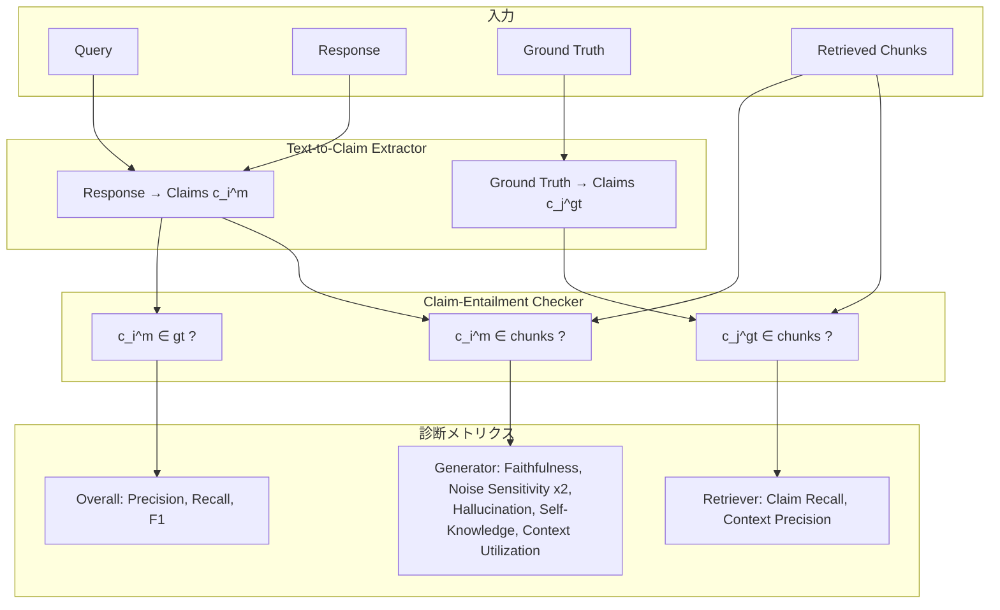

本記事は [RAGChecker (arXiv:2408.08067)](https://arxiv.org/abs/2408.08067) の解説記事です。

## 論文概要（Abstract）

Retrieval-Augmented Generation（RAG）システムの評価は、検索と生成が複合的に絡み合うため従来の単一スコア指標では不十分であった。著者らはクレームレベルの含意チェック（claim-level entailment checking）に基づく細粒度な診断フレームワークRAGCheckerを提案し、Retriever側2指標・Generator側6指標の合計8つのメトリクスでRAGシステムを体系的に評価する手法を示した。10ドメイン・4,162クエリからなるベンチマーク上で8つのRAGシステムを評価し、人間評価との相関（Overall Pearson）61.93を達成したと報告している。これは既存手法RAGAS（48.31）やBERTScore（33.51）を大きく上回る値である。

この記事は [Zenn記事: Arize Phoenix ExperimentsでRAGパイプラインを定量比較し最適化する](https://zenn.dev/0h_n0/articles/7582cd1a835ac4) の深掘りです。

## 情報源

- **会議名**: NeurIPS 2024（The Thirty-Eighth Annual Conference on Neural Information Processing Systems）
- **年**: 2024
- **URL**: [https://arxiv.org/abs/2408.08067](https://arxiv.org/abs/2408.08067)
- **著者**: Dongyu Ru, Lin Qiu, Xiangkun Hu, Tianhang Zhang, Peng Shi, Shuaichen Chang, Cheng Jiayang, Cunxiang Wang, Shichao Sun, Huanyu Li, Zizhao Zhang, Binjie Wang, Jiarong Jiang, Tong He, Zhiguo Wang, Pengfei Liu, Yue Zhang, Zheng Zhang
- **発表形式**: Full paper

## カンファレンス情報

NeurIPSは機械学習分野の最高峰国際会議の一つであり、毎年12月に開催される。2024年の採択率は約25%とされる。RAGの評価手法という実用性の高いテーマがNeurIPSに採択されたことは、RAGシステムの品質保証が学術コミュニティでも重要な研究課題として認識されている証左といえる。

## 背景と動機

RAGシステムは外部知識を検索して言語モデルの生成に組み込むことで、ハルシネーションの低減や知識の最新化を図る手法である。しかし、RAGシステムの評価には以下の課題があった。

1. **単一スコアの不透明性**: BLEU、BERTScore、RAGAS Answer Similarityなどの既存指標は単一のスコアを出力するが、検索の失敗なのか生成の失敗なのかを区別できない
2. **トークンレベル評価の限界**: BLEUやBERTScoreはトークン単位の一致度を測るため、意味的に同等だが表現が異なる回答を低く評価してしまう
3. **モジュール別診断の欠如**: RetrieverとGeneratorの問題点を分離して分析する標準的な枠組みが存在しなかった

著者らはこれらの問題を解決するため、回答をクレーム（atomic proposition）単位に分解し、各クレームの含意関係を検証することで、検索モジュールと生成モジュールの品質を個別に定量評価するフレームワークを設計した。

## 主要な貢献

著者らが主張する本論文の貢献は以下の4点である。

1. **クレームレベル含意チェック**: テキストをatomic propositionに分解し、含意関係で評価する手法の提案
2. **8つの診断メトリクス**: Retriever 2指標 + Generator 6指標による体系的評価フレームワーク
3. **大規模ベンチマーク**: 10ドメイン・4,162クエリで8つのRAGシステムを診断
4. **メタ評価**: 人間評価との相関で既存手法を上回ることを実証

## 技術的詳細（Technical Details）

### アーキテクチャ概要

RAGCheckerのパイプラインは、大きく2つのコンポーネントで構成される。



### Text-to-Claim Extractor

まず回答テキストとGround Truthをそれぞれatomic proposition（クレーム）に分解する。ここでatomic propositionとは、それ以上分解できない単一の事実主張を指す。例えば「PythonはGuido van Rossumが1991年に開発した汎用プログラミング言語である」は以下の3クレームに分解される。

- $c_1$: PythonはGuido van Rossumが開発した
- $c_2$: Pythonは1991年に開発された
- $c_3$: Pythonは汎用プログラミング言語である

著者らはこの分解にLLMを使用し、プロンプトで「各クレームは文脈なしに独立して理解可能であること」を要求している。

### Claim-Entailment Checker

各クレーム $c$ がテキスト $T$ に含意されるか（$c \in T$）をNLI（Natural Language Inference）ベースで判定する。著者らはLLMを用いたentailmentチェッカーを採用し、テキスト$T$がクレーム$c$をサポートするかを3値（entailed / contradicted / neutral）で判定する。

### Overall Metrics

モデル回答のクレーム集合を $\{c_i^{(m)}\}$、Ground Truthのクレーム集合を $\{c_j^{(gt)}\}$ とする。

**Precision**（回答の正確さ）:

$$
\text{Precision} = \frac{|\{c_i^{(m)} \mid c_i^{(m)} \in gt\}|}{|\{c_i^{(m)}\}|}
$$

ここで $c_i^{(m)} \in gt$ は、モデル回答のクレーム $c_i^{(m)}$ がGround Truth全体に含意される（entailed）ことを意味する。

**Recall**（回答の網羅性）:

$$
\text{Recall} = \frac{|\{c_j^{(gt)} \mid c_j^{(gt)} \in m\}|}{|\{c_j^{(gt)}\}|}
$$

**F1**:

$$
F_1 = 2 \cdot \frac{\text{Precision} \times \text{Recall}}{\text{Precision} + \text{Recall}}
$$

### Retriever Metrics

検索チャンク集合を $\{chunk_j\}$ とする。

**Claim Recall**（検索されたチャンクがGround Truthのクレームをどの程度カバーするか）:

$$
\text{Claim Recall} = \frac{|\{c_j^{(gt)} \mid c_j^{(gt)} \in \{chunk_k\}\}|}{|\{c_j^{(gt)}\}|}
$$

**Context Precision**（検索チャンクのうち関連チャンクの割合）:

$$
\text{Context Precision} = \frac{|\{chunk_k \mid \exists c_j^{(gt)},\ c_j^{(gt)} \in chunk_k\}|}{|\{chunk_k\}|}
$$

### Generator Metrics（6指標）

Generator側の6指標は、モデル回答のクレームを3つのカテゴリに分類することで定義される。

モデル回答のクレーム $c_i^{(m)}$ について、
- **Faithful relevant claim**: $c_i^{(m)} \in gt$ かつ $c_i^{(m)} \in \{chunk_j\}$（Ground Truthに含意され、チャンクにも含意される）
- **Faithful irrelevant claim**: $c_i^{(m)} \notin gt$ かつ $c_i^{(m)} \in \{chunk_j\}$（Ground Truthに含意されないが、チャンクには含意される＝ノイズに影響された回答）
- **Unfaithful claim**: $c_i^{(m)} \notin \{chunk_j\}$（チャンクに含意されない＝モデルが独自に生成した主張）

これらの分類に基づき、以下の6指標が定義される。

**1. Faithfulness（忠実性）**: 回答がチャンクに基づいているか

$$
\text{Faithfulness} = \frac{|\{c_i^{(m)} \mid c_i^{(m)} \in \{chunk_j\}\}|}{|\{c_i^{(m)}\}|}
$$

**2. Relevant Noise Sensitivity（関連ノイズ感度）**: 関連チャンク中の不要情報に引きずられる度合い

$$
\text{Rel. Noise Sens.} = \frac{|\{c_i^{(m)} \mid c_i^{(m)} \notin gt \land c_i^{(m)} \in \{chunk_k^{(rel)}\}\}|}{|\{c_i^{(m)}\}|}
$$

ここで $\{chunk_k^{(rel)}\}$ はGround Truthの少なくとも1つのクレームを含意する関連チャンク集合を表す。

**3. Irrelevant Noise Sensitivity（非関連ノイズ感度）**: 非関連チャンクの情報を取り込む度合い

$$
\text{Irrel. Noise Sens.} = \frac{|\{c_i^{(m)} \mid c_i^{(m)} \notin gt \land c_i^{(m)} \in \{chunk_k^{(irrel)}\}\}|}{|\{c_i^{(m)}\}|}
$$

**4. Hallucination（幻覚）**: チャンクにもGround Truthにも根拠がない主張の割合

$$
\text{Hallucination} = \frac{|\{c_i^{(m)} \mid c_i^{(m)} \notin gt \land c_i^{(m)} \notin \{chunk_j\}\}|}{|\{c_i^{(m)}\}|}
$$

**5. Self-Knowledge（自己知識）**: モデルの内部知識から正しいクレームを生成する度合い

$$
\text{Self-Knowledge} = \frac{|\{c_i^{(m)} \mid c_i^{(m)} \in gt \land c_i^{(m)} \notin \{chunk_j\}\}|}{|\{c_i^{(m)}\}|}
$$

**6. Context Utilization（文脈活用度）**: チャンクに含まれる正しい情報をどの程度活用したか

$$
\text{Context Util.} = \frac{|\{c_j^{(gt)} \mid c_j^{(gt)} \in m \land c_j^{(gt)} \in \{chunk_k\}\}|}{|\{c_j^{(gt)} \mid c_j^{(gt)} \in \{chunk_k\}\}|}
$$

### 指標間の関係

これら8指標は互いに独立ではなく、以下の恒等式が成立する（論文Section 3.4より）。

$$
1 - \text{Precision} = \text{Rel. Noise Sens.} + \text{Irrel. Noise Sens.} + \text{Hallucination}
$$

すなわち、Precisionの残余（不正確なクレームの割合）は、関連ノイズ・非関連ノイズ・幻覚の3つに分解される。この性質によりPrecisionが低い場合に何が原因かを即座に特定できる。

## 実装のポイント

### クレーム抽出器の実装例

以下はRAGCheckerのクレーム抽出ステップを簡略化した実装例である。

```python
from dataclasses import dataclass
from typing import Literal

from openai import OpenAI


@dataclass(frozen=True)
class Claim:
    """テキストから抽出されたatomic proposition。"""

    text: str
    source: Literal["response", "ground_truth"]


@dataclass(frozen=True)
class EntailmentResult:
    """含意チェックの結果。"""

    claim: Claim
    label: Literal["entailed", "contradicted", "neutral"]
    confidence: float


def extract_claims(
    text: str,
    source: Literal["response", "ground_truth"],
    client: OpenAI,
    model: str = "gpt-4o",
) -> list[Claim]:
    """テキストをatomic propositionsに分解する。

    Args:
        text: 分解対象のテキスト
        source: テキストの出所（response or ground_truth）
        client: OpenAI APIクライアント
        model: 使用するモデル名

    Returns:
        Claimオブジェクトのリスト
    """
    prompt = (
        "以下のテキストを、それぞれが独立して理解できる"
        "atomic proposition（単一の事実主張）に分解してください。\n"
        "各クレームは1行に1つ出力してください。\n\n"
        f"テキスト:\n{text}"
    )
    response = client.chat.completions.create(
        model=model,
        messages=[{"role": "user", "content": prompt}],
        temperature=0.0,
    )
    lines = response.choices[0].message.content.strip().split("\n")
    return [
        Claim(text=line.strip("- ").strip(), source=source)
        for line in lines
        if line.strip()
    ]


def check_entailment(
    claim: Claim,
    context: str,
    client: OpenAI,
    model: str = "gpt-4o",
) -> EntailmentResult:
    """クレームがコンテキストに含意されるか判定する。

    Args:
        claim: 判定対象のクレーム
        context: 含意を検証するコンテキスト
        client: OpenAI APIクライアント
        model: 使用するモデル名

    Returns:
        EntailmentResult（label, confidence）
    """
    prompt = (
        "以下のコンテキストが、クレームを支持（entailed）するか、"
        "矛盾（contradicted）するか、どちらでもない（neutral）か判定してください。\n"
        "回答は entailed / contradicted / neutral のいずれか1語で。\n\n"
        f"コンテキスト:\n{context}\n\n"
        f"クレーム:\n{claim.text}"
    )
    response = client.chat.completions.create(
        model=model,
        messages=[{"role": "user", "content": prompt}],
        temperature=0.0,
        logprobs=True,
        top_logprobs=3,
    )
    label_text = response.choices[0].message.content.strip().lower()
    if label_text not in ("entailed", "contradicted", "neutral"):
        label_text = "neutral"
    top_logprob = response.choices[0].logprobs.content[0].logprob
    import math

    confidence = math.exp(top_logprob)
    return EntailmentResult(
        claim=claim,
        label=label_text,  # type: ignore[arg-type]
        confidence=confidence,
    )
```

### メトリクス計算の実装例

```python
from dataclasses import dataclass


@dataclass(frozen=True)
class RAGCheckerMetrics:
    """RAGCheckerの全メトリクスを格納するデータクラス。"""

    precision: float
    recall: float
    f1: float
    claim_recall: float
    context_precision: float
    faithfulness: float
    relevant_noise_sensitivity: float
    irrelevant_noise_sensitivity: float
    hallucination: float
    self_knowledge: float
    context_utilization: float


def compute_metrics(
    response_claims_in_gt: list[bool],
    response_claims_in_chunks: list[bool],
    gt_claims_in_response: list[bool],
    gt_claims_in_chunks: list[bool],
    chunk_has_gt_claim: list[bool],
    response_claims_in_rel_chunks: list[bool],
    response_claims_in_irrel_chunks: list[bool],
) -> RAGCheckerMetrics:
    """RAGCheckerの8指標を計算する。

    Args:
        response_claims_in_gt: 各回答クレームがGTに含意されるか
        response_claims_in_chunks: 各回答クレームがチャンクに含意されるか
        gt_claims_in_response: 各GTクレームが回答に含意されるか
        gt_claims_in_chunks: 各GTクレームがチャンクに含意されるか
        chunk_has_gt_claim: 各チャンクがGTクレームを含むか
        response_claims_in_rel_chunks: 各回答クレームが関連チャンクに含意されるか
        response_claims_in_irrel_chunks: 各回答クレームが非関連チャンクに含意されるか

    Returns:
        RAGCheckerMetrics
    """
    n_resp = len(response_claims_in_gt)
    n_gt = len(gt_claims_in_response)
    n_chunks = len(chunk_has_gt_claim)

    precision = sum(response_claims_in_gt) / n_resp if n_resp else 0.0
    recall = sum(gt_claims_in_response) / n_gt if n_gt else 0.0
    f1 = (
        2 * precision * recall / (precision + recall)
        if (precision + recall) > 0
        else 0.0
    )
    claim_recall = sum(gt_claims_in_chunks) / n_gt if n_gt else 0.0
    context_precision = sum(chunk_has_gt_claim) / n_chunks if n_chunks else 0.0
    faithfulness = sum(response_claims_in_chunks) / n_resp if n_resp else 0.0

    # not in GT and in relevant chunks
    rel_noise = sum(
        (not in_gt) and in_rel
        for in_gt, in_rel in zip(
            response_claims_in_gt, response_claims_in_rel_chunks
        )
    )
    relevant_noise_sensitivity = rel_noise / n_resp if n_resp else 0.0

    # not in GT and in irrelevant chunks
    irrel_noise = sum(
        (not in_gt) and in_irrel
        for in_gt, in_irrel in zip(
            response_claims_in_gt, response_claims_in_irrel_chunks
        )
    )
    irrelevant_noise_sensitivity = irrel_noise / n_resp if n_resp else 0.0

    # not in GT and not in any chunk
    hallucination_count = sum(
        (not in_gt) and (not in_chunk)
        for in_gt, in_chunk in zip(
            response_claims_in_gt, response_claims_in_chunks
        )
    )
    hallucination = hallucination_count / n_resp if n_resp else 0.0

    # in GT but not in chunks
    self_knowledge_count = sum(
        in_gt and (not in_chunk)
        for in_gt, in_chunk in zip(
            response_claims_in_gt, response_claims_in_chunks
        )
    )
    self_knowledge = self_knowledge_count / n_resp if n_resp else 0.0

    # GT claims in both response and chunks / GT claims in chunks
    gt_in_both = sum(
        in_resp and in_chunk
        for in_resp, in_chunk in zip(gt_claims_in_response, gt_claims_in_chunks)
    )
    gt_in_chunks_count = sum(gt_claims_in_chunks)
    context_utilization = (
        gt_in_both / gt_in_chunks_count if gt_in_chunks_count else 0.0
    )

    return RAGCheckerMetrics(
        precision=precision,
        recall=recall,
        f1=f1,
        claim_recall=claim_recall,
        context_precision=context_precision,
        faithfulness=faithfulness,
        relevant_noise_sensitivity=relevant_noise_sensitivity,
        irrelevant_noise_sensitivity=irrelevant_noise_sensitivity,
        hallucination=hallucination,
        self_knowledge=self_knowledge,
        context_utilization=context_utilization,
    )
```

## 実験結果

### メタ評価: 人間評価との相関

著者らは各評価手法の出力と人間の判断との相関をPearson相関係数で測定している（論文Table 2より）。

| 評価手法 | Correctness Pearson | Completeness Pearson | Overall Pearson |
|----------|-----|-----|-----|
| **RAGChecker** | **49.66** | **60.67** | **61.93** |
| RAGAS Answer Similarity | 41.07 | 53.16 | 48.31 |
| BLEU | 38.89 | 32.13 | 35.14 |
| BERTScore | 30.34 | 37.93 | 33.51 |

RAGCheckerはOverall Pearsonで61.93を達成し、2位のRAGAS（48.31）を13.62ポイント上回っている。特にCompleteness（網羅性）の評価で差が大きい点が特徴的であり、クレームレベルのRecall計算が人間の「回答の網羅性」判断と整合していることを示唆している。

### 8システムの診断結果

著者らは2種類のRetriever（BM25, E5-Mistral-7B）と4種類のGenerator（GPT-4, Mixtral-8x7B, Llama3-8B, Llama3-70B）の組み合わせで8つのRAGシステムを構築し評価している。設定はチャンクサイズ300トークン、オーバーラップ率0.2、top-20チャンクである。主要な結果を以下に示す（論文Table 3より）。

| システム | F1 | Claim Recall | Context Precision | Faithfulness |
|----------|-----|-----|-----|-----|
| E5-Mistral + GPT-4 | 52.7 | 83.5 | 61.8 | 92.9 |
| BM25 + GPT-4 | 50.3 | 74.0 | 52.3 | 87.9 |
| E5-Mistral + Llama3-70B | 50.2 | 83.5 | 61.8 | 95.9 |
| BM25 + Llama3-70B | 48.7 | 74.0 | 52.3 | 92.7 |

### 主要な知見

著者らの分析から得られた主要な知見を整理する。

**Retrieverの影響**:
- E5-Mistral-7BはBM25と比較してClaim Recallで74.0→83.5と約10ポイントの改善を示した
- ただしRetriever性能の向上はGenerator側のNoise Sensitivityも増加させる（26.2%→28.9%）

**Generator間の差異**:
- GPT-4はFaithfulness 92.9%に対し、Llama3-70Bは95.9%とわずかに高いが、F1ではGPT-4が上回る
- オープンソースモデル（Llama3-8B, Mixtral-8x7B）はNoise Sensitivityが31-36%と高く、GPT-4（28.9%）との差が顕著である

**検索精度とノイズのトレードオフ**:
より多くのチャンクを検索すれば網羅性は向上するが、同時にノイズも増加する。この「Recall-Noise Sensitivity トレードオフ」を定量的に可視化できる点がRAGCheckerの強みである。

## Production Deployment Guide

RAGCheckerの評価パイプラインを本番環境に導入する際の設計指針を示す。

### AWSアーキテクチャパターン

| 規模 | 構成 | 想定クエリ数/日 | 月額概算(USD) |
|------|------|----------------|--------------|
| Small | Lambda + Bedrock | ~100 | $50-150 |
| Medium | ECS Fargate + Bedrock | ~1,000 | $300-800 |
| Large | ECS on EC2 (GPU) + SageMaker Endpoint | ~10,000+ | $2,000-5,000 |

### Terraform構成（Small: サーバーレス）

```hcl
# ragchecker_eval/main.tf
# Small構成: Lambda + Bedrock による RAGChecker 評価パイプライン

resource "aws_lambda_function" "ragchecker_eval" {
  function_name = "ragchecker-eval"
  runtime       = "python3.12"
  handler       = "handler.lambda_handler"
  timeout       = 300
  memory_size   = 1024

  filename         = data.archive_file.lambda_zip.output_path
  source_code_hash = data.archive_file.lambda_zip.output_base64sha256

  role = aws_iam_role.ragchecker_lambda.arn

  environment {
    variables = {
      BEDROCK_MODEL_ID   = "anthropic.claude-sonnet-4-20250514"
      RESULT_BUCKET      = aws_s3_bucket.ragchecker_results.id
      POWERTOOLS_SERVICE = "ragchecker-eval"
    }
  }
}

resource "aws_s3_bucket" "ragchecker_results" {
  bucket = "ragchecker-eval-results-${data.aws_caller_identity.current.account_id}"
}

resource "aws_cloudwatch_log_group" "ragchecker" {
  name              = "/aws/lambda/ragchecker-eval"
  retention_in_days = 30
}

resource "aws_iam_role" "ragchecker_lambda" {
  name = "ragchecker-eval-lambda"
  assume_role_policy = jsonencode({
    Version = "2012-10-17"
    Statement = [{
      Action = "sts:AssumeRole"
      Effect = "Allow"
      Principal = { Service = "lambda.amazonaws.com" }
    }]
  })
}

resource "aws_iam_role_policy" "ragchecker_bedrock" {
  name = "bedrock-invoke"
  role = aws_iam_role.ragchecker_lambda.id
  policy = jsonencode({
    Version = "2012-10-17"
    Statement = [
      {
        Effect   = "Allow"
        Action   = ["bedrock:InvokeModel"]
        Resource = "arn:aws:bedrock:*::foundation-model/anthropic.*"
      },
      {
        Effect   = "Allow"
        Action   = ["s3:PutObject", "s3:GetObject"]
        Resource = "${aws_s3_bucket.ragchecker_results.arn}/*"
      }
    ]
  })
}
```

### Terraform構成（Large: コンテナ + GPU）

```hcl
# ragchecker_eval/large/main.tf
# Large構成: ECS on EC2 (GPU) + SageMaker Endpoint

resource "aws_ecs_cluster" "ragchecker" {
  name = "ragchecker-cluster"

  setting {
    name  = "containerInsights"
    value = "enabled"
  }
}

resource "aws_ecs_task_definition" "ragchecker" {
  family                   = "ragchecker-eval"
  requires_compatibilities = ["EC2"]
  network_mode             = "awsvpc"
  cpu                      = "4096"
  memory                   = "16384"

  container_definitions = jsonencode([{
    name  = "ragchecker"
    image = "${aws_ecr_repository.ragchecker.repository_url}:latest"
    resourceRequirements = [{
      type  = "GPU"
      value = "1"
    }]
    environment = [
      { name = "BATCH_SIZE", value = "32" },
      { name = "MODEL_NAME", value = "microsoft/deberta-v3-large" },
      { name = "OTEL_EXPORTER_OTLP_ENDPOINT", value = "http://localhost:4317" }
    ]
    logConfiguration = {
      logDriver = "awslogs"
      options = {
        "awslogs-group"         = "/ecs/ragchecker-eval"
        "awslogs-region"        = var.aws_region
        "awslogs-stream-prefix" = "ragchecker"
      }
    }
  }])
}

resource "aws_ecr_repository" "ragchecker" {
  name                 = "ragchecker-eval"
  image_tag_mutability = "IMMUTABLE"

  image_scanning_configuration {
    scan_on_push = true
  }
}

resource "aws_sagemaker_endpoint_configuration" "nli_model" {
  name = "ragchecker-nli-endpoint"

  production_variants {
    variant_name           = "primary"
    model_name             = aws_sagemaker_model.nli.name
    instance_type          = "ml.g5.xlarge"
    initial_instance_count = 1
  }
}
```

### CloudWatch / X-Rayモニタリング

```hcl
# monitoring/main.tf

resource "aws_cloudwatch_metric_alarm" "ragchecker_latency" {
  alarm_name          = "ragchecker-p99-latency"
  comparison_operator = "GreaterThanThreshold"
  evaluation_periods  = 3
  metric_name         = "Duration"
  namespace           = "AWS/Lambda"
  period              = 300
  statistic           = "p99"
  threshold           = 60000
  alarm_description   = "RAGChecker evaluation p99 latency > 60s"
  alarm_actions       = [aws_sns_topic.alerts.arn]

  dimensions = {
    FunctionName = "ragchecker-eval"
  }
}

resource "aws_cloudwatch_metric_alarm" "ragchecker_errors" {
  alarm_name          = "ragchecker-error-rate"
  comparison_operator = "GreaterThanThreshold"
  evaluation_periods  = 2
  metric_name         = "Errors"
  namespace           = "AWS/Lambda"
  period              = 300
  statistic           = "Sum"
  threshold           = 5
  alarm_description   = "RAGChecker evaluation errors > 5 in 5min"
  alarm_actions       = [aws_sns_topic.alerts.arn]

  dimensions = {
    FunctionName = "ragchecker-eval"
  }
}

resource "aws_cloudwatch_dashboard" "ragchecker" {
  dashboard_name = "ragchecker-eval"
  dashboard_body = jsonencode({
    widgets = [
      {
        type   = "metric"
        x      = 0
        y      = 0
        width  = 12
        height = 6
        properties = {
          title   = "Evaluation Latency (p50/p99)"
          metrics = [
            ["AWS/Lambda", "Duration", "FunctionName", "ragchecker-eval", { stat = "p50" }],
            ["...", { stat = "p99" }]
          ]
          period = 300
          region = var.aws_region
        }
      },
      {
        type   = "metric"
        x      = 12
        y      = 0
        width  = 12
        height = 6
        properties = {
          title   = "RAGChecker Scores"
          metrics = [
            ["RAGChecker", "Precision", "Environment", "production"],
            ["RAGChecker", "Recall", "Environment", "production"],
            ["RAGChecker", "F1", "Environment", "production"],
            ["RAGChecker", "Faithfulness", "Environment", "production"]
          ]
          period = 3600
          region = var.aws_region
        }
      }
    ]
  })
}

# X-Ray tracing
resource "aws_xray_sampling_rule" "ragchecker" {
  rule_name      = "ragchecker-eval"
  priority       = 1000
  reservoir_size = 10
  fixed_rate     = 0.1
  host           = "*"
  http_method    = "*"
  service_name   = "ragchecker-eval"
  service_type   = "*"
  url_path       = "*"
  version        = 1
  resource_arn   = "*"
}
```

### コスト最適化チェックリスト

**インフラ**:
1. Lambda: メモリサイズを実測ベースで最適化（PowerTuningツール活用）
2. Bedrock: バッチ推論APIで非リアルタイム評価のコストを50%削減
3. S3: 結果データにIntelligent-Tiering適用
4. CloudWatch Logs: 保持期間を30日に制限
5. NAT Gateway: VPC内Bedrockアクセスにはインターフェイスエンドポイントを使用

**LLM呼び出し**:
6. クレーム抽出とentailmentチェックを1回のAPI呼び出しにバッチ化
7. 同一テキストのクレーム抽出結果をDynamoDBにキャッシュ（TTL 24h）
8. Bedrock Prompt Cachingで同一プロンプトテンプレートの入力トークンを削減
9. entailmentチェッカーに軽量モデル（Claude Haiku）を使用し、抽出にはSonnetを使用
10. 温度0.0で固定しリトライ時のトークン浪費を防止

**評価パイプライン**:
11. 全クエリ評価ではなくサンプリング評価（信頼区間95%、誤差5%で必要サンプル数を計算）
12. Ground Truth未変更時はRetriever指標のみ再計算
13. チャンクのハッシュ値でentailment結果をキャッシュ
14. 日次バッチ実行でオンデマンドコストを削減
15. Step Functionsで失敗クエリのみリトライ

**スケーリング**:
16. ECS: Fargateスポットで非本番環境のコストを70%削減
17. SageMaker: 推論エンドポイントにAuto Scalingを設定（最小0台でコスト最小化）
18. Lambda: Provisioned Concurrencyは不要（バッチ実行のため）
19. リザーブドインスタンスでGPU EC2を1年コミット
20. 開発環境はスケジュールベースで夜間停止

**データ管理**:
21. 評価結果をParquet形式でS3に保存（Athenaクエリ対応）
22. 古い評価結果はGlacierに自動移行（ライフサイクルポリシー）
23. DynamoDBキャッシュテーブルにTTL設定で不要データを自動削除

## 実運用への応用

RAGCheckerの各指標は、RAGシステムの改善サイクルに直接活用できる。

**Claim Recallが低い場合（検索不足）**:
- チャンクサイズ・オーバーラップの調整
- Embeddingモデルの変更（BM25→Dense Retriever）
- リランキングの導入

**Faithfulnessが低い場合（生成の逸脱）**:
- システムプロンプトで「検索結果に基づいて回答する」ことを強調
- チャンク数の削減（ノイズ低減）
- より指示追従性の高いモデルへの変更

**Noise Sensitivityが高い場合（ノイズへの脆弱性）**:
- Context Precisionの改善（リランキング、フィルタリング）
- チャンク数の削減
- 要約ステップの挿入による不要情報の除去

**Hallucinationが高い場合（幻覚の多発）**:
- 温度パラメータの低減
- Few-shot exampleでの回答形式の制約
- Faithfulness指標との併用で根拠のない主張を検出

Arize Phoenixなどの可観測性プラットフォームと組み合わせることで、RAGCheckerの指標をダッシュボード上で継続的にモニタリングし、品質劣化を早期に検知する運用が可能になる。

## 関連研究

**RAGAS** (Shahul et al., 2023): Answer Faithfulness、Answer Relevancy、Context Precision、Context Recallの4指標でRAGを評価するフレームワーク。RAGCheckerとの主な違いは、RAGASがテキストレベルの類似度に基づくのに対し、RAGCheckerはクレームレベルの含意チェックに基づく点である。論文Table 2でRAGCheckerがRAGASを13.62ポイント上回ることが示されている。

**ARES** (Saad-Falcon et al., 2024): LLMベースの評価者を学習データなしでRAGシステム評価に適用するフレームワーク。信頼区間の推定にPPI（Prediction-Powered Inference）を用いる点が特徴的だが、モジュール別の細粒度診断は提供しない。

**TruLens**: オープンソースのRAG評価ツールで、Groundedness、Answer Relevance、Context Relevanceなどの指標を提供する。実用性は高いが、クレームレベルの分解は行わないため、RAGCheckerほどの粒度では問題の切り分けができない。

**DecompEval / FActScore**: テキストをatomic factに分解して評価するアプローチ。RAGCheckerはこのアイデアをRAGシステム全体の診断フレームワークに拡張したものと位置付けられる。

## まとめ

RAGCheckerは、クレームレベルの含意チェックに基づきRAGシステムのRetrieverとGeneratorを体系的に診断するフレームワークである。8つのメトリクスにより「何が問題か」を特定でき、人間評価との相関（Overall Pearson 61.93）で既存手法を上回る。

実運用上の示唆として、以下の3点が重要である。

1. **検索精度とノイズのトレードオフ**: Retriever性能の向上はNoise Sensitivityの増加を伴うため、Claim RecallとNoise Sensitivityの両方をモニタリングする必要がある
2. **モジュール別改善の指針**: Faithfulnessが低いならGenerator側、Claim Recallが低いならRetriever側と、改善対象を明確にできる
3. **継続的品質監視**: RAGCheckerの指標をCI/CDやモニタリングに組み込むことで、モデル更新やデータ変更に伴う品質劣化を検出できる

RAGシステムの評価は単一スコアでは不十分であり、RAGCheckerのような細粒度な診断フレームワークの活用が今後の標準的アプローチになると考えられる。
