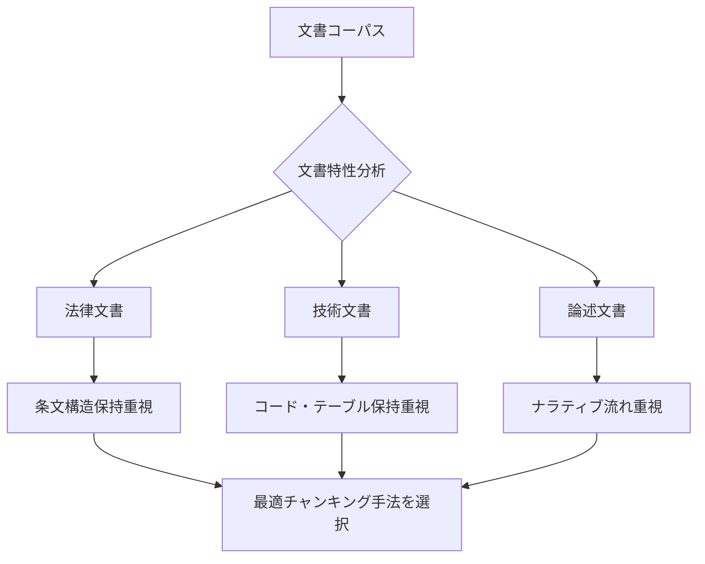
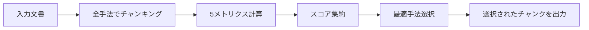

本記事は [Adaptive Chunking (arXiv:2603.25333)](https://arxiv.org/abs/2603.25333) の解説記事です。

## 論文概要（Abstract）

RAG（Retrieval-Augmented Generation）において、文書をチャンクに分割する方法は検索精度と回答品質に直結する。従来は全文書に単一のチャンキング手法を適用する「one-size-fits-all」アプローチが一般的であった。著者らは文書ごとに最適なチャンキング手法を選択するAdaptive Chunkingフレームワークを提案している。5つの文書品質メトリクスを定義し、これらに基づいて最適な手法を自動選択する。法律・技術・社会科学ドメインにまたがるコーパスで評価を行い、回答正確性が62-64%から72%へ向上したと報告している。

この記事は [Zenn記事: Arize Phoenix ExperimentsでRAGパイプラインを定量比較し最適化する](https://zenn.dev/0h_n0/articles/7582cd1a835ac4) の深掘りです。

## 情報源

- **会議名**: LREC 2026（Language Resources and Evaluation Conference）
- **arXiv ID**: 2603.25333
- **URL**: [https://arxiv.org/abs/2603.25333](https://arxiv.org/abs/2603.25333)
- **著者**: Paulo Roberto de Moura Junior, Jean Lelong, Annabelle Blangero
- **分野**: cs.CL, cs.AI, cs.IR
- **コード**: [github.com/ekimetrics/adaptive-chunking](https://github.com/ekimetrics/adaptive-chunking)

## カンファレンス情報

LREC（Language Resources and Evaluation Conference）は言語資源と評価手法に関する主要国際会議であり、NLP・情報検索コミュニティにおいて言語データの構築・評価・共有を扱っている。本論文はLREC 2026に採択されている。

## 背景と動機（Background & Motivation）

RAGパイプラインでは、文書をチャンクに分割して埋め込みベクトルを生成し、クエリに対して類似度検索を行う。チャンキングの品質がパイプライン全体の性能を大きく左右する。固定長分割ではテーブルやコードブロックが途中で切断され、意味的分割では計算コストが高く全文書への適用が困難である。

著者らは「すべての文書に対して最適な単一のチャンキング手法は存在しない」という観察から出発している。法律文書は条文構造の保持が重要であり、技術文書はコードブロックやテーブルの完全性が求められ、論述的な文書ではナラティブの流れを保つ必要がある。文書の特性が最適なチャンキング手法に強く影響することを実験的に示し、文書ごとに手法を切り替えるAdaptive Chunkingの必要性を主張している。



## 主要な貢献（Key Contributions）

- **貢献1: 5つの文書品質メトリクス** --- チャンキング品質を定量評価するための内在的メトリクス（RC、ICC、DCC、BI、SC）を提案。LLMベースの外部評価に依存せず、文書とチャンクの構造から直接計算可能である。
- **貢献2: Adaptive Chunkingフレームワーク** --- メトリクスに基づいて文書ごとに最適なチャンキング手法を自動選択する仕組みを構築している。
- **貢献3: 2つの新規チャンキング手法** --- LLM-Regex SplitterとSplit-then-Merge Recursive Splitterを提案している。
- **貢献4: 実験的検証** --- 回答正確性を62-64%から72%へ向上させ、正答可能な質問数を30%以上増加させたと報告している。

## 技術的詳細（Technical Details）

### 5つの文書品質メトリクス

著者らが提案する5つのメトリクスは、チャンキング品質を外部LLM評価なしで定量化する内在的指標である。各メトリクスは0から1の範囲を取る。

#### 1. References Completeness（参照完全性）

文書内の相互参照（URL、引用、脚注）がチャンク内で保持されているかを測定する。

$$
\text{RC}(D, C) = \frac{1}{|R|} \sum_{r \in R} \mathbb{1}\left[\exists c_i \in C : r_{\text{src}} \in c_i \land r_{\text{tgt}} \in c_i\right]
$$

ここで、$D$は元文書、$C = \{c_1, \ldots, c_n\}$はチャンク集合、$R$は参照の集合、$r_{\text{src}}$と$r_{\text{tgt}}$は参照元・参照先テキストである。参照元と参照先が同一チャンク内に含まれる割合を計算している。

#### 2. Intrachunk Cohesion（チャンク内結束性）

各チャンク内の意味的一貫性を評価する。

$$
\text{ICC}(C) = \frac{1}{|C|} \sum_{c_i \in C} \frac{2}{|S_i|(|S_i|-1)} \sum_{j < k} \text{sim}(\mathbf{e}_{s_j}, \mathbf{e}_{s_k})
$$

ここで、$S_i$はチャンク$c_i$内の文集合、$\mathbf{e}_{s_j}$は文$s_j$の埋め込みベクトル、$\text{sim}$はコサイン類似度である。チャンク内の全文ペアの類似度を平均する。著者らはJina Embeddings v3を使用している。

#### 3. Document Contextual Coherence（文書コンテキスト一貫性）

隣接チャンク間の意味的つながりが保持されているかを測定する。

$$
\text{DCC}(C) = \frac{1}{|C|-1} \sum_{i=1}^{|C|-1} \text{sim}(\mathbf{e}_{c_i}, \mathbf{e}_{c_{i+1}})
$$

$\mathbf{e}_{c_i}$はチャンク$c_i$全体の埋め込みベクトルである。文書のナラティブフローがチャンク分割で損なわれていないことを数値化している。

#### 4. Block Integrity（ブロック完全性）

テーブル、コードブロック、リストなどの構造的ブロックが分断されていないかを検査する。

$$
\text{BI}(D, C) = \frac{1}{|B|} \sum_{b \in B} \mathbb{1}\left[\exists c_i \in C : b \subseteq c_i\right]
$$

$B$は文書内の構造的ブロック集合である。ブロックが完全にチャンク内に収まっている割合を測定する。

#### 5. Size Compliance（サイズ適合性）

チャンクが目標サイズ制約に適合しているかを測定する。

$$
\text{SC}(C) = \frac{1}{|C|} \sum_{c_i \in C} \mathbb{1}\left[L_{\min} \leq |c_i| \leq L_{\max}\right]
$$

$|c_i|$はチャンクのトークン数、$L_{\min}$と$L_{\max}$は目標サイズの下限と上限である。

### 比較対象のチャンキング手法

| 手法 | 分割戦略 | 特徴 |
|------|---------|------|
| Fixed-size | 固定トークン数 | 実装容易だが意味境界を無視 |
| Recursive Character Splitter | 階層的デリミタ | LangChain標準実装 |
| Semantic Chunker | 埋め込み類似度閾値 | 意味境界検出、計算コスト高 |
| Late Chunking | 文書全体を先に埋め込み | 文脈情報を保持 |
| LLM-Regex Splitter | LLM推論 + 正規表現 | 著者らの新規提案 |
| Split-then-Merge Recursive | 細粒度分解 + 意味的再結合 | 著者らの新規提案 |

**LLM-Regex Splitter**はLLMに文書の意味的境界を推定させ、正規表現パターンとして定式化する。**Split-then-Merge Recursive**は文書を細粒度に階層分解した後、意味的一貫性の閾値で隣接断片を再結合する2段階手法である。

### Adaptive Chunkingの選択アルゴリズム



各文書に対して全チャンキング手法を適用し、5つのメトリクスのスコアを集約して最適手法を選択する。DeepEvalフレームワークによるLLMベースの回答正確性を外部評価指標として使用し、内在的メトリクスとの相関を分析している。

## 実装のポイント（Implementation Notes）

**メトリクス計算の効率化**: ICCとDCCは埋め込み計算を必要とする。文書数が多い場合、バッチ処理と埋め込みキャッシュにより計算効率を改善すべきである。

**ブロック検出**: Block Integrity計算にはMarkdownやHTMLの構造解析が必要である。正規表現でコードフェンス、テーブル、リストを検出する方法が実用的である。

```python
from dataclasses import dataclass
from typing import Protocol
import numpy as np
import re


class EmbeddingModel(Protocol):
    """埋め込みモデルのインターフェース。"""
    def embed(self, texts: list[str]) -> np.ndarray: ...


@dataclass(frozen=True)
class ChunkingMetrics:
    """5つのチャンキング品質メトリクス。"""
    references_completeness: float
    intrachunk_cohesion: float
    document_contextual_coherence: float
    block_integrity: float
    size_compliance: float

    @property
    def aggregate_score(self) -> float:
        """全メトリクスの均等加重平均。"""
        return float(np.mean([
            self.references_completeness,
            self.intrachunk_cohesion,
            self.document_contextual_coherence,
            self.block_integrity,
            self.size_compliance,
        ]))


def compute_intrachunk_cohesion(
    chunks: list[str], model: EmbeddingModel,
) -> float:
    """チャンク内結束性（ICC）を計算する。

    Args:
        chunks: チャンクテキストのリスト
        model: 埋め込みモデル
    Returns:
        ICC スコア（0-1）
    """
    scores: list[float] = []
    for chunk in chunks:
        sentences = chunk.split(". ")
        if len(sentences) < 2:
            scores.append(1.0)
            continue
        emb = model.embed(sentences)
        norms = np.linalg.norm(emb, axis=1, keepdims=True)
        norm_emb = emb / np.clip(norms, 1e-8, None)
        sim = norm_emb @ norm_emb.T
        n = len(sentences)
        idx = np.triu_indices(n, k=1)
        scores.append(float(sim[idx].mean()))
    return float(np.mean(scores))


def compute_block_integrity(doc: str, chunks: list[str]) -> float:
    """ブロック完全性（BI）を計算する。

    Args:
        doc: 元文書テキスト
        chunks: チャンクテキストのリスト
    Returns:
        BI スコア（0-1）
    """
    code_blocks = re.findall(r"```[\s\S]*?```", doc)
    table_blocks = re.findall(r"(?:^\|.+\|$\n?){2,}", doc, re.MULTILINE)
    blocks = code_blocks + table_blocks
    if not blocks:
        return 1.0
    intact = sum(1 for b in blocks if any(b in c for c in chunks))
    return intact / len(blocks)
```

## 本番デプロイメントガイド（Production Deployment Guide）

Adaptive Chunkingを本番RAGパイプラインに組み込む構成パターンを整理する。以下のコスト試算は2026年9月時点のAWS東京リージョン（ap-northeast-1）の公開料金に基づく参考値であり、実際のコストはリクエストパターンやデータ量に依存する。

### AWS実装パターン（コスト最適化重視）

| 規模 | 日次リクエスト | 推奨構成 | 月額概算 |
|------|--------------|---------|---------|
| Small | ~100 | Lambda + OpenSearch Serverless + S3 | $80-150 |
| Medium | ~1,000 | ECS Fargate + OpenSearch + ElastiCache | $400-800 |
| Large | 10,000+ | EKS + Karpenter + OpenSearch + Redis | $2,000-5,000 |

**Small構成内訳**: Lambda $15/月、OpenSearch Serverless $30/月、Bedrock Embeddings $20-50/月、S3 $5/月、DynamoDB（メトリクスキャッシュ）$5/月。

**コスト削減テクニック**: 埋め込みキャッシュでBedrock呼び出しを60-80%削減、Spot Instancesで最大90%削減、Bedrock Batch APIで一括インジェスト時50%削減、メトリクス事前計算でクエリ時コストをゼロ化。

### Terraformインフラコード

**Small構成（Serverless）**:

```hcl
resource "aws_dynamodb_table" "metrics_cache" {
  name         = "adaptive-chunking-metrics"
  billing_mode = "PAY_PER_REQUEST"
  hash_key     = "document_id"
  range_key    = "chunking_method"

  attribute {
    name = "document_id"
    type = "S"
  }
  attribute {
    name = "chunking_method"
    type = "S"
  }
  ttl {
    attribute_name = "expires_at"
    enabled        = true
  }
  server_side_encryption { enabled = true }
}

resource "aws_iam_role" "chunking_lambda" {
  name = "adaptive-chunking-lambda"
  assume_role_policy = jsonencode({
    Version = "2012-10-17"
    Statement = [{
      Action    = "sts:AssumeRole"
      Effect    = "Allow"
      Principal = { Service = "lambda.amazonaws.com" }
    }]
  })
}

resource "aws_iam_role_policy" "chunking_lambda" {
  name = "adaptive-chunking-policy"
  role = aws_iam_role.chunking_lambda.id
  policy = jsonencode({
    Version = "2012-10-17"
    Statement = [
      {
        Effect   = "Allow"
        Action   = ["dynamodb:GetItem", "dynamodb:PutItem", "dynamodb:Query"]
        Resource = aws_dynamodb_table.metrics_cache.arn
      },
      {
        Effect   = "Allow"
        Action   = ["bedrock:InvokeModel"]
        Resource = "arn:aws:bedrock:ap-northeast-1::foundation-model/*"
      },
    ]
  })
}

resource "aws_lambda_function" "adaptive_chunker" {
  function_name = "adaptive-chunking-processor"
  runtime       = "python3.12"
  handler       = "handler.lambda_handler"
  timeout       = 120
  memory_size   = 1024
  role          = aws_iam_role.chunking_lambda.arn

  environment {
    variables = {
      METRICS_TABLE   = aws_dynamodb_table.metrics_cache.name
      EMBEDDING_MODEL = "amazon.titan-embed-text-v2:0"
      SIZE_MIN_TOKENS = "100"
      SIZE_MAX_TOKENS = "500"
    }
  }
}
```

**Large構成（Container）**: EKS 1.31 + Karpenter 1.1でSpot優先のNodePoolを構成し、`consolidationPolicy: WhenEmptyOrUnderutilized`で未使用ノードを自動回収する。AWS Budgetsで月額$5,000の80%到達時にSNSアラートを送信する。

### 運用・監視設定

**CloudWatch Logs Insights**（埋め込みコスト監視）:

```
fields @timestamp, document_id, chunking_method, embedding_tokens
| stats sum(embedding_tokens) as total_tokens by bin(1h)
| filter total_tokens > 100000
```

**CloudWatch アラーム + X-Ray トレーシング（Python）**:

```python
import boto3
from aws_xray_sdk.core import xray_recorder, patch_all

patch_all()  # boto3, requests等を自動計装

cloudwatch = boto3.client("cloudwatch", region_name="ap-northeast-1")
cloudwatch.put_metric_alarm(
    AlarmName="adaptive-chunking-embedding-cost-spike",
    MetricName="EmbeddingTokensUsed",
    Namespace="AdaptiveChunking",
    Statistic="Sum",
    Period=3600,
    EvaluationPeriods=2,
    Threshold=500000,
    ComparisonOperator="GreaterThanThreshold",
    AlarmActions=["arn:aws:sns:ap-northeast-1:123456789012:ops-alerts"],
)


@xray_recorder.capture("compute_metrics")
def compute_metrics_traced(document: str, chunks: list[str]) -> dict:
    """メトリクス計算をX-Rayでトレースする。"""
    subsegment = xray_recorder.current_subsegment()
    subsegment.put_annotation("document_length", len(document))
    subsegment.put_annotation("num_chunks", len(chunks))
    metrics = _compute_all_metrics(document, chunks)
    subsegment.put_metadata("metrics", metrics)
    return metrics
```

**Cost Explorer日次レポート**: `ce.get_cost_and_usage`で日次コストを取得し、$100/日超過時にSNS通知を送信する。Bedrock・Lambda・OpenSearchのサービス別内訳をGroupByで抽出することで、コスト増加の原因特定を迅速化できる。

### コスト最適化チェックリスト

**アーキテクチャ選択**:
- [ ] トラフィック量に応じた構成選定（Serverless / Hybrid / Container）
- [ ] リージョン選定（東京 vs バージニア、レイテンシ vs コスト）

**リソース最適化**:
- [ ] ECS/EKS: Spot Instances優先（最大90%削減）
- [ ] Reserved Instances: 1年コミットで最大72%削減
- [ ] Savings Plans検討
- [ ] Lambda: メモリサイズ最適化（Power Tuning検証）
- [ ] OpenSearch: リザーブドインスタンス適用

**LLMコスト削減**:
- [ ] 埋め込みキャッシュ: DynamoDBに計算結果保存
- [ ] Bedrock Batch API: 一括インジェスト時使用（50%削減）
- [ ] メトリクス事前計算: インジェスト時に全手法スコアをキャッシュ
- [ ] トークン数制限: チャンクサイズ上限の厳密管理

**監視・アラート**:
- [ ] AWS Budgets: 月額予算アラート設定
- [ ] CloudWatch アラーム: 埋め込みトークン使用量スパイク検知
- [ ] Cost Anomaly Detection: 自動異常検知有効化
- [ ] 日次コストレポート: SNS通知設定

**リソース管理**:
- [ ] 未使用OpenSearchインデックス削除
- [ ] タグ戦略: Environment / Project / Owner
- [ ] S3ライフサイクルポリシー: 古い文書の自動アーカイブ
- [ ] DynamoDB TTL: メトリクスキャッシュの自動期限切れ
- [ ] 開発環境: 夜間・週末の自動停止設定

## 実験結果（Results）

著者らは法律・技術・社会科学ドメインのコーパスで評価を行っている。DeepEvalフレームワークによるLLMベースの回答正確性を使用し、LLMにはClaudeを採用している（論文Section 5より）。

| 手法 | 回答正確性 | 正答可能な質問数 |
|------|-----------|----------------|
| 単一手法（最良） | 62-64% | 49 |
| Adaptive Chunking | **72%** | **65** |
| 改善幅 | +8-10 pp | +30%以上 |

**手法ごとの得意領域**: Late ChunkingはReferences Completenessで最高スコアを達成し、Recursive Character SplitterはSize Complianceに優れている。Semantic ChunkerはIntrachunk Cohesionで高スコアだが計算コストが高い。単一の最良手法が全メトリクスで優位に立つわけではないことを示している。

**文書特性と手法の相関**: 構造化された技術文書ではBlock Integrityを重視する手法が、論述的な社会科学文書ではDocument Contextual Coherenceを重視する手法が高い回答正確性と相関していると著者らは分析している。正答可能な質問数が49から65へ増加した点は、従来回答不能だった質問への対応力向上を意味する。

## 実運用への応用（Practical Applications）

**社内文書検索システム**: 企業内には契約書、APIドキュメント、議事録など多様な文書タイプが混在する。Adaptive Chunkingにより文書タイプに応じたチャンキングが自動選択され、横断的な検索精度向上が期待できる。関連Zenn記事で扱ったArize Phoenix Experimentsで導入前後の品質を定量比較することが可能である。

**段階的導入**: 全文書へのリアルタイム適用はコスト面で非効率な場合がある。文書インジェスト時にメトリクスを事前計算してキャッシュし、クエリ時はキャッシュ参照のみとする設計が実用的である。

**メトリクスモニタリング**: 5つのメトリクスを継続計測することで、文書コーパスの変化に伴うチャンキング品質の劣化を早期検知できる。

## 関連研究（Related Work）

- **Anthropic Contextual Retrieval**: チャンクに文書全体のコンテキストを付与するアプローチ。Adaptive Chunkingの後処理として組み合わせ可能であり、References Completenessの改善に寄与すると考えられる。
- **Chroma Chunking Evaluation**: チャンキング品質の評価フレームワーク。著者らの5メトリクスはこの流れを発展させたものである。
- **Wang et al. (2025)**: 文書構造認識チャンキングの先行研究。Adaptive Chunkingはこのアプローチを手法選択レベルに拡張している。
- **Qu et al.**: Semantic Chunkingの計算コスト分析。Adaptive Chunkingでは必要な文書にのみSemantic Chunkerを適用し計算効率を改善している。

## まとめと今後の展望

著者らはRAGにおけるチャンキングの「one-size-fits-all」問題に対して、文書ごとに最適手法を選択するAdaptive Chunkingフレームワークを提案した。5つの内在的メトリクスにより外部LLM評価に頼らずチャンキング品質を定量化し、回答正確性を62-64%から72%に向上させた。実運用ではメトリクスの事前計算とキャッシュによりリアルタイムコストを抑えつつ、多様な文書タイプに対応可能な検索パイプラインの構築が期待できる。今後の方向として、メトリクス重みの自動チューニング、新文書タイプへの適応、チャンキング手法の動的追加が挙げられる。

## 参考文献

- **arXiv**: [https://arxiv.org/abs/2603.25333](https://arxiv.org/abs/2603.25333)
- **Conference**: LREC 2026
- **Code**: [https://github.com/ekimetrics/adaptive-chunking](https://github.com/ekimetrics/adaptive-chunking)
- **Related Zenn article**: [https://zenn.dev/0h_n0/articles/7582cd1a835ac4](https://zenn.dev/0h_n0/articles/7582cd1a835ac4)
