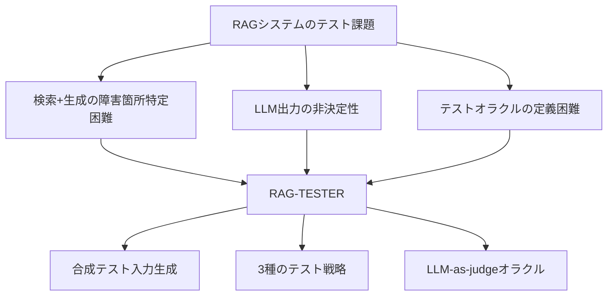
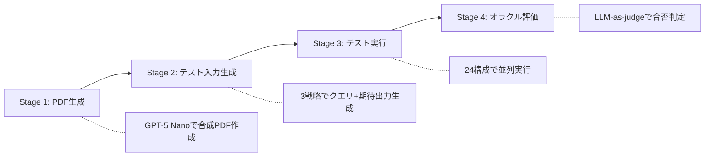

本記事は [RAG-TESTER (arXiv:2608.00054)](https://arxiv.org/abs/2608.00054) の解説記事です。

## 論文概要（Abstract）

Retrieval-Augmented Generation（RAG）は外部知識を参照することでLLMの幻覚を低減する有力なアプローチだが、検索と生成の2段階が連鎖するため、障害モードが多様化しテストが困難になる。著者らはRAG-TESTERを提案している。これはRAGシステムのEnd-to-Endテストを自動化するフレームワークであり、合成PDF生成、3種のテスト生成戦略（複雑度ベース・否定的棄却・カバレッジベース）、24種のLLM-エンベディング構成にまたがるテスト実行、LLM-as-judgeによるオラクル評価の4段階で構成される。著者らは60件のPDFドキュメント（合成30件、実世界30件）に対して72,000回のテスト実行を行い、ベースラインと比較して6.6%多い障害を検出したと報告している。

この記事は [Zenn記事: Arize Phoenix ExperimentsでRAGパイプラインを定量比較し最適化する](https://zenn.dev/0h_n0/articles/7582cd1a835ac4) の深掘りです。Zenn記事ではRAGパイプラインの定量評価手法を取り上げているが、本論文はその評価をCI/CDに統合するための自動テスト生成という観点から補完する位置づけにある。

## 情報源

- **arXiv ID**: 2608.00054
- **URL**: [https://arxiv.org/abs/2608.00054](https://arxiv.org/abs/2608.00054)
- **著者**: Ange Maiztegi, Jon Ayerdi, Miren Illarramendi, Aitor Arrieta
- **発表年**: 2026年7月
- **分野**: Artificial Intelligence (cs.AI), Software Engineering (cs.SE)

## 背景と動機（Background & Motivation）

RAGシステムのテストにおいて、従来のソフトウェアテスト手法がそのまま適用できない理由は大きく3つある。第一に、検索コンポーネントと生成コンポーネントの組み合わせにより障害の原因箇所が特定しにくい。第二に、LLMの出力が非決定的であるため同一入力でも応答が変動する。第三に、テストオラクル（期待される正しい出力の定義）が自然言語の意味的同値性に依存し、単純な文字列一致では評価できない。

著者らはこれらの課題に対し、テスト入力の自動生成とLLM-as-judgeによるオラクル評価を組み合わせたフレームワークが必要だと主張している。特に、RAGシステムの品質を継続的に監視するためのCI/CD統合を視野に入れた設計となっている。



## 主要な貢献（Key Contributions）

- **貢献1: 4段階のE2Eテストフレームワーク** --- 合成PDF生成からオラクル評価まで、RAGシステムのテストを完全自動化するパイプラインを提案している。手動でのテストケース作成を不要にし、CI/CDパイプラインへの組み込みを容易にしている。
- **貢献2: 3種のテスト生成戦略** --- 複雑度ベース、否定的棄却クエリ、カバレッジベースの3戦略を提案し、それぞれが異なる障害タイプの検出に寄与することを実験的に示している。
- **貢献3: 大規模な実証評価** --- 8種のLLM、6種のエンベディングモデル、24種の構成にまたがる72,000回のテスト実行により、フレームワークの有効性を定量的に検証している。

## 技術的詳細（Technical Details）

### 全体アーキテクチャ: 4段階パイプライン

RAG-TESTERは以下の4段階で構成される。



**Stage 1: PDF生成。** GPT-5 Nanoを用いて、制御されたドキュメント複雑度を持つ合成PDFを生成する。各セクションのFlesch Reading Easeスコアが異なるように設計されており、後段の複雑度ベーステストの入力として機能する。著者らは30件の合成PDFに加え、30件の実世界PDF（学術論文、技術マニュアル等）も評価対象に含めている。

**Stage 2: テスト入力生成。** 後述の3戦略により、各PDFからクエリと期待出力のペアを生成する。

**Stage 3: テスト実行。** 生成されたテストケースを24種のLLM-エンベディング構成に対して実行する。各テスト実行では、クエリに基づく検索結果の取得、コンテキストの組み立て、LLMによる応答生成が行われる。

**Stage 4: オラクル評価。** LLM-as-judgeアプローチにより、生成された応答と期待出力の意味的一致を評価する。著者らは382件のサンプルで手動検証を行い、オラクルの精度が80.6%であったと報告している。

### テスト生成戦略1: 複雑度ベーステスト（Complexity-Based Testing）

ドキュメントの各セクションをFlesch Reading Easeスコアで評価し、低スコア（読みにくい＝複雑な）セクションを優先的にテスト対象とする戦略である。RAGシステムが複雑な文章を正確に検索・要約できるかを検証する。

Flesch Reading Easeの計算式は以下の通りである。

$$
\text{FRE} = 206.835 - 1.015 \times \frac{\text{total words}}{\text{total sentences}} - 84.6 \times \frac{\text{total syllables}}{\text{total words}}
$$

スコアが低いほど文章が複雑であることを示す。著者らはスコア30未満のセクションを「高複雑度」と分類し、これらのセクションから優先的にテストクエリを生成している。

```python
from dataclasses import dataclass


@dataclass(frozen=True)
class DocumentSection:
    """PDFから抽出されたセクション情報。"""

    section_id: str
    text: str
    flesch_score: float
    page_number: int


def rank_sections_by_complexity(
    sections: list[DocumentSection],
    threshold: float = 30.0,
) -> list[DocumentSection]:
    """セクションを複雑度でランク付けし、高複雑度セクションを優先する。

    Args:
        sections: PDFから抽出されたセクションのリスト。
        threshold: 高複雑度と判定するFRE閾値。この値未満を優先する。

    Returns:
        複雑度の昇順（最も複雑なセクションが先頭）にソートされたリスト。
    """
    high_complexity = [s for s in sections if s.flesch_score < threshold]
    remaining = [s for s in sections if s.flesch_score >= threshold]
    high_complexity.sort(key=lambda s: s.flesch_score)
    return high_complexity + remaining
```

### テスト生成戦略2: 否定的棄却クエリ（Negative Rejection Queries）

ドキュメントに記載されていない情報について質問するクエリを生成し、RAGシステムが「情報が見つからない」と正しく回答できるかを検証する戦略である。幻覚の検出に特化している。

著者らはLLMを用いて、ドキュメントの主題に関連するが実際には記載されていない質問を自動生成している。例えば、機械学習に関するドキュメントに対して「このドキュメントで言及されている量子コンピュータの応用例は何か」のようなクエリを生成し、システムが架空の回答を生成しないかを検証する。

```python
from typing import Literal


@dataclass(frozen=True)
class TestCase:
    """RAG-TESTERのテストケース。"""

    query: str
    expected_answer: str
    strategy: Literal["complexity", "negative", "coverage"]
    source_section_id: str | None
    is_answerable: bool


def generate_negative_test_cases(
    document_topics: list[str],
    existing_sections: list[DocumentSection],
    num_cases: int = 10,
) -> list[TestCase]:
    """否定的棄却テストケースを生成する。

    ドキュメントに存在しない情報についてのクエリを生成し、
    RAGシステムが幻覚を生成しないかを検証する。

    Args:
        document_topics: ドキュメントの主要トピック一覧。
        existing_sections: ドキュメント内の既存セクション。
        num_cases: 生成するテストケース数。

    Returns:
        is_answerable=FalseのTestCaseリスト。
    """
    # 実際にはLLMを呼び出して存在しない情報に関するクエリを生成する
    absent_topics = _identify_absent_subtopics(
        document_topics, existing_sections
    )
    test_cases: list[TestCase] = []
    for topic in absent_topics[:num_cases]:
        test_cases.append(
            TestCase(
                query=f"{topic}についてこのドキュメントではどう説明されているか",
                expected_answer="この情報はドキュメントに記載されていません",
                strategy="negative",
                source_section_id=None,
                is_answerable=False,
            )
        )
    return test_cases


def _identify_absent_subtopics(
    topics: list[str],
    sections: list[DocumentSection],
) -> list[str]:
    """ドキュメントに記載されていないサブトピックを特定する。"""
    section_texts = " ".join(s.text for s in sections)
    # 実際にはLLMを使って関連するが不在のトピックを生成する
    return [
        t + "の最新動向" for t in topics
        if t + "の最新動向" not in section_texts
    ]
```

### テスト生成戦略3: カバレッジベース選択（Coverage-Based Selection）

ドキュメント全体から均等にテストケースを生成し、特定のセクションに偏らないようにする戦略である。著者らはドキュメントをセクション単位で分割し、各セクションから最低1つのテストケースが生成されるよう制約を設けている。

この戦略により、検索コンポーネントが特定の領域でのみ良好に動作し他の領域で失敗するケース（検索の偏り）を検出できる。

### 実験構成

著者らは以下の構成で大規模実験を実施している。

| カテゴリ | モデル名 | 種別 |
|---------|---------|------|
| LLM（クローズド） | GPT-4o, GPT-4o-mini, GPT-4.1, GPT-4.1-mini | OpenAI |
| LLM（オープン） | Llama 3.3 70B, Llama 3.1 8B, Qwen 2.5 32B, Phi-4 14B | Ollama |
| Embedding（クローズド） | text-embedding-3-large, text-embedding-3-small, text-embedding-ada-002 | OpenAI |
| Embedding（オープン） | all-MiniLM-L6-v2, nomic-embed-text, mxbai-embed-large | オープンウェイト |

合計で8 LLM × 6 Embedding = 24構成、3,000クエリ × 24構成 = 72,000回のテスト実行が行われた。テスト対象のPDFは合成30件＋実世界30件の計60件である。

## 実装のポイント（Implementation Notes）

著者らの手法を実装する際の重要なポイントを整理する。

**第一に、テストオラクルの精度と偽陽性の管理。** LLM-as-judgeの精度は80.6%であり、19.4%の偽陽性率がある。CI/CDパイプラインに組み込む場合、単一テストの失敗ではなく、失敗率の閾値（例: 同一カテゴリで20%以上が失敗）に基づいてアラートを発する設計が現実的である。

**第二に、合成PDFと実世界PDFの併用。** 論文の実験では、実世界PDFが合成PDFと比較して64.4%多い障害を検出している。テストスイートには必ず実際の運用ドキュメントを含めるべきである。

**第三に、テスト戦略の使い分け。** 複雑度ベーステストは検索精度の弱点を、否定的棄却テストは幻覚を、カバレッジベーステストは検索の偏りを検出する。3戦略を組み合わせることで障害検出の網羅性が向上する。

**第四に、実行コストの制御。** 72,000回の実行は評価実験としては有意義だが、日常のCI/CDでは現実的でない。構成を絞り込み（例: 本番で使用するLLM-Embedding構成のみ）、テストケース数も100-500件程度にサンプリングすることが推奨される。

## 本番デプロイメントガイド（Production Deployment Guide）

RAG-TESTERのテストパイプラインを本番CI/CDに組み込む際の構成パターンを、ワークロード規模別に整理する。以下のコスト試算は2026年9月時点のAWS東京リージョン（ap-northeast-1）の公開料金に基づく参考値であり、実際のコストはテスト頻度やモデル選択に依存する。

### 規模別アーキテクチャ選定

| 規模 | テストケース/実行 | 実行頻度 | 推奨構成 | 月額概算 |
|------|----------------|---------|---------|---------|
| Small | ~100 | PR毎 | Lambda + S3 + SQS | $30-100 |
| Medium | ~500 | 日次+PR毎 | ECS Fargate + Aurora Serverless | $200-600 |
| Large | ~3,000+ | 日次+構成マトリクス | EKS + Step Functions + Aurora | $800-3,000 |

### Small規模: Lambda + S3

PR単位でRAGテストを実行する構成。テストケース生成・実行・オラクル評価をそれぞれLambda関数として実装し、Step Functionsでオーケストレーションする。テスト結果はS3に保存し、CloudWatch Metricsで失敗率を追跡する。

```hcl
# Terraform: RAG-TESTERテストパイプライン基盤（Small規模）

resource "aws_s3_bucket" "test_artifacts" {
  bucket = "rag-tester-artifacts"

  lifecycle_rule {
    enabled = true
    expiration {
      days = 90
    }
  }
}

resource "aws_lambda_function" "test_generator" {
  function_name = "rag-tester-generator"
  runtime       = "python3.12"
  handler       = "handler.generate_tests"
  timeout       = 120
  memory_size   = 1024

  environment {
    variables = {
      ARTIFACTS_BUCKET = aws_s3_bucket.test_artifacts.id
      TEST_STRATEGY    = "all"
      MAX_CASES        = "100"
    }
  }
}

resource "aws_lambda_function" "test_executor" {
  function_name = "rag-tester-executor"
  runtime       = "python3.12"
  handler       = "handler.execute_tests"
  timeout       = 300
  memory_size   = 512

  environment {
    variables = {
      ARTIFACTS_BUCKET = aws_s3_bucket.test_artifacts.id
      RAG_ENDPOINT     = var.rag_api_endpoint
    }
  }
}

resource "aws_lambda_function" "oracle_evaluator" {
  function_name = "rag-tester-oracle"
  runtime       = "python3.12"
  handler       = "handler.evaluate_oracle"
  timeout       = 300
  memory_size   = 512

  environment {
    variables = {
      ARTIFACTS_BUCKET   = aws_s3_bucket.test_artifacts.id
      JUDGE_MODEL        = "gpt-4o-mini"
      FAILURE_THRESHOLD  = "0.20"
    }
  }
}

resource "aws_sqs_queue" "test_queue" {
  name                       = "rag-tester-execution"
  visibility_timeout_seconds = 360

  redrive_policy = jsonencode({
    deadLetterTargetArn = aws_sqs_queue.test_dlq.arn
    maxReceiveCount     = 2
  })
}

resource "aws_sqs_queue" "test_dlq" {
  name = "rag-tester-execution-dlq"
}
```

### Large規模: EKS + Step Functions

構成マトリクス全体にまたがるテストを日次で実行する大規模環境。EKS上にテスト実行ワーカーを配置し、Step Functionsがマトリクスの各構成を並列にディスパッチする。Aurora PostgreSQLにテスト結果を蓄積し、時系列での品質推移を追跡する。

```hcl
# Terraform: RAG-TESTERテストパイプライン基盤（Large規模）

module "eks" {
  source  = "terraform-aws-modules/eks/aws"
  version = "~> 20.0"

  cluster_name    = "rag-tester-cluster"
  cluster_version = "1.31"
  vpc_id          = module.vpc.vpc_id
  subnet_ids      = module.vpc.private_subnets

  eks_managed_node_groups = {
    workers = {
      instance_types = ["m7i.xlarge"]
      min_size       = 2
      max_size       = 10
    }
  }
}

resource "aws_rds_cluster" "test_results" {
  cluster_identifier = "rag-tester-results"
  engine             = "aurora-postgresql"
  engine_version     = "16.4"
  database_name      = "rag_tester"

  serverlessv2_scaling_configuration {
    min_capacity = 0.5
    max_capacity = 8.0
  }
}

resource "aws_sfn_state_machine" "test_matrix" {
  name     = "rag-tester-matrix"
  role_arn = aws_iam_role.sfn_role.arn

  definition = jsonencode({
    StartAt = "GenerateTests"
    States = {
      GenerateTests = {
        Type     = "Task"
        Resource = "arn:aws:lambda:ap-northeast-1:*:function:rag-tester-generator"
        Next     = "FanOutConfigs"
      }
      FanOutConfigs = {
        Type = "Map"
        ItemsPath = "$.configurations"
        MaxConcurrency = 8
        Iterator = {
          StartAt = "ExecuteConfig"
          States = {
            ExecuteConfig = {
              Type     = "Task"
              Resource = "arn:aws:states:::eks-call"
              End      = true
            }
          }
        }
        Next = "EvaluateResults"
      }
      EvaluateResults = {
        Type     = "Task"
        Resource = "arn:aws:lambda:ap-northeast-1:*:function:rag-tester-oracle"
        End      = true
      }
    }
  })
}
```

### モニタリング構成

テスト結果の追跡には、構成別の失敗率・戦略別の障害検出数・オラクルの偽陽性推定値の3種のメトリクスをCloudWatchに送信する。失敗率が閾値を超えた場合にSNS経由でアラートを発する。

```python
import boto3
from typing import Any


cloudwatch = boto3.client("cloudwatch", region_name="ap-northeast-1")


def emit_test_metrics(
    config_name: str,
    strategy: str,
    total_tests: int,
    failures: int,
    false_positive_estimate: float,
) -> None:
    """RAG-TESTERのテスト結果メトリクスをCloudWatchに送信する。

    Args:
        config_name: LLM-Embedding構成名（例: "gpt-4o+text-embedding-3-large"）
        strategy: テスト戦略名（"complexity", "negative", "coverage"）
        total_tests: 実行テスト数
        failures: 検出された障害数
        false_positive_estimate: 偽陽性推定率（0.0-1.0）
    """
    failure_rate = failures / total_tests if total_tests > 0 else 0.0
    adjusted_failures = int(failures * (1.0 - false_positive_estimate))

    dims = [
        {"Name": "Configuration", "Value": config_name},
        {"Name": "Strategy", "Value": strategy},
    ]
    cloudwatch.put_metric_data(
        Namespace="RAGTester/Results",
        MetricData=[
            {
                "MetricName": "FailureRate",
                "Value": failure_rate,
                "Unit": "None",
                "Dimensions": dims,
            },
            {
                "MetricName": "AdjustedFailures",
                "Value": float(adjusted_failures),
                "Unit": "Count",
                "Dimensions": dims,
            },
            {
                "MetricName": "TotalTests",
                "Value": float(total_tests),
                "Unit": "Count",
                "Dimensions": dims,
            },
        ],
    )
```

### コスト最適化チェックリスト

本番デプロイ時に確認すべきコスト最適化項目を以下に整理する。

- テストケースのサンプリング: 全3,000クエリではなく、層化抽出で100-500件に絞る
- オラクルモデルの選択: GPT-4o-miniやClaude 3.5 Haiku等の低コストモデルをオラクルに使用する
- S3ライフサイクルポリシーで90日超のテスト成果物を自動削除する
- Step Functionsの並列度をコスト上限に応じて調整する（MaxConcurrency）
- Aurora Serverless v2のmin_capacityを0.5 ACUに設定し、テスト非実行時のコストを抑制
- PR単位のテスト実行ではLLM構成を本番構成のみに絞る（全マトリクスは日次で実行）

## 実験結果（Evaluation）

### 障害検出性能

著者らの実験結果を以下に整理する。

| メトリクス | RAG-TESTER | ベースライン | 差分 |
|-----------|-----------|------------|------|
| 検出障害数（全体） | 21,633 | 20,293 | +6.6% |
| OpenAI構成での検出改善 | --- | --- | +19.68% |
| 実世界PDFでの障害検出 | 多い | 少ない | +64.4% |
| オラクル精度 | 80.6% | --- | --- |
| 偽陽性率 | 19.4% | --- | --- |

全体では6.6%の改善であるが、OpenAI構成に限定すると19.68%の障害検出改善が報告されている。著者らはこの差について、OpenAIモデルが複雑なパッセージに対してより長い応答を生成する傾向があり、カバレッジベースおよび複雑度ベースのテスト戦略がこの傾向を効果的に捉えたと考察している。

### 合成PDFと実世界PDFの比較

著者らの実験で注目すべき結果は、実世界PDFが合成PDFと比較して64.4%多い障害を露呈した点である。合成PDFは制御された構造を持つため、RAGシステムにとって「扱いやすい」文書である。一方、実世界のPDF（学術論文、技術マニュアル等）は表・図・脚注・複雑なレイアウトを含み、検索コンポーネントの弱点をより多く露出させる。

この結果は、テストスイートに実世界ドキュメントを含めることの重要性を示している。合成テストのみでは検出できない障害が多数存在する。

### 検出された障害タイプ

著者らは以下の4種類の障害パターンを報告している。

1. **幻覚（Hallucinations）**: ドキュメントに記載されていない情報に基づく回答の生成。否定的棄却クエリ戦略が主に検出する。
2. **検索の不正確さ（Retrieval Inaccuracies）**: 関連するコンテキストの取得失敗、または無関係なチャンクの混入。カバレッジベース戦略が広範囲の検索品質を検証する。
3. **複雑な文章の解釈失敗**: 専門用語や密な論述を含むパッセージに対する不正確な要約や回答。複雑度ベース戦略が直接的に検出する。
4. **複数セクション横断の統合失敗**: 複数のセクションからの情報を統合する必要があるクエリに対する不完全な回答。

### オラクル精度の評価

著者らは382件のサンプルに対して人手評価を行い、LLM-as-judgeオラクルの精度を検証している。精度は80.6%であり、19.4%が偽陽性（正しい応答を誤って障害と判定）であった。この偽陽性率は、テスト結果を絶対的な品質指標としてではなく、品質の傾向を追跡する相対的な指標として使用すべきであることを示唆している。

## 実運用への応用（Practical Applications）

### Zenn記事との接続

[Zenn記事: Arize Phoenix ExperimentsでRAGパイプラインを定量比較し最適化する](https://zenn.dev/0h_n0/articles/7582cd1a835ac4)では、Arize Phoenixを用いたRAGパイプラインの定量評価手法を取り上げている。本論文はZenn記事の「CI/CDパイプラインにおける品質ゲート」セクションと直接的に関連している。

**評価と自動テストの統合**: Zenn記事で扱われるArize Phoenixの実験機能が「品質がどの程度か」を測定するのに対し、RAG-TESTERは「品質劣化が起きていないか」を自動検証する。両者を組み合わせることで、定量評価（Phoenix）と回帰テスト（RAG-TESTER）の2層で品質を管理できる。

**テスト戦略の選択指針**: RAGパイプラインの改善施策（エンベディングモデルの変更、チャンク戦略の調整等）を実施する際、RAG-TESTERの3戦略によるテストスイートをPR単位で実行し、品質劣化を検知してからマージする運用が可能になる。

### CI/CDパイプラインへの統合パターン

RAG-TESTERをGitHub Actions等のCI/CDに組み込む際の実装パターンを示す。

```python
from dataclasses import dataclass
from enum import Enum


class TestVerdict(Enum):
    """テスト実行結果の判定。"""
    PASS = "pass"
    FAIL = "fail"
    SKIP = "skip"


@dataclass(frozen=True)
class TestResult:
    """単一テストケースの実行結果。"""

    test_case: TestCase
    actual_answer: str
    verdict: TestVerdict
    confidence: float
    config_name: str


@dataclass(frozen=True)
class QualityGateResult:
    """品質ゲートの判定結果。"""

    passed: bool
    failure_rate: float
    threshold: float
    total_tests: int
    failures: int
    strategy_breakdown: dict[str, float]


def evaluate_quality_gate(
    results: list[TestResult],
    threshold: float = 0.20,
    false_positive_adjustment: float = 0.194,
) -> QualityGateResult:
    """テスト結果に基づく品質ゲート判定を行う。

    偽陽性率を考慮した調整済み失敗率で判定する。
    論文では偽陽性率19.4%が報告されているため、
    デフォルトでこの値を調整に使用する。

    Args:
        results: テスト実行結果のリスト。
        threshold: 失敗率の閾値（これを超えるとゲート不合格）。
        false_positive_adjustment: 偽陽性率による調整係数。

    Returns:
        品質ゲートの判定結果。
    """
    executed = [r for r in results if r.verdict != TestVerdict.SKIP]
    failures = [r for r in executed if r.verdict == TestVerdict.FAIL]
    total = len(executed)

    if total == 0:
        return QualityGateResult(
            passed=True,
            failure_rate=0.0,
            threshold=threshold,
            total_tests=0,
            failures=0,
            strategy_breakdown={},
        )

    raw_failure_rate = len(failures) / total
    adjusted_rate = raw_failure_rate * (1.0 - false_positive_adjustment)

    strategy_rates: dict[str, float] = {}
    for strategy in ("complexity", "negative", "coverage"):
        strat_results = [r for r in executed if r.test_case.strategy == strategy]
        strat_failures = [r for r in strat_results if r.verdict == TestVerdict.FAIL]
        if strat_results:
            strategy_rates[strategy] = len(strat_failures) / len(strat_results)
        else:
            strategy_rates[strategy] = 0.0

    return QualityGateResult(
        passed=adjusted_rate <= threshold,
        failure_rate=adjusted_rate,
        threshold=threshold,
        total_tests=total,
        failures=len(failures),
        strategy_breakdown=strategy_rates,
    )
```

## 関連研究（Related Works）

著者らの論文に関連する研究として、以下のアプローチが挙げられる。

**RAGAS（Es et al., 2023-2026）**: RAGシステムの評価フレームワークとして広く使われている。Faithfulness、Answer Relevancy、Context Precisionなどのメトリクスを定義している。RAG-TESTERとの違いは、RAGASが「与えられたテストケースの評価」に焦点を当てるのに対し、RAG-TESTERは「テストケースの自動生成」と「評価」の両方をカバーしている点である。

**ARES（Saad-Falcon et al., 2024）**: LLM-as-judgeによるRAG評価を統計的信頼区間付きで提供するフレームワーク。著者らのオラクル評価アプローチはARESと共通するが、テスト生成の自動化という点で差別化されている。

**Arize Phoenix Experiments**: Zenn記事で取り上げられているRAG評価ツール。実験管理とメトリクス追跡に強みがある。RAG-TESTERのテスト生成パイプラインと組み合わせることで、自動生成されたテストケースをPhoenixで管理・可視化する統合が考えられる。

**DeepEval（Confident AI, 2024-2026）**: LLMアプリケーションのテストフレームワーク。pytest統合による単体テスト的なアプローチを採る。RAG-TESTERのE2Eアプローチとは粒度が異なるが、組み合わせによる多層テスト戦略が可能である。

## まとめと今後の展望

著者らはRAG-TESTERにより、RAGシステムのE2Eテストを自動化する4段階パイプラインを提案し、72,000回の実行でベースラインより6.6%多い障害を検出した。特に、複雑度ベース・否定的棄却・カバレッジベースの3戦略がそれぞれ異なる障害タイプの検出に貢献しており、組み合わせによる網羅性の向上が確認されている。

本論文の限界として以下の点が挙げられる。第一に、オラクル精度が80.6%であり偽陽性率19.4%が存在する点。CI/CDパイプラインに組み込む場合は閾値の調整が必要である。第二に、テスト対象が英語PDFに限定されている点。日本語を含む多言語ドキュメントへの適用性は検証されていない。第三に、実行コストの問題。72,000回の実行は研究としては有意義だが、日次CIでは構成の絞り込みが必要である。

今後の展望として、マルチモーダルRAG（画像・表を含む検索）へのテスト戦略の拡張、テストオラクルの精度向上（偽陽性率の低減）、およびArize Phoenix等の評価ツールとの統合によるテスト生成・評価・可視化の一体化が実務的に有用な研究方向である。

## 参考文献

1. Maiztegi, A., Ayerdi, J., Illarramendi, M., & Arrieta, A. (2026). RAG-TESTER: Automated End-to-End Testing of Retrieval-Augmented Large Language Models. arXiv:2608.00054.
2. Es, S., James, J., Espinosa-Anke, L., & Schockaert, S. (2023). RAGAS: Automated Evaluation of Retrieval Augmented Generation. arXiv:2309.15217.
3. Saad-Falcon, J., et al. (2024). ARES: An Automated Evaluation Framework for Retrieval-Augmented Generation Systems. arXiv:2311.09476.
4. Arize AI. (2026). Phoenix: AI Observability & Evaluation. [https://docs.arize.com/phoenix](https://docs.arize.com/phoenix)
5. Confident AI. (2026). DeepEval: The Open-Source LLM Evaluation Framework. [https://docs.confident-ai.com/](https://docs.confident-ai.com/)
