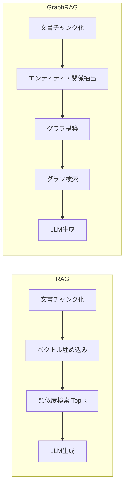

本記事は [RAG vs. GraphRAG: A Systematic Evaluation and Key Insights (arXiv:2502.11371)](https://arxiv.org/abs/2502.11371) の解説記事です。

## 論文概要（Abstract）

Retrieval-Augmented Generation（RAG）は外部知識を検索してLLMの生成品質を向上させる手法として広く採用されている。一方、Graph Retrieval-Augmented Generation（GraphRAG）はテキストをグラフ構造に変換し、関係に沿った検索を行う手法である。著者ら（Haoyu Han, Li Ma, Yu Wang, Harry Shomer, Yongjia Lei, Zhisheng Qi, Kai Guo, Zhigang Hua, Bo Long, Hui Liu, Charu C. Aggarwal, Jiliang Tang）は、両者を統一的な評価プロトコルのもとで体系比較し、質問応答とクエリベース要約における性能特性の違いを明らかにしている。さらに、両手法の長所を組み合わせるハイブリッド統合戦略を提案し、MultiHop-RAGデータセットで+6.4%の精度改善を達成している。

この記事は [Zenn記事: Neo4j×Graph-RAGで製造業の障害対応ナレッジ検索基盤を構築する](https://zenn.dev/0h_n0/articles/e5948129f3494d) の深掘りです。

## 情報源

- **arXiv ID**: 2502.11371
- **URL**: [https://arxiv.org/abs/2502.11371](https://arxiv.org/abs/2502.11371)
- **著者**: Haoyu Han, Li Ma, Yu Wang, Harry Shomer, Yongjia Lei, Zhisheng Qi, Kai Guo, Zhigang Hua, Bo Long, Hui Liu, Charu C. Aggarwal, Jiliang Tang
- **初版投稿**: 2025年2月17日（最終改訂: 2026年3月4日）
- **分野**: Information Retrieval (cs.IR)

## 背景と動機（Background & Motivation）

RAGは質問に対して関連文書をベクトル検索し、そのコンテキストをLLMに与えて回答を生成する。この構成はシンプルかつ効果的であり、多くの実用システムで採用されている。しかし、マルチホップ推論や複数エンティティの比較のように、複数の情報源を横断的に統合する必要があるクエリでは、チャンク単位の独立した検索が限界となる。

GraphRAGはこの課題に対して、テキストからエンティティと関係を抽出しグラフ構造を構築することで、関係に沿った推論を可能にする。しかし、既存のGraphRAG研究はシステム設計やタスク設定が研究ごとに異なり、RAGとの公平な比較が困難であった。

著者らはこの課題に対して、データ前処理、検索設定、生成パラメータを統一した評価プロトコルを導入し、再現可能な比較を実現している。



## 主要な貢献（Key Contributions）

- **貢献1: 統一評価プロトコル** --- データ前処理、チャンキング設定（256トークン）、埋め込みモデル（text-embedding-ada-002）、検索Top-k（10）、生成モデル（Llama-3.1-8B/70B）を統一し、公平な比較を実現している。
- **貢献2: 3つのGraphRAGバリアントの体系的比較** --- KG-GraphRAG、Community-GraphRAG、HippoRAG2の3方式を同一条件で評価し、各方式の強みと弱みを明らかにしている。
- **貢献3: ハイブリッド統合戦略** --- RAGとGraphRAGの結果を組み合わせる2つの戦略（選択と統合）を提案し、MultiHop-RAGで+6.4%の改善を達成している。

## 技術的詳細（Technical Details）

### 統一評価プロトコルの設計

著者らが設定した統一的な実験構成は以下の通りである。

| 要素 | 設定値 |
|------|--------|
| チャンクサイズ | 256トークン |
| 埋め込みモデル | text-embedding-ada-002 |
| 検索候補数 | Top-10 |
| リランカー | BAAI/bge-reranker-large（有効時） |
| 生成モデル | Llama-3.1-8B-Instruct / 70B-Instruct |
| グラフ構築モデル | GPT-4o-mini（デフォルト） |

この構成により、RAGとGraphRAGの検索戦略のみが異なる条件での比較が可能となっている。

### 3つのGraphRAGバリアントの詳細

**KG-GraphRAG**: LLMを用いてテキストから主語-述語-目的語のトリプレットを抽出し、ナレッジグラフを構築する。検索時にはクエリ中のエンティティとグラフノードを照合し、マルチホップのトリプレットを取得する。Triplets-onlyモードとTriplets+Textモード（元文書も併用）の2構成が評価されている。

**Community-GraphRAG**: 構築したKGに対して階層的コミュニティ検出を適用し、各コミュニティの要約レポートを生成する。Local検索はエンティティ近傍と低レベルコミュニティレポートを組み合わせて詳細回答を生成する。Global検索は高レベルコミュニティ要約に対するセマンティック検索でコーパス全体を俯瞰する。

**HippoRAG2**: エンティティリンクによってテキストベースのグラフを構築し、グラフスコアに基づいて元のテキストチャンクを検索する。グラフ自体から情報を取得するのではなく補助的なスコアリングとして使用するため、グラフの不完全性に対して頑健である。

### 評価データセット

| データセット | タスク | 特徴 |
|------------|--------|------|
| Natural Questions (NQ) | 単一ホップQA | Google検索クエリ、Wikipedia回答 |
| HotpotQA | マルチホップQA | ブリッジ型推論、1,000問（hard） |
| MultiHop-RAG | マルチホップQA | ニュース記事、4カテゴリ、2,556問 |
| SQuALITY | 単一文書要約 | 4,000-6,000語のストーリー |
| ODSum | 複数文書要約 | 上記のサブセット |

### ハイブリッド統合戦略

著者らはRAGとGraphRAGの長所を組み合わせる2つの戦略を提案している。

**Strategy 1（選択）**: LLMベースのルーターがクエリを分類し、事実ベースの質問にはRAG、推論ベースの質問にはGraphRAGを選択的に適用する。MultiHop-RAGで+1.1%の改善が報告されている（Llama-3.1-70B）。

**Strategy 2（統合）**: RAGとGraphRAGの両方から並列に検索を実行し、取得した証拠を連結してLLMに入力する。MultiHop-RAGで+6.4%の改善が報告されている（Llama-3.1-70B）。

統合戦略が選択戦略を3-5ポイント上回る一方で、計算コストは約2倍になるため、レイテンシ要件とのトレードオフが存在する。

## 実装のポイント（Implementation Guide）

論文の実験設定に基づく、RAGとGraphRAGの統一的な比較実装のポイントを以下に示す。

### クエリルーターの実装

ハイブリッド戦略の選択方式で使用するクエリ分類器の実装例を示す。

```python
from enum import Enum
from openai import OpenAI
from pydantic import BaseModel


class QueryType(str, Enum):
    """クエリタイプの分類。"""
    FACTUAL = "factual"
    REASONING = "reasoning"


class QueryClassification(BaseModel):
    """クエリ分類結果。

    Attributes:
        query_type: 分類されたクエリタイプ
        confidence: 分類の確信度（0-1）
        rationale: 分類理由
    """
    query_type: QueryType
    confidence: float
    rationale: str


ROUTER_PROMPT = """Classify the following query into one of two categories:
- "factual": Single-hop fact lookup, specific detail retrieval
- "reasoning": Multi-hop reasoning, comparison, temporal analysis

Query: {query}

Respond with JSON: {{"query_type": "factual"|"reasoning", "confidence": 0.0-1.0, "rationale": "..."}}"""


def classify_query(
    query: str,
    client: OpenAI | None = None,
) -> QueryClassification:
    """クエリを事実ベース/推論ベースに分類する。

    Args:
        query: 分類対象のクエリ
        client: OpenAIクライアント

    Returns:
        分類結果
    """
    if client is None:
        client = OpenAI()

    response = client.chat.completions.create(
        model="gpt-4o-mini",
        messages=[
            {"role": "user", "content": ROUTER_PROMPT.format(query=query)},
        ],
        response_format={"type": "json_object"},
        temperature=0.0,
    )
    content = response.choices[0].message.content
    return QueryClassification.model_validate_json(content)
```

### ハイブリッド検索（統合戦略）

```python
from dataclasses import dataclass


@dataclass(frozen=True)
class RetrievalResult:
    """検索結果を保持する。

    Attributes:
        chunks: 検索されたテキストチャンク
        source: 検索ソース（"rag" または "graphrag"）
        scores: 各チャンクの関連度スコア
    """
    chunks: list[str]
    source: str
    scores: list[float]


def hybrid_integrate(
    rag_result: RetrievalResult,
    graphrag_result: RetrievalResult,
    max_context_tokens: int = 4096,
) -> str:
    """RAGとGraphRAGの検索結果を統合する。

    論文のStrategy 2（統合）に対応。両方の検索結果を
    スコア順にインターリーブし、コンテキスト長制限まで連結する。

    Args:
        rag_result: RAGの検索結果
        graphrag_result: GraphRAGの検索結果
        max_context_tokens: コンテキストの最大トークン数

    Returns:
        統合されたコンテキスト文字列
    """
    all_items: list[tuple[float, str, str]] = []
    for chunk, score in zip(rag_result.chunks, rag_result.scores):
        all_items.append((score, chunk, "rag"))
    for chunk, score in zip(graphrag_result.chunks, graphrag_result.scores):
        all_items.append((score, chunk, "graphrag"))

    all_items.sort(key=lambda x: x[0], reverse=True)

    context_parts: list[str] = []
    approx_tokens = 0
    for score, chunk, source in all_items:
        chunk_tokens = len(chunk.split()) * 1.3
        if approx_tokens + chunk_tokens > max_context_tokens:
            break
        context_parts.append(f"[{source}] {chunk}")
        approx_tokens += chunk_tokens

    return "\n\n".join(context_parts)
```

## 本番デプロイメントガイド（Production Deployment Guide）

RAGとGraphRAGのハイブリッドシステムを本番環境で運用する際の構成パターンを整理する。以下のコスト試算は2026年9月時点のAWS東京リージョン（ap-northeast-1）の公開料金に基づく参考値であり、実際のコストはリクエストパターンやデータ量に依存する。

### 規模別アーキテクチャ選定

| 規模 | 日次クエリ数 | レイテンシ要件 | 推奨構成 | 月額概算 |
|------|------------|--------------|---------|---------|
| Small | ~1,000 | 5秒以内 | Lambda + OpenSearch Serverless + Neptune Serverless | $150-400 |
| Medium | ~10,000 | 2秒以内 | ECS Fargate + OpenSearch + Neptune + SQS | $800-2,000 |
| Large | ~100,000+ | 500ms以内 | EKS + OpenSearch + Neptune + ElastiCache | $3,000-8,000 |

### Small規模: サーバーレス構成

小規模なハイブリッドRAG/GraphRAGシステムでは、OpenSearch Serverlessでベクトル検索、Neptune Serverlessでグラフ検索を行い、Lambda関数でクエリルーティングと結果統合を実行する構成が適している。

```hcl
# Terraform: Small規模のハイブリッドRAG/GraphRAG基盤

resource "aws_opensearchserverless_collection" "rag_vectors" {
  name = "rag-vectors-${var.environment}"
  type = "VECTORSEARCH"
}

resource "aws_neptune_cluster" "graphrag" {
  cluster_identifier = "graphrag-${var.environment}"
  engine             = "neptune"
  serverless_v2_scaling_configuration {
    min_capacity = 1.0
    max_capacity = 8.0
  }
  storage_encrypted = true
}

resource "aws_lambda_function" "hybrid_router" {
  function_name = "hybrid-rag-router"
  runtime       = "python3.12"
  handler       = "handler.route_query"
  timeout       = 120
  memory_size   = 1024

  environment {
    variables = {
      OPENSEARCH_ENDPOINT = aws_opensearchserverless_collection.rag_vectors.collection_endpoint
      NEPTUNE_ENDPOINT    = aws_neptune_cluster.graphrag.endpoint
      ROUTING_STRATEGY    = "integrate"
      TOP_K               = "10"
    }
  }
}
```

### モニタリング構成

ハイブリッドRAG/GraphRAGシステムでは、各検索パスの性能とルーティング精度を個別に監視する。

```python
import boto3
from datetime import datetime, timezone

cloudwatch = boto3.client("cloudwatch", region_name="ap-northeast-1")


def emit_hybrid_metrics(
    query_type: str,
    rag_latency_ms: float,
    graphrag_latency_ms: float,
    routing_decision: str,
) -> None:
    """ハイブリッド検索メトリクスをCloudWatchに送信する。

    Args:
        query_type: 分類されたクエリタイプ（factual/reasoning）
        rag_latency_ms: RAG検索レイテンシ（ミリ秒）
        graphrag_latency_ms: GraphRAG検索レイテンシ（ミリ秒）
        routing_decision: ルーティング結果（rag/graphrag/integrate）
    """
    dims = [{"Name": "QueryType", "Value": query_type}]
    ts = datetime.now(timezone.utc)

    cloudwatch.put_metric_data(
        Namespace="HybridRAG/Performance",
        MetricData=[
            {"MetricName": "RAGLatency", "Value": rag_latency_ms,
             "Unit": "Milliseconds", "Dimensions": dims, "Timestamp": ts},
            {"MetricName": "GraphRAGLatency", "Value": graphrag_latency_ms,
             "Unit": "Milliseconds", "Dimensions": dims, "Timestamp": ts},
        ],
    )
```

### コスト最適化チェックリスト

- グラフ構築コストの抑制: 論文ではKG-GraphRAGの構築に7,702秒を要しており、バッチ更新（日次/週次）に限定しリアルタイム構築を避ける
- Neptune Serverlessのmin_capacityを業務時間外に1.0 NCUまで引き下げ、アイドル時のコストを削減
- 選択戦略と統合戦略の使い分け: レイテンシ要件が厳しい場合は選択戦略（+1.1%改善、計算コスト低）を採用し、精度重視の場合のみ統合戦略（+6.4%改善、計算コスト2倍）を適用
- OpenSearch Serverlessの OCU（OpenSearch Compute Unit）はインデクシングと検索で独立設定可能であり、検索OCUを固定・インデクシングOCUをバッチ時のみスケールアップする設定が有効
- CloudWatch Logsの保持期間を30日に設定し、長期保存が必要なメトリクスのみS3にエクスポート

## 実験結果（Evaluation）

### 質問応答タスクの比較

論文の実験結果より、Llama-3.1-8Bモデルでの主要な質問応答ベンチマーク結果を以下に示す。

| データセット | RAG (F1/Acc) | KG-GraphRAG | Community-Local | HippoRAG2 |
|------------|-------------|-------------|-----------------|-----------|
| NQ (F1) | 64.78% | -- | 63.01% | 61.03% |
| HotpotQA (F1) | 60.04% | -- | 61.66% | 63.01% |
| MultiHop-RAG (Acc) | 67.02% | -- | 69.01% | 70.27% |

単一ホップの質問（NQ）ではRAGがF1 64.78%で最高性能を示している。RAGのチャンクベース検索は、回答に必要な情報が一つの文書断片に集中している場合に効果的である。

一方、マルチホップの質問（HotpotQA、MultiHop-RAG）ではGraphRAGバリアントが優勢である。HippoRAG2はMultiHop-RAGで70.27%の精度を達成し、RAGの67.02%を3.25ポイント上回っている。

### MultiHop-RAGクエリタイプ別分析

MultiHop-RAGデータセットのクエリタイプ別分析では、タスクの性質による両手法の適性の違いが顕著に表れている。

| クエリタイプ | RAG | Community-Local | 差分 |
|------------|-----|-----------------|------|
| Inference | 92.16% | 89.41% | RAG +2.75 |
| Comparison | 43.18% | 45.45% | GraphRAG +2.27 |
| Temporal | 30.70% | 49.91% | GraphRAG +19.21 |
| Null（偽前提） | 91.36% | 86.42% | RAG +4.94 |

RAGはInferenceクエリ（92.16%）とNull検出（91.36%）で高い性能を示している。Nullクエリは前提に誤りのある質問であり、RAGは関連情報が見つからない場合に「回答できない」と判断しやすい。一方、GraphRAGはTemporalクエリで49.91%を達成し、RAGの30.70%を19.21ポイント上回っている。時間的な関係の推論にはグラフ構造が有効であることを示唆している。

### グラフ構築品質の影響

グラフ構築に使用するLLMの能力が性能に直接影響する。著者らはGPT-4o-miniからGPT-4oへの変更による影響を分析している。

| クエリタイプ | GPT-4o-mini | GPT-4o | 改善幅 |
|------------|-------------|--------|--------|
| Comparison | 60.16% | 66.59% | +6.43 |
| Temporal | 49.06% | 58.49% | +9.43 |
| Overall | 71.17% | 75.08% | +3.91 |

Temporalクエリでは+9.43ポイントの改善が確認されている。高品質なLLMによるトリプレット抽出は、特に時間的関係の把握で効果が大きい。

### 計算コスト分析

| メトリック | RAG | KG-GraphRAG | Community-GraphRAG |
|----------|-----|-------------|-------------------|
| 構築時間（MultiHop-RAG） | 135秒 | 7,702秒 | 5,560秒 |
| 検索時間 | 1,724ms | 14,434ms | 1,249ms |
| ストレージ | 127MB | 117MB | 165MB |

RAGの構築時間は135秒であるのに対し、KG-GraphRAGは7,702秒（約57倍）を要する。これはLLMベースのトリプレット抽出に起因する。一方、Community-GraphRAGの検索時間（1,249ms）はRAG（1,724ms）より短い。コミュニティ要約への検索が、大量のチャンクに対するベクトル検索より効率的であるためと考えられる。

### ハイブリッド戦略の結果

MultiHop-RAGデータセット（Llama-3.1-70B）でのハイブリッド戦略の結果を以下に示す。

| 戦略 | 精度 | ベースラインからの改善 |
|------|------|---------------------|
| RAG（ベースライン） | -- | -- |
| 選択戦略 | -- | +1.1% |
| 統合戦略 | -- | +6.4% |

統合戦略は両方の検索パスを並列実行するため計算コストが約2倍となるが、精度改善は選択戦略の約6倍である。著者らは「統合戦略が一貫して選択戦略を上回る」と報告している。

### グラフの不完全性

著者らは「HotpotQAデータセットではKGに構築された回答エンティティの約65.8%のみが存在し、NQでは65.5%」と報告している。すなわちLLMベースのエンティティ・関係抽出では約34-35%の情報が欠落する。この不完全性がGraphRAGの性能上限を制約する根本的な要因である。

## 実運用への応用（Practical Applications）

### Zenn記事との接続

[Zenn記事: Neo4j×Graph-RAGで製造業の障害対応ナレッジ検索基盤を構築する](https://zenn.dev/0h_n0/articles/e5948129f3494d)ではNeo4jを用いたGraphRAGの実装手法を取り上げている。本論文の知見は、製造業の障害対応システムにおけるRAGとGraphRAGの使い分けに直接応用できる。

**単一原因の障害照会にはRAG**: 「ポンプAのシール交換手順は？」のような特定手順の質問は、文書チャンクからの直接検索が効果的である。NQの結果（RAG F1 64.78% vs GraphRAG 63.01%）が単一ホップでのRAG優位を示している。

**複合障害の原因分析にはGraphRAG**: 「冷却系統の異常が電気系統に波及した事例は？」のように因果関係を横断する質問では、グラフ構造が有効である。Temporalクエリ結果（GraphRAG 49.91% vs RAG 30.70%）がこれを裏付けている。

**ハイブリッド統合の適用**: 統合戦略（+6.4%改善）を適用する場合、RAGの手順書チャンクとGraphRAGの機器間関係を連結してLLMに入力する。構築コスト（KG-GraphRAG 7,702秒 vs RAG 135秒）を考慮し、グラフ更新はバッチ処理が現実的である。

## 関連研究（Related Works）

**KG-GraphRAG（Edge et al., 2024）**: Microsoftが提案したGraphRAGの代表的手法。LLMベースのトリプレット抽出と階層的コミュニティ検出を組み合わせる。本論文ではCommunity-GraphRAGとしてLocal/Globalの2検索モードが評価されている。

**HippoRAG2（Gutierrez et al., 2025）**: テキストベースのグラフ構造をチャンク検索の補助スコアリングに使用する手法。グラフの不完全性に対してより頑健であり、MultiHop-RAGで70.27%の精度を達成している。

**RAPTOR（Sarthi et al., 2024）**: テキストチャンクを再帰的にクラスタリングし階層的要約を生成する手法。明示的なKGなしで粗粒度から細粒度までの検索を可能にする。

**Self-RAG（Asai et al., 2024）**: 検索の必要性をモデル自身が判断し、検索結果の有用性を自己評価する手法。

## まとめと今後の展望

著者らは統一評価プロトコルのもとでRAGと3つのGraphRAGバリアントを体系的に比較し、以下の知見を報告している。RAGは単一ホップの事実検索（NQ F1 64.78%）と偽前提検出（Null 91.36%）で優位であり、GraphRAGはマルチホップ推論（HotpotQA F1 63.01%）と時間的クエリ（Temporal 49.91%）で優位である。ハイブリッド統合戦略はMultiHop-RAGで+6.4%の改善を達成している。

本論文の制約として、グラフの不完全性（エンティティカバレッジ65-66%）がGraphRAG性能を制約する点、LLM-as-Judge評価の位置バイアス（順序入替で20-40ポイント変動）、小型モデル（8B）での長コンテキスト幻覚増加が挙げられる。

今後の方向として、グラフ構築精度の向上、動的クエリルーティングの高度化、インクリメンタルなグラフ更新が実務的に重要な課題である。

## 参考文献

1. Haoyu Han, Li Ma, Yu Wang, Harry Shomer, Yongjia Lei, Zhisheng Qi, Kai Guo, Zhigang Hua, Bo Long, Hui Liu, Charu C. Aggarwal, & Jiliang Tang. (2025). RAG vs. GraphRAG: A Systematic Evaluation and Key Insights. arXiv:2502.11371.
2. Edge, D., et al. (2024). From Local to Global: A Graph RAG Approach to Query-Focused Summarization. arXiv:2404.16130.
3. Gutierrez, B. J., et al. (2025). HippoRAG 2: Towards Versatile Knowledge Integration for RAG. arXiv:2502.14802.
4. Sarthi, P., et al. (2024). RAPTOR: Recursive Abstractive Processing for Tree-Organized Retrieval. ICLR 2024. arXiv:2401.18059.
5. Asai, A., et al. (2024). Self-RAG: Learning to Retrieve, Generate, and Critique through Self-Reflection. ICLR 2024. arXiv:2310.11511.
6. Lewis, P., et al. (2020). Retrieval-Augmented Generation for Knowledge-Intensive NLP Tasks. NeurIPS 2020. arXiv:2005.11401.
