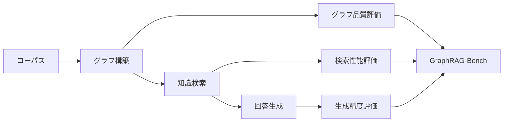

本記事は [When to use Graphs in RAG: A Comprehensive Analysis for Graph Retrieval-Augmented Generation (arXiv:2506.05690)](https://arxiv.org/abs/2506.05690) の解説記事です。

## 論文概要（Abstract）

GraphRAG（Graph Retrieval-Augmented Generation）は知識グラフを活用してRAGを改善する手法として注目されているが、実証研究では標準的なベクトルRAGを下回るケースが頻繁に報告されている。著者ら（Zhishang Xiang, Chuanjie Wu, Qinggang Zhang他）は、GraphRAGがいつ有効でいつ不利になるかを体系的に分析するベンチマーク**GraphRAG-Bench**を提案している。4段階のタスク難易度階層と2つのドメイン（医療・小説）にわたって9手法を比較評価し、単純なFact RetrievalではベクトルRAGが優位である一方、Complex ReasoningやContextual Summarizeではグラフ密度の高いGraphRAG（特にHippoRAG2）が優位になると報告している。本論文はICLR 2026に採択されている。

この記事は [Zenn記事: Neo4j×Graph-RAGで製造業の障害対応ナレッジ検索基盤を構築する](https://zenn.dev/0h_n0/articles/e5948129f3494d) の深掘りです。

## 情報源

- **arXiv ID**: 2506.05690
- **URL**: [https://arxiv.org/abs/2506.05690](https://arxiv.org/abs/2506.05690)
- **著者**: Zhishang Xiang, Chuanjie Wu, Qinggang Zhang, Shengyuan Chen, Zijin Hong, Xiao Huang, Jinsong Su
- **採択**: ICLR 2026（Conference paper）
- **分野**: Computation and Language (cs.CL)
- **GitHub**: [https://github.com/GraphRAG-Bench/GraphRAG-Benchmark](https://github.com/GraphRAG-Bench/GraphRAG-Benchmark)

## 背景と動機（Background & Motivation）

GraphRAGは、知識グラフのエンティティ間の関係を活用して、ベクトル検索だけでは捉えきれない多段階推論や文脈統合を実現する手法として研究が進んでいる。MS-GraphRAG、HippoRAG、LightRAGなど複数のフレームワークが提案され、理論的にはベクトルRAGの限界を克服できるとされてきた。

しかし実際には、多くの実世界タスクでGraphRAGがベクトルRAGを下回るという報告が相次いでいる。著者らは、この理論と実践のギャップの原因として以下の3点を指摘している。

1. **ベンチマークの不在**: GraphRAGの有効性を体系的に評価するベンチマークが存在せず、各手法がそれぞれ異なるデータセット・タスクで評価されていた
2. **タスク特性の未分類**: 単純なファクト検索と複雑な推論を区別せずに評価するため、GraphRAGの得意・不得意領域が特定できなかった
3. **パイプライン評価の欠如**: グラフ構築・検索・生成の各段階を分離して評価するフレームワークがなく、どの段階がボトルネックかを把握できなかった



## 主要な貢献（Key Contributions）

- **貢献1: GraphRAG-Benchの構築** --- 医療ガイドライン（構造化データ）と古典小説（非構造化データ）の2ドメインにわたり、4段階のタスク難易度階層で9手法を公平に比較評価できるベンチマークを構築した
- **貢献2: 段階別評価フレームワーク** --- グラフ構築（ノード数・エッジ数・平均次数・クラスタリング係数）、検索（Evidence Recall・Context Relevance）、生成（Accuracy・Faithfulness・Evidence Coverage）の各段階を独立に評価する体系を整備した
- **貢献3: 実用的設計原則の導出** --- 5つの実験的観察から、GraphRAG適用の判断基準とグラフ構築のベストプラクティスを導出した

## 技術的詳細（Technical Details）

### GraphRAG-Benchの構築パイプライン

著者らは6段階のパイプラインでベンチマークを構築している。

**Stage 1: Corpus Collection（コーパス収集）**

情報密度の異なる2種類のコーパスを選定している。

- **医療データセット**: NCCNガイドライン（National Comprehensive Cancer Network）。構造化された階層的知識で、エンティティ間の関係が明示的に定義されている
- **小説データセット**: Project Gutenbergの20世紀以前の古典小説。非構造化テキストで、登場人物間の関係が暗黙的に散在している

**Stage 2: Logic Mining（論理マイニング）**

生テキストを構造化ドメインオントロジーに変換する。エンティティ、文脈的関係、階層的依存関係を保持した形で知識構造を抽出する。

**Stage 3: Evidence Collection（エビデンス収集）**

単一知識点を含む独立サブグラフの分離と、複数ホップの関係シーケンスの再構成を行う。

**Stage 4: Question Generation（質問生成）**

孤立したサブグラフ断片からグローバルトポロジーを意識した推論まで、エビデンスタイプを段階的に統合して質問を校正する。

**Stage 5: Check & Correct（検証・修正）**

精度と実用的関連性を保証する検証プロセスを実施する。

**Stage 6: Refinement（精製）**

最終的な品質保証を行い、ベンチマークとして公開する。

### 4段階タスク階層

タスクは知識の広さ（breadth）と深さ（depth）の2軸で設計されている。

**Level 1: Fact Retrieval（ファクト検索）**

単一の知識トリプルから回答可能な直接的事実検索。平均1.25--1.40トリプルの知識幅を持つ。

例: 「フランスのどの地域にモン・サン・ミシェルがあるか？」

**Level 2: Complex Reasoning（複雑推論）**

複数文書にまたがる知識点を論理的に連鎖させる多段階推論。平均5.23--6.25ホップの推論深度を持つ。

例: 「HinzeとFeliciaの合意はイングランドの統治者とどう関係していたか？」

**Level 3: Contextual Summarize（文脈要約）**

複数の断片化された情報を論理的に統合し、構造化された回答を生成する。文脈の一貫性が重視される。

**Level 4: Creative Generation（創造的生成）**

検索コンテンツを超えた推論を伴う仮説的シナリオの生成。平均7.11--10.14トリプルの知識幅を持つ。

### グラフ品質メトリクス

著者らは構築されるグラフの品質を4指標で定量化している。

- **ノード数**: 抽出されたエンティティの総数
- **エッジ数**: エンティティ間の関係の総数
- **平均次数**: $\bar{d} = \frac{\sum_{v \in V} \deg(v)}{|V|}$ --- グラフ全体の接続性を表す
- **平均クラスタリング係数**: 各ノードの近傍における三角形完結度を評価する指標。ローカルな接続密度を測定する

ここで、$V$ はノード集合、$\deg(v)$ はノード $v$ の次数を表す。

### 評価フレームワーク

生成品質は以下の4指標で評価される。

- **Lexical Overlap**: 最長共通部分列による語彙的一致度
- **Answer Accuracy**: 回答と正解の意味的類似度
- **Faithfulness**: 生成された回答が検索コンテキストに忠実であるかの指標
- **Evidence Coverage**: 関連知識点がどの程度カバーされているかの指標

検索品質は以下の2指標で評価される。

- **Context Relevance**: 質問と検索コンテキストの意味的類似度
- **Evidence Recall**: 検索コンテンツの完全性（必要なエビデンスをどれだけ取得できたか）

## 実装のポイント（Implementation）

GraphRAG-Benchは[GitHub](https://github.com/GraphRAG-Bench/GraphRAG-Benchmark)で公開されており、以下の手順で利用できる。

```bash
# リポジトリのクローン
git clone https://github.com/GraphRAG-Bench/GraphRAG-Benchmark.git
cd GraphRAG-Benchmark

# 依存関係のインストール
pip install -r requirements.txt

# フレームワークごとに仮想環境を分離（依存関係の衝突を回避）
conda create -n hipporag2 python=3.10 -y
conda activate hipporag2
```

著者らは各フレームワークのCondaenvを分離することを推奨している。`Examples/`ディレクトリにフレームワーク別のインデックス構築・バッチ推論の手順が、`Evaluation/`ディレクトリに標準化された評価コードが格納されている。

自プロジェクトでGraphRAGの採否を判断する際は、まず対象タスクが4段階のどのレベルに該当するかを特定し、以下の判断基準を適用するとよい。

```python
from dataclasses import dataclass
from enum import Enum


class TaskLevel(Enum):
    """GraphRAG-Benchの4段階タスク階層"""
    FACT_RETRIEVAL = 1       # 単一知識点の検索
    COMPLEX_REASONING = 2   # 複数知識点の連鎖推論
    CONTEXTUAL_SUMMARIZE = 3 # 断片情報の統合
    CREATIVE_GENERATION = 4  # 検索を超えた推論


@dataclass
class GraphRAGDecision:
    """GraphRAG適用判断の結果"""
    use_graph: bool
    recommended_method: str
    reason: str
    estimated_token_cost: int  # tokens/query


def decide_graphrag(
    task_level: TaskLevel,
    corpus_structure: str,  # "structured" or "unstructured"
    latency_budget_ms: int = 5000,
) -> GraphRAGDecision:
    """GraphRAG-Benchの知見に基づくGraphRAG適用判断

    Args:
        task_level: タスクの複雑度レベル (1-4)
        corpus_structure: コーパスの構造化度合い
        latency_budget_ms: レイテンシ予算（ミリ秒）

    Returns:
        GraphRAG適用判断の結果
    """
    # Observation 1: Level 1ではベクトルRAGが優位
    if task_level == TaskLevel.FACT_RETRIEVAL:
        return GraphRAGDecision(
            use_graph=False,
            recommended_method="RAG w/ rerank",
            reason="Fact Retrievalではベクトル RAG(60.92%) >= GraphRAG",
            estimated_token_cost=900,
        )

    # Observation 2: Level 2-3ではGraphRAGが優位
    if task_level in (TaskLevel.COMPLEX_REASONING, TaskLevel.CONTEXTUAL_SUMMARIZE):
        # Observation 4: トークンコストの制約を確認
        if latency_budget_ms < 2000:
            return GraphRAGDecision(
                use_graph=True,
                recommended_method="HippoRAG2",
                reason="低レイテンシ制約下で最も効率的（~1,000 tokens/query）",
                estimated_token_cost=1_010,
            )
        return GraphRAGDecision(
            use_graph=True,
            recommended_method="HippoRAG2",
            reason="Complex Reasoning: HippoRAG2(53.38%) > RAG(42.93%)",
            estimated_token_cost=1_010,
        )

    # Level 4: Creative Generation
    return GraphRAGDecision(
        use_graph=True,
        recommended_method="HippoRAG2",
        reason="Creative Generation: HippoRAG2(48.28%) > RAG(38.26%)",
        estimated_token_cost=1_010,
    )
```

## Production Deployment Guide

GraphRAG-Benchの実験結果に基づき、GraphRAGシステムをプロダクション環境にデプロイする際のガイドを示す。論文の知見から、HippoRAG2がトークン効率と精度のバランスに優れることが示されているため、これを軸にアーキテクチャを設計する。

### AWS実装パターン（コスト最適化重視）

論文Table 2およびトークンコスト分析に基づき、GraphRAGシステムの規模別AWS構成を示す。

| 構成 | トラフィック | 主要サービス | 月額目安 |
|------|------------|-------------|---------|
| Small | ~100 req/日 | Lambda + Bedrock + Neptune Serverless | $80--200 |
| Medium | ~1,000 req/日 | ECS Fargate + Bedrock + Neptune | $500--1,200 |
| Large | 10,000+ req/日 | EKS + Spot + Neptune + Bedrock Batch | $3,000--8,000 |

**Small構成の内訳**: Lambda（$5/月）、Bedrock Claude Sonnet（$50--120/月、~1,000 tokens/queryで100 req/日）、Neptune Serverless（$15--50/月）、S3コーパス格納（$1/月）、CloudWatch（$5/月）。

**コスト削減テクニック**:
- **HippoRAG2の採用**: MS-GraphRAG（~331,000 tokens/query）比でトークンコストを99.7%削減（~1,000 tokens/query）
- **Bedrock Batch API**: 非リアルタイム処理で50%削減
- **Neptune Serverless**: アイドル時に自動スケールダウンし、最小1 NCU（$0.09/時間）で待機
- **Prompt Caching**: グラフコンテキストの反復部分をキャッシュし30--90%削減

**コスト試算の注意**: 上記は2026年9月時点のAWS ap-northeast-1（東京）リージョン料金に基づく概算値。実際のコストはトラフィックパターン、バースト使用量、モデル選択により変動する。最新料金はAWS料金計算ツールで確認を推奨する。

### Terraformインフラコード

**Small構成（Serverless: Lambda + Neptune Serverless + Bedrock）**

```hcl
# GraphRAG Small構成 - Lambda + Neptune Serverless + Bedrock
# 2026-09 ap-northeast-1

terraform {
  required_version = ">= 1.9"
  required_providers {
    aws = { source = "hashicorp/aws", version = "~> 5.70" }
  }
}

provider "aws" { region = "ap-northeast-1" }

# --- VPC（NAT Gateway不使用でコスト削減）---
resource "aws_vpc" "main" {
  cidr_block           = "10.0.0.0/16"
  enable_dns_hostnames = true
  tags = { Name = "graphrag-vpc", Project = "graphrag-bench" }
}

resource "aws_subnet" "private" {
  count             = 2
  vpc_id            = aws_vpc.main.id
  cidr_block        = "10.0.${count.index + 1}.0/24"
  availability_zone = data.aws_availability_zones.available.names[count.index]
  tags = { Name = "graphrag-private-${count.index}" }
}

data "aws_availability_zones" "available" { state = "available" }

# --- IAMロール（最小権限）---
resource "aws_iam_role" "lambda" {
  name = "graphrag-lambda-role"
  assume_role_policy = jsonencode({
    Version = "2012-10-17"
    Statement = [{
      Action = "sts:AssumeRole"
      Effect = "Allow"
      Principal = { Service = "lambda.amazonaws.com" }
    }]
  })
}

resource "aws_iam_role_policy" "lambda_bedrock" {
  name = "bedrock-invoke"
  role = aws_iam_role.lambda.id
  policy = jsonencode({
    Version = "2012-10-17"
    Statement = [{
      Effect   = "Allow"
      Action   = ["bedrock:InvokeModel"]
      Resource = "arn:aws:bedrock:ap-northeast-1::foundation-model/anthropic.claude-sonnet-*"
    }]
  })
}

# --- Neptune Serverless（グラフDB）---
resource "aws_neptune_cluster" "graph" {
  cluster_identifier  = "graphrag-kg"
  engine              = "neptune"
  serverless_v2_scaling_configuration {
    min_capacity = 1.0   # 最小1 NCU（$0.09/hr）
    max_capacity = 8.0
  }
  storage_encrypted   = true
  skip_final_snapshot = true
  tags = { Project = "graphrag-bench" }
}

# --- Lambda関数 ---
resource "aws_lambda_function" "graphrag" {
  function_name = "graphrag-query"
  role          = aws_iam_role.lambda.arn
  runtime       = "python3.12"
  handler       = "handler.lambda_handler"
  timeout       = 120
  memory_size   = 1024
  filename      = "lambda.zip"
  environment {
    variables = {
      NEPTUNE_ENDPOINT = aws_neptune_cluster.graph.endpoint
      BEDROCK_MODEL_ID = "anthropic.claude-sonnet-4-20250514"
      MAX_TOKENS       = "1024"  # HippoRAG2: ~1000 tokens/query
    }
  }
  tags = { Project = "graphrag-bench" }
}

# --- CloudWatchアラーム（コスト監視）---
resource "aws_cloudwatch_metric_alarm" "bedrock_cost" {
  alarm_name          = "graphrag-bedrock-token-spike"
  comparison_operator = "GreaterThanThreshold"
  evaluation_periods  = 1
  metric_name         = "InputTokenCount"
  namespace           = "AWS/Bedrock"
  period              = 3600
  statistic           = "Sum"
  threshold           = 500000  # 50万tokens/hr超過で通知
  alarm_actions       = []      # SNS topicのARNを指定
  tags = { Project = "graphrag-bench" }
}
```

**Large構成（Container: EKS + Karpenter + Spot）**

```hcl
# GraphRAG Large構成 - EKS + Karpenter + Spot
module "eks" {
  source          = "terraform-aws-modules/eks/aws"
  version         = "~> 20.24"
  cluster_name    = "graphrag-prod"
  cluster_version = "1.31"
  vpc_id          = aws_vpc.main.id
  subnet_ids      = aws_subnet.private[*].id

  eks_managed_node_groups = {
    system = {
      instance_types = ["m7i.large"]
      min_size       = 2
      max_size       = 4
      desired_size   = 2
    }
  }
  tags = { Project = "graphrag-bench" }
}

# Karpenter Provisioner（Spot優先で最大90%削減）
resource "kubectl_manifest" "karpenter_nodepool" {
  yaml_body = yamlencode({
    apiVersion = "karpenter.sh/v1"
    kind       = "NodePool"
    metadata   = { name = "graphrag-spot" }
    spec = {
      template = {
        spec = {
          requirements = [
            { key = "karpenter.sh/capacity-type", operator = "In", values = ["spot", "on-demand"] },
            { key = "node.kubernetes.io/instance-type", operator = "In",
              values = ["m7i.xlarge", "m6i.xlarge", "c7i.xlarge"] },
          ]
          nodeClassRef = { group = "karpenter.k8s.aws", kind = "EC2NodeClass", name = "default" }
        }
      }
      limits   = { cpu = "64", memory = "256Gi" }
      disruption = { consolidationPolicy = "WhenEmptyOrUnderutilized" }
    }
  })
}

# AWS Budgets（月額予算アラート）
resource "aws_budgets_budget" "graphrag" {
  name         = "graphrag-monthly"
  budget_type  = "COST"
  limit_amount = "5000"
  limit_unit   = "USD"
  time_unit    = "MONTHLY"
  notification {
    comparison_operator       = "GREATER_THAN"
    threshold                 = 80
    threshold_type            = "PERCENTAGE"
    notification_type         = "ACTUAL"
    subscriber_email_addresses = ["ops@example.com"]
  }
}
```

### 運用・監視設定

**CloudWatch Logs Insightsクエリ: トークンコスト異常検知**

```
fields @timestamp, @message
| filter @message like /token_count/
| stats sum(input_tokens) as total_input, sum(output_tokens) as total_output by bin(1h) as hour
| filter total_input > 500000
| sort hour desc
```

**CloudWatchアラーム: Bedrockトークン使用量スパイク検知（Python）**

```python
import boto3

cloudwatch = boto3.client("cloudwatch", region_name="ap-northeast-1")

def create_token_alarm(threshold: int = 500_000) -> None:
    """Bedrockトークン使用量の異常検知アラームを作成"""
    cloudwatch.put_metric_alarm(
        AlarmName="graphrag-bedrock-token-spike",
        MetricName="InputTokenCount",
        Namespace="AWS/Bedrock",
        Statistic="Sum",
        Period=3600,
        EvaluationPeriods=1,
        Threshold=threshold,
        ComparisonOperator="GreaterThanThreshold",
        AlarmActions=["arn:aws:sns:ap-northeast-1:ACCOUNT:graphrag-alerts"],
        Tags=[{"Key": "Project", "Value": "graphrag-bench"}],
    )
```

**X-Rayトレーシング設定（Python）**

```python
from aws_xray_sdk.core import xray_recorder, patch_all

xray_recorder.configure(service="graphrag-query")
patch_all()  # boto3の自動計装

def trace_graphrag_query(query: str, task_level: int) -> dict:
    """GraphRAGクエリにX-Rayトレースを付与"""
    segment = xray_recorder.begin_segment("graphrag-query")
    segment.put_annotation("task_level", task_level)
    segment.put_metadata("query", query, "graphrag")
    # ... クエリ実行
    xray_recorder.end_segment()
    return {"trace_id": segment.trace_id}
```

**Cost Explorer日次レポート（Python）**

```python
import boto3
from datetime import date, timedelta

ce = boto3.client("ce", region_name="us-east-1")

def daily_cost_report() -> dict:
    """GraphRAG関連の日次コストレポートを取得"""
    today = date.today()
    result = ce.get_cost_and_usage(
        TimePeriod={"Start": str(today - timedelta(days=1)), "End": str(today)},
        Granularity="DAILY",
        Filter={"Tags": {"Key": "Project", "Values": ["graphrag-bench"]}},
        Metrics=["UnblendedCost"],
        GroupBy=[{"Type": "DIMENSION", "Key": "SERVICE"}],
    )
    daily_total = sum(
        float(g["Metrics"]["UnblendedCost"]["Amount"])
        for r in result["ResultsByTime"]
        for g in r["Groups"]
    )
    if daily_total > 100:
        # SNS通知（$100/日超過）
        boto3.client("sns").publish(
            TopicArn="arn:aws:sns:ap-northeast-1:ACCOUNT:graphrag-alerts",
            Subject="GraphRAG Cost Alert",
            Message=f"Daily cost: ${daily_total:.2f}",
        )
    return {"daily_total": daily_total, "details": result}
```

### コスト最適化チェックリスト

**アーキテクチャ選択**:
- [ ] トラフィック量に応じた構成選択（Small: Serverless / Medium: Hybrid / Large: Container）
- [ ] タスクレベル判定に基づくGraphRAG適用判断（Level 1ならベクトルRAGで十分）
- [ ] HippoRAG2優先（トークン効率がMS-GraphRAGの330倍）

**リソース最適化**:
- [ ] EC2: Spot Instances優先（最大90%削減）
- [ ] Reserved Instances: Neptune/EKSに1年コミット（最大72%削減）
- [ ] Savings Plans: Compute Savings Plan検討
- [ ] Lambda: メモリサイズを1024MBに最適化（CPU性能とコストのバランス）
- [ ] Neptune: Serverless採用でアイドル時コスト最小化（最小1 NCU）

**LLMコスト削減**:
- [ ] Bedrock Batch API: 非リアルタイム処理で50%削減
- [ ] Prompt Caching有効化: グラフコンテキストの反復部分で30--90%削減
- [ ] モデル選択ロジック: Level 1はHaikuクラス、Level 2-4はSonnetクラスで切替
- [ ] トークン数制限: HippoRAG2準拠で~1,000 tokens/queryを目標

**監視・アラート**:
- [ ] AWS Budgets: 月額上限設定（閾値80%で通知）
- [ ] CloudWatch: Bedrockトークン使用量アラーム（500K tokens/hr）
- [ ] Cost Anomaly Detection: 自動異常検知有効化
- [ ] 日次コストレポート: Cost Explorer APIで自動取得

**リソース管理**:
- [ ] 未使用Neptuneスナップショット削除
- [ ] タグ戦略: `Project=graphrag-bench`で全リソースにタグ付与
- [ ] S3ライフサイクルポリシー: ログは90日でGlacierへ移行
- [ ] 開発環境: Neptune Serverlessの最大NCUを制限し夜間自動停止

## 実験結果（Results）

### Observation 1: 単純タスクではベクトルRAGが優位

論文Table 2より、Fact Retrieval（Level 1）ではRAG w/ rerankが最高精度を達成している。

| 手法 | 小説データセット（ACC %） | 医療データセット（ACC %） |
|------|:---:|:---:|
| RAG w/ rerank | **60.92** | 64.73 |
| HippoRAG2 | 60.14 | **66.28** |
| MS-GraphRAG | 49.29 | 38.63 |
| LightRAG | 58.62 | 63.32 |
| RAPTOR | 49.25 | 54.07 |

著者らは、単純なファクト検索ではグラフ構造の走査が冗長な情報を導入し、ノイズとなっている可能性を指摘している。小説データセットでは、RAG w/ rerankのEvidence Recallが83.21%に達する一方、GraphRAG系はグラフ走査により不要なエンティティも取得してしまう（論文Table 3より）。

### Observation 2: 複雑タスクではGraphRAGが優位

Complex Reasoning（Level 2）およびContextual Summarize（Level 3）では、GraphRAG手法、特にHippoRAG2が明確に優位となる。

| 手法 | Complex Reasoning（小説、ACC %） | Contextual Summarize（小説、ACC %） |
|------|:---:|:---:|
| RAG w/ rerank | 42.93 | 51.30 |
| HippoRAG2 | **53.38** | **64.10** |
| MS-GraphRAG | 50.93 | 64.40 |
| Fast-GraphRAG | 48.55 | 56.41 |
| LightRAG | 49.07 | 48.85 |

小説データセットにおけるEvidence Recallでは、HippoRAGがComplex Reasoningで87.91%、Contextual Summarizeで90.95%を達成しており、RAG w/ rerankの64.47%・73.38%を大きく上回っている（論文Table 3より）。

### Observation 3: グラフ密度が性能を左右する

著者らは、グラフの構造的特性と検索性能の間に相関があることを報告している。

| 手法 | 小説: 平均次数 | 小説: クラスタリング係数 | 医療: 平均次数 | 医療: クラスタリング係数 |
|------|:---:|:---:|:---:|:---:|
| HippoRAG2 | **8.75** | **0.657** | **13.31** | 0.497 |
| Fast-GraphRAG | 3.19 | 0.324 | 5.50 | 0.347 |
| LightRAG | 2.10 | 0.212 | 2.58 | 0.139 |
| MS-GraphRAG | 1.48 | 0.315 | 1.82 | 0.300 |
| HippoRAG | 1.73 | 0.100 | 2.06 | 0.087 |

HippoRAG2は小説データセットで平均523ノード・2,310エッジ（10kコーパストークンあたり）、医療データセットで598ノード・3,979エッジと、他手法を大幅に上回る密度のグラフを構築している。著者らは「大きなグラフ」ではなく「質の高い（密度の高い）グラフ」が重要であると結論づけている。

### Observation 4: トークンコストのトレードオフ

GraphRAG手法間でトークンコストに劇的な差が存在する。

| 手法 | 小説: tokens/query | 医療: tokens/query | RAG比 |
|------|:---:|:---:|:---:|
| RAG（Vanilla） | 879 | 954 | 1x |
| HippoRAG2 | 1,008 | 1,020 | ~1.1x |
| RAPTOR | 3,441 | 3,510 | ~3.8x |
| Fast-GraphRAG | 4,204 | 4,298 | ~4.6x |
| HippoRAG | 7,208 | 7,342 | ~7.9x |
| MS-GraphRAG（local） | 38,707 | 39,821 | ~42x |
| LightRAG | 100,832 | 100,310 | ~108x |
| MS-GraphRAG（global） | 331,375 | 332,881 | ~358x |

MS-GraphRAG（global）はクエリあたり約33万トークンを消費し、HippoRAG2の約330倍のコストがかかる。著者らは、タスク複雑度が上がるとプロンプトサイズが7,800から40,000トークンに拡大することも報告している。

### Observation 5: ドメイン特性の影響

医療データセットではHippoRAG2がComplex Reasoningで61.98%（RAG w/ rerank: 58.64%）、Creative Generationで68.05%（RAG w/ rerank: 60.61%）と優位性を示している。一方、医療データセットのFact RetrievalではRAG w/ rerankのEvidence Recallが87.83%と高く、構造化データに対するベクトル検索の強さも確認されている（論文Table 3より）。

## 実運用への応用（Practical Applications）

### 製造業でのGraphRAG適用判断基準

Zenn記事で紹介したNeo4j×Graph-RAGによる障害対応ナレッジ検索基盤に本論文の知見を適用すると、以下の判断基準が導出される。

**GraphRAGが有効なケース（Level 2-3相当）**:
- 障害の根本原因分析: 複数の障害報告書を横断して因果関係を追跡する多段階推論が必要（平均5--6ホップ）
- 類似障害のパターン要約: 過去の類似事例を統合して対応手順を生成する文脈要約タスク
- 設備間の依存関係分析: 設備A→配管B→制御盤Cのような連鎖的影響の追跡

**ベクトルRAGで十分なケース（Level 1相当）**:
- 特定部品の仕様検索: 型番・スペックなど単一知識点の検索
- マニュアルの特定セクション参照: 手順書の該当箇所の直接検索

**コスト最適化の指針**:
- HippoRAG2をベースとし、クエリあたり約1,000トークンでトークンコストを管理する
- Level 1クエリには軽量モデル（Haiku相当）、Level 2-4には高性能モデル（Sonnet相当）を動的に切り替える
- グラフ構築時は平均次数とクラスタリング係数をモニタリングし、HippoRAG2水準（平均次数 >5、クラスタリング係数 >0.3）を目指す

## 関連研究（Related Work）

- **LightRAG** (Guo et al.): デュアルレベル検索とグラフ拡張インデキシングによりスケーラビリティを改善する。ただしクエリあたり約10万トークンを消費するため、コスト面の課題がある
- **HippoRAG / HippoRAG2** (Gutierrez et al.): 神経生物学にインスパイアされたアプローチでグラフを構築する。HippoRAG2は密度の高いグラフ（平均次数8.75--13.31）を生成し、トークン効率も高い
- **MS-GraphRAG** (Microsoft): 階層的コミュニティベースの検索でlocal/globalクエリを組み合わせる。グローバルクエリでは33万トークンを消費する
- **RAPTOR** (Sarthi et al.): 再帰的抽象処理でツリー構造の検索を実現する。医療データセットのEvidence Recallでは89.70%を達成している
- **Fast-GraphRAG**: プロンプタブルな設計で高速化を図る。トークンコストは約4,200/queryとバランスが取れている

## まとめと今後の展望

GraphRAG-Benchは、GraphRAGの適用判断に初めて体系的な根拠を与えたベンチマークとして位置づけられる。著者らの実験結果から、以下の実用的知見が導出される。

1. **タスク複雑度に応じた手法選択**: Fact RetrievalにはベクトルRAG、Complex Reasoning以上にはGraphRAG（特にHippoRAG2）が推奨される
2. **グラフ密度の重要性**: ノード数・エッジ数よりも平均次数とクラスタリング係数が検索性能に寄与する
3. **コスト効率**: HippoRAG2はMS-GraphRAGの約330分の1のトークンコストで同等以上の精度を達成している

本論文の制約として、著者らは評価対象が2ドメイン・4タスクレベルに限定されている点、グラフ構築に使用するLLMの選択がグラフ品質に影響する点を挙げている。今後、より多様なドメイン（法律、金融等）やリアルタイム更新シナリオでの検証が期待される。

## 参考文献

- **arXiv**: [https://arxiv.org/abs/2506.05690](https://arxiv.org/abs/2506.05690)
- **GitHub**: [https://github.com/GraphRAG-Bench/GraphRAG-Benchmark](https://github.com/GraphRAG-Bench/GraphRAG-Benchmark)
- **ICLR 2026 Proceedings**: [https://proceedings.iclr.cc/paper_files/paper/2026/file/6c9e01d6cefbbf4cdd265032550e767f-Paper-Conference.pdf](https://proceedings.iclr.cc/paper_files/paper/2026/file/6c9e01d6cefbbf4cdd265032550e767f-Paper-Conference.pdf)
- **GraphRAG-Bench公式サイト**: [https://graphrag-bench.github.io/](https://graphrag-bench.github.io/)
- **Related Zenn article**: [https://zenn.dev/0h_n0/articles/e5948129f3494d](https://zenn.dev/0h_n0/articles/e5948129f3494d)
