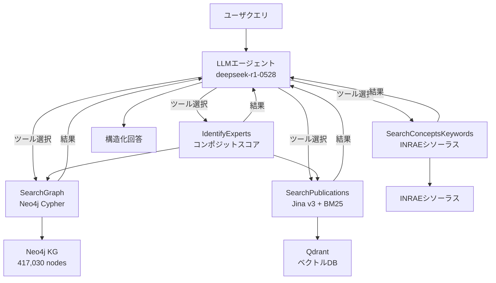
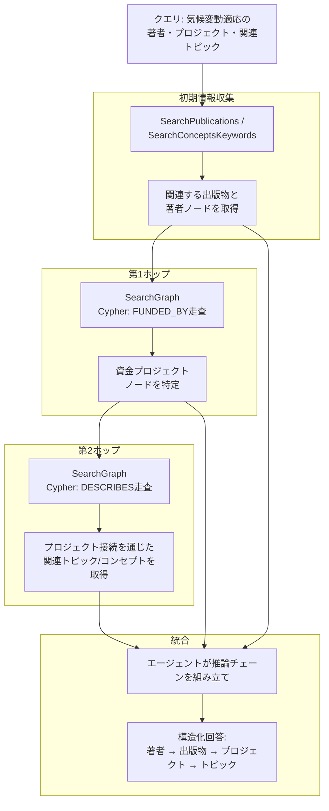

本記事は [Agentic RAG with Knowledge Graphs for Complex Multi-Hop Reasoning in Real-World Applications (arXiv:2507.16507)](https://arxiv.org/abs/2507.16507) の解説記事です。

## 論文概要（Abstract）

従来のRetrieval-Augmented Generation（RAG）システムはLLMの知識を補強するが、複数の検索ステップを要する複雑なクエリや、エンティティ間の関係を辿る推論には限界がある。著者らはフランス国立農学・食品・環境研究所（INRAE）の科学データ探索向けに、LLMベースのエージェントとマルチツールアーキテクチャを備えたAgentic RAGシステム「INRAExplorer」を提案している。41万7,030ノード・100万以上のリレーションシップからなるナレッジグラフ（KG）上で反復的なクエリ実行、網羅的なデータセット取得、マルチホップ推論を行い、構造化された包括的な回答を生成する。本論文はECAI 2025 demo trackに採択されている。

この記事は [Zenn記事: Neo4j×Graph-RAGで製造業の障害対応ナレッジ検索基盤を構築する](https://zenn.dev/0h_n0/articles/e5948129f3494d) の深掘りです。

## 情報源

- **arXiv ID**: 2507.16507
- **URL**: [https://arxiv.org/abs/2507.16507](https://arxiv.org/abs/2507.16507)
- **著者**: Jean Lelong, Adnane Errazine, Annabelle Blangero
- **発表年**: 2025
- **採択**: ECAI 2025 demo track（Frontiers in Artificial Intelligence and Applications, vol. 413, pp. 5163-5166, IOS Press）
- **分野**: cs.AI, cs.IR

## カンファレンス情報

ECAI（European Conference on Artificial Intelligence）は1974年に第1回が開催された欧州のAI分野における主要国際会議であり、2025年はデモトラックを含む幅広い発表形式を採用している。本論文は4ページのデモ論文として採択されており、INRAExplorerの実動システムとしてのアーキテクチャと能力を示す内容である。

## 背景と動機

従来のRAGシステムは、ユーザクエリに対してベクトル検索で関連文書を取得し、LLMの生成に組み込むことでハルシネーションの低減と知識の最新化を図る。しかし、以下の課題がある。

1. **単一ホップの限界**: 標準的なRAGは1回の検索で取得したチャンクのみをコンテキストとして使用するため、「著者Aの論文に関連する資金プロジェクトを見つけ、そのプロジェクトに関連する他の研究トピックを列挙せよ」といった複数ステップの推論に対応できない
2. **構造化データの活用不足**: 著者・論文・プロジェクト・研究キーワード間の関係はグラフ構造で表現されるが、従来のRAGはテキストチャンクの類似度検索に依存し、エンティティ間のリレーションを直接走査できない
3. **抽出的回答の限界**: 従来システムは関連するスニペットを抽出して結合するにとどまり、複数の情報源を統合して推論チェーンを構成する能力に欠ける

著者らはこれらの問題を解決するため、ナレッジグラフとエージェント型アーキテクチャを組み合わせたINRAExplorerを設計した。

## 主要な貢献

著者らが主張する本論文の貢献は以下の3点である。

1. **マルチツールエージェントアーキテクチャ**: 4つの専門ツール（SearchGraph、SearchPublications、SearchConceptsKeywords、IdentifyExperts）を備えたLLMエージェントにより、クエリの複雑さに応じて動的にツールを選択・連鎖実行する仕組みを構築
2. **大規模ナレッジグラフの構築**: HAL、OpenAire、INRAEシソーラス、ScanRなど複数のオープンデータソースから41万7,030ノード・100万以上のリレーションシップのKGを構築し、Neo4jに格納
3. **実運用システムとしての実証**: INRAE内部での科学文献探索を対象に、マルチホップ推論を実現するシステムを実際にデプロイし、デモとして公開

## 技術的詳細（Technical Details）

### マルチツールアーキテクチャ

INRAExplorerのエージェントはMirascope（Pythonベースの軽量LLMオーケストレーションフレームワーク）で構築され、LLMとしてdeepseek-r1-0528（オープンウェイトモデル）を使用している。エージェントはクエリの意図を解析し、以下の4つの専門ツールを動的に選択・連鎖実行する。



#### 1. SearchGraph

Neo4jに格納されたKGに対してCypherクエリを実行し、エンティティの取得やリレーションシップの走査を行うツールである。例えば「著者Xの全論文を取得する」「論文Yに関連する資金プロジェクトを探す」といった構造化データの網羅的取得に使用される。グラフ走査により、ベクトル検索では困難な関係ベースの推論を可能にする。

Cypherクエリの典型的なパターンとして、エンティティ走査（特定の著者やプロジェクトに接続されたノードの取得）と関係走査（`FUNDED_BY`、`DESCRIBES`などのリレーションシップを辿る多段ホップ）がある。

#### 2. SearchPublications

ベクトルデータベース（Qdrant）上でハイブリッド検索を実行するツールである。検索は以下の2段階で構成される。

**密ベクトル検索**: Jina v3埋め込みモデルでクエリと文書をセマンティック空間にマッピングし、コサイン類似度で上位候補を取得する。Jina v3は多言語対応の埋め込みモデルであり、科学文献の意味的類似性を捉える。

**疎ベクトル検索**: BM25アルゴリズムでキーワードベースのマッチングを行う。専門用語や固有名詞など、セマンティック検索が苦手とする正確な文字列一致を補完する。

両方の検索結果を統合した後、リランカー（例: Cohere）で最終的な順位付けを行う。文書のテキストはGROBID（科学文献PDFから構造化テキストを抽出するツール）で処理され、タイトル・アブストラクト・序論・結論を連結してベクトル化用のチャンクを形成する。

#### 3. SearchConceptsKeywords

INRAEシソーラス（制御語彙）と著者キーワードを検索し、ユーザの自然言語クエリとKG内の構造化語彙を橋渡しするツールである。例えば「気候変動への適応」というクエリに対して、シソーラス内の正式なコンセプトノード（`adaptation to climate change`など）を特定し、グラフ検索の正確なエントリポイントを提供する。クエリの曖昧性解消と関連語の提案も行う。

#### 4. IdentifyExperts

特定の研究トピックに関する専門家を特定するツールである。内部的にSearchPublicationsで関連論文を検索し、SearchGraphで著者情報を分析した上で、以下の要素からコンポジットスコアを算出する。

- 関連論文の平均的な関連度スコア
- トップ10%に入る論文の数
- 総出版物数
- 被引用数
- 研究活動期間
- 直近の出版時期

これらを重み付け統合したスコアでランキングし、スコアの内訳とともに結果を返す。

### ナレッジグラフの構成

INRAExplorerのKGは、複数のオープンデータソースを統合して構築されている。

| ノードタイプ | ノード数 | 構成比 |
|-------------|---------|-------|
| Author | 233,728 | 56.0% |
| Keyword | 96,588 | 23.2% |
| Publication | 38,791 | 9.3% |
| Software | 21,617 | 5.2% |
| Concept | 13,591 | 3.3% |
| Journal | 5,563 | 1.3% |
| Project | 3,999 | 1.0% |
| Domain | 2,595 | 0.6% |
| ResearchUnit | 299 | 0.1% |
| Dataset | 240 | 0.1% |
| Region | 19 | 0.0% |
| **合計** | **417,030** | **100%** |

リレーションシップは100万以上存在し、著者と論文の関連付け、論文とプロジェクトの資金関係（`FUNDED_BY`）、プロジェクトとコンセプトの関連（`DESCRIBES`）などを表現する。

**データソース**:
- **HAL**（Hyper Articles en Ligne）: フランスの学術論文アーカイブ。主要な出版メタデータの供給源
- **OpenAire**: 重複排除と著者・プロジェクト情報の補強
- **BBI**（Base Bibliographique INRAE）: 内部書誌データによる検証
- **ScanR**: 追加の出版物・プロジェクト情報
- **INRAEシソーラス**: 制御語彙の提供

対象期間は2019年1月から2024年8月のオープンアクセス文書に限定されている。PDFからの全文抽出にはGROBIDを使用し、タイトル・アブストラクト・キーワード・序論・結論を構造化テキストとして取得する。

### マルチホップ推論フロー

INRAExplorerの核心的な能力は、複数のツール呼び出しを連鎖させてマルチホップ推論を実現することにある。論文中の例として「INRAEで気候変動適応戦略について発表した著者を見つけ、関連する資金プロジェクトを特定し、関連トピックを列挙せよ」というクエリが示されている。



このフローでは、エージェントが中間結果を評価しながら次のツール呼び出しを決定する。各ホップの結果が次のホップの入力となり、最終的に著者・出版物・プロジェクト・トピック間の完全な関係チェーンが構成される。

### ハイブリッド検索の技術的詳細

SearchPublicationsにおけるハイブリッド検索の構成を詳細に示す。

テキスト前処理では、GROBIDで抽出したPDFの構造化テキストから、タイトル $t$、アブストラクト $a$、序論 $i$、結論 $c$ を連結してドキュメント表現 $d = t \oplus a \oplus i \oplus c$ を形成する。

**密ベクトル**: Jina v3で $d$ を埋め込みベクトル $\mathbf{v}_d \in \mathbb{R}^{n}$ に変換し、クエリ $q$ の埋め込み $\mathbf{v}_q$ とのコサイン類似度で上位 $k$ 件を取得する。

$$
\text{sim}(q, d) = \frac{\mathbf{v}_q \cdot \mathbf{v}_d}{\|\mathbf{v}_q\| \|\mathbf{v}_d\|}
$$

**疎ベクトル**: BM25スコアでキーワードマッチングを行う。

$$
\text{BM25}(q, d) = \sum_{t \in q} \text{IDF}(t) \cdot \frac{f(t, d) \cdot (k_1 + 1)}{f(t, d) + k_1 \cdot (1 - b + b \cdot \frac{|d|}{\text{avgdl}})}
$$

ここで $f(t, d)$ は文書 $d$ における語 $t$ の出現頻度、$k_1$ と $b$ はBM25のハイパーパラメータ、$\text{avgdl}$ はコーパス内の平均文書長である。

両方の検索結果をマージした後、Cohereなどのリランカーモデルで最終的な順位付けを行い、上位の候補をエージェントに返す。

## 実装のポイント

INRAExplorerの実装で使用されている主要な技術スタックを整理する。

| コンポーネント | 技術 | 役割 |
|-------------|------|------|
| エージェントオーケストレーション | Mirascope | LLMエージェントのツール呼び出し管理 |
| LLM | deepseek-r1-0528 | クエリ解析・ツール選択・回答生成 |
| ナレッジグラフDB | Neo4j | Cypherクエリによるグラフ走査 |
| ベクトルDB | Qdrant | ハイブリッド検索（密+疎ベクトル） |
| 埋め込みモデル | Jina v3 | 密ベクトル生成 |
| PDF処理 | GROBID | 科学文献PDFの構造化テキスト抽出 |
| リランカー | Cohere | 検索結果の再順位付け |

全てオープンソースまたはオープンウェイトのコンポーネントで構成されている点が特徴的であり、著者らは「open, deployable, and adaptable solution」として設計したと述べている。

### Neo4j + Cypherの実装パターン

INRAExplorerのSearchGraphツールが実行するCypherクエリの典型的なパターンを、論文中のリレーションシップ定義に基づいて示す。

```python
from dataclasses import dataclass

from neo4j import GraphDatabase


@dataclass(frozen=True)
class GraphSearchResult:
    """グラフ検索の結果を格納するデータクラス。"""

    entities: list[dict]
    relationships: list[dict]
    hop_count: int


class SearchGraphTool:
    """Neo4j KGに対するCypherクエリ実行ツール。

    INRAExplorerのSearchGraphツールの簡略化実装。
    エンティティ走査と関係走査の2パターンをサポートする。
    """

    def __init__(self, uri: str, user: str, password: str) -> None:
        self._driver = GraphDatabase.driver(uri, auth=(user, password))

    def close(self) -> None:
        """ドライバを閉じる。"""
        self._driver.close()

    def find_publications_by_author(self, author_name: str) -> GraphSearchResult:
        """著者名から全出版物を取得する（エンティティ走査）。

        Args:
            author_name: 検索対象の著者名

        Returns:
            著者の出版物リストを含むGraphSearchResult
        """
        query = """
        MATCH (a:Author)-[:AUTHORED]->(p:Publication)
        WHERE toLower(a.name) CONTAINS toLower($name)
        RETURN a.name AS author, p.title AS title,
               p.year AS year, p.doi AS doi
        ORDER BY p.year DESC
        """
        with self._driver.session() as session:
            result = session.run(query, name=author_name)
            records = [dict(r) for r in result]
        return GraphSearchResult(
            entities=records, relationships=[], hop_count=1
        )

    def find_funding_and_topics(
        self, publication_title: str
    ) -> GraphSearchResult:
        """出版物からプロジェクト・トピックへのマルチホップ走査。

        Publication -[FUNDED_BY]-> Project -[DESCRIBES]-> Concept
        の2ホップ走査を実行する。

        Args:
            publication_title: 起点となる出版物のタイトル

        Returns:
            プロジェクトと関連トピックを含むGraphSearchResult
        """
        query = """
        MATCH (p:Publication)-[:FUNDED_BY]->(proj:Project)
        WHERE toLower(p.title) CONTAINS toLower($title)
        OPTIONAL MATCH (proj)-[:DESCRIBES]->(c:Concept)
        RETURN p.title AS publication,
               proj.name AS project,
               proj.funder AS funder,
               collect(DISTINCT c.label) AS topics
        """
        with self._driver.session() as session:
            result = session.run(query, title=publication_title)
            records = [dict(r) for r in result]
        return GraphSearchResult(
            entities=records, relationships=[], hop_count=2
        )
```

### Mirascope によるエージェント構成

Mirascope を使ったマルチツールエージェントの構成パターンを示す。

```python
from mirascope.core import openai, prompt_template


@openai.call(
    model="deepseek-r1-0528",
    tools=[search_graph, search_publications, search_concepts, identify_experts],
)
@prompt_template(
    """
    SYSTEM:
    あなたはINRAEの科学文献探索エージェントです。
    ユーザのクエリに対して、利用可能なツールを適切に選択・連鎖実行し、
    構造化された包括的な回答を生成してください。

    ツール選択の指針:
    - 特定エンティティの関係走査 → SearchGraph
    - 意味的に関連する出版物の検索 → SearchPublications
    - 語彙・コンセプトの特定 → SearchConceptsKeywords
    - 研究者の特定 → IdentifyExperts

    マルチホップ推論が必要な場合は、中間結果を評価しながら
    複数のツールを段階的に呼び出してください。

    USER:
    {query}
    """
)
def agent_query(query: str): ...
```

## Production Deployment Guide

INRAExplorerのマルチツールエージェント + KG + ベクトルDB構成を本番環境にデプロイする際の設計指針を示す。

### AWSアーキテクチャパターン

| 規模 | 構成 | 想定クエリ数/日 | 月額概算(USD) |
|------|------|----------------|--------------|
| Small | ECS Fargate + Neo4j AuraDB Free + Qdrant Cloud Free | ~100 | $100-300 |
| Medium | ECS Fargate + Neo4j AuraDB Pro + Qdrant Cloud | ~1,000 | $800-2,000 |
| Large | ECS on EC2 (GPU) + Neo4j Enterprise + Qdrant self-hosted | ~10,000+ | $3,000-8,000 |

Neo4jはマネージドサービスのAuraDBを推奨する。セルフホストの場合はEC2上にNeo4j Community Editionをデプロイし、EBSボリュームでデータ永続化を行う。QdrantはSmall規模ではQdrant Cloudの無料枠が利用でき、Large規模ではECS上でセルフホストする。

### Terraform構成（Medium: ECS Fargate + Neo4j AuraDB）

```hcl
# inraexplorer/main.tf
# Medium構成: ECS Fargate + Neo4j AuraDB + Qdrant Cloud

resource "aws_ecs_cluster" "inraexplorer" {
  name = "inraexplorer-cluster"

  setting {
    name  = "containerInsights"
    value = "enabled"
  }
}

resource "aws_ecs_task_definition" "agent" {
  family                   = "inraexplorer-agent"
  requires_compatibilities = ["FARGATE"]
  network_mode             = "awsvpc"
  cpu                      = "2048"
  memory                   = "4096"
  execution_role_arn       = aws_iam_role.ecs_execution.arn
  task_role_arn            = aws_iam_role.ecs_task.arn

  container_definitions = jsonencode([{
    name  = "agent"
    image = "${aws_ecr_repository.agent.repository_url}:latest"
    portMappings = [{
      containerPort = 8000
      protocol      = "tcp"
    }]
    environment = [
      { name = "NEO4J_URI", value = var.neo4j_auradb_uri },
      { name = "QDRANT_URL", value = var.qdrant_cloud_url },
      { name = "GROBID_URL", value = "http://localhost:8070" },
      { name = "RERANKER_MODEL", value = "rerank-v3.5" },
      { name = "EMBEDDING_MODEL", value = "jina-embeddings-v3" },
      { name = "OTEL_EXPORTER_OTLP_ENDPOINT", value = "http://localhost:4317" }
    ]
    secrets = [
      {
        name      = "NEO4J_PASSWORD"
        valueFrom = aws_ssm_parameter.neo4j_password.arn
      },
      {
        name      = "QDRANT_API_KEY"
        valueFrom = aws_ssm_parameter.qdrant_api_key.arn
      },
      {
        name      = "COHERE_API_KEY"
        valueFrom = aws_ssm_parameter.cohere_api_key.arn
      }
    ]
    logConfiguration = {
      logDriver = "awslogs"
      options = {
        "awslogs-group"         = "/ecs/inraexplorer-agent"
        "awslogs-region"        = var.aws_region
        "awslogs-stream-prefix" = "agent"
      }
    }
  }])
}

resource "aws_ecs_service" "agent" {
  name            = "inraexplorer-agent"
  cluster         = aws_ecs_cluster.inraexplorer.id
  task_definition = aws_ecs_task_definition.agent.arn
  desired_count   = 2
  launch_type     = "FARGATE"

  network_configuration {
    subnets          = var.private_subnet_ids
    security_groups  = [aws_security_group.agent.id]
    assign_public_ip = false
  }

  load_balancer {
    target_group_arn = aws_lb_target_group.agent.arn
    container_name   = "agent"
    container_port   = 8000
  }
}

resource "aws_ecr_repository" "agent" {
  name                 = "inraexplorer-agent"
  image_tag_mutability = "IMMUTABLE"

  image_scanning_configuration {
    scan_on_push = true
  }
}

resource "aws_ssm_parameter" "neo4j_password" {
  name  = "/inraexplorer/neo4j-password"
  type  = "SecureString"
  value = "CHANGE_ME"

  lifecycle {
    ignore_changes = [value]
  }
}

resource "aws_ssm_parameter" "qdrant_api_key" {
  name  = "/inraexplorer/qdrant-api-key"
  type  = "SecureString"
  value = "CHANGE_ME"

  lifecycle {
    ignore_changes = [value]
  }
}

resource "aws_ssm_parameter" "cohere_api_key" {
  name  = "/inraexplorer/cohere-api-key"
  type  = "SecureString"
  value = "CHANGE_ME"

  lifecycle {
    ignore_changes = [value]
  }
}
```

### GROBID サイドカー構成

PDF処理用のGROBIDをECSサイドカーとしてデプロイする構成を示す。

```hcl
# inraexplorer/grobid_sidecar.tf

resource "aws_ecs_task_definition" "ingestion" {
  family                   = "inraexplorer-ingestion"
  requires_compatibilities = ["FARGATE"]
  network_mode             = "awsvpc"
  cpu                      = "4096"
  memory                   = "8192"
  execution_role_arn       = aws_iam_role.ecs_execution.arn

  container_definitions = jsonencode([
    {
      name  = "ingestion"
      image = "${aws_ecr_repository.agent.repository_url}:ingestion"
      environment = [
        { name = "GROBID_URL", value = "http://localhost:8070" },
        { name = "NEO4J_URI", value = var.neo4j_auradb_uri },
        { name = "QDRANT_URL", value = var.qdrant_cloud_url }
      ]
      dependsOn = [{ containerName = "grobid", condition = "HEALTHY" }]
    },
    {
      name  = "grobid"
      image = "lfoppiano/grobid:0.8.1"
      portMappings = [{ containerPort = 8070, protocol = "tcp" }]
      healthCheck = {
        command     = ["CMD-SHELL", "curl -f http://localhost:8070/api/isalive || exit 1"]
        interval    = 30
        timeout     = 5
        retries     = 3
        startPeriod = 60
      }
    }
  ])
}
```

### CloudWatch / X-Ray モニタリング

```hcl
# monitoring/main.tf

resource "aws_cloudwatch_metric_alarm" "agent_latency" {
  alarm_name          = "inraexplorer-p99-latency"
  comparison_operator = "GreaterThanThreshold"
  evaluation_periods  = 3
  metric_name         = "TargetResponseTime"
  namespace           = "AWS/ApplicationELB"
  period              = 300
  statistic           = "p99"
  threshold           = 30000
  alarm_description   = "INRAExplorer agent p99 latency > 30s"
  alarm_actions       = [aws_sns_topic.alerts.arn]

  dimensions = {
    TargetGroup  = aws_lb_target_group.agent.arn_suffix
    LoadBalancer = aws_lb.agent.arn_suffix
  }
}

resource "aws_cloudwatch_metric_alarm" "neo4j_query_latency" {
  alarm_name          = "inraexplorer-neo4j-latency"
  comparison_operator = "GreaterThanThreshold"
  evaluation_periods  = 3
  metric_name         = "Neo4jQueryDuration"
  namespace           = "INRAExplorer"
  period              = 300
  statistic           = "p95"
  threshold           = 5000
  alarm_description   = "Neo4j query p95 latency > 5s"
  alarm_actions       = [aws_sns_topic.alerts.arn]
}

resource "aws_cloudwatch_dashboard" "inraexplorer" {
  dashboard_name = "inraexplorer"
  dashboard_body = jsonencode({
    widgets = [
      {
        type   = "metric"
        x      = 0
        y      = 0
        width  = 12
        height = 6
        properties = {
          title   = "Agent Response Latency (p50/p99)"
          metrics = [
            ["AWS/ApplicationELB", "TargetResponseTime",
             "TargetGroup", aws_lb_target_group.agent.arn_suffix,
             { stat = "p50" }],
            ["...", { stat = "p99" }]
          ]
          period = 300
          region = var.aws_region
        }
      },
      {
        type   = "metric"
        x      = 12
        y      = 0
        width  = 12
        height = 6
        properties = {
          title   = "Tool Invocation Count by Type"
          metrics = [
            ["INRAExplorer", "ToolInvocations", "ToolName", "SearchGraph"],
            ["INRAExplorer", "ToolInvocations", "ToolName", "SearchPublications"],
            ["INRAExplorer", "ToolInvocations", "ToolName", "SearchConceptsKeywords"],
            ["INRAExplorer", "ToolInvocations", "ToolName", "IdentifyExperts"]
          ]
          period = 3600
          region = var.aws_region
        }
      },
      {
        type   = "metric"
        x      = 0
        y      = 6
        width  = 12
        height = 6
        properties = {
          title   = "Neo4j Query Performance"
          metrics = [
            ["INRAExplorer", "Neo4jQueryDuration", "QueryType", "entity_traversal",
             { stat = "p50" }],
            ["INRAExplorer", "Neo4jQueryDuration", "QueryType", "multi_hop",
             { stat = "p50" }]
          ]
          period = 300
          region = var.aws_region
        }
      }
    ]
  })
}

resource "aws_xray_sampling_rule" "inraexplorer" {
  rule_name      = "inraexplorer-agent"
  priority       = 1000
  reservoir_size = 10
  fixed_rate     = 0.1
  host           = "*"
  http_method    = "*"
  service_name   = "inraexplorer-agent"
  service_type   = "*"
  url_path       = "*"
  version        = 1
  resource_arn   = "*"
}
```

### コスト最適化チェックリスト

**インフラ**:
1. ECS Fargate: タスクサイズを実測ベースで最適化（CPU/メモリの使用率を監視し右サイジング）
2. Neo4j AuraDB: Free Tierで開発・検証、Pro Tierで本番運用（年間契約で割引）
3. Qdrant Cloud: Free Tierは1GBまで無料。データ量に応じてスケールアップ
4. ECR: ライフサイクルポリシーで古いイメージを自動削除
5. CloudWatch Logs: 保持期間を30日に制限

**LLM・埋め込みモデル呼び出し**:
6. deepseek-r1をセルフホスト（vLLM等）することでAPI呼び出しコストを削減
7. Jina v3の埋め込みを事前計算してQdrantに格納（インジェスト時のみ実行）
8. Cohereリランカーの呼び出し数を制限（密+疎の上位候補のみリランク）
9. ツール呼び出し結果のキャッシュ（同一Cypherクエリの結果をRedisに30分TTLで保持）
10. エージェントのツール呼び出し回数に上限を設定（無限ループ防止）

**KGインジェスションパイプライン**:
11. GROBIDはバッチ処理で実行（リアルタイム不要）
12. 差分更新で既存ノードの再処理を回避
13. HAL/OpenAireのAPIレートリミットに従い、指数バックオフで再試行
14. インジェスションをStep Functionsでオーケストレーション（失敗時の部分リトライ対応）
15. S3にPDFと抽出テキストをアーカイブ（再処理不要時のコスト削減）

**スケーリング**:
16. ECS: Application Auto Scalingでタスク数を動的調整
17. Neo4j AuraDB: 自動スケーリング対応（マネージドサービスの利点）
18. Qdrant: シャーディングでコレクションを分割（40万ノード規模では単一シャードで十分）
19. ALB: リクエストレートベースのスケーリングポリシー
20. 開発環境はスケジュールベースで夜間のdesired_countを0に設定

## 実験結果

著者らは本論文において、定量的なベンチマーク評価結果を報告していない。これは著者ら自身が認めているように、標準的なベンチマーク（例: HotpotQA, MuSiQue等）では「複雑な科学的マルチホップクエリの複雑さを捉えられない」ためである。

代わりに、論文中ではマルチホップ推論の定性的な例として以下のようなクエリが示されている。

**例: 「気候変動適応戦略について発表したINRAE著者を見つけ、資金プロジェクトを特定し、関連トピックを列挙せよ」**

このクエリに対してINRAExplorerは以下のステップで推論を実行する。

1. SearchPublicationsまたはSearchConceptsKeywordsで「climate change adaptation」に関する出版物と著者を取得
2. SearchGraphで各出版物に接続されたProjectノードを`FUNDED_BY`リレーションシップで走査
3. SearchGraphで各プロジェクトに接続されたConceptノードを`DESCRIBES`リレーションシップで走査
4. エージェントが全ステップの結果を統合し、著者→出版物→プロジェクト→トピックの関係チェーンを構成

著者らは今後の課題として、ドメイン専門家と共同で評価フレームワークを設計し、現実的なタスク定義・ゴールドスタンダード・成功基準を共同設計する必要があると述べている。また、Reinforcement Learning from Verifiable Feedback（RLVF）を用いた小型の専門エージェントモデルの訓練も計画されている。

## 実運用への応用

INRAExplorerのアーキテクチャは科学文献探索に特化しているが、マルチツールエージェント + KG + ベクトルDBの設計パターンは他のドメインに応用可能である。

**製造業の障害対応ナレッジ検索**（Zenn記事の対象ドメイン）:

INRAExplorerの設計を製造業に適用する場合、KGのノードタイプは以下のように読み替えられる。

| INRAExplorer | 製造業ナレッジ |
|-------------|-------------|
| Author | 担当エンジニア |
| Publication | 障害報告書 |
| Keyword | 障害キーワード |
| Project | 製品ライン/プロジェクト |
| Concept | 障害カテゴリ |
| Software | 使用ツール/設備 |

マルチホップ推論の例: 「設備Xで発生した振動異常の報告書を検索し、過去に同一設備で実施された対策を特定し、関連する設備ファミリの類似障害を列挙せよ」

このクエリは「障害報告書→対策→設備ファミリ→類似障害」の3ホップ走査で回答でき、INRAExplorerの「出版物→プロジェクト→コンセプト」走査と同じパターンである。

**IdentifyExpertsの応用**: 障害対応においては「この障害カテゴリに最も詳しいエンジニアは誰か」という問いが実運用上重要である。INRAExplorerのIdentifyExpertsツールのコンポジットスコアリング（対応件数、対応速度、解決率、直近の活動）をそのまま適用できる。

## 関連研究

**Graph RAG** (Edge et al., 2024): Microsoftが提案したアプローチであり、テキストからエンティティとリレーションシップを自動抽出してKGを構築し、コミュニティ検出でグラフを階層的に要約する。INRAExplorerとの主な違いは、Graph RAGがテキストからKGを自動構築するのに対し、INRAExplorerは既存の構造化データソース（HAL、OpenAire等）からKGを構築する点である。また、INRAExplorerはエージェントが動的にCypherクエリを生成・実行するのに対し、Graph RAGはコミュニティ要約に基づくmap-reduceアプローチを採用する。

**HopRAG** (Li et al., 2025, arXiv:2502.12442): ロジックを考慮したマルチホップ検索拡張生成のフレームワーク。検索グラフ上で論理的一貫性を保ちながら多段ホップ検索を行う。INRAExplorerが実運用システムのデモとしてアーキテクチャ全体を提示しているのに対し、HopRAGは検索アルゴリズム自体の改善に焦点を当てている。

**StepChain GraphRAG** (ArXiv:2510.02827): ナレッジグラフ上でステップバイステップの推論チェーンを構築するアプローチ。推論の各ステップを明示的にチェーンとして管理する点でINRAExplorerのマルチホップ推論と共通するが、StepChain GraphRAGは汎用ベンチマーク（HotpotQA等）での評価を行っている点が異なる。

**NodeRAG** (arXiv:2504.11544): 異種ノードで構造化されたグラフベースRAGフレームワーク。INRAExplorerのKGも10タイプの異種ノードで構成されており、設計思想に共通点がある。

## まとめ

INRAExplorerは、41万7,030ノード・100万以上のリレーションシップからなるナレッジグラフとマルチツールエージェントアーキテクチャを組み合わせ、科学文献の複雑なマルチホップ推論を実現するAgentic RAGシステムである。4つの専門ツール（SearchGraph、SearchPublications、SearchConceptsKeywords、IdentifyExperts）をLLMエージェントが動的に選択・連鎖実行することで、従来のRAGでは対応困難だった「著者→出版物→プロジェクト→トピック」のような多段関係走査を可能にしている。

実運用上の示唆として、以下の3点が重要である。

1. **ハイブリッド知識基盤の有効性**: ベクトルDB（セマンティック検索）とKG（構造化関係走査）の併用により、テキスト類似度検索だけでは到達できないエンティティ間の関係をカバーできる
2. **エージェントによる動的ツール選択**: クエリの複雑さに応じてツールを選択・連鎖実行するアーキテクチャにより、単純な事実検索からマルチホップ推論まで柔軟に対応できる
3. **評価の課題**: 著者らが指摘するように、複雑な科学的マルチホップクエリの評価には標準ベンチマークでは不十分であり、ドメイン専門家との共同設計による評価フレームワークが必要である

本論文はデモ論文（4ページ）であり、定量的な評価結果は今後の課題として残されている。システムのアーキテクチャと設計思想は明確に示されているが、他のAgentic RAGシステムとの定量比較や、マルチホップ推論の精度・再現率に関するデータは提供されていない点に留意が必要である。

## 参考文献

- Lelong, J., Errazine, A., & Blangero, A. (2025). Agentic RAG with Knowledge Graphs for Complex Multi-Hop Reasoning in Real-World Applications. *Frontiers in Artificial Intelligence and Applications*, 413, 5163-5166. [https://arxiv.org/abs/2507.16507](https://arxiv.org/abs/2507.16507)
- Edge, D., et al. (2024). From Local to Global: A Graph RAG Approach to Query-Focused Summarization. [https://arxiv.org/abs/2404.16130](https://arxiv.org/abs/2404.16130)
- Li, W., et al. (2025). HopRAG: Multi-Hop Reasoning for Logic-Aware Retrieval-Augmented Generation. [https://arxiv.org/abs/2502.12442](https://arxiv.org/abs/2502.12442)
- Wang, Y., et al. (2025). StepChain GraphRAG: Reasoning Over Knowledge Graphs for Multi-Hop Question Answering. [https://arxiv.org/abs/2510.02827](https://arxiv.org/abs/2510.02827)
- Yu, Z., et al. (2025). NodeRAG: Structuring Graph-based RAG with Heterogeneous Nodes. [https://arxiv.org/abs/2504.11544](https://arxiv.org/abs/2504.11544)
