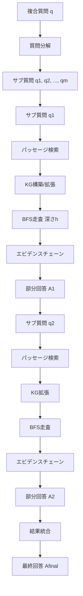
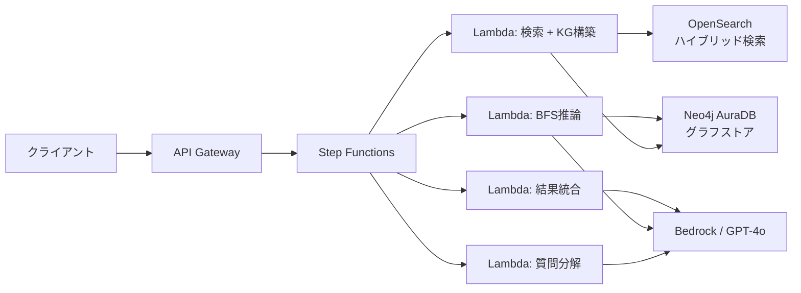

本記事は [StepChain GraphRAG: Reasoning Over Knowledge Graphs for Multi-Hop Question Answering (arXiv:2510.02827)](https://arxiv.org/abs/2510.02827) の解説記事です。

## 論文概要（Abstract）

Retrieval-Augmented Generation（RAG）を用いたマルチホップ質問応答（QA）では、複数の文書にまたがるエビデンスを正確に収集し、推論を連鎖させることが求められる。著者らは質問分解（Question Decomposition）と幅優先探索（BFS）ベースの推論フローを統合したフレームワーク StepChain GraphRAG を提案した。推論時にのみ取得パッセージからナレッジグラフを遅延構築し、各サブ質問に対して BFS 走査でエビデンスチェーンを収集する設計により、MuSiQue・2WikiMultiHopQA・HotpotQA の3データセットで平均 EM 57.67%、F1 68.53% を達成し、前 SOTA 手法 HopRAG に対して平均 EM +2.57%、F1 +2.13% の改善を報告している。

この記事は [Zenn記事: Neo4j x Graph-RAGで製造業の障害対応ナレッジ検索基盤を構築する](https://zenn.dev/0h_n0/articles/e5948129f3494d) の深掘りです。

## 情報源

- **種別**: arXiv プレプリント
- **arXiv ID**: [2510.02827](https://arxiv.org/abs/2510.02827)
- **URL**: [https://arxiv.org/abs/2510.02827](https://arxiv.org/abs/2510.02827)
- **著者**: Tengjun Ni, Xin Yuan, Shenghong Li, Kai Wu, Ren Ping Liu, Wei Ni, Wenjie Zhang
- **分野**: cs.CL (Computation and Language), cs.IR (Information Retrieval)
- **投稿日**: 2025年10月3日

## 背景と動機

マルチホップ QA は単一文書の検索では解決できない複合的な質問に回答するタスクである。たとえば「A社の創業者が卒業した大学の所在地はどこか」という質問では、(1) A社の創業者を特定し、(2) その人物の出身大学を調べ、(3) 大学の所在地を取得するという3段階の推論が必要になる。

従来の RAG 手法には以下の課題があった。

1. **単一パス検索の限界**: 標準的な RAG はクエリに対して一度だけ検索を行うため、2ホップ以上の推論に必要なエビデンスを取りこぼす。質問文に直接含まれないブリッジエンティティ（中間的な接続情報）が検索されにくい
2. **コンテキスト過負荷**: 検索結果をすべて LLM に投入すると、関連性の低いパッセージがノイズとなり、回答精度が低下する。いわゆる "lost in the middle" 問題が生じる
3. **推論経路の不透明性**: 最終回答がどのエビデンスに基づいているか追跡困難であり、回答の説明可能性が乏しい
4. **事前グラフ構築コスト**: コーパス全体を事前にナレッジグラフへ変換する手法は、大規模コーパスに対して計算・ストレージの両面で現実的でない

IRCoT（Trivedi et al., 2023）は検索と推論を交互に実行する手法で一定の改善を示したが、取得文書間の構造的関係を明示的に捉える仕組みが欠けていた。HopRAG（Liu et al., 2025）はパッセージグラフを構築して論理的接続を辿る手法だが、エンティティ間の関係を直接的にグラフ上で追跡するわけではない。著者らはこれらの制約を踏まえ、推論時の動的ナレッジグラフ構築とグラフ上の BFS 走査を組み合わせるアプローチを提案した。

## 主要な貢献

著者らが主張する本論文の貢献は以下の3点である。

1. **遅延ナレッジグラフ構築（Lazy KG Construction）**: コーパス全体を事前にパースせず、推論時に取得したパッセージのみからエンティティと関係を抽出してグラフを構築する。これにより事前構築コストを回避しつつ、質問に関連する部分グラフを効率的に生成する
2. **BFS 推論フローによる反復的マルチホップ推論**: 各サブ質問に対してシードエンティティから深さ $h$ の BFS 走査を実行し、明示的なエビデンスチェーンを収集する。サブ質問を解くたびにグラフがインクリメンタルに拡張され、後続のサブ質問でより豊かな知識構造を利用できる
3. **説明可能性の向上**: BFS 走査で得られるパスが推論の根拠を明示的に表現するため、最終回答に至る Chain-of-Thought が自然に保存される

## 技術的詳細（Technical Details）

### 全体アーキテクチャ

StepChain GraphRAG のパイプラインは5つのステージで構成される。



### ステージ1: コーパスのチャンキングとインデックス構築

コーパス $\tau_1, \tau_2, \ldots, \tau_N$ を重複付きチャンクに分割する。

$$D_i = \text{Chunk}(\tau_i) = \{c_{i,1}, c_{i,2}, \ldots, c_{i,n_i}\}$$

$$D = \bigcup_{i=1}^{N} D_i$$

著者らの実装ではチャンクサイズ1,200トークン、オーバーラップ100トークンを使用している。チャンク集合 $D$ に対してグローバルインデックス $\mathcal{I}$（dense + BM25 のハイブリッド検索）を構築する。この段階ではグラフの構築は行わない。

### ステージ2: 質問分解（Question Decomposition）

複雑なクエリ $q$ を、LLM を用いて独立に回答可能なサブ質問の列に分解する。

$$\{q_1, q_2, \ldots, q_m\} = \text{Decompose}(q)$$

著者らは「専用のプロンプトテンプレートにより LLM がクエリの異なるファセット（エンティティ定義、因果関係など）を識別するよう誘導する」と述べている。分解されたサブ質問は依存関係の順序で処理され、$q_j$ の回答が $q_{j+1}$ の文脈として利用される。

### ステージ3: 遅延ナレッジグラフ構築（Lazy KG Construction）

コーパス全体を事前にグラフ化するのではなく、サブ質問 $q_1$ に対してグローバルインデックス $\mathcal{I}$ から取得した上位 $r$ 件のパッセージのみを対象にエンティティと関係を抽出する。

エンティティ抽出は LLM プロンプトによって行われる。

$$\text{Extract}(c_{i,j}) = \{(e, \alpha_e) \mid e \text{ appears in } c_{i,j}\}$$

ここで $\alpha_e$ はエンティティの型や別名などの属性情報である。

関係抽出は同一チャンク内で共起するエンティティペアに対して実行される。

$$r = \text{Link}(e_a, e_b, c_{i,j})$$

抽出されたエンティティとエッジからグラフ $G_0 = (V_0, E_0)$ が初期化される。さらに Leiden コミュニティ検出アルゴリズムを適用してクラスタリングを行う。

$$C_G = \text{Cluster}(G) = \{C_1, C_2, \ldots, C_K\}$$

各クラスタ $C_k$ に対してサマリ $S_k$ が生成され、後続の結果統合ステージで利用される。

### ステージ4: BFS推論フロー（BFS Reasoning Flow）

各サブ質問 $q_j$ に対して、以下の手順で推論を実行する。

**手順1: シードエンティティ選択**

サブ質問 $q_j$ の埋め込みとグラフ内のエンティティ埋め込みを比較し、上位 $k$ 個のシードエンティティ $s_1, s_2, \ldots, s_k$ を選択する。

**手順2: BFS走査**

各シードエンティティ $s_u$ から深さ $h$ までの BFS を実行し、到達可能な全ノードとパスを収集する。

$$\text{BFS}(s_u, h) = \{v \in V \mid \text{dist}(s_u, v) \leq h\}$$

$$\Pi_{s_u} = \{\pi \mid \pi: s_u \to \cdots \to v, \text{dist}(s_u, v) \leq h\}$$

著者らの実装では $h = 2$ を使用している。つまり各シードから最大2ホップ先までのノードとパスを収集する。

**手順3: エビデンスチェーン構築**

収集されたパスを自然言語のエビデンスチェーンに変換する。

$$C_{q_j} = \big\Vert \text{Desc}(\pi) \big\Vert_{\pi \in \bigcup_{u=1}^{k} \Pi_{s_u}}$$

ここで $\text{Desc}(\pi)$ はパス $\pi$ を自然言語で記述する関数、$\Vert$ は連結演算子である。

**手順4: 部分回答生成**

エビデンスチェーン $C_{q_j}$ とサブ質問 $q_j$ を LLM に入力し、部分回答 $A_j$ を得る。

### ステージ5: インクリメンタルグラフ拡張と結果統合

各サブ質問の処理後、以下の手順でグラフを拡張する。

1. フロンティア $F_j$（前ステップで新たに発見されたエンティティ）を条件にグローバルインデックス $\mathcal{I}$ から追加パッセージを取得
2. 新規パッセージからエンティティと関係を抽出
3. グラフに挿入: $G.\text{add\_nodes\_from}(V_{\text{new}})$、$G.\text{add\_edges\_from}(E_{\text{new}})$
4. 次のサブ質問 $q_{j+1}$ の処理に移行

グラフのノード集合 $V$ が空になった場合は再シードが行われる。また、最小テキストサポート閾値、BFS 深さ上限、フロンティアサイズ制限、dense + BM25 のリランキングがセーフガードとして実装されている。

すべてのサブ質問が処理された後、部分回答とクラスタサマリを統合して最終回答を生成する。

$$A_{\text{merge}} = M(\{A_1, \ldots, A_m\}, \{S_1, \ldots, S_K\})$$

$$A_{\text{final}} = M(q \Vert A_{\text{merge}})$$

ここで $M$ は LLM を用いた統合関数である。

## 実装のポイント

### LLMプロンプティングによるエンティティ抽出

StepChain GraphRAG ではエンティティ・関係抽出を LLM プロンプトで実行する。事前学習済みの NER モデルや関係抽出モデルを使わず、LLM に直接チャンクを渡してエンティティとその型・属性、およびエンティティ間の関係を出力させる。この方式はドメイン固有の学習データを必要としない利点がある一方、LLM の品質に強く依存する。

### ハイブリッド検索の設計

グローバルインデックスは dense retrieval（埋め込みベース）と BM25（語彙ベース）を組み合わせたハイブリッド構成である。シードエンティティの選択にも埋め込み類似度を使用しており、グラフ構造と意味検索が相補的に機能する設計になっている。

### 非同期LLM呼び出しとキャッシング

著者らは実装最適化として、非同期 LLM 呼び出しとキャッシングを採用している。複数のサブ質問に対するエンティティ抽出や BFS 結果の記述生成を並列化することで、逐次処理に比べてレイテンシを削減している。

## Production Deployment Guide

### アーキテクチャ概要

StepChain GraphRAG を本番環境にデプロイする際のリファレンスアーキテクチャを以下に示す。グラフストアには Neo4j、ベクトル検索には OpenSearch、オーケストレーションには AWS Lambda / Step Functions を使用する構成例である。



### Terraformによるインフラ定義

以下は OpenSearch と Neo4j AuraDB を中心としたインフラの Terraform コード例である。

```hcl
# --- OpenSearch Serverless ---
resource "aws_opensearchserverless_collection" "stepchain" {
  name = "stepchain-rag"
  type = "VECTORSEARCH"

  tags = {
    Environment = "production"
    Project     = "stepchain-graphrag"
  }
}

resource "aws_opensearchserverless_security_policy" "encryption" {
  name = "stepchain-encryption"
  type = "encryption"
  policy = jsonencode({
    Rules = [{
      ResourceType = "collection"
      Resource     = ["collection/stepchain-rag"]
    }]
    AWSOwnedKey = true
  })
}

# --- Lambda: 質問分解 ---
resource "aws_lambda_function" "decompose" {
  function_name = "stepchain-decompose"
  runtime       = "python3.12"
  handler       = "handler.decompose"
  timeout       = 30
  memory_size   = 512

  environment {
    variables = {
      MODEL_ID           = "anthropic.claude-sonnet-4-20250514"
      MAX_SUB_QUESTIONS   = "5"
    }
  }
}

# --- Lambda: BFS推論 ---
resource "aws_lambda_function" "bfs_reasoning" {
  function_name = "stepchain-bfs-reasoning"
  runtime       = "python3.12"
  handler       = "handler.bfs_reason"
  timeout       = 120
  memory_size   = 1024

  environment {
    variables = {
      NEO4J_URI      = var.neo4j_uri
      NEO4J_USER     = var.neo4j_user
      BFS_DEPTH      = "2"
      TOP_K_SEEDS    = "5"
    }
  }
}

# --- Step Functions: オーケストレーション ---
resource "aws_sfn_state_machine" "stepchain_pipeline" {
  name     = "stepchain-graphrag-pipeline"
  role_arn = aws_iam_role.sfn_role.arn

  definition = jsonencode({
    StartAt = "DecomposeQuestion"
    States = {
      DecomposeQuestion = {
        Type     = "Task"
        Resource = aws_lambda_function.decompose.arn
        Next     = "ProcessSubQuestions"
      }
      ProcessSubQuestions = {
        Type      = "Map"
        ItemsPath = "$.sub_questions"
        Iterator = {
          StartAt = "RetrieveAndBuildKG"
          States = {
            RetrieveAndBuildKG = {
              Type     = "Task"
              Resource = aws_lambda_function.retrieve_kg.arn
              Next     = "BFSReasoning"
            }
            BFSReasoning = {
              Type     = "Task"
              Resource = aws_lambda_function.bfs_reasoning.arn
              End      = true
            }
          }
        }
        Next = "MergeResults"
      }
      MergeResults = {
        Type     = "Task"
        Resource = aws_lambda_function.merge.arn
        End      = true
      }
    }
  })
}
```

### Neo4jによるBFS走査の実装例

論文の BFS 推論フローを Neo4j の Cypher クエリで実装する例を示す。

```python
"""StepChain GraphRAG: Neo4j BFS推論の実装例."""

from __future__ import annotations

from dataclasses import dataclass
from typing import Any

from neo4j import GraphDatabase


@dataclass(frozen=True)
class EvidenceChain:
    """BFS走査で取得されたエビデンスチェーン."""

    path_description: str
    entities: list[str]
    relations: list[str]
    depth: int


class StepChainBFSReasoner:
    """Neo4j上でBFS推論フローを実行するクラス.

    Args:
        uri: Neo4j接続URI.
        user: Neo4jユーザー名.
        password: Neo4jパスワード.
        bfs_depth: BFS走査の最大深さ（論文ではh=2）.
    """

    def __init__(
        self,
        uri: str,
        user: str,
        password: str,
        bfs_depth: int = 2,
    ) -> None:
        self._driver = GraphDatabase.driver(uri, auth=(user, password))
        self._bfs_depth = bfs_depth

    def close(self) -> None:
        """ドライバー接続を閉じる."""
        self._driver.close()

    def upsert_entities_and_relations(
        self,
        entities: list[dict[str, Any]],
        relations: list[dict[str, Any]],
    ) -> None:
        """エンティティと関係をグラフにアップサートする.

        Args:
            entities: [{"name": str, "type": str, "attributes": dict}]
            relations: [{"source": str, "target": str, "relation": str}]
        """
        with self._driver.session() as session:
            for entity in entities:
                session.run(
                    """
                    MERGE (e:Entity {name: $name})
                    SET e.type = $type, e += $attributes
                    """,
                    name=entity["name"],
                    type=entity.get("type", "UNKNOWN"),
                    attributes=entity.get("attributes", {}),
                )
            for rel in relations:
                session.run(
                    """
                    MATCH (a:Entity {name: $source})
                    MATCH (b:Entity {name: $target})
                    MERGE (a)-[r:RELATED_TO {type: $relation}]->(b)
                    """,
                    source=rel["source"],
                    target=rel["target"],
                    relation=rel["relation"],
                )

    def bfs_traverse(
        self,
        seed_entity: str,
    ) -> list[EvidenceChain]:
        """シードエンティティからBFS走査を実行しエビデンスチェーンを収集する.

        Cypher の可変長パスパターン `*1..h` を使い、
        深さhまでの全パスを取得する。

        Args:
            seed_entity: BFS走査の起点エンティティ名.

        Returns:
            エビデンスチェーンのリスト.
        """
        query = """
        MATCH path = (seed:Entity {name: $seed})-[rels:RELATED_TO*1..$depth]-(target:Entity)
        WITH path,
             [n IN nodes(path) | n.name] AS entity_names,
             [r IN relationships(path) | r.type] AS relation_types,
             length(path) AS depth
        RETURN entity_names, relation_types, depth
        ORDER BY depth ASC
        LIMIT 50
        """
        chains: list[EvidenceChain] = []
        with self._driver.session() as session:
            result = session.run(
                query,
                seed=seed_entity,
                depth=self._bfs_depth,
            )
            for record in result:
                entities = record["entity_names"]
                relations = record["relation_types"]
                desc_parts = []
                for i, rel in enumerate(relations):
                    desc_parts.append(
                        f"{entities[i]} --[{rel}]--> {entities[i + 1]}"
                    )
                chains.append(
                    EvidenceChain(
                        path_description=" | ".join(desc_parts),
                        entities=entities,
                        relations=relations,
                        depth=record["depth"],
                    )
                )
        return chains
```

### 運用・監視設定

StepChain GraphRAG の各コンポーネントを監視するための CloudWatch メトリクスとアラーム設定例を示す。

```yaml
# cloudwatch-alarms.yaml
Resources:
  BFSLatencyAlarm:
    Type: AWS::CloudWatch::Alarm
    Properties:
      AlarmName: stepchain-bfs-latency-p99
      MetricName: BFSTraversalDuration
      Namespace: StepChainGraphRAG
      Statistic: p99
      Period: 300
      EvaluationPeriods: 3
      Threshold: 5000  # 5秒（論文では3秒未満を報告）
      ComparisonOperator: GreaterThanThreshold
      AlarmActions:
        - !Ref AlertSNSTopic

  LLMErrorRateAlarm:
    Type: AWS::CloudWatch::Alarm
    Properties:
      AlarmName: stepchain-llm-error-rate
      MetricName: LLMInvocationErrors
      Namespace: StepChainGraphRAG
      Statistic: Sum
      Period: 300
      EvaluationPeriods: 2
      Threshold: 10
      ComparisonOperator: GreaterThanThreshold

  GraphNodeCountMetric:
    Type: AWS::CloudWatch::Alarm
    Properties:
      AlarmName: stepchain-graph-node-overflow
      MetricName: GraphNodeCount
      Namespace: StepChainGraphRAG
      Statistic: Maximum
      Period: 60
      EvaluationPeriods: 1
      Threshold: 100000
      ComparisonOperator: GreaterThanThreshold
```

### コスト最適化チェックリスト

| 項目 | 推奨設定 | 根拠 |
|------|---------|------|
| BFS深さ $h$ | 2 | 論文の実験設定。$h=3$ 以上は探索空間が指数的に増大しLLMコスト増 |
| サブ質問数上限 | 5 | 分解数に比例してLLM呼び出しが増加。実用上5で十分 |
| チャンクサイズ | 1,200トークン | 論文の設定。小さすぎるとグラフが断片化、大きすぎると抽出精度低下 |
| Top-kパッセージ | 20 | 論文のTable 1で使用。増やすほど網羅性は上がるがコスト増 |
| LLMキャッシュ | 有効化必須 | 同一チャンクからの再抽出を回避。著者らも非同期+キャッシュを採用 |
| グラフノード上限 | 100,000 | 大規模コーパスでのメモリ制約。LRUでの古ノード退避を検討 |
| Neo4j AuraDB | Professional以上 | BFS走査のレイテンシがFreeティアでは不安定 |

## 実験結果

### 3データセットでの比較（GPT-4o, Top-20パッセージ）

著者らは MuSiQue、2WikiMultiHopQA、HotpotQA の各1,000件のバリデーション質問で評価を行った。以下は論文 Table 1 から抜粋した結果である。

| 手法 | MuSiQue EM | MuSiQue F1 | 2Wiki EM | 2Wiki F1 | HotpotQA EM | HotpotQA F1 |
|------|-----------|-----------|----------|----------|------------|------------|
| BM25 | 13.80 | 21.50 | 40.30 | 44.83 | 41.20 | 53.23 |
| BGE (dense) | 20.80 | 30.10 | 40.10 | 44.96 | 47.60 | 60.36 |
| GraphRAG | 12.10 | 20.22 | 22.50 | 27.49 | 31.70 | 42.74 |
| RAPTOR | 36.40 | 49.09 | 53.80 | 61.45 | 58.00 | 73.08 |
| SiReRAG | 40.50 | 53.08 | 59.60 | 67.94 | 61.70 | 76.48 |
| HopRAG | 42.20 | 54.90 | 61.10 | 68.26 | 62.00 | 76.06 |
| **StepChain** | **43.90** | **55.38** | **62.40** | **70.72** | **66.70** | **79.50** |

StepChain GraphRAG は全3データセットで最高スコアを達成している。特に HotpotQA では EM +4.70%、F1 +3.44% と最大の改善幅を報告している。一方、MuSiQue での改善幅は EM +1.70%、F1 +0.48% と相対的に小さい。著者らはこの差について、MuSiQue のホップ数が多く（3-4ホップ）、エラーの伝播が蓄積しやすいことが要因と分析している。

注目すべき点として、Microsoft の GraphRAG（Edge et al., 2024）はこのベンチマーク上では BM25 よりも低いスコアを示している。GraphRAG はクエリ集約型の要約タスクに最適化されており、正確な回答を求めるマルチホップ QA タスクとは設計目的が異なることが原因と考えられる。

### アブレーション研究

著者らは各コンポーネントの累積的な寄与を検証するアブレーション実験を実施した（論文 Table 2）。

| 構成 | 平均 EM | 平均 F1 | EM増分 |
|------|--------|--------|--------|
| GPT-4o（検索なし） | 20.77 | 28.20 | -- |
| + Graph retrieval | 22.10 | 30.15 | +1.33 |
| + Question decomposition | 36.33 | 45.80 | +14.23 |
| + Graph + Decomposition | 48.03 | 60.21 | +11.70 |
| + Reasoning flow | 50.13 | 62.24 | +2.10 |
| **Full system** | **57.67** | **68.53** | **+7.54** |

この結果から以下のことが読み取れる。

- **質問分解が最大の単独寄与**を持つ（EM +14.23）。複合質問を分割するだけで大幅な改善が得られる
- **グラフ検索と質問分解の組み合わせ**が相乗効果を発揮する（個別の合計 1.33 + 14.23 = 15.56 に対し、組み合わせでは +25.93 → 相乗効果 +10.37）
- **Full system では全コンポーネント統合**により EM が 20.77 から 57.67 へと 36.90 ポイント向上する

### モデルロバスト性（HotpotQA）

著者らは GPT-4o 以外のモデルでも StepChain GraphRAG の有効性を検証している。

| モデル | EM | F1 |
|-------|----|----|
| Llama 3.3 (70B) | 54.00 | 68.77 |
| Qwen 2.5 (72B) | 59.30 | 71.33 |
| GPT-4o | 66.70 | 79.50 |

GPT-4o が最高性能を示すものの、Qwen 2.5 (72B) でも EM 59.30% を達成しており、セルフホスト可能なオープンモデルでも実用的な精度が得られることが示唆されている。

### 計算コスト分析

著者らは計算コストについて以下のように報告している。

- **グラフ操作（検索、BFS走査、グラフ更新）**: クエリあたり3秒未満
- **LLM推論（GPT-4o）**: クエリあたり約80秒
- **セルフホスト Qwen 2.5 (72B)**: クエリあたり約90秒（RTX 6000 Ada x 2）
- **セルフホスト Llama 3.3 (70B)**: クエリあたり約94秒（RTX 6000 Ada x 2）

LLM 推論が全体のレイテンシを支配しており、グラフ操作自体は計算ボトルネックではないと報告されている。

## 実運用への応用: 製造業障害対応QA

Zenn記事で取り上げた製造業の障害対応ナレッジ検索基盤において、StepChain GraphRAG のアプローチは以下の点で有効と考えられる。

**マルチホップ推論の適用場面**: 製造業の障害対応では「装置Aのセンサー異常 → 関連する過去事例 → その事例で有効だった対策 → 対策に必要な部品の在庫状況」といった複数段階の推論が求められる。StepChain GraphRAG の質問分解と BFS 走査はこの種の連鎖的な情報探索に適合する。

**遅延KG構築の利点**: 製造業のナレッジベースは日々更新される障害レポート、メンテナンス記録、部品仕様書などで構成される。コーパス全体を事前にグラフ化するコストを回避し、クエリ時に関連文書のみからグラフを構築するアプローチは、頻繁に更新されるコーパスに適している。

**説明可能性の重要性**: 製造業では障害対応の根拠を説明できることが品質管理上重要である。BFS 走査によるエビデンスチェーンは「なぜこの対策を推奨するのか」を明示的に提示でき、現場エンジニアの信頼獲得に寄与する。

## 制約と今後の課題

著者らは以下の制約を認識している。

1. **LLMの幻覚伝播**: エンティティ抽出や関係抽出で LLM が誤った情報を出力した場合、その誤りがグラフに組み込まれ、後続の推論に伝播する可能性がある
2. **エラーカスケード**: 質問分解が逐次的であるため、初期のサブ質問での誤りが後続のサブ質問に波及する。著者らは今後の方向性として不確実性に基づく再分解やバックトラッキングの導入を挙げている
3. **専門ドメインへの適用**: 急速に変化する分野や高度に専門的なドメインでは、LLM のエンティティ抽出精度が低下する可能性がある
4. **推論コスト**: LLM 推論がレイテンシの大部分を占めており、リアルタイム応答が求められるユースケースでは量子化や投機的デコーディングによる高速化が必要である

## 関連研究

StepChain GraphRAG の位置づけを理解するために、関連する主要な研究を整理する。

| 手法 | 核心技術 | 特徴 | 文献 |
|------|---------|------|------|
| IRCoT | 検索とCoTの交互実行 | グラフ構造なし、逐次的な検索・推論 | Trivedi et al., ACL 2023 ([arXiv:2212.10509](https://arxiv.org/abs/2212.10509)) |
| GraphRAG | コミュニティ検出+サマリ | クエリ集約型要約に強い、マルチホップQAには不向き | Edge et al., 2024 ([arXiv:2404.16130](https://arxiv.org/abs/2404.16130)) |
| RAPTOR | 再帰的要約ツリー | 階層的な抽象度で検索、グラフ走査なし | Sarthi et al., ICLR 2024 ([arXiv:2401.18059](https://arxiv.org/abs/2401.18059)) |
| SiReRAG | 類似性+関連性ツリー | 2種のツリーを統合プールに展開 | Zhang et al., ICLR 2025 ([arXiv:2412.06206](https://arxiv.org/abs/2412.06206)) |
| HopRAG | パッセージグラフ+推論剪定 | 擬似クエリでエッジ構築、retrieve-reason-prune | Liu et al., ACL 2025 ([arXiv:2502.12442](https://arxiv.org/abs/2502.12442)) |
| **StepChain** | **質問分解+BFS推論** | **遅延KG構築、インクリメンタル拡張、エビデンスチェーン** | **Ni et al., 2025 ([arXiv:2510.02827](https://arxiv.org/abs/2510.02827))** |

StepChain GraphRAG は HopRAG のパッセージグラフとは異なり、エンティティレベルのナレッジグラフを動的に構築する点、および質問分解と BFS 走査を統合してサブ質問ごとにグラフを拡張する点で差別化されている。

## まとめと今後の展望

StepChain GraphRAG は、質問分解・遅延ナレッジグラフ構築・BFS 推論フローの3つの技術を統合したマルチホップ QA フレームワークである。3つのベンチマークで前 SOTA を上回る性能を達成し、特にアブレーション研究により各コンポーネントの寄与が定量的に示されている。

実運用への適用においては、(1) LLM の幻覚がグラフに伝播するリスクの管理、(2) 質問分解のエラーカスケード対策、(3) 推論レイテンシの最適化が主要な課題となる。著者らが今後の方向性として挙げている不確実性に基づくバックトラッキングや軽量化手法の研究が進めば、リアルタイム性が求められる産業応用での実用性がさらに高まると考えられる。

## 参考文献

- Ni, T., Yuan, X., Li, S., Wu, K., Liu, R. P., Ni, W., & Zhang, W. (2025). StepChain GraphRAG: Reasoning Over Knowledge Graphs for Multi-Hop Question Answering. [arXiv:2510.02827](https://arxiv.org/abs/2510.02827)
- Liu, Y., et al. (2025). HopRAG: Multi-Hop Reasoning for Logic-Aware Retrieval-Augmented Generation. ACL 2025. [arXiv:2502.12442](https://arxiv.org/abs/2502.12442)
- Edge, D., et al. (2024). From Local to Global: A Graph RAG Approach to Query-Focused Summarization. [arXiv:2404.16130](https://arxiv.org/abs/2404.16130)
- Sarthi, P., et al. (2024). RAPTOR: Recursive Abstractive Processing for Tree-Organized Retrieval. ICLR 2024. [arXiv:2401.18059](https://arxiv.org/abs/2401.18059)
- Zhang, N., et al. (2024). SiReRAG: Indexing Similar and Related Information for Multihop Reasoning. ICLR 2025. [arXiv:2412.06206](https://arxiv.org/abs/2412.06206)
- Trivedi, H., et al. (2023). Interleaving Retrieval with Chain-of-Thought Reasoning for Knowledge-Intensive Multi-Step Questions. ACL 2023. [arXiv:2212.10509](https://arxiv.org/abs/2212.10509)
- Wei, J., et al. (2022). Chain-of-Thought Prompting Elicits Reasoning in Large Language Models. NeurIPS 2022.
- Lewis, P., et al. (2020). Retrieval-Augmented Generation for Knowledge-Intensive NLP Tasks. NeurIPS 2020.
