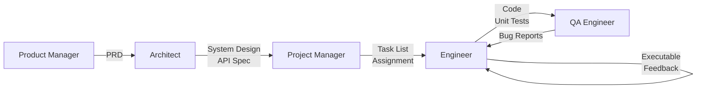

本記事は [https://arxiv.org/abs/2308.00352](https://arxiv.org/abs/2308.00352) の解説記事です。

## 論文概要

MetaGPTは、ソフトウェア開発における標準作業手順（SOP: Standardized Operating Procedures）をLLMエージェントのプロンプトシーケンスとして符号化し、Product Manager・Architect・Project Manager・Engineer・QA Engineerの5つの専門役割にタスクを分担させるマルチエージェント協調フレームワークである。著者らは、自然言語チャットではなく構造化ドキュメント（PRD、システム設計書、API仕様書）を通信手段とすることで、エージェント間の幻覚（hallucination）を抑制し、SoftwareDevベンチマークにおいて実行可能性スコア3.75/4を達成したと報告している。この記事は [Zenn記事: Claude Codeサブエージェント×git worktreeでTSモノレポ移行を並列化する](https://zenn.dev/0h_n0/articles/37710cd17e84f4) の深掘りです。

## 情報源

| 項目 | 内容 |
|------|------|
| arXiv ID | [2308.00352](https://arxiv.org/abs/2308.00352) |
| URL | [https://arxiv.org/abs/2308.00352](https://arxiv.org/abs/2308.00352) |
| 著者 | Sirui Hong, Mingchen Zhuge, Jiaqi Chen, Xiawu Zheng, et al. (Jurgen Schmidhuber含む) |
| 発表年 | 2023年8月（プレプリント）、2024年（ICLR 2024採択） |
| 分野 | cs.AI, cs.MA, cs.SE |
| 発表会議 | ICLR 2024 |
| GitHub | [https://github.com/geekan/MetaGPT](https://github.com/geekan/MetaGPT) |

## 背景と動機

LLMを用いた自律エージェント（AutoGPT、BabyAGI等）が注目を集める中、複数エージェントを協調させてソフトウェア開発を行うアプローチには根本的な課題があった。自然言語のみでエージェント間通信を行うと、各エージェントが曖昧な情報を受け取り、それをさらに曖昧に解釈して下流に渡すことで、カスケード的に幻覚が増幅される。著者らはこの問題を「hallucination cascading」と呼んでいる。

人間のソフトウェア開発チームでは、PRD（Product Requirements Document）、システム設計書、API仕様書、タスクリストといった構造化ドキュメントを介してコミュニケーションを行い、各メンバーの役割と責任が明確に定義されている。MetaGPTの着想は、このSOPをLLMエージェントのワークフローに直接組み込むことで、マルチエージェント間の情報伝達の質を担保しようとするものである。

既存手法であるChatDevやAutoGPTは、エージェント間の対話をチャット形式で行っていたが、これでは情報の構造が失われ、下流タスクに必要な仕様が欠落しやすいという問題があった。MetaGPTは「メタプログラミング」の概念を借用し、SOPそのものをプログラムとして記述することで、この課題に取り組んでいる。

## 主要な貢献

著者らが主張する本論文の貢献は以下の通りである。

1. **SOPの符号化**: 人間のソフトウェア開発プロセスにおけるSOPをLLMエージェントのプロンプトシーケンスとして形式化し、役割ベースのワークフローを実現した
2. **構造化通信プロトコル**: 自然言語チャットの代わりに、PRD・システム設計書・API仕様書・シーケンス図といった構造化ドキュメントをエージェント間通信に用いることで、hallucination cascadingを抑制した
3. **Publish-Subscribe機構**: 共有メッセージプールを導入し、各エージェントが自身の役割に関連する情報のみを購読する仕組みを構築した。これにより冗長な通信を削減しつつ必要な情報へのアクセスを保証した
4. **実行可能フィードバックループ**: Engineerエージェントが生成コードに対してユニットテストを実行し、失敗した場合は最大3回までデバッグを繰り返す仕組みを導入した
5. **包括的ベンチマーク評価**: HumanEval、MBPP、SoftwareDevの3つのベンチマークにおいて、ChatDev・AutoGPT・LangChain Agentsとの定量比較を実施した

## 技術的詳細

### アーキテクチャ

MetaGPTのアーキテクチャは、人間のソフトウェア開発組織をモデル化したアセンブリライン・パラダイムに基づいている。各エージェントは専門的な役割を持ち、前工程の出力を入力として受け取り、自身の成果物を次工程に渡す。



各役割の責務は以下の通りである。

| 役割 | 入力 | 出力 | 主な責務 |
|------|------|------|---------|
| Product Manager | ユーザー要求 | PRD、ユーザーストーリー | 要件定義、競合分析 |
| Architect | PRD | システム設計、API仕様、データ構造 | 技術選定、アーキテクチャ設計 |
| Project Manager | 設計書一式 | タスクリスト、依存関係グラフ | タスク分解、スケジューリング |
| Engineer | タスク、API仕様 | ソースコード、ユニットテスト | 実装、デバッグ |
| QA Engineer | コード一式 | テスト結果、バグレポート | 統合テスト、品質保証 |

### 通信プロトコル

MetaGPTの通信は、Publish-Subscribe機構を用いた共有メッセージプールで実現される。各エージェントは自身の購読リスト（subscription list）に基づいてメッセージを受信する。これを形式的に表現すると、エージェント $$a_i$$ の行動は以下のように定義される。

$$
\text{Action}(a_i) = f_i\bigl(\text{Role}(a_i),\; \text{Sub}(a_i, \mathcal{M}),\; \text{Prompt}(a_i)\bigr)
$$

ここで $$\text{Role}(a_i)$$ はエージェント $$a_i$$ に割り当てられた役割プロンプト、$$\text{Sub}(a_i, \mathcal{M})$$ は共有メッセージプール $$\mathcal{M}$$ から購読条件に基づいて取得したメッセージ集合、$$\text{Prompt}(a_i)$$ はSOP由来のタスク固有プロンプトである。

この機構により、Engineerは Architectの出力（API仕様）とProject Managerの出力（タスク割り当て）を直接参照できるが、Product Managerの出力（PRD）を直接読む必要はない。情報の流れが構造化されることで、各エージェントが処理すべきコンテキストの量が制御される。

### 実行可能フィードバックループ

Engineerエージェントは、コード生成後にユニットテストを自動実行する。テストが失敗した場合、エラーメッセージをコンテキストに追加して再生成を試みる。このループは最大 $$k=3$$ 回まで繰り返される。

```python
from dataclasses import dataclass
from enum import Enum


class TestResult(Enum):
    PASS = "pass"
    FAIL = "fail"


@dataclass(frozen=True)
class CodeArtifact:
    source: str
    test_source: str
    error_log: str | None = None


def executable_feedback_loop(
    task: str,
    api_spec: str,
    generate_fn,  # (task, api_spec, error_context) -> CodeArtifact
    run_tests_fn,  # (CodeArtifact) -> TestResult
    max_retries: int = 3,
) -> CodeArtifact:
    """MetaGPTの実行可能フィードバックループの概念実装.

    Engineerエージェントがコード生成→テスト実行→デバッグを
    最大max_retries回繰り返す仕組みを示す。
    """
    error_context: str | None = None

    for attempt in range(1, max_retries + 1):
        artifact = generate_fn(task, api_spec, error_context)
        result = run_tests_fn(artifact)

        if result == TestResult.PASS:
            return artifact

        error_context = (
            f"Attempt {attempt}/{max_retries} failed.\n"
            f"Error: {artifact.error_log}"
        )

    # 最終試行の成果物を返す（テスト失敗でも）
    return artifact
```

## 実装のポイント

MetaGPTの実装において注目すべき設計判断がいくつかある。

**役割プロンプトの設計**: 各エージェントの役割プロンプトには、SOPに基づく具体的な出力フォーマットが指定されている。例えばProduct Managerには「PRDをMarkdown形式で出力せよ」、Architectには「クラス図をMermaid記法で出力せよ」といった制約が課される。この制約により、下流エージェントが入力を確実にパースできる。

**コンテキスト長の管理**: 著者らは論文Table 5において、MetaGPTの平均トークン消費量が1タスクあたり31,255トークンであると報告している。これはChatDevの124,933トークンと比較して約4分の1であり、Publish-Subscribe機構による選択的情報取得がコンテキスト長の削減に寄与していることを示唆している。

**Mermaid記法の活用**: Architectエージェントが出力するシステム設計にはMermaid記法のクラス図やシーケンス図が含まれる。これにより、設計の構造がテキストとして保持されつつ、人間にも機械にも解釈可能な形式となっている。

**段階的精緻化**: 各工程の出力は次工程で段階的に精緻化される。PRDの曖昧な要件がArchitectによって技術仕様に変換され、Project Managerによって具体的なタスクに分解される。この多段階のフィルタリングが、最終成果物の品質向上に寄与していると著者らは述べている。

## Production Deployment Guide

MetaGPTのようなSOP駆動マルチエージェントシステムを本番環境にデプロイする際の、AWS上での実装パターンを示す。以下は論文の知見を踏まえた実践的な構成ガイドである。

### AWS実装パターン

| 構成 | ユースケース | 月額概算 (ap-northeast-1) | 主要サービス |
|------|-------------|--------------------------|-------------|
| Small | PoC・個人開発、1日10タスク以下 | $150-300 | Lambda, DynamoDB, SQS, S3 |
| Medium | チーム利用、1日50タスク | $800-1,500 | ECS Fargate, Aurora Serverless v2, SQS, ElastiCache |
| Large | 組織全体、1日500タスク以上 | $3,000-6,000 | EKS + Karpenter, Aurora, MSK, ElastiCache Cluster |

### Small構成: Lambda + DynamoDB

個人開発やPoCに適した構成。各エージェント役割をLambda関数として実装し、SQSで連携する。

```hcl
# --- Provider & Variables ---

terraform {
  required_version = ">= 1.6"
  required_providers {
    aws = {
      source  = "hashicorp/aws"
      version = "~> 5.60"
    }
  }
}

provider "aws" {
  region = "ap-northeast-1"
}

variable "project_name" {
  description = "Project name prefix"
  type        = string
  default     = "metagpt-agents"
}

variable "openai_api_key_arn" {
  description = "ARN of the SSM Parameter storing the LLM API key"
  type        = string
}

# --- DynamoDB: Shared Message Pool ---

resource "aws_dynamodb_table" "message_pool" {
  name         = "${var.project_name}-message-pool"
  billing_mode = "PAY_PER_REQUEST"
  hash_key     = "task_id"
  range_key    = "message_id"

  attribute {
    name = "task_id"
    type = "S"
  }

  attribute {
    name = "message_id"
    type = "S"
  }

  attribute {
    name = "role"
    type = "S"
  }

  global_secondary_index {
    name            = "role-index"
    hash_key        = "task_id"
    range_key       = "role"
    projection_type = "ALL"
  }

  point_in_time_recovery {
    enabled = true
  }

  server_side_encryption {
    enabled = true
  }

  tags = {
    Project = var.project_name
  }
}

# --- SQS: Agent Pipeline Queues ---

resource "aws_sqs_queue" "agent_queue" {
  for_each = toset([
    "product-manager",
    "architect",
    "project-manager",
    "engineer",
    "qa-engineer",
  ])

  name                       = "${var.project_name}-${each.key}"
  visibility_timeout_seconds = 900
  message_retention_seconds  = 86400
  receive_wait_time_seconds  = 20

  redrive_policy = jsonencode({
    deadLetterTargetArn = aws_sqs_queue.dlq[each.key].arn
    maxReceiveCount     = 3
  })

  sqs_managed_sse_enabled = true

  tags = {
    Project = var.project_name
    Role    = each.key
  }
}

resource "aws_sqs_queue" "dlq" {
  for_each = toset([
    "product-manager",
    "architect",
    "project-manager",
    "engineer",
    "qa-engineer",
  ])

  name                    = "${var.project_name}-${each.key}-dlq"
  message_retention_seconds = 1209600
  sqs_managed_sse_enabled = true

  tags = {
    Project = var.project_name
    Role    = each.key
  }
}

# --- IAM Role for Lambda ---

data "aws_iam_policy_document" "lambda_assume" {
  statement {
    actions = ["sts:AssumeRole"]
    principals {
      type        = "Service"
      identifiers = ["lambda.amazonaws.com"]
    }
  }
}

resource "aws_iam_role" "agent_lambda" {
  name               = "${var.project_name}-lambda-role"
  assume_role_policy = data.aws_iam_policy_document.lambda_assume.json

  tags = {
    Project = var.project_name
  }
}

data "aws_iam_policy_document" "agent_lambda_policy" {
  statement {
    sid = "DynamoDBAccess"
    actions = [
      "dynamodb:GetItem",
      "dynamodb:PutItem",
      "dynamodb:Query",
      "dynamodb:UpdateItem",
    ]
    resources = [
      aws_dynamodb_table.message_pool.arn,
      "${aws_dynamodb_table.message_pool.arn}/index/*",
    ]
  }

  statement {
    sid = "SQSAccess"
    actions = [
      "sqs:SendMessage",
      "sqs:ReceiveMessage",
      "sqs:DeleteMessage",
      "sqs:GetQueueAttributes",
    ]
    resources = [for q in aws_sqs_queue.agent_queue : q.arn]
  }

  statement {
    sid       = "SSMParameterRead"
    actions   = ["ssm:GetParameter"]
    resources = [var.openai_api_key_arn]
  }

  statement {
    sid = "CloudWatchLogs"
    actions = [
      "logs:CreateLogGroup",
      "logs:CreateLogStream",
      "logs:PutLogEvents",
    ]
    resources = ["arn:aws:logs:ap-northeast-1:*:*"]
  }
}

resource "aws_iam_role_policy" "agent_lambda" {
  name   = "${var.project_name}-lambda-policy"
  role   = aws_iam_role.agent_lambda.id
  policy = data.aws_iam_policy_document.agent_lambda_policy.json
}

# --- Lambda Functions (one per role) ---

resource "aws_lambda_function" "agent" {
  for_each = toset([
    "product-manager",
    "architect",
    "project-manager",
    "engineer",
    "qa-engineer",
  ])

  function_name = "${var.project_name}-${each.key}"
  runtime       = "python3.12"
  handler       = "handler.lambda_handler"
  role          = aws_iam_role.agent_lambda.arn
  timeout       = 900
  memory_size   = 512

  filename         = "${path.module}/lambda/${each.key}.zip"
  source_code_hash = filebase64sha256("${path.module}/lambda/${each.key}.zip")

  environment {
    variables = {
      MESSAGE_POOL_TABLE = aws_dynamodb_table.message_pool.name
      ROLE_NAME          = each.key
      API_KEY_PARAM_ARN  = var.openai_api_key_arn
    }
  }

  tracing_config {
    mode = "Active"
  }

  tags = {
    Project = var.project_name
    Role    = each.key
  }
}

# --- SQS -> Lambda Event Source Mapping ---

resource "aws_lambda_event_source_mapping" "sqs_trigger" {
  for_each = toset([
    "product-manager",
    "architect",
    "project-manager",
    "engineer",
    "qa-engineer",
  ])

  event_source_arn = aws_sqs_queue.agent_queue[each.key].arn
  function_name    = aws_lambda_function.agent[each.key].arn
  batch_size       = 1
  enabled          = true
}
```

### Large構成: EKS + Karpenter

組織全体での利用を想定した構成。Kubernetesクラスタ上で各エージェントをマイクロサービスとして運用する。

```hcl
# --- EKS Cluster with Karpenter ---

terraform {
  required_version = ">= 1.6"
  required_providers {
    aws = {
      source  = "hashicorp/aws"
      version = "~> 5.60"
    }
    helm = {
      source  = "hashicorp/helm"
      version = "~> 2.14"
    }
    kubectl = {
      source  = "alekc/kubectl"
      version = "~> 2.0"
    }
  }
}

provider "aws" {
  region = "ap-northeast-1"
}

variable "cluster_name" {
  description = "EKS cluster name"
  type        = string
  default     = "metagpt-agents-cluster"
}

variable "vpc_id" {
  description = "VPC ID for the EKS cluster"
  type        = string
}

variable "private_subnet_ids" {
  description = "List of private subnet IDs"
  type        = list(string)
}

module "eks" {
  source  = "terraform-aws-modules/eks/aws"
  version = "~> 20.0"

  cluster_name    = var.cluster_name
  cluster_version = "1.30"

  vpc_id     = var.vpc_id
  subnet_ids = var.private_subnet_ids

  cluster_endpoint_public_access = false

  cluster_addons = {
    coredns                = { most_recent = true }
    kube-proxy             = { most_recent = true }
    vpc-cni                = { most_recent = true }
    aws-ebs-csi-driver     = { most_recent = true }
  }

  eks_managed_node_groups = {
    system = {
      instance_types = ["m7i.large"]
      min_size       = 2
      max_size       = 4
      desired_size   = 2

      labels = {
        "node-role" = "system"
      }
    }
  }

  tags = {
    Project   = "metagpt-agents"
    ManagedBy = "terraform"
  }
}

# --- Karpenter NodePool for Agent Workloads ---

resource "kubectl_manifest" "karpenter_nodepool" {
  yaml_body = <<-YAML
    apiVersion: karpenter.sh/v1
    kind: NodePool
    metadata:
      name: agent-workloads
    spec:
      template:
        metadata:
          labels:
            node-role: agent
        spec:
          requirements:
            - key: karpenter.sh/capacity-type
              operator: In
              values: ["spot", "on-demand"]
            - key: node.kubernetes.io/instance-type
              operator: In
              values:
                - m7i.xlarge
                - m7i.2xlarge
                - c7i.xlarge
                - c7i.2xlarge
          nodeClassRef:
            group: karpenter.k8s.aws
            kind: EC2NodeClass
            name: default
      limits:
        cpu: "128"
        memory: 512Gi
      disruption:
        consolidationPolicy: WhenEmptyOrUnderutilized
        consolidateAfter: 60s
  YAML

  depends_on = [module.eks]
}

# --- Kubernetes Deployment for Engineer Agent ---

resource "kubectl_manifest" "engineer_deployment" {
  yaml_body = <<-YAML
    apiVersion: apps/v1
    kind: Deployment
    metadata:
      name: engineer-agent
      namespace: metagpt
      labels:
        app: metagpt
        role: engineer
    spec:
      replicas: 3
      selector:
        matchLabels:
          app: metagpt
          role: engineer
      template:
        metadata:
          labels:
            app: metagpt
            role: engineer
        spec:
          nodeSelector:
            node-role: agent
          containers:
            - name: engineer
              image: "123456789012.dkr.ecr.ap-northeast-1.amazonaws.com/metagpt-engineer:latest"
              resources:
                requests:
                  cpu: "1"
                  memory: 2Gi
                limits:
                  cpu: "2"
                  memory: 4Gi
              env:
                - name: ROLE_NAME
                  value: engineer
                - name: MESSAGE_BROKER
                  value: "kafka://msk-cluster:9092"
                - name: API_KEY
                  valueFrom:
                    secretKeyRef:
                      name: llm-api-credentials
                      key: api-key
              livenessProbe:
                httpGet:
                  path: /healthz
                  port: 8080
                initialDelaySeconds: 10
                periodSeconds: 30
              readinessProbe:
                httpGet:
                  path: /readyz
                  port: 8080
                initialDelaySeconds: 5
                periodSeconds: 10
  YAML

  depends_on = [module.eks]
}

# --- HPA for Engineer Agent ---

resource "kubectl_manifest" "engineer_hpa" {
  yaml_body = <<-YAML
    apiVersion: autoscaling/v2
    kind: HorizontalPodAutoscaler
    metadata:
      name: engineer-agent-hpa
      namespace: metagpt
    spec:
      scaleTargetRef:
        apiVersion: apps/v1
        kind: Deployment
        name: engineer-agent
      minReplicas: 2
      maxReplicas: 20
      metrics:
        - type: Resource
          resource:
            name: cpu
            target:
              type: Utilization
              averageUtilization: 70
        - type: Pods
          pods:
            metric:
              name: sqs_messages_visible
            target:
              type: AverageValue
              averageValue: "5"
  YAML

  depends_on = [module.eks]
}
```

### 運用・監視設定

マルチエージェントシステムの運用では、各エージェントの実行状況・エラー率・レイテンシを統合的に監視する必要がある。

```hcl
# --- CloudWatch Dashboard ---

resource "aws_cloudwatch_dashboard" "metagpt" {
  dashboard_name = "${var.project_name}-monitoring"

  dashboard_body = jsonencode({
    widgets = [
      {
        type   = "metric"
        x      = 0
        y      = 0
        width  = 12
        height = 6
        properties = {
          title   = "Agent Invocation Count"
          metrics = [
            for role in ["product-manager", "architect", "project-manager", "engineer", "qa-engineer"] :
            ["AWS/Lambda", "Invocations", "FunctionName", "${var.project_name}-${role}"]
          ]
          period = 300
          stat   = "Sum"
          region = "ap-northeast-1"
        }
      },
      {
        type   = "metric"
        x      = 12
        y      = 0
        width  = 12
        height = 6
        properties = {
          title   = "Agent Error Rate"
          metrics = [
            for role in ["product-manager", "architect", "project-manager", "engineer", "qa-engineer"] :
            ["AWS/Lambda", "Errors", "FunctionName", "${var.project_name}-${role}"]
          ]
          period = 300
          stat   = "Sum"
          region = "ap-northeast-1"
        }
      },
      {
        type   = "metric"
        x      = 0
        y      = 6
        width  = 12
        height = 6
        properties = {
          title   = "Agent Duration (p99)"
          metrics = [
            for role in ["product-manager", "architect", "project-manager", "engineer", "qa-engineer"] :
            ["AWS/Lambda", "Duration", "FunctionName", "${var.project_name}-${role}"]
          ]
          period = 300
          stat   = "p99"
          region = "ap-northeast-1"
        }
      },
      {
        type   = "metric"
        x      = 12
        y      = 6
        width  = 12
        height = 6
        properties = {
          title   = "DLQ Messages (Retry Exhausted)"
          metrics = [
            for role in ["product-manager", "architect", "project-manager", "engineer", "qa-engineer"] :
            ["AWS/SQS", "ApproximateNumberOfMessagesVisible", "QueueName", "${var.project_name}-${role}-dlq"]
          ]
          period = 300
          stat   = "Maximum"
          region = "ap-northeast-1"
        }
      }
    ]
  })
}

# --- CloudWatch Alarms ---

resource "aws_cloudwatch_metric_alarm" "dlq_alarm" {
  for_each = toset([
    "product-manager",
    "architect",
    "project-manager",
    "engineer",
    "qa-engineer",
  ])

  alarm_name          = "${var.project_name}-${each.key}-dlq-alarm"
  comparison_operator = "GreaterThanThreshold"
  evaluation_periods  = 1
  metric_name         = "ApproximateNumberOfMessagesVisible"
  namespace           = "AWS/SQS"
  period              = 300
  statistic           = "Maximum"
  threshold           = 0

  dimensions = {
    QueueName = "${var.project_name}-${each.key}-dlq"
  }

  alarm_actions = [aws_sns_topic.alerts.arn]

  tags = {
    Project = var.project_name
  }
}

resource "aws_sns_topic" "alerts" {
  name = "${var.project_name}-alerts"

  tags = {
    Project = var.project_name
  }
}

# --- X-Ray Tracing ---

resource "aws_xray_sampling_rule" "metagpt" {
  rule_name      = "${var.project_name}-sampling"
  priority       = 1000
  reservoir_size = 10
  fixed_rate     = 0.1
  url_path       = "*"
  host           = "*"
  http_method    = "*"
  service_type   = "*"
  service_name   = "${var.project_name}-*"
  resource_arn   = "*"
  version        = 1
}
```

### コスト最適化チェックリスト

マルチエージェントシステムは複数のLLM API呼び出しを伴うため、コスト管理が重要である。以下のチェックリストに従って最適化を行う。

**LLM API コスト**

- [ ] 全エージェントでGPT-4を使わず、役割に応じてモデルを使い分ける（Product Manager/Architect: GPT-4, Engineer: GPT-4, QA: GPT-3.5-turbo等）
- [ ] プロンプトキャッシュを有効化し、SOPプロンプト部分の再送を回避する
- [ ] 最大トークン長を役割ごとに制限する（PRD: 4K, コード: 8K等）
- [ ] バッチAPIを活用し、リアルタイム性が不要なタスクはバッチ処理する
- [ ] レスポンスのストリーミングを使用し、タイムアウトによる再試行を削減する

**AWS インフラコスト**

- [ ] Lambda関数のメモリサイズを実測値に基づいて最適化する（Power Tuningツール活用）
- [ ] DynamoDBのTTLを設定し、古いメッセージを自動削除する（推奨: 7日）
- [ ] S3ライフサイクルポリシーで成果物を30日後にIA、90日後にGlacierに移行する
- [ ] SQSメッセージ保持期間を必要最小限に設定する（デフォルト4日 → 1日に短縮可能か検討）
- [ ] CloudWatch Logsの保持期間を設定する（推奨: 30日）
- [ ] Large構成ではKarpenterのSpotインスタンス比率を70%以上に設定する
- [ ] Reserved InstancesまたはSavings Plansで固定ワークロード分を割引適用する

**アプリケーションレベル**

- [ ] Publish-Subscribe機構でメッセージサイズを監視し、不要なコンテキストを除外する
- [ ] フィードバックループの最大リトライ回数を3回に制限する（論文推奨値）
- [ ] 中間成果物（PRD、設計書等）をキャッシュし、同一要件での再生成を回避する
- [ ] 並列実行可能なタスクを特定し、シーケンシャル実行を避ける
- [ ] コード生成のテンプレート化により、定型部分のトークン消費を削減する

**監視・アラート**

- [ ] 月次コストアラートを設定する（予算の80%で警告、100%でアクション）
- [ ] タスクあたりのトークン消費量をメトリクスとして記録する（論文Table 5の31,255トークンが基準）
- [ ] DLQメッセージ数を監視し、リトライ枯渇を検知する
- [ ] エージェント間のレイテンシを計測し、ボトルネックを特定する
- [ ] Cost Explorerのタグベースレポートで役割別コストを可視化する

**セキュリティ**

- [ ] LLM APIキーはSSM Parameter StoreまたはSecrets Managerに格納する
- [ ] Lambda/EKSの実行ロールは最小権限で設定する
- [ ] VPCエンドポイントを使用し、AWS APIへのトラフィックをプライベートに保つ
- [ ] 生成コードの実行環境をサンドボックス化する（Lambda/Fargate/gVisor）
- [ ] 入力バリデーションを行い、プロンプトインジェクション攻撃を防御する

## 実験結果

著者らは3つのベンチマークでMetaGPTを評価している。

### コード生成ベンチマーク

論文Table 2より、HumanEvalおよびMBPPにおけるPass@1の結果を示す。

| 手法 | HumanEval (Pass@1) | MBPP (Pass@1) |
|------|-------------------|---------------|
| MetaGPT | **85.9%** | **87.7%** |
| CodeT (GPT-3.5) | 65.8% | 67.7% |
| GPT-4 (直接) | 67.0% | - |
| Claude (直接) | 71.2% | - |

MetaGPTがHumanEvalで85.9%を達成した点について、著者らはこれがマルチエージェントの協調効果（コードレビュー+テスト実行のフィードバック）によるものだと分析している。

### SoftwareDevベンチマーク

論文Table 3より、ソフトウェアプロジェクト全体の生成・実行能力を評価するSoftwareDevベンチマークの結果を示す。

| 手法 | 実行可能性 (0-4) | コスト ($/task) | トークン効率 (tokens/line) | 人的修正コスト |
|------|-----------------|----------------|--------------------------|--------------|
| MetaGPT | **3.75** | 1.09 | **124.3** | **0.83** |
| ChatDev | 2.25 | 0.45 | 248.9 | 2.50 |
| AutoGPT | 1.00 | 4.28 | - | - |
| LangChain | 1.00 | 3.52 | - | - |

MetaGPTは実行可能性で3.75/4を達成し、ChatDevの2.25/4を大幅に上回っている。一方でタスクあたりのコストはChatDevの0.45ドルに対して1.09ドルと高いが、人的修正コストを含めた総合的なROIでは優位であると著者らは主張している。

### Ablation Study

論文Table 4より、各役割を段階的に追加した場合の実行可能性スコアを示す。

| 構成 | エージェント数 | 実行可能性 (0-4) |
|------|-------------|-----------------|
| Engineer のみ | 1 | 1.0 |
| + Product Manager | 2 | 2.0 |
| + Architect | 3 | 2.5 |
| + Project Manager | 4 | **4.0** |

この結果は、各専門役割が段階的に品質を向上させることを示している。特にProject Managerの追加により、タスク分解と依存関係管理が改善され、実行可能性が2.5から4.0に跳ね上がる点が注目に値する。著者らはProject Managerの役割が、Engineerへの入力を適切な粒度に分解することで、コード生成の成功率を大幅に向上させていると分析している。

### LLMバックエンドによる性能差

論文中で報告されているLLMバックエンド別の性能差も重要である。

| LLMバックエンド | 実行可能性 (0-4) |
|----------------|-----------------|
| GPT-4 | 3.8 |
| GPT-3.5-turbo | 2.8 |
| DeepSeek 33B (OSS) | 1.4 |

この結果は、マルチエージェントフレームワークの性能がバックエンドLLMの能力に強く依存することを示しており、フレームワーク設計だけでなくモデル選択が実運用において重要な設計判断であることを示唆している。

## 実運用への応用

MetaGPTの設計パターンは、LLMエージェントを用いた実際のソフトウェア開発自動化に多くの示唆を与えている。

**SOP駆動設計の汎用性**: MetaGPTのSOP符号化アプローチは、ソフトウェア開発に限定されない。例えば、技術ドキュメントの作成（調査→構成→執筆→レビュー）、データパイプラインの構築（要件定義→スキーマ設計→ETL実装→検証）など、明確な手順が定義可能なタスクに応用できる。

**Claude Codeサブエージェントとの対応**: Zenn記事「Claude Codeサブエージェント×git worktreeでTSモノレポ移行を並列化する」で述べられているサブエージェント設計パターンは、MetaGPTの専門役割分担と直接対応する。Claude Codeにおいても、各サブエージェントに明確な役割プロンプトとスコープを定義し、構造化された成果物（コード、テスト結果、設計書）を受け渡すことで、品質の高い協調作業が実現できる。

**構造化通信の実践**: 自然言語チャットではなく、JSON/YAML/Markdownといった構造化フォーマットでエージェント間通信を行うことの有効性は、実運用でも確認されている。特にCI/CDパイプラインとの統合においては、構造化出力が機械的に検証可能であることが大きな利点となる。

**コスト管理**: 論文Table 5で報告されている31,255トークン/タスクという数値は、実運用でのコスト見積もりの基準として有用である。GPT-4利用時でタスクあたり約1ドルのLLMコストは、人間の開発者の時給と比較して十分に低いが、大規模運用ではバッチ処理やモデルの使い分けによる最適化が必要となる。

## 関連研究

MetaGPTの位置づけを理解するために、関連する代表的な研究を挙げる。

- **ChatDev** (Qian et al., 2023): チャット形式でエージェントを対話させるアプローチ。MetaGPTと比較して構造化通信を持たず、実行可能性スコアが低い
- **AutoGen** (Wu et al., 2023, Microsoft): 柔軟なマルチエージェント会話フレームワーク。SOPの概念は持たないが、人間を含むエージェント間の対話パターンを柔軟に定義できる
- **SWE-agent** (Yang et al., 2024, Princeton): 既存リポジトリのIssue修正に特化したエージェント。MetaGPTがゼロからのプロジェクト生成を対象とするのに対し、SWE-agentは既存コードベースの修正を対象とする
- **AutoGPT** (Significant Gravitas, 2023): 汎用タスク自律実行エージェント。ソフトウェア開発に特化していないため、実行可能性スコアが低い
- **CAMEL** (Li et al., 2023): ロールプレイ型マルチエージェントフレームワーク。2エージェント間の対話に焦点を当てている点でMetaGPTとは異なる

## まとめと今後の展望

MetaGPTは、SOPの符号化・構造化通信・専門役割分担という3つの設計原則により、マルチエージェントによるソフトウェア開発の実行可能性を大幅に向上させたフレームワークである。SoftwareDevベンチマークでの3.75/4というスコアは、LLMエージェントがチーム協調でソフトウェアを生成する可能性を示している。

ただし、著者らも指摘している通り、UI/フロントエンド開発への対応（マルチモーダルツールが未実装）、クロスプロジェクト学習の欠如、LLMバックエンドへの強い依存といった課題が残されている。今後は、RAG（Retrieval-Augmented Generation）による組織固有のコーディング規約の注入、マルチモーダルエージェントの統合、より軽量なOSSモデルでの性能向上が研究の方向性として期待される。

## 参考文献

1. Hong, S., Zhuge, M., Chen, J., Zheng, X., et al. (2023). "MetaGPT: Meta Programming for A Multi-Agent Collaborative Framework." arXiv:2308.00352. ICLR 2024.
2. Qian, C., Cong, X., Yang, C., et al. (2023). "Communicative Agents for Software Development." arXiv:2307.07924.
3. Wu, Q., Bansal, G., Zhang, J., et al. (2023). "AutoGen: Enabling Next-Gen LLM Applications via Multi-Agent Conversation." arXiv:2308.08155.
4. Yang, J., Jimenez, C. E., Wettig, A., et al. (2024). "SWE-agent: Agent-Computer Interfaces Enable Automated Software Engineering." arXiv:2405.15793.
5. Li, G., Hammoud, H. A. A. K., Itani, H., et al. (2023). "CAMEL: Communicative Agents for 'Mind' Exploration of Large Language Model Society." arXiv:2303.17760.
