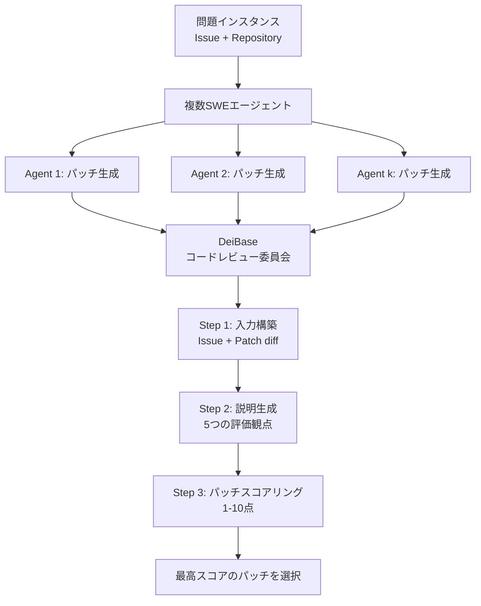

本記事は [https://arxiv.org/abs/2408.07060](https://arxiv.org/abs/2408.07060) の解説記事です。

## 論文概要（Abstract）

DEI（Diversity Empowered Intelligence）は、異なる得意分野を持つ複数のソフトウェアエンジニアリング（SWE）エージェントを統合するメタポリシーフレームワークである。著者らは、問題インスタンスの文脈に基づいて最適なエージェントを選択する手法を文脈付きマルコフ決定過程（CMDP）として定式化し、SWE-Bench Liteベンチマークにおいて55.0%の解決率を達成したと報告している。これは当時の最良の単一エージェント（50.6%）を上回る結果であり、多様なエージェントの協調が個別エージェントの性能を超える可能性を示している。

この記事は [Zenn記事: Claude Codeサブエージェント×git worktreeでTSモノレポ移行を並列化する](https://zenn.dev/0h_n0/articles/37710cd17e84f4) の深掘りです。Zenn記事で紹介した「複数のサブエージェントを並列に活用する」パターンの理論的基盤として、DEIの多様なエージェント統合アプローチは有用な視座を提供する。

## 情報源

- **arXiv ID**: 2408.07060
- **URL**: [arXiv:2408.07060](https://arxiv.org/abs/2408.07060)
- **著者**: Kexun Zhang, Weiran Yao, Zuxin Liu, Yihao Feng, et al.（Salesforce Research）
- **発表年**: 2024年8月
- **分野**: Software Engineering (cs.SE), Artificial Intelligence (cs.AI), Computation and Language (cs.CL), Machine Learning (cs.ML)

## 背景と動機（Background & Motivation）

SWE-Benchに代表されるソフトウェアエンジニアリングベンチマークでは、多数のLLMベースエージェントが開発されてきた。しかし、各エージェントには固有の得意領域と苦手領域が存在する。例えば、あるエージェントはバグの局所化に強い一方でパッチ生成が弱く、別のエージェントはその逆である場合がある。

著者らは、10種類のSWEエージェントがSWE-Bench Liteの300問に対して生成したパッチを分析し、全エージェントの和集合（Union）が54.3%の問題を解決できることを確認している。これに対し、個々のエージェントの平均解決率は26.6%にとどまる。この差（約28ポイント）は、エージェント間の相補性が大きいことを意味する。問題は、どのエージェントをどの問題に割り当てるかを事前に判断する仕組みが存在しなかった点にある。

従来のアンサンブル手法（多数決、ランダム選択等）は、エージェント間の専門性の違いを考慮しない。著者らはこの課題に対し、問題の文脈情報を活用してエージェントを動的に選択するメタポリシーを提案した。

## 主要な貢献（Key Contributions）

- **CMDP定式化**: 複数SWEエージェントの統合問題を文脈付きマルコフ決定過程として定式化し、メタポリシー $\pi_{\text{DEI}}$ がエージェント選択を行う理論枠組みを構築した
- **DeiBaseアルゴリズム**: LLMベースのコードレビュー委員会を用いたエージェント選択手法を設計し、入力構築・説明生成・パッチスコアリングの3段階パイプラインを実装した
- **多様性の定量分析**: エージェント数 $k$ と性能の関係を体系的に分析し、多様なエージェント群がランダムサンプリングよりも高い相補性を持つことを実証した
- **SWE-Bench Lite SOTA**: 上位2エージェントの統合（DeiBase-1）で55.0%の解決率を達成し、当時の最良単一エージェントを上回る結果を示した

## 技術的詳細（Technical Details）

### CMDP定式化

著者らは、SWEエージェントの統合問題を以下のCMDP（Contextual Markov Decision Process）として定式化している。

$$
\mathcal{M} = \langle \mathcal{C}, \mathcal{S}, \mathcal{A}, T, R, \gamma \rangle
$$

ここで、
- $\mathcal{C}$: 文脈空間（問題インスタンスの特徴。リポジトリ名、エラーメッセージ、テストケース等）
- $\mathcal{S}$: 状態空間（コードベースの現在の状態）
- $\mathcal{A}$: 行動空間（利用可能なSWEエージェントの集合 $\{\pi_1, \pi_2, \ldots, \pi_k\}$）
- $T$: 状態遷移関数
- $R$: 報酬関数（パッチが正しければ1、不正解なら0）
- $\gamma$: 割引率

メタポリシー $\pi_{\text{DEI}}$ は、観測された文脈 $c \in \mathcal{C}$ に基づいて最適なエージェントポリシー $\pi_i$ を選択する。

$$
\pi_{\text{DEI}}(c) = \arg\max_{\pi_i \in \mathcal{A}} \mathbb{E}\left[R \mid c, \pi_i\right]
$$

この定式化の要点は、各エージェントを「政策」（policy）として扱い、メタポリシーがどの政策を適用するかを文脈に応じて決定する点にある。

### DEIアーキテクチャ

DEIフレームワークの全体構造を以下に示す。



### DeiBaseの3段階パイプライン

DeiBaseの実装は以下の3つのステップで構成される。

**Step 1: 入力構築（Input Construction）**

各候補パッチについて、問題記述（Issue description）とパッチのdiff（変更差分）を結合した入力を作成する。これにより、LLMレビュアーが「問題が何か」と「パッチが何をしているか」の両方を把握できるようにする。

**Step 2: 説明生成（Explanation Generation）**

LLMに対して、パッチの品質を5つの順序付き観点で説明させる。著者らは、5つの観点による説明がスコアリングの精度を向上させると報告している。この手法はChain-of-Thoughtの変種であり、スコアを直接出力させるのではなく、まず理由を言語化させることでLLMの判断精度を高める。

**Step 3: パッチスコアリング（Patch Scoring）**

説明に基づいて、各パッチに1-10のスコアを付与する。複数の独立したLLM評価を行い、平均スコアで最終的なパッチを選択する。この投票集約（Voting Aggregation）により、個別のLLM評価のばらつきを平滑化する。

### エージェント選択の実装例

DEIのメタポリシーをPythonで概念的に実装すると以下のようになる。

```python
from dataclasses import dataclass
from typing import Protocol


@dataclass(frozen=True)
class PatchCandidate:
    """エージェントが生成したパッチ候補

    Attributes:
        agent_name: 生成元エージェントの名前
        diff: パッチのdiff文字列
        issue_description: 対象Issue記述
    """
    agent_name: str
    diff: str
    issue_description: str


class LLMReviewer(Protocol):
    """LLMベースのコードレビュアーインターフェース"""

    def generate_explanation(
        self, patch: PatchCandidate, aspects: list[str]
    ) -> str:
        """パッチの品質を複数観点で説明する"""
        ...

    def score_patch(
        self, patch: PatchCandidate, explanation: str
    ) -> float:
        """説明に基づきパッチにスコア(1-10)を付与する"""
        ...


class DeiBase:
    """DEIメタポリシーによるパッチ選択

    複数SWEエージェントの候補パッチをLLMコードレビュー委員会で
    評価し、最高スコアのパッチを選択する。

    Args:
        reviewers: LLMレビュアーのリスト（独立した複数回評価用）
        aspects: 評価観点のリスト
    """

    EVALUATION_ASPECTS: list[str] = [
        "correctness",        # パッチが問題を正しく修正するか
        "completeness",       # 関連する全ケースをカバーするか
        "side_effects",       # 意図しない副作用がないか
        "code_quality",       # コード品質・可読性
        "test_compatibility", # 既存テストとの互換性
    ]

    def __init__(
        self, reviewers: list[LLMReviewer], aspects: list[str] | None = None
    ) -> None:
        self.reviewers = reviewers
        self.aspects = aspects or self.EVALUATION_ASPECTS

    def select_best_patch(
        self, candidates: list[PatchCandidate]
    ) -> PatchCandidate:
        """候補パッチの中から最高スコアのものを選択する

        Args:
            candidates: 各エージェントが生成したパッチ候補リスト

        Returns:
            最高スコアのパッチ候補
        """
        scored: list[tuple[float, PatchCandidate]] = []

        for patch in candidates:
            avg_score = self._evaluate_patch(patch)
            scored.append((avg_score, patch))

        scored.sort(key=lambda x: x[0], reverse=True)
        return scored[0][1]

    def _evaluate_patch(self, patch: PatchCandidate) -> float:
        """複数レビュアーの平均スコアを計算する

        Args:
            patch: 評価対象のパッチ候補

        Returns:
            全レビュアーの平均スコア（1-10）
        """
        scores: list[float] = []
        for reviewer in self.reviewers:
            explanation = reviewer.generate_explanation(
                patch, self.aspects
            )
            score = reviewer.score_patch(patch, explanation)
            scores.append(score)

        return sum(scores) / len(scores)
```

このコードは論文のアルゴリズムを忠実に反映した概念的実装である。実際のDeiBaseではLLMへのプロンプト設計やエラーハンドリング等の追加処理が必要となる。

## 実装のポイント（Implementation）

### 説明生成の効果

著者らは説明生成（Step 2）がスコアリング精度に与える影響をアブレーション実験で検証している。説明なしでスコアのみを出力させた場合と比較すると、Open Agentsで+2.3ポイント（32.3%→34.6%）、Agentlessで+3.0ポイント（23.0%→26.0%）の改善が得られたと報告している。5つの観点を順序立てて説明させることで、LLMがパッチの品質をより正確に判断できるようになる。

### 投票集約の設計

パッチスコアリングでは、単一のLLM評価ではなく複数回の独立した評価の平均を取る。著者らはこの投票集約が、個別評価のノイズを低減し、安定した選択を可能にすると述べている。ただし、評価回数が増えるほどAPIコストが比例して増加するため、コストと精度のトレードオフを考慮する必要がある。

### 候補パッチ数の上限

著者らは、候補パッチ数に関して収穫逓減が存在することを報告している。5つ以上のパッチを評価しても、追加の改善は限定的であった。これはLLMのコンテキスト長制約にも関連しており、パッチ数の増加に伴い各パッチに割り当てられるコンテキストが減少するためと考えられる。

## Production Deployment Guide

本論文のDeiBaseは、複数SWEエージェントの出力をLLMレビュー委員会で評価するアーキテクチャであり、AWSでのプロダクションデプロイ構成を以下に示す。

### AWS実装パターン（コスト最適化重視）

DEIのデプロイでは、(1)各SWEエージェントの実行環境、(2)パッチのスコアリングパイプライン、(3)結果の保存・可視化の3つのレイヤーが必要となる。

| 項目 | Small (~50 PR/日) | Medium (~200 PR/日) | Large (1000+ PR/日) |
|---|---|---|---|
| エージェント実行 | Lambda (2GB, 300s) | ECS Fargate (2vCPU, 4GB) | EKS + Spot (c5.2xlarge) |
| スコアリング | Lambda (1GB, 60s) | Lambda (1GB, 60s) | ECS Fargate (1vCPU, 2GB) |
| LLM | Bedrock Claude Sonnet | Bedrock Claude Sonnet | Bedrock Claude Sonnet (Batch) |
| ストレージ | DynamoDB On-Demand | DynamoDB On-Demand | DynamoDB + S3 |
| キュー | SQS Standard | SQS Standard | SQS FIFO + Step Functions |
| 月額概算 | $100-250 | $500-1,200 | $3,000-8,000 |

**注意**: 上記コストは2026年9月時点のAWS ap-northeast-1（東京）リージョン料金に基づく概算値です。実際のコストはトラフィックパターン、リージョン、バースト使用量により変動します。最新料金は[AWS料金計算ツール](https://calculator.aws/)で確認してください。

**コスト削減テクニック**:
- **Bedrock Batch API**: 非リアルタイムのスコアリングジョブにバッチ処理を適用し50%削減
- **Prompt Caching**: 5つの評価観点のシステムプロンプトをキャッシュし、トークンコスト30-90%削減
- **Spot Instances**: Large構成でc5.2xlarge Spotを使用し、オンデマンド比最大90%削減
- **SQS + Lambda**: Small構成ではイベント駆動でアイドルコストゼロ

### Terraformインフラコード

**Small構成（Serverless）**: Lambda + SQS + DynamoDB

```hcl
# main.tf - DEI Small構成
terraform {
  required_version = ">= 1.9"
  required_providers {
    aws = { source = "hashicorp/aws", version = "~> 5.60" }
  }
}

provider "aws" { region = "ap-northeast-1" }

# --- SQSキュー（エージェント実行リクエスト） ---
resource "aws_sqs_queue" "agent_tasks" {
  name                       = "dei-agent-tasks"
  visibility_timeout_seconds = 600
  message_retention_seconds  = 86400
  tags = { Project = "dei-framework" }
}

resource "aws_sqs_queue" "scoring_tasks" {
  name                       = "dei-scoring-tasks"
  visibility_timeout_seconds = 120
  tags = { Project = "dei-framework" }
}

# --- Lambda: エージェント実行 ---
resource "aws_lambda_function" "agent_runner" {
  function_name = "dei-agent-runner"
  runtime       = "python3.12"
  handler       = "agent_runner.lambda_handler"
  memory_size   = 2048
  timeout       = 300
  role          = aws_iam_role.lambda.arn

  environment {
    variables = {
      SCORING_QUEUE_URL = aws_sqs_queue.scoring_tasks.url
      BEDROCK_MODEL_ID  = "anthropic.claude-sonnet-4-20250514"
      DYNAMODB_TABLE    = aws_dynamodb_table.results.name
    }
  }

  filename = "agent_runner.zip"
  tags     = { Project = "dei-framework" }
}

# --- Lambda: スコアリングパイプライン ---
resource "aws_lambda_function" "scorer" {
  function_name = "dei-patch-scorer"
  runtime       = "python3.12"
  handler       = "scorer.lambda_handler"
  memory_size   = 1024
  timeout       = 60
  role          = aws_iam_role.lambda.arn

  environment {
    variables = {
      BEDROCK_MODEL_ID = "anthropic.claude-sonnet-4-20250514"
      DYNAMODB_TABLE   = aws_dynamodb_table.results.name
      NUM_REVIEWERS    = "3"
    }
  }

  filename = "scorer.zip"
  tags     = { Project = "dei-framework" }
}

# --- SQSトリガー ---
resource "aws_lambda_event_source_mapping" "agent_trigger" {
  event_source_arn = aws_sqs_queue.agent_tasks.arn
  function_name    = aws_lambda_function.agent_runner.arn
  batch_size       = 1
}

resource "aws_lambda_event_source_mapping" "scoring_trigger" {
  event_source_arn = aws_sqs_queue.scoring_tasks.arn
  function_name    = aws_lambda_function.scorer.arn
  batch_size       = 1
}

# --- IAMロール（最小権限） ---
resource "aws_iam_role" "lambda" {
  name = "dei-lambda-role"
  assume_role_policy = jsonencode({
    Version = "2012-10-17"
    Statement = [{
      Action    = "sts:AssumeRole"
      Effect    = "Allow"
      Principal = { Service = "lambda.amazonaws.com" }
    }]
  })
}

resource "aws_iam_role_policy" "lambda" {
  role = aws_iam_role.lambda.id
  policy = jsonencode({
    Version = "2012-10-17"
    Statement = [
      {
        Effect   = "Allow"
        Action   = ["sqs:SendMessage", "sqs:ReceiveMessage", "sqs:DeleteMessage", "sqs:GetQueueAttributes"]
        Resource = [aws_sqs_queue.agent_tasks.arn, aws_sqs_queue.scoring_tasks.arn]
      },
      {
        Effect   = "Allow"
        Action   = ["bedrock:InvokeModel"]
        Resource = "arn:aws:bedrock:ap-northeast-1::foundation-model/anthropic.claude-sonnet-4-*"
      },
      {
        Effect   = "Allow"
        Action   = ["dynamodb:PutItem", "dynamodb:GetItem", "dynamodb:Query", "dynamodb:UpdateItem"]
        Resource = aws_dynamodb_table.results.arn
      },
      {
        Effect   = "Allow"
        Action   = ["logs:CreateLogGroup", "logs:CreateLogStream", "logs:PutLogEvents"]
        Resource = "arn:aws:logs:*:*:*"
      }
    ]
  })
}

# --- DynamoDB（結果保存、On-Demand） ---
resource "aws_dynamodb_table" "results" {
  name         = "dei-patch-results"
  billing_mode = "PAY_PER_REQUEST"
  hash_key     = "issue_id"
  range_key    = "agent_name"

  attribute {
    name = "issue_id"
    type = "S"
  }

  attribute {
    name = "agent_name"
    type = "S"
  }

  ttl { attribute_name = "ttl"; enabled = true }
  tags = { Project = "dei-framework" }
}

# --- CloudWatch アラーム ---
resource "aws_cloudwatch_metric_alarm" "scorer_errors" {
  alarm_name          = "dei-scorer-errors"
  comparison_operator = "GreaterThanThreshold"
  evaluation_periods  = 2
  metric_name         = "Errors"
  namespace           = "AWS/Lambda"
  period              = 300
  statistic           = "Sum"
  threshold           = 5
  dimensions          = { FunctionName = aws_lambda_function.scorer.function_name }
  alarm_actions       = []
}
```

**Large構成（Container）**: EKS + Karpenter + Step Functions

```hcl
# main.tf - DEI Large構成
module "eks" {
  source  = "terraform-aws-modules/eks/aws"
  version = "~> 20.24"

  cluster_name    = "dei-prod"
  cluster_version = "1.31"
  vpc_id          = aws_vpc.main.id
  subnet_ids      = aws_subnet.private[*].id

  cluster_endpoint_public_access = false
  tags = { Project = "dei-framework", Environment = "production" }
}

# --- Karpenter（Spot優先、自動スケーリング） ---
resource "kubectl_manifest" "karpenter_nodepool" {
  yaml_body = yamlencode({
    apiVersion = "karpenter.sh/v1"
    kind       = "NodePool"
    metadata   = { name = "dei-agents-spot" }
    spec = {
      template = {
        spec = {
          requirements = [
            { key = "karpenter.sh/capacity-type", operator = "In", values = ["spot", "on-demand"] },
            { key = "node.kubernetes.io/instance-type", operator = "In",
              values = ["c5.2xlarge", "c5a.2xlarge", "c6i.2xlarge", "m5.2xlarge"] }
          ]
        }
      }
      limits     = { cpu = "128", memory = "512Gi" }
      disruption = { consolidationPolicy = "WhenEmptyOrUnderutilized" }
    }
  })
}

# --- Step Functions（エージェント並列実行 → スコアリング） ---
resource "aws_sfn_state_machine" "dei_pipeline" {
  name     = "dei-pipeline"
  role_arn = aws_iam_role.sfn.arn

  definition = jsonencode({
    StartAt = "RunAgents"
    States = {
      RunAgents = {
        Type = "Parallel"
        Branches = [
          { StartAt = "Agent1", States = { Agent1 = { Type = "Task", Resource = "arn:aws:states:::ecs:runTask.sync", End = true } } },
          { StartAt = "Agent2", States = { Agent2 = { Type = "Task", Resource = "arn:aws:states:::ecs:runTask.sync", End = true } } }
        ]
        Next = "ScorePatches"
      }
      ScorePatches = {
        Type     = "Task"
        Resource = "arn:aws:states:::ecs:runTask.sync"
        End      = true
      }
    }
  })

  tags = { Project = "dei-framework" }
}

# --- Secrets Manager ---
resource "aws_secretsmanager_secret" "bedrock" {
  name = "dei/bedrock-config"
  tags = { Project = "dei-framework" }
}

# --- AWS Budgets ---
resource "aws_budgets_budget" "monthly" {
  name         = "dei-monthly"
  budget_type  = "COST"
  limit_amount = "8000"
  limit_unit   = "USD"
  time_unit    = "MONTHLY"

  notification {
    comparison_operator        = "GREATER_THAN"
    threshold                  = 80
    threshold_type             = "PERCENTAGE"
    notification_type          = "FORECASTED"
    subscriber_email_addresses = ["alerts@example.com"]
  }
}
```

### 運用・監視設定

**CloudWatch Logs Insights クエリ**（スコアリング精度・レイテンシ分析）:

```
# エージェント別の解決率とスコアリング時間
fields @timestamp, agent_name, score, duration_ms, resolved
| filter @message like /scoring_complete/
| stats count() as total,
        sum(resolved) as resolved_count,
        avg(score) as avg_score,
        avg(duration_ms) as avg_latency,
        pct(duration_ms, 95) as p95_latency
  by agent_name
| sort resolved_count desc
```

**CloudWatch アラーム設定（Python boto3）**:

```python
import boto3

cloudwatch = boto3.client("cloudwatch", region_name="ap-northeast-1")

# Bedrockトークン使用量スパイク検知（スコアリングコスト監視）
cloudwatch.put_metric_alarm(
    AlarmName="dei-bedrock-token-spike",
    MetricName="InputTokenCount",
    Namespace="AWS/Bedrock",
    Statistic="Sum",
    Period=3600,
    EvaluationPeriods=2,
    Threshold=1000000,
    ComparisonOperator="GreaterThanThreshold",
    AlarmActions=[
        "arn:aws:sns:ap-northeast-1:ACCOUNT:dei-alerts"
    ],
    Dimensions=[
        {"Name": "ModelId", "Value": "anthropic.claude-sonnet-4-20250514"}
    ],
)
```

**X-Ray トレーシング設定（Python boto3）**:

```python
from aws_xray_sdk.core import xray_recorder, patch_all

patch_all()


@xray_recorder.capture("dei_scoring_pipeline")
def score_patches(candidates: list[dict]) -> dict:
    """パッチスコアリングパイプラインをX-Rayでトレース

    Args:
        candidates: 各エージェントが生成したパッチ候補のリスト

    Returns:
        最高スコアのパッチとスコア情報
    """
    subsegment = xray_recorder.current_subsegment()
    subsegment.put_annotation("num_candidates", len(candidates))

    scores = {}
    for candidate in candidates:
        agent_name = candidate["agent_name"]
        score = evaluate_patch(candidate)
        scores[agent_name] = score
        subsegment.put_metadata(
            f"score_{agent_name}", score, "dei"
        )

    best = max(scores, key=scores.get)
    subsegment.put_annotation("selected_agent", best)
    subsegment.put_annotation("best_score", scores[best])

    return {"selected": best, "scores": scores}
```

**Cost Explorer自動レポート（Python）**:

```python
import boto3
from datetime import date, timedelta

ce = boto3.client("ce", region_name="ap-northeast-1")
sns = boto3.client("sns", region_name="ap-northeast-1")


def daily_cost_report() -> None:
    """日次コストレポート取得、$150/日超過でSNS通知"""
    today = date.today()
    yesterday = today - timedelta(days=1)

    resp = ce.get_cost_and_usage(
        TimePeriod={"Start": str(yesterday), "End": str(today)},
        Granularity="DAILY",
        Metrics=["UnblendedCost"],
        Filter={
            "Tags": {
                "Key": "Project",
                "Values": ["dei-framework"],
            }
        },
        GroupBy=[{"Type": "DIMENSION", "Key": "SERVICE"}],
    )

    total = sum(
        float(g["Metrics"]["UnblendedCost"]["Amount"])
        for g in resp["ResultsByTime"][0]["Groups"]
    )

    if total > 150.0:
        sns.publish(
            TopicArn="arn:aws:sns:ap-northeast-1:ACCOUNT:dei-alerts",
            Subject=f"DEI Cost Alert: ${total:.2f}/day",
            Message=f"Daily cost exceeded $150: ${total:.2f}",
        )
```

### コスト最適化チェックリスト

**アーキテクチャ選択**:
- [ ] ~50 PR/日 → Serverless（Lambda + SQS）
- [ ] ~200 PR/日 → Hybrid（ECS Fargate + SQS）
- [ ] 1000+ PR/日 → Container（EKS + Step Functions）

**リソース最適化**:
- [ ] EC2/EKS: Spot Instances優先（c5.2xlarge Spot: ~$0.07/h、オンデマンド比最大90%削減）
- [ ] Reserved Instances: 1年コミットで最大72%削減
- [ ] Savings Plans: Compute Savings Plansで柔軟な割引
- [ ] Lambda: エージェント実行は2048MB、スコアリングは1024MBが最適
- [ ] EKS: Karpenter consolidationPolicyでアイドルノード自動削除

**LLMコスト削減**:
- [ ] Bedrock Batch API: 非同期バッチスコアリングで50%削減
- [ ] Prompt Caching: 評価観点のシステムプロンプトをキャッシュ（30-90%削減）
- [ ] レビュアー数最適化: 3回の独立評価がコスト対効果で最適（著者らの設定に準拠）
- [ ] トークン数制限: パッチdiffのmax_tokens制限で不要な長大diffを排除

**監視・アラート**:
- [ ] AWS Budgets: 月額予算$8,000、80%到達で予測アラート
- [ ] CloudWatch: Bedrock InputTokenCount スパイク検知
- [ ] Cost Anomaly Detection: MLベースの異常コスト検出
- [ ] 日次コストレポート: Cost Explorer APIで自動取得、$150/日超でSNS通知

**リソース管理**:
- [ ] SQSデッドレターキュー: 失敗タスクの自動退避と再処理
- [ ] タグ戦略: Project=dei-framework、Environment=prod/dev で全リソースタグ付け
- [ ] DynamoDB TTL: 評価結果を30日後に自動削除
- [ ] 開発環境: 業務時間外はEKSノード数を0にスケールダウン
- [ ] CloudTrail/Config: 監査ログ有効化、S3ライフサイクルで90日後Glacier移行

## 実験結果（Results）

### SWE-Bench Lite結果

著者らはSWE-Bench Lite（300問）での結果を論文Table 1で報告している。

| 手法 | 解決率 (%) | 備考 |
|---|---|---|
| **DeiBase-1** (上位2エージェント) | **55.0** | Cosine Genie + CodeStory Aide |
| Cosine Genie (単一) | 50.6 | 当時の最良単一エージェント |
| CodeStory Aide (単一) | 43.0 | |
| DeiBase-2 (5 closed-source) | 37.0 | 5つのクローズドソースエージェント |
| DeiBase-Open (4 open-source) | 34.3 | 4つのオープンソースエージェント |
| Agentless | 27.3 | ベースライン |
| Moatless | 26.6 | ベースライン |

DeiBase-1は上位2エージェント（Cosine Genie + CodeStory Aide）を統合し、55.0%を達成している。これは最良の単一エージェント（Cosine Genie: 50.6%）に対して+4.4ポイントの改善である。

### 多様性分析

著者らは10種類のエージェントを用いた多様性分析の結果を報告している（論文Table 3）。

| エージェント数 $k$ | Average@$k$ (%) | DEI (%) | Union (%) |
|---|---|---|---|
| 1 | 26.7 | 26.7 | 26.7 |
| 5 | 27.3 | 35.0 | 48.3 |
| 10 | 26.6 | 35.7 | 54.3 |

ここで、Average@$k$ はランダムに1つのエージェントを選んだ場合の期待値、DEIはメタポリシーによる選択結果、Unionは全エージェントの和集合（いずれかが正解すれば正解とする理論上限）を表す。

$k=10$ の場合、DEI（35.7%）はAverage@$k$（26.6%）を9.1ポイント上回るが、Union（54.3%）との間には18.6ポイントのオラクルギャップが存在する。このギャップは、「どのエージェントが正解するかの完全な事前予測は困難である」ことを示しており、メタポリシーの改善余地が大きいことを意味する。

### 説明生成のアブレーション

説明生成（Step 2）の効果を検証したアブレーション結果は以下の通りである。

| 構成 | 説明あり (%) | 説明なし (%) | 差分 |
|---|---|---|---|
| Open Agents | 34.6 | 32.3 | +2.3 |
| Agentless | 26.0 | 23.0 | +3.0 |

著者らは、説明生成がスコアリングの精度を一貫して改善することを確認している。

## 実運用への応用（Practical Applications）

### サブエージェント協調との接続

Zenn記事で紹介したClaude Codeサブエージェントの並列活用パターンは、DEIの理論的枠組みで整理できる。TSモノレポ移行において複数のサブエージェントを並列実行する手法は、DEIのCMDP定式化における「複数ポリシーの並列適用」に相当する。各サブエージェントが異なるパッケージの移行を担当し、最終的に統合する構造は、DEIの「多様なエージェントの出力を評価・選択する」パターンの変種である。

### CI/CDパイプラインへの統合

DEIフレームワークは、CI/CDパイプラインにおける自動コード修正に応用できる。テストが失敗した場合、複数のSWEエージェントに修正パッチの生成を依頼し、DeiBaseのスコアリングパイプラインで最良のパッチを選択する。これにより、単一エージェントに依存するよりも修正成功率を向上させられる可能性がある。

### 制約と考慮事項

著者らが報告した制約として、(1)候補パッチ数が5を超えると収穫逓減が顕著になる、(2)オラクルギャップ（54.3% vs 35.7%）が示すようにメタポリシーの選択精度には改善余地がある、(3)各エージェントの実行コストが累積するためコスト効率の検討が必要である、という3点が挙げられる。実運用では、エージェントの実行コストとパッチ品質のトレードオフを考慮した設計が求められる。

## 関連研究（Related Work）

- **SWE-agent (Yang et al., 2024)**: エージェント・コンピュータインターフェース（ACI）を通じてLLMがソフトウェアリポジトリとやり取りする手法。DEIでは、SWE-agentは統合対象の一つとして位置づけられている
- **Agentless (Xia et al., 2024)**: エージェントなしの手法で、局所化・修復・検証の3フェーズを明示的に分離するアプローチ。DEIのベースラインとして使用されており、DeiBaseの統合により27.3%から35.0%（DeiBase-2, 5エージェント統合時）への改善が確認されている
- **CodeR (Chen et al., 2024)**: マルチエージェントフレームワークで、マネージャー・リプロデューサー・障害局所化者・エディター・検証者の5つの役割を持つエージェントが協調する。DEIは個々のエージェントの内部構造には介入せず、出力であるパッチの品質評価に焦点を当てている点が異なる
- **MapCoder (Islam et al., 2024)**: コード生成に特化したマルチエージェントフレームワーク。DEIとの違いは、MapCoderが事前定義された役割（Retriever、Planner、Coder、Debugger）を持つのに対し、DEIはエージェントの内部構造を問わない汎用的なメタポリシーである点にある

## まとめと今後の展望

DEIフレームワークは、複数のSWEエージェントの多様性を活用するメタポリシー手法であり、SWE-Bench Liteで55.0%の解決率を達成した。CMDP定式化に基づくエージェント選択と、LLMベースのコードレビュー委員会によるパッチ評価という2つの要素が、単一エージェントを超える性能を実現している。

実務への示唆として、CI/CDパイプラインにおける自動修正やコードレビューの自動化において、複数のLLMエージェントを組み合わせる手法が有効である可能性を示している。ただし、オラクルギャップ（54.3% vs 35.7%）が示すように、メタポリシーの選択精度には改善の余地が大きい。著者らは今後の方向として、より高精度な文脈特徴の抽出、エージェントの動的な追加・削除への対応、およびSWE-Bench以外のドメインへの一般化を挙げている。

## 参考文献

- **arXiv**: [https://arxiv.org/abs/2408.07060](https://arxiv.org/abs/2408.07060)
- **SWE-Bench**: [https://www.swebench.com/](https://www.swebench.com/)
- **SWE-agent**: [https://arxiv.org/abs/2405.15793](https://arxiv.org/abs/2405.15793)
- **Agentless**: [https://arxiv.org/abs/2407.01489](https://arxiv.org/abs/2407.01489)
- **Related Zenn article**: [Claude Codeサブエージェント×git worktreeでTSモノレポ移行を並列化する](https://zenn.dev/0h_n0/articles/37710cd17e84f4)
