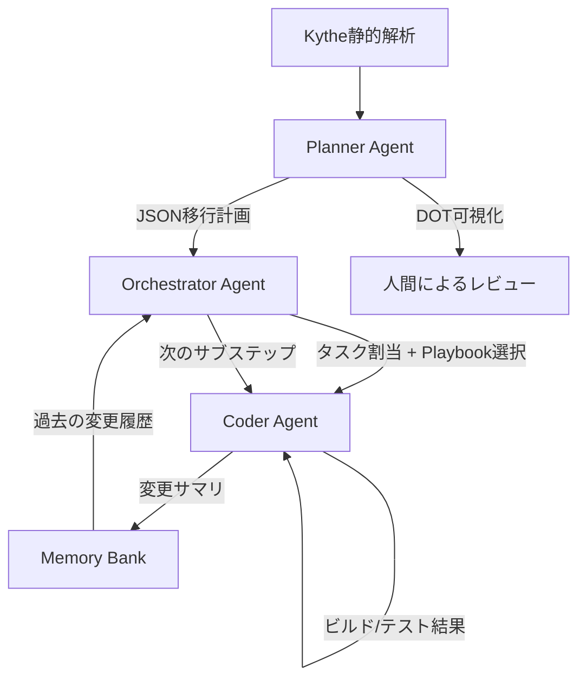

本記事は [A Multi-agent AI System for Deep Learning Model Migration from TensorFlow to JAX](https://arxiv.org/abs/2603.27296) の解説記事です。

## 論文概要（Abstract）

AIベースの深層学習プロダクトの急速な発展に伴い、フレームワークの世代交代が避けられない課題となっている。著者らは、TensorFlowからJAXへのモデル移行を自動化するマルチエージェントAIシステムを開発した。Planner/Orchestrator/Coderの3エージェント構成に、Kytheベースの静的解析とPlaybook駆動の知識注入を組み合わせることで、手動移行と比較して6.4-8倍の高速化を達成したと報告している。YouTube内部の6モデルを対象とした評価では、マルチエージェント+クライアント固有Playbookの構成がチェックリストスコア平均0.78を達成し、シングルエージェント構成（0.32-0.46）を大きく上回った。

この記事は [Zenn記事: Claude Codeサブエージェント×git worktreeでTSモノレポ移行を並列化する](https://zenn.dev/0h_n0/articles/37710cd17e84f4) の深掘りです。

## 情報源

- **arXiv ID**: 2603.27296
- **URL**: [arXiv:2603.27296](https://arxiv.org/abs/2603.27296)
- **著者**: Stoyan Nikolov, Bernhard Konrad, Moritz Gronbach et al. (Google)
- **発表年**: 2026年3月
- **分野**: Software Engineering (cs.SE), Artificial Intelligence (cs.AI)

## 背景と動機（Background & Motivation）

GoogleではTensorFlowからJAXへの移行が全社的な課題となっている。TensorFlowはオブジェクト指向・ステートフルなKeras APIを基盤とし、暗黙的な状態管理（BatchNormの学習中フラグ、`model.losses`経由のL2正則化等）を行う。一方JAXは関数型・ステートレスなパラダイムであり、状態をモデル定義から分離して明示的に管理する。

この根本的なパラダイムの差異が、移行を単純なAPI変換では解決できない問題にしている。著者らは以下の課題を挙げている。

- **暗黙的状態の明示化**: TensorFlowのBatchNormやregularizerの副作用として追跡される状態を、JAX/Flaxでは明示的なPyTree変換として再実装する必要がある
- **カスタムオペレーションの再実装**: ハードウェアレベルに近いカスタムopは、JAXに直接対応するものがない場合が多い
- **コーディング規約の遵守**: Google社内の厳格なスタイルガイドラインと既存ライブラリの再利用が求められる
- **実行スクリプト・データパイプラインの連鎖的変更**: モデルコードの移行だけでなく、学習ループやデータローディングまで影響が波及する

従来、この移行は専門知識を持つエンジニアが手動で行っており、600行のモデルで約16時間、4,000行のモデルで約32時間を要していた（論文Table 5より）。

## 主要な貢献（Key Contributions）

- **ハイブリッド静的-エージェント計画手法**: Kytheコンパイラベースの静的解析とLLM誘導のプランニングを組み合わせ、複雑なコードコンポーネントに対する信頼性の高い移行計画を自動生成する手法の提案
- **Playbook駆動の知識蒸留**: 4階層のPlaybookシステムにより、わずか2つの手動移行例から効果的なクライアント固有ガイダンスを半自動生成する手法の確立
- **AIジャッジによる品質評価**: フレームワーク非依存のチェックリストとGemini 3 Proを用いた、既存テストなしでの移行品質評価手法の開発
- **本番環境での実証**: YouTubeの6モデルで6.4-8倍の移行高速化を達成し、AI技術でAI開発を改善する「好循環」の実証

## 技術的詳細（Technical Details）

### 3エージェントアーキテクチャ

本システムは計画・調整・実装の3層に分離されたマルチエージェント構成を採用している。Zenn記事で紹介したClaude Codeの「計画→オーケストレーション→実装」パイプラインと構造的に同型であり、大規模コード移行における共通設計パターンと捉えることができる。



#### Planner Agent

Planner Agentは、移行対象のメインモデルファイルを起点として、Kytheによるコンパイラベースの静的解析で依存関係グラフを構築する。Kytheは「決定的、検証済み、高速、計算コストが低い」（原文）手法であり、LLMの幻覚リスクを回避できる。

計画はJSON形式で出力され、各ステップには`step_id`、ソース/ターゲットファイル、具体的な変換指示、検証条件、依存ステップのインデックスが含まれる。著者らは、各ステップが「数百行以下の新規コード」に収まるよう粒度を制御していると述べている。再帰的なアプローチにより、未解決の依存関係が検出されるたびに追加の分析と計画が行われる。

#### Orchestrator Agent

Orchestrator Agentは計画とCoder実行の橋渡しを担う。主要な責務は以下の4点である。

1. **動的タスクスコーピング**: 計画ステップの複雑度に基づき、Coderへの割り当て単位を動的に決定する
2. **動的知識注入**: 4階層のPlaybookから関連するもののみを選択し、コンテキスト汚染を最小化する
3. **戦略的障害処理**: Coderの失敗に対し、リトライ・スキップ・中断を判断する
4. **耐障害性**: Memory Bankへの進捗永続化により、中断からの再開を可能にする

Orchestratorは一度に1つのサブステップをCoderに委譲し、完了を待ってから次に進む逐次実行モデルを採用している。

#### Coder Agent

Coder AgentはReActパターンに基づくエージェントで、以下のツールを利用して移行を実行する。

- ファイルの読み取り・書き込み・検索
- コード検索（grep相当）
- 依存関係の自動修正
- ビルド実行・ユニットテスト実行

各割り当ては「ビルド可能な論理的に完全なコード」を生成する必要がある。Coder Agentには、完了宣言前にビルドとテストで自己検証を行うプロンプトが人工的に挿入されている。変更の要約はMarkdown形式でMemory Bankに保存され、後続のCoder呼び出し時にOrchestratorが完全な履歴をプロンプトに含める。

### Playbookシステム（4階層）

本システムの知識注入メカニズムは、4階層のPlaybook構成で実現されている。

| 階層 | 対象 | 更新頻度 | 用途 |
|---|---|---|---|
| General Instruction | リポジトリ構造、ビルドツール | ツール追加時のみ | モノレポ内のナビゲーション |
| Style Playbook | Google社内コーディング規約 | 違反検出時に手動更新 | コーディングタスクの整合性 |
| Task-Specific | TensorFlow→Flax Linen変換規則 | 汎用規則発見時に更新 | 一般的な移行手順の指示 |
| Client-Specific | ユースケース固有の要件、Few-shot例 | 各実行後に反復更新 | 計画・実装の主要な情報源 |

Client-Specific Playbookの生成は半自動で行われる。手順は以下の通りである。

1. AIエージェントが手動移行済みコードを意味的単位（ベースインポート、ベースメソッド、損失計算、メトリクス等）に分解する
2. LLMが各コードブロックから汎用的な移行規則を要約する
3. 人間のエンジニアがTensorFlow/JAXのフレームワーク差異に焦点を当ててレビューする

著者らは、「中程度の複雑度のモデル1つと、数千行の高複雑度モデル1つ」のわずか2例からClient-Specific Playbookを生成するだけで十分な効果が得られると報告している。

### AIジャッジによる品質評価

移行品質の評価には、フレームワーク非依存のチェックリストとGemini 3 Proを用いたLLMジャッジを採用している。チェックリストは「各予測ヘッドのTower」「ユーザー埋め込みのL2正規化」等の記述的要件で構成され、TensorFlow固有の構文を含まない。

評価プロトコルは4ステップからなる。

1. ジャッジにチェックリストと移行済みJAXコードのファイルパスを入力する
2. エージェントがメインファイルからコードベースを探索し、実装を検証する
3. ジャッジは元のTensorFlowソースにアクセスできない（ブラインド監査パターン）
4. 品質スコア = チェック済み項目数 / 全項目数

著者らは、数値等価性テスト（Numerical Equivalence Tests）を当初検討したが、フレームワーク間のXLAカーネル融合やアクティベーション関数の微妙な差異により、数値のずれが必ずしも移行失敗を意味しないとして放棄したと述べている。

## 実装のポイント（Implementation）

### TensorFlow→JAXの典型的な変換パターン

著者らが論文中で示したコード例（Listing 1, 2）に基づく変換の要点を整理する。

**BatchNormの状態管理**: TensorFlowでは`training`フラグで暗黙的にBatchNorm統計を更新するが、JAX/Flaxでは`mutable=['batch_stats']`で明示的に可変状態を宣言し、返り値として受け取る必要がある。

**正則化の処理**: TensorFlowの`kernel_regularizer`はモデルの副作用チャネル（`model.losses`）経由で暗黙的に収集されるが、JAXでは`jax.tree.map`によるPyTree走査で明示的にパラメータからL2ペナルティを計算する。

```python
# JAX/Flax: 明示的な正則化（論文Listing 2に基づく概念コード）
def compute_l2_penalty(params: dict, weight_decay: float = 1e-4) -> float:
    """PyTree走査でL2正則化を明示的に計算する

    Args:
        params: Flaxモデルのパラメータ辞書
        weight_decay: 正則化係数

    Returns:
        L2ペナルティの合計値
    """
    leaves = jax.tree.leaves(params)
    return weight_decay * sum(jnp.sum(p ** 2) for p in leaves)
```

**Memory Bankの活用**: Coder Agentが生成する変更サマリは、後続のタスクで「何が変更されたか」「どのような修正が行われたか」を伝達する。これにより、エージェント間のコンテキスト引き継ぎが実現される。この仕組みは、Zenn記事で紹介したClaude Codeのワークツリー間での情報共有と同様のパターンである。

### 静的解析と計画の粒度制御

Kytheによる依存関係分析は、LLMベースの解析と比べて以下の利点がある。

- コンパイラレベルの正確性でインポート関係を解決する
- 大規模モノレポでも高速に実行できる
- 結果が決定的であり、再現性が保証される

計画の粒度は「各ステップが数百行以下の新規コード」に制御されており、Coder Agentのコンテキストウィンドウ内で処理可能なサイズを維持している。

## Production Deployment Guide

本論文のマルチエージェント移行システムは実装セクションを含むため、AWSでのプロダクションデプロイ構成を示す。

### AWS実装パターン（コスト最適化重視）

論文のシステムは、Planner/Orchestrator/Coderの3エージェント構成で大規模コードベースの移行を実行する。移行ジョブの頻度に基づいた構成を以下に示す。

| 項目 | Small (~10 jobs/日) | Medium (~50 jobs/日) | Large (200+ jobs/日) |
|---|---|---|---|
| コンピュート | Lambda (1GB, 900s) | ECS Fargate (2vCPU, 4GB) | EKS + Spot (m5.2xlarge) |
| LLM | Bedrock Claude Sonnet | Bedrock Claude Sonnet | Bedrock Claude Sonnet (Batch) |
| 静的解析 | Lambda (512MB, 120s) | ECS Fargate (1vCPU, 2GB) | EKS Pod (c5.xlarge) |
| ストレージ | S3 + DynamoDB On-Demand | S3 + ElastiCache Redis | S3 + ElastiCache Redis Cluster |
| キュー | SQS Standard | SQS FIFO | SQS FIFO + Step Functions |
| 月額概算 | $200-500 | $1,500-3,000 | $8,000-15,000 |

**注意**: 上記コストは2026年9月時点のAWS ap-northeast-1（東京）リージョン料金に基づく概算値です。実際のコストはLLM呼び出し回数、移行対象コードの複雑度、リトライ頻度により大きく変動します。最新料金は[AWS料金計算ツール](https://calculator.aws/)で確認してください。

**コスト削減テクニック**:
- **Bedrock Batch API**: 非同期バッチ処理で50%削減（夜間の一括移行ジョブに適用）
- **Prompt Caching**: Playbook定義（General/Style/Task-Specific）をキャッシュし、トークンコスト30-90%削減
- **Spot Instances**: Large構成でm5.2xlarge Spotを使用し、オンデマンド比最大90%削減
- **Step Functions Express**: 短時間ワークフローをExpress Workflowに切り替え、実行コスト最大90%削減

### Terraformインフラコード

**Small構成（Serverless）**: Lambda + SQS + DynamoDB

```hcl
# main.tf - マルチエージェント移行 Small構成
terraform {
  required_version = ">= 1.9"
  required_providers {
    aws = { source = "hashicorp/aws", version = "~> 5.60" }
  }
}

provider "aws" { region = "ap-northeast-1" }

# --- SQS（移行ジョブキュー） ---
resource "aws_sqs_queue" "migration_jobs" {
  name                       = "migration-jobs"
  visibility_timeout_seconds = 960 # Lambda timeout + 60s margin
  message_retention_seconds  = 86400
  tags = { Project = "code-migration" }
}

resource "aws_sqs_queue" "migration_dlq" {
  name                      = "migration-jobs-dlq"
  message_retention_seconds = 1209600 # 14日
  tags = { Project = "code-migration" }
}

# --- Lambda: Planner Agent ---
resource "aws_lambda_function" "planner" {
  function_name = "migration-planner"
  runtime       = "python3.12"
  handler       = "planner.lambda_handler"
  memory_size   = 512
  timeout       = 120
  role          = aws_iam_role.lambda.arn

  environment {
    variables = {
      BEDROCK_MODEL_ID = "anthropic.claude-sonnet-4-20250514"
      DYNAMODB_TABLE   = aws_dynamodb_table.memory_bank.name
      S3_BUCKET        = aws_s3_bucket.artifacts.id
    }
  }

  filename = "planner_package.zip"
  tags     = { Project = "code-migration", Agent = "planner" }
}

# --- Lambda: Orchestrator + Coder Agent ---
resource "aws_lambda_function" "orchestrator" {
  function_name = "migration-orchestrator"
  runtime       = "python3.12"
  handler       = "orchestrator.lambda_handler"
  memory_size   = 1024
  timeout       = 900
  role          = aws_iam_role.lambda.arn

  environment {
    variables = {
      BEDROCK_MODEL_ID = "anthropic.claude-sonnet-4-20250514"
      DYNAMODB_TABLE   = aws_dynamodb_table.memory_bank.name
      S3_BUCKET        = aws_s3_bucket.artifacts.id
      SQS_QUEUE_URL    = aws_sqs_queue.migration_jobs.url
    }
  }

  filename = "orchestrator_package.zip"
  tags     = { Project = "code-migration", Agent = "orchestrator" }
}

# --- DynamoDB: Memory Bank ---
resource "aws_dynamodb_table" "memory_bank" {
  name         = "migration-memory-bank"
  billing_mode = "PAY_PER_REQUEST"
  hash_key     = "migration_id"
  range_key    = "step_id"

  attribute {
    name = "migration_id"
    type = "S"
  }
  attribute {
    name = "step_id"
    type = "S"
  }

  ttl { attribute_name = "ttl"; enabled = true }
  tags = { Project = "code-migration" }
}

# --- S3: コード成果物・Playbook保存 ---
resource "aws_s3_bucket" "artifacts" {
  bucket = "code-migration-artifacts-${data.aws_caller_identity.current.account_id}"
  tags   = { Project = "code-migration" }
}

resource "aws_s3_bucket_server_side_encryption_configuration" "artifacts" {
  bucket = aws_s3_bucket.artifacts.id
  rule {
    apply_server_side_encryption_by_default { sse_algorithm = "aws:kms" }
  }
}

data "aws_caller_identity" "current" {}

# --- IAMロール（最小権限） ---
resource "aws_iam_role" "lambda" {
  name = "migration-lambda-role"
  assume_role_policy = jsonencode({
    Version = "2012-10-17"
    Statement = [{
      Action    = "sts:AssumeRole"
      Effect    = "Allow"
      Principal = { Service = "lambda.amazonaws.com" }
    }]
  })
}

resource "aws_iam_role_policy" "lambda" {
  role = aws_iam_role.lambda.id
  policy = jsonencode({
    Version = "2012-10-17"
    Statement = [
      {
        Effect   = "Allow"
        Action   = ["bedrock:InvokeModel"]
        Resource = "arn:aws:bedrock:ap-northeast-1::foundation-model/anthropic.claude-sonnet-*"
      },
      {
        Effect   = "Allow"
        Action   = ["dynamodb:GetItem", "dynamodb:PutItem", "dynamodb:UpdateItem", "dynamodb:Query"]
        Resource = aws_dynamodb_table.memory_bank.arn
      },
      {
        Effect   = "Allow"
        Action   = ["s3:GetObject", "s3:PutObject"]
        Resource = "${aws_s3_bucket.artifacts.arn}/*"
      },
      {
        Effect   = "Allow"
        Action   = ["sqs:SendMessage", "sqs:ReceiveMessage", "sqs:DeleteMessage"]
        Resource = aws_sqs_queue.migration_jobs.arn
      },
      {
        Effect   = "Allow"
        Action   = ["logs:CreateLogGroup", "logs:CreateLogStream", "logs:PutLogEvents"]
        Resource = "arn:aws:logs:*:*:*"
      }
    ]
  })
}

# --- CloudWatch アラーム ---
resource "aws_cloudwatch_metric_alarm" "orchestrator_duration" {
  alarm_name          = "migration-orchestrator-duration-high"
  comparison_operator = "GreaterThanThreshold"
  evaluation_periods  = 3
  metric_name         = "Duration"
  namespace           = "AWS/Lambda"
  period              = 300
  statistic           = "p95"
  threshold           = 850000 # 850s (900sタイムアウトの94%)
  dimensions          = { FunctionName = aws_lambda_function.orchestrator.function_name }
  alarm_actions       = []
}
```

**Large構成（Container）**: EKS + Step Functions + Spot Instances

```hcl
# main.tf - マルチエージェント移行 Large構成
module "eks" {
  source  = "terraform-aws-modules/eks/aws"
  version = "~> 20.24"

  cluster_name    = "code-migration-prod"
  cluster_version = "1.31"
  vpc_id          = aws_vpc.main.id
  subnet_ids      = aws_subnet.private[*].id

  cluster_endpoint_public_access = false
  tags = { Project = "code-migration", Environment = "production" }
}

# --- Karpenter（Spot優先） ---
resource "kubectl_manifest" "karpenter_nodepool" {
  yaml_body = yamlencode({
    apiVersion = "karpenter.sh/v1"
    kind       = "NodePool"
    metadata   = { name = "migration-spot" }
    spec = {
      template = {
        spec = {
          requirements = [
            { key = "karpenter.sh/capacity-type", operator = "In", values = ["spot", "on-demand"] },
            { key = "node.kubernetes.io/instance-type", operator = "In",
              values = ["m5.2xlarge", "m5a.2xlarge", "m6i.2xlarge"] }
          ]
        }
      }
      limits     = { cpu = "128", memory = "512Gi" }
      disruption = { consolidationPolicy = "WhenEmptyOrUnderutilized" }
    }
  })
}

# --- Step Functions（Planner→Orchestrator→Coderワークフロー） ---
resource "aws_sfn_state_machine" "migration_workflow" {
  name     = "code-migration-workflow"
  role_arn = aws_iam_role.sfn.arn

  definition = jsonencode({
    StartAt = "PlanMigration"
    States = {
      PlanMigration = {
        Type     = "Task"
        Resource = "arn:aws:states:::ecs:runTask.sync"
        Next     = "OrchestrateExecution"
      }
      OrchestrateExecution = {
        Type     = "Task"
        Resource = "arn:aws:states:::ecs:runTask.sync"
        Next     = "ValidateResult"
      }
      ValidateResult = {
        Type = "Choice"
        Choices = [{
          Variable     = "$.status"
          StringEquals = "SUCCESS"
          Next         = "MigrationComplete"
        }]
        Default = "RetryOrFail"
      }
      RetryOrFail = { Type = "Task", Resource = "arn:aws:states:::ecs:runTask.sync", End = true }
      MigrationComplete = { Type = "Succeed" }
    }
  })

  tags = { Project = "code-migration" }
}

# --- AWS Budgets ---
resource "aws_budgets_budget" "monthly" {
  name         = "code-migration-monthly"
  budget_type  = "COST"
  limit_amount = "15000"
  limit_unit   = "USD"
  time_unit    = "MONTHLY"

  notification {
    comparison_operator        = "GREATER_THAN"
    threshold                  = 80
    threshold_type             = "PERCENTAGE"
    notification_type          = "FORECASTED"
    subscriber_email_addresses = ["alerts@example.com"]
  }
}
```

### 運用・監視設定

**CloudWatch Logs Insights クエリ**（エージェント実行分析）:

```
# エージェント別の実行時間とBedrock呼び出し回数
fields @timestamp, agent_type, migration_id
| filter agent_type in ["planner", "orchestrator", "coder"]
| stats count() as invocations,
        avg(duration_ms) as avg_latency,
        pct(duration_ms, 95) as p95_latency,
        sum(bedrock_tokens) as total_tokens
  by agent_type, bin(1h)
| sort agent_type, @timestamp desc
```

**CloudWatch アラーム設定（Python boto3）**:

```python
import boto3

cloudwatch = boto3.client("cloudwatch", region_name="ap-northeast-1")

# Bedrockトークン使用量スパイク検知（マルチエージェントは3-5xのトークン消費）
cloudwatch.put_metric_alarm(
    AlarmName="migration-bedrock-token-spike",
    MetricName="InputTokenCount",
    Namespace="AWS/Bedrock",
    Statistic="Sum",
    Period=3600,
    EvaluationPeriods=2,
    Threshold=2000000,  # マルチエージェント構成はトークン消費が大きい
    ComparisonOperator="GreaterThanThreshold",
    AlarmActions=["arn:aws:sns:ap-northeast-1:ACCOUNT:migration-alerts"],
    Dimensions=[
        {"Name": "ModelId", "Value": "anthropic.claude-sonnet-4-20250514"}
    ],
)
```

**X-Ray トレーシング設定（Python）**:

```python
from aws_xray_sdk.core import xray_recorder, patch_all

patch_all()

@xray_recorder.capture("migration_orchestrator")
def handle_migration(migration_id: str, plan: dict) -> dict:
    """移行ワークフローをX-Rayでトレース"""
    subsegment = xray_recorder.current_subsegment()
    subsegment.put_annotation("migration_id", migration_id)
    subsegment.put_annotation("total_steps", len(plan["steps"]))
    subsegment.put_metadata("playbooks_used", plan.get("playbooks", []))

    result = orchestrator.execute(migration_id, plan)

    subsegment.put_annotation("completed_steps", result["completed"])
    subsegment.put_annotation("failed_steps", result["failed"])
    return result
```

**Cost Explorer自動レポート（Python）**:

```python
import boto3
from datetime import date, timedelta

ce = boto3.client("ce", region_name="ap-northeast-1")
sns = boto3.client("sns", region_name="ap-northeast-1")

def daily_cost_report() -> None:
    """日次コストレポート取得、$500/日超過でSNS通知"""
    today = date.today()
    yesterday = today - timedelta(days=1)

    resp = ce.get_cost_and_usage(
        TimePeriod={"Start": str(yesterday), "End": str(today)},
        Granularity="DAILY",
        Metrics=["UnblendedCost"],
        Filter={
            "Tags": {"Key": "Project", "Values": ["code-migration"]}
        },
        GroupBy=[{"Type": "DIMENSION", "Key": "SERVICE"}],
    )

    total = sum(
        float(g["Metrics"]["UnblendedCost"]["Amount"])
        for g in resp["ResultsByTime"][0]["Groups"]
    )

    if total > 500.0:
        sns.publish(
            TopicArn="arn:aws:sns:ap-northeast-1:ACCOUNT:migration-alerts",
            Subject=f"Migration Cost Alert: ${total:.2f}/day",
            Message=f"Daily cost exceeded $500: ${total:.2f}",
        )
```

### コスト最適化チェックリスト

**アーキテクチャ選択**:
- [ ] ~10 jobs/日 → Serverless（Lambda + SQS + DynamoDB）
- [ ] ~50 jobs/日 → Hybrid（ECS Fargate + Step Functions）
- [ ] 200+ jobs/日 → Container（EKS + Karpenter + Step Functions）

**リソース最適化**:
- [ ] EC2/EKS: Spot Instances優先（m5.2xlarge Spot: ~$0.08/h、オンデマンド比最大90%削減）
- [ ] Reserved Instances: 1年コミットで最大72%削減
- [ ] Savings Plans: Compute Savings Plansで柔軟な割引
- [ ] Lambda: Orchestratorはメモリ1024MBが最適（CPU性能とコストのバランス）
- [ ] EKS: Karpenter consolidationPolicyでアイドルノード自動削除

**LLMコスト削減**:
- [ ] Bedrock Batch API: 夜間一括移行で50%削減
- [ ] Prompt Caching: Playbook定義（General/Style/Task-Specific）をキャッシュ（30-90%削減）
- [ ] モデル選択: Plannerは高品質モデル、ビルドエラー修正は軽量モデルと使い分け
- [ ] トークン数制限: Coder Agentの変更サマリを要約し、累積コンテキストを圧縮

**監視・アラート**:
- [ ] AWS Budgets: 月額予算$15,000、80%到達で予測アラート
- [ ] CloudWatch: Bedrock InputTokenCount スパイク検知（閾値200万/h）
- [ ] Cost Anomaly Detection: MLベースの異常コスト検出
- [ ] 日次コストレポート: Cost Explorer APIで自動取得、$500/日超でSNS通知

**リソース管理**:
- [ ] 未使用EKSノード: Karpenter自動スケールダウン
- [ ] タグ戦略: Project=code-migration、Agent=planner/orchestrator/coder で全リソースタグ付け
- [ ] DynamoDB Memory Bank: TTL設定で完了済み移行データを30日後に自動削除
- [ ] S3成果物: ライフサイクルポリシーで90日後Glacier、365日後削除
- [ ] CloudTrail/Config: 監査ログ有効化、S3ライフサイクルで90日後Glacier移行

## 実験結果（Results）

### 移行品質スコア

著者らはYouTubeの6モデルを対象に、4つのエージェント構成を比較評価している（論文Table 4より）。

| モデル | multi_agent | multi_agent_yt_specific | single_agent_baseline | single_agent_yt_specific |
|---|---|---|---|---|
| large_1 (13k LOC, ~250層) | 0.31 | **0.65** | 0.09 | 0.14 |
| large_2 (9k LOC, ~130層) | 0.42 | **0.59** | 0.22 | 0.33 |
| medium_1 (1k LOC, ~40層) | 0.73 | **0.90** | 0.43 | 0.43 |
| medium_2 (3k LOC, ~40層) | 0.53 | **0.75** | 0.38 | 0.44 |
| small_1 (500 LOC, ~20層) | 0.70 | **0.95** | 0.66 | 0.48 |
| small_2 (500 LOC, ~17層) | 0.87 | **0.82** | 0.59 | 0.36 |

全構成はGemini 3 Pro（temperature=0.2）を使用している（論文Table 3より）。

統計的分析の結果、multi_agent_yt_specific（マルチエージェント+Client-Specific Playbook）は他の構成に対して有意に優れている（対応t検定、$p < 0.02$）。一方、single_agent_yt_specificとsingle_agent_baselineの間には統計的有意差が認められなかった（$p = 0.62$）。この結果は、Playbookの効果がマルチエージェント構成と組み合わさることで初めて発現することを示唆している。

著者らは、シングルエージェントがPlaybookの約3,000行のコンテキストに圧倒され、不完全な移行にもかかわらず成功を宣言する傾向があると分析している。

small_1およびsmall_2（単純モデル）では、構成間の差異は統計的に有意でなかった（$p = 0.07$）。著者らは「モデルが複雑になるほど、ベースラインとマルチエージェント構成の差が拡大する」と報告している。

### 移行時間の短縮

実本番モデルでの時間計測結果を以下に示す（論文Table 5より）。

| モデル | コード行数 / 依存行数 | 層数 | メトリクス数 | 手動移行 | AI+レビュー/修正 | 高速化 |
|---|---|---|---|---|---|---|
| model_1 | 0.6k / 3k | 15 | 50 | ~16時間 | ~2時間 | **8x** |
| model_2 | 4k / 20k | 250 | 300 | ~32時間 | ~5時間 | **6.4x** |

著者らは、AIシステムは常にユニットテストを生成するのに対し、手動移行ではテスト作成が含まれていない点に留意すべきと述べている。また、AIによる移行結果のレビューは、ゼロからの手動移行と比較して低い専門性で実行可能であると報告している。

計算コスト面では、マルチエージェント構成はシングルエージェント構成と比較して約3-5倍の計算時間を要する。これはPlanner/Orchestrator間の通信オーバーヘッドと、逐次的なステップ実行に起因する。

## 実運用への応用（Practical Applications）

### Zenn記事との関連

Zenn記事「Claude Codeサブエージェント×git worktreeでTSモノレポ移行を並列化する」で紹介されているClaude Codeベースの移行パイプラインと、本論文のシステムは「計画→オーケストレーション→実装」の3層構造を共有している。両者の比較から、大規模コード移行における汎用的な設計原則が浮かび上がる。

| 設計要素 | Google（本論文） | Claude Code（Zenn記事） |
|---|---|---|
| 計画 | Kythe静的解析 + LLM | サブエージェントによる依存分析 |
| オーケストレーション | 逐次実行（1ステップずつ） | git worktreeによる並列実行 |
| 知識注入 | 4階層Playbook | CLAUDE.mdプロジェクト設定 |
| 品質保証 | AIジャッジ（チェックリスト） | ビルド+テスト |
| 耐障害性 | Memory Bank永続化 | worktree分離 |

### 実務への示唆

本論文の知見から、以下の実務的な示唆が得られる。

**Playbookの効果は構成依存**: Client-Specific Playbookはマルチエージェント構成と組み合わせて初めて効果を発揮する。シングルエージェントに大量のコンテキストを与えると、逆にパフォーマンスが低下する可能性がある（論文Table 4：single_agent_yt_specificはbaselineと統計的有意差なし）。

**2例で十分なFew-shot学習**: 手動移行例をわずか2つ用意するだけで、効果的なPlaybookを半自動生成できる。新しいプロジェクトへの適用コストが低い。

**複雑度に応じた戦略選択**: 単純なモデル（500 LOC程度）ではマルチエージェント構成の優位性が消失する（$p = 0.07$）。コスト対効果を考慮し、モデルの複雑度に応じてシングル/マルチエージェントを切り替える戦略が有効である。

## 関連研究（Related Work）

- **RefAgent**: Planner/Refactoring Generator/Compiler/Testerの4エージェント構成でリファクタリングを反復的に改善するシステム。本論文との違いは、ビルド/テストをCoder Agentの内部ループに統合している点にある
- **TransAgent**: Code Translator/Syntax Fixer/Code Aligner/Semantic Error Fixerの4エージェント構成によるコード翻訳システム。本論文はフレームワーク移行という、単なる言語翻訳よりも広範な問題を対象としている
- **Agentless**: 3フェーズアプローチ（再現テスト生成→パッチ候補サンプリング→検証）による非エージェント的手法。本論文のエージェントベースアプローチと対照的なアプローチである
- **ACE（Generator-Reflector-Curator）**: オンライン/オフラインPlaybookによる動的コンテキスト適応パターン。本論文のPlaybookシステムはACEの動的適応をミラーしつつ、手動例からのスケーラブルな蒸留に焦点を当てている

## まとめと今後の展望

本論文は、TensorFlowからJAXへの大規模モデル移行において、Planner/Orchestrator/Coderの3エージェント構成とPlaybook駆動の知識注入が有効であることを実証した。特に、静的解析とLLMプランニングのハイブリッドアプローチ、わずか2例からのPlaybook生成、フレームワーク非依存のAIジャッジによる品質評価は、コード移行以外の大規模ソフトウェアエンジニアリングタスクにも応用可能な設計パターンである。

著者らは今後の課題として、コーディング以外の移行ステップ（実行スクリプト、データパイプライン）への拡張と、学習の不安定性やレイテンシ低下を自律的に特定・修正する専用デバッグエージェントの開発を挙げている。

## 参考文献

- **arXiv**: [https://arxiv.org/abs/2603.27296](https://arxiv.org/abs/2603.27296)
- **Related Zenn article**: [Claude Codeサブエージェント×git worktreeでTSモノレポ移行を並列化する](https://zenn.dev/0h_n0/articles/37710cd17e84f4)
