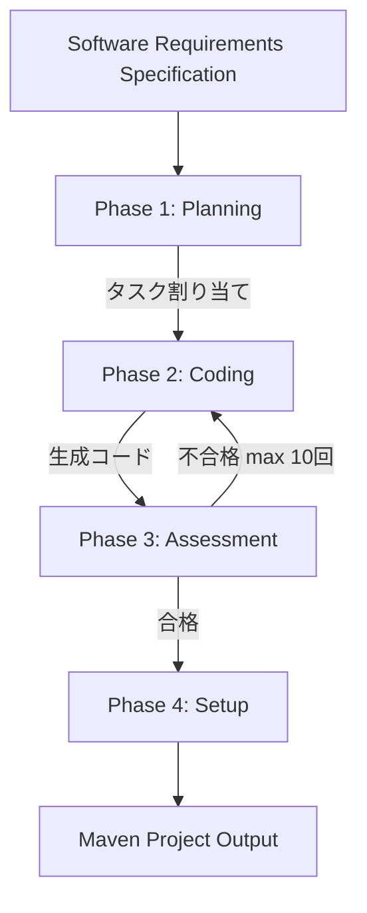

本記事は [An Evaluation of Role-Based Multi-Agent Code Generation on Repository-Scale Problems](https://arxiv.org/abs/2607.04212) の解説記事です。

## 論文概要（Abstract）

単一のLLMプロンプトでリポジトリ規模のコードを生成すると、ファイル間の依存関係やアーキテクチャの一貫性が崩壊する。著者らは、ソフトウェア要求仕様書（SRS）からタスクを自動分割し、役割を持つ複数のLLMエージェントに割り当てる4フェーズのパイプラインを構築した。12のJavaリポジトリ（Trivial〜Complex）で評価した結果、反復的評価（Reflexive）バリアントがJPlag類似度0.43、シナリオ意図充足率78%を達成し、単一LLM（JPlag 0.21、意図充足率61%）を上回ったと報告している。一方、コンパイル成功率は最良でも40%に留まり、生成コードと人間コードの間に依然として大きなギャップが存在することも明らかにしている。

この記事は [Zenn記事: Claude Codeサブエージェント×git worktreeでTSモノレポ移行を並列化する](https://zenn.dev/0h_n0/articles/37710cd17e84f4) の深掘りです。

## 情報源

- **arXiv ID**: 2607.04212
- **URL**: [arXiv:2607.04212](https://arxiv.org/abs/2607.04212)
- **著者**: Benedetta Donato, Noah Hagar-Dent, Aaron Worsnop, Leonardo Mariani, Valerio Terragni
- **発表年**: 2026年7月（IEEE Software 2026）
- **分野**: Software Engineering (cs.SE)

## 背景と動機（Background & Motivation）

LLMによるコード生成は、単一ファイル・単一関数の粒度では高い精度を示す。しかし、複数ファイルにまたがるリポジトリ規模の問題では、ファイル間の型整合性、パッケージ構成、レイヤー間の依存関係といった構造的制約を同時に満たす必要がある。単一のLLMプロンプトではコンテキストウィンドウの制約やアーキテクチャの一貫性維持が困難であり、生成コードのコンパイル成功率が著しく低下する。

著者らは、ソフトウェア開発の現場では役割分担（アーキテクト、バックエンド開発者、フロントエンド開発者、テスター等）が自然に行われている点に着目している。この人間の開発プロセスをLLMエージェントに模倣させることで、リポジトリ規模のコード生成品質を向上できるという仮説を検証している。先行研究ではChatDevやMetaGPTといったマルチエージェントフレームワークが提案されているが、リポジトリ規模の実プロジェクトでの定量的な比較評価は不十分であったと著者らは指摘している。

## 主要な貢献（Key Contributions）

- **リポジトリ規模での体系的評価**: GPT-5の学習データカットオフ（2025年）以降に作成された12のJavaリポジトリを用い、データリーク（memorization）を排除した公正な評価フレームワークを構築した
- **反復的評価（Reflexive）の効果実証**: SRSに基づく静的テキスト評価を最大10回反復することで、シナリオ意図充足率が55%から78%に向上し、標準偏差が0.04-0.06から0.01に低下（安定性向上）することを示した
- **ロール分担の構造的効果の定量化**: ロールベースエージェントが生成するコードは、単一LLMと比較して明確なレイヤー分離（Controller/Service/Repository）を持ち、84.3%-91.2%の修正ファイルがサマリに記載されるという追跡可能性を確認した
- **コスト・時間のベンチマーク**: Trivialリポジトリで17分・$0.20、Complexリポジトリで1時間48分・$1.40という実用的なリソース消費量を報告した

## 技術的詳細（Technical Details）

### 4フェーズパイプライン

著者らのシステムは、Planning、Coding、Assessment、Setupの4フェーズで構成される逐次パイプラインである。



**Sequential**バリアントはAssessmentフェーズをスキップし、Planning → Coding → Setupの3フェーズで実行する。**Reflexive**バリアントはAssessmentフェーズを含み、不合格の場合はCodingフェーズに戻って最大10回の反復を行う。

### Phase 1: Planning（計画フェーズ）

Planningフェーズでは、SRSを入力としてLLMがタスクリストを生成する。各タスクには担当エージェントのロール、実装対象のファイルパス、依存関係が付与される。

著者らが定義するロールは以下の通りである。

| ロール | 責務 | 生成対象の例 |
|---|---|---|
| Architect | プロジェクト構造設計、パッケージ構成定義 | pom.xml, ディレクトリ構造 |
| Backend Developer | ビジネスロジック、API実装 | Service, Controller, Repository |
| Frontend Developer | UI実装（該当する場合） | View, Template |
| Test Engineer | テストコード生成 | JUnit テストクラス |
| DevOps Engineer | ビルド・デプロイ設定 | Dockerfile, CI/CD設定 |

SRSからのタスク分割は以下のアルゴリズムで概念化できる。

```python
from dataclasses import dataclass, field


@dataclass(frozen=True)
class Task:
    """SRSから分割された個別タスク

    Attributes:
        task_id: タスクの一意識別子
        role: 担当エージェントのロール名
        description: タスクの自然言語記述
        target_files: 生成・修正対象のファイルパス一覧
        dependencies: 先行タスクのID一覧
    """
    task_id: str
    role: str
    description: str
    target_files: list[str] = field(default_factory=list)
    dependencies: list[str] = field(default_factory=list)


def plan_from_srs(srs_text: str, roles: list[str]) -> list[Task]:
    """SRSをタスクリストに分割する

    Args:
        srs_text: ソフトウェア要求仕様書の全文
        roles: 利用可能なロール名のリスト

    Returns:
        依存関係順にソートされたタスクリスト
    """
    # LLMがSRSを解析し、機能要件ごとにタスクを生成
    # 各タスクにロールを割り当て、ファイルパスと依存関係を付与
    tasks = llm_generate_tasks(srs_text, roles)
    # トポロジカルソートで実行順序を決定
    return topological_sort(tasks)
```

### Phase 2: Coding（コーディングフェーズ）

各タスクはロール固有のシステムプロンプトを持つLLMエージェントに割り当てられる。エージェントはタスクの記述、対象ファイルパス、先行タスクの出力（既に生成されたコード）をコンテキストとして受け取り、コードを生成する。

著者らは、ロール固有のプロンプトがコード構造に与える影響を分析している。Backend Developerロールには「Controller層はHTTPリクエストの受付のみを担当し、ビジネスロジックはService層に委譲すること」といった制約が含まれる。この制約により、生成コードはSpring BootのController/Service/Repositoryパターンに従った明確なレイヤー分離を示すと報告されている。

### Phase 3: Assessment（評価フェーズ）

AssessmentフェーズはReflexiveバリアントでのみ実行される。生成されたコードをSRSと照合し、要件の充足度を静的テキスト評価する。評価はLLMが行い、以下の観点でスコアリングする。

- **機能要件の充足**: SRSに記載された各機能が実装されているか
- **構造的一貫性**: パッケージ構成、命名規則、レイヤー分離が適切か
- **型整合性**: ファイル間のインポート、型参照が正しいか

不合格の場合、評価コメント（どの要件が未充足か、どのファイルに問題があるか）がフィードバックとしてCodingフェーズに渡される。著者らは最大10回の反復を設定しているが、実験では平均3-5回で収束したと報告している。

### Phase 4: Setup（セットアップフェーズ）

生成されたコードファイルをMavenプロジェクト構造に組み立てる。pom.xmlの依存関係定義、ディレクトリ構造の構築、パッケージ宣言の整合性確認を行う。

### コード類似度メトリクス

著者らは生成コードの品質を3つのメトリクスで評価している。

$$
\text{JPlag}(G, R) = \frac{|LCS(tokens(G), tokens(R))|}{max(|tokens(G)|, |tokens(R)|)}
$$

ここで、$G$は生成コード、$R$はリファレンス（人間が書いた）コード、$tokens(\cdot)$はトークン化関数、$LCS$は最長共通部分列である。JPlagはトークンレベルの構造的類似度を測定し、変数名やコメントの違いに頑健である。

$$
\text{CrystalBLEU}(G, R) = BP \cdot \exp\left(\sum_{n=1}^{4} w_n \log p_n\right)
$$

CrystalBLEUはBLEUの変種で、コード特有の頻出トークン（`{`, `}`, `;`等）を除外した上でn-gram精度を計算する。$w_n$は各n-gramの重み、$p_n$はn-gram精度、$BP$は短文ペナルティである。

**シナリオ意図充足率**（Scenario Intent）は、SRSに記載された各機能シナリオが生成コードに実装されているかを、LLMが判定するメトリクスである。

## 実装のポイント（Implementation）

### 評価対象リポジトリの選定基準

著者らは評価対象として、GPT-5の学習データカットオフ以降（2025年以降）に作成された12のJavaリポジトリを選定している。これにより、LLMがリポジトリの内容を記憶（memorize）している可能性を排除している。

| 複雑度 | リポジトリ | 特徴 |
|---|---|---|
| Trivial | MemShell, AIClient, AutoSign | 単機能、少数ファイル |
| Simple | Karma, Spring, Rate | 基本的なCRUD、Spring Boot |
| Moderate | JoySafety, KRS, Chaos | 複数モジュール、外部API連携 |
| Complex | A2A, jquickpdf, RYW | 大規模、複雑な依存関係 |

### Reflexive反復の収束性

Reflexiveバリアントの重要な設計判断は、反復回数の上限である。著者らは最大10回を設定しているが、実験では標準偏差が0.01と極めて安定した結果を得ている（Sequentialの0.04-0.06と比較）。これは、Assessmentフェーズのフィードバックが明確な改善指示を含むため、Codingフェーズが効率的に修正できることを示唆している。

### コンパイル成功率の課題

コンパイル成功率はReflexiveバリアントでも40%に留まる。著者らはこの原因を以下のように分析している。

1. **依存関係の解決失敗**: 外部ライブラリのバージョン不整合
2. **パッケージ宣言の不一致**: ディレクトリ構造とJavaパッケージ宣言のずれ
3. **型参照の欠落**: ファイル間で参照される型が定義されていない

Assessmentフェーズは静的テキスト評価であり、実際のコンパイルは行わない。コンパイルベースのフィードバックを組み込むことで、成功率の大幅な向上が期待できると著者らは考察している。

## Production Deployment Guide

本論文のロールベースマルチエージェントパイプラインは4フェーズの実装を含むため、AWSでのプロダクションデプロイ構成を示す。

### AWS実装パターン（コスト最適化重視）

論文のパイプラインはLLM呼び出しが主要コストであり、1プロジェクトあたり$0.20-$1.40のAPI費用が発生する。トラフィック量別の推奨構成を以下に示す。

| 項目 | Small (~10 proj/日) | Medium (~50 proj/日) | Large (200+ proj/日) |
|---|---|---|---|
| コンピュート | Lambda (1024MB, 300s) | ECS Fargate (2vCPU, 4GB) | EKS + Spot (m5.xlarge) |
| LLM | Bedrock Claude Sonnet | Bedrock Claude Sonnet | Bedrock Claude Sonnet (Batch) |
| キュー | SQS Standard | SQS FIFO | SQS FIFO + Step Functions |
| ストレージ | S3 + DynamoDB | S3 + DynamoDB | S3 + DynamoDB + ElastiCache |
| 月額概算 | $50-150 | $400-900 | $2,500-5,000 |

**注意**: 上記コストは2026年9月時点のAWS ap-northeast-1（東京）リージョン料金に基づく概算値です。実際のコストはトラフィックパターン、リージョン、バースト使用量により変動します。最新料金は[AWS料金計算ツール](https://calculator.aws/)で確認してください。

**コスト削減テクニック**:
- **Bedrock Batch API**: 非同期バッチ処理で50%削減（Planningフェーズの一括実行に適用）
- **Prompt Caching**: ロール固有のシステムプロンプトをキャッシュし、トークンコスト30-90%削減
- **Spot Instances**: Large構成でm5.xlarge Spotを使用し、オンデマンド比最大90%削減
- **Step Functions Express**: 4フェーズのオーケストレーションを$0.000025/遷移で実行

### Terraformインフラコード

**Small構成（Serverless）**: Lambda + SQS + DynamoDB

```hcl
# main.tf - Multi-Agent CodeGen Small構成
terraform {
  required_version = ">= 1.9"
  required_providers {
    aws = { source = "hashicorp/aws", version = "~> 5.60" }
  }
}

provider "aws" { region = "ap-northeast-1" }

# --- SQS（タスクキュー） ---
resource "aws_sqs_queue" "task_queue" {
  name                       = "codegen-task-queue"
  visibility_timeout_seconds = 600
  message_retention_seconds  = 86400
  tags = { Project = "multi-agent-codegen" }
}

# --- Lambda（4フェーズ実行） ---
resource "aws_lambda_function" "pipeline" {
  function_name = "codegen-pipeline"
  runtime       = "python3.12"
  handler       = "handler.lambda_handler"
  memory_size   = 1024
  timeout       = 300
  role          = aws_iam_role.lambda.arn

  environment {
    variables = {
      BEDROCK_MODEL_ID = "anthropic.claude-sonnet-4-20250514"
      TASK_QUEUE_URL   = aws_sqs_queue.task_queue.url
      RESULTS_BUCKET   = aws_s3_bucket.results.id
    }
  }

  filename = "lambda_package.zip"
  tags     = { Project = "multi-agent-codegen" }
}

# --- IAMロール（最小権限） ---
resource "aws_iam_role" "lambda" {
  name = "codegen-lambda-role"
  assume_role_policy = jsonencode({
    Version = "2012-10-17"
    Statement = [{
      Action    = "sts:AssumeRole"
      Effect    = "Allow"
      Principal = { Service = "lambda.amazonaws.com" }
    }]
  })
}

resource "aws_iam_role_policy" "lambda" {
  role = aws_iam_role.lambda.id
  policy = jsonencode({
    Version = "2012-10-17"
    Statement = [
      {
        Effect   = "Allow"
        Action   = ["bedrock:InvokeModel"]
        Resource = "arn:aws:bedrock:ap-northeast-1::foundation-model/anthropic.claude-sonnet-*"
      },
      {
        Effect   = "Allow"
        Action   = ["sqs:SendMessage", "sqs:ReceiveMessage", "sqs:DeleteMessage"]
        Resource = aws_sqs_queue.task_queue.arn
      },
      {
        Effect   = "Allow"
        Action   = ["s3:PutObject", "s3:GetObject"]
        Resource = "${aws_s3_bucket.results.arn}/*"
      },
      {
        Effect   = "Allow"
        Action   = ["dynamodb:PutItem", "dynamodb:GetItem", "dynamodb:Query"]
        Resource = aws_dynamodb_table.sessions.arn
      },
      {
        Effect   = "Allow"
        Action   = ["logs:CreateLogGroup", "logs:CreateLogStream", "logs:PutLogEvents"]
        Resource = "arn:aws:logs:*:*:*"
      }
    ]
  })
}

# --- S3（生成コード保存） ---
resource "aws_s3_bucket" "results" {
  bucket = "codegen-results-${data.aws_caller_identity.current.account_id}"
  tags   = { Project = "multi-agent-codegen" }
}

resource "aws_s3_bucket_server_side_encryption_configuration" "results" {
  bucket = aws_s3_bucket.results.id
  rule {
    apply_server_side_encryption_by_default { sse_algorithm = "aws:kms" }
  }
}

data "aws_caller_identity" "current" {}

# --- DynamoDB（セッション管理、On-Demand） ---
resource "aws_dynamodb_table" "sessions" {
  name         = "codegen-sessions"
  billing_mode = "PAY_PER_REQUEST"
  hash_key     = "session_id"

  attribute {
    name = "session_id"
    type = "S"
  }

  ttl { attribute_name = "ttl"; enabled = true }
  tags = { Project = "multi-agent-codegen" }
}

# --- CloudWatch アラーム ---
resource "aws_cloudwatch_metric_alarm" "lambda_errors" {
  alarm_name          = "codegen-lambda-errors"
  comparison_operator = "GreaterThanThreshold"
  evaluation_periods  = 2
  metric_name         = "Errors"
  namespace           = "AWS/Lambda"
  period              = 300
  statistic           = "Sum"
  threshold           = 5
  dimensions          = { FunctionName = aws_lambda_function.pipeline.function_name }
  alarm_actions       = []
}
```

**Large構成（Container）**: EKS + Karpenter + Spot Instances

```hcl
# main.tf - Multi-Agent CodeGen Large構成
module "eks" {
  source  = "terraform-aws-modules/eks/aws"
  version = "~> 20.24"

  cluster_name    = "codegen-prod"
  cluster_version = "1.31"
  vpc_id          = aws_vpc.main.id
  subnet_ids      = aws_subnet.private[*].id

  cluster_endpoint_public_access = false
  tags = { Project = "multi-agent-codegen", Environment = "production" }
}

# --- Karpenter（Spot優先、自動スケーリング） ---
resource "kubectl_manifest" "karpenter_nodepool" {
  yaml_body = yamlencode({
    apiVersion = "karpenter.sh/v1"
    kind       = "NodePool"
    metadata   = { name = "codegen-spot" }
    spec = {
      template = {
        spec = {
          requirements = [
            { key = "karpenter.sh/capacity-type", operator = "In", values = ["spot", "on-demand"] },
            { key = "node.kubernetes.io/instance-type", operator = "In",
              values = ["m5.xlarge", "m5a.xlarge", "m6i.xlarge"] }
          ]
        }
      }
      limits     = { cpu = "128", memory = "512Gi" }
      disruption = { consolidationPolicy = "WhenEmptyOrUnderutilized" }
    }
  })
}

# --- Secrets Manager ---
resource "aws_secretsmanager_secret" "bedrock" {
  name = "codegen/bedrock-config"
  tags = { Project = "multi-agent-codegen" }
}

# --- AWS Budgets ---
resource "aws_budgets_budget" "monthly" {
  name         = "codegen-monthly"
  budget_type  = "COST"
  limit_amount = "5000"
  limit_unit   = "USD"
  time_unit    = "MONTHLY"

  notification {
    comparison_operator        = "GREATER_THAN"
    threshold                  = 80
    threshold_type             = "PERCENTAGE"
    notification_type          = "FORECASTED"
    subscriber_email_addresses = ["alerts@example.com"]
  }
}
```

### 運用・監視設定

**CloudWatch Logs Insights クエリ**（フェーズ別レイテンシ分析）:

```
# フェーズ別の実行時間とBedrock呼び出し回数
fields @timestamp, phase, duration_ms, bedrock_calls
| filter @message like /phase_complete/
| stats count() as executions,
        avg(duration_ms) as avg_latency,
        pct(duration_ms, 95) as p95_latency,
        sum(bedrock_calls) as total_llm_calls
  by phase, bin(1h)
| sort phase asc
```

**CloudWatch アラーム設定（Python boto3）**:

```python
import boto3

cloudwatch = boto3.client("cloudwatch", region_name="ap-northeast-1")

# Bedrockトークン使用量スパイク検知
cloudwatch.put_metric_alarm(
    AlarmName="codegen-bedrock-token-spike",
    MetricName="InputTokenCount",
    Namespace="AWS/Bedrock",
    Statistic="Sum",
    Period=3600,
    EvaluationPeriods=2,
    Threshold=1000000,
    ComparisonOperator="GreaterThanThreshold",
    AlarmActions=["arn:aws:sns:ap-northeast-1:ACCOUNT:codegen-alerts"],
    Dimensions=[
        {"Name": "ModelId", "Value": "anthropic.claude-sonnet-4-20250514"}
    ],
)
```

**X-Ray トレーシング設定（Python boto3）**:

```python
from aws_xray_sdk.core import xray_recorder, patch_all

patch_all()


@xray_recorder.capture("codegen_pipeline")
def run_pipeline(srs_text: str, repo_name: str) -> dict:
    """4フェーズパイプラインをX-Rayでトレース"""
    subsegment = xray_recorder.current_subsegment()
    subsegment.put_annotation("repo_name", repo_name)

    for phase in ["planning", "coding", "assessment", "setup"]:
        with xray_recorder.in_subsegment(phase):
            result = execute_phase(phase, srs_text)
            xray_recorder.current_subsegment().put_metadata(
                "phase_result", {"status": result.status, "duration_ms": result.duration_ms}
            )

    subsegment.put_annotation("compile_success", result.compiles)
    return result
```

**Cost Explorer自動レポート（Python）**:

```python
import boto3
from datetime import date, timedelta

ce = boto3.client("ce", region_name="ap-northeast-1")
sns = boto3.client("sns", region_name="ap-northeast-1")


def daily_cost_report() -> None:
    """日次コストレポート取得、$100/日超過でSNS通知"""
    today = date.today()
    yesterday = today - timedelta(days=1)

    resp = ce.get_cost_and_usage(
        TimePeriod={"Start": str(yesterday), "End": str(today)},
        Granularity="DAILY",
        Metrics=["UnblendedCost"],
        Filter={"Tags": {"Key": "Project", "Values": ["multi-agent-codegen"]}},
        GroupBy=[{"Type": "DIMENSION", "Key": "SERVICE"}],
    )

    total = sum(
        float(g["Metrics"]["UnblendedCost"]["Amount"])
        for g in resp["ResultsByTime"][0]["Groups"]
    )

    if total > 100.0:
        sns.publish(
            TopicArn="arn:aws:sns:ap-northeast-1:ACCOUNT:codegen-alerts",
            Subject=f"CodeGen Cost Alert: ${total:.2f}/day",
            Message=f"Daily cost exceeded $100: ${total:.2f}",
        )
```

### コスト最適化チェックリスト

**アーキテクチャ選択**:
- [ ] ~10 proj/日 → Serverless（Lambda + SQS + DynamoDB）
- [ ] ~50 proj/日 → Hybrid（ECS Fargate + SQS FIFO）
- [ ] 200+ proj/日 → Container（EKS + Step Functions）

**リソース最適化**:
- [ ] EC2/EKS: Spot Instances優先（m5.xlarge Spot: ~$0.04/h、オンデマンド比最大90%削減）
- [ ] Reserved Instances: 1年コミットで最大72%削減
- [ ] Savings Plans: Compute Savings Plansで柔軟な割引
- [ ] Lambda: メモリサイズ1024MBが最適（4フェーズの逐次実行に必要な計算量）
- [ ] EKS: Karpenter consolidationPolicyでアイドルノード自動削除

**LLMコスト削減**:
- [ ] Bedrock Batch API: 非同期バッチ処理で50%削減（Planningフェーズの一括実行向き）
- [ ] Prompt Caching: ロール固有システムプロンプトをキャッシュ（30-90%削減）
- [ ] モデル選択: Assessmentはhaiku、CodingはSonnetと使い分け
- [ ] トークン数制限: max_tokens制限とSRS要約による入力トークン削減

**監視・アラート**:
- [ ] AWS Budgets: 月額予算$5,000、80%到達で予測アラート
- [ ] CloudWatch: Bedrock InputTokenCount スパイク検知
- [ ] Cost Anomaly Detection: MLベースの異常コスト検出
- [ ] 日次コストレポート: Cost Explorer APIで自動取得、$100/日超でSNS通知

**リソース管理**:
- [ ] 未使用S3オブジェクト: ライフサイクルポリシーで30日後Glacier移行
- [ ] タグ戦略: Project=multi-agent-codegen、Environment=prod/dev で全リソースタグ付け
- [ ] DynamoDBセッション: TTL設定で24時間後に自動削除
- [ ] 開発環境: 業務時間外はEKSノード数を0にスケールダウン
- [ ] CloudTrail/Config: 監査ログ有効化、S3ライフサイクルで90日後Glacier移行

## 実験結果（Results）

### コード類似度メトリクス

著者らは3つのアプローチ（LLM-Only、Agentic-seq、Agentic-refl）を12リポジトリで比較している（論文Table記載）。

| メトリクス | LLM-Only | Agentic-seq | Agentic-refl |
|---|---|---|---|
| JPlag | 0.21 | 0.33 | **0.43** |
| CrystalBLEU | 0.10 | 0.13 | **0.19** |
| シナリオ意図充足率 | 61% | 55% | **78%** |

Agentic-seqのシナリオ意図充足率（55%）がLLM-Only（61%）を下回っている点は注目に値する。著者らはこの原因を「タスク分割時に発生するコンテキストの分断」に求めている。ロール分担によりコード構造は改善されるが、個々のエージェントが全体のSRSを把握できないため、機能要件の一部が欠落する。Reflexiveバリアントではこの問題がAssessmentフェーズの反復によって補正され、78%まで回復している。

### コンパイル成功率

| アプローチ | コンパイル成功率 |
|---|---|
| LLM-Only | 31% |
| Agentic-seq | 22% |
| Agentic-refl | **40%** |

コンパイル成功率もAgentic-seqがLLM-Onlyを下回っている。マルチファイル生成ではファイル間の型整合性が崩れやすく、Assessmentフェーズなしでは修正が行われないためである。Reflexiveバリアントは40%まで改善するが、依然として過半数がコンパイルに失敗している。著者らは、静的テキスト評価ではなく実際のコンパイラフィードバックを組み込むことで大幅な改善が見込めると指摘している。

### 複雑度別の分析

著者らは12リポジトリを4段階の複雑度に分類して分析している。

| 複雑度 | 実行時間 | コスト | 備考 |
|---|---|---|---|
| Trivial | 17分 | $0.20 | MemShell, AIClient, AutoSign |
| Simple | 30-45分 | $0.40-0.60 | Karma, Spring, Rate |
| Moderate | 50分-1時間15分 | $0.70-1.00 | JoySafety, KRS, Chaos |
| Complex | 1時間48分 | $1.40 | A2A, jquickpdf, RYW |

### 安定性の改善

Reflexiveバリアントの顕著な利点は出力の安定性である。同一入力に対する複数回実行の標準偏差を比較すると、以下の通りである。

| アプローチ | JPlag標準偏差 |
|---|---|
| LLM-Only | 0.06 |
| Agentic-seq | 0.04 |
| Agentic-refl | **0.01** |

Reflexiveバリアントの標準偏差0.01は、Assessmentフェーズの反復が収束的な挙動を示すことを意味する。プロダクション環境では出力の予測可能性が重要であり、この安定性は実用上大きな利点となる。

### ファイル追跡可能性

著者らは、各エージェントが修正したファイルのうち、サマリ（コミットメッセージに相当）に記載された割合を分析している。Agentic-seqで84.3%、Agentic-reflで91.2%という高い追跡可能性を報告しており、ロールベースのタスク分割がコード変更の透明性を高めることを示している。

## 実運用への応用（Practical Applications）

### Zenn記事との関連

Zenn記事で紹介したClaude Codeサブエージェント×git worktreeによるTSモノレポ移行は、まさにロールベースマルチエージェントの実践例である。本論文の知見を踏まえると、以下の設計指針が導出される。

**Reflexive評価の導入**: Zenn記事のmonorepo-migratorでは各サブエージェントが独立にパッケージ移行を実行するが、本論文のReflexiveバリアントが示すように、生成結果をSRS（移行仕様）と照合する評価フェーズを追加することで、意図充足率を55%から78%レベルに引き上げられる可能性がある。具体的には、TypeScriptのコンパイラ（`tsc --noEmit`）をフィードバックに組み込むことで、論文で課題となった「静的テキスト評価の限界」を克服できる。

**ロール設計の粒度**: 本論文ではArchitect、Backend Developer等の粗粒度なロール分担を採用しているが、Zenn記事のモノレポ移行ではパッケージ単位のタスク分割が有効である。論文のAgentic-seqで意図充足率が低下した原因（コンテキストの分断）を踏まえると、各サブエージェントにプロジェクト全体の依存関係グラフを共有コンテキストとして渡す設計が重要となる。

**コスト管理**: 論文のComplexリポジトリで$1.40/プロジェクトというコストは、大規模モノレポ移行（数十〜数百パッケージ）では累積的に大きな金額となる。Prompt Cachingによるロール固有プロンプトのキャッシュ、モデル選択の最適化（評価フェーズはHaiku、コーディングフェーズはSonnet）が実用上不可欠である。

## 関連研究（Related Work）

- **ChatDev (Qian et al., 2024)**: チャットベースのマルチエージェントソフトウェア開発フレームワーク。CEO、CTO、プログラマー等のロールを持つエージェントが対話的にコードを生成する。本論文とは異なり、リポジトリ規模の評価は行っていない
- **MetaGPT (Hong et al., 2024)**: SOPドキュメント（標準作業手順書）を中間成果物として共有するマルチエージェントフレームワーク。本論文のSRSに相当するものとして要件ドキュメントを使用するが、逐次パイプラインではなくエージェント間の相互対話に重点を置いている
- **SWE-bench (Jimenez et al., 2024)**: GitHub issueからのバグ修正・機能追加を評価するベンチマーク。既存リポジトリへのパッチ生成が対象であり、本論文のゼロからのリポジトリ生成とは問題設定が異なる。ただし、コード品質の評価手法は相互補完的である
- **AgentCoder (Huang et al., 2024)**: テスト生成エージェントとコード生成エージェントを分離し、テストフィードバックで反復的に改善する手法。本論文のReflexiveバリアントと類似のアプローチだが、対象は関数レベルであり、リポジトリ規模への拡張は未検証である

## まとめと今後の展望

本論文の核心的な知見は、ロールベースのタスク分割と反復的評価の組み合わせがリポジトリ規模のコード生成を改善するという点である。特にReflexiveバリアントが示したシナリオ意図充足率78%と標準偏差0.01の安定性は、マルチエージェントアーキテクチャの実用可能性を示唆している。

一方で、コンパイル成功率40%という結果は、静的テキスト評価の限界を明確に示している。実際のコンパイラやテストランナーのフィードバックをAssessmentフェーズに統合すること、さらにはエージェント間で共有コンテキスト（依存関係グラフ、型定義）を維持する仕組みの構築が、今後の研究方向として重要である。

Zenn記事のClaude Codeサブエージェント設計に対しては、(1) Reflexive評価フェーズの導入、(2) 共有コンテキストの設計、(3) Prompt Cachingによるコスト最適化が具体的なアクションアイテムとなる。

## 参考文献

- **arXiv**: [https://arxiv.org/abs/2607.04212](https://arxiv.org/abs/2607.04212)
- **IEEE Software 2026**: An Evaluation of Role-Based Multi-Agent Code Generation on Repository-Scale Problems
- **ChatDev**: [Communicative Agents for Software Development (arXiv:2307.07924)](https://arxiv.org/abs/2307.07924)
- **MetaGPT**: [Meta Programming for A Multi-Agent Collaborative Framework (arXiv:2308.00352)](https://arxiv.org/abs/2308.00352)
- **SWE-bench**: [SWE-bench: Can Language Models Resolve Real-World GitHub Issues? (arXiv:2310.06770)](https://arxiv.org/abs/2310.06770)
- **Related Zenn article**: [Claude Codeサブエージェント×git worktreeでTSモノレポ移行を並列化する](https://zenn.dev/0h_n0/articles/37710cd17e84f4)
