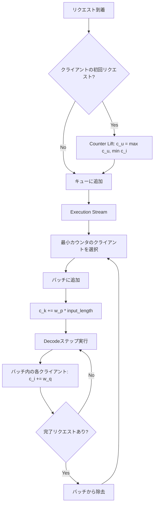

本記事は [https://arxiv.org/abs/2401.00588](https://arxiv.org/abs/2401.00588) (OSDI 2024) の解説記事です。

## 論文概要

LLMの推論サービスでは、短い雑談から長文ドキュメントの要約まで、リクエストごとの計算コストが大きく異なる。従来のレート制限（RPM: Requests Per Minute）は全リクエストを等価に扱うため、トークン数の多いリクエストを送信するクライアントが計算リソースを不当に専有する問題があった。著者らは、入力トークンと出力トークンの重み付きコスト関数に基づく公平性の定義を導入し、continuous batchingと統合可能なスケジューリングアルゴリズムVirtual Token Counter（VTC）を提案している。VTCはバックログ状態にある任意の2クライアント間のサービス差に対して2倍のタイトな上界を保証しつつ、work-conserving性（リクエストが待機中にサーバがアイドルにならない）を維持する。

この記事は [Zenn記事: Azure OpenAIマルチテナント負荷分散：テナント別クォータ×コスト配賦×優先度制御をAPIMで実装する](https://zenn.dev/0h_n0/articles/066a67fb511816) の深掘りです。

## 情報源

| 項目 | 内容 |
|------|------|
| 会議名 | OSDI 2024（18th USENIX Symposium on Operating Systems Design and Implementation） |
| URL | [https://arxiv.org/abs/2401.00588](https://arxiv.org/abs/2401.00588) |
| 著者 | Ying Sheng, Shiyi Cao, Dacheng Li, Banghua Zhu, Zhuohan Li, Danyang Zhuo, Joseph E. Gonzalez, Ion Stoica（UC Berkeley） |
| 掲載ページ | pp. 965-988 |
| GitHub | [https://github.com/Ying1123/VTC-artifact](https://github.com/Ying1123/VTC-artifact) |

## カンファレンス情報

**OSDIについて**: OSDI（USENIX Symposium on Operating Systems Design and Implementation）は、オペレーティングシステムおよびシステムソフトウェア分野における最高峰国際会議の一つである。SOSP（ACM Symposium on Operating Systems Principles）と並び、システム分野のトップ会議として位置づけられている。OSDI 2024は第18回目の開催であり、採択率は例年15-20%程度と競争率が高い。本論文はLLMサービングという新しいシステム課題に対して、公平性保証という基礎的な理論的フレームワークを提供した点が評価されたと考えられる。

## 背景と動機

LLM推論サービス（ChatGPT、Claude、Gemini等）では、複数のクライアント（テナント）が同一のGPUリソースを共有する。しかし、リクエストの計算コストは極めて不均一である。LMSYS Chatbot Arenaの実トレースによると、入力トークン数は2から1,021、出力トークン数は2から977と大きなばらつきがある。

従来のレート制限には以下の根本的な問題がある。

1. **RPM（Requests Per Minute）の不公平性**: 1リクエストを1単位とするため、100トークンのリクエストと1,000トークンのリクエストが同じコストとして扱われる。結果として、長いリクエストを送るクライアントがGPU時間を不当に専有する
2. **リソースの過少利用**: RPMの制限値を保守的に設定すると、クライアント数が少ない時間帯にGPUがアイドルとなりスループットが低下する。論文のTable 2（後述）では、RPM(5)がスループットを777 tokens/sから340 tokens/sに半減させたことが示されている
3. **Work-conserving性の欠如**: 厳格なレート制限はリクエストキューにリクエストが残っていてもサーバがアイドルになる状況を許容するため、高価なGPUリソースの浪費につながる

著者らは、ネットワーキング分野で確立されたfair queuing理論をLLMサービングに適応させることで、この課題に取り組んでいる。ただし、LLMサービングにはネットワークパケットスケジューリングとは異なる固有の課題がある。出力トークン数が事前に不明であること、continuous batchingにより複数クライアントのリクエストが同一バッチ内で同時実行されること、そしてプリエンプション（実行中リクエストの中断）のコストが高いことである。

## 主要な貢献

著者らが主張する本論文の貢献は以下の通りである。

1. **トークンベースの公平性定義**: 入力・出力トークンの重み付きコスト関数に基づくLLMサービング向けの公平性を形式化した
2. **VTCスケジューリングアルゴリズム**: continuous batchingと統合可能な公平スケジューラを設計し、約100行のコード追加で既存システムに実装可能であることを示した
3. **理論的保証**: バックログ状態にある任意の2クライアント間のサービス差に対して2倍のタイトな上界を証明し、これがwork-conservingかつ非プリエンプティブなスケジュールにおける最適であることを示した
4. **実験的検証**: 合成ワークロードおよびLMSYS Chatbot Arenaの実トレースを用いて、VTCがFCFS比でサービス差を最大2倍改善しつつスループットを維持することを確認した

## 技術的詳細

### サービスの定義とコスト関数

LLMサービングにおける「サービス」を定量化するため、著者らは重み付きトークンカウントに基づくコスト関数を導入している。

クライアント$f$が時間区間$[t_1, t_2)$に受けたサービス$W_f(t_1, t_2)$は以下で定義される。

$$
W_f(t_1, t_2) = w_p \cdot n_p^f(t_1, t_2) + w_q \cdot n_q^f(t_1, t_2)
$$

ここで、
- $n_p^f(t_1, t_2)$: クライアント$f$のリクエストに対して処理された入力（prefill）トークン数
- $n_q^f(t_1, t_2)$: クライアント$f$のリクエストに対して生成された出力（decode）トークン数
- $w_p$: 入力トークンの重み（論文では$w_p = 1$）
- $w_q$: 出力トークンの重み（論文では$w_q = 2$、OpenAIの料金体系に準拠）

この重み設定は、decodeフェーズがprefillフェーズに比べてGPU時間あたりの処理トークン数が少なく、計算コストが高いという実態を反映している。著者らは、任意の単調関数$h(n_p, n_q)$に一般化可能であることも述べているが、実験では上記の線形関数を使用している。

### 公平性の形式的定義

著者らは、max-min公平性に基づく3つの性質を定義している。

**バックログ状態（Definition 4.1）**: クライアント$f$が時間区間$[t_1, t_2)$においてバックログ状態にあるとは、任意の時刻$t \in [t_1, t_2)$において$f$がキュー内に待機中のリクエストを持つことを意味する。

公平なスケジューラは以下の3性質を満たすべきである。

1. **サービスの均等性**: バックログ状態にある任意の2クライアント$f, g$が区間$[t_1, t_2)$において同等のサービスを受ける
2. **バックログ優先**: バックログ状態のクライアントは非バックログ状態のクライアント以上のサービスを受ける
3. **Work-conserving性**: キューにリクエストが存在する限り、サーバはアイドルにならない

### VTC（Virtual Token Counter）アルゴリズム

VTCの中核は、各クライアントに対する仮想トークンカウンタ$\{c_i\}$の管理である。アルゴリズムは2つの並行ストリームで構成される。



**Monitoring Stream（リクエスト受付）**:

新規リクエスト到着時、クライアント$u$がキューに初めてリクエストを持つ場合、counter liftを実行する。

$$
c_u \leftarrow \max\{c_u, \min_{i \in P} c_i\}
$$

ここで$P$はキュー内にリクエストを持つクライアントの集合である。この操作は、長時間アイドルだったクライアントが蓄積した「未使用クレジット」を利用して一時的にリソースを独占することを防止する。これはLinuxのCFS（Completely Fair Scheduler）におけるvruntime調整と類似した設計である。

**Execution Stream（バッチ実行）**:

バッチに空きが生じた際、キュー内で最小のカウンタ$c_k$を持つクライアント$k$のリクエストを選択する。

```python
def select_new_requests(queue: list, counters: dict, batch_capacity: int) -> list:
    """VTCに基づくリクエスト選択

    Args:
        queue: 待機中リクエストのリスト [(request, client_id), ...]
        counters: クライアント別仮想トークンカウンタ {client_id: float}
        batch_capacity: バッチの残り容量（トークン数）

    Returns:
        バッチに追加するリクエストのリスト
    """
    selected: list = []
    remaining_capacity = batch_capacity

    while queue and remaining_capacity > 0:
        # 最小カウンタのクライアントのリクエストを選択
        best_request = None
        best_client = None
        min_counter = float("inf")

        for request, client_id in queue:
            if counters.get(client_id, 0.0) < min_counter:
                min_counter = counters[client_id]
                best_request = request
                best_client = client_id

        if best_request is None:
            break

        input_len = len(best_request.input_tokens)
        if input_len > remaining_capacity:
            break

        # カウンタ更新: prefillコストを加算
        counters[best_client] += W_P * input_len
        selected.append(best_request)
        queue.remove((best_request, best_client))
        remaining_capacity -= input_len

    return selected


def after_decode_step(batch: list, counters: dict, w_q: float = 2.0) -> None:
    """各decodeステップ後のカウンタ更新

    Args:
        batch: 実行中リクエストのリスト [(request, client_id), ...]
        counters: クライアント別仮想トークンカウンタ
        w_q: 出力トークンの重み
    """
    # バッチ内の各クライアントについて、生成したトークン分だけカウンタを加算
    clients_in_batch: dict[str, int] = {}
    for _, client_id in batch:
        clients_in_batch[client_id] = clients_in_batch.get(client_id, 0) + 1

    for client_id, count in clients_in_batch.items():
        counters[client_id] += w_q * count
```

各decodeステップ完了後、バッチ内の各クライアント$i$のカウンタを以下のように更新する。

$$
c_i \leftarrow c_i + w_q \cdot |\{r \mid \text{client}(r) = i, r \in B\}|
$$

ここで$B$は現在のバッチ、$|\{r \mid \text{client}(r) = i, r \in B\}|$はバッチ内でクライアント$i$に属するリクエスト数である。

### 理論的保証: 2倍のタイトな上界

**Theorem 4.4**: 任意のクライアント$f, g$と、$f, g$がともにバックログ状態にある任意の時間区間$[t_1, t_2)$に対して、VTCは以下を保証する。

$$
|W_f(t_1, t_2) - W_g(t_1, t_2)| \leq 2 \cdot \max(w_p \cdot L_{\text{input}}, w_q \cdot M)
$$

ここで、
- $L_{\text{input}}$: 1リクエストあたりの最大入力トークン数
- $M$: 実行バッチに収容可能な最大トークン数

**証明の骨子**: Lemma 4.3により、キュー内のクライアントカウンタの最大差が$\max(w_p \cdot L_{\text{input}}, w_q \cdot M)$以下に保たれることが示される。バックログ状態のクライアント$f$が受けたサービスは$W_f(t_1, t_2) = c_f(t_2) - c_f(t_1)$と表せるため、サービス差はカウンタ差の2倍（区間の両端分）で上界が得られる。

**Theorem 4.8（タイトネス）**: work-conservingかつ非プリエンプティブな任意のスケジュールに対して、サービス差が$w_q \cdot M$以上となるリクエスト到着列が存在することが証明されている。これにより、VTCの2倍上界がこのクラスのスケジューラにおける最適であることが確認される。

## 実装のポイント

### Continuous Batchingとの統合

VTCの実装上の重要な特徴は、continuous batching（iteration-level scheduling）との自然な統合にある。従来のstatic batchingではバッチ全体の完了を待つ必要があったが、continuous batchingでは各decodeステップで完了したリクエストをバッチから除去し、新たなリクエストを追加できる。

VTCはこのcontinuous batchingフレームワークの`select_new_requests()`関数を置き換えるだけで実装可能であり、著者らはS-LoRAシステム上に約100行のコード追加で実装したと報告している。

### 実装上の注意点

1. **Counter Liftの必要性**: counter liftを省略したLCF（Least Counter First）変種では、長時間アイドル後に復帰したクライアントがカウンタの差分だけリソースを独占するburst問題が発生する。論文Section 5.2のON/OFFパターン実験でこの問題が確認されている

2. **出力長の予測**: 入力トークン数はリクエスト到着時に既知だが、出力トークン数は生成完了まで不明である。VTCはdecodeステップごとにカウンタを逐次更新するため、出力長の事前予測は不要である。ただし、prefillフェーズでの入力トークンコストのみでバッチ選択を行うため、出力が極端に長いリクエストの公平性への影響は実行中に自然に反映される

3. **プリエンプションなし**: VTCは実行中のリクエストをプリエンプトしない。プリエンプションはKV cacheの退避・復元コストが高く、work-conserving性との両立が困難であるためである。著者らはプリエンプションにより理論的にはより小さいサービス差を達成可能だが、実用上のオーバーヘッドが大きいと述べている

## Production Deployment Guide

VTCの概念をAPIゲートウェイ層でのトークンベース公平性制御に適用する実装ガイドを示す。本論文のVTCアルゴリズムは、Zenn記事で解説しているAzure API Managementの`llm-token-limit`ポリシーの学術的基盤であり、マルチテナント環境でのトークンレベル公平性をAWS上で実現する。

### AWS実装パターン（コスト最適化重視）

トラフィック量に応じた3段階の推奨構成を示す。コスト試算は2026年9月時点のAWS ap-northeast-1（東京）リージョン料金に基づく概算値であり、実際のコストはトラフィックパターンやバースト使用量により変動する。最新料金はAWS Pricing Calculatorでの確認を推奨する。

| 構成 | トラフィック | アーキテクチャ | 月額概算 |
|------|-------------|--------------|---------|
| Small | ~100 req/日 | Lambda + Bedrock + DynamoDB | $50-150 |
| Medium | ~1,000 req/日 | ECS Fargate + Bedrock + ElastiCache | $300-800 |
| Large | 10,000+ req/日 | EKS + Karpenter + Spot + SageMaker | $2,000-5,000 |

**Small構成の内訳**: Lambda（$5-15/月）、Bedrock Claude/Titan呼び出し（$30-100/月）、DynamoDB On-Demand（$5-20/月）、CloudWatch（$5-10/月）。API Gateway経由でリクエストを受け、Lambdaがテナント別のVTCカウンタをDynamoDBに記録し、カウンタ値が最小のテナントのリクエストを優先的にBedrockへ転送する。

**Medium構成の内訳**: ECS Fargate（$80-200/月）、Bedrock（$150-400/月）、ElastiCache Redis（$50-120/月）、ALB（$20-40/月）。ElastiCacheにVTCカウンタを保持し、低レイテンシでのカウンタ参照・更新を実現する。

**Large構成の内訳**: EKS Control Plane（$72/月）、EC2 Spot Instances（$500-1,500/月、On-Demand比最大90%削減）、SageMaker推論エンドポイント（$1,000-3,000/月）、ElastiCache（$100-200/月）。Karpenterによる自動スケーリングでSpot Instancesを優先的に使用する。

**コスト削減テクニック**:
- Spot Instances活用: On-Demand比で最大90%削減（p4d.24xlargeなどGPUインスタンス）
- Reserved Instances: 1年コミットで最大72%削減（ElastiCache、常時稼働のECSタスク）
- Bedrock Batch API: 非リアルタイム処理で50%削減
- Prompt Caching有効化: 繰り返しプロンプトで30-90%削減

### Terraformインフラコード

**Small構成（Serverless）**: Lambda + Bedrock + DynamoDB

```hcl
# VTC Fair Scheduler - Small構成 (Serverless)
# 注意: 2026年9月時点のTerraform AWS Provider v5.x系を前提

resource "aws_dynamodb_table" "vtc_counters" {
  name         = "vtc-token-counters"
  billing_mode = "PAY_PER_REQUEST" # On-Demandでコスト最適化
  hash_key     = "tenant_id"

  attribute {
    name = "tenant_id"
    type = "S"
  }

  server_side_encryption {
    enabled = true # KMS暗号化
  }

  point_in_time_recovery {
    enabled = true
  }

  tags = {
    Project = "vtc-fair-scheduler"
    Env     = "production"
  }
}

resource "aws_iam_role" "vtc_lambda" {
  name = "vtc-scheduler-lambda-role"
  assume_role_policy = jsonencode({
    Version = "2012-10-17"
    Statement = [{
      Action = "sts:AssumeRole"
      Effect = "Allow"
      Principal = { Service = "lambda.amazonaws.com" }
    }]
  })
}

resource "aws_iam_role_policy" "vtc_lambda_policy" {
  name = "vtc-lambda-policy"
  role = aws_iam_role.vtc_lambda.id
  policy = jsonencode({
    Version = "2012-10-17"
    Statement = [
      {
        Effect   = "Allow"
        Action   = ["dynamodb:GetItem", "dynamodb:PutItem", "dynamodb:UpdateItem", "dynamodb:Scan"]
        Resource = aws_dynamodb_table.vtc_counters.arn
      },
      {
        Effect   = "Allow"
        Action   = ["bedrock:InvokeModel"]
        Resource = "arn:aws:bedrock:ap-northeast-1::foundation-model/*"
      },
      {
        Effect   = "Allow"
        Action   = ["logs:CreateLogGroup", "logs:CreateLogStream", "logs:PutLogEvents"]
        Resource = "arn:aws:logs:*:*:*"
      }
    ]
  })
}

resource "aws_lambda_function" "vtc_scheduler" {
  function_name = "vtc-fair-scheduler"
  runtime       = "python3.12"
  handler       = "handler.lambda_handler"
  role          = aws_iam_role.vtc_lambda.arn
  timeout       = 120
  memory_size   = 512

  environment {
    variables = {
      COUNTER_TABLE = aws_dynamodb_table.vtc_counters.name
      W_PREFILL     = "1"
      W_DECODE      = "2"
    }
  }

  tracing_config {
    mode = "Active" # X-Ray有効化
  }
}

resource "aws_cloudwatch_metric_alarm" "vtc_cost_alarm" {
  alarm_name          = "vtc-daily-cost-spike"
  comparison_operator = "GreaterThanThreshold"
  evaluation_periods  = 1
  metric_name         = "EstimatedCharges"
  namespace           = "AWS/Billing"
  period              = 86400
  statistic           = "Maximum"
  threshold           = 100
  alarm_actions       = [aws_sns_topic.alerts.arn]
}

resource "aws_sns_topic" "alerts" {
  name              = "vtc-cost-alerts"
  kms_master_key_id = "alias/aws/sns"
}
```

**Large構成（Container）**: EKS + Karpenter + Spot

```hcl
# VTC Fair Scheduler - Large構成 (EKS + Spot)
module "eks" {
  source  = "terraform-aws-modules/eks/aws"
  version = "~> 20.0"

  cluster_name    = "vtc-scheduler-cluster"
  cluster_version = "1.31"

  vpc_id     = module.vpc.vpc_id
  subnet_ids = module.vpc.private_subnets

  cluster_endpoint_public_access = false # プライベートアクセスのみ
}

# Karpenter: Spot優先の自動スケーリング
resource "kubectl_manifest" "karpenter_nodepool" {
  yaml_body = yamlencode({
    apiVersion = "karpenter.sh/v1"
    kind       = "NodePool"
    metadata   = { name = "vtc-gpu-pool" }
    spec = {
      template = {
        spec = {
          requirements = [
            { key = "karpenter.sh/capacity-type", operator = "In", values = ["spot", "on-demand"] },
            { key = "node.kubernetes.io/instance-type", operator = "In",
              values = ["g5.xlarge", "g5.2xlarge", "p4d.24xlarge"] }
          ]
        }
      }
      disruption = {
        consolidationPolicy = "WhenEmptyOrUnderutilized"
        consolidateAfter    = "30s"
      }
      limits = { cpu = "256", memory = "1024Gi" }
    }
  })
}

resource "aws_secretsmanager_secret" "bedrock_config" {
  name                    = "vtc-bedrock-config"
  recovery_window_in_days = 7
}

resource "aws_budgets_budget" "vtc_monthly" {
  name         = "vtc-monthly-budget"
  budget_type  = "COST"
  limit_amount = "5000"
  limit_unit   = "USD"
  time_unit    = "MONTHLY"

  notification {
    comparison_operator       = "GREATER_THAN"
    threshold                 = 80
    threshold_type            = "PERCENTAGE"
    notification_type         = "ACTUAL"
    subscriber_sns_topic_arns = [aws_sns_topic.alerts.arn]
  }
}
```

### 運用・監視設定

**CloudWatch Logs Insights クエリ**: テナント別トークン使用量の異常検知

```
fields @timestamp, tenant_id, input_tokens, output_tokens,
       (input_tokens * 1 + output_tokens * 2) as weighted_cost
| stats sum(weighted_cost) as total_cost, count(*) as request_count by tenant_id, bin(1h)
| sort total_cost desc
| limit 20
```

**CloudWatch Logs Insights クエリ**: レイテンシ分析（P95/P99）

```
fields @timestamp, latency_ms, tenant_id
| stats percentile(latency_ms, 95) as p95,
        percentile(latency_ms, 99) as p99,
        avg(latency_ms) as avg_latency
  by bin(5m)
| sort @timestamp desc
```

**CloudWatch アラーム設定（Python boto3）**:

```python
import boto3

cloudwatch = boto3.client("cloudwatch", region_name="ap-northeast-1")

def create_vtc_alarms(sns_topic_arn: str) -> None:
    """VTC監視用CloudWatchアラームを作成

    Args:
        sns_topic_arn: 通知先SNSトピックのARN
    """
    # Bedrockトークン使用量スパイク検知
    cloudwatch.put_metric_alarm(
        AlarmName="vtc-bedrock-token-spike",
        MetricName="InputTokenCount",
        Namespace="AWS/Bedrock",
        Statistic="Sum",
        Period=3600,
        EvaluationPeriods=1,
        Threshold=500000,
        ComparisonOperator="GreaterThanThreshold",
        AlarmActions=[sns_topic_arn],
    )

    # Lambda実行時間異常検知
    cloudwatch.put_metric_alarm(
        AlarmName="vtc-lambda-duration-anomaly",
        MetricName="Duration",
        Namespace="AWS/Lambda",
        Dimensions=[{"Name": "FunctionName", "Value": "vtc-fair-scheduler"}],
        Statistic="p99",
        Period=300,
        EvaluationPeriods=3,
        Threshold=90000,  # 90秒
        ComparisonOperator="GreaterThanThreshold",
        AlarmActions=[sns_topic_arn],
    )
```

**X-Ray トレーシング設定**:

```python
from aws_xray_sdk.core import xray_recorder, patch_all

patch_all()  # boto3自動計装

@xray_recorder.capture("vtc_schedule_request")
def schedule_request(tenant_id: str, input_tokens: int) -> dict:
    """リクエストスケジューリングのトレーシング

    Args:
        tenant_id: テナント識別子
        input_tokens: 入力トークン数

    Returns:
        スケジューリング結果
    """
    subsegment = xray_recorder.current_subsegment()
    subsegment.put_annotation("tenant_id", tenant_id)
    subsegment.put_metadata("input_tokens", input_tokens)
    subsegment.put_metadata("w_prefill", 1)
    subsegment.put_metadata("w_decode", 2)
    # ... スケジューリングロジック
    return {"scheduled": True, "priority": 0}
```

**Cost Explorer日次レポート**:

```python
import boto3
from datetime import datetime, timedelta

ce = boto3.client("ce", region_name="us-east-1")
sns = boto3.client("sns", region_name="ap-northeast-1")

def daily_cost_report(sns_topic_arn: str, threshold_usd: float = 100.0) -> dict:
    """日次コストレポートを取得し、閾値超過でSNS通知

    Args:
        sns_topic_arn: 通知先SNSトピックのARN
        threshold_usd: 通知閾値（USD/日）

    Returns:
        コストレポート辞書
    """
    end = datetime.utcnow().strftime("%Y-%m-%d")
    start = (datetime.utcnow() - timedelta(days=1)).strftime("%Y-%m-%d")

    response = ce.get_cost_and_usage(
        TimePeriod={"Start": start, "End": end},
        Granularity="DAILY",
        Metrics=["UnblendedCost"],
        Filter={"Tags": {"Key": "Project", "Values": ["vtc-fair-scheduler"]}},
        GroupBy=[{"Type": "DIMENSION", "Key": "SERVICE"}],
    )

    total = sum(
        float(g["Metrics"]["UnblendedCost"]["Amount"])
        for r in response["ResultsByTime"]
        for g in r["Groups"]
    )

    if total > threshold_usd:
        sns.publish(
            TopicArn=sns_topic_arn,
            Subject=f"VTC Cost Alert: ${total:.2f}/day exceeds ${threshold_usd}",
            Message=f"Daily cost: ${total:.2f}\nBreakdown: {response['ResultsByTime']}",
        )

    return {"date": start, "total_usd": total, "details": response}
```

### コスト最適化チェックリスト

**アーキテクチャ選択**:
- [ ] トラフィック量に応じた構成選択（~100 req/日: Serverless、~1,000: Hybrid、10,000+: Container）
- [ ] VTCカウンタストアの選択（DynamoDB: 低頻度、ElastiCache: 高頻度）
- [ ] マルチリージョン要否の判断

**リソース最適化**:
- [ ] EC2/EKSノード: Spot Instances優先（On-Demand比最大90%削減）
- [ ] Reserved Instances: ElastiCache等の常時稼働リソースに1年コミット（最大72%削減）
- [ ] Savings Plans: Compute Savings Plansの検討
- [ ] Lambda: Power Tuningによるメモリサイズ最適化
- [ ] ECS/EKS: Karpenter consolidationPolicyでアイドル時自動スケールダウン

**LLMコスト削減**:
- [ ] Bedrock Batch API: 非リアルタイム処理で50%削減
- [ ] Prompt Caching有効化: 繰り返しプロンプトで30-90%削減
- [ ] モデル選択ロジック: リクエスト複雑度に応じてHaiku/Sonnet/Opusを切替
- [ ] トークン数制限: max_tokensパラメータの適切な設定
- [ ] テナント別クォータ: VTCカウンタに基づく上限設定

**監視・アラート**:
- [ ] AWS Budgets: 月次予算アラート（80%/100%閾値）
- [ ] CloudWatch アラーム: Bedrockトークン使用量、Lambda実行時間
- [ ] Cost Anomaly Detection: ML検知による異常コスト通知
- [ ] 日次コストレポート: Cost Explorer APIによる自動レポート + SNS通知

**リソース管理**:
- [ ] 未使用リソース削除: Trusted Advisorによる定期チェック
- [ ] タグ戦略: Project/Env/Tenantタグの統一
- [ ] ライフサイクルポリシー: CloudWatch Logsの保持期間設定（30日）
- [ ] 開発環境夜間停止: EventBridgeによる自動停止/起動
- [ ] NAT Gateway最適化: VPCエンドポイント活用でデータ転送料削減

## 実験結果

### 合成ワークロード（論文Section 5.2）

著者らはLlama-2-7bモデルをA10G GPU（24GB VRAM）上で実行し、メモリプールを10,000 KV cacheトークンに設定して実験を行っている。重みは$w_p = 1, w_q = 2$である。

**定常負荷（2クライアント）**: クライアントAが10 req/s、クライアントBが3 req/sの定常負荷をかけた場合、FCFSではクライアントAの累積サービスが時間とともに発散的に増加し、500Kトークン以上のサービス差が生じた。一方、VTCではサービス差が一定値以下に抑制された（論文Figure 3）。

**ON/OFFパターン（3クライアント）**: 一部クライアントが間欠的にリクエストを送信するワークロードにおいて、VTCはwork-conserving性を維持しつつ、バックログ期間中の公平性を保証した。counter liftを省略したLCF変種ではOFF期間後のburst問題が確認されている（論文Figure 5, 6）。

**隔離性（Theorem 4.13）**: 行儀の良いクライアントのレスポンス時間が、行儀の悪いクライアント（過剰送信）の影響を受けないことが確認されている。行儀の悪いクライアントのリクエストレートを増加させても、行儀の良いクライアントのレイテンシは変化しなかった（論文Figure 9）。

### 実ワークロード（論文Section 5.3, Table 2）

LMSYS Chatbot Arenaの実トレースデータ（27クライアント、10分間、210 requests/min）を用いた結果は以下の通りである。

| スケジューラ | Max Service Diff | Avg Service Diff | スループット (tokens/s) |
|-------------|-----------------|-----------------|----------------------|
| FCFS | 759.97 | 433.53 | 777 |
| VTC | 368.40 | 251.66 | 779 |
| VTC (predict) | 365.47 | 240.33 | 773 |
| RPM(5) | 143.86 | 83.58 | 340 |
| RPM(30) | 693.66 | 309.45 | 747 |

論文Table 2より引用。VTCはFCFS比で最大サービス差を51.5%削減（759.97 → 368.40）しつつ、スループットを維持している（777 → 779 tokens/s）。RPM(5)は最大サービス差143.86と最も公平だが、スループットが340 tokens/sに低下しており、work-conserving性を犠牲にしている。RPM(30)は制限が緩いためスループットは747 tokens/sを維持するが、公平性改善は限定的である。

VTC (predict)は出力長の予測モデルを組み合わせた変種であり、VTC単体と同等の性能を示している。これは、VTCがdecodeステップごとのカウンタ更新により出力長予測への依存が小さいことを示唆している。

## 実運用への応用

### Azure APIMのllm-token-limitポリシーとの関連

Zenn記事で解説しているAzure API Managementの`llm-token-limit`ポリシーは、本論文のトークンベース公平性の概念を実運用レベルで具現化したものと位置づけられる。RPMベースの`rate-limit-by-key`がリクエスト単位で制限するのに対し、`llm-token-limit`はトークン消費量に基づく制限を提供する。

本論文が示す知見の実運用への示唆は以下の通りである。

1. **トークンベースの計測**: RPM制限からトークンベースの制限への移行は、異種リクエストが混在するマルチテナント環境において公平性を大幅に改善する。Azure APIMの`llm-token-limit`や、AWSではAPI Gateway + Lambda Authorizerでの実装が考えられる

2. **Counter Liftの必要性**: アイドル後のバースト防止メカニズムは、テナントが間欠的にAPIを利用するSaaS環境で重要である。トークンクォータの「繰越」を無制限に許可すると、一時的なリソース独占が発生する

3. **Work-conserving性の価値**: GPU/推論エンドポイントのコストが高い環境では、厳格なレート制限によるリソースの遊休化は大きな損失となる。VTCのwork-conserving性は、クォータ未使用のテナントの枠を他テナントに動的に割り当てる設計を理論的に裏付けている

### 制約と限界

著者らが報告している制約は以下の通りである。

- **プリエンプションなし**: 実行中のリクエストを中断しないため、極端に長い出力を生成するリクエストがバッチを占有する可能性がある
- **単一サーバ**: 分散システムへの拡張は今後の課題とされている
- **オートスケーリング非対応**: GPUリソースの動的増減は考慮されていない
- **コスト関数の選択**: $w_p = 1, w_q = 2$の妥当性はOpenAIの料金体系に依存しており、異なるハードウェアやモデルでは最適な重みが異なる可能性がある

## 関連研究

- **GPS（Generalized Processor Sharing）/ WFQ（Weighted Fair Queuing）**: ネットワーキング分野のfair queuing理論の基礎。VTCはWFQのLLMサービング版と位置づけられるが、出力長の不確定性とbatching効果という固有の課題に対処している
- **DRF（Dominant Resource Fairness）**: 複数リソース（CPU、メモリ）の公平配分理論。VTCはトークンという単一の抽象化リソースに焦点を当てている点で異なる
- **Linux CFS（Completely Fair Scheduler）**: VTCのcounter liftメカニズムはCFSのvruntime調整と類似しているが、LLMサービングのbatching特性に適応させている
- **FastServe**: LLMサービングにおけるプリエンプティブスケジューリングを探求したが、ジョブ完了時間の最小化を目的としており、クライアント間の公平性は考慮していない
- **DRR（Deficit Round Robin）**: 可変長パケットの公平スケジューリング。VTCとの違いは、DRRがパケット単位で動作するのに対し、VTCはトークン粒度でカウンタを更新する点である

## まとめと今後の展望

本論文は、LLMサービングにおける公平性問題に対して、トークンコストベースの形式的定義とVTCアルゴリズムという理論的に裏付けられた解決策を提示した。2倍のタイトな上界保証は、work-conservingかつ非プリエンプティブなスケジューラの理論的限界を明らかにしている。

実務への示唆として、マルチテナントLLMサービスの設計においてRPMベースのレート制限からトークンベースの公平性制御への移行が重要であること、そしてwork-conserving性の維持がGPUリソースの有効活用に不可欠であることが示されている。Azure APIMの`llm-token-limit`ポリシーやAWSでのカスタム実装において、VTCの概念はテナント間公平性の理論的基盤を提供する。

今後の研究方向として、著者らは分散システムへの拡張、プリエンプションを含むスケジューリング、オートスケーリングとの統合を挙げている。

## 参考文献

- **Conference URL**: [https://www.usenix.org/conference/osdi24/presentation/sheng](https://www.usenix.org/conference/osdi24/presentation/sheng)
- **arXiv**: [https://arxiv.org/abs/2401.00588](https://arxiv.org/abs/2401.00588)
- **Code**: [https://github.com/Ying1123/VTC-artifact](https://github.com/Ying1123/VTC-artifact)
- **Related Zenn article**: [https://zenn.dev/0h_n0/articles/066a67fb511816](https://zenn.dev/0h_n0/articles/066a67fb511816)
