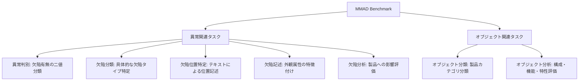

## 論文概要（Abstract）

本記事は [MMAD: A Comprehensive Benchmark for Multimodal Large Language Models in Industrial Anomaly Detection](https://arxiv.org/abs/2410.09453) の解説記事です。

MMADは、マルチモーダル大規模言語モデル（MLLM）の産業異常検知能力を体系的に評価するための包括的ベンチマークである。著者らは39,672の質問、8,366の産業画像、38カテゴリ、244種類の欠陥を含むデータセットを構築し、7つのサブタスクにわたって商用・オープンソースの主要MLLMを評価している。GPT-4oが商用モデル中で最高の74.92%を記録する一方、人間の専門家は86.65%を達成しており、MLLMと人間の間にはなお大きなギャップが存在する。

この記事は [Zenn記事: Gemini 3.7 Flashで設備点検動画・音声から異常検知レポートを自動生成する](https://zenn.dev/0h_n0/articles/1ca988c9024a38) の深掘りです。

## 情報源

- **arXiv ID**: 2410.09453
- **URL**: [https://arxiv.org/abs/2410.09453](https://arxiv.org/abs/2410.09453)
- **著者**: Xi Jiang, Jian Li, Hanqiu Deng, et al.
- **発表年**: 2024（ICLR 2025採択）
- **分野**: cs.AI, cs.CV

## 背景と動機（Background & Motivation）

産業製造ラインにおける異常検知は品質管理の要であり、従来はPatchCoreやFastFlowなどの特化型モデルが主流であった。これらの手法は画素レベルの異常セグメンテーションには有効だが、「この欠陥が製品にどのような影響を与えるか」「欠陥の種類は何か」といった高次の理解を要するタスクには対応が難しい。

一方、GPT-4oやGeminiなどのMLLMは画像理解と自然言語による推論を統合的に行えるため、産業異常検知のパラダイムを変える可能性がある。しかし、MLLMの産業異常検知能力を体系的に評価するベンチマークが存在しなかった。既存のベンチマークはMLLMの一般的な画像理解能力を測るものが大半であり、産業ドメイン固有の課題（微小な欠陥の検出、欠陥分類、影響分析など）を網羅的にカバーしていなかった。

著者らはこのギャップを埋めるため、4つの代表的データセットを統合し、7つの評価サブタスクを定義した包括的ベンチマークMMADを構築している。

## 主要な貢献（Key Contributions）

- **貢献1**: 産業異常検知に特化したMLLM向け包括的ベンチマーク（39,672問、8,366画像、38カテゴリ、244欠陥タイプ）の構築。GPT-4Vによるデータ生成パイプラインと26名の研究者による200時間超の手動検証を組み合わせた高品質なデータセットである
- **貢献2**: 異常判別から欠陥分析まで7つの評価サブタスクの定義と、商用・オープンソース合わせた主要MLLMの網羅的な性能評価。人間の専門家・一般参加者との比較も含む
- **貢献3**: RAGおよびExpert Agent Collaborationという訓練不要の改善手法の提案と検証。InternVL2-40Bで+6.75%、欠陥分類タスクで+16-20%の改善を実証

## 技術的詳細（Technical Details）

### ベンチマーク構成

MMADは以下の4つの既存データセットを統合して構築されている。

| データセット | 画像数 | 質問数 | カテゴリ数 | 欠陥タイプ数 |
|:------------|-------:|-------:|----------:|-----------:|
| MVTec AD | 1,691 | 8,338 | 15 | 73 |
| MVTec LOCO AD | 1,566 | 7,624 | 5 | 89 |
| VisA | 2,141 | 10,622 | 12 | 67 |
| GoodsAD | 2,968 | 13,088 | 6 | 15 |
| **合計** | **8,366** | **39,672** | **38** | **244** |

### 7つの評価サブタスク

著者らは産業異常検知に必要な能力を7つのサブタスクに分解している。



各タスクの質問はGPT-4Vを用いて自動生成した後、26名の研究者が200時間以上かけて手動で検証・修正している。これにより、自動生成の効率性と人手による品質保証を両立している。

### 評価指標

各サブタスクは選択式（多肢選択）形式で出題され、正答率（Accuracy）で評価される。総合スコアは7タスクの平均正答率として算出される。

$$
\text{Score}_{\text{total}} = \frac{1}{7} \sum_{t=1}^{7} \text{Acc}_t
$$

ここで、
- $\text{Acc}_t$: タスク $t$ における正答率
- $t \in \{1, 2, ..., 7\}$: 7つのサブタスクのインデックス

### 訓練不要の改善手法

#### RAG（Retrieval-Augmented Generation）

著者らは、ドメイン知識をプロンプトに埋め込むRAG手法を提案している。具体的には、各産業製品カテゴリについて典型的な欠陥パターンや正常状態の特徴をテキストで要約し、推論時にプロンプトに付加する。

```python
def build_rag_prompt(
    image_path: str,
    question: str,
    domain_knowledge: dict[str, str],
    category: str,
) -> str:
    """RAGプロンプトを構築する

    Args:
        image_path: 検査対象画像のパス
        question: 評価質問文
        domain_knowledge: カテゴリ別のドメイン知識辞書
        category: 製品カテゴリ名

    Returns:
        ドメイン知識を付加したプロンプト文字列
    """
    knowledge = domain_knowledge.get(category, "")
    prompt = (
        f"You are an industrial quality inspector.\n"
        f"Domain knowledge for {category}:\n{knowledge}\n\n"
        f"Based on the image and the above knowledge, "
        f"answer the following question:\n{question}"
    )
    return prompt
```

この手法により、InternVL2-40Bで全体+6.75%、特に欠陥分類タスクでは+16-20%の改善が得られたと報告されている（論文Table 5より）。

#### Expert Agent Collaboration

Expert Agent Collaborationは、異常検知の専門モデル（例: セグメンテーションモデル）の出力をMLLMの入力に統合する手法である。具体的には、異常マスク（Ground Truth）を追加情報としてMLLMに提供する。

プロンプトの構造としては、異常検知モデルの出力（例: 「右上領域に0.3mm程度の線状欠陥を検出」）をテキスト記述に変換し、MLLMへの入力プロンプトに`"An anomaly detection model has identified the following: {mask_description}"`として組み込む。

この手法により、異常判別タスクで+10.10%、欠陥位置特定タスクで+21.29%の改善が得られたと報告されている（論文Table 5より）。

### スケーリング則

著者らはInternVL2シリーズ（1B, 2B, 4B, 8B, 26B, 40B, 76B）を用いてモデルサイズと性能の関係を分析している。最大モデル（76B）と最小モデル（1B）の間で23.37%の精度差があり、モデルサイズの増大が産業異常検知性能に対して明確な正の相関を持つことが示されている。

### マルチ画像入力の影響

正常サンプルを参照画像として追加する効果を検証した結果、4枚までは性能が向上するが、8枚以上では「情報過負荷」（information overload）によって性能が劣化することが報告されている。これはMLLMのコンテキスト処理能力の限界を示唆しており、実運用ではfew-shotの参照画像数を慎重に調整する必要がある。

## 実装のポイント（Implementation）

MMADベンチマークを自システムの評価に活用する際の注意点を以下に示す。

1. **プロンプト設計**: 多肢選択形式で評価する場合、選択肢の順序がMLLMの回答に影響する（位置バイアス）。著者らはこのバイアスを緩和するため、選択肢の配置を工夫している。実運用でも選択肢のシャッフルやChain-of-Thought形式の併用が有効である

2. **RAGの知識ベース構築**: ドメイン知識の要約品質がRAGの効果を大きく左右する。製品カテゴリごとに、正常状態の特徴、典型的な欠陥パターン、許容範囲の基準を構造化して整備することが重要である

3. **参照画像の枚数制御**: 正常サンプルの参照画像は4枚を上限とし、画像の多様性（異なる角度、照明条件）を確保する。8枚以上ではコンテキスト長の圧迫と情報過負荷により逆効果となる

4. **Expert Agentの段階的導入**: 異常セグメンテーションモデル（PatchCoreなど）の出力をテキスト化してMLLMに渡すパイプラインは段階的に構築する。まず異常マスクのテキスト記述を手動で作成して効果を検証し、その後自動化する

## Production Deployment Guide

本論文のRAGパイプラインおよびExpert Agent Collaborationは、MLLMベースの産業異常検知システムとしてプロダクション展開が可能である。以下ではAWS上での実装パターンを示す。

### AWS実装パターン（コスト最適化重視）

**トラフィック量別の推奨構成**:

| 構成 | トラフィック | AWSサービス | 月額概算 |
|:-----|:-----------|:-----------|--------:|
| Small | ~100 req/日 | Lambda + Bedrock + S3 + DynamoDB | $80-200 |
| Medium | ~1,000 req/日 | ECS Fargate + Bedrock + ElastiCache + S3 | $400-900 |
| Large | 10,000+ req/日 | EKS + Karpenter + Spot + Bedrock Batch | $2,500-6,000 |

**Small構成（~100 req/日）**:
- Lambda（1024MB, 60秒タイムアウト）で画像前処理と質問生成を実行
- Bedrock（Claude 3.5 Sonnet / Gemini）で異常判定・欠陥分類を実行
- S3に検査画像と参照画像を保存、DynamoDBに検査結果と欠陥履歴を記録
- 月額概算: Lambda $5 + Bedrock $50-150 + S3 $3 + DynamoDB $5 = $63-163

**Medium構成（~1,000 req/日）**:
- ECS Fargate（2vCPU, 4GB RAM）でRAGパイプラインを常駐実行
- 月額概算: ECS $70 + Bedrock $200-500 + ElastiCache $50 + S3 $10 = $330-630

**Large構成（10,000+ req/日）**:
- EKS + Karpenter + Spot Instances（g5.xlarge）で推論ワーカーを自動スケーリング
- 月額概算: EKS $73 + Spot $800-2,000 + Bedrock $1,000-3,000 + S3 $50 = $1,923-5,123

**コスト削減テクニック**:
- Spot Instances活用でGPUインスタンスを最大90%削減（g5.xlarge: On-Demand $1.006/h → Spot $0.30/h程度）
- Reserved Instances 1年コミットで最大72%削減
- Bedrock Batch API使用で非リアルタイム処理を50%削減
- Prompt Caching有効化でドメイン知識部分のトークンコストを30-90%削減

**注意**: 上記は2026年9月時点のAWS東京リージョン料金に基づく概算値。実際のコストはトラフィックパターンにより変動するため、最新料金はAWS料金計算ツールで確認を推奨する。

### Terraformインフラコード

**Small構成（Serverless）**:

```hcl
# Small構成: Lambda + Bedrock + DynamoDB（主要リソースのみ抜粋）

resource "aws_iam_role" "anomaly_detector_lambda" {
  name = "anomaly-detector-lambda-role"
  assume_role_policy = jsonencode({
    Version = "2012-10-17"
    Statement = [{
      Action    = "sts:AssumeRole"
      Effect    = "Allow"
      Principal = { Service = "lambda.amazonaws.com" }
    }]
  })
}

resource "aws_iam_role_policy" "lambda_bedrock" {
  name = "lambda-bedrock-access"
  role = aws_iam_role.anomaly_detector_lambda.id
  policy = jsonencode({
    Version = "2012-10-17"
    Statement = [
      {
        Effect   = "Allow"
        Action   = ["bedrock:InvokeModel"]
        Resource = "arn:aws:bedrock:ap-northeast-1::foundation-model/*"
      },
      {
        Effect = "Allow"
        Action = ["s3:GetObject", "s3:PutObject"]
        Resource = "${aws_s3_bucket.inspection_images.arn}/*"
      },
      {
        Effect   = "Allow"
        Action   = ["dynamodb:PutItem", "dynamodb:GetItem", "dynamodb:Query"]
        Resource = aws_dynamodb_table.inspection_results.arn
      }
    ]
  })
}

resource "aws_lambda_function" "anomaly_detector" {
  function_name = "industrial-anomaly-detector"
  role          = aws_iam_role.anomaly_detector_lambda.arn
  handler       = "handler.lambda_handler"
  runtime       = "python3.12"
  memory_size   = 1024  # Power Tuningで最適化推奨
  timeout       = 60
  filename      = "lambda.zip"

  environment {
    variables = {
      S3_BUCKET      = aws_s3_bucket.inspection_images.id
      DYNAMODB_TABLE = aws_dynamodb_table.inspection_results.name
      MODEL_ID       = "anthropic.claude-3-5-sonnet-20241022-v2:0"
    }
  }
  tracing_config { mode = "Active" }  # X-Ray有効化
}

resource "aws_dynamodb_table" "inspection_results" {
  name         = "anomaly-detection-results"
  billing_mode = "PAY_PER_REQUEST"  # On-Demandでコスト最適化
  hash_key     = "image_id"
  range_key    = "timestamp"
  attribute { name = "image_id"; type = "S" }
  attribute { name = "timestamp"; type = "S" }
  server_side_encryption { enabled = true }
}
```

**Large構成（Container）**:

```hcl
# Large構成: EKS + Karpenter + Spot Instances（主要リソースのみ抜粋）

module "eks" {
  source  = "terraform-aws-modules/eks/aws"
  version = "~> 20.24"

  cluster_name    = "anomaly-detection-cluster"
  cluster_version = "1.31"
  vpc_id          = module.vpc.vpc_id
  subnet_ids      = module.vpc.private_subnets

  cluster_endpoint_public_access = false  # プライベートのみ
  eks_managed_node_groups = {
    system = {
      instance_types = ["m7i.large"]
      min_size = 2; max_size = 3; desired_size = 2
      capacity_type = "ON_DEMAND"
    }
  }
}

# Karpenter NodePool: Spot優先でGPU推論ノードを自動スケーリング
resource "kubectl_manifest" "karpenter_nodepool" {
  yaml_body = yamlencode({
    apiVersion = "karpenter.sh/v1"
    kind       = "NodePool"
    metadata   = { name = "gpu-inference" }
    spec = {
      template.spec = {
        requirements = [
          { key = "karpenter.sh/capacity-type", operator = "In", values = ["spot", "on-demand"] },
          { key = "node.kubernetes.io/instance-type", operator = "In", values = ["g5.xlarge", "g5.2xlarge"] },
        ]
      }
      limits     = { cpu = "64", "nvidia.com/gpu" = "8" }
      disruption = { consolidationPolicy = "WhenEmptyOrUnderutilized", consolidateAfter = "60s" }
    }
  })
}

resource "aws_budgets_budget" "anomaly_detection" {
  name = "anomaly-detection-monthly"
  budget_type = "COST"; limit_amount = "5000"; limit_unit = "USD"; time_unit = "MONTHLY"
  notification {
    comparison_operator = "GREATER_THAN"; threshold = 80; threshold_type = "PERCENTAGE"
    notification_type = "ACTUAL"; subscriber_email_addresses = ["admin@example.com"]
  }
}
```

### 運用・監視設定

**CloudWatch Logs Insights クエリ**:

```
# Bedrockトークン使用量の1時間集計（コスト異常検知）
fields @timestamp, @message
| filter @message like /inputTokenCount/
| stats sum(inputTokenCount) as total_input, sum(outputTokenCount) as total_output by bin(1h)
```

**CloudWatchアラーム**: `put_metric_alarm`でBedrockの`InputTokenCount`（Namespace: `AWS/Bedrock`）を1時間集計し、500,000トークン超過でSNS通知を発火する。Lambda実行時間はタイムアウトの75%（45秒）を閾値に設定する。

**X-Rayトレーシング**: `aws_xray_sdk`の`patch_all()`でboto3を自動計装し、`put_annotation`でimage_id・model_idをトレースに付与する。Bedrock呼び出しのレイテンシ分布をService Mapで可視化できる。

**Cost Explorer自動レポート**: boto3の`get_cost_and_usage` APIでサービス別日次コストを取得し、閾値（例: $100/日）超過時にSNS通知を送信する。`GroupBy=[{"Type": "DIMENSION", "Key": "SERVICE"}]`でBedrock、Lambda、EKSのコストを個別に追跡できる。

### コスト最適化チェックリスト

**アーキテクチャ選択**:
- [ ] トラフィック ~100 req/日 → Serverless（Lambda + Bedrock）
- [ ] トラフィック ~1,000 req/日 → Hybrid（ECS Fargate + Bedrock）
- [ ] トラフィック 10,000+ req/日 → Container（EKS + Spot + Bedrock Batch）

**リソース最適化**:
- [ ] EC2/EKS: Spot Instances優先（g5.xlarge Spot $0.30/h vs On-Demand $1.006/h）
- [ ] Reserved Instances: 1年コミットで最大72%削減
- [ ] Savings Plans: Compute Savings Plansで柔軟な割引適用
- [ ] Lambda: Power Tuningで最適メモリサイズを特定（512MB-1024MB推奨）
- [ ] ECS/EKS: Karpenter consolidationPolicy でアイドル時スケールダウン
- [ ] NAT Gateway: VPCエンドポイント（S3, DynamoDB, Bedrock）でNAT通信量削減

**LLMコスト削減**:
- [ ] Bedrock Batch API: 非リアルタイム検査を50%コスト削減
- [ ] Prompt Caching: ドメイン知識プレフィックスを固定化して30-90%削減
- [ ] モデル選択ロジック: 簡易判定はHaiku/Flash、詳細分析はSonnet/Proと使い分け
- [ ] トークン数制限: max_tokens設定で不要な出力を抑制（検査レポートは500トークン上限）

**監視・アラート**:
- [ ] AWS Budgets: 月額上限を設定（80%到達で通知）
- [ ] CloudWatch アラーム: Bedrockトークン使用量・Lambda実行時間
- [ ] Cost Anomaly Detection: ML駆動の異常コスト検知を有効化
- [ ] 日次コストレポート: Cost Explorerから自動取得、SNS通知

**リソース管理**:
- [ ] 未使用リソース削除: 定期的にTrusted Advisorで確認
- [ ] タグ戦略: Environment/Service/Ownerタグ必須化
- [ ] S3ライフサイクルポリシー: 検査画像を90日後にGlacierへ移行
- [ ] 開発環境: EventBridge Schedulerで夜間・休日にECSタスク数0へスケールダウン

## 実験結果（Results）

### 主要モデルの総合性能

論文Table 3より、主要MLLMの総合スコア（7タスク平均正答率）を示す。

| モデル | 種別 | 総合スコア |
|:------|:-----|----------:|
| 人間の専門家 | - | 86.65% |
| 一般参加者 | - | 78.69% |
| GPT-4o | 商用 | 74.92% |
| Gemini-1.5-pro | 商用 | 73.09% |
| InternVL2 76B | OSS | 70.75% |
| Claude-3.5-sonnet | 商用 | 68.36% |

### タスク別性能（GPT-4o）

論文のタスク別評価結果を示す。

| タスク | GPT-4o精度 |
|:------|----------:|
| 異常判別 | 68.63% |
| 欠陥分類 | 65.80% |
| 欠陥位置特定 | 55.62% |
| オブジェクト分類 | 94.98% |

オブジェクト分類（94.98%）と異常判別（68.63%）の間に26%以上のギャップがあり、MLLMは製品の「何であるか」の認識には優れるが、「欠陥があるか」の判定は依然として困難であることが示されている。特に欠陥位置特定（55.62%）は最も低い精度であり、微小な欠陥の空間的特定がMLLMにとって大きな課題であることがわかる。

### 訓練不要手法の改善効果

論文Table 5より、RAGおよびExpert Agent Collaborationの改善効果を示す。

| 手法 | 適用モデル | 改善幅 | 特に効果的なタスク |
|:----|:---------|------:|:----------------|
| RAG | InternVL2-40B | +6.75% | 欠陥分類（+16-20%） |
| Expert Agent | - | +10.10% | 異常判別 |
| Expert Agent | - | +21.29% | 欠陥位置特定 |

RAGは欠陥分類タスクで特に大きな改善を示しており、ドメイン知識の提供がMLLMの分類精度を大幅に向上させることがわかる。Expert Agent Collaborationは欠陥位置特定で+21.29%と最大の改善を示しており、専門モデルとMLLMの協調が空間的推論の弱点を補完できることを示唆している。

## 実運用への応用（Practical Applications）

Zenn記事「Gemini 3.7 Flashで設備点検動画・音声から異常検知レポートを自動生成する」で扱うマルチモーダル異常検知の文脈において、MMADの知見は以下のように活用できる。

**検査パイプラインへのRAG統合**: 設備点検の現場では、設備ごとの正常状態・典型的な故障パターンが蓄積されている。MMADのRAG手法に倣い、これらのドメイン知識を構造化してGeminiのプロンプトに組み込むことで、欠陥分類の精度を向上できる。論文の結果から、+16-20%程度の改善が期待される。

**Expert Agentとの協調**: 既存の画像処理ベースの異常検知モデル（例: PatchCoreによるヒートマップ生成）の出力をGeminiへのテキスト入力に変換するパイプラインを構築することで、欠陥位置特定の精度を補完できる。

**参照画像の最適化**: MMADのマルチ画像実験結果から、正常サンプルの参照画像は4枚までが最適であることが示されている。設備点検動画からフレームを抽出する際にも、この知見を活かして参照画像数を制御すべきである。

**コスト・レイテンシの考慮**: GPT-4oが最高精度だが、Gemini-1.5-proとの差は約1.8%にとどまる。コスト効率を考慮すると、Gemini系モデルの採用は合理的な選択肢である。

## 関連研究（Related Work）

- **PatchCore (Roth et al., 2022)**: 正常画像の特徴量をコアセットとして保持し、テスト画像との距離で異常を検出する手法。Expert Agent Collaborationの異常マスク生成基盤
- **WinCLIP (Jeong et al., 2023)**: CLIPをゼロショット異常検知に応用。テキストプロンプトで異常を定義でき、MLLMベースアプローチとの親和性が高い
- **AnomalyGPT (Gu et al., 2024)**: LVLMを産業異常検知に特化ファインチューニング。MMADは汎用MLLMの評価であり相補的

## まとめと今後の展望

MMADは、MLLMの産業異常検知能力を体系的に評価するための初の包括的ベンチマークである。GPT-4oが74.92%、Gemini-1.5-proが73.09%を達成する一方、人間の専門家（86.65%）との差は依然として10%以上存在する。特に欠陥位置特定（55.62%）と欠陥分類（65.80%）にMLLMの弱点が集中している。

RAGやExpert Agent Collaborationなどの訓練不要の手法で6-21%の改善が得られることは、プロダクション環境でのMLLM活用において実践的な意味を持つ。今後はビデオ入力対応、リアルタイム推論の最適化、ドメイン特化のファインチューニングとの組み合わせが研究の方向として考えられる。

## 参考文献

- **arXiv**: [https://arxiv.org/abs/2410.09453](https://arxiv.org/abs/2410.09453)
- **Code**: [https://github.com/jam-cc/MMAD](https://github.com/jam-cc/MMAD)
- **Related Zenn article**: [https://zenn.dev/0h_n0/articles/1ca988c9024a38](https://zenn.dev/0h_n0/articles/1ca988c9024a38)
