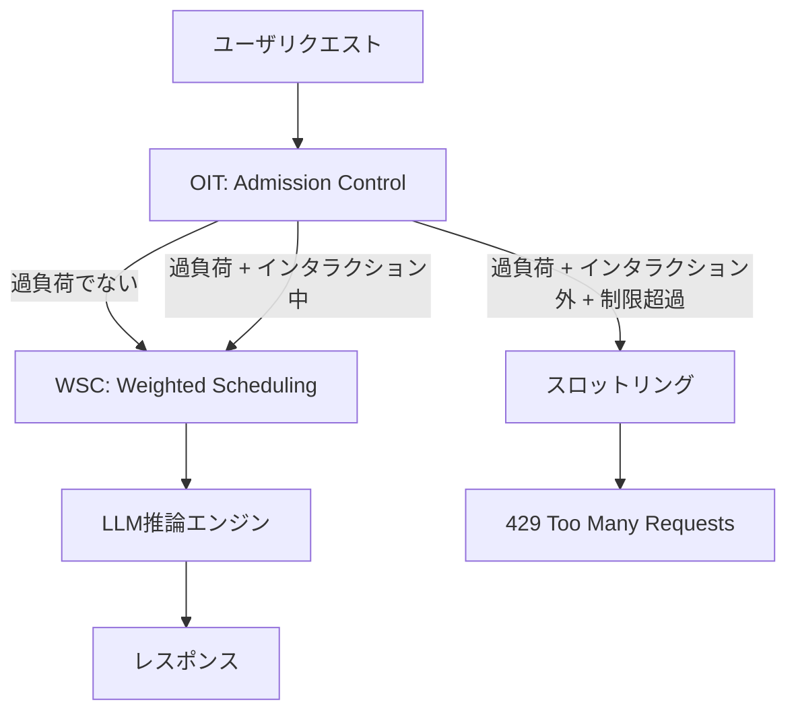

## 論文概要（Abstract）

本論文は、マルチテナントLLMプラットフォームにおける公平性（fairness）保証の課題に取り組んでいる。著者らはMicrosoft Copilotの数百万リクエストを分析し、既存のレートリミッティング手法（RPM: Requests Per Minute）がマルチエージェントアプリケーションやインタラクション途中のスロットリングにより深刻なトークン浪費とユーザ体験劣化を引き起こすことを明らかにした。その解決策としてFairServeシステムを提案し、OIT（Overload & Interaction-driven Throttling）とWSC（Weighted Service Counter）スケジューリングの2つの機構によって、公平性とスループットを両立させる手法を示している。

本記事は [https://arxiv.org/abs/2411.15997](https://arxiv.org/abs/2411.15997) の解説記事です。

この記事は [Zenn記事: Azure OpenAIマルチテナント負荷分散：テナント別クォータ×コスト配賦×優先度制御をAPIMで実装する](https://zenn.dev/0h_n0/articles/066a67fb511816) の深掘りです。

## 情報源

- **arXiv ID**: 2411.15997
- **URL**: [https://arxiv.org/abs/2411.15997](https://arxiv.org/abs/2411.15997)
- **著者**: Redwan Ibne Seraj Khan, Kunal Jain, Haiying Shen, et al.（Microsoft共同研究）
- **発表年**: 2024
- **分野**: cs.DC（Distributed Computing）

## 背景と動機（Background & Motivation）

LLMベースのサービスが急速に普及する中、GPT-4やClaude等のLLMを共有インフラ上で複数テナントに提供するプラットフォームが一般化している。Microsoft Copilotのような大規模プラットフォームでは、34種類のアプリケーションから数千ユーザが同時にリクエストを送信しており、各アプリケーションのトラフィック特性は大きく異なる。

著者らの分析によれば、RPM（Requests Per Minute）は$10^{-1}$から$10^{4}$、TPM（Tokens Per Minute）は$10^{2}$から$10^{6}$まで4桁以上の幅があり、リクエストの26.8%がマルチエージェントグラフサイズ1超であることが報告されている。一部ユーザのシステムプロンプトトークン数は500を超える。このような多様性の下で、従来のRPMベースのスロットリングは以下の問題を抱えている。

1. **インタラクション途中でのスロットリング**: マルチエージェントアプリケーションでは1回のユーザインタラクションが複数のLLM呼び出しを生成する。RPMスロットリングがインタラクション途中で発動すると、それまでに消費したトークンが全て無駄になる
2. **一律のレート制限**: アプリケーション特性を無視した一律制限は、軽量アプリケーションのユーザを不当に制限し、重量アプリケーションのユーザに過剰なリソースを許容する
3. **公平性の欠如**: 同一リクエスト数でもトークン消費量が大きく異なるため、RPMベースの公平性定義自体が不適切である

## 主要な貢献（Key Contributions）

- **貢献1: 大規模実トラフィック分析**: MS Copilotの数百万リクエストを分析し、マルチテナントLLMプラットフォームにおけるトラフィック特性の多様性と既存手法の不適切さを定量的に示した
- **貢献2: OIT（Overload & Interaction-driven Throttling）**: システム過負荷時のみ、かつインタラクション外でのみスロットリングを行う2レベルのスロットリング機構を提案した
- **貢献3: WSC（Weighted Service Counter）スケジューリング**: 入力・システムプロンプト・出力トークンに異なる重みを付与し、アプリケーション特性を考慮した重み付きサービスカウンタによる公平スケジューリングを実現した

## 技術的詳細（Technical Details）

### FairServeシステムアーキテクチャ

FairServeは、Admission Control層（OIT）とScheduling層（WSC）の2段構成で設計されている。



### OIT: Overload & Interaction-driven Throttling

OITは2つの条件を組み合わせたスロットリング機構である。

**条件1: 過負荷検知**

システム全体のキュー長がしきい値を超えた場合のみスロットリングを発動する。これにより、システムに余裕がある場合はバースト的なリクエストも許容される。

**条件2: インタラクション境界の検出**

マルチエージェントアプリケーションでは、1回のユーザインタラクションが複数のLLMコールを生成する。OITは新しいインタラクションの開始時のみスロットリングを適用し、進行中のインタラクションは完了まで許可する。

**2レベルのレート制限**

OITは以下の2種類のしきい値を使用する。

- $T_g^r$: グローバル（ユーザレベル）のリクエスト制限
- $T_a^r$: アプリケーション別のリクエスト制限

ユーザ$i$のアプリケーション$a$に対するスロットリング判定は以下の通りである。

$$
\text{throttle}(i, a) = \begin{cases}
\text{true} & \text{if } \text{overloaded} \land \neg\text{in\_interaction}(i, a) \land (r_i > T_g^r \lor r_i^a > T_a^r) \\
\text{false} & \text{otherwise}
\end{cases}
$$

ここで、
- $r_i$: ユーザ$i$の現在のリクエストレート
- $r_i^a$: ユーザ$i$のアプリケーション$a$に対するリクエストレート
- $\text{in\_interaction}(i, a)$: ユーザ$i$がアプリケーション$a$で進行中のインタラクションを持つかどうか

この設計により、RPMスロットリングで発生する「インタラクション途中での切断」によるトークン浪費を完全に排除できる。著者らの実験では、RPMが平均15,660トークンを浪費するのに対し、FairServeのトークン浪費は0%であると報告されている。

### WSC: Weighted Service Counter スケジューリング

WSCは、各ユーザの累積サービス量を重み付きで追跡し、最もサービスを受けていないユーザのリクエストを優先する公平スケジューリングアルゴリズムである。

**サービスカウンタの定義**

ユーザ$i$のサービスカウンタ$S_i^a$は以下の式で計算される。

$$
S_i^a = E_i \cdot \frac{\sum_{j=1}^{m_i} \left( \alpha \cdot L_I^{(a_{ij})} + \beta \cdot L_S^{(a_{ij})} + \gamma \cdot L_O^{(a_{ij})} \right)}{w_{a_j}}
$$

ここで、
- $E_i$: ユーザ$i$のエンタイトルメント（サービス利用権限の重み。無料ユーザと有料ユーザで異なる）
- $m_i$: ユーザ$i$が発行したリクエスト数
- $L_I^{(a_{ij})}$: $j$番目のリクエストの入力トークン数
- $L_S^{(a_{ij})}$: $j$番目のリクエストのシステムプロンプトトークン数
- $L_O^{(a_{ij})}$: $j$番目のリクエストの出力トークン数
- $w_{a_j}$: アプリケーション$a_j$の重み（トークン消費特性に基づく）
- $\alpha, \beta, \gamma$: トークン種別の重み係数（論文では$\alpha=1, \beta=2, \gamma=1$）

**システムプロンプトの重みが高い理由**

$\beta=2$としている理由は、システムプロンプトはアプリケーション開発者が設定するものであり、エンドユーザの制御外にあるためである。システムプロンプトが長いアプリケーションのユーザが不当に不利にならないよう、システムプロンプトトークンの重みを高く設定してアプリケーション重み$w_{a_j}$による正規化をより効果的にしている。

**スケジューリングアルゴリズム**

WSCは累積サービスカウンタ$u_i$を維持し、$u_i$が最小のユーザからリクエストを選択する。

```python
from dataclasses import dataclass, field
from heapq import heappush, heappop
from typing import Optional


@dataclass(order=True)
class UserEntry:
    """WSCスケジューラのユーザエントリ"""
    service_counter: float
    user_id: str = field(compare=False)


class WSCScheduler:
    """Weighted Service Counter Scheduler

    累積サービスカウンタが最小のユーザから優先的にリクエストを処理する。

    Args:
        alpha: 入力トークンの重み係数
        beta: システムプロンプトトークンの重み係数
        gamma: 出力トークンの重み係数
    """

    def __init__(
        self,
        alpha: float = 1.0,
        beta: float = 2.0,
        gamma: float = 1.0,
    ) -> None:
        self.alpha = alpha
        self.beta = beta
        self.gamma = gamma
        self.service_counters: dict[str, float] = {}
        self.priority_queue: list[UserEntry] = []

    def compute_request_cost(
        self,
        input_tokens: int,
        system_tokens: int,
        output_tokens: int,
        app_weight: float,
        entitlement: float = 1.0,
    ) -> float:
        """リクエストの重み付きコストを計算する

        Args:
            input_tokens: 入力トークン数
            system_tokens: システムプロンプトトークン数
            output_tokens: 出力トークン数
            app_weight: アプリケーション重み
            entitlement: ユーザのエンタイトルメント係数

        Returns:
            重み付きサービスコスト
        """
        weighted_tokens = (
            self.alpha * input_tokens
            + self.beta * system_tokens
            + self.gamma * output_tokens
        )
        return entitlement * weighted_tokens / app_weight

    def update_counter(self, user_id: str, cost: float) -> None:
        """ユーザのサービスカウンタを更新する"""
        current = self.service_counters.get(user_id, 0.0)
        self.service_counters[user_id] = current + cost
        heappush(
            self.priority_queue,
            UserEntry(self.service_counters[user_id], user_id),
        )

    def select_next_user(self) -> Optional[str]:
        """最もサービスを受けていないユーザを選択する"""
        while self.priority_queue:
            entry = heappop(self.priority_queue)
            if self.service_counters.get(entry.user_id) == entry.service_counter:
                return entry.user_id
        return None
```

### Noisy Neighbor問題への対応

FairServeは以下の3層でNoisy Neighbor問題に対処している。

1. **インタラクションレベルスロットリング**: 過負荷時に新しいインタラクションのみをブロックし、進行中のインタラクションは完了を保証する
2. **ユーザ＋アプリケーション二重制限**: グローバルなユーザ制限とアプリケーション単位の制限を組み合わせ、特定アプリケーションでの過剰利用を防ぐ
3. **重み付きサービス公平性**: 累積サービス量に基づくスケジューリングにより、過剰利用ユーザのリクエスト優先度が自動的に低下する

## 実装のポイント（Implementation）

FairServeを実装する際の主要な技術的課題は以下の通りである。

**インタラクション境界の検出**: マルチエージェントアプリケーションでは、1回のユーザ操作が複数の連鎖的なLLMコールを生成する。インタラクションの開始と終了を正確に検出するには、アプリケーションからのメタデータ（セッションID、インタラクションID等）が必要である。リクエストヘッダにインタラクション識別子を含める設計が求められる。

**アプリケーション重みの決定**: $w_{a_j}$の値はアプリケーションのトークン消費パターンに基づいて設定する。著者らは過去のトラフィックデータから各アプリケーションの平均トークン消費量を算出し、正規化して重みとしている。この重みは定期的に再計算する必要がある。

**サービスカウンタのリセット**: 累積カウンタは時間とともに無限に増加するため、一定期間（例: 1時間）ごとにリセットするか、スライディングウィンドウ方式で管理する設計が必要である。

**エンタイトルメントの設計**: $E_i$はユーザの契約レベル（無料/有料/エンタープライズ）に応じて設定する。有料ユーザの$E_i$を低く設定することで、同じリクエスト量でもサービスカウンタの増加が小さくなり、優先的にスケジューリングされる。

## Production Deployment Guide

### AWS実装パターン（コスト最適化重視）

FairServeのようなマルチテナントLLMサービング公平性制御をAWSで実装する場合、トラフィック量に応じた3つの構成を提案する。以下のコスト試算は2026年9月時点のAWS ap-northeast-1（東京）リージョン料金に基づく概算値であり、実際のコストはトラフィックパターン、リージョン、バースト使用量により変動する。最新料金はAWS料金計算ツールで確認を推奨する。

| 構成 | トラフィック | 主要サービス | 月額概算 |
|------|-------------|-------------|---------|
| Small | ~100 req/日 | Lambda + Bedrock + DynamoDB | $50-150 |
| Medium | ~1,000 req/日 | ECS Fargate + ElastiCache + Bedrock | $300-800 |
| Large | 10,000+ req/日 | EKS + Karpenter + Spot + Bedrock | $2,000-5,000 |

**Small構成**: API Gateway + Lambda でOITスロットリング判定を実行し、DynamoDBにサービスカウンタとインタラクション状態を保持する。Bedrock呼び出しにはLambdaからの直接呼び出しを使用する。月額内訳はLambda $5、DynamoDB $10、Bedrock $35-135（トークン量依存）。

**Medium構成**: ECS Fargate上にFairServeプロキシを配置し、ElastiCacheでサービスカウンタをインメモリ管理する。ALB経由でリクエストを受け付け、Fargateタスク内でOIT判定とWSCスケジューリングを実行する。月額内訳はFargate $80、ElastiCache $50、ALB $30、Bedrock $140-640。

**Large構成**: EKS上にFairServeコントロールプレーンをデプロイし、Karpenter + Spot Instancesで推論ワーカーを自動スケーリングする。Redisクラスタでサービスカウンタを分散管理し、PrometheusとGrafanaで公平性メトリクスを可視化する。月額内訳はEKS $75、EC2 Spot $400-1,200、Redis $150、Bedrock $1,375-3,575。

**コスト削減テクニック**: Spot Instances活用で推論ワーカーのコストを最大90%削減、Reserved Instances購入でコントロールプレーンノードを最大72%削減、Bedrock Batch API使用で非リアルタイム処理を50%削減、Prompt Caching有効化でシステムプロンプト分のコストを30-90%削減できる。

### Terraformインフラコード

**Small構成（Serverless）**

```hcl
# FairServe Small構成: Lambda + DynamoDB + Bedrock
# terraform apply で即デプロイ可能

terraform {
  required_version = ">= 1.9"
  required_providers {
    aws = { source = "hashicorp/aws", version = "~> 5.60" }
  }
}

provider "aws" { region = "ap-northeast-1" }

# --- DynamoDB: サービスカウンタ + インタラクション状態 ---
resource "aws_dynamodb_table" "service_counters" {
  name         = "fairserve-service-counters"
  billing_mode = "PAY_PER_REQUEST"  # On-Demand: 低トラフィック時コスト最適
  hash_key     = "user_id"
  range_key    = "app_id"

  attribute {
    name = "user_id"
    type = "S"
  }
  attribute {
    name = "app_id"
    type = "S"
  }

  ttl {
    attribute_name = "ttl"
    enabled        = true  # カウンタ自動リセット
  }

  server_side_encryption { enabled = true }  # KMS暗号化
}

# --- IAMロール: 最小権限 ---
resource "aws_iam_role" "fairserve_lambda" {
  name = "fairserve-lambda-role"
  assume_role_policy = jsonencode({
    Version = "2012-10-17"
    Statement = [{
      Action = "sts:AssumeRole"
      Effect = "Allow"
      Principal = { Service = "lambda.amazonaws.com" }
    }]
  })
}

resource "aws_iam_role_policy" "fairserve_lambda" {
  name = "fairserve-lambda-policy"
  role = aws_iam_role.fairserve_lambda.id
  policy = jsonencode({
    Version = "2012-10-17"
    Statement = [
      {
        Effect   = "Allow"
        Action   = ["dynamodb:GetItem", "dynamodb:PutItem", "dynamodb:UpdateItem"]
        Resource = aws_dynamodb_table.service_counters.arn
      },
      {
        Effect   = "Allow"
        Action   = ["bedrock:InvokeModel"]
        Resource = "arn:aws:bedrock:ap-northeast-1::foundation-model/*"
      },
      {
        Effect   = "Allow"
        Action   = ["logs:CreateLogGroup", "logs:CreateLogStream", "logs:PutLogEvents"]
        Resource = "arn:aws:logs:*:*:*"
      }
    ]
  })
}

# --- Lambda: OIT + WSCスケジューラ ---
resource "aws_lambda_function" "fairserve" {
  function_name = "fairserve-scheduler"
  runtime       = "python3.12"
  handler       = "handler.lambda_handler"
  role          = aws_iam_role.fairserve_lambda.arn
  memory_size   = 256
  timeout       = 30

  filename = "lambda.zip"

  environment {
    variables = {
      DYNAMODB_TABLE   = aws_dynamodb_table.service_counters.name
      ALPHA_WEIGHT     = "1.0"
      BETA_WEIGHT      = "2.0"
      GAMMA_WEIGHT     = "1.0"
      OVERLOAD_THRESHOLD = "100"
    }
  }

  tracing_config { mode = "Active" }  # X-Ray有効化
}

# --- CloudWatchアラーム: コスト監視 ---
resource "aws_cloudwatch_metric_alarm" "lambda_duration" {
  alarm_name          = "fairserve-lambda-duration-high"
  comparison_operator = "GreaterThanThreshold"
  evaluation_periods  = 3
  metric_name         = "Duration"
  namespace           = "AWS/Lambda"
  period              = 300
  statistic           = "p99"
  threshold           = 25000  # 25秒
  alarm_actions       = []     # SNSトピックARNを設定

  dimensions = {
    FunctionName = aws_lambda_function.fairserve.function_name
  }
}
```

**Large構成（Container）**

```hcl
# FairServe Large構成: EKS + Karpenter + Spot
module "eks" {
  source          = "terraform-aws-modules/eks/aws"
  version         = "~> 20.24"
  cluster_name    = "fairserve-cluster"
  cluster_version = "1.31"

  vpc_id     = module.vpc.vpc_id
  subnet_ids = module.vpc.private_subnets

  cluster_endpoint_public_access = false  # プライベートアクセスのみ

  eks_managed_node_groups = {
    system = {
      instance_types = ["m7i.large"]
      min_size       = 2
      max_size       = 3
      desired_size   = 2
      capacity_type  = "ON_DEMAND"  # コントロールプレーンは安定性重視
    }
  }
}

# --- Karpenter: Spot優先の推論ワーカー自動スケーリング ---
resource "kubectl_manifest" "karpenter_nodepool" {
  yaml_body = yamlencode({
    apiVersion = "karpenter.sh/v1"
    kind       = "NodePool"
    metadata   = { name = "fairserve-inference" }
    spec = {
      template = {
        spec = {
          requirements = [
            { key = "karpenter.sh/capacity-type", operator = "In", values = ["spot", "on-demand"] },
            { key = "node.kubernetes.io/instance-type", operator = "In",
              values = ["m7i.xlarge", "m7i.2xlarge", "c7i.xlarge", "c7i.2xlarge"] },
          ]
          nodeClassRef = { name = "default" }
        }
      }
      limits   = { cpu = "64", memory = "256Gi" }
      disruption = {
        consolidationPolicy = "WhenEmptyOrUnderutilized"
        consolidateAfter    = "30s"
      }
    }
  })
}

# --- Secrets Manager: Bedrock設定 ---
resource "aws_secretsmanager_secret" "bedrock_config" {
  name       = "fairserve/bedrock-config"
  kms_key_id = aws_kms_key.fairserve.arn
}

# --- AWS Budgets: 月次予算アラート ---
resource "aws_budgets_budget" "fairserve" {
  name         = "fairserve-monthly"
  budget_type  = "COST"
  limit_amount = "5000"
  limit_unit   = "USD"
  time_unit    = "MONTHLY"

  notification {
    comparison_operator       = "GREATER_THAN"
    threshold                 = 80
    threshold_type            = "PERCENTAGE"
    notification_type         = "ACTUAL"
    subscriber_email_addresses = ["ops-team@example.com"]
  }
}
```

### 運用・監視設定

**CloudWatch Logs Insights: 公平性メトリクス分析**

```
# 1時間あたりのユーザ別サービスカウンタ分布
fields @timestamp, user_id, service_counter, app_id
| stats avg(service_counter) as avg_sc,
        max(service_counter) as max_sc,
        min(service_counter) as min_sc,
        count(*) as req_count
  by bin(1h), user_id
| sort max_sc desc
| limit 20
```

```
# スロットリング発生率のリアルタイム監視
fields @timestamp, user_id, throttled, interaction_active
| stats sum(throttled) as throttle_count,
        count(*) as total_requests,
        (sum(throttled) * 100.0 / count(*)) as throttle_rate
  by bin(5m)
| sort @timestamp desc
```

**CloudWatch アラーム: トークン浪費検知（Python）**

```python
import boto3

cloudwatch = boto3.client("cloudwatch", region_name="ap-northeast-1")

cloudwatch.put_metric_alarm(
    AlarmName="fairserve-token-wastage-high",
    ComparisonOperator="GreaterThanThreshold",
    EvaluationPeriods=2,
    MetricName="TokenWastage",
    Namespace="FairServe/Custom",
    Period=300,
    Statistic="Sum",
    Threshold=1000,  # 5分間で1000トークン以上の浪費は異常
    AlarmActions=["arn:aws:sns:ap-northeast-1:123456789:fairserve-alerts"],
)
```

**X-Ray トレーシング: リクエストフロー計装（Python）**

```python
from aws_xray_sdk.core import xray_recorder, patch_all

patch_all()  # boto3自動計装


@xray_recorder.capture("fairserve_oit_check")
def check_oit(user_id: str, app_id: str) -> bool:
    """OITスロットリング判定をトレーシング付きで実行する"""
    subsegment = xray_recorder.current_subsegment()
    subsegment.put_annotation("user_id", user_id)
    subsegment.put_annotation("app_id", app_id)

    is_overloaded = check_system_overload()
    in_interaction = check_interaction_active(user_id, app_id)

    subsegment.put_metadata("overloaded", is_overloaded)
    subsegment.put_metadata("in_interaction", in_interaction)

    return is_overloaded and not in_interaction
```

**Cost Explorer: 日次コストレポート（Python）**

```python
import boto3
from datetime import date, timedelta

ce = boto3.client("ce", region_name="us-east-1")
sns = boto3.client("sns", region_name="ap-northeast-1")

today = date.today()
yesterday = today - timedelta(days=1)

response = ce.get_cost_and_usage(
    TimePeriod={"Start": str(yesterday), "End": str(today)},
    Granularity="DAILY",
    Metrics=["BlendedCost"],
    GroupBy=[{"Type": "DIMENSION", "Key": "SERVICE"}],
)

total_cost = 0.0
for group in response["ResultsByTime"][0]["Groups"]:
    service = group["Keys"][0]
    cost = float(group["Metrics"]["BlendedCost"]["Amount"])
    total_cost += cost

if total_cost > 100:
    sns.publish(
        TopicArn="arn:aws:sns:ap-northeast-1:123456789:cost-alert",
        Subject="FairServe日次コスト超過",
        Message=f"昨日のコスト: ${total_cost:.2f} (閾値: $100/日)",
    )
```

### コスト最適化チェックリスト

**アーキテクチャ選択**
- [ ] トラフィック量に応じた構成を選定（100 req/日以下はServerless、10,000+はContainer）
- [ ] レイテンシ要件を確認（リアルタイム応答が不要ならBatch API活用）

**リソース最適化**
- [ ] 推論ワーカーはSpot Instances優先（最大90%削減）
- [ ] コントロールプレーンはReserved Instances（1年コミットで最大72%削減）
- [ ] Savings Plans検討（Compute Savings Plansで柔軟性確保）
- [ ] Lambdaメモリサイズ最適化（AWS Lambda Power Tuningで検証）
- [ ] ECS/EKSアイドル時スケールダウン（Karpenter consolidation設定）

**LLMコスト削減**
- [ ] Bedrock Batch API使用（非リアルタイム処理で50%削減）
- [ ] Prompt Caching有効化（システムプロンプト分30-90%削減）
- [ ] モデル選択ロジック実装（軽量クエリはHaiku、重いクエリはSonnet）
- [ ] トークン数制限（max_tokensパラメータ設定）
- [ ] FairServe WSCによるトークン浪費ゼロ化

**監視・アラート**
- [ ] AWS Budgets設定（月次予算の80%でアラート）
- [ ] CloudWatchアラーム（トークン浪費、レイテンシP99、スロットリング率）
- [ ] Cost Anomaly Detection有効化（ML検知）
- [ ] 日次コストレポート自動配信（SNS + Cost Explorer）
- [ ] 公平性メトリクスダッシュボード（サービスカウンタ分散、Gini係数）

**リソース管理**
- [ ] 未使用リソース削除（Trusted Advisor活用）
- [ ] タグ戦略（tenant/app/environment タグ必須）
- [ ] ログライフサイクルポリシー（30日後S3 Glacier移行）
- [ ] 開発環境夜間停止（EventBridge Scheduler）
- [ ] DynamoDB TTL設定（サービスカウンタ自動クリーンアップ）

## 実験結果（Results）

著者らはMS Copilotの実トラフィックデータを用いてFairServeの性能を評価している。比較対象はRPM（Requests Per Minute）スロットリングとVTC（Virtual Token Counter）である。

| 評価指標 | FairServe | RPM | VTC |
|---------|-----------|-----|-----|
| インタラクション切断倍率 | 1x (基準) | 21.15x | - |
| トークン浪費 | 0% | 15,660トークン（平均） | - |
| キューイング遅延ユーザ率 | 0.93% | - | - |
| 遅延削減（vs VTC） | 10.67x | - | 1x (基準) |
| 遅延削減（vs RPM） | 93x | 1x (基準) | - |
| スループット向上 | 1.03-1.75x | 1x (基準) | - |
| サービス提供率 | 99.45-100% | - | - |

著者らの報告によると、RPMスロットリングはFairServeの21.15倍のインタラクションを途中で切断しており、1回の切断あたり平均15,660トークンが浪費されている。FairServeではインタラクション境界でのみスロットリングを行うため、トークン浪費は0%である。

遅延に関しては、FairServeはVTCと比較して10.67倍、RPMと比較して93倍の遅延削減を達成している。キューイング遅延を経験するユーザはわずか0.93%であり、99.45-100%のユーザがサービスを受けられている。

スループットについては、FairServeはRPMと比較して1.03-1.75倍の向上を達成している。これはインタラクション途中のスロットリングを排除することで、無駄なトークン消費が減少し、システム全体の処理効率が向上したためであると著者らは説明している。

## 実運用への応用（Practical Applications）

本論文の手法は、Zenn記事「[Azure OpenAIマルチテナント負荷分散：テナント別クォータ×コスト配賦×優先度制御をAPIMで実装する](https://zenn.dev/0h_n0/articles/066a67fb511816)」で解説されているAPIM（Azure API Management）ベースのマルチテナント設計と密接に関連する。

Zenn記事ではAPIMポリシーによるテナント別クォータ制御と優先度ベースのルーティングを扱っているが、FairServeの知見を組み合わせることで以下の改善が考えられる。

**OITの適用**: APIMのrate-limitポリシーにインタラクション境界検出を追加する。APIMのカスタムヘッダ（例: `X-Interaction-ID`）でインタラクション状態を追跡し、過負荷時のみかつインタラクション外でのみスロットリングを発動する設計に変更する。これにより、マルチステップのチャットフローが途中で切断されるリスクを排除できる。

**WSCの適用**: APIMのコスト配賦ロジックに重み付きサービスカウンタを導入する。入力・システムプロンプト・出力トークンに異なる重みを付与することで、テナント間の公平性をトークン消費量ベースでより正確に測定できる。特にシステムプロンプトが長いアプリケーション（RAGパイプライン等）を利用するテナントが不当に制限されない設計となる。

**制約と限界**: FairServeはMicrosoft内部のCopilotプラットフォームで検証されており、オープンソースの実装は公開されていない。また、アプリケーション重み$w_{a_j}$の最適値はトラフィック特性に依存するため、各環境で個別にチューニングが必要である。

## 関連研究（Related Work）

- **VTC（Virtual Token Counter）**: Ying et al. (2024) が提案したトークンベースの公平スケジューリング手法。リクエスト単位ではなくトークン単位でカウントすることでRPMの問題を緩和するが、インタラクション境界の考慮やアプリケーション特性の重み付けは行わない。FairServeの実験ではVTCと比較して10.67倍の遅延削減を達成している
- **Orca**: Microsoft Research が提案したLLMサービングの推論スケジューラ。iteration-level schedulingにより連続バッチ処理を効率化するが、マルチテナントの公平性制御は扱っていない。FairServeはOrcaのスケジューリング層の上位にAdmission Control層を追加する位置付けである
- **RPM Throttling**: Azure OpenAI Service等で広く使われる標準的なレートリミッティング手法。リクエスト数ベースの制限は実装が単純だが、トークン消費量の多様性やインタラクション構造を無視するため、マルチエージェントアプリケーション環境では深刻なトークン浪費を招く

## まとめと今後の展望

FairServeは、マルチテナントLLMプラットフォームにおける公平性保証の実践的なアプローチを提示した論文である。MS Copilotの数百万リクエスト分析に基づく課題の特定と、OIT + WSCによる解決策の提案は、アカデミアと産業界の両方にとって有意義な貢献である。

実務への示唆として、RPMベースのレートリミッティングからインタラクション境界を考慮したスロットリングへの移行、およびトークン種別に応じた重み付き公平性の導入が挙げられる。今後の研究方向としては、アプリケーション重みの動的最適化、異種モデル（GPT-4/GPT-3.5混在）環境での公平性定義の拡張、およびフェデレーション環境での分散FairServe実装が考えられる。

## 参考文献

- **arXiv**: [https://arxiv.org/abs/2411.15997](https://arxiv.org/abs/2411.15997)
- **Related Zenn article**: [https://zenn.dev/0h_n0/articles/066a67fb511816](https://zenn.dev/0h_n0/articles/066a67fb511816)
- Ying, S., et al. "Efficient and Fair LLM Serving with Virtual Token Counter." arXiv preprint (2024).
- Yu, G., et al. "Orca: A Distributed Serving System for Transformer-Based Generative Models." OSDI 2022.
