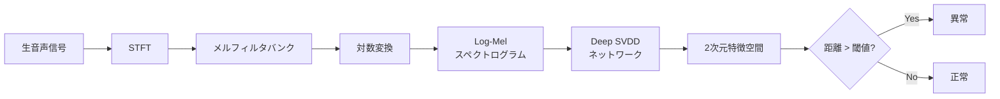

本記事は [https://arxiv.org/abs/2412.10792](https://arxiv.org/abs/2412.10792) の解説記事です。

## 論文概要（Abstract）

本論文は、マイクロフォンを低コストな代替センサーとして活用し、Log-MelスペクトログラムとDeep Support Vector Data Description（Deep SVDD）を組み合わせた産業機械の音声異常検知手法を提案している。MIMII Sound Datasetでの評価において、ベースラインのDense Autoencoderの7.4分の1のパラメータ数で、全SN比条件でAUCスコアの改善を達成している。

この記事は [Zenn記事: Gemini 3.7 Flashで設備点検動画・音声から異常検知レポートを自動生成する](https://zenn.dev/0h_n0/articles/1ca988c9024a38) の深掘りです。

## 情報源

- **arXiv ID**: 2412.10792
- **URL**: [https://arxiv.org/abs/2412.10792](https://arxiv.org/abs/2412.10792)
- **著者**: Sertac Kilickaya, Mete Ahishali, Cansu Celebioglu et al.
- **発表年**: 2024年12月（2025 IEEE Symposium Series on Computational Intelligence）
- **分野**: cs.SD, cs.LG, eess.AS

## 背景と動機（Background & Motivation）

産業機械の予知保全において、従来の振動・温度センサーは設置コストが高く機械依存性が強い。著者らは、マイクロフォンが低コスト・非接触で設置可能な代替センサーである点に着目している。しかし産業環境では背景雑音が大きく、低SN比での検知精度が課題であった。

本論文では、Log-Melスペクトログラムによる音声特徴表現とDeep SVDDによるワンクラス分類を組み合わせ、低SN比環境でもロバストに動作する手法を提案している。

## 主要な貢献（Key Contributions）

- **貢献1**: Log-Mel + Deep SVDDの産業機械音異常検知への適用。2次元部分空間表現でベースラインの7.4分の1のパラメータ数を実現
- **貢献2**: 複数SN比条件（6dB、0dB、-6dB）での体系的評価。全条件でベースラインを上回る性能
- **貢献3**: 4種のマシンタイプ（バルブ、ポンプ、ファン、スライダー）と故障条件の網羅的分析

## 技術的詳細（Technical Details）

### Log-Melスペクトログラム

音声信号からの特徴量抽出にLog-Melスペクトログラム変換を用いる。信号にSTFTを適用し、パワースペクトルをメルフィルタバンクに通した後、対数をとる。メルスケールは人間の聴覚特性を模倣した周波数スケールである。

$$
\text{Mel}(f) = 2595 \cdot \log_{10}\left(1 + \frac{f}{700}\right)
$$

$f$ はHz単位の周波数。Log-Melスペクトログラムは以下の式で得られる。

$$
S_{\text{log-mel}}(m, b) = \log\left(\sum_{k} H_b(k) \cdot |X(m, k)|^2 + \epsilon\right)
$$

ここで、
- $X(m,k)$: フレーム $m$、周波数ビン $k$ でのSTFT係数
- $H_b(k)$: $b$番目のメルフィルタバンクの周波数応答
- $\epsilon$: 対数のゼロ除算を防ぐ微小値（例: $10^{-10}$）

この変換で時間-周波数情報が2次元画像として表現され、深層学習を適用可能となる。

### Deep Support Vector Data Description（Deep SVDD）

Deep SVDDはRuff et al.（2018, ICML）が提案したワンクラス分類手法であり、正常データの特徴を超球中心付近に写像するネットワークを訓練する。目的関数は以下のとおりである。

$$
\min_{\mathcal{W}} \frac{1}{N} \sum_{i=1}^{N} \left\| \phi(\mathbf{x}_i; \mathcal{W}) - \mathbf{c} \right\|^2 + \frac{\lambda}{2} \sum_{l=1}^{L} \left\| \mathbf{W}^l \right\|_F^2
$$

ここで、
- $\mathbf{x}_i$: $i$番目の入力サンプル（Log-Melスペクトログラム）
- $\mathbf{c}$: 超球の中心ベクトル（事前に正常データの初期順伝播の平均として設定）
- $\phi(\mathbf{x}_i; \mathcal{W})$: ネットワークによる特徴写像の出力
- $\lambda$: 正則化係数
- $\mathbf{W}^l$: $l$番目の層の重み行列
- $\left\| \cdot \right\|_F$: フロベニウスノルム
- $N$: 学習サンプル数
- $L$: ネットワークの層数

第1項がデータ項（特徴を中心に近づける）、第2項が重み減衰正則化項である。推論時の異常スコアは中心との距離で計算される。

$$
s(\mathbf{x}) = \left\| \phi(\mathbf{x}; \mathcal{W}) - \mathbf{c} \right\|^2
$$

異常スコアが閾値を超えれば異常と判定される。本論文では出力を2次元部分空間に設定しており、著者らはこの低次元表現がパラメータ削減と正常/異常の分離能力を両立すると報告している。



### ベースライン: Dense Autoencoder

比較対象のDense Autoencoderは、正常データで学習し再構成誤差 $s_{\text{AE}}(\mathbf{x}) = \left\| \mathbf{x} - D(E(\mathbf{x})) \right\|^2$ が大きい入力を異常と判定する。$E(\cdot)$はエンコーダ、$D(\cdot)$はデコーダである。

### アルゴリズム

Deep SVDDの学習と推論のアルゴリズムをPythonの擬似コードで示す。

```python
import torch
import torch.nn as nn


class DeepSVDDNetwork(nn.Module):
    """Deep SVDD用ニューラルネットワーク

    Log-Melスペクトログラムを2次元特徴空間に写像する。
    全層でbias=False（hypersphere collapse防止のための設計制約）。

    Args:
        input_dim: 入力次元数（フラット化スペクトログラム）
        hidden_dim: 隠れ層次元数
        output_dim: 出力次元数（本論文では2）
    """

    def __init__(self, input_dim: int, hidden_dim: int = 128, output_dim: int = 2):
        super().__init__()
        self.network = nn.Sequential(
            nn.Linear(input_dim, hidden_dim, bias=False),
            nn.ReLU(),
            nn.Linear(hidden_dim, hidden_dim // 2, bias=False),
            nn.ReLU(),
            nn.Linear(hidden_dim // 2, output_dim, bias=False),
        )

    def forward(self, x: torch.Tensor) -> torch.Tensor:
        """順伝播: (batch_size, input_dim) -> (batch_size, output_dim)"""
        return self.network(x)


def initialize_center(
    net: DeepSVDDNetwork, loader: torch.utils.data.DataLoader, device: torch.device
) -> torch.Tensor:
    """正常データの順伝播出力平均で超球中心cを初期化する

    Args:
        net: Deep SVDDネットワーク
        loader: 正常データのDataLoader
        device: 計算デバイス

    Returns:
        中心ベクトル (output_dim,)
    """
    net.eval()
    outputs: list[torch.Tensor] = []
    with torch.no_grad():
        for (x_batch,) in loader:
            outputs.append(net(x_batch.to(device)))
    return torch.cat(outputs, dim=0).mean(dim=0)


def compute_anomaly_score(
    net: DeepSVDDNetwork, x: torch.Tensor, center: torch.Tensor
) -> torch.Tensor:
    """異常スコア = ||phi(x) - c||^2 を計算する

    Args:
        net: 学習済みネットワーク
        x: 入力 (batch_size, input_dim)
        center: 超球中心 (output_dim,)

    Returns:
        異常スコア (batch_size,)
    """
    return torch.sum((net(x) - center) ** 2, dim=1)
```

重要な設計制約として、全層でバイアス項を除去する。バイアスがあると全入力が定数ベクトルに写像される自明解（hypersphere collapse）に陥る。

## 実装のポイント（Implementation）

Deep SVDDを産業機械音異常検知に適用する際の注意点を整理する。

**Log-Melパラメータ**: マシンタイプごとに周波数帯域が異なるため、フィルタバンク数・FFTサイズの調整が性能に影響する。

**中心の初期化**: $\mathbf{c}$ は正常データの順伝播出力平均で初期化し固定する。不適切な初期化は学習を不安定にする。

**バイアス除去**: 全層でbias=False。バイアスがあるとhypersphere collapseが発生する。

**出力次元**: 2次元でパラメータ削減できるが、複雑な故障パターンでは増加が必要な可能性がある。

**SN比**: -6dBでAUC 0.69まで低下するため、実運用ではノイズ除去前処理の併用が重要。

## Production Deployment Guide

### AWS実装パターン（コスト最適化重視）

工場マイクロフォンからリアルタイムに音声を収集し、Deep SVDDで異常スコアを算出するAWS構成を示す。

| 構成 | トラフィック | 主要サービス | 月額概算 |
|------|-------------|-------------|---------|
| Small | ~100台/日 | IoT Core + Lambda + SageMaker Serverless | $80-200 |
| Medium | ~1000台/日 | IoT Core + ECS Fargate + SageMaker | $500-1,200 |
| Large | 10000台+/日 | IoT Core + EKS + SageMaker Multi-Model | $3,000-8,000 |

**Small構成（~100台/日）**: IoT CoreでMQTT経由の音声データを受信し、IoT RuleでLambdaを起動する。LambdaでLog-Mel変換後、SageMaker Serverless Endpointで推論し、閾値超過時にSNS通知する。月額内訳はIoT Core $10、Lambda $5、SageMaker Serverless $30-100、DynamoDB $5程度である。

**Medium構成（~1000台/日）**: ECS Fargateで音声前処理・推論をコンテナ化し、SageMakerリアルタイムエンドポイント（ml.t3.medium）で低レイテンシ推論を実現する。

**Large構成（10000台+/日）**: EKS + Karpenter（Spot優先）でオートスケーリングし、SageMaker Multi-Model Endpointでマシンタイプ別モデルを統合提供する。

**コスト削減テクニック**: SageMaker Spot Managed Endpointsで最大90%削減、Reserved Instancesで最大72%削減、Lambda ARM64（Graviton2）で20%削減、S3 Intelligent-Tieringでストレージ自動最適化。

**注意**: 上記は2026年9月時点のAWS ap-northeast-1料金に基づく概算値。最新料金はAWS料金計算ツールで確認を推奨する。

### Terraformインフラコード

#### Small構成（Serverless: IoT Core + Lambda + SageMaker）

```hcl
# --- IAMロール（最小権限: SageMaker推論・DynamoDB・SNSのみ） ---
resource "aws_iam_role" "lambda_role" {
  name = "audio-anomaly-lambda-role"
  assume_role_policy = jsonencode({
    Version = "2012-10-17"
    Statement = [{
      Action = "sts:AssumeRole", Effect = "Allow"
      Principal = { Service = "lambda.amazonaws.com" }
    }]
  })
}

# --- Lambda関数（音声前処理 + 推論リクエスト） ---
resource "aws_lambda_function" "audio_processor" {
  function_name = "audio-anomaly-processor"
  runtime       = "python3.12"
  handler       = "handler.lambda_handler"
  role          = aws_iam_role.lambda_role.arn
  timeout       = 30
  memory_size   = 512  # Log-Mel変換にはメモリが必要
  architectures = ["arm64"]  # Graviton2で20%コスト削減

  environment {
    variables = {
      SAGEMAKER_ENDPOINT = aws_sagemaker_endpoint.deep_svdd.name
      DYNAMODB_TABLE     = aws_dynamodb_table.anomaly_results.name
      SNS_TOPIC_ARN      = aws_sns_topic.anomaly_alert.arn
      ANOMALY_THRESHOLD  = "0.5"
    }
  }
}

# --- DynamoDB（On-Demand + KMS暗号化） ---
resource "aws_dynamodb_table" "anomaly_results" {
  name         = "audio-anomaly-results"
  billing_mode = "PAY_PER_REQUEST"
  hash_key     = "device_id"
  range_key    = "timestamp"

  attribute { name = "device_id"; type = "S" }
  attribute { name = "timestamp"; type = "S" }

  server_side_encryption { enabled = true }
  point_in_time_recovery { enabled = true }
}

# --- IoT Core Rule（MQTTトピックからLambda起動） ---
resource "aws_iot_topic_rule" "audio_ingestion" {
  name        = "audio_anomaly_ingestion"
  enabled     = true
  sql         = "SELECT * FROM 'factory/+/audio'"
  sql_version = "2016-03-23"
  lambda { function_arn = aws_lambda_function.audio_processor.arn }
}

# --- CloudWatchアラーム ---
resource "aws_cloudwatch_metric_alarm" "lambda_errors" {
  alarm_name          = "audio-anomaly-lambda-errors"
  comparison_operator = "GreaterThanThreshold"
  evaluation_periods  = 2
  metric_name         = "Errors"
  namespace           = "AWS/Lambda"
  period              = 300
  statistic           = "Sum"
  threshold           = 5
  alarm_actions       = [aws_sns_topic.anomaly_alert.arn]
  dimensions = { FunctionName = aws_lambda_function.audio_processor.function_name }
}
```

#### Large構成（Container: EKS + Karpenter + Spot）

```hcl
module "eks" {
  source  = "terraform-aws-modules/eks/aws"
  version = "~> 20.0"
  cluster_name    = "audio-anomaly-eks"
  cluster_version = "1.31"
  vpc_id          = aws_vpc.audio_anomaly.id
  subnet_ids      = aws_subnet.private[*].id
  cluster_endpoint_public_access = false  # プライベートのみ
  eks_managed_node_groups = {
    system = {
      instance_types = ["m7g.medium"]  # Graviton3
      min_size = 1; max_size = 2; desired_size = 1
    }
  }
}

# Karpenter NodePool（Spot優先 + Graviton）
resource "kubectl_manifest" "karpenter_nodepool" {
  yaml_body = yamlencode({
    apiVersion = "karpenter.sh/v1"
    kind       = "NodePool"
    metadata   = { name = "audio-anomaly-spot" }
    spec = {
      template.spec = {
        requirements = [
          { key = "karpenter.sh/capacity-type", operator = "In"
            values = ["spot", "on-demand"] },
          { key = "node.kubernetes.io/instance-type", operator = "In"
            values = ["m7g.medium", "m7g.large", "m6g.medium"] },
        ]
      }
      limits     = { cpu = "100", memory = "200Gi" }
      disruption = { consolidationPolicy = "WhenEmptyOrUnderutilized" }
    }
  })
}

resource "aws_budgets_budget" "monthly" {
  name = "audio-anomaly-monthly"
  budget_type = "COST"; limit_amount = "5000"; limit_unit = "USD"
  time_unit = "MONTHLY"
  notification {
    comparison_operator = "GREATER_THAN"; threshold = 80
    threshold_type = "PERCENTAGE"; notification_type = "ACTUAL"
    subscriber_email_addresses = ["ops-team@example.com"]
  }
}
```

### 運用・監視設定

**CloudWatch Logs Insightsクエリ（異常検知頻度・レイテンシ）**:

```
-- 異常検知頻度
fields @timestamp, device_id, anomaly_score, machine_type
| filter anomaly_score > 0.5
| stats count() as anomaly_count by machine_type, bin(1h)

-- レイテンシ分析（P95/P99）
fields @timestamp, duration_ms
| stats percentile(duration_ms, 95) as p95, percentile(duration_ms, 99) as p99 by bin(1h)
```

**CloudWatchアラーム・X-Ray・Cost Explorer設定（Python）**:

```python
import boto3
from aws_xray_sdk.core import xray_recorder, patch_all
from datetime import datetime, timedelta


def create_anomaly_rate_alarm(
    cw: boto3.client, sns_arn: str, threshold: int = 50
) -> dict:
    """異常検知率スパイク検知アラームを作成する

    Args:
        cw: CloudWatch Boto3クライアント
        sns_arn: 通知先SNSトピックARN
        threshold: 1時間あたりの異常検知数閾値

    Returns:
        CloudWatch APIレスポンス
    """
    return cw.put_metric_alarm(
        AlarmName="audio-anomaly-rate-spike",
        MetricName="AnomalyDetectionCount",
        Namespace="AudioAnomalyDetection",
        Statistic="Sum", Period=3600, EvaluationPeriods=2,
        Threshold=threshold, ComparisonOperator="GreaterThanThreshold",
        AlarmActions=[sns_arn],
    )


def configure_xray(service: str = "audio-anomaly-detector") -> None:
    """X-Rayトレーシング設定（boto3自動計装）

    Args:
        service: X-Rayサービスマップ表示名
    """
    xray_recorder.configure(service=service)
    patch_all()


def get_daily_cost(ce: boto3.client) -> dict:
    """日次コストレポート取得（$100/日超過でSNS通知を想定）

    Args:
        ce: Cost Explorer Boto3クライアント

    Returns:
        サービス別コスト情報
    """
    end = datetime.utcnow().strftime("%Y-%m-%d")
    start = (datetime.utcnow() - timedelta(days=1)).strftime("%Y-%m-%d")
    return ce.get_cost_and_usage(
        TimePeriod={"Start": start, "End": end},
        Granularity="DAILY", Metrics=["UnblendedCost"],
        GroupBy=[{"Type": "DIMENSION", "Key": "SERVICE"}],
        Filter={"Tags": {"Key": "Project", "Values": ["audio-anomaly-detection"]}},
    )
```

### コスト最適化チェックリスト

**アーキテクチャ選択**:
- [ ] デバイス数100台以下: Serverless構成（Lambda + SageMaker Serverless）
- [ ] デバイス数100-1000台: Hybrid構成（ECS Fargate + SageMaker Real-time）
- [ ] デバイス数1000台以上: Container構成（EKS + SageMaker Multi-Model）

**リソース最適化**:
- [ ] Spot Instances優先（Karpenter設定）、Spot Training（最大90%削減）
- [ ] Reserved Instances 1年コミット（最大72%削減）
- [ ] Lambda ARM64（Graviton2）で20%削減、Power Tuningでメモリ最適化

**推論コスト削減**:
- [ ] Multi-Model Endpoint（マシンタイプ別モデル統合）
- [ ] Serverless Endpoint（低トラフィック時ゼロスケール）
- [ ] ONNX Runtime + 量子化でモデル軽量化

**監視・アラート**:
- [ ] AWS Budgets（80%/100%アラート）、Cost Anomaly Detection
- [ ] CloudWatch アラーム（Lambda実行時間・エラー率）
- [ ] 日次コストレポート（Cost Explorer API + SNS通知）

**リソース管理**:
- [ ] タグ戦略（`Project`, `Environment`, `MachineType`）
- [ ] S3ライフサイクル（90日後Glacier移行）
- [ ] 開発環境の夜間停止、CloudWatch Logs保持期間30日

## 実験結果（Results）

著者らはMIMII Sound Dataset（産業機械4種類の正常音・異常音、複数SN比条件）上でDeep SVDDとDense Autoencoderを比較評価している。評価指標はAUC（Area Under the ROC Curve）である（論文Table 1より）。

| 手法 | 6dB SNR | 0dB SNR | -6dB SNR |
|------|---------|---------|----------|
| Deep SVDD（2次元） | 0.84 | 0.80 | 0.69 |
| Dense Autoencoder（ベースライン） | 0.82 | 0.72 | 0.64 |

Deep SVDDは全SN比条件でベースラインを上回り、特に低SN比（0dB: +0.08、-6dB: +0.05）で差が顕著である。パラメータ数はベースラインの約7.4分の1であり、2次元部分空間への写像がコンパクトな表現を可能にしている。著者らは、正常パターンをコンパクトに捉えることでノイズへのロバスト性が向上していると分析している。

## 実運用への応用（Practical Applications）

本論文の手法は、Zenn記事「Gemini 3.7 Flashで設備点検動画・音声から異常検知レポートを自動生成する」の音声処理部分と直接関連する。Geminiがマルチモーダルに処理するのに対し、Deep SVDDは音声特化の軽量異常検知モジュールとして併用できる。

**スケーリング**: パラメータ数が少ないため、エッジデバイス（Raspberry Pi、NVIDIA Jetson等）での推論が現実的である。IoT Greengrassでエッジ推論を行い、異常検知結果のみをクラウドに送信すれば通信コストを削減できる。

**レイテンシ**: Log-Mel変換と2次元写像は軽量で、1秒以下のリアルタイム処理が期待できる。SageMaker Serverless Endpointではコールドスタートが数百ms発生するため、常時稼働にはReal-time Endpointが適切である。

**コスト効率**: マイクロフォンは振動センサーの10分の1以下のコストで調達可能であり、軽量な推論インフラと合わせてTCOを大幅に削減できる。

**運用課題**: 機械の経年劣化による正常音パターンのドリフトに対して、定期的なモデル再学習の仕組みが必要となる。

## 関連研究（Related Work）

- **MIMII Sound Dataset**（Purohit et al., 2019）: 産業機械4種類の正常音・異常音を複数SN比で収録した標準ベンチマーク
- **Deep SVDD**（Ruff et al., 2018, ICML）: 本論文の基盤手法。ニューラルネットワークをSVDDに組み込み深層特徴空間上のワンクラス分類を実現
- **Unsupervised Anomalous Sound Detection**（Koizumi et al., 2020）: DCASE Challengeの教師なし音声異常検知ベースライン

## まとめと今後の展望

本論文は、マイクロフォンとLog-Mel + Deep SVDDを組み合わせた産業機械音声異常検知手法を提案した。ベースラインの7.4分の1のパラメータ数で全SN比条件において優れたAUCを達成している。Deep SVDDの軽量性はエッジ推論を現実的にし、マイクロフォンの低コスト性と合わせて予知保全の導入障壁を下げる。今後の研究方向として、著者らはより多様な産業環境での評価やマルチモーダル入力の統合を挙げている。

## 参考文献

- **arXiv**: [https://arxiv.org/abs/2412.10792](https://arxiv.org/abs/2412.10792)
- **MIMII Sound Dataset**: [https://zenodo.org/record/3384388](https://zenodo.org/record/3384388)
- **Deep SVDD原論文**: Ruff, L. et al. "Deep One-Class Classification." ICML 2018.
- **Related Zenn article**: [https://zenn.dev/0h_n0/articles/1ca988c9024a38](https://zenn.dev/0h_n0/articles/1ca988c9024a38)
