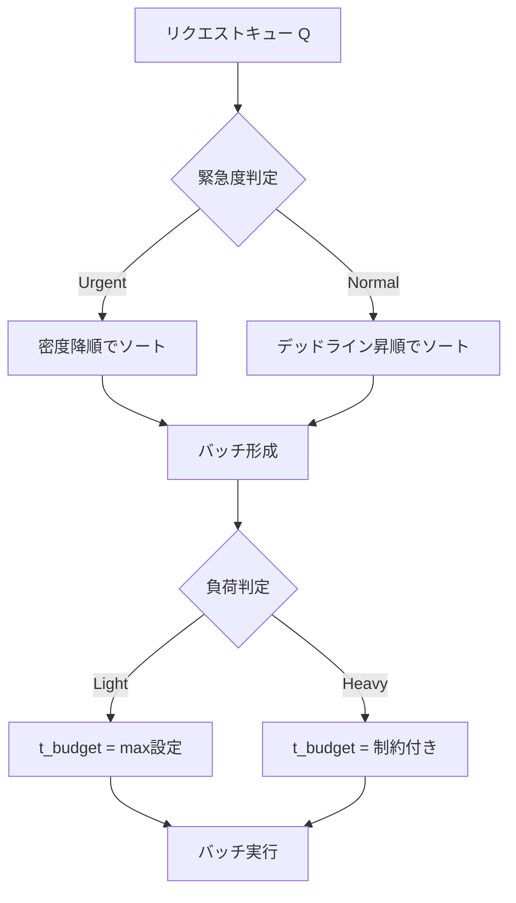

本記事は [https://arxiv.org/abs/2512.12928](https://arxiv.org/abs/2512.12928) の解説記事です。

## 論文概要

ProServeは、LLMサービングにおけるSLO（Service Level Objective）達成率とクライアント単位の優先度を統合的に最適化するリクエストスケジューリングフレームワークである。著者らは、マルチ優先度スケジューリングを「サービスゲイン最大化問題」として定式化し、異なる優先度のリクエストに対してレイテンシ要件を満たすことで得られるゲインの総和を最大化する手法を提案している。エンジン層のSlideBatchingとサービス層のGoRoutingの二層構成により、単一インスタンスでのバッチ形成から複数インスタンスへのディスパッチまでを一貫して最適化する。著者らは最大35%のシステムゲイン改善と52%のSLO達成率改善を報告している。

この記事は [Zenn記事: Azure OpenAIマルチテナント負荷分散：テナント別クォータ×コスト配賦×優先度制御をAPIMで実装する](https://zenn.dev/0h_n0/articles/066a67fb511816) の深掘りです。

## 情報源

| 項目 | 内容 |
|------|------|
| arXiv ID | [2512.12928](https://arxiv.org/abs/2512.12928) |
| URL | [https://arxiv.org/abs/2512.12928](https://arxiv.org/abs/2512.12928) |
| 著者 | Weizhe Huang, Tao Peng, Tongxuan Liu, et al. |
| 発表年 | 2025年12月（初稿）、2026年6月（改訂版v2） |
| 分野 | cs.DC（分散・並列・クラスタコンピューティング） |
| ライセンス | CC BY 4.0 |

## 背景と動機

LLMサービングシステムにおいて、リクエストの優先度に応じた差別的なサービス品質保証は実運用上の重要課題である。例えばマルチテナント環境では、有料プランのテナントには低レイテンシを保証しつつ、無料プランのテナントにはベストエフォートで応答するといった要件が存在する。

既存のLLMサービングシステム（vLLM、Sarathiなど）は、主にFCFS（First-Come-First-Served）方式を採用しており、リクエストの優先度を考慮していない。一方で、優先度を考慮する手法（Weighted VTC、FairBatchingなど）はSLOとの連携が不十分であり、高優先度リクエストのレイテンシ保証と低優先度リクエストのスループット維持を両立することが困難であった。

著者らは、この問題の根本原因を「SLO達成と優先度差別化が独立に扱われていること」に求めている。ProServeはこれらを統合し、トークン単位のデッドライン管理と優先度重みを組み合わせた「サービスゲイン」という統一指標を導入することで、マルチ優先度環境でのSLO最適化を実現している。

## 主要な貢献

著者らが主張する本論文の貢献は以下の通りである。

1. **TDG（Token-level Deadline-aware Gain）の定式化**: トークン単位でデッドラインとSLOを統合した目的関数を定義し、最大化問題としてマルチ優先度スケジューリングを形式化した。この問題がNP困難であることも証明している
2. **SlideBatching**: エンジン層において、適応的な緊急度分割とスライディング境界メカニズムにより、負荷変動下でもレイテンシと優先度差別化を両立するバッチ形成アルゴリズムを設計した
3. **GoRouting**: サービス層において、ゲイン指向のディスパッチを行い、将来の高優先度リクエストに対して容量を予約する分散インスタンス間のルーティングアルゴリズムを提案した
4. **階層的ブロック管理**: 非同期オフロード、パイプライン化されたリロード、適応的コピーバジェット制御を組み合わせたKVキャッシュ管理機構を実装した
5. **大規模評価**: 4つのオープンソースデータセットと1つの産業データセットで、最大8サーバ32インスタンスの規模で評価を実施した

## 技術的詳細

### TDG（Token-level Deadline-aware Gain）

ProServeの核となる目的関数は、トークン単位でデッドライン達成を評価するTDGである。

$$
f_{\text{TDG}}(r) = \sum_{i} w_r(i) \cdot \mathbb{I}[t_{r,i} < \text{deadline}_{r,i}]
$$

ここで、
- $r$: リクエスト
- $t_{r,i}$: リクエスト $r$ の $i$ 番目のトークンが出力された時刻
- $\mathbb{I}[\cdot]$: 指示関数（条件を満たせば1、それ以外0）
- $w_r(i)$: $i$ 番目のトークンの重み

各トークンのデッドラインは以下で定義される。

$$
\text{deadline}_{r,i} = \text{TTFT\_SLO}^r + (i-1) \cdot \text{TPOT\_SLO}^r
$$

ここで $\text{TTFT\_SLO}^r$ はリクエスト $r$ に対する最初のトークン出力までの目標時間、$\text{TPOT\_SLO}^r$ はトークン間出力の目標時間である。

重みは優先度と位置に依存する。

$$
w_r(i) = \begin{cases} w_p \cdot w_{p(r)} & \text{if } i = 1 \\ w_d \cdot w_{p(r)} & \text{otherwise} \end{cases}
$$

ここで $w_{p(r)}$ はリクエスト $r$ の優先度に対応する重み、$w_p$ はプリフィル（初回トークン）の重み係数、$w_d$ はデコード（以降のトークン）の重み係数である。

この定式化には3つの利点がある。(1) バイナリ型のSLO達成判定（全体として達成/未達成）ではなくトークン単位で評価するため、部分的なSLO達成も報酬として反映される。(2) 初回トークンとデコードトークンに異なる重みを設定できるため、TTFTの重要性を適切に反映できる。(3) 優先度重みとの積により、高優先度リクエストのSLO達成がシステム全体のゲインに大きく寄与する。

著者らは、TDGの最大化がNP困難であることを証明している。これは重み付き単位遅延スケジューリング問題 $1 \mid r_j, d_j \mid \sum_j w_j U_j$ を部分問題として含むためであり、ヒューリスティックなアプローチが必要となる。

### SlideBatching（エンジン層）

SlideBatchingは単一推論インスタンス上でのバッチ形成とスケジューリングを担う。その核心は、リクエストを「Urgent（緊急）」と「Normal（通常）」に動的に分割し、異なる戦略でスケジューリングする点にある。



**緊急度判定**: リクエスト $r$ が以下の条件を満たす場合、Urgentと分類される。

$$
r.\text{remain} < \gamma \cdot \varphi(r, Q)
$$

ここで $r.\text{remain}$ はデッドラインまでの残り時間、$\gamma$ は攻撃性係数、$\varphi(r, Q)$ はキュー $Q$ 内で $r$ を処理するのに必要な推定バッチステップ数である。

**スケジューリング戦略**: Urgentリクエストは密度の降順でスケジューリングされる。密度は以下で定義される。

$$
r.\text{density} = \frac{w_r(r.\text{len})}{r.\text{exec}}
$$

ここで $r.\text{len}$ は現在のトークン位置、$r.\text{exec}$ はそのリクエストの推定実行コストである。Normalリクエストはデッドラインの昇順（EDF: Earliest Deadline First）でスケジューリングされる。

**負荷判定関数**: キュー全体の負荷は以下で推定される（PD co-locationの場合）。

$$
\varphi(Q) = \frac{t_{\text{budget}}}{t_{\text{budget}} - t_c} \cdot \sum_{r \in Q} r.\text{exec}
$$

ここで $t_{\text{budget}}$ はレイテンシバジェット、$t_c$ は通信やスケジューリングのオーバーヘッドである。

**バッチレイテンシ推定**: バッチ $B$ の実行時間は線形回帰モデルで推定される。

$$
T_{\text{pd}}(B) = \sum_{r \in B_p} \tilde{T}_p(r) + \sum_{r \in B_d} \tilde{T}_d(r) + t_c
$$

プリフィルのレイテンシ推定は以下の通りである。

$$
\tilde{T}_p(r) = a_p \cdot l_q(r)^2 + b_p \cdot l_q(r) \cdot l_{\text{kv}}(r) + c_p \cdot l_q(r)
$$

デコードのレイテンシ推定は以下の通りである。

$$
\tilde{T}_d(r) = a_d \cdot l_{\text{kv}}(r) + b_d
$$

ここで $l_q(r)$ はクエリ長、$l_{\text{kv}}(r)$ はKVキャッシュ長、$a_p, b_p, c_p, a_d, b_d$ は回帰係数である。著者らはこの推定のMAPE（Mean Absolute Percentage Error）が約4.5%であると報告している。

**飢餓防止**: 待ち時間が閾値 $\tau$ を超えたリクエストは、優先度に関わらず次のバッチに昇格される。これにより低優先度リクエストの完全な飢餓を防止する。

### GoRouting（サービス層）

GoRoutingは複数の推論インスタンス間でリクエストをディスパッチするサービス層のアルゴリズムである。ゲイン指向のディスパッチと容量予約を組み合わせ、システム全体のTDGを最大化する。

**ゲイン計算**: 各プリフィルインスタンス $p$ に対して、リクエストをディスパッチした場合のゲイン差分 $\Delta_p$ を計算する。

$$
\Delta_p = \text{gain}_{\text{post}} - \text{gain}_{\text{pre}}
$$

**候補セットの構築**: 閾値 $\alpha$ を用いてゲインの高いインスタンスのみを候補とする。

$$
C = \{p \in P \mid \Delta_p \geq \alpha \cdot \Delta_{\max}\}
$$

ここで $\Delta_{\max}$ は全インスタンス中の最大ゲイン差分である。

**二重閾値による容量判定**: インスタンスの負荷状態を3段階に分類する。閾値 $\mu$（軽負荷判定）と $\lambda$（重負荷判定）を用いる。

| 負荷状態 | 条件 | ディスパッチ戦略 |
|----------|------|-----------------|
| Light ($L$) | 負荷 $< \mu$ | 最もアイドルなインスタンスを選択 |
| Heavy ($H$) | 負荷 $> \lambda$ | 候補から除外し、最小負荷を選択 |
| Medium | $\mu \leq$ 負荷 $\leq \lambda$ | 候補セット $C \setminus H$ 内で最も負荷の高いインスタンスを選択 |

Medium状態で「最も負荷の高いインスタンス」を選択する理由は、軽負荷のインスタンスを将来の高優先度リクエストのために予約するためである。この戦略により、高優先度リクエストが到着した際に即座に低レイテンシで処理できるインスタンスが確保される。

### 階層的ブロック管理

ProServeは、GPUメモリ上のKVキャッシュブロックを効率的に管理するための3つの機構を備える。

**非同期オフロード**: キュー末尾のリクエスト（スケジューリングされにくいリクエスト）のKVキャッシュブロックを、別スレッドでホストメモリに退避する。低優先度リクエストにはより小さい閾値 $n_{\text{off}}^r$ を設定し、コピー頻度を高めることで、GPUメモリの利用効率を向上させる。

**パイプラインリロード**: レイヤ $i$ の計算中にレイヤ $i+1$ のKVキャッシュを非同期でホストからデバイスに転送する。これにより、リロードのレイテンシを計算時間に隠蔽できる。

**適応的コピーバジェット制御**: 1ステップあたりにコピー可能な最大ブロック数 $B_{\text{copy}}$ を動的に決定する。最小フォワードレイテンシ $T_{\text{fwd}}^{\min}$ と最大転送時間 $T_{\text{trans}}^{\max}$ を比較し、以下のロジックで制御する。

1. $T_{\text{fwd}}^{\min} > t_{\text{budget}}$ の場合: $B_{\text{copy}} = \lfloor t_{\text{budget}} / t_{\text{block}} \rfloor$
2. $T_{\text{fwd}}^{\min} < t_{\text{budget}} < T_{\text{trans}}^{\max}$ の場合: 二分探索で最適値を決定
3. それ以外: 全ての不足ブロックをコピー

## 実装のポイント

ProServeの実装において、実運用に向けた設計上の注目点がいくつかある。

**レイテンシ推定モデルの校正**: バッチレイテンシの推定には線形回帰モデルを使用しているが、著者らはMAPE約4.5%という精度を達成するために、プリフィルとデコードの計算特性を分離してモデリングしている。実運用では、ハードウェア構成やモデルアーキテクチャが変わるたびにこの回帰係数を再校正する必要がある。

**飢餓防止閾値の設定**: 閾値 $\tau$ の設定は、低優先度リクエストのレイテンシ上限を事実上決定する。著者らの実験では具体的な値は明示されていないが、ビジネス要件に応じて調整が必要である。

**状態の鮮度管理**: GoRoutingでは各インスタンスの状態（キュー長、空きブロック数）をイベント駆動で収集しているが、ネットワーク遅延による状態の陳腐化が課題となる。著者らはタイムスタンプ追跡による陳腐化補正を行っている。

**PD co-location vs PD disaggregation**: ProServeはプリフィルとデコードを同一インスタンスで処理するco-locationモードと、分離して処理するdisaggregationモードの両方をサポートしている。disaggregationモードではプリフィルインスタンスとデコードインスタンスを独立にスケーリングできるため、ワークロード特性に応じた柔軟な構成が可能である。

## Production Deployment Guide

ProServeの優先度ベーススケジューリングをAWS上で実現する場合の実装パターンを示す。以下は論文の知見を踏まえた、マルチ優先度LLMサービングの実践的な構成ガイドである。コスト試算は2026年9月時点のAWS ap-northeast-1（東京）リージョン料金に基づく概算値であり、実際のコストはトラフィックパターン、リージョン、バースト使用量により変動する。最新料金はAWS料金計算ツールで確認を推奨する。

### AWS実装パターン

| 構成 | ユースケース | 月額概算 (ap-northeast-1) | 主要サービス |
|------|-------------|--------------------------|-------------|
| Small | PoC・社内ツール、~100 req/日 | $80-200 | Lambda, SQS (優先度別), Bedrock, DynamoDB |
| Medium | プロダクション初期、~1000 req/日 | $500-1,200 | ECS Fargate, SQS + PriorityQueue, Bedrock, ElastiCache |
| Large | 大規模マルチテナント、10000+ req/日 | $3,000-7,000 | EKS + Karpenter, 自前モデルホスティング (vLLM), Redis Cluster |

**Small構成**: Lambda関数で優先度別のSQSキューからリクエストを取得し、Bedrockに転送する。高優先度キューにはProvisioned Concurrencyを設定してコールドスタートを回避する。月額内訳: Lambda ($5-15), SQS ($1-5), Bedrock ($50-150), DynamoDB ($10-30)。

**Medium構成**: ECS Fargateでリクエストルーターとワーカーを分離し、SQSの優先度別キューでGoRouting相当のディスパッチを実現する。ElastiCacheでインスタンス状態を共有する。月額内訳: ECS Fargate ($100-300), SQS ($5-20), Bedrock ($300-700), ElastiCache ($50-100), ALB ($20-50)。

**Large構成**: EKSクラスタ上でvLLMをホストし、SlideBatching相当のカスタムスケジューラをサイドカーとして実装する。Karpenterによるノードの自動スケーリングでSpot Instancesを活用し、GPU単価を最大90%削減する。月額内訳: EKS ($75), EC2 GPU Spot ($1,500-4,000), Redis Cluster ($200-400), ALB ($30-60), モニタリング ($100-200)。

**コスト削減テクニック**:
- Spot Instances活用（g5.xlargeで最大90%削減、ただし中断リスクあり）
- Reserved Instances購入（1年コミットで最大72%削減、安定ワークロード向け）
- Bedrock Batch API使用（低優先度リクエストをバッチ処理で50%削減）
- Prompt Caching有効化（Bedrock Claude/Novaで30-90%削減）

### Terraformインフラコード

#### Small構成: Lambda + 優先度別SQSキュー

```hcl
terraform {
  required_version = ">= 1.6"
  required_providers {
    aws = {
      source  = "hashicorp/aws"
      version = "~> 5.70"
    }
  }
}

provider "aws" {
  region = "ap-northeast-1"
}

variable "project_name" {
  type    = string
  default = "proserve-scheduler"
}

# --- 優先度別SQSキュー ---

resource "aws_sqs_queue" "priority_queue" {
  for_each = {
    high   = { delay = 0, visibility = 120 }
    medium = { delay = 0, visibility = 300 }
    low    = { delay = 5, visibility = 600 }
  }

  name                       = "${var.project_name}-${each.key}-priority"
  delay_seconds              = each.value.delay
  visibility_timeout_seconds = each.value.visibility
  message_retention_seconds  = 86400
  receive_wait_time_seconds  = 20

  redrive_policy = jsonencode({
    deadLetterTargetArn = aws_sqs_queue.dlq[each.key].arn
    maxReceiveCount     = 3
  })

  sqs_managed_sse_enabled = true

  tags = {
    Project  = var.project_name
    Priority = each.key
  }
}

resource "aws_sqs_queue" "dlq" {
  for_each = toset(["high", "medium", "low"])

  name                      = "${var.project_name}-${each.key}-dlq"
  message_retention_seconds = 1209600
  sqs_managed_sse_enabled   = true

  tags = {
    Project  = var.project_name
    Priority = each.key
  }
}

# --- DynamoDB: SLOメトリクス記録 ---

resource "aws_dynamodb_table" "slo_metrics" {
  name         = "${var.project_name}-slo-metrics"
  billing_mode = "PAY_PER_REQUEST"
  hash_key     = "request_id"
  range_key    = "timestamp"

  attribute {
    name = "request_id"
    type = "S"
  }

  attribute {
    name = "timestamp"
    type = "N"
  }

  ttl {
    attribute_name = "expire_at"
    enabled        = true
  }

  point_in_time_recovery {
    enabled = true
  }

  server_side_encryption {
    enabled = true
  }

  tags = {
    Project = var.project_name
  }
}

# --- IAM Role ---

data "aws_iam_policy_document" "lambda_assume" {
  statement {
    actions = ["sts:AssumeRole"]
    principals {
      type        = "Service"
      identifiers = ["lambda.amazonaws.com"]
    }
  }
}

resource "aws_iam_role" "scheduler_lambda" {
  name               = "${var.project_name}-lambda-role"
  assume_role_policy = data.aws_iam_policy_document.lambda_assume.json

  tags = { Project = var.project_name }
}

data "aws_iam_policy_document" "scheduler_policy" {
  statement {
    sid = "SQSAccess"
    actions = [
      "sqs:ReceiveMessage",
      "sqs:DeleteMessage",
      "sqs:GetQueueAttributes",
      "sqs:SendMessage",
    ]
    resources = concat(
      [for q in aws_sqs_queue.priority_queue : q.arn],
      [for q in aws_sqs_queue.dlq : q.arn]
    )
  }

  statement {
    sid     = "BedrockInvoke"
    actions = ["bedrock:InvokeModel", "bedrock:InvokeModelWithResponseStream"]
    resources = ["arn:aws:bedrock:ap-northeast-1::foundation-model/*"]
  }

  statement {
    sid = "DynamoDBAccess"
    actions = [
      "dynamodb:PutItem",
      "dynamodb:GetItem",
      "dynamodb:Query",
    ]
    resources = [aws_dynamodb_table.slo_metrics.arn]
  }

  statement {
    sid = "CloudWatchLogs"
    actions = [
      "logs:CreateLogGroup",
      "logs:CreateLogStream",
      "logs:PutLogEvents",
    ]
    resources = ["arn:aws:logs:ap-northeast-1:*:*"]
  }
}

resource "aws_iam_role_policy" "scheduler_lambda" {
  name   = "${var.project_name}-lambda-policy"
  role   = aws_iam_role.scheduler_lambda.id
  policy = data.aws_iam_policy_document.scheduler_policy.json
}

# --- Lambda: 優先度別ワーカー ---

resource "aws_lambda_function" "priority_worker" {
  for_each = toset(["high", "medium", "low"])

  function_name = "${var.project_name}-worker-${each.key}"
  runtime       = "python3.12"
  handler       = "handler.lambda_handler"
  role          = aws_iam_role.scheduler_lambda.arn
  timeout       = each.key == "high" ? 120 : each.key == "medium" ? 300 : 600
  memory_size   = each.key == "high" ? 1024 : 512

  filename         = "${path.module}/lambda/worker.zip"
  source_code_hash = filebase64sha256("${path.module}/lambda/worker.zip")

  environment {
    variables = {
      PRIORITY_LEVEL   = each.key
      METRICS_TABLE    = aws_dynamodb_table.slo_metrics.name
      BEDROCK_MODEL_ID = "anthropic.claude-sonnet-4-20250514"
    }
  }

  tracing_config {
    mode = "Active"
  }

  tags = {
    Project  = var.project_name
    Priority = each.key
  }
}

# --- SQS -> Lambda トリガー ---

resource "aws_lambda_event_source_mapping" "sqs_trigger" {
  for_each = toset(["high", "medium", "low"])

  event_source_arn                   = aws_sqs_queue.priority_queue[each.key].arn
  function_name                      = aws_lambda_function.priority_worker[each.key].arn
  batch_size                         = each.key == "high" ? 1 : 5
  maximum_batching_window_in_seconds = each.key == "high" ? 0 : 10
  enabled                            = true
}
```

#### Large構成: EKS + vLLM + 優先度スケジューラ

```hcl
terraform {
  required_version = ">= 1.6"
  required_providers {
    aws = {
      source  = "hashicorp/aws"
      version = "~> 5.70"
    }
    helm = {
      source  = "hashicorp/helm"
      version = "~> 2.15"
    }
    kubectl = {
      source  = "alekc/kubectl"
      version = "~> 2.1"
    }
  }
}

provider "aws" {
  region = "ap-northeast-1"
}

variable "cluster_name" {
  type    = string
  default = "proserve-llm-cluster"
}

variable "vpc_id" {
  type = string
}

variable "private_subnet_ids" {
  type = list(string)
}

# --- EKS Cluster ---

module "eks" {
  source  = "terraform-aws-modules/eks/aws"
  version = "~> 20.24"

  cluster_name    = var.cluster_name
  cluster_version = "1.31"

  vpc_id     = var.vpc_id
  subnet_ids = var.private_subnet_ids

  cluster_endpoint_public_access = false

  cluster_addons = {
    coredns            = { most_recent = true }
    kube-proxy         = { most_recent = true }
    vpc-cni            = { most_recent = true }
    aws-ebs-csi-driver = { most_recent = true }
  }

  eks_managed_node_groups = {
    system = {
      instance_types = ["m7i.large"]
      min_size       = 2
      max_size       = 4
      desired_size   = 2
      labels         = { "node-role" = "system" }
    }
  }

  tags = {
    Project   = "proserve-llm"
    ManagedBy = "terraform"
  }
}

# --- Karpenter: GPU Spot ノード ---

resource "kubectl_manifest" "karpenter_gpu_nodepool" {
  yaml_body = <<-YAML
    apiVersion: karpenter.sh/v1
    kind: NodePool
    metadata:
      name: gpu-inference
    spec:
      template:
        metadata:
          labels:
            node-role: gpu-inference
        spec:
          requirements:
            - key: karpenter.sh/capacity-type
              operator: In
              values: ["spot", "on-demand"]
            - key: node.kubernetes.io/instance-type
              operator: In
              values:
                - g5.xlarge
                - g5.2xlarge
                - g5.4xlarge
                - g6.xlarge
                - g6.2xlarge
          nodeClassRef:
            group: karpenter.k8s.aws
            kind: EC2NodeClass
            name: gpu-default
      limits:
        cpu: "256"
        memory: 1024Gi
        nvidia.com/gpu: "16"
      disruption:
        consolidationPolicy: WhenEmptyOrUnderutilized
        consolidateAfter: 120s
  YAML

  depends_on = [module.eks]
}

# --- vLLM Deployment with Priority Scheduler Sidecar ---

resource "kubectl_manifest" "vllm_deployment" {
  yaml_body = <<-YAML
    apiVersion: apps/v1
    kind: Deployment
    metadata:
      name: vllm-inference
      namespace: llm-serving
      labels:
        app: proserve
        component: inference
    spec:
      replicas: 4
      selector:
        matchLabels:
          app: proserve
          component: inference
      template:
        metadata:
          labels:
            app: proserve
            component: inference
        spec:
          nodeSelector:
            node-role: gpu-inference
          tolerations:
            - key: nvidia.com/gpu
              operator: Exists
              effect: NoSchedule
          containers:
            - name: vllm
              image: "vllm/vllm-openai:v0.8.5"
              args:
                - "--model"
                - "Qwen/Qwen2-7B-Instruct"
                - "--max-model-len"
                - "8192"
                - "--gpu-memory-utilization"
                - "0.90"
              resources:
                requests:
                  nvidia.com/gpu: "1"
                  cpu: "4"
                  memory: 16Gi
                limits:
                  nvidia.com/gpu: "1"
                  cpu: "8"
                  memory: 32Gi
              ports:
                - containerPort: 8000
              livenessProbe:
                httpGet:
                  path: /health
                  port: 8000
                initialDelaySeconds: 120
                periodSeconds: 30
              readinessProbe:
                httpGet:
                  path: /health
                  port: 8000
                initialDelaySeconds: 60
                periodSeconds: 10
            - name: priority-scheduler
              image: "123456789012.dkr.ecr.ap-northeast-1.amazonaws.com/proserve-scheduler:latest"
              env:
                - name: VLLM_ENDPOINT
                  value: "http://localhost:8000"
                - name: REDIS_URL
                  valueFrom:
                    secretKeyRef:
                      name: redis-credentials
                      key: url
                - name: URGENCY_GAMMA
                  value: "1.5"
                - name: STARVATION_TAU
                  value: "30"
              resources:
                requests:
                  cpu: "1"
                  memory: 2Gi
                limits:
                  cpu: "2"
                  memory: 4Gi
              ports:
                - containerPort: 8080
  YAML

  depends_on = [module.eks]
}

# --- AWS Budgets ---

resource "aws_budgets_budget" "gpu_cost" {
  name         = "proserve-gpu-monthly"
  budget_type  = "COST"
  limit_amount = "5000"
  limit_unit   = "USD"
  time_unit    = "MONTHLY"

  cost_filter {
    name   = "TagKeyValue"
    values = ["user:Project$proserve-llm"]
  }

  notification {
    comparison_operator       = "GREATER_THAN"
    threshold                 = 80
    threshold_type            = "PERCENTAGE"
    notification_type         = "FORECASTED"
    subscriber_email_addresses = ["ops-team@example.com"]
  }

  notification {
    comparison_operator       = "GREATER_THAN"
    threshold                 = 100
    threshold_type            = "PERCENTAGE"
    notification_type         = "ACTUAL"
    subscriber_email_addresses = ["ops-team@example.com"]
  }
}
```

### 運用・監視設定

マルチ優先度LLMサービングでは、優先度別のSLO達成率とシステム全体のゲインを継続的にモニタリングする必要がある。

```python
# CloudWatch Logs Insights: 優先度別SLO達成率
QUERY_SLO_BY_PRIORITY = """
fields @timestamp, priority, ttft_ms, tpot_ms, ttft_slo, tpot_slo
| stats
    count(*) as total,
    sum(case when ttft_ms < ttft_slo then 1 else 0 end) as ttft_met,
    sum(case when tpot_ms < tpot_slo then 1 else 0 end) as tpot_met,
    avg(ttft_ms) as avg_ttft,
    pct(ttft_ms, 95) as p95_ttft,
    pct(ttft_ms, 99) as p99_ttft
  by priority, bin(1h)
| sort priority asc, bin(1h) desc
"""

# CloudWatch Logs Insights: TDGゲイン異常検知
QUERY_GAIN_ANOMALY = """
fields @timestamp, system_gain, request_count
| stats
    avg(system_gain / request_count) as avg_gain_per_req,
    min(system_gain / request_count) as min_gain_per_req
  by bin(15m)
| filter min_gain_per_req < 0.5
| sort @timestamp desc
"""
```

```python
import boto3
from datetime import datetime, timedelta


def create_slo_alarm(
    cw_client: boto3.client,
    project_name: str,
    priority: str,
    threshold: float,
    sns_topic_arn: str,
) -> dict:
    """優先度別SLO達成率の低下を検知するCloudWatchアラームを作成する.

    Args:
        cw_client: CloudWatch boto3クライアント
        project_name: プロジェクト名プレフィックス
        priority: 優先度レベル (high/medium/low)
        threshold: SLO達成率の閾値 (0.0-1.0)
        sns_topic_arn: 通知先SNSトピックARN

    Returns:
        CloudWatch put_metric_alarm レスポンス
    """
    return cw_client.put_metric_alarm(
        AlarmName=f"{project_name}-slo-attainment-{priority}",
        MetricName="SLOAttainmentRate",
        Namespace=f"{project_name}/LLMServing",
        Dimensions=[{"Name": "Priority", "Value": priority}],
        Statistic="Average",
        Period=300,
        EvaluationPeriods=3,
        Threshold=threshold,
        ComparisonOperator="LessThanThreshold",
        AlarmActions=[sns_topic_arn],
        TreatMissingData="breaching",
    )


def get_daily_cost_report(
    ce_client: boto3.client,
    project_tag: str,
) -> dict:
    """日次コストレポートを取得し、GPU/推論コストを抽出する.

    Args:
        ce_client: Cost Explorer boto3クライアント
        project_tag: プロジェクトタグ値

    Returns:
        サービス別コスト辞書
    """
    end = datetime.utcnow().strftime("%Y-%m-%d")
    start = (datetime.utcnow() - timedelta(days=1)).strftime("%Y-%m-%d")

    response = ce_client.get_cost_and_usage(
        TimePeriod={"Start": start, "End": end},
        Granularity="DAILY",
        Metrics=["UnblendedCost"],
        Filter={
            "Tags": {
                "Key": "Project",
                "Values": [project_tag],
            }
        },
        GroupBy=[{"Type": "DIMENSION", "Key": "SERVICE"}],
    )

    costs: dict[str, float] = {}
    for group in response["ResultsByTime"][0]["Groups"]:
        service = group["Keys"][0]
        amount = float(group["Metrics"]["UnblendedCost"]["Amount"])
        if amount > 0:
            costs[service] = round(amount, 2)

    return costs
```

```python
from aws_xray_sdk.core import xray_recorder, patch_all

# boto3自動計装
patch_all()


@xray_recorder.capture("process_priority_request")
def process_request(request_id: str, priority: str, payload: dict) -> dict:
    """優先度付きリクエストを処理しX-Rayトレースを記録する.

    Args:
        request_id: リクエスト識別子
        priority: 優先度レベル
        payload: リクエストペイロード

    Returns:
        処理結果辞書
    """
    subsegment = xray_recorder.current_subsegment()
    subsegment.put_annotation("priority", priority)
    subsegment.put_annotation("request_id", request_id)
    subsegment.put_metadata("payload_size", len(str(payload)))

    # Bedrock呼び出し（X-Ray自動トレース対象）
    result = invoke_bedrock(payload)

    subsegment.put_metadata("ttft_ms", result["ttft_ms"])
    subsegment.put_metadata("total_tokens", result["total_tokens"])

    return result
```

### コスト最適化チェックリスト

マルチ優先度LLMサービングでは、高優先度のSLO保証と全体のコスト効率のバランスが重要である。

**アーキテクチャ選択**

- [ ] トラフィック量に応じた構成を選択する（~100 req/日: Serverless, ~1000 req/日: Hybrid, 10000+ req/日: Container）
- [ ] PD co-location vs disaggregation をワークロード特性で判断する（長プロンプト中心 → disaggregation推奨）

**リソース最適化**

- [ ] GPU: Spot Instances優先（g5/g6、中断時はGraceful Shutdown + リクエスト再キューイング）
- [ ] Reserved Instances: 安定ワークロード分を1年コミットで72%削減
- [ ] Savings Plans: Compute Savings Plansで柔軟な割引適用
- [ ] Lambda: Power Tuningツールでメモリサイズを最適化
- [ ] EKS: Karpenter consolidationPolicyでアイドルノードを自動回収
- [ ] 低優先度リクエスト用のノードプールをSpot 100%で構成

**LLMコスト削減**

- [ ] Bedrock Batch API: 低優先度リクエストをバッチ処理で50%削減
- [ ] Prompt Caching: システムプロンプト部分のキャッシュで30-90%削減
- [ ] モデル選択ロジック: 高優先度はClaude Sonnet、低優先度はHaikuを使い分け
- [ ] トークン数制限: 優先度別にmax_tokensを設定（High: 4096, Low: 2048）
- [ ] KVキャッシュの優先度別管理: ProServeの階層的ブロック管理を適用

**監視・アラート**

- [ ] AWS Budgets: 月次予算の80%で警告、100%でアクション
- [ ] CloudWatch アラーム: 優先度別SLO達成率の低下検知
- [ ] Cost Anomaly Detection: 機械学習ベースの異常コスト検知を有効化
- [ ] 日次コストレポート: Cost Explorer APIで自動取得、$100/日超過でSNS通知
- [ ] TDGゲインの継続モニタリング: 15分間隔でリクエストあたりゲインを計測

**リソース管理**

- [ ] DynamoDB TTL設定（SLOメトリクスを7日で自動削除）
- [ ] CloudWatch Logs保持期間を30日に設定
- [ ] タグ戦略: Project, Priority, Environment タグを全リソースに付与
- [ ] ライフサイクルポリシー: S3推論ログを30日後にIA、90日後にGlacierに移行
- [ ] 開発環境の夜間自動停止（EKSノードグループのmin_size=0設定）

## 実験結果

著者らはProServeを4つのオープンソースデータセット（ShareGPT、Azure、BurstGPT、QwenTrace）と1つの産業データセットで評価している。推論モデルにはQwen2-7BとQwen3-32Bを使用し、ハードウェアはAscend 910B NPU（サーバあたり16基、96物理CPUコア、2TB RAM）で実験を実施している。

### 単一ノード（PD co-location）

| 手法 | 位置づけ | ProServeとの差 |
|------|---------|---------------|
| vLLM-FCFS | FCFSベースライン | TDGゲイン最大35%劣位 |
| Weighted VTC | トークンベース公平性 | SLO達成率最大52%劣位 |
| Sarathi-FCFS | チャンクプリフィル+FCFS | 優先度差別化なし |
| Sarathi-Priority | デコード優先+優先度順 | 高負荷時にSLO劣化 |
| FairBatching | EDFベース | デッドライン精度で劣位 |

著者らは、ProServeがシステムゲインで最大35%、SLO達成率で最大52%の改善を達成したと報告している（論文Section 5の実験結果より）。特にQwenTraceのようなリクエスト長の分散が大きいワークロードで改善幅が顕著であった。

### マルチノード（32インスタンス）

GoRoutingは、最大8サーバ32インスタンスの規模でMinLoad（最小負荷ディスパッチ）を一貫して上回った。著者らは、ゲイン指向のディスパッチが高負荷時に特に有効であり、容量予約メカニズムが高優先度リクエストの応答レイテンシを改善したと報告している。

### Ablation Study

SlideBatchingの各コンポーネントを除去した場合の影響が検証されている。適応的緊急度分割の除去は適応性の低下、レイテンシ対応バッチ容量制御の除去は性能劣化、ブロック管理の各要素（非同期オフロード、動的コピーバジェット、パイプラインリロード）の除去はそれぞれ測定可能なゲイン低下をもたらした。

### 優先度重みスケーリング

高優先度と低優先度の重み比を1:1から4:1まで変化させた実験では、重み比の増加に伴い高優先度のSLO達成率が向上し、全体的なSLO達成率は安定して維持された。Sarathi-Priorityのような厳格な優先度制御と比較して、ProServeはより柔軟なトレードオフを実現していると著者らは主張している。

### 制約と限界

論文で報告されている制約として以下の点がある。(1) 実験はAscend 910B NPU上で実施されており、NVIDIA GPU上での性能特性は未検証である。(2) レイテンシ推定モデルの回帰係数はハードウェア依存であり、環境ごとの再校正が必要である。(3) 飢餓防止閾値 $\tau$ やGoRoutingの二重閾値 $\mu, \lambda$ の最適設定はワークロード依存であり、汎用的な指針は提供されていない。

## 実運用への応用

ProServeの設計パターンは、Zenn記事「Azure OpenAIマルチテナント負荷分散」で扱われているPTU/PAYG優先度ベースルーティングの学術的基盤を提供している。

**PTU/PAYG構成への適用**: Zenn記事ではAzure API Managementを用いてPTU（Provisioned Throughput Units）を高優先度テナントに、PAYG（Pay-As-You-Go）を低優先度テナントに割り当てるアーキテクチャが紹介されている。ProServeのGoRoutingにおける二重閾値容量判定は、このPTU/PAYG間のルーティング判断を形式化したものと解釈できる。PTUインスタンスが「Light」状態のときは高優先度リクエストをそちらに集中させ、「Heavy」状態のときはPAYGにフォールバックする戦略は、GoRoutingのディスパッチロジックと対応する。

**テナント別クォータとTDGの対応**: テナント別のクォータ管理は、TDGの優先度重み $w_{p(r)}$ として定式化できる。上位プランのテナントに高い重みを設定することで、SLO達成がシステムゲインに大きく寄与し、スケジューラが自然に上位テナントを優遇する仕組みとなる。

**コスト配賦への示唆**: ProServeのゲイン関数は、テナント別のコスト配賦モデルとしても応用可能である。各テナントが消費したGPU時間を、そのリクエストが生成したTDGゲインに比例して配賦することで、優先度と利用実績に基づく公平なコスト分配が実現できる。

## 関連研究

- **Virtual Token Counter (VTC)** (Sheng et al., 2024): トークンベースの比例公平性を実現するカウンタ方式。優先度概念はないが、公平なスループット分配を目指す点でProServeの公平性設計に影響を与えている
- **FairServe** (Saxena et al., 2024): クライアントレベルの公平性を保証するサービングフレームワーク。ProServeはFairServeの公平性概念を優先度付きに拡張したものと位置づけられる
- **Sarathi** (Agrawal et al., 2024): チャンクプリフィルによるバッチ効率化手法。ProServeのSlideBatchingは、Sarathiのチャンク化アプローチを優先度対応に拡張している
- **vLLM** (Kwon et al., 2023): PagedAttentionによるKVキャッシュ管理を導入したLLMサービングエンジン。ProServeの階層的ブロック管理はvLLMのPagedAttentionを基盤としつつ、優先度対応のオフロード/リロード戦略を追加している

## まとめと今後の展望

ProServeは、LLMサービングにおけるSLO達成と優先度差別化を統合的に扱う初の体系的フレームワークである。TDGによる統一的な目的関数の定式化、SlideBatchingによるエンジン層のスケジューリング、GoRoutingによるサービス層のディスパッチという三層の設計により、既存手法を大幅に上回る性能を達成している。

実務への示唆として、マルチテナントLLMサービスにおいて優先度ベースのスケジューリングは、単純なFCFSや比例公平性よりも高いビジネス価値を生む可能性がある。特にPTU/PAYG混在環境やテナント別SLA要件が異なる環境では、ProServeの設計パターンが直接応用可能である。

今後の研究方向として、著者らが明示していない点も含め、NVIDIA GPUへの適用検証、プリフィルとデコードの動的disaggregation、ワークロード予測に基づく先行的な容量予約などが考えられる。

## 参考文献

- **arXiv**: [https://arxiv.org/abs/2512.12928](https://arxiv.org/abs/2512.12928)
- **Related Zenn article**: [https://zenn.dev/0h_n0/articles/066a67fb511816](https://zenn.dev/0h_n0/articles/066a67fb511816)
- **vLLM**: Kwon et al., "Efficient Memory Management for Large Language Model Serving with PagedAttention," SOSP 2023
- **Sarathi**: Agrawal et al., "Taming Throughput-Latency Tradeoff in LLM Inference with Sarathi-Serve," OSDI 2024
- **VTC**: Sheng et al., "Fairness in Serving Large Language Models," OSDI 2024
