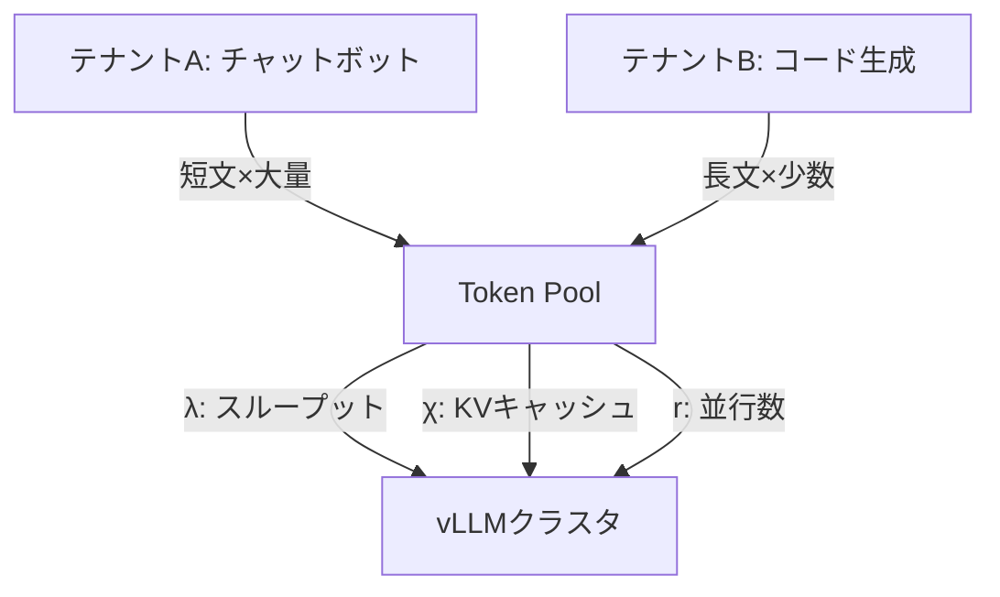

本記事は [https://arxiv.org/abs/2603.00356](https://arxiv.org/abs/2603.00356) の解説記事です。

## 論文概要（Abstract）

マルチテナントAI推論基盤において、テナント間のリソース分離と公平性を実現する制御機構「Token Pools」が提案されている。従来のリクエスト数やGPUメモリ量ベースの制御では、LLM推論の可変長出力や動的なKVキャッシュ消費を適切に管理できなかった。著者は推論ネイティブな計測単位（トークンスループット、KVキャッシュ容量、リクエスト並行数）でキャパシティを表現し、アドミッション制御とオートスケーリングを統合したフレームワークを構築している。Kubernetes上でvLLMを用いた検証により、保証クラスのP99 TTFTを1.2秒以下に維持しつつプール利用率ほぼ100%を達成したと報告されている。

この記事は [Zenn記事: Azure OpenAIマルチテナント負荷分散：テナント別クォータ×コスト配賦×優先度制御をAPIMで実装する](https://zenn.dev/0h_n0/articles/066a67fb511816) の深掘りです。

## 情報源

- **arXiv ID**: 2603.00356
- **URL**: [https://arxiv.org/abs/2603.00356](https://arxiv.org/abs/2603.00356)
- **著者**: William J. Cunningham
- **発表年**: 2026
- **分野**: cs.DC（Distributed Computing）

## 背景と動機（Background & Motivation）

LLM推論基盤を複数チームで共有する場合、リソース管理は従来のWebサービスと本質的に異なる。HTTPリクエストは処理時間がおおむね予測可能だが、LLM推論ではプロンプト長と生成長が大きく変動し、1リクエストのKVキャッシュ消費が数MBから数百MBまで動的に変化する。

従来のレートリミッター（リクエスト/秒やトークン/分の固定上限）では、テナント間の公平性保証が困難である。短い応答を大量に送信するテナントと長文生成を少数実行するテナントでは、リソース消費パターンが根本的に異なるためである。著者はこの課題に対し、推論固有のリソース単位を3軸としたキャパシティ抽象化を提案し、「約束したリソース」と「実際にプロビジョンされたリソース」の一致を維持する仕組みを設計している。



## 主要な貢献（Key Contributions）

- **貢献1: Token Pools抽象化** — トークンスループット $\lambda$、KVキャッシュ容量 $\chi$、リクエスト並行数 $r$ の3軸でLLM推論キャパシティを表現するスケジューラブルリソースモデルを導入した
- **貢献2: 優先度ベースアドミッション制御** — サービスクラス（Dedicated/Elastic/Spot）とSLO要件を考慮した多段階アドミッション判定を設計し、HTTP 429 + Retry-Afterで適切な再試行を可能にしている
- **貢献3: フェアシェア収束** — EWMAベースのサービス債務追跡により、短期バーストを許容しつつ長期的な公平性を保証する手法を提案した
- **貢献4: Kubernetes実装と検証** — CRD + Redis + LiteLLMの実装で、保証クラスのP99 TTFT 1.2秒以下とプール利用率ほぼ100%を達成

## 技術的詳細（Technical Details）

### Token Pools抽象化

Token Poolsは以下の3リソース次元でプールキャパシティを定義する:

$$
\text{Pool} = (\Lambda_p, X_p, R_p)
$$

ここで $\Lambda_p$ はプール全体のトークンスループット容量（tokens/秒）、$X_p$ はKVキャッシュ容量（バイト）、$R_p$ は最大リクエスト並行数である。各テナント $e$ のエンタイトルメント $(\lambda_e, \chi_e, r_e)$ は以下の実行可能性制約を満たす:

$$
\sum_{e} \hat{\lambda}_e \leq \Lambda_p, \quad \sum_{e} \hat{\chi}_e \leq X_p, \quad \sum_{e} \hat{r}_e \leq R_p
$$

$\hat{\lambda}_e, \hat{\chi}_e, \hat{r}_e$ はテナント $e$ の瞬時消費量を表す。

### サービスクラスとアドミッション制御

| クラス | 特徴 | 用途例 |
|--------|------|--------|
| Dedicated/Guaranteed | 予約済み、リクレーム不可 | 本番APIサービス |
| Elastic | 時間平均で保証、縮退可能 | バッチ処理、社内ツール |
| Spot | 保証なし、最初にスロットル | 開発・テスト |

アドミッション制御は5段階のパイプラインで構成される: (1)エンタイトルメント有効性 → (2)出力長上限 → (3)並行数上限 → (4)トークン予算 → (5)プール競合チェック（優先度重みに基づく受理/拒否）。拒否時はHTTP 429にRetry-Afterヘッダを付与する。

### 優先度重み計算

各テナントの動的優先度重みは以下の式で計算される:

$$
w_e = w_{\kappa_e} \cdot \left(1 + \alpha_{\text{slo}} \cdot \frac{\ell_e^*}{\bar{\ell}^*}\right)^{-1} \cdot \left(1 + \alpha_{\text{burst}} \cdot b_e\right)^{-1} \cdot \left(1 + \alpha_{\text{debt}} \cdot d_e\right)
$$

ここで、
- $w_{\kappa_e}$: サービスクラス基本重み（Dedicated=1000, Elastic=100, Spot=1, Preemptible=0.1）
- $\ell_e^* / \bar{\ell}^*$: テナントSLOレイテンシ目標とプール平均SLOの比
- $b_e$: バースト強度（瞬時消費が割り当てを超えている程度）
- $d_e$: サービス債務（過去に十分なサービスを受けられなかった度合い）
- $\alpha_{\text{slo}}=2.0, \alpha_{\text{burst}}=1.0, \alpha_{\text{debt}}=4.0$: 感度係数

SLOが厳しいテナント（500ms応答要件のCopilot）は、緩いSLO（30秒のバッチ合成）のテナントより約4.6倍の優先度を自動的に獲得する。

### フェアシェア収束（EWMA）

サービス債務 $d_e$ をEWMAで追跡する:

$$
d_e(k) = \gamma_d \cdot d_e(k-1) + (1 - \gamma_d) \cdot g_e(k)
$$

サービスギャップ $g_e = (\lambda_e - \hat{\lambda}_e) / \lambda_e$ は割り当てに対する実サービスの不足度を表す。$g_e > 0$ は割り当て未満のサービス状態を示し、債務蓄積により次回以降の優先度が $(1 + \alpha_{\text{debt}} \cdot d_e)$ 項で引き上げられる。バースト強度は3軸の超過度合いの合計として定義される:

$$
\delta_e = \max\left(0, \frac{\hat{\lambda}_e}{\lambda_e} - 1\right) + \max\left(0, \frac{\hat{\chi}_e}{\chi_e} - 1\right) + \max\left(0, \frac{\hat{r}_e}{r_e} - 1\right)
$$

### アルゴリズム: 優先度重み計算

```python
from dataclasses import dataclass
from enum import Enum


class ServiceClass(Enum):
    """サービスクラス定義"""
    DEDICATED = "dedicated"
    ELASTIC = "elastic"
    SPOT = "spot"

BASE_WEIGHTS: dict[ServiceClass, float] = {
    ServiceClass.DEDICATED: 1000.0,
    ServiceClass.ELASTIC: 100.0,
    ServiceClass.SPOT: 1.0,
}

@dataclass
class Entitlement:
    """テナントのリソース割り当て

    Attributes:
        tenant_id: テナント識別子
        service_class: サービスクラス
        throughput: 割り当てスループット (tokens/s)
        slo_latency: SLOレイテンシ目標 (ms)
    """
    tenant_id: str
    service_class: ServiceClass
    throughput: float
    slo_latency: float

def compute_priority_weight(
    ent: Entitlement,
    burst: float,
    debt: float,
    avg_slo: float,
) -> float:
    """テナントの動的優先度重みを計算する

    Args:
        ent: エンタイトルメント情報
        burst: バースト強度 δ_e
        debt: サービス債務 d_e
        avg_slo: プール平均SLOレイテンシ (ms)

    Returns:
        動的優先度重み w_e
    """
    w_base = BASE_WEIGHTS[ent.service_class]
    slo_factor = 1.0 / (1.0 + 2.0 * ent.slo_latency / avg_slo)
    burst_factor = 1.0 / (1.0 + 1.0 * burst)
    debt_factor = 1.0 + 4.0 * debt
    return w_base * slo_factor * burst_factor * debt_factor
```

## 実装のポイント（Implementation）

著者が報告しているKubernetes実装のコンポーネント構成:

1. **Kubernetes CRD**: `TokenPool`と`TokenEntitlement`をCustom Resourceとして定義。宣言的管理によりGitOpsワークフローとの親和性が高い
2. **Redisバック認証サービス**: 各テナントの消費量・債務・バースト状態をRedisで管理。高スループットの状態読み書きにインメモリストアを採用
3. **LiteLLM APIゲートウェイ**: OpenAI互換APIのエントリポイントとして、バックエンドvLLMへのルーティングとアドミッション制御を統合
4. **Virtual Node抽象化**: 異種GPU（A100、H100等）をキャパシティ計算上で均一化

KVキャッシュ容量の見積もりにはモデルアーキテクチャ（レイヤー数、ヘッド数、ヘッド次元）とシーケンス長の積を用い、PagedAttention（vLLM）のページサイズとの整合性を考慮する必要がある。

## Production Deployment Guide

本論文はKubernetes + vLLMでの実装を報告しており、AWSでの展開パターンを示す。以下のコスト試算は2026年9月時点のAWS東京リージョン料金に基づく概算値であり、トラフィックパターンやリージョンにより変動する。

### AWS実装パターン（コスト最適化重視）

| 構成 | トラフィック | 主要サービス | 月額概算 |
|------|-------------|-------------|---------|
| Small | ~100 req/日 | Lambda + DynamoDB + Bedrock | $50-140 |
| Medium | ~1,000 req/日 | ECS Fargate + ElastiCache + Bedrock PT | $300-650 |
| Large | 10,000+ req/日 | EKS + Karpenter + GPU Spot + ElastiCache | $1,300-2,100 (Spot) |

**Small構成**: アドミッション制御をLambda、エンタイトルメント/債務状態をDynamoDB、推論をBedrockで実行。GPU管理不要。

**Medium構成**: アドミッション制御をECS Fargate常時起動、状態管理にElastiCache Redis。Bedrock Provisioned Throughputでレイテンシ保証。

**Large構成**: 論文実装に最も近い。EKS上にToken Pools CRDを展開し、Karpenterでg5/g6 Spot GPUを自動スケーリング。vLLM Pod + LiteLLMゲートウェイ構成。

**コスト削減テクニック**: GPU Spot Instancesで70-90%削減（g5.xlarge: $1.006/h → Spot $0.30-0.40/h）。RI 1年コミットで40%、Savings Plansで30%、Bedrock Batch APIで50%削減。

### Terraformインフラコード

**Small構成（Serverless）**:

```hcl
# Token Pool - Small構成: Lambda + DynamoDB
resource "aws_dynamodb_table" "entitlements" {
  name         = "token-pool-entitlements"
  billing_mode = "PAY_PER_REQUEST"
  hash_key     = "tenant_id"
  attribute { name = "tenant_id"; type = "S" }
  server_side_encryption { enabled = true }  # KMS暗号化
  point_in_time_recovery { enabled = true }
}

resource "aws_lambda_function" "admission" {
  function_name = "token-pool-admission"
  runtime       = "python3.12"
  handler       = "admission.handler"
  role          = aws_iam_role.admission.arn
  timeout       = 30
  memory_size   = 256
  filename      = "lambda/admission.zip"
  environment {
    variables = {
      TABLE_NAME = aws_dynamodb_table.entitlements.name
      ALPHA_SLO = "2.0"; ALPHA_BURST = "1.0"; ALPHA_DEBT = "4.0"
    }
  }
  tracing_config { mode = "Active" }  # X-Ray有効化
}

resource "aws_cloudwatch_metric_alarm" "throttles" {
  alarm_name          = "token-pool-throttles"
  comparison_operator = "GreaterThanThreshold"
  evaluation_periods  = 2
  metric_name         = "Throttles"
  namespace           = "AWS/Lambda"
  period              = 300
  statistic           = "Sum"
  threshold           = 10
  dimensions = { FunctionName = aws_lambda_function.admission.function_name }
}
```

**Large構成（EKS + Karpenter）**:

```hcl
# Token Pool - Large構成: EKS + GPU Spot
module "eks" {
  source          = "terraform-aws-modules/eks/aws"
  version         = "~> 20.24"
  cluster_name    = "token-pool-cluster"
  cluster_version = "1.31"
  vpc_id          = module.vpc.vpc_id
  subnet_ids      = module.vpc.private_subnets
  cluster_endpoint_public_access = false
}

# Karpenter: GPU Spot優先オートスケーリング
resource "kubectl_manifest" "gpu_nodepool" {
  yaml_body = yamlencode({
    apiVersion = "karpenter.sh/v1"
    kind       = "NodePool"
    metadata   = { name = "gpu-spot" }
    spec = {
      template.spec.requirements = [
        { key = "karpenter.sh/capacity-type", operator = "In", values = ["spot", "on-demand"] },
        { key = "node.kubernetes.io/instance-type", operator = "In",
          values = ["g5.xlarge", "g5.2xlarge", "g6.xlarge"] },
      ]
      limits     = { "nvidia.com/gpu" = "8" }
      disruption = { consolidationPolicy = "WhenEmptyOrUnderutilized", consolidateAfter = "60s" }
    }
  })
}

resource "aws_budgets_budget" "monthly" {
  name         = "token-pool-monthly"
  budget_type  = "COST"
  limit_amount = "3000"; limit_unit = "USD"; time_unit = "MONTHLY"
  notification {
    comparison_operator = "GREATER_THAN"
    threshold           = 80; threshold_type = "PERCENTAGE"
    notification_type   = "ACTUAL"
    subscriber_email_addresses = ["infra-alerts@example.com"]
  }
}
```

### 運用・監視設定

**CloudWatch Logs Insights クエリ**:

```
# トークン使用量異常検知（1時間あたり）
fields @timestamp, tenant_id, tokens_consumed, service_class
| filter event = "admission_decision"
| stats sum(tokens_consumed) as total by bin(1h), tenant_id
| sort total desc | limit 20
```

**X-Ray + Cost Explorer設定（Python）**:

```python
from aws_xray_sdk.core import xray_recorder, patch_all
import boto3
from datetime import datetime, timedelta


def init_tracing(service: str = "token-pool") -> None:
    """X-Rayトレーシング初期化"""
    xray_recorder.configure(service=service)
    patch_all()

def alert_cost(
    ce: boto3.client,
    sns: boto3.client,
    topic: str,
    threshold: float = 100.0,
) -> None:
    """日次コストが閾値超過時にSNS通知する

    Args:
        ce: Cost Explorer クライアント
        sns: SNS クライアント
        topic: 通知先SNSトピックARN
        threshold: 日次コスト閾値（USD）
    """
    today = datetime.utcnow().date()
    resp = ce.get_cost_and_usage(
        TimePeriod={"Start": str(today - timedelta(1)), "End": str(today)},
        Granularity="DAILY",
        Metrics=["UnblendedCost"],
        Filter={"Tags": {"Key": "Service", "Values": ["token-pool"]}},
        GroupBy=[{"Type": "DIMENSION", "Key": "SERVICE"}],
    )
    total = sum(
        float(g["Metrics"]["UnblendedCost"]["Amount"])
        for r in resp["ResultsByTime"] for g in r["Groups"]
    )
    if total > threshold:
        sns.publish(TopicArn=topic, Subject="Token Pool Cost Alert",
                    Message=f"Daily cost ${total:.2f} > ${threshold}")
```

### コスト最適化チェックリスト

**アーキテクチャ選択**:
- [ ] ~100 req/日 → Serverless（Lambda + DynamoDB）
- [ ] ~1,000 req/日 → Hybrid（ECS + ElastiCache）
- [ ] 10,000+ req/日 → Container（EKS + Karpenter）

**リソース最適化**:
- [ ] GPU Spot Instances優先（g5/g6、70-90%削減）
- [ ] Mixed Instance Policy（Spot取得不可時フォールバック）
- [ ] Reserved Instances 1年コミット（常時稼働ノード、40%削減）
- [ ] Savings Plans検討（30%削減）
- [ ] Lambda Power Tuningでメモリ最適化
- [ ] Karpenter consolidationでアイドルノード自動削減

**LLMコスト削減**:
- [ ] Bedrock Batch API（非リアルタイムジョブに50%削減）
- [ ] Prompt Caching有効化（30-90%削減）
- [ ] モデル選択: Spotクラスに小型モデル、Dedicatedに高性能モデル
- [ ] エンタイトルメントでmax_output_tokens設定
- [ ] Prefix Caching有効化でKVキャッシュ再利用

**監視・アラート**:
- [ ] AWS Budgets: サービスタグ別月額予算アラート
- [ ] CloudWatch Anomaly Detection: トークン使用量異常検知
- [ ] Cost Anomaly Detection: AWS組み込み異常検知有効化
- [ ] 日次コストレポート: Cost Explorer API + SNS通知
- [ ] RI/Savings Plans利用率モニタリング

**リソース管理**:
- [ ] Karpenter TTLで未使用GPUインスタンス自動停止
- [ ] Service/Env/Tenantタグ必須化
- [ ] CloudWatch Logs 30日保持 → S3 Glacier
- [ ] 開発環境: 夜間・週末GPU停止スケジュール
- [ ] DynamoDB TTLで古い債務状態データ自動削除

## 実験結果（Results）

著者はKubernetes上でvLLMとQwen3-8Bを用いた実験を報告している。

| 指標 | Token Pools | ベースライン（制御なし） |
|------|-------------|------------------------|
| Guaranteed P99 TTFT | 1.2秒以下 | 19秒超 |
| キューの深さ | 0 | 34 |
| Spotスロットル率（過負荷時） | 47% | 0%（全員劣化） |
| プール利用率 | ~100% | - |

論文の実験結果より、Token Poolsを導入した場合、Guaranteedクラスは過負荷状態でもP99 TTFTが1.2秒以下に維持された。制御なしのベースラインではキュー深さが34まで膨張し、全テナントのレイテンシが19秒を超えている。

SLO対応フェアシェアでは、Copilot（SLO 500ms）とSynth（SLO 30s）の優先度重み比率が4.6倍となり、厳しいSLO要件を持つCopilotが優先的にリソースを獲得できることが確認されている。Spotクラスは過負荷時に47%がスロットルされる一方、プール全体の利用率はほぼ100%を維持し、リソースの浪費なくクラス間保護が実現できていると著者は報告している。

## 実運用への応用（Practical Applications）

本論文のToken Pools機構は、Zenn記事で解説されているAzure OpenAI + API Managementによるマルチテナント負荷分散と相補的な関係にある。Azure API Managementのポリシーベースのレートリミットはテナント別のリクエスト数やトークン数の上限管理に適しているが、KVキャッシュ容量やサービスクラス間の動的優先度調整は提供していない。Token Poolsのアドミッション制御と優先度重み計算を、APIゲートウェイのカスタムポリシーとして組み込むことで精緻なリソース管理が実現できる。

プロダクションでの考慮事項として著者は以下を挙げている:

- **スケーリング**: Virtual Node抽象化で異種GPU混在が可能だが、A100/H100のスループット差をキャパシティ計算に反映する必要がある
- **状態管理**: Redis単一インスタンスがSPOFになりうるため、Redis ClusterまたはMulti-AZ構成が必要
- **制約**: 本検証は単一クラスタ・単一モデル（Qwen3-8B）であり、マルチクラスタや複数モデル混在環境は未検証

## 関連研究（Related Work）

- **Orca（Microsoft, 2022）**: LLM推論のContinuous Batching手法。Token Poolsはリクエストスケジューリング層ではなくその上位のキャパシティ管理層を対象としている
- **vLLM（Kwon et al., 2023）**: PagedAttentionによるKVキャッシュ効率化。Token PoolsはvLLMをバックエンドとして利用し、KVキャッシュ容量をテナント単位で管理する補完関係にある
- **S-LoRA（Sheng et al., 2023）**: マルチテナントLoRAアダプタ効率的サービング。Token Poolsのサービスクラスモデルとの統合が今後の課題

## まとめと今後の展望

本論文はマルチテナントLLM推論基盤において推論ネイティブな計測単位でキャパシティを管理するToken Pools機構を提案した。3軸のリソースモデル、サービスクラスに基づく優先度制御、EWMAベースのフェアシェア収束により、保証クラスのSLO遵守とリソース利用効率の両立を実現している。

今後の方向として、マルチクラスタ間でのToken Pool連携、異種モデル混在環境への拡張、LoRAアダプタのテナント別管理との統合が考えられる。実務的には、クラウドプロバイダのマネージドAI推論サービス（Bedrock、Azure OpenAI）との統合やコスト配賦機能の追加が求められる。

## 参考文献

- **arXiv**: [https://arxiv.org/abs/2603.00356](https://arxiv.org/abs/2603.00356)
- **Related Zenn article**: [https://zenn.dev/0h_n0/articles/066a67fb511816](https://zenn.dev/0h_n0/articles/066a67fb511816)
- **vLLM**: Kwon, W., et al. "Efficient Memory Management for Large Language Model Serving with PagedAttention." SOSP 2023.
- **Orca**: Yu, G., et al. "Orca: A Distributed Serving System for Transformer-Based Generative Models." OSDI 2022.
