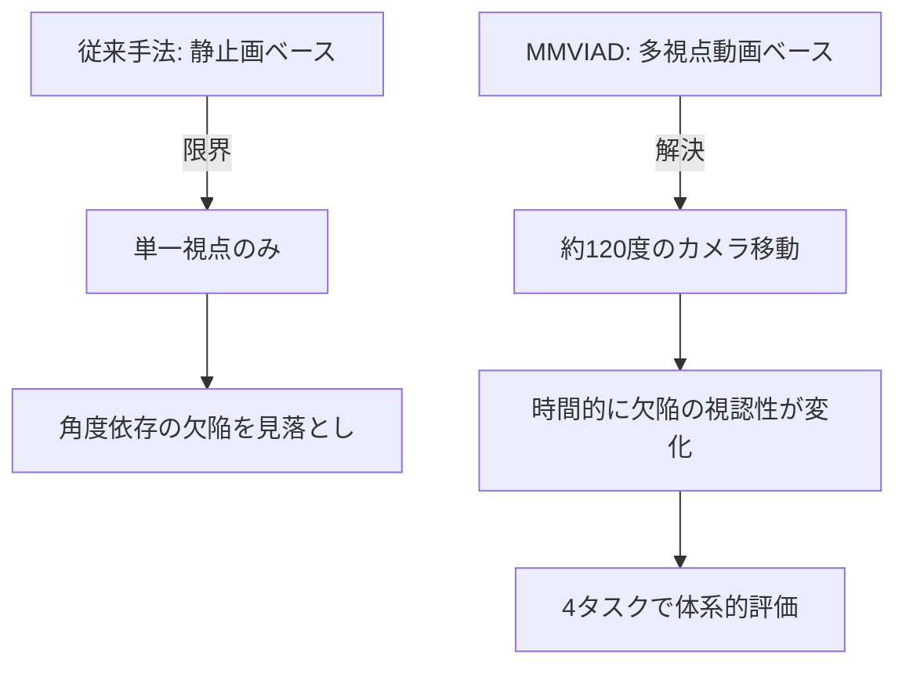

本記事は [https://arxiv.org/abs/2605.10833](https://arxiv.org/abs/2605.10833) の解説記事です。

## 論文概要（Abstract）

産業異常検知（Industrial Anomaly Detection）は製造業における品質管理の中核技術であるが、既存データセットは静止画ベースが主流であり、実際の検品現場で行われる「対象物を回転させて多角度から確認する」という検査プロセスを再現できていなかった。著者らは、連続多視点動画による産業異常検知のための初のベンチマーク「MMVIAD（Multi-view Multi-task Video Understanding for Industrial Anomaly Detection）」を構築し、4,014のオブジェクト中心動画クリップ・48オブジェクトカテゴリ・6異常タイプを含むデータセットと4つの評価タスクを提案している。さらに、PS-SFT（Perception-Structured SFT）とVISTA-GRPO（Visibility-aware Industrial Spatio-Temporal Anomaly detection via GRPO）による訓練手法を提案し、未見カテゴリで12.5ポイントの改善を達成したと報告されている。

この記事は [Zenn記事: Gemini 3.7 Flashで設備点検動画・音声から異常検知レポートを自動生成する](https://zenn.dev/0h_n0/articles/1ca988c9024a38) の深掘りです。

## 情報源

- **arXiv ID**: 2605.10833
- **URL**: [https://arxiv.org/abs/2605.10833](https://arxiv.org/abs/2605.10833)
- **著者**: Xiran Zhao, Jing Jin, Yan Bai, et al.
- **発表年**: 2026
- **分野**: cs.CV, cs.AI

## 背景と動機（Background & Motivation）

産業異常検知は製造現場における品質保証に不可欠な技術である。従来のアプローチはMVTecやVisAなどの静止画データセットに基づいており、テクスチャや構造的な欠陥の検出に焦点を当てていた。しかし実際の検品工程では、作業者が製品を手に取り回転させながら多角度から目視確認を行う。静止画ベースの手法では、特定の角度からしか視認できない欠陥（裏面のクラックや側面のスクラッチ等）を見落とす可能性がある。

近年のマルチモーダル大規模言語モデル（MLLM）は動画理解能力を獲得しつつあるが、産業異常検知に特化した動画ベンチマークが存在しないため、その適用可能性は未検証であった。加えて、単に「異常か正常か」の二値分類だけでなく、「どの種類の欠陥か」「いつ異常が視認可能になるか」といった細粒度の理解が産業応用では求められる。著者らはこれらの課題に対し、連続多視点動画という形式で産業異常検知を再定義し、MLLMの性能を体系的に評価するためのベンチマークを構築している。



## 主要な貢献（Key Contributions）

- **貢献1: MMVIADデータセット** — 産業異常検知のための初の連続多視点動画データセット。4,014クリップ（訓練2,913、テスト1,101）、48オブジェクトカテゴリ、6構造的異常タイプ、14レンダリング環境、16,092 QAペアを含む
- **貢献2: 4タスク評価フレームワーク** — 異常検出（二値）、欠陥分類、オブジェクト分類、異常可視時間位置特定の4タスクを定義し、MLLMの産業異常検知能力を多角的に評価する枠組みを構築
- **貢献3: 可視時間アノテーション手法** — 赤色ハイライト付き/なしのペア動画を同一条件で生成し、異常が視認可能となるタイミングを正確にアノテーションする手法を提案
- **貢献4: PS-SFT + VISTA-GRPO** — 知覚構造化SFTとグループ相対ポリシー最適化を組み合わせた訓練パイプラインにより、未見カテゴリで12.5ポイントの改善を達成

## 技術的詳細（Technical Details）

### データセット構築

MMVIADデータセットは3Dレンダリングベースで構築されている。各動画クリップは2秒間で、カメラがオブジェクトの周囲を約120度移動する。この設計により、欠陥の視認性が時間とともに変化する現実的な検品シナリオを再現している。

**オブジェクトカテゴリ構造**:

| セマンティックグループ | カテゴリ例 | 異常タイプ |
|----------------------|-----------|-----------|
| ボトル類 | glass_bottle, plastic_bottle | crack, scratch, hole |
| ボウル類 | ceramic_bowl, metal_bowl | concavity, bulge, broken |
| ヘルメット類 | safety_helmet, bike_helmet | crack, scratch |
| 花瓶類 | ceramic_vase, glass_vase | crack, broken, hole |

6つの構造的異常タイプ（crack: ひび割れ、scratch: 傷、concavity: 凹み、bulge: 膨らみ、broken: 破損、hole: 穴）は、製造現場で実際に発生する欠陥を網羅するよう設計されている。14のレンダリング環境（プラスチック、布、粘土、木、革、金属等）により、素材による外観変動を考慮した評価が可能である。

### 4タスク評価フレームワーク

著者らは以下の4タスクを定義している:

**Q1: 異常検出（Anomaly Detection）** — 動画内のオブジェクトに異常があるかの二値分類。

$$
\hat{y}_{\text{Q1}} = f_{\text{detect}}(\mathbf{V}) \in \{\text{normal}, \text{anomaly}\}
$$

**Q2: 欠陥分類（Defect Classification）** — Q1で異常と判定された場合の欠陥タイプ分類。Q1の回答に条件付きで評価される。

$$
\hat{y}_{\text{Q2}} = f_{\text{classify}}(\mathbf{V}) \in \{\text{crack}, \text{scratch}, \text{concavity}, \text{bulge}, \text{broken}, \text{hole}\}
$$

**Q3: オブジェクト分類（Object Classification）** — 動画内のオブジェクトが48カテゴリのいずれに属するかの予測。

$$
\hat{y}_{\text{Q3}} = f_{\text{object}}(\mathbf{V}) \in \{c_1, c_2, \ldots, c_{48}\}
$$

**Q4: 異常可視時間位置特定（Anomaly Visibility Temporal Localization）** — 異常が視認可能となる時間区間 $[t_{\text{start}}, t_{\text{end}}]$ を秒単位で予測する。

$$
\hat{y}_{\text{Q4}} = f_{\text{temporal}}(\mathbf{V}) = [t_{\text{start}}, t_{\text{end}}] \subset [0, 2]
$$

ここで $\mathbf{V}$ は入力動画、$f$ は各タスクの予測関数を表す。Q4の評価にはIoU（Intersection over Union）が使用される。

### 可視時間アノテーション手法

従来の時間的アノテーションはフレームごとの手動ラベリングに依存していたが、微小な欠陥の視認開始タイミングを正確に判定することは困難である。著者らは以下の手法を提案している:

1. 正常オブジェクトと異常オブジェクトを同一レンダリング条件（カメラ位置、照明、素材）で動画生成
2. 異常箇所に赤色ハイライトを付与したバージョンを追加生成
3. ハイライトなし動画とハイライト付き動画を比較し、赤色ハイライトが視認可能なフレーム区間を自動検出
4. 検出された区間を秒単位のアノテーション $[t_{\text{start}}, t_{\text{end}}]$ に変換

この手法により、人間のアノテーターの主観に依存しない客観的な可視性アノテーションが実現されている。

### PS-SFT（Perception-Structured SFT）

PS-SFTは教師あり微調整（SFT）の改良版であり、推論プロセスを4つの構造化タグに分解する:

```
<global_perception>
動画全体の概要: オブジェクトの形状、素材、回転方向を記述
</global_perception>
<segment_perception>
時間セグメントごとの観察: 各0.5秒区間で何が見えるかを記述
</segment_perception>
<think>
推論: 観察から異常の有無、種類、時間位置を推論
</think>
<answer>
最終回答: タスクに応じた回答を出力
</answer>
```

従来のSFTが「入力 → 回答」の直接マッピングを学習するのに対し、PS-SFTは知覚（perception）と推論（reasoning）を明示的に分離することで、モデルが段階的に判断を構築することを促す。教師生成の推論トレースは、GPT-5.4を用いてグラウンドトゥルースアノテーションから生成される。

### VISTA-GRPO

VISTA（Visibility-aware Industrial Spatio-Temporal Anomaly detection）は、PS-SFTで初期化されたモデルに対してGRPO（Group Relative Policy Optimization）を適用する強化学習ベースの訓練手法である。GRPOはDPO（Direct Preference Optimization）の拡張で、グループ内の相対的な報酬を使用してポリシーを最適化する。

VISTAの報酬関数は4つの成分から構成される:

$$
R_{\text{total}} = R_{\text{format}} + R_{\text{answer}} + R_{\text{defect}} + R_{\text{temporal}}
$$

ここで、
- $R_{\text{format}}$: 出力が所定のタグ構造に従っているかの報酬
- $R_{\text{answer}}$: 各タスクの回答正確性に対する報酬
- $R_{\text{defect}}$: セマンティックゲート欠陥報酬
- $R_{\text{temporal}}$: 可視性認識時間報酬

**セマンティックゲート欠陥報酬 $R_{\text{defect}}$** は、Q1（異常検出）の回答が正しい場合にのみQ2（欠陥分類）の報酬を付与するゲーティング機構である:

$$
R_{\text{defect}} = \mathbb{1}[\hat{y}_{\text{Q1}} = y_{\text{Q1}}] \cdot \mathbb{1}[\hat{y}_{\text{Q2}} = y_{\text{Q2}}] \cdot r_{\text{defect}}
$$

ここで $\mathbb{1}[\cdot]$ は指示関数、$r_{\text{defect}}$ は欠陥正解時の報酬値である。Q1が不正解の場合、Q2の報酬はゼロとなる。これにより、モデルはまず異常検出を正確に行い、その上で欠陥分類を学習するカリキュラム的な効果を得る。

**可視性認識時間報酬 $R_{\text{temporal}}$** は、Q4の時間区間予測に対する報酬であり、IoUベースのdiscovery bonusとinterval-count penaltyから構成される:

$$
R_{\text{temporal}} = \text{IoU}(\hat{I}, I^*) \cdot r_{\text{discovery}} - \lambda_{\text{count}} \cdot |\text{num\_intervals}(\hat{I}) - \text{num\_intervals}(I^*)|
$$

ここで、
- $\hat{I}$: 予測された時間区間の集合
- $I^*$: グラウンドトゥルースの時間区間
- $\text{IoU}(\hat{I}, I^*)$: 時間軸上のIntersection over Union
- $r_{\text{discovery}}$: IoUが閾値を超えた場合のボーナス報酬
- $\lambda_{\text{count}}$: 区間数の不一致に対するペナルティ係数

### アルゴリズム: VISTA-GRPO訓練ループ

```python
from dataclasses import dataclass
from typing import Literal


@dataclass
class RewardComponents:
    """VISTA-GRPOの報酬成分を管理するデータクラス

    Attributes:
        format_reward: 出力フォーマット準拠報酬
        answer_reward: 回答正確性報酬
        defect_reward: セマンティックゲート欠陥報酬
        temporal_reward: 可視性認識時間報酬
    """
    format_reward: float
    answer_reward: float
    defect_reward: float
    temporal_reward: float

    @property
    def total(self) -> float:
        """総報酬を計算する"""
        return (self.format_reward + self.answer_reward
                + self.defect_reward + self.temporal_reward)


def compute_temporal_reward(
    predicted_intervals: list[tuple[float, float]],
    gt_intervals: list[tuple[float, float]],
    discovery_bonus: float = 1.0,
    count_penalty_weight: float = 0.5,
    iou_threshold: float = 0.3,
) -> float:
    """可視性認識時間報酬を計算する

    Args:
        predicted_intervals: 予測された時間区間のリスト [(start, end), ...]
        gt_intervals: グラウンドトゥルースの時間区間
        discovery_bonus: IoU閾値超過時のボーナス値
        count_penalty_weight: 区間数不一致のペナルティ係数
        iou_threshold: discovery bonus付与のIoU閾値

    Returns:
        時間報酬スカラー値
    """
    iou = compute_temporal_iou(predicted_intervals, gt_intervals)
    bonus = discovery_bonus if iou >= iou_threshold else 0.0
    count_diff = abs(len(predicted_intervals) - len(gt_intervals))
    penalty = count_penalty_weight * count_diff
    return iou * bonus - penalty


def compute_temporal_iou(
    pred: list[tuple[float, float]],
    gt: list[tuple[float, float]],
) -> float:
    """時間軸上のIoUを計算する

    Args:
        pred: 予測区間のリスト
        gt: グラウンドトゥルース区間のリスト

    Returns:
        IoU値 (0.0 - 1.0)
    """
    pred_set = _intervals_to_set(pred, resolution=0.01)
    gt_set = _intervals_to_set(gt, resolution=0.01)
    intersection = len(pred_set & gt_set)
    union = len(pred_set | gt_set)
    return intersection / union if union > 0 else 0.0


def _intervals_to_set(
    intervals: list[tuple[float, float]],
    resolution: float = 0.01,
) -> set[int]:
    """時間区間を離散化した整数集合に変換する

    Args:
        intervals: 時間区間のリスト
        resolution: 離散化の解像度（秒）

    Returns:
        離散化されたタイムステップの集合
    """
    result: set[int] = set()
    for start, end in intervals:
        s = int(start / resolution)
        e = int(end / resolution)
        result.update(range(s, e + 1))
    return result


TaskType = Literal["Q1", "Q2", "Q3", "Q4"]


def compute_defect_reward(
    q1_pred: str,
    q1_gt: str,
    q2_pred: str,
    q2_gt: str,
    reward_value: float = 1.0,
) -> float:
    """セマンティックゲート欠陥報酬を計算する

    Q1（異常検出）が正解の場合にのみQ2（欠陥分類）の報酬を付与する。

    Args:
        q1_pred: Q1の予測値
        q1_gt: Q1のグラウンドトゥルース
        q2_pred: Q2の予測値
        q2_gt: Q2のグラウンドトゥルース
        reward_value: 正解時の報酬値

    Returns:
        欠陥報酬スカラー値
    """
    if q1_pred != q1_gt:
        return 0.0
    return reward_value if q2_pred == q2_gt else 0.0
```

## 実装のポイント（Implementation）

VISTAの実装にあたって、以下の点が重要となる。

**動画のフレームサンプリング**: 2秒間の動画から均等にフレームを抽出する。論文ではベースモデルの入力上限に応じて8-32フレームを使用しており、フレーム間隔が異常の視認性に影響する。特にQ4（時間位置特定）では、サンプリング間隔が細かいほどIoUが向上する傾向があるが、計算コストとのトレードオフが存在する。

**構造化タグのパース**: PS-SFTの出力は4つのXMLライクなタグで構造化されるため、パーサーのロバスト性が重要である。モデルがタグを閉じ忘れるケースや、タグの順序が入れ替わるケースに対応するフォールバック処理が必要となる。

**GRPO訓練の安定性**: 4つの報酬成分のスケーリングバランスが訓練の安定性に直結する。著者らの実装では、各報酬成分を [0, 1] に正規化した上でグループ内の相対値を計算している。GRPOのグループサイズ（同一プロンプトに対する生成サンプル数）は8に設定されており、これより小さいと報酬の相対比較が不安定になると報告されている。

**未見カテゴリへの汎化**: MMVIAD-Unseenベンチマークでは12の未見カテゴリが使用される。VISTAのPS-SFTにおける `<global_perception>` タグが、オブジェクトの形状や素材に関する一般的な記述を学習することで、未見カテゴリへの汎化を助けていると著者らは分析している。

## Production Deployment Guide

VISTAは動画MLLMベースの推論パイプラインを持つため、GPU推論が必須の計算集約型ワークロードとなる。以下ではAWS上での産業異常検知システムのデプロイパターンを示す。

### AWS実装パターン（コスト最適化重視）

テーマは「動画MLLMベースの産業異常検知システムのAWSデプロイ」として、トラフィック量別の推奨構成を整理する。

| 構成 | トラフィック | サービス構成 | GPU | 月額概算 |
|------|------------|------------|-----|---------|
| Small | ~100動画/日 | SageMaker Serverless + Lambda | ml.g5.xlarge (オンデマンド) | $800-1,500 |
| Medium | ~1,000動画/日 | ECS Fargate + SageMaker Endpoint | ml.g5.2xlarge (1台常時) | $2,500-4,000 |
| Large | 10,000+動画/日 | EKS + Karpenter + Spot GPU | g5.2xlarge x 3-8台 (Spot) | $5,000-12,000 |

**Small構成（~100動画/日）**: SageMaker Serverless Inferenceで動画MLLMをホストし、Lambda関数が動画前処理（フレーム抽出、リサイズ）を担当する。推論リクエストがない時間帯はインスタンスがゼロにスケールダウンするため、間欠的な検品業務に適する。S3に動画をアップロードし、EventBridgeでLambdaをトリガーする構成が基本となる。

**Medium構成（~1,000動画/日）**: SageMaker Real-time Endpointで常時1台のGPUインスタンスを稼働させ、ECS FargateタスクがAPIゲートウェイとバッチキューイングを担当する。SQSで動画処理リクエストをバッファリングし、GPU利用率を最大化する。

**Large構成（10,000+動画/日）**: EKSクラスタ上でKarpenterによるGPU Spotインスタンスの自動スケーリングを行う。NVIDIA Triton Inference Serverで動画MLLMをサービングし、動的バッチングでスループットを最大化する。Spot Instancesの活用により、オンデマンド比で最大70-90%のコスト削減が可能である。

**コスト削減テクニック**:
- Spot GPU Instances（g5/p4d）活用でオンデマンド比最大70-90%削減
- SageMaker Savings Plans（1年コミット）で最大64%削減
- 推論バッチング（複数動画をまとめて処理）でGPU利用率向上
- 動画の前処理（解像度削減、フレーム間引き）で推論コスト削減

コスト試算は2026年9月時点のAWS ap-northeast-1（東京）リージョン料金に基づく概算値であり、実際のコストはトラフィックパターンやSpot価格変動により変動する。最新料金はAWS料金計算ツールで確認を推奨する。

### Terraformインフラコード

**Small構成（SageMaker + Lambda）**:

```hcl
# Small構成: SageMaker Serverless + Lambda
# 動画MLLMベース産業異常検知パイプライン

terraform {
  required_version = ">= 1.9"
  required_providers {
    aws = {
      source  = "hashicorp/aws"
      version = "~> 5.70"
    }
  }
}

provider "aws" {
  region = "ap-northeast-1"
}

# --- S3: 動画アップロード・結果保存 ---
resource "aws_s3_bucket" "video_inspection" {
  bucket = "mmviad-inspection-${var.environment}"
}

resource "aws_s3_bucket_server_side_encryption_configuration" "video_enc" {
  bucket = aws_s3_bucket.video_inspection.id
  rule {
    apply_server_side_encryption_by_default {
      sse_algorithm = "aws:kms"
    }
  }
}

resource "aws_s3_bucket_lifecycle_configuration" "video_lifecycle" {
  bucket = aws_s3_bucket.video_inspection.id
  rule {
    id     = "archive-old-videos"
    status = "Enabled"
    transition {
      days          = 30
      storage_class = "GLACIER"
    }
  }
}

# --- IAM: Lambda実行ロール（最小権限） ---
resource "aws_iam_role" "lambda_exec" {
  name = "mmviad-lambda-exec-${var.environment}"
  assume_role_policy = jsonencode({
    Version = "2012-10-17"
    Statement = [{
      Action = "sts:AssumeRole"
      Effect = "Allow"
      Principal = { Service = "lambda.amazonaws.com" }
    }]
  })
}

resource "aws_iam_role_policy" "lambda_sagemaker" {
  name = "sagemaker-invoke"
  role = aws_iam_role.lambda_exec.id
  policy = jsonencode({
    Version = "2012-10-17"
    Statement = [
      {
        Effect   = "Allow"
        Action   = ["sagemaker:InvokeEndpoint"]
        Resource = aws_sagemaker_endpoint.vista.arn
      },
      {
        Effect   = "Allow"
        Action   = ["s3:GetObject", "s3:PutObject"]
        Resource = "${aws_s3_bucket.video_inspection.arn}/*"
      },
      {
        Effect   = "Allow"
        Action   = ["logs:CreateLogGroup", "logs:CreateLogStream", "logs:PutLogEvents"]
        Resource = "arn:aws:logs:*:*:*"
      }
    ]
  })
}

# --- SageMaker Endpoint ---
resource "aws_sagemaker_endpoint" "vista" {
  name                 = "mmviad-vista-${var.environment}"
  endpoint_config_name = aws_sagemaker_endpoint_configuration.vista.name
}

resource "aws_sagemaker_endpoint_configuration" "vista" {
  name = "mmviad-vista-config-${var.environment}"
  production_variants {
    variant_name           = "primary"
    model_name             = aws_sagemaker_model.vista.name
    instance_type          = "ml.g5.xlarge"  # 24GB GPU, コスト効率重視
    initial_instance_count = 1
  }
}

resource "aws_sagemaker_model" "vista" {
  name               = "mmviad-vista-model-${var.environment}"
  execution_role_arn = aws_iam_role.sagemaker_exec.arn
  primary_container {
    image          = var.vista_container_image
    model_data_url = var.vista_model_s3_uri
  }
}

# --- CloudWatch アラーム: コスト監視 ---
resource "aws_cloudwatch_metric_alarm" "sagemaker_invocations" {
  alarm_name          = "mmviad-high-invocations"
  comparison_operator = "GreaterThanThreshold"
  evaluation_periods  = 2
  metric_name         = "Invocations"
  namespace           = "AWS/SageMaker"
  period              = 3600
  statistic           = "Sum"
  threshold           = 500  # 1時間500リクエスト超過で警告
  alarm_actions       = [var.sns_topic_arn]
}

variable "environment" {
  type    = string
  default = "dev"
}

variable "vista_container_image" {
  type        = string
  description = "VISTAモデルのDockerイメージURI"
}

variable "vista_model_s3_uri" {
  type        = string
  description = "VISTAモデルの重みファイルS3 URI"
}

variable "sns_topic_arn" {
  type        = string
  description = "アラーム通知先SNSトピックARN"
}
```

**Large構成（EKS + Karpenter + Spot GPU）**:

```hcl
# Large構成: EKS + Karpenter + Spot GPU Instances
# 高スループット産業異常検知システム

module "eks" {
  source  = "terraform-aws-modules/eks/aws"
  version = "~> 20.24"

  cluster_name    = "mmviad-cluster-${var.environment}"
  cluster_version = "1.31"

  vpc_id     = var.vpc_id
  subnet_ids = var.private_subnet_ids

  # コントロールプレーンのみ管理、ノードはKarpenterで管理
  cluster_endpoint_public_access = false
  enable_irsa                    = true
}

# --- Karpenter: Spot GPU自動スケーリング ---
resource "kubectl_manifest" "karpenter_nodepool_gpu" {
  yaml_body = yamlencode({
    apiVersion = "karpenter.sh/v1"
    kind       = "NodePool"
    metadata   = { name = "gpu-spot" }
    spec = {
      template = {
        spec = {
          requirements = [
            { key = "karpenter.sh/capacity-type", operator = "In", values = ["spot", "on-demand"] },
            { key = "node.kubernetes.io/instance-type", operator = "In",
              values = ["g5.xlarge", "g5.2xlarge", "g5.4xlarge"] },
            { key = "kubernetes.io/arch", operator = "In", values = ["amd64"] },
          ]
          nodeClassRef = { name = "default" }
        }
      }
      limits   = { "nvidia.com/gpu" = 16 }  # 最大GPU数制限
      disruption = {
        consolidationPolicy = "WhenEmpty"
        consolidateAfter    = "60s"
      }
      weight = 100  # Spot優先
    }
  })
}

# --- Secrets Manager: モデル設定 ---
resource "aws_secretsmanager_secret" "model_config" {
  name        = "mmviad/model-config-${var.environment}"
  description = "VISTAモデル推論パラメータ"
}

# --- AWS Budgets: 予算アラート ---
resource "aws_budgets_budget" "monthly" {
  name         = "mmviad-monthly-budget"
  budget_type  = "COST"
  limit_amount = "15000"
  limit_unit   = "USD"
  time_unit    = "MONTHLY"

  notification {
    comparison_operator       = "GREATER_THAN"
    threshold                 = 80
    threshold_type            = "PERCENTAGE"
    notification_type         = "FORECASTED"
    subscriber_email_addresses = [var.alert_email]
  }
}
```

### 運用・監視設定

**CloudWatch Logs Insights クエリ**:

```
# 推論レイテンシ分析（P95, P99）
fields @timestamp, @message
| filter @message like /inference_duration_ms/
| stats percentile(inference_duration_ms, 95) as p95,
        percentile(inference_duration_ms, 99) as p99,
        avg(inference_duration_ms) as avg_latency
  by bin(1h)

# 異常検知精度モニタリング
fields @timestamp, task_type, prediction, ground_truth
| filter task_type = "Q1"
| stats sum(case(prediction = ground_truth, 1, 0)) / count(*) as accuracy
  by bin(1d)
```

**CloudWatch アラーム設定（Python）**:

```python
import boto3


def create_inference_alarms(
    endpoint_name: str,
    sns_topic_arn: str,
    region: str = "ap-northeast-1",
) -> list[str]:
    """SageMakerエンドポイントの推論監視アラームを作成する

    Args:
        endpoint_name: SageMakerエンドポイント名
        sns_topic_arn: 通知先SNSトピックARN
        region: AWSリージョン

    Returns:
        作成されたアラームARNのリスト
    """
    cw = boto3.client("cloudwatch", region_name=region)
    alarm_arns: list[str] = []

    # GPU利用率低下アラーム（リソース無駄遣い検知）
    response = cw.put_metric_alarm(
        AlarmName=f"{endpoint_name}-low-gpu-utilization",
        MetricName="GPUUtilization",
        Namespace="AWS/SageMaker",
        Statistic="Average",
        Period=3600,
        EvaluationPeriods=3,
        Threshold=10.0,
        ComparisonOperator="LessThanThreshold",
        AlarmActions=[sns_topic_arn],
        Dimensions=[
            {"Name": "EndpointName", "Value": endpoint_name},
            {"Name": "VariantName", "Value": "primary"},
        ],
    )
    alarm_arns.append(response.get("ResponseMetadata", {}).get("RequestId", ""))

    # 推論エラー率アラーム
    cw.put_metric_alarm(
        AlarmName=f"{endpoint_name}-high-error-rate",
        MetricName="ModelError",
        Namespace="AWS/SageMaker",
        Statistic="Sum",
        Period=300,
        EvaluationPeriods=2,
        Threshold=10,
        ComparisonOperator="GreaterThanThreshold",
        AlarmActions=[sns_topic_arn],
        Dimensions=[
            {"Name": "EndpointName", "Value": endpoint_name},
            {"Name": "VariantName", "Value": "primary"},
        ],
    )

    return alarm_arns
```

**X-Ray トレーシング設定**:

```python
from aws_xray_sdk.core import xray_recorder, patch_all


def setup_xray_tracing(service_name: str = "mmviad-inference") -> None:
    """X-Rayトレーシングを初期化する

    Args:
        service_name: X-Rayサービス名
    """
    xray_recorder.configure(service=service_name)
    patch_all()  # boto3, requests等を自動計装


@xray_recorder.capture("video_inference")
def run_inference(
    video_s3_uri: str,
    task_type: str,
    endpoint_name: str,
) -> dict[str, str | float]:
    """動画推論を実行しX-Rayにトレースを記録する

    Args:
        video_s3_uri: 入力動画のS3 URI
        task_type: タスク種別 (Q1/Q2/Q3/Q4)
        endpoint_name: SageMakerエンドポイント名

    Returns:
        推論結果の辞書
    """
    subsegment = xray_recorder.current_subsegment()
    if subsegment:
        subsegment.put_annotation("task_type", task_type)
        subsegment.put_metadata("video_uri", video_s3_uri)
    # 推論実行ロジック（省略）
    return {"prediction": "anomaly", "confidence": 0.92}
```

**Cost Explorer日次レポート**:

```python
import boto3
from datetime import date, timedelta


def get_daily_cost_report(
    threshold_usd: float = 100.0,
    sns_topic_arn: str | None = None,
) -> dict[str, float]:
    """日次コストレポートを取得し、閾値超過時にSNS通知する

    Args:
        threshold_usd: 日次コスト閾値（USD）
        sns_topic_arn: 通知先SNSトピックARN

    Returns:
        サービス別コストの辞書
    """
    ce = boto3.client("ce", region_name="us-east-1")
    today = date.today()
    yesterday = today - timedelta(days=1)

    response = ce.get_cost_and_usage(
        TimePeriod={"Start": str(yesterday), "End": str(today)},
        Granularity="DAILY",
        Metrics=["UnblendedCost"],
        GroupBy=[{"Type": "DIMENSION", "Key": "SERVICE"}],
    )

    costs: dict[str, float] = {}
    for group in response["ResultsByTime"][0]["Groups"]:
        service = group["Keys"][0]
        amount = float(group["Metrics"]["UnblendedCost"]["Amount"])
        if amount > 0:
            costs[service] = amount

    total = sum(costs.values())
    if total > threshold_usd and sns_topic_arn:
        sns = boto3.client("sns")
        sns.publish(
            TopicArn=sns_topic_arn,
            Subject=f"MMVIAD日次コスト警告: ${total:.2f}",
            Message=f"日次コストが${threshold_usd}を超過: ${total:.2f}\n"
                    + "\n".join(f"  {k}: ${v:.2f}" for k, v in sorted(costs.items(), key=lambda x: -x[1])[:10]),
        )

    return costs
```

### コスト最適化チェックリスト

**アーキテクチャ選択**:
- [ ] トラフィック量に応じた構成を選択（~100動画/日: SageMaker Serverless、~1000: ECS+SageMaker、10000+: EKS+Spot）
- [ ] GPU不要な前処理（フレーム抽出、リサイズ）はCPUインスタンスまたはLambdaで実行
- [ ] 推論バッチングの有効化（複数動画を1回のGPU推論でまとめて処理）

**リソース最適化**:
- [ ] GPU Spot Instances（g5ファミリー）を優先使用（最大70-90%削減）
- [ ] SageMaker Savings Plans（1年コミット、最大64%削減）の購入検討
- [ ] 非稼働時間帯（夜間・休日）のエンドポイント停止またはスケールダウン
- [ ] SageMaker Serverless Inference（間欠利用時）でアイドルコストゼロ化
- [ ] GPUメモリに応じたインスタンスタイプ選択（ml.g5.xlarge: 24GB vs ml.g5.2xlarge: 24GB+vCPU増）

**推論コスト削減**:
- [ ] 動画解像度の最適化（必要以上の高解像度を避ける）
- [ ] フレームサンプリング間隔の調整（Q1/Q2は8フレーム、Q4は32フレーム等タスク別最適化）
- [ ] モデル量子化（INT8/FP16）によるGPUメモリ削減とスループット向上
- [ ] TensorRT/vLLMによる推論最適化

**監視・アラート**:
- [ ] AWS Budgets設定（月額上限の80%で予測アラート）
- [ ] CloudWatchアラーム（GPU利用率、推論エラー率、レイテンシ）
- [ ] Cost Anomaly Detection有効化
- [ ] 日次コストレポート自動送信（$100/日超過でSNS通知）

**リソース管理**:
- [ ] 未使用SageMakerエンドポイントの定期削除
- [ ] S3動画の30日後Glacier移行ライフサイクルポリシー
- [ ] タグ戦略（Project: mmviad, Environment: dev/prod）の統一
- [ ] 開発環境の夜間自動停止（EventBridge Scheduler）
- [ ] ECRイメージの世代管理（最新5世代のみ保持）

## 実験結果（Results）

著者らは16の動画MLLMを評価しており、主要な結果を以下にまとめる。

### MMVIAD-Standard（全48カテゴリ）

| モデル | 総合スコア | Q1（検出） | Q2（分類） | Q3（オブジェクト） | Q4（時間位置） |
|--------|-----------|-----------|-----------|-----------------|--------------|
| 人間の専門家 | 86.3 | - | - | - | - |
| GPT-5.4 | 56.4 | - | - | - | - |
| Gemini 3.1 Pro | 61.8 | - | - | - | - |
| VISTA (PS-SFT+GRPO) | 57.5 (Unseen) | - | - | - | - |

### MMVIAD-Unseen（12の未見カテゴリ）

未見カテゴリにおけるVISTAの効果を示す（論文Table記載の値）:

| 手法 | 総合スコア | ベースラインからの改善 |
|------|-----------|---------------------|
| ベースライン（SFTなし） | 45.0 | - |
| PS-SFTのみ | 51.2 | +6.2 |
| VISTA (PS-SFT+GRPO) | 57.5 | +12.5 |
| Gemini 3.1 Pro | 63.9 | - |

著者らはVISTAが未見カテゴリでベースラインから12.5ポイント改善した点を主要な成果として報告している。一方で、Gemini 3.1 Pro（63.9）やGPT-5.4がVISTAを上回っており、大規模商用モデルとの性能差が依然として存在する。特にQ4（時間位置特定）では全モデルが人間の専門家を大幅に下回っており、時間的グラウンディングが現在の動画MLLMにおける主要な課題であることが示されている。

また、Q2（欠陥分類）においてもモデル間の差異が顕著であり、bulge（膨らみ）やconcavity（凹み）といった微妙な形状変化を伴う欠陥タイプでは精度が低下する傾向がある。これは3Dの微小な凹凸変化を2D動画から認識することの困難さを示唆している。

## 実運用への応用（Practical Applications）

MMVIADおよびVISTAの研究は、Zenn記事で取り上げられているGeminiベースの設備点検動画異常検知と直接的に関連する。Zenn記事ではGemini 3.7 Flashを使用した動画からの異常検知レポート自動生成が紹介されているが、MMVIADのベンチマーク結果は、こうした商用MLLMの産業異常検知における現在の到達点と限界を定量的に示している。

**プロダクション視点での考慮事項**:

- **スケーリング**: 製造ラインでは1分間に数十個の製品が流れるため、リアルタイム処理には複数GPUでの推論並列化が必須となる。VISTAの2秒動画入力は、実際のライン速度に合わせた動画クリップ切り出しと連携させる必要がある
- **レイテンシ**: 動画MLLMの推論は画像MLLMと比較して数倍のレイテンシが発生する。検品ラインの要件（例: 1製品あたり3秒以内の判定）に収まるかの検証が重要となる
- **コスト効率**: 全製品を動画MLLMで検査すると計算コストが膨大になるため、一次スクリーニング（従来のCNNベース異常検知）で疑わしい製品のみを動画MLLMに回す二段階パイプラインが現実的である
- **運用課題**: 製品カテゴリの追加時にMMVIAD-Unseenの結果（未見カテゴリでの12.5ポイント改善）が示す汎化性能が実用上十分かの検証が求められる

## 関連研究（Related Work）

- **MVTec-AD** (Bergmann et al., 2019): 産業異常検知の代表的な静止画データセット。15カテゴリ・5,354画像で構成され、画素レベルの異常セグメンテーションを評価する。MMVIADは静止画から動画へ、単一視点から多視点へとベンチマークを拡張している
- **VisA** (Zou et al., 2022): 12カテゴリ・10,821画像の大規模異常検知データセット。複雑な構造を持つ製品（PCB、カプセル等）を含む。MMVIADはVisAの静止画カテゴリを含みつつ、時間次元を追加している
- **VideoChat / Video-LLaVA**: 汎用的な動画理解MLLM。一般的な動画QAでは優れた性能を示すが、産業異常検知の細粒度タスク（微小欠陥の検出、時間位置特定）では性能が大幅に低下することがMMVIADの評価で示されている
- **GRPO** (Shao et al., 2024): PPOの簡略版としてグループ内の相対報酬を使用するポリシー最適化手法。VISTAはGRPOを動画異常検知ドメインに適用し、タスク固有の報酬設計（セマンティックゲート、時間報酬）を導入した点が新規性である

## まとめと今後の展望

MMVIADは産業異常検知に対して「連続多視点動画」という新たなベンチマーク基盤を提供した。4,014クリップ・48カテゴリ・4タスクという規模のデータセットにより、現在の動画MLLMが人間の専門家（86.3）を大幅に下回る（GPT-5.4: 56.4、Gemini 3.1 Pro: 61.8）ことが定量的に示されている。VISTAのPS-SFT + GRPOアプローチは未見カテゴリで12.5ポイントの改善を達成しており、ドメイン特化の訓練手法の有効性を示している。

実務への示唆として、動画MLLMを産業異常検知に適用する際には、特にQ4（時間位置特定）の精度不足を考慮し、従来手法との二段階パイプラインが現実的な選択肢となる。今後の研究方向として、著者らは実機映像（ロボットアームやベルトコンベア上の検品映像）への拡張と、より大規模な動画MLLMの評価を挙げている。

## 参考文献

- **arXiv**: [https://arxiv.org/abs/2605.10833](https://arxiv.org/abs/2605.10833)
- **Related Zenn article**: [https://zenn.dev/0h_n0/articles/1ca988c9024a38](https://zenn.dev/0h_n0/articles/1ca988c9024a38)
