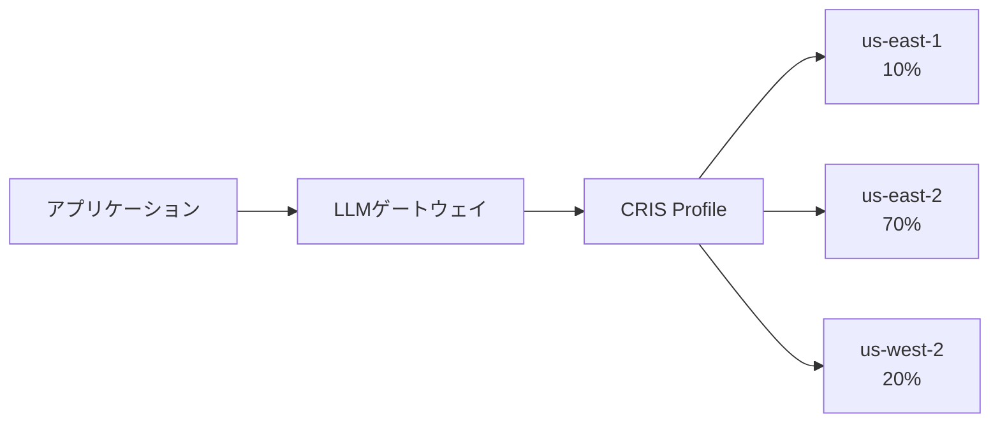
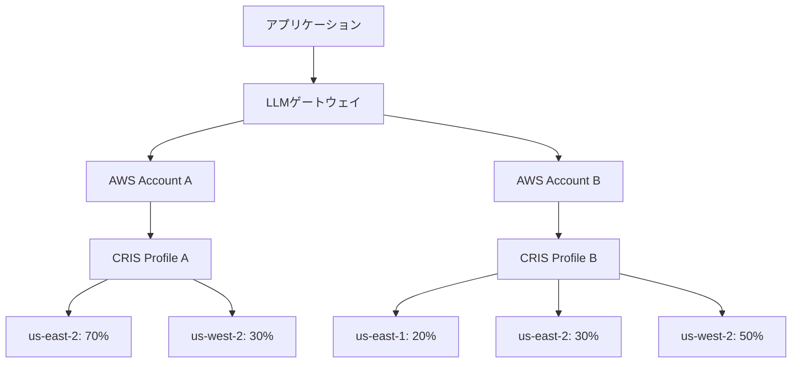
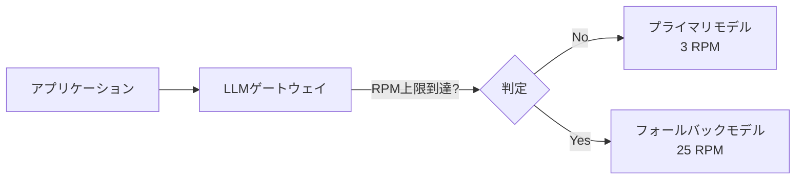

## ブログ概要（Summary）

本記事は [https://aws.amazon.com/blogs/machine-learning/implementing-resilience-patterns-with-amazon-bedrock-and-llm-gateway/](https://aws.amazon.com/blogs/machine-learning/implementing-resilience-patterns-with-amazon-bedrock-and-llm-gateway/) の解説記事です。

AWSが2026年6月に公開したこのブログでは、本番環境の生成AIシステムにおけるレジリエンスを**可用性（Availability）**、**応答時間（Response Time）**、**コスト（Cost）**、**スループット（Throughput）**の4軸で捉え、LLMゲートウェイを活用した5つのレジリエンスパターンを体系的に提示している。各パターンはLiteLLM（OSSゲートウェイ）を用いたデモで検証され、具体的な数値とともに効果が示されている。

Zenn記事ではAzure API Management（APIM）を使ったマルチテナント負荷分散を扱ったが、本ブログはAWS Bedrockネイティブ機能とLLMゲートウェイの組み合わせにより、同様の課題をAWSエコシステムで解決するアプローチを提示している。両者を比較することで、クラウドプロバイダに依存しないレジリエンス設計の原則が見えてくる。

この記事は [Zenn記事: Azure OpenAIマルチテナント負荷分散：テナント別クォータ×コスト配賦×優先度制御をAPIMで実装する](https://zenn.dev/0h_n0/articles/066a67fb511816) の深掘りです。

## 情報源

- **種別**: 企業テックブログ（AWS Machine Learning Blog）
- **URL**: [Implementing resilience patterns with Amazon Bedrock and LLM gateway](https://aws.amazon.com/blogs/machine-learning/implementing-resilience-patterns-with-amazon-bedrock-and-llm-gateway/)
- **組織**: Amazon Web Services (AWS)
- **著者**: Marcos Ortiz（Principal Solutions Architect）、Khubyar Behramsha（Sr. Enterprise Account Manager）、Sushovan Basak（Senior Technical Account Manager）
- **発表日**: 2026年6月30日

## 技術的背景（Technical Background）

### なぜLLMゲートウェイのレジリエンスが必要か

生成AIシステムが本番環境で稼働する場合、単一モデル・単一リージョンへの依存は以下のリスクを生む。

1. **レート制限（Rate Limiting）**: モデルプロバイダのRPM/TPM制限に達するとリクエストが拒否される
2. **リージョン障害**: 特定リージョンの障害で全サービスが停止する
3. **ノイジーネイバー問題**: マルチテナント環境で特定テナントが大量リクエストを発行すると他テナントに影響する
4. **コスト予測困難**: トラフィックスパイク時にコストが急増する

著者らはこれらの課題を**4つの設計軸**として整理している。

| 設計軸 | 説明 | 主要メトリクス |
|--------|------|---------------|
| 可用性 | 障害時もサービスを継続 | アップタイム、成功率 |
| 応答時間 | TTFT・TTLTの安定 | P95/P99レイテンシ |
| コスト | トークン/リクエスト単価の最適化 | $/1M tokens |
| スループット | 同時リクエスト処理能力 | RPM、TPS |

この4軸は独立ではなく相互に影響する。例えば、クロスリージョン推論はスループットを向上させるがレイテンシが増加する可能性がある。著者らはこのトレードオフを意識した上で5つのパターンを提案している。

### LLMゲートウェイの役割

著者らは、アプリケーションとLLMプロバイダの間に**LLMゲートウェイ**（インテリジェントプロキシ）を配置するアーキテクチャを採用している。ゲートウェイの主要機能は以下の通りである。

- **ルーティング・フェイルオーバー**: プライマリモデル障害時の自動切替
- **ガバナンス**: 責任あるAI利用のためのガードレール
- **監査ログ**: 全リクエスト/レスポンスの記録
- **クォータ管理**: テナント別のレート制限
- **コスト分析**: 使用量の追跡と最適化
- **オブザーバビリティ**: メトリクス収集とモニタリング

デモではOSSの**LiteLLM**を使用し、本番環境向けには**AWS Solution for Multi-Provider Generative AI Gateway**（ECS/EKS上のコンテナデプロイ、AWS WAF保護、Secrets管理、CloudWatchオブザーバビリティ）が推奨されている。

## 実装アーキテクチャ（Architecture）

### パターン1: クロスリージョン推論（CRIS）

Amazon Bedrockの**Cross-Region Inference（CRIS）**は、リクエストを複数リージョンに自動分散するネイティブ機能である。リアルタイムのキャパシティ、可用性、レイテンシ、需要に基づいて動的にルーティングされる。



著者らのデモでは、10件の同時リクエストが以下のように分散された。

| リージョン | リクエスト数 | 割合 |
|-----------|------------|------|
| us-east-2 | 7 | 70% |
| us-west-2 | 2 | 20% |
| us-east-1 | 1 | 10% |

**重要な制約**: CRISはフェイルオーバーやディザスタリカバリの仕組みではない。また、地理的制限があり、商用リージョン（US、EU等）の境界内でのみルーティングされる。Global CRISプロファイルを使用するとより広範なリージョンに分散できるが、レイテンシが増加する。

**Zenn記事との比較**: Azure APIMではBackendプールとLoad Balancing Policyで同様のリージョン分散を実現する。APIMでは重み付けルーティングの設定が手動であるのに対し、CRISはBedrockネイティブで自動的にキャパシティベースのルーティングを行う点が異なる。

### パターン2: AWSアカウントシャーディング

複数のAWSアカウントにリクエストを分散し、各アカウントが独立したクォータとCRISプロファイルを持つ。AWS Well-Architectedフレームワークのフォールト分離境界（Fault Isolation Boundary）の考え方に基づく。



著者らのデモでは、2アカウントに各10リクエストを送信した結果、以下の分散が確認された。

**Account 1**:

| リージョン | リクエスト数 | 割合 |
|-----------|------------|------|
| us-east-2 | 7 | 70% |
| us-west-2 | 3 | 30% |

**Account 2**:

| リージョン | リクエスト数 | 割合 |
|-----------|------------|------|
| us-east-1 | 2 | 20% |
| us-east-2 | 3 | 30% |
| us-west-2 | 5 | 50% |

各アカウントが独立してCRISルーティングを行うため、一方のアカウントで障害が発生しても他方には影響しない。マルチテナントSaaSアーキテクチャにおいて、テナント間の厳密なワークロード分離が必要な場合に有効である。

### パターン3: モデルフォールバック

プライマリモデルがレート制限に達した場合、自動的にフォールバックモデルにルーティングする。



著者らのデモでは、プライマリモデル（3 RPM制限）に対して10件の同時リクエストを送信した。

| メトリクス | 値 |
|-----------|-----|
| 総リクエスト数 | 10 |
| 成功 | 10 |
| 失敗 | 0 |
| プライマリモデル使用 | 3（30%） |
| フォールバック発動 | 7（70%） |

プライマリモデルが3 RPM制限に達した後、残り7リクエストが自動的にフォールバックモデルに振り分けられ、**成功率100%**を達成している。外部ツールなしでこの切替が行われる点が重要である。

著者らは関連機能として**Amazon Bedrock Intelligent Prompt Routing**にも言及している。これはゲートウェイなしで品質/コストの最適化をBedrockネイティブで実現する機能であり、モデルフォールバックの一部ユースケースを代替できる。

### パターン4: モデル間負荷分散

複数モデルにシャッフル戦略でトラフィックを分散し、単一モデルのボトルネックを防止する。

著者らのデモでは、プライマリモデル2つ（各3 RPM制限）とフォールバックモデル（25 RPM）で10件の同時リクエストを処理した。

| モデル | リクエスト数 | 割合 |
|--------|------------|------|
| claude-3-5-sonnet | 4 | 40% |
| claude-3-7-sonnet | 3 | 30% |
| claude-sonnet-4 | 3 | 30% |

10件全てが成功し、失敗は0件であった。このパターンは以下のユースケースで有効である。

- **新モデル評価**: 本番トラフィックの一部を新モデルにルーティングしてA/Bテスト
- **段階的ロールアウト**: 新モデルへの移行を重み付けで段階的に実施
- **キャパシティ拡張**: 複数モデルの合計スループットを活用

**Zenn記事との比較**: Azure APIMではBackend Poolに対する重み付けラウンドロビンで同様の負荷分散を実現する。APIMのポリシーベースアプローチでは、XML/Bicepで重み付けを宣言的に定義できる。LiteLLMではYAML設定ファイルでシャッフル戦略を指定する。いずれも設定ベースでコード変更なしにルーティング変更が可能である点は共通している。

### パターン5: マルチテナントクォータ分離

テナント（コンシューマ）ごとに独立したレート制限バケットを設定し、ノイジーネイバー問題を防止する。

著者らのデモでは、3つのコンシューマに異なるRPM制限を設定し、各コンシューマから5件の同時リクエストを送信した。

| コンシューマ | RPM制限 | 送信数 | 成功 | 失敗 | 成功率 |
|-------------|---------|--------|------|------|--------|
| A（ノイジー） | 3 | 5 | 3 | 2 | 60% |
| B（通常） | 10 | 5 | 5 | 0 | 100% |
| C（通常） | 10 | 5 | 5 | 0 | 100% |

コンシューマAがレート制限により2件拒否されているにもかかわらず、コンシューマB・Cは**100%の成功率**を維持している。これはテナント間のクォータが独立しているためであり、SaaSプラットフォームにおける公平なリソース配分を実現する。

**Zenn記事との比較**: Azure APIMではSubscriptionキーをテナント識別子として使用し、Rate Limit By Keyポリシーでテナント別のレート制限を実装する。さらにAPIMではコスト配賦の仕組みも組み込めるが、LiteLLMでも同様のテナント別トラッキングが可能である。根底にあるアーキテクチャパターン（テナント別バケット）は両プラットフォームで共通している。

## Production Deployment Guide

本ブログは既にAWSに特化した内容であるため、ここでは5つのレジリエンスパターンをプロダクション環境に実装する際の具体的なインフラ構成、Terraformコード、監視設定を提示する。

### AWS実装パターン（コスト最適化重視）

**トラフィック量別の推奨構成**:

| 構成 | トラフィック | アーキテクチャ | 月額概算 |
|------|------------|--------------|---------|
| Small | ~100 req/日 | Lambda + LiteLLM (コンテナ) + Bedrock | $50-150 |
| Medium | ~1,000 req/日 | ECS Fargate + LiteLLM + CRIS | $300-800 |
| Large | 10,000+ req/日 | EKS + Karpenter + Multi-Account CRIS | $2,000-5,000 |

**Small構成の内訳**（~100 req/日）:
- Lambda: 月100万リクエスト無料枠内（$0）
- Bedrock Claude Sonnet: 入力$3/1M tokens + 出力$15/1M tokens（月額$30-80）
- DynamoDB（リクエストログ）: On-Demand $1.25/100万WCU（$5-10）
- CloudWatch: $5-10
- NAT Gateway不使用（VPCエンドポイント経由）: コスト削減

**Large構成の内訳**（10,000+ req/日）:
- EKS Control Plane: $73/月
- EC2 Spot（m5.xlarge x 3）: $120-150/月（On-Demand比約70%削減）
- Bedrock（Multi-Account CRIS）: $1,500-3,500/月
- ALB: $20-30/月
- CloudWatch + X-Ray: $50-100/月
- Secrets Manager: $5/月

**コスト試算の注意事項**: 上記は2026年9月時点のAWS ap-northeast-1（東京）リージョン料金に基づく概算値である。実際のコストはトラフィックパターン、リージョン、バースト使用量により変動する。最新料金はAWS Pricing Calculatorで確認を推奨する。

**コスト削減テクニック**:
- Spot Instances活用でEC2コストを最大90%削減
- Reserved Instances 1年コミットでBedrock Provisioned Throughputを最大72%削減
- Prompt Caching有効化でBedrock入力トークンコストを30-90%削減
- パターン4（負荷分散）で低コストモデルへの振り分け比率を上げて平均単価を削減

### Terraformインフラコード

**Small構成（Serverless）: Lambda + LiteLLM + Bedrock**

```hcl
# --- VPC基盤（NAT Gateway不使用でコスト削減） ---
resource "aws_vpc" "main" {
  cidr_block           = "10.0.0.0/16"
  enable_dns_support   = true
  enable_dns_hostnames = true

  tags = { Name = "llm-gateway-vpc" }
}

resource "aws_subnet" "private" {
  count             = 2
  vpc_id            = aws_vpc.main.id
  cidr_block        = cidrsubnet(aws_vpc.main.cidr_block, 8, count.index)
  availability_zone = data.aws_availability_zones.available.names[count.index]

  tags = { Name = "llm-gateway-private-${count.index}" }
}

# Bedrock VPCエンドポイント（NAT Gateway不要）
resource "aws_vpc_endpoint" "bedrock" {
  vpc_id              = aws_vpc.main.id
  service_name        = "com.amazonaws.${var.region}.bedrock-runtime"
  vpc_endpoint_type   = "Interface"
  subnet_ids          = aws_subnet.private[*].id
  private_dns_enabled = true

  tags = { Name = "bedrock-endpoint" }
}

# --- IAMロール（最小権限） ---
resource "aws_iam_role" "lambda_role" {
  name = "llm-gateway-lambda-role"

  assume_role_policy = jsonencode({
    Version = "2012-10-17"
    Statement = [{
      Action    = "sts:AssumeRole"
      Effect    = "Allow"
      Principal = { Service = "lambda.amazonaws.com" }
    }]
  })
}

resource "aws_iam_role_policy" "bedrock_invoke" {
  name = "bedrock-invoke"
  role = aws_iam_role.lambda_role.id

  policy = jsonencode({
    Version = "2012-10-17"
    Statement = [{
      Effect   = "Allow"
      Action   = ["bedrock:InvokeModel", "bedrock:InvokeModelWithResponseStream"]
      Resource = "arn:aws:bedrock:*::foundation-model/*"
    }]
  })
}

# --- Lambda関数（LLMゲートウェイプロキシ） ---
resource "aws_lambda_function" "gateway" {
  function_name = "llm-gateway"
  role          = aws_iam_role.lambda_role.arn
  package_type  = "Image"
  image_uri     = "${aws_ecr_repository.gateway.repository_url}:latest"
  timeout       = 120
  memory_size   = 512

  vpc_config {
    subnet_ids         = aws_subnet.private[*].id
    security_group_ids = [aws_security_group.lambda.id]
  }

  environment {
    variables = {
      PRIMARY_MODEL   = "us.anthropic.claude-sonnet-4-20250514-v1:0"
      FALLBACK_MODEL  = "us.anthropic.claude-3-5-sonnet-20241022-v2:0"
      CRIS_PROFILE_ID = var.cris_profile_id
      LOG_LEVEL       = "INFO"
    }
  }

  tags = { CostCenter = "llm-gateway" }
}

# --- DynamoDB（リクエストログ、On-Demand） ---
resource "aws_dynamodb_table" "request_log" {
  name         = "llm-gateway-requests"
  billing_mode = "PAY_PER_REQUEST"
  hash_key     = "request_id"
  range_key    = "timestamp"

  attribute {
    name = "request_id"
    type = "S"
  }
  attribute {
    name = "timestamp"
    type = "S"
  }

  server_side_encryption { enabled = true }
  point_in_time_recovery { enabled = true }

  tags = { CostCenter = "llm-gateway" }
}

# --- CloudWatchアラーム（コスト監視） ---
resource "aws_cloudwatch_metric_alarm" "lambda_errors" {
  alarm_name          = "llm-gateway-error-rate"
  comparison_operator = "GreaterThanThreshold"
  evaluation_periods  = 2
  metric_name         = "Errors"
  namespace           = "AWS/Lambda"
  period              = 300
  statistic           = "Sum"
  threshold           = 10
  alarm_actions       = [var.sns_topic_arn]

  dimensions = {
    FunctionName = aws_lambda_function.gateway.function_name
  }
}
```

**Large構成（Container）: EKS + Karpenter + Multi-Account CRIS**

```hcl
# --- EKSクラスタ ---
module "eks" {
  source  = "terraform-aws-modules/eks/aws"
  version = "~> 20.0"

  cluster_name    = "llm-gateway-cluster"
  cluster_version = "1.31"

  vpc_id     = aws_vpc.main.id
  subnet_ids = aws_subnet.private[*].id

  cluster_endpoint_public_access = false

  tags = { CostCenter = "llm-gateway" }
}

# --- Karpenter Provisioner（Spot優先） ---
resource "kubectl_manifest" "karpenter_nodepool" {
  yaml_body = yamlencode({
    apiVersion = "karpenter.sh/v1"
    kind       = "NodePool"
    metadata   = { name = "llm-gateway" }
    spec = {
      template = {
        spec = {
          requirements = [
            { key = "karpenter.sh/capacity-type", operator = "In", values = ["spot", "on-demand"] },
            { key = "node.kubernetes.io/instance-type", operator = "In",
              values = ["m5.xlarge", "m5.2xlarge", "m6i.xlarge", "m6i.2xlarge"] }
          ]
        }
      }
      disruption = {
        consolidationPolicy = "WhenEmptyOrUnderutilized"
        consolidateAfter    = "30s"
      }
      limits = { cpu = "64", memory = "256Gi" }
    }
  })
}

# --- Secrets Manager（マルチアカウントBedrock設定） ---
resource "aws_secretsmanager_secret" "bedrock_config" {
  name                    = "llm-gateway/bedrock-config"
  kms_key_id              = aws_kms_key.secrets.arn
  recovery_window_in_days = 7
}

# --- AWS Budgets（予算アラート） ---
resource "aws_budgets_budget" "llm_gateway" {
  name         = "llm-gateway-monthly"
  budget_type  = "COST"
  limit_amount = "5000"
  limit_unit   = "USD"
  time_unit    = "MONTHLY"

  cost_filter {
    name   = "TagKeyValue"
    values = ["user:CostCenter$llm-gateway"]
  }

  notification {
    comparison_operator       = "GREATER_THAN"
    threshold                 = 80
    threshold_type            = "PERCENTAGE"
    notification_type         = "ACTUAL"
    subscriber_email_addresses = [var.alert_email]
  }
}
```

### 運用・監視設定

**CloudWatch Logs Insights クエリ**:

```
# コスト異常検知: 1時間あたりのトークン使用量スパイク
fields @timestamp, @message
| filter @message like /token_usage/
| stats sum(input_tokens) as total_input,
        sum(output_tokens) as total_output,
        count(*) as request_count
  by bin(1h) as hour
| sort hour desc
| limit 24
```

```
# レイテンシ分析: P95/P99レスポンスタイム
fields @timestamp, duration_ms, model_id, region
| filter @message like /inference_complete/
| stats percentile(duration_ms, 95) as p95,
        percentile(duration_ms, 99) as p99,
        avg(duration_ms) as avg_latency
  by model_id, region
| sort p99 desc
```

**CloudWatch アラーム設定（Python boto3）**:

```python
import boto3

cloudwatch = boto3.client("cloudwatch")

def create_bedrock_token_alarm(function_name: str, sns_topic_arn: str) -> None:
    """Bedrockトークン使用量スパイク検知アラームを作成する。"""
    cloudwatch.put_metric_alarm(
        AlarmName=f"llm-gateway-{function_name}-token-spike",
        MetricName="InputTokenCount",
        Namespace="AWS/Bedrock",
        Statistic="Sum",
        Period=3600,
        EvaluationPeriods=1,
        Threshold=100000,
        ComparisonOperator="GreaterThanThreshold",
        AlarmActions=[sns_topic_arn],
        TreatMissingData="notBreaching",
    )
```

**X-Ray トレーシング設定（Python）**:

```python
from aws_xray_sdk.core import xray_recorder, patch_all

# boto3自動計装
patch_all()

def trace_llm_request(
    model_id: str,
    consumer_id: str,
    input_tokens: int,
    output_tokens: int,
) -> None:
    """LLMリクエストにX-Rayアノテーション・メタデータを記録する。"""
    segment = xray_recorder.current_segment()
    segment.put_annotation("model_id", model_id)
    segment.put_annotation("consumer_id", consumer_id)
    segment.put_metadata("token_usage", {
        "input_tokens": input_tokens,
        "output_tokens": output_tokens,
        "estimated_cost_usd": input_tokens * 3e-6 + output_tokens * 15e-6,
    })
```

**Cost Explorer自動レポート（Python）**:

```python
import boto3
from datetime import date, timedelta

ce = boto3.client("ce")
sns = boto3.client("sns")

def daily_cost_report(sns_topic_arn: str) -> dict:
    """日次コストレポートを取得し、閾値超過時にSNS通知する。"""
    today = date.today()
    yesterday = today - timedelta(days=1)

    response = ce.get_cost_and_usage(
        TimePeriod={
            "Start": yesterday.isoformat(),
            "End": today.isoformat(),
        },
        Granularity="DAILY",
        Metrics=["UnblendedCost"],
        Filter={
            "Tags": {
                "Key": "CostCenter",
                "Values": ["llm-gateway"],
            }
        },
        GroupBy=[{"Type": "DIMENSION", "Key": "SERVICE"}],
    )

    total = sum(
        float(g["Metrics"]["UnblendedCost"]["Amount"])
        for result in response["ResultsByTime"]
        for g in result["Groups"]
    )

    if total > 100.0:
        sns.publish(
            TopicArn=sns_topic_arn,
            Subject="LLM Gateway Cost Alert",
            Message=f"Daily cost ${total:.2f} exceeds $100 threshold",
        )

    return {"date": yesterday.isoformat(), "total_usd": total}
```

### コスト最適化チェックリスト

**アーキテクチャ選択**:
- [ ] トラフィック量に応じた構成選択（Small: Serverless / Medium: Fargate / Large: EKS）
- [ ] VPCエンドポイント使用でNAT Gateway費用を削減
- [ ] マルチアカウント構成時はAWS Organizations統合請求を活用

**リソース最適化**:
- [ ] EC2: Spot Instancesを優先（Karpenter `spot` > `on-demand`）
- [ ] Reserved Instances: 1年コミットで最大72%削減（安定ワークロード向け）
- [ ] Savings Plans: Compute Savings Plansで柔軟な割引適用
- [ ] Lambda: メモリサイズを512MB-1024MBで最適化（Power Tuning実施）
- [ ] ECS/EKS: Karpenter `consolidationPolicy: WhenEmptyOrUnderutilized`でアイドルノード削減

**LLMコスト削減**:
- [ ] Prompt Caching有効化で入力トークンコスト30-90%削減
- [ ] パターン4の負荷分散で低コストモデル比率を調整
- [ ] max_tokensパラメータで出力トークン数を制限
- [ ] Bedrock Batch API使用でバッチ処理可能なワークロードを50%削減
- [ ] Intelligent Prompt Routingで品質要件の低いリクエストを低コストモデルに振り分け

**監視・アラート**:
- [ ] AWS Budgets: 月次予算アラート（80%/100%閾値）
- [ ] CloudWatch アラーム: エラー率・レイテンシ・トークン使用量
- [ ] Cost Anomaly Detection有効化で異常コストを自動検知
- [ ] 日次コストレポートをSNS/Slack通知

**リソース管理**:
- [ ] 未使用のCRISプロファイル・IAMロールを定期削除
- [ ] CostCenterタグ戦略でサービス別コスト可視化
- [ ] DynamoDBのTTL設定でログの自動削除
- [ ] 開発環境のEKSノードを夜間・週末にスケールダウン
- [ ] CloudWatch Logsのリテンション期間を30日に設定

## パフォーマンス最適化（Performance）

著者らのデモでは、各パターンの組み合わせによるパフォーマンス特性が示されている。

**パターン別の効果**:

| パターン | 可用性 | スループット | レイテンシ影響 | コスト影響 |
|---------|--------|------------|-------------|-----------|
| CRIS | 向上 | 向上（リージョン数倍） | やや増加 | 同等 |
| Account Sharding | 向上 | 向上（アカウント数倍） | 同等 | 管理コスト増 |
| Model Fallback | 向上（100%達成） | 向上 | 同等 | モデル依存 |
| Load Balancing | 向上 | 向上 | 同等 | 最適化可能 |
| Quota Isolation | 公平性向上 | テナント別制御 | 同等 | 同等 |

**最適化のポイント**:

パターン3（モデルフォールバック）では、プライマリモデル3 RPMに対し10件の同時リクエストで成功率100%を達成している。フォールバックモデルの25 RPMキャパシティが十分であることが前提であり、フォールバック先のキャパシティ設計が成功率を左右する。

パターン4（負荷分散）のシャッフル戦略では、重み付けにより特定モデルへの集中を回避している。著者らのデモではclaude-3-5-sonnet 40%、claude-3-7-sonnet 30%、claude-sonnet-4 30%の分散が実現されている。新モデルの段階的導入（カナリアリリース）にも応用可能であり、まず5%のトラフィックを新モデルに向けて品質を検証するアプローチが推奨される。

**ボトルネックの特定**: LLMゲートウェイ自体がボトルネックにならないよう、ゲートウェイのスケーリング（ECS Auto Scaling / EKS HPA）を適切に設定する必要がある。X-Rayによるトレーシングで、ゲートウェイのルーティング処理時間とBedrock推論時間を分離して計測することが重要である。

## 運用での学び（Production Lessons）

### パターン組み合わせの設計指針

著者らは5つのパターンが独立して使えるだけでなく、組み合わせることでより堅牢なシステムを構築できると述べている。推奨される組み合わせの例は以下の通りである。

1. **CRIS + Model Fallback**: リージョン分散とモデル冗長性の両方を確保
2. **Account Sharding + Quota Isolation**: テナント間の完全分離（アカウントレベル + アプリケーションレベル）
3. **Load Balancing + CRIS**: 複数モデル × 複数リージョンの二重スケールアウト

### 運用上の注意点

**CRISの制約への対応**: CRISはフェイルオーバー機能ではないため、リージョン全体の障害に対してはAccount Shardingまたは別リージョンへの手動切替が必要である。データレジデンシー要件がある場合、CRISのルーティング先リージョンが規制に準拠しているか確認する必要がある。

**モデルフォールバックの品質管理**: フォールバックモデルのレスポンス品質がプライマリモデルと異なる場合、ユーザ体験に影響する。本番運用では、フォールバック発生率をメトリクスとして監視し、常時高いフォールバック率が観測される場合はプライマリモデルのクォータ増加を検討すべきである。

**マルチアカウント運用のオーバーヘッド**: Account Shardingはセキュリティと分離の面で優れるが、アカウント管理、IAMポリシーの同期、コスト集計の複雑さが増す。AWS Organizationsの統合請求とService Control Policies（SCP）の活用が推奨される。

## 学術研究との関連（Academic Connection）

著者らのレジリエンスパターンは、分散システム・MLシステムの学術研究と密接に関連している。

**Virtual Token Counter (VTC)**: LLMの公平なスケジューリングに関する研究で、トークンベースの仮想カウンタを用いてリクエスト間の公平性を保証する手法が提案されている。パターン5（マルチテナントクォータ分離）のRPMベースのバケットをTPM（tokens per minute）ベースに拡張する際に参考となる。

**FairServe**: マルチテナントLLMサービングの公平性に関する研究で、テナント間のリソース配分を動的に調整するアプローチを提案している。パターン5が静的なRPM割当であるのに対し、FairServeは需要に応じた動的配分を実現しており、将来的な拡張方向として参考になる。

**Orca (Microsoft)**: LLMの推論スケジューリングに関するシステムで、連続バッチ処理（continuous batching）を導入してスループットを向上させている。パターン4（負荷分散）のモデルレベル分散に加えて、リクエストレベルのバッチ最適化を組み合わせることでさらなるスループット向上が期待できる。

**Circuit Breakerパターン（Nygard, 2007）**: 分散システムの古典的なレジリエンスパターンであり、パターン3（モデルフォールバック）のベースとなる考え方である。ゲートウェイがモデルの状態を監視し、障害検知時にフォールバックに切り替える動作はCircuit Breakerの実装そのものである。

## まとめと実践への示唆

AWSが提唱する5つのレジリエンスパターンは、それぞれが独立した課題を解決しつつ、組み合わせることで本番環境の生成AIシステムに必要な可用性・スループット・コスト効率・公平性を総合的に実現する。

Zenn記事のAzure APIM構成と比較すると、根底にあるアーキテクチャパターン（ゲートウェイによるルーティング、テナント別クォータ、モデルフォールバック）はクラウドプロバイダに依存しない普遍的な設計原則であることがわかる。AWS Bedrockでは CRISというネイティブ機能がリージョン分散を大幅に簡素化し、Azure APIMではポリシーベースの宣言的なルーティング定義が運用管理を容易にする。

実践においては、まずパターン1（CRIS）とパターン3（モデルフォールバック）の組み合わせから始め、トラフィック増加に応じてパターン2（Account Sharding）やパターン5（マルチテナントクォータ分離）を段階的に導入するアプローチが現実的である。各パターンの導入にあたっては、本記事のProduction Deployment Guideに示したTerraform構成と監視設定を参考に、段階的に実装を進めることを推奨する。

## 参考文献

- **Blog URL**: [Implementing resilience patterns with Amazon Bedrock and LLM gateway](https://aws.amazon.com/blogs/machine-learning/implementing-resilience-patterns-with-amazon-bedrock-and-llm-gateway/)
- **GitHub**: [aws-samples/sample-resilient-llm-inference](https://github.com/aws-samples/sample-resilient-llm-inference)
- **AWS Solution**: [Multi-Provider Generative AI Gateway](https://aws.amazon.com/solutions/implementations/multi-provider-generative-ai-gateway/)
- **LiteLLM**: [https://docs.litellm.ai/](https://docs.litellm.ai/)
- **Related Zenn article**: [Azure OpenAIマルチテナント負荷分散](https://zenn.dev/0h_n0/articles/066a67fb511816)
