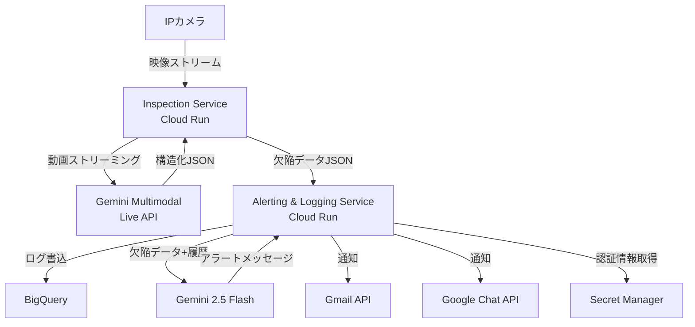
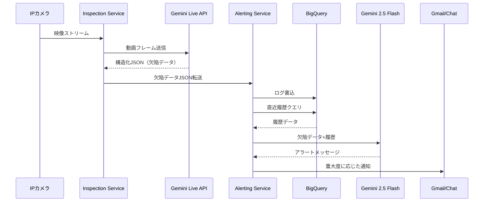

## ブログ概要（Summary）

本記事は [Google Cloud Blog: Tutorial: How to use the Gemini Multimodal Live API for QA](https://cloud.google.com/blog/topics/developers-practitioners/gemini-live-api-real-time-ai-for-manufacturing) の解説記事です。

Google CloudのShivank Awasthi氏（Generative AI Field Solutions Architect）が2025年8月に公開したこのチュートリアルでは、Gemini Multimodal Live APIを用いた製造ラインの自動品質検査システムの構築方法が紹介されている。IPカメラからの映像をリアルタイムでGemini Live APIにストリーミングし、ブラッシュドアルミニウムケーシングの傷・へこみ・変色といった欠陥を検出・分類する。検出結果は構造化JSONとして出力され、BigQueryへの記録、Gemini 2.5 Flashによるインテリジェントアラート生成、Gmail/Google Chat通知までを2つのマイクロサービスで実現するアーキテクチャが示されている。

この記事は [Zenn記事: Gemini 3.7 Flashで設備点検動画・音声から異常検知レポートを自動生成する](https://zenn.dev/0h_n0/articles/1ca988c9024a38) の深掘りです。

## 情報源

- **種別**: 企業テックブログ
- **URL**: [https://cloud.google.com/blog/topics/developers-practitioners/gemini-live-api-real-time-ai-for-manufacturing](https://cloud.google.com/blog/topics/developers-practitioners/gemini-live-api-real-time-ai-for-manufacturing)
- **組織**: Google Cloud（Generative AI Field Solutions Architecture チーム）
- **著者**: Shivank Awasthi（Generative AI Field Solutions Architect）
- **発表日**: 2025年8月13日

## 技術的背景（Technical Background）

### なぜマルチモーダルAIによる品質検査が求められるのか

従来の製造ラインにおける品質検査は、大きく2つのアプローチに分かれていた。1つは目視検査であり、検査員の経験と注意力に依存するため、疲労や個人差によるばらつきが避けられない。もう1つはルールベースの画像処理（OpenCVによるエッジ検出やテンプレートマッチング等）であり、事前定義されたパターンに合致する欠陥しか検出できないという制約がある。

Gemini Multimodal Live APIは、動画・音声・テキストを同時に処理しながらリアルタイムで双方向の対話が可能なAPIである。従来のバッチ処理型のマルチモーダルAPIと異なり、ストリーミング入力に対して即座に応答を返すため、製造ラインの高速な検査プロセスに適合する。

著者のAwasthi氏は、このAPIの特性を製造業の品質管理に適用することで、以下の課題を解決するシステムを提案している。

- **定量的な欠陥計測**: 人間の主観ではなく、ミリメートル単位の定量データに基づく判定
- **製品ごとの検査基準の動的切替**: データベースから検査プロンプトを動的に取得し、同一ラインで異なる製品の検査に対応
- **時系列相関分析**: 個別の欠陥検出だけでなく、直近の検出履歴と相関させた系統的問題の早期発見

### 学術研究との位置づけ

この取り組みは、Vision-Language Model（VLM）を産業応用に展開する流れの一例である。学術的にはVisual Question Answering（VQA）やVisual Grounding（画像中の対象物の位置特定）の技術が基盤となっており、Gemini Live APIはこれらの能力をストリーミング対話という形で統合したものと位置づけられる。

## 実装アーキテクチャ（Architecture）

### システム全体構成

Awasthi氏が提案するシステムは、Cloud Run上で動作する2つのマイクロサービスから構成される。サーバーレスアーキテクチャにより、検査需要に応じた自動スケーリングとコスト最適化が実現される。



### Inspection Service（検査サービス）

Inspection Serviceは、IPカメラからの映像をGemini Multimodal Live APIにリアルタイムでストリーミングする役割を担う。著者によると、このサービスは以下の4つのタスクを連続して実行する。

1. **バーコード/QRコード読取**: 製品SKUの識別
2. **外観検査**: 事前定義された基準に基づく欠陥検出
3. **分類・計測**: 欠陥の種類、位置、寸法（ミリメートル単位）の定量化
4. **構造化出力**: 検査結果のJSON形式での出力

著者が示している検査プロンプトの設計例を以下に示す。

```python
INSPECTION_PROMPT: str = """
You are a quality control inspector for high-end electronics.
In this video frame:
1. Identify the product SKU by decoding the QR code.
2. Inspect the brushed aluminum casing for any defects,
   specifically looking for:
   - Scratches longer than 2mm
   - Dents or dings
   - Discoloration or blemishes
3. For each defect found, provide its type, location on the
   casing, and estimated dimensions in millimeters.
4. Return your findings as a single, structured JSON object.
"""
```

このプロンプト設計にはいくつかの重要なポイントがある。

- **定量的な閾値の指定**: 「2mm以上の傷」のように具体的な数値基準を与えることで、モデルの出力を一貫させる
- **構造化出力の要求**: JSON形式を明示的に要求し、後続のパイプラインでの処理を容易にする
- **動的プロンプト**: データベースから製品ごとの検査基準を取得し、同一ラインで異なる製品の検査に対応可能

検査結果として出力される構造化JSONの例を以下に示す。

```python
from dataclasses import dataclass, field
from typing import Optional


@dataclass
class DefectRecord:
    """Gemini Live APIから出力される欠陥検出結果の構造

    Attributes:
        timestamp: 検出時刻（ISO 8601形式）
        product_sku: QRコードから読み取った製品識別子
        line_id: 検査ラインの識別子
        machine_id: 関連する製造機器の識別子
        defect_type: 欠陥の分類（Scratch, Dent, Housing Crack等）
        defect_location: ケーシング上の欠陥位置
        defect_dimensions_mm: 欠陥の寸法（ミリメートル単位）
        severity: 重大度レベル（LOW, MEDIUM, HIGH, CRITICAL）
    """
    timestamp: str
    product_sku: str
    line_id: str
    machine_id: str
    defect_type: str
    defect_location: str
    defect_dimensions_mm: Optional[dict[str, float]] = None
    severity: Optional[str] = None
```

### 重大度スコアリング

著者は、Geminiが提供する定量データを用いた客観的な重大度スコアリングの可能性に言及している。具体的なスコアリング式は示されていないが、以下のパラメータに基づく重み付けスコアが想定される。

$$
S = w_{\text{size}} \cdot f_{\text{size}}(d) + w_{\text{type}} \cdot f_{\text{type}}(t) + w_{\text{loc}} \cdot f_{\text{loc}}(l)
$$

ここで、
- $S$: 重大度スコア
- $d$: 欠陥の寸法（mm単位）
- $t$: 欠陥の種類（Scratch, Dent, Crack等）
- $l$: 欠陥の位置（正面、側面、背面等）
- $w_{\text{size}}, w_{\text{type}}, w_{\text{loc}}$: 各パラメータの重み係数
- $f_{\text{size}}, f_{\text{type}}, f_{\text{loc}}$: 各パラメータのスコア変換関数

著者は「重み付けパラメータによる客観的な重大度スコアリングが可能であり、人間の主観を排除できる」と述べている。

### Alerting & Logging Service（アラート・ログサービス）

2つ目のマイクロサービスは、Inspection Serviceから受け取った構造化JSONを処理し、以下の3つの機能を提供する。

**1. BigQueryへのログ記録**

欠陥検出結果をBigQueryに書き込み、クエリ可能な履歴データベースを構築する。これにより長期的なトレンド分析や品質レポートの生成が可能になる。

**2. Gemini 2.5 Flashによるインテリジェントアラート生成**

単純な閾値ベースのアラートではなく、Gemini 2.5 Flashを推論レイヤーとして使用する点がこのアーキテクチャの特徴的な部分である。著者が示しているアラート生成プロンプトの構造を以下に示す。

```python
def build_alert_prompt(
    defect_data: dict,
    recent_history: list[dict],
) -> str:
    """アラート生成用プロンプトを構築する

    Args:
        defect_data: 現在検出された欠陥のデータ
        recent_history: 直近の欠陥検出履歴

    Returns:
        Gemini 2.5 Flashに送信するプロンプト文字列
    """
    return f"""Given the following defect data, generate a concise,
critical alert message for a line supervisor. Correlate this
event with the provided history of recent defects.

Defect Data: {defect_data}

Recent History: {recent_history}
"""
```

著者が示しているアラート出力の例は以下の通りである。

> CRITICAL ALERT: 3rd 'Housing Crack' defect detected on Line 4 in the last 10 minutes. Possible systemic issue with molding machine M-7.

この例からわかるように、Gemini 2.5 Flashは単に欠陥データを要約するだけでなく、直近の履歴との時系列的な相関分析を行い、「成形機M-7の系統的問題の可能性」といった根本原因の推定まで含むアラートを生成する。

**3. 通知配信**

重大度に応じて適切な通知チャネル（Gmail API、Google Chat API）にアラートを配信する。APIキーや認証情報はSecret Managerで管理される。

### データフローの時系列



## Production Deployment Guide

本セクションでは、Awasthi氏が提案するGemini Live APIベースの品質検査システムをAWS上にデプロイする構成パターンを解説する。Gemini APIはVertex AI経由でのアクセスも選択肢だが、ここではAWSのコンピューティング基盤上でGemini APIを直接呼び出す構成を主軸として、トラフィック量別のコスト試算を示す。

### AWS実装パターン（コスト最適化重視）

Gemini Live APIはGoogle Cloud外からもAPIキー認証で利用可能であるため、コンピューティングとストレージはAWS、AI推論はGemini APIという構成が成立する。なおVertex AI経由で利用する場合は、Google Cloud側でのIAM設定とサービスアカウント認証が必要となる。

| 構成 | トラフィック | コンピューティング | ストレージ/分析 | 月額概算 |
|------|-------------|-------------------|----------------|---------|
| Small | ~100検査/日 | Lambda + API Gateway | DynamoDB + S3 | $80-200 |
| Medium | ~1,000検査/日 | ECS Fargate | RDS PostgreSQL + S3 | $400-900 |
| Large | 10,000+検査/日 | EKS + Spot Instances | Aurora + Redshift | $2,500-5,500 |

**Small構成の内訳（~100検査/日）**:
- Lambda (2 functions, 512MB, avg 10s/invoke): ~$15/月
- API Gateway (REST): ~$5/月
- DynamoDB (On-Demand): ~$10/月
- S3 (映像アーカイブ 100GB): ~$3/月
- Gemini API (Live API + Flash): ~$40-150/月（検査内容による）
- CloudWatch: ~$5/月

**Medium構成の内訳（~1,000検査/日）**:
- ECS Fargate (2 services, 0.5vCPU/1GB): ~$70/月
- ALB: ~$25/月
- RDS PostgreSQL (db.t4g.micro): ~$15/月
- S3 + Glacier (映像アーカイブ): ~$20/月
- Gemini API: ~$200-600/月
- CloudWatch + X-Ray: ~$15/月

**Large構成の内訳（10,000+検査/日）**:
- EKS (コントロールプレーン): ~$75/月
- EC2 Spot (m6i.xlarge x3): ~$150/月（Spot価格）
- Aurora PostgreSQL (db.r6g.large): ~$200/月
- Redshift Serverless: ~$300/月
- Gemini API: ~$1,500-4,000/月
- CloudWatch + X-Ray + Cost Explorer: ~$30/月

**コスト削減テクニック**:
- Spot Instancesの活用でEC2コストを最大90%削減
- Reserved InstancesまたはSavings Plans（1年コミット）でFargateコストを最大52%削減
- S3 Intelligent-Tieringによる映像アーカイブの自動階層化
- Gemini API呼出のバッチ化（非リアルタイム検査分の集約処理）

> **注記**: 上記コスト試算は2026年9月時点のAWS ap-northeast-1（東京）リージョン料金に基づく概算値です。実際のコストはトラフィックパターン、リージョン、バースト使用量により変動します。最新料金は[AWS料金計算ツール](https://calculator.aws/)で確認を推奨します。

### Terraformインフラコード

**Small構成（Serverless）: Lambda + API Gateway + DynamoDB**

```hcl
# Small構成: Gemini Live API品質検査システム（Serverless）
# コスト目安: ~$80-200/月（Gemini API利用料込み）

terraform {
  required_version = ">= 1.9"
  required_providers {
    aws = {
      source  = "hashicorp/aws"
      version = "~> 5.70"
    }
  }
}

provider "aws" {
  region = "ap-northeast-1"
}

# --- Secrets Manager: Gemini APIキー ---
resource "aws_secretsmanager_secret" "gemini_api_key" {
  name        = "quality-inspection/gemini-api-key"
  description = "Gemini API key for Live API and Flash"
}

# --- DynamoDB: 欠陥ログ ---
resource "aws_dynamodb_table" "defect_logs" {
  name         = "defect-logs"
  billing_mode = "PAY_PER_REQUEST" # On-Demand: 低トラフィックでコスト最適
  hash_key     = "product_sku"
  range_key    = "timestamp"

  attribute {
    name = "product_sku"
    type = "S"
  }
  attribute {
    name = "timestamp"
    type = "S"
  }

  # KMS暗号化
  server_side_encryption {
    enabled = true
  }

  point_in_time_recovery {
    enabled = true
  }
}

# --- IAMロール: Lambda用（最小権限） ---
resource "aws_iam_role" "inspection_lambda" {
  name = "inspection-lambda-role"
  assume_role_policy = jsonencode({
    Version = "2012-10-17"
    Statement = [{
      Action = "sts:AssumeRole"
      Effect = "Allow"
      Principal = { Service = "lambda.amazonaws.com" }
    }]
  })
}

resource "aws_iam_role_policy" "inspection_lambda_policy" {
  name = "inspection-lambda-policy"
  role = aws_iam_role.inspection_lambda.id
  policy = jsonencode({
    Version = "2012-10-17"
    Statement = [
      {
        Effect   = "Allow"
        Action   = ["dynamodb:PutItem", "dynamodb:Query"]
        Resource = aws_dynamodb_table.defect_logs.arn
      },
      {
        Effect   = "Allow"
        Action   = ["secretsmanager:GetSecretValue"]
        Resource = aws_secretsmanager_secret.gemini_api_key.arn
      },
      {
        Effect   = "Allow"
        Action   = ["logs:CreateLogGroup", "logs:CreateLogStream", "logs:PutLogEvents"]
        Resource = "arn:aws:logs:*:*:*"
      }
    ]
  })
}

# --- Lambda: Inspection Service ---
resource "aws_lambda_function" "inspection_service" {
  function_name = "inspection-service"
  runtime       = "python3.12"
  handler       = "handler.lambda_handler"
  role          = aws_iam_role.inspection_lambda.arn
  timeout       = 60  # Live APIストリーミングのため長めに設定
  memory_size   = 512

  environment {
    variables = {
      DEFECT_TABLE_NAME  = aws_dynamodb_table.defect_logs.name
      SECRET_ARN         = aws_secretsmanager_secret.gemini_api_key.arn
    }
  }

  filename = "lambda_inspection.zip" # デプロイパッケージ
}

# --- CloudWatch アラーム: コスト監視 ---
resource "aws_cloudwatch_metric_alarm" "lambda_duration" {
  alarm_name          = "inspection-lambda-high-duration"
  comparison_operator = "GreaterThanThreshold"
  evaluation_periods  = 3
  metric_name         = "Duration"
  namespace           = "AWS/Lambda"
  period              = 300
  statistic           = "Average"
  threshold           = 30000 # 30秒
  alarm_description   = "Lambda実行時間がGemini APIレイテンシ増加を示唆"

  dimensions = {
    FunctionName = aws_lambda_function.inspection_service.function_name
  }
}
```

**Large構成（Container）: EKS + Karpenter + Spot Instances**

```hcl
# Large構成: Gemini Live API品質検査システム（Container）
# コスト目安: ~$2,500-5,500/月（Gemini API利用料込み）

module "eks" {
  source  = "terraform-aws-modules/eks/aws"
  version = "~> 20.24"

  cluster_name    = "quality-inspection-cluster"
  cluster_version = "1.31"

  vpc_id     = module.vpc.vpc_id
  subnet_ids = module.vpc.private_subnets

  # コントロールプレーンのみ（ノードはKarpenterが管理）
  cluster_endpoint_public_access = false

  # Secrets Manager CSI Driver
  cluster_addons = {
    secrets-store-csi-driver-provider-aws = { most_recent = true }
  }
}

# --- Karpenter: Spot優先の自動スケーリング ---
resource "kubectl_manifest" "karpenter_nodepool" {
  yaml_body = yamlencode({
    apiVersion = "karpenter.sh/v1"
    kind       = "NodePool"
    metadata   = { name = "inspection-workers" }
    spec = {
      template = {
        spec = {
          requirements = [
            { key = "karpenter.sh/capacity-type", operator = "In", values = ["spot", "on-demand"] },
            { key = "node.kubernetes.io/instance-type", operator = "In",
              values = ["m6i.xlarge", "m6a.xlarge", "m7i.xlarge"] },
          ]
          # Spot優先: On-Demandはフォールバック
        }
      }
      limits   = { cpu = "48", memory = "192Gi" }
      disruption = {
        consolidationPolicy = "WhenEmptyOrUnderutilized"
        consolidateAfter    = "30s"
      }
    }
  })
}

# --- AWS Budgets: 月額予算アラート ---
resource "aws_budgets_budget" "monthly" {
  name         = "quality-inspection-monthly"
  budget_type  = "COST"
  limit_amount = "5500"
  limit_unit   = "USD"
  time_unit    = "MONTHLY"

  notification {
    comparison_operator       = "GREATER_THAN"
    threshold                 = 80
    threshold_type            = "PERCENTAGE"
    notification_type         = "ACTUAL"
    subscriber_email_addresses = ["ops-team@example.com"]
  }
}
```

### 運用・監視設定

**CloudWatch Logs Insights クエリ: Gemini APIレイテンシ分析**

```
# P95/P99レイテンシ（1時間ごと）
fields @timestamp, gemini_api_latency_ms
| stats percentile(gemini_api_latency_ms, 95) as p95,
        percentile(gemini_api_latency_ms, 99) as p99,
        avg(gemini_api_latency_ms) as avg_latency
  by bin(1h)
| sort @timestamp desc
```

**CloudWatch アラーム設定（Python）**

```python
import boto3


def create_gemini_latency_alarm(
    function_name: str,
    threshold_ms: float = 30000,
) -> dict:
    """Gemini API呼び出しのレイテンシ異常を検知するアラームを作成する

    Args:
        function_name: 監視対象のLambda関数名
        threshold_ms: アラーム閾値（ミリ秒）

    Returns:
        CloudWatch APIのレスポンス
    """
    cw = boto3.client("cloudwatch", region_name="ap-northeast-1")
    return cw.put_metric_alarm(
        AlarmName=f"{function_name}-gemini-latency",
        MetricName="Duration",
        Namespace="AWS/Lambda",
        Statistic="p99",
        Period=300,
        EvaluationPeriods=3,
        Threshold=threshold_ms,
        ComparisonOperator="GreaterThanThreshold",
        Dimensions=[{"Name": "FunctionName", "Value": function_name}],
        AlarmActions=["arn:aws:sns:ap-northeast-1:123456789012:ops-alerts"],
    )
```

**X-Ray トレーシング設定（Python）**

```python
from aws_xray_sdk.core import xray_recorder, patch_all


# boto3, requests等を自動計装
patch_all()


@xray_recorder.capture("gemini_live_api_call")
def call_gemini_live_api(video_frame: bytes, prompt: str) -> dict:
    """Gemini Live APIを呼び出し、X-Rayでトレーシングする

    Args:
        video_frame: 検査対象の動画フレーム（バイナリ）
        prompt: 検査プロンプト

    Returns:
        欠陥検出結果の辞書
    """
    subsegment = xray_recorder.current_subsegment()
    subsegment.put_annotation("inspection_type", "visual_qa")
    subsegment.put_metadata("prompt_length", len(prompt))
    # Gemini API呼出ロジック
    ...
```

**Cost Explorer 日次レポート（Python）**

```python
import boto3
from datetime import datetime, timedelta


def get_daily_cost_report() -> dict:
    """日次コストレポートを取得し、閾値超過時にSNS通知する

    Returns:
        サービス別コストの辞書
    """
    ce = boto3.client("ce", region_name="us-east-1")
    today = datetime.utcnow().strftime("%Y-%m-%d")
    yesterday = (datetime.utcnow() - timedelta(days=1)).strftime("%Y-%m-%d")

    response = ce.get_cost_and_usage(
        TimePeriod={"Start": yesterday, "End": today},
        Granularity="DAILY",
        Metrics=["UnblendedCost"],
        GroupBy=[{"Type": "DIMENSION", "Key": "SERVICE"}],
    )

    costs: dict[str, float] = {}
    for group in response["ResultsByTime"][0]["Groups"]:
        service = group["Keys"][0]
        amount = float(group["Metrics"]["UnblendedCost"]["Amount"])
        costs[service] = amount

    total = sum(costs.values())
    if total > 100:  # $100/日超過でアラート
        sns = boto3.client("sns", region_name="ap-northeast-1")
        sns.publish(
            TopicArn="arn:aws:sns:ap-northeast-1:123456789012:cost-alerts",
            Subject=f"日次コスト超過: ${total:.2f}",
            Message=f"品質検査システムの日次コストが$100を超過: ${total:.2f}",
        )
    return costs
```

### コスト最適化チェックリスト

**アーキテクチャ選択**:
- [ ] トラフィック量に応じた構成選択（~100/日: Serverless、~1000/日: Fargate、10000+/日: EKS）
- [ ] リアルタイム要件の確認（全検査がリアルタイム必須か、バッチ処理可能なものがないか）

**リソース最適化**:
- [ ] EC2/EKS: Spot Instances優先（Karpenterでフォールバック管理）
- [ ] Fargate: Savings Plans（1年コミットで最大52%削減）
- [ ] Lambda: メモリサイズ最適化（Power Tuningで検証）
- [ ] EKS: アイドル時のノード自動スケールダウン（Karpenter consolidation）
- [ ] S3: Intelligent-Tiering（映像アーカイブの自動階層化）

**Gemini APIコスト削減**:
- [ ] 非リアルタイム検査のバッチ化（Batch API相当の集約処理）
- [ ] プロンプトの最適化（不要な指示の削除でトークン数削減）
- [ ] Gemini Flash系モデルの活用（アラート生成等の軽量タスク）
- [ ] 検査画像の前処理（解像度調整によるトークン消費の削減）

**監視・アラート**:
- [ ] AWS Budgets設定（月額予算の80%/100%でアラート）
- [ ] CloudWatchアラーム（Lambda実行時間、APIレイテンシ）
- [ ] Cost Anomaly Detection有効化
- [ ] 日次コストレポートのSNS自動配信

**リソース管理**:
- [ ] 未使用リソースの定期削除（Lambda旧バージョン、不要なECRイメージ）
- [ ] タグ戦略の統一（Environment, Service, CostCenter）
- [ ] S3ライフサイクルポリシー（映像データの90日後Glacier移行）
- [ ] 開発環境の夜間・休日自動停止
- [ ] CloudTrail/AWS Config有効化（監査証跡）

## パフォーマンス最適化（Performance）

### リアルタイム性の確保

著者のブログでは具体的なレイテンシ数値は示されていないが、「リアルタイム」「即時アラート」「高速製造ライン向け」と記載されている。Gemini Multimodal Live APIの特性として、ストリーミング入出力による低レイテンシが設計上の重要な要素である。

製造ラインの品質検査では、以下のレイテンシ要件が一般的に求められる。

| 工程 | 許容レイテンシ | ボトルネック |
|------|--------------|------------|
| 映像取得（IPカメラ→サービス） | < 100ms | ネットワーク帯域 |
| Gemini Live API推論 | < 2-5s | モデル推論時間 |
| BigQuery書込 | < 500ms | ストリーミングinsert |
| Gemini 2.5 Flash（アラート生成） | < 1-3s | モデル推論時間 |
| 通知配信（Gmail/Chat） | < 2s | API呼出 |

### チューニングの方向性

- **映像前処理**: 解像度やフレームレートの最適化により、APIに送信するデータ量を削減
- **プロンプトキャッシング**: 検査プロンプトの固定部分をキャッシュし、APIのTime-to-First-Token（TTFT）を短縮
- **非同期処理**: アラート生成と通知配信をInspection Serviceから非同期で実行し、検査のスループットを維持

## 運用での学び（Production Lessons）

### サーバーレスアーキテクチャの利点と制約

著者がCloud Runを選択した理由として、サーバーレスによる運用負荷の軽減が挙げられている。製造ラインは稼働時間が明確であり（例: 8:00-22:00のシフト制）、非稼働時間のリソースコストをゼロにできる。

一方で、本システムを運用する際には以下の点に注意が必要と考えられる。

**モニタリング戦略**:
- Gemini Live APIのレスポンス品質の監視（構造化JSONの出力率、欠陥検出の精度）
- 欠陥検出の偽陽性/偽陰性率のトラッキング
- APIレイテンシの継続的な監視とSLO設定

**障害対応の想定**:
- Gemini API障害時のフォールバック（映像バッファリングと後続バッチ処理）
- ネットワーク断発生時のローカルキューイング
- Secret Manager障害時の認証情報キャッシュ戦略

**プロンプト管理**:
- 検査基準の変更はプロンプトの更新で対応でき、モデルの再学習が不要
- プロンプトのバージョン管理と、変更前後の検出精度比較テスト
- 新製品投入時の検査プロンプトテンプレート標準化

### データガバナンス

BigQueryに蓄積される欠陥ログは、以下の観点でのガバナンスが必要である。

- **データ保持期間**: 品質保証の観点から法定保持期間（製造業では通常5-10年）への対応
- **アクセス制御**: 欠陥データへのアクセスを品質管理部門に限定
- **監査証跡**: データの改ざん防止と変更履歴の記録

## 学術研究との関連（Academic Connection）

### マルチモーダルAIの産業応用

本ブログで紹介されているシステムは、マルチモーダルLLMの産業応用における実践的な事例である。学術的な文脈では以下の研究分野と関連する。

- **Visual Question Answering（VQA）**: 画像に対する質問応答の拡張として、動画ストリーミングに対するリアルタイムQAを実現。Gemini Live APIは、VQAモデルをストリーミング対話に統合した実装と位置づけられる
- **Anomaly Detection**: 製造業における外観検査は、教師なし異常検出や半教師あり学習の応用先として研究されてきた。LLMベースのアプローチは、ゼロショットで新しい欠陥パターンに対応できる点で従来のCNN/ViTベース手法と異なる
- **Structured Output Generation**: LLMから構造化データを確実に生成する技術は、JSON Mode/Structured Outputsとして各プロバイダが提供しており、産業応用では出力の信頼性が不可欠である

### 従来手法との差異

従来の画像検査システム（OpenCV + ルールベース、CNN分類器等）と比較した場合、LLMベースのアプローチは以下の特徴を持つ。

| 観点 | 従来手法（CNN等） | LLMベース（Gemini Live API） |
|------|-----------------|---------------------------|
| 新規欠陥への対応 | 再学習が必要 | プロンプト変更で対応可能 |
| 検出根拠の説明 | 不透明（ブラックボックス） | 自然言語で説明可能 |
| 定量データ出力 | カスタム後処理が必要 | プロンプトで指示可能 |
| 推論コスト | 低い（エッジ推論可能） | 高い（API課金） |
| レイテンシ | 低い（< 100ms） | 高い（1-5s） |

## まとめと実践への示唆

Awasthi氏が提案するGemini Multimodal Live APIを用いた品質検査システムは、マルチモーダルAIの製造業応用として実践的な構成を示している。2つのマイクロサービスによる関心の分離（検査とアラート/ログ）、動的プロンプトによる製品ごとの検査基準の切替、Gemini 2.5 Flashによる時系列相関分析を含むインテリジェントアラート生成は、従来のルールベース検査システムでは実現困難だった機能である。

実務への示唆として、以下の3点が挙げられる。

1. **段階的な導入**: まずは非リアルタイム（オフライン）のバッチ検査から始め、精度検証を経てリアルタイム検査に移行する段階的アプローチが現実的である
2. **プロンプトエンジニアリングの重要性**: 検査精度はプロンプト設計に大きく依存する。定量的な閾値の指定、構造化出力の要求、具体的な欠陥カテゴリの列挙が精度向上に寄与する
3. **コスト管理**: Gemini APIのトークン課金は映像データの処理量に比例するため、映像の前処理（解像度調整、関心領域の切出し）によるコスト最適化が運用上の重要な検討事項となる

## 参考文献

- **Blog URL**: [https://cloud.google.com/blog/topics/developers-practitioners/gemini-live-api-real-time-ai-for-manufacturing](https://cloud.google.com/blog/topics/developers-practitioners/gemini-live-api-real-time-ai-for-manufacturing)
- **Gemini Live API Documentation**: [https://ai.google.dev/gemini-api/docs/live](https://ai.google.dev/gemini-api/docs/live)
- **Gemini Live API Capabilities Guide**: [https://ai.google.dev/gemini-api/docs/live-guide](https://ai.google.dev/gemini-api/docs/live-guide)
- **Gemini Live API Tool Use Guide**: [https://ai.google.dev/gemini-api/docs/live-tools](https://ai.google.dev/gemini-api/docs/live-tools)
- **Related Zenn article**: [https://zenn.dev/0h_n0/articles/1ca988c9024a38](https://zenn.dev/0h_n0/articles/1ca988c9024a38)
