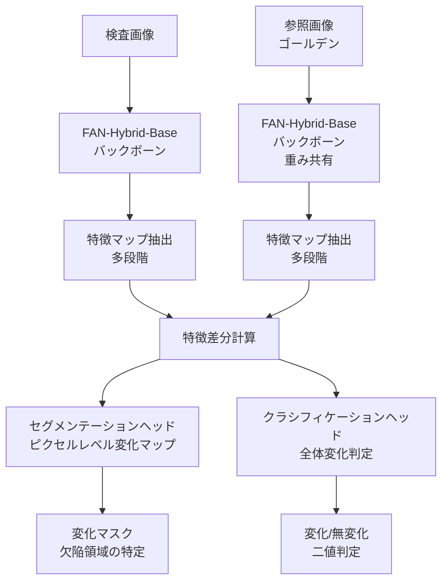

## ブログ概要（Summary）

本記事は [https://developer.nvidia.com/blog/transforming-industrial-defect-detection-with-nvidia-tao-and-vision-ai-models/](https://developer.nvidia.com/blog/transforming-industrial-defect-detection-with-nvidia-tao-and-vision-ai-models/) の解説記事です。

NVIDIAの公式テックブログでは、TAO Toolkit上のVisualChangeNetモデルを用いた産業欠陥検出パイプラインが紹介されている。VisualChangeNetはSiamese Network構造とTransformerベースの特徴抽出を組み合わせたアーキテクチャであり、検査対象画像と参照（ゴールデン）画像の差異をピクセルレベルで検出する。著者らはMVTec-ADデータセットのbottleクラスでファインチューニングを行い、全体精度99.67%、mIoU 92.3%、mF1 95.8%を達成したと報告している。さらに、学習済みモデルをONNX形式でエクスポートし、NVIDIA Triton Inference ServerまたはDeepStreamでデプロイする手順が示されている。

この記事は [Zenn記事: Gemini 3.7 Flashで設備点検動画・音声から異常検知レポートを自動生成する](https://zenn.dev/0h_n0/articles/1ca988c9024a38) の深掘りです。

## 情報源

- **種別**: 企業テックブログ（NVIDIA Developer Blog）
- **URL**: [Transforming Industrial Defect Detection with NVIDIA TAO and Vision AI Models](https://developer.nvidia.com/blog/transforming-industrial-defect-detection-with-nvidia-tao-and-vision-ai-models/)
- **組織**: NVIDIA
- **著者**: Nirmal Kumar Juluru, Zaid Pervaiz Bhat, Samuel Ochoa
- **発表日**: 2023年11月20日

## 技術的背景（Technical Background）

### 産業外観検査の課題

製造業における外観検査は、製品品質を保証するための重要工程である。従来の手法では、ルールベースの画像処理（エッジ検出、テンプレートマッチング）が広く使われてきたが、以下の課題がある。

1. **変動する外観条件**: 照明の揺らぎ、部品の位置ずれ、表面の微細なテクスチャ変化に対してロバストな特徴量設計が困難
2. **欠陥パターンの多様性**: キズ、欠け、色ムラ、汚れなど、欠陥の形状・大きさ・コントラストが多岐にわたる
3. **少量データでの学習**: 不良品は発生頻度が低く、大規模なラベル付きデータセットの構築が困難

深層学習を用いた異常検知（Anomaly Detection）手法はこれらの課題に対する有力なアプローチであるが、スクラッチからモデルを訓練するには数万枚以上のラベル付き画像が必要となる場合が多い。VisualChangeNetは転移学習（Transfer Learning）により、少量のドメイン固有データで高精度なモデルを構築できる点が特徴である。

### 変化検出（Change Detection）アプローチ

VisualChangeNetは異常検知を「変化検出（Change Detection）」問題として定式化している。従来の1枚入力による分類・セグメンテーションではなく、参照画像（欠陥のないゴールデン画像）と検査対象画像の2枚を入力とし、両者の差異を特定する。

このアプローチの利点は以下の通りである。

- **正常パターンの学習負荷軽減**: 正常画像の全バリエーションを学習する必要がなく、「変化」のみを検出する
- **位置合わせの柔軟性**: Transformerの大域的Attentionにより、局所的な位置ずれに対してロバスト
- **解釈性**: 変化マップ（Change Map）により、どこが変化したかを可視化できる

## 実装アーキテクチャ（Architecture）

### VisualChangeNetの全体構成

VisualChangeNetは、セグメンテーションサブネットワークとクラシフィケーションサブネットワークの2つの独立したタスクヘッドを持つマルチタスクアーキテクチャである。



### Siamese Networkアーキテクチャ

VisualChangeNetのバックボーンはSiamese Network構造をとる。2つの入力画像に対して同一の重みを共有するエンコーダを適用し、各段階（stage）の特徴マップを抽出する。バックボーンにはFAN-Hybrid-Base（Fully Attentional Network）が採用されており、NV-ImageNetデータセットで事前学習済みである。

Siamese Networkの特徴抽出は以下のように定式化される。

$$
\mathbf{f}_t^{(l)} = \phi^{(l)}(\mathbf{I}_t), \quad \mathbf{f}_r^{(l)} = \phi^{(l)}(\mathbf{I}_r)
$$

ここで、
- $\mathbf{I}_t$: 検査対象画像（test image）
- $\mathbf{I}_r$: 参照画像（reference / golden image）
- $\phi^{(l)}$: バックボーンの第$l$段階の特徴抽出関数
- $\mathbf{f}_t^{(l)}, \mathbf{f}_r^{(l)}$: 第$l$段階での特徴マップ

2つの特徴マップの差分は以下で計算される。

$$
\Delta \mathbf{f}^{(l)} = \mathbf{f}_t^{(l)} - \mathbf{f}_r^{(l)}
$$

セグメンテーションヘッドはこの差分特徴マップから、ピクセルごとの変化確率マップ$\mathbf{M} \in [0, 1]^{H \times W}$を出力する。

### FAN-Hybrid-Baseバックボーン

FAN（Fully Attentional Network）は、CNNとVision Transformerのハイブリッドアーキテクチャである。初期段階ではConvolutionによる局所特徴抽出を行い、深い段階ではSelf-Attentionによる大域的依存関係の捕捉を行う。

FAN-Hybrid-BaseはNV-ImageNet（NVIDIAが構築した大規模画像分類データセット）で事前学習されており、ImageNet-1kで82.4%のtop-1精度を達成している。この事前学習済みバックボーンをMVTec-ADデータでファインチューニングすることで、少量データでの高精度な欠陥検出が可能となる。

### セグメンテーションとクラシフィケーションの統合

VisualChangeNetはマルチタスク学習を採用しており、セグメンテーション損失とクラシフィケーション損失の重み付き和を最小化する。

$$
\mathcal{L}_{\text{total}} = \lambda_{\text{seg}} \mathcal{L}_{\text{seg}} + \lambda_{\text{cls}} \mathcal{L}_{\text{cls}}
$$

ここで、
- $\mathcal{L}_{\text{seg}}$: セグメンテーション損失（Binary Cross-Entropy + Dice Loss）
- $\mathcal{L}_{\text{cls}}$: クラシフィケーション損失（Binary Cross-Entropy）
- $\lambda_{\text{seg}}, \lambda_{\text{cls}}$: 各タスクの重み係数

セグメンテーションヘッドはピクセルレベルの変化マップを生成し、欠陥の位置と形状を特定する。クラシフィケーションヘッドは画像全体の変化/無変化を二値判定し、後段の仕分けロジックに活用される。

### 転移学習によるファインチューニング

著者らが報告しているファインチューニングの設定は以下の通りである。

```python
class VisualChangeNetConfig:
    """VisualChangeNet fine-tuning configuration

    MVTec-AD bottle classでの学習設定。
    ブログ記事の報告値に基づく。
    """
    # データセット
    dataset: str = "MVTec-AD"
    object_class: str = "bottle"
    train_images: int = 253
    test_images: int = 30
    total_images: int = 283

    # 学習パラメータ
    epochs: int = 30
    batch_size: int = 8
    learning_rate: float = 0.0002
    optimizer: str = "AdamW"

    # バックボーン
    backbone: str = "FAN-Hybrid-Base"
    pretrained_dataset: str = "NV-ImageNet"

    # エクスポート
    export_format: str = "ONNX"
```

TAO Toolkitでの学習はCLIベースで実行される。TAO Launcherを通じてコンテナ化された環境で学習が行われるため、依存関係の管理が簡素化されている。

```python
def run_tao_training(
    spec_file: str,
    results_dir: str,
    num_gpus: int = 1
) -> dict[str, float]:
    """TAO Toolkitでのファインチューニング実行

    Args:
        spec_file: TAO spec YAML file path
        results_dir: Output directory for checkpoints
        num_gpus: Number of GPUs to use

    Returns:
        Training metrics dictionary
    """
    import subprocess

    cmd = [
        "tao", "model", "visual_changenet", "train",
        "-e", spec_file,
        "-r", results_dir,
        "--gpus", str(num_gpus),
    ]

    result = subprocess.run(cmd, capture_output=True, text=True, check=True)

    # Parse training metrics from output
    metrics: dict[str, float] = {
        "accuracy": 0.0,
        "miou": 0.0,
        "mf1": 0.0,
    }
    # Actual parsing logic would extract from TAO output logs
    return metrics
```

## Production Deployment Guide

### VisualChangeNet + Tritonによる産業欠陥検出システムのAWSデプロイ

VisualChangeNetの学習済みモデルはONNX形式でエクスポートされ、NVIDIA Triton Inference ServerまたはDeepStreamでデプロイできる。ここではAWS上でTritonを用いた推論サービスを構築するパターンを解説する。

### AWS実装パターン（コスト最適化重視）

**トラフィック量別の推奨構成**:

| 構成 | トラフィック | AWSサービス | 月額概算 |
|------|-------------|-------------|----------|
| Small | ~100画像/日 | EC2 g5.xlarge (Spot) + Triton | $150-300 |
| Medium | ~1,000画像/日 | SageMaker Endpoint (ml.g5.xlarge) | $500-1,200 |
| Large | 10,000+画像/日 | EKS + g5ノードグループ (Spot) + Triton | $2,000-4,500 |

**Small構成 (~100画像/日)**: EC2 g5.xlarge (NVIDIA A10G GPU) のSpotインスタンス上でTriton Inference Serverを直接起動する。Spotインスタンスの活用によりオンデマンド比で最大70%のコスト削減が見込める。S3にモデルリポジトリを配置し、起動時にロードする構成とする。推論リクエストはALB経由でルーティングする。

- EC2 g5.xlarge Spot: ~$120/月（オンデマンド$400/月の約70%割引）
- ALB: ~$20/月
- S3 (モデル保存): ~$5/月
- CloudWatch: ~$10/月

**Medium構成 (~1,000画像/日)**: SageMaker Real-time Endpointを利用する。SageMakerはTritonコンテナをネイティブサポートしており、Auto Scalingポリシーによるスケール制御、A/Bテスト、モデルモニタリングが組み込みで利用可能である。

- SageMaker ml.g5.xlarge: ~$800/月（常時起動）
- S3 (モデル/データ): ~$20/月
- SageMaker Model Monitor: ~$50/月
- CloudWatch: ~$15/月

**Large構成 (10,000+画像/日)**: EKSクラスタ上にTriton Inference Serverをデプロイし、Karpenterで GPU ノードの自動スケーリングを行う。複数のモデルバージョンをTritonのModel Repositoryで管理し、Dynamic Batchingにより高スループットを実現する。

- EKS コントロールプレーン: ~$75/月
- g5.xlarge Spot x 3-5台: ~$360-600/月
- NAT Gateway: ~$35/月
- ALB (Ingress): ~$25/月
- ECR (コンテナ): ~$10/月
- CloudWatch + Prometheus: ~$50/月

**コスト削減テクニック**:
- **Spot Instances活用**: g5.xlargeのSpot価格はオンデマンド比で60-70%割引。中断耐性はTritonのステートレス設計により確保
- **Reserved Instances**: 安定したベースライン負荷に対して1年コミットで最大40%割引
- **SageMaker Savings Plans**: SageMaker利用量に対してコミットすることで最大64%割引
- **推論バッチ化**: TritonのDynamic Batching機能により、複数リクエストをバッチ処理し1リクエストあたりのGPU利用効率を向上

### Terraformインフラコード

**Small構成（EC2 + Triton）**:

```hcl
# Small構成: EC2 Spot + Triton Inference Server
# 2026年9月時点の ap-northeast-1 料金に基づく概算

terraform {
  required_version = ">= 1.9"
  required_providers {
    aws = {
      source  = "hashicorp/aws"
      version = "~> 5.60"
    }
  }
}

provider "aws" {
  region = "ap-northeast-1"
}

# --- VPC（NAT Gateway不使用でコスト削減） ---
resource "aws_vpc" "main" {
  cidr_block           = "10.0.0.0/16"
  enable_dns_hostnames = true
  tags = { Name = "triton-inference-vpc" }
}

resource "aws_subnet" "public" {
  vpc_id                  = aws_vpc.main.id
  cidr_block              = "10.0.1.0/24"
  availability_zone       = "ap-northeast-1a"
  map_public_ip_on_launch = true
  tags = { Name = "triton-public-subnet" }
}

resource "aws_internet_gateway" "main" {
  vpc_id = aws_vpc.main.id
}

resource "aws_route_table" "public" {
  vpc_id = aws_vpc.main.id
  route {
    cidr_block = "0.0.0.0/0"
    gateway_id = aws_internet_gateway.main.id
  }
}

resource "aws_route_table_association" "public" {
  subnet_id      = aws_subnet.public.id
  route_table_id = aws_route_table.public.id
}

# --- IAMロール（最小権限） ---
resource "aws_iam_role" "triton_server" {
  name = "triton-inference-role"
  assume_role_policy = jsonencode({
    Version = "2012-10-17"
    Statement = [{
      Action = "sts:AssumeRole"
      Effect = "Allow"
      Principal = { Service = "ec2.amazonaws.com" }
    }]
  })
}

resource "aws_iam_role_policy" "s3_model_access" {
  name = "s3-model-read-only"
  role = aws_iam_role.triton_server.id
  policy = jsonencode({
    Version = "2012-10-17"
    Statement = [{
      Effect   = "Allow"
      Action   = ["s3:GetObject", "s3:ListBucket"]
      Resource = [
        aws_s3_bucket.model_repo.arn,
        "${aws_s3_bucket.model_repo.arn}/*"
      ]
    }]
  })
}

resource "aws_iam_instance_profile" "triton_server" {
  name = "triton-inference-profile"
  role = aws_iam_role.triton_server.name
}

# --- S3モデルリポジトリ ---
resource "aws_s3_bucket" "model_repo" {
  bucket = "triton-model-repo-${data.aws_caller_identity.current.account_id}"
  tags   = { Purpose = "triton-model-storage" }
}

resource "aws_s3_bucket_server_side_encryption_configuration" "model_repo" {
  bucket = aws_s3_bucket.model_repo.id
  rule {
    apply_server_side_encryption_by_default {
      sse_algorithm = "aws:kms"
    }
  }
}

data "aws_caller_identity" "current" {}

# --- EC2 Spotインスタンス（GPU） ---
resource "aws_spot_instance_request" "triton" {
  ami                    = "ami-0abcdef1234567890" # NVIDIA GPU AMI
  instance_type          = "g5.xlarge"             # A10G GPU
  spot_type              = "persistent"
  wait_for_fulfillment   = true
  iam_instance_profile   = aws_iam_instance_profile.triton_server.name
  subnet_id              = aws_subnet.public.id
  vpc_security_group_ids = [aws_security_group.triton.id]

  user_data = base64encode(<<-EOF
    #!/bin/bash
    # Triton Inference Serverの起動
    aws s3 sync s3://${aws_s3_bucket.model_repo.id}/models /opt/triton/models
    docker run --gpus=all --rm -p 8000:8000 -p 8001:8001 -p 8002:8002 \
      -v /opt/triton/models:/models \
      nvcr.io/nvidia/tritonserver:24.08-py3 \
      tritonserver --model-repository=/models
  EOF
  )

  tags = { Name = "triton-inference-spot" }
}

# --- セキュリティグループ ---
resource "aws_security_group" "triton" {
  name   = "triton-inference-sg"
  vpc_id = aws_vpc.main.id

  # HTTP推論エンドポイント（ALB経由のみ許可）
  ingress {
    from_port       = 8000
    to_port         = 8002
    protocol        = "tcp"
    security_groups = [aws_security_group.alb.id]
  }
  egress {
    from_port   = 0
    to_port     = 0
    protocol    = "-1"
    cidr_blocks = ["0.0.0.0/0"]
  }
}

resource "aws_security_group" "alb" {
  name   = "triton-alb-sg"
  vpc_id = aws_vpc.main.id

  ingress {
    from_port   = 443
    to_port     = 443
    protocol    = "tcp"
    cidr_blocks = ["0.0.0.0/0"]
  }
  egress {
    from_port   = 0
    to_port     = 0
    protocol    = "-1"
    cidr_blocks = ["0.0.0.0/0"]
  }
}

# --- CloudWatchアラーム（コスト監視） ---
resource "aws_cloudwatch_metric_alarm" "gpu_utilization" {
  alarm_name          = "triton-gpu-utilization-low"
  comparison_operator = "LessThanThreshold"
  evaluation_periods  = 6
  metric_name         = "GPUUtilization"
  namespace           = "Custom/Triton"
  period              = 3600
  statistic           = "Average"
  threshold           = 5
  alarm_description   = "GPU utilization below 5% for 6 hours - consider stopping instance"
  alarm_actions       = [] # SNS topic ARN
}
```

**Large構成（EKS + GPU Node + Triton）**:

```hcl
# Large構成: EKS + Karpenter + Spot GPU Nodes

module "eks" {
  source  = "terraform-aws-modules/eks/aws"
  version = "~> 20.24"

  cluster_name    = "triton-inference-cluster"
  cluster_version = "1.31"
  vpc_id          = aws_vpc.main.id
  subnet_ids      = [aws_subnet.private_a.id, aws_subnet.private_c.id]

  cluster_endpoint_public_access = false

  # Karpenter用IRSA
  enable_cluster_creator_admin_permissions = true
}

# --- Karpenter Provisioner（Spot優先） ---
resource "kubectl_manifest" "karpenter_nodepool" {
  yaml_body = <<-YAML
    apiVersion: karpenter.sh/v1
    kind: NodePool
    metadata:
      name: gpu-inference
    spec:
      template:
        spec:
          requirements:
            - key: "node.kubernetes.io/instance-type"
              operator: In
              values: ["g5.xlarge", "g5.2xlarge"]
            - key: "karpenter.sh/capacity-type"
              operator: In
              values: ["spot", "on-demand"]
          nodeClassRef:
            group: karpenter.k8s.aws
            kind: EC2NodeClass
            name: gpu-nodes
      limits:
        cpu: "64"
        nvidia.com/gpu: "8"
      disruption:
        consolidationPolicy: WhenEmptyOrUnderutilized
        consolidateAfter: 30s
  YAML
}

# --- Secrets Manager ---
resource "aws_secretsmanager_secret" "triton_config" {
  name       = "triton-inference-config"
  kms_key_id = aws_kms_key.triton.arn
}

# --- AWS Budgets ---
resource "aws_budgets_budget" "monthly" {
  name         = "triton-monthly-budget"
  budget_type  = "COST"
  limit_amount = "5000"
  limit_unit   = "USD"
  time_unit    = "MONTHLY"

  notification {
    comparison_operator       = "GREATER_THAN"
    threshold                 = 80
    threshold_type            = "PERCENTAGE"
    notification_type         = "ACTUAL"
    subscriber_email_addresses = ["admin@example.com"]
  }
}
```

### 運用・監視設定

**CloudWatch Logs Insights クエリ**（推論レイテンシ分析）:

```
# P95/P99レイテンシ分析
fields @timestamp, @message
| filter @message like /inference_time/
| stats percentile(inference_time_ms, 95) as p95,
        percentile(inference_time_ms, 99) as p99,
        avg(inference_time_ms) as avg_latency
  by bin(1h)
| sort @timestamp desc
```

```
# GPU使用率の異常検知
fields @timestamp, gpu_utilization, gpu_memory_used
| filter gpu_utilization > 95 or gpu_memory_used > 90
| stats count() as spike_count by bin(15m)
| sort spike_count desc
```

**CloudWatchアラーム設定（Python）**:

```python
import boto3


def create_triton_alarms(
    instance_id: str,
    sns_topic_arn: str,
) -> list[str]:
    """Triton Inference Server用CloudWatchアラームを作成

    Args:
        instance_id: EC2インスタンスID
        sns_topic_arn: 通知先SNSトピックARN

    Returns:
        作成されたアラームARNのリスト
    """
    cw = boto3.client("cloudwatch", region_name="ap-northeast-1")
    alarm_arns: list[str] = []

    # 推論レイテンシ異常検知
    cw.put_metric_alarm(
        AlarmName="triton-inference-latency-high",
        MetricName="InferenceLatencyMs",
        Namespace="Custom/Triton",
        Statistic="p99",
        Period=300,
        EvaluationPeriods=3,
        Threshold=500.0,  # 500ms超過で警告
        ComparisonOperator="GreaterThanThreshold",
        AlarmActions=[sns_topic_arn],
        Dimensions=[
            {"Name": "InstanceId", "Value": instance_id},
        ],
    )
    alarm_arns.append("triton-inference-latency-high")

    # GPU メモリ使用率
    cw.put_metric_alarm(
        AlarmName="triton-gpu-memory-high",
        MetricName="GPUMemoryUsedPercent",
        Namespace="Custom/Triton",
        Statistic="Average",
        Period=300,
        EvaluationPeriods=2,
        Threshold=90.0,
        ComparisonOperator="GreaterThanThreshold",
        AlarmActions=[sns_topic_arn],
    )
    alarm_arns.append("triton-gpu-memory-high")

    return alarm_arns
```

**X-Rayトレーシング設定（Python）**:

```python
from aws_xray_sdk.core import xray_recorder, patch_all


def configure_xray_tracing(service_name: str = "triton-proxy") -> None:
    """X-Rayトレーシングの初期化

    Args:
        service_name: X-Rayサービス名
    """
    xray_recorder.configure(
        service=service_name,
        sampling=True,
        context_missing="LOG_ERROR",
    )
    patch_all()  # boto3, requests等を自動計装
```

**Cost Explorer日次レポート（Python）**:

```python
import boto3
from datetime import datetime, timedelta


def get_daily_gpu_cost(
    sns_topic_arn: str,
    threshold_usd: float = 100.0,
) -> dict[str, float]:
    """日次GPUコストレポートを取得しSNS通知

    Args:
        sns_topic_arn: 通知先SNSトピックARN
        threshold_usd: アラート閾値（USD/日）

    Returns:
        サービス別コスト辞書
    """
    ce = boto3.client("ce", region_name="us-east-1")
    today = datetime.utcnow().strftime("%Y-%m-%d")
    yesterday = (datetime.utcnow() - timedelta(days=1)).strftime("%Y-%m-%d")

    response = ce.get_cost_and_usage(
        TimePeriod={"Start": yesterday, "End": today},
        Granularity="DAILY",
        Metrics=["UnblendedCost"],
        Filter={
            "Dimensions": {
                "Key": "SERVICE",
                "Values": [
                    "Amazon Elastic Compute Cloud - Compute",
                    "Amazon SageMaker",
                    "Amazon Elastic Kubernetes Service",
                ],
            }
        },
        GroupBy=[{"Type": "DIMENSION", "Key": "SERVICE"}],
    )

    costs: dict[str, float] = {}
    total = 0.0
    for group in response["ResultsByTime"][0]["Groups"]:
        service = group["Keys"][0]
        amount = float(group["Metrics"]["UnblendedCost"]["Amount"])
        costs[service] = amount
        total += amount

    if total > threshold_usd:
        sns = boto3.client("sns", region_name="ap-northeast-1")
        sns.publish(
            TopicArn=sns_topic_arn,
            Subject=f"GPU Cost Alert: ${total:.2f}/day",
            Message=f"Daily GPU cost ${total:.2f} exceeded ${threshold_usd}",
        )

    return costs
```

### コスト最適化チェックリスト

**アーキテクチャ選択**:
- [ ] トラフィック量に基づく構成選択（Small: EC2 Spot / Medium: SageMaker / Large: EKS）
- [ ] 推論バッチサイズの最適化（Triton Dynamic Batching設定）
- [ ] モデル精度とコストのトレードオフ評価（FP16/INT8量子化検討）

**リソース最適化**:
- [ ] EC2: Spot Instances優先（g5.xlargeで最大70%削減）
- [ ] Reserved Instances: 安定負荷に対して1年コミット（最大40%割引）
- [ ] Savings Plans: SageMaker利用量コミット（最大64%割引）
- [ ] GPU メモリ使用率に基づくインスタンスサイズ最適化
- [ ] 非稼働時間帯のスケールダウン / インスタンス停止

**推論コスト削減**:
- [ ] ONNX Runtime + TensorRT最適化によるスループット向上
- [ ] FP16量子化による推論速度2倍化（精度劣化0.1%以内を確認）
- [ ] Dynamic Batchingによるリクエスト集約（max_batch_size設定）
- [ ] Model Warmupによるコールドスタート回避

**監視・アラート**:
- [ ] AWS Budgets設定（月額上限アラート）
- [ ] CloudWatch GPU使用率・レイテンシアラーム
- [ ] Cost Anomaly Detection有効化
- [ ] 日次コストレポート自動送信

**リソース管理**:
- [ ] 未使用GPUインスタンスの自動停止（Lambda + EventBridge）
- [ ] タグ戦略（Environment/Project/CostCenter）
- [ ] S3モデルリポジトリのライフサイクルポリシー（旧バージョン削除）
- [ ] 開発環境の夜間・休日自動停止
- [ ] ECRイメージのライフサイクルポリシー（未使用イメージ自動削除）

## パフォーマンス最適化（Performance）

### 実測値

著者らが報告している推論性能は以下の通りである（ブログ記事より）。

| プラットフォーム | 推論速度 | 用途 |
|-----------------|---------|------|
| NVIDIA Jetson Orin Nano | 15 FPS | エッジ推論（工場ライン内） |
| NVIDIA H100 GPU | 841 FPS | クラウド推論（大量バッチ処理） |

Jetson Orin Nanoでの15 FPSは、一般的な製造ラインのコンベア速度（数十cm/秒）に対して十分なリアルタイム性を確保できる水準である。H100での841 FPSは、複数ラインからの画像を集約してクラウドで一括処理するシナリオに適している。

### チューニング手法

**モデル最適化**:
- **ONNXエクスポート**: TAO Toolkitから直接ONNX形式へ変換。TensorRT最適化により推論速度がさらに向上
- **量子化**: FP32からFP16への変換により、精度劣化を0.1%以内に抑えつつ推論速度を約2倍に向上
- **Dynamic Batching**: Triton Inference Serverの設定により、到着したリクエストを自動的にバッチ化し、GPU利用効率を最大化

```python
def create_triton_model_config(
    model_name: str = "visual_changenet",
    max_batch_size: int = 8,
    input_shape: tuple[int, int, int] = (3, 256, 256),
) -> str:
    """Triton Inference Serverのモデル設定を生成

    Args:
        model_name: モデル名
        max_batch_size: 最大バッチサイズ
        input_shape: 入力テンソル形状 (C, H, W)

    Returns:
        Triton model config (pbtxt形式)
    """
    c, h, w = input_shape
    config = f"""name: "{model_name}"
platform: "onnxruntime_onnx"
max_batch_size: {max_batch_size}

input [
  {{
    name: "test_image"
    data_type: TYPE_FP32
    dims: [{c}, {h}, {w}]
  }},
  {{
    name: "reference_image"
    data_type: TYPE_FP32
    dims: [{c}, {h}, {w}]
  }}
]

output [
  {{
    name: "change_map"
    data_type: TYPE_FP32
    dims: [1, {h}, {w}]
  }},
  {{
    name: "change_class"
    data_type: TYPE_FP32
    dims: [1]
  }}
]

dynamic_batching {{
  preferred_batch_size: [4, {max_batch_size}]
  max_queue_delay_microseconds: 100000
}}

instance_group [
  {{
    count: 1
    kind: KIND_GPU
  }}
]
"""
    return config
```

## 運用での学び（Production Lessons）

### 参照画像管理の重要性

VisualChangeNetの精度は参照画像（ゴールデン画像）の品質に大きく依存する。運用上の注意点として以下が挙げられる。

- **参照画像の定期更新**: 製品ロット変更や設備調整により正常外観が変化した場合、参照画像を速やかに更新する必要がある。更新が遅れると偽陽性（False Positive）が増加する
- **参照画像のバージョン管理**: 製品型番ごとに参照画像セットを管理し、生産スケジュールに連動した自動切替を実装することが望ましい
- **照明条件の標準化**: 撮影環境の照明変動は検出精度に直接影響するため、照明条件を標準化し、定期的なキャリブレーションを実施する

### エッジとクラウドのハイブリッド運用

著者らが報告しているJetson Orin NanoとH100 GPUの性能差（15 FPS vs 841 FPS）を踏まえると、以下のハイブリッド構成が実用的である。

- **エッジ側（Jetson）**: リアルタイム推論による即時判定。明確な不良品はライン上で即座にリジェクト
- **クラウド側（GPU サーバー）**: エッジで判定が曖昧なケース（信頼度スコアが閾値付近）をクラウドに転送し、高精度モデルで再判定
- **データ収集**: 全推論結果をクラウドに送信し、モデル再学習やドリフト検知に活用

### モニタリング戦略

- **精度モニタリング**: 推論結果と人間の検査結果を定期的に照合し、精度劣化（Model Drift）を検知する
- **スループットモニタリング**: 推論レイテンシの増加はモデルの劣化やハードウェア障害の兆候となり得る
- **アラート設計**: 偽陰性（見逃し）は製品品質に直結するため、偽陽性よりも偽陰性の検知を優先するアラート閾値を設定する

## 学術研究との関連（Academic Connection）

VisualChangeNetのアーキテクチャは、以下の学術研究の流れを汲んでいる。

- **Siamese Network**: Bromley et al. (1993) に始まる類似度学習の枠組み。2つの入力に同一のネットワークを適用して特徴空間での距離を計算する手法であり、VisualChangeNetの基盤となっている
- **Change Detection**: リモートセンシング分野で発展した変化検出技術。衛星画像の時系列比較から都市変化を検出する手法が産業検査に応用されている
- **Vision Transformer (ViT)**: Dosovitskiy et al. (2020) のViTに端を発するTransformerの画像認識応用。FAN-Hybrid-BaseはCNNとTransformerのハイブリッドアーキテクチャであり、局所的な特徴抽出と大域的な依存関係の両方を捕捉する
- **MVTec-AD**: Bergmann et al. (2019) が構築した産業外観検査用ベンチマークデータセット。15カテゴリの製品画像と対応する欠陥アノテーションを含み、異常検知手法の評価に広く用いられている

## パフォーマンス評価結果

著者らが報告しているMVTec-AD bottleクラスでの評価結果は以下の通りである（ブログ記事Table 1相当の数値）。

| 指標 | 値 | 説明 |
|------|-----|------|
| 全体精度 (Accuracy) | 99.67% | 全ピクセルの正解率 |
| mIoU | 92.3% | 平均Intersection over Union |
| mF1 | 95.8% | 平均F1スコア |
| mPrecision | 97.5% | 平均適合率 |
| mRecall | 94.3% | 平均再現率 |

**訓練設定**: 283画像（訓練253枚、テスト30枚）、30エポック、バッチサイズ8、学習率0.0002（AdamWオプティマイザ）。

mIoU 92.3%は、欠陥領域の位置とサイズを高い精度で特定できていることを示す。mRecall 94.3%は見逃し率が約5.7%であることを意味し、製造現場での実用にはさらなる改善（多段検査の導入等）が求められる可能性がある。一方でmPrecision 97.5%は偽陽性が少ないことを示しており、過検出による生産性低下のリスクは小さいと考えられる。

転移学習による少量データ（253枚の訓練画像）でこの精度を達成している点は注目に値する。著者らはNV-ImageNetで事前学習済みのFAN-Hybrid-Baseバックボーンを用いることで、ドメイン固有データの要求量を大幅に削減できたと報告している。

## 実運用への応用（Practical Applications）

### Zenn記事との関連

[Zenn記事: Gemini 3.7 Flashで設備点検動画・音声から異常検知レポートを自動生成する](https://zenn.dev/0h_n0/articles/1ca988c9024a38) ではマルチモーダルAI（Gemini）を用いた設備点検の異常検知を扱っている。VisualChangeNetはこのワークフローの前段階として位置づけることができる。

- **VisualChangeNet**: 画像ベースの高速・高精度な欠陥検出（ピクセルレベル）
- **Gemini 3.7 Flash**: 動画・音声を含むマルチモーダルな異常検知レポート生成

両者を組み合わせることで、「VisualChangeNetで欠陥を検出し、その結果をGeminiに渡してレポートを自動生成する」パイプラインが構築できる。

### スケーリング戦略

- **マルチカテゴリ対応**: MVTec-ADの15カテゴリそれぞれに対してファインチューニング済みモデルを用意し、Tritonの Model Repository で管理することで、単一の推論サーバーで複数製品の検査に対応
- **モデル更新**: TAO Toolkitの転移学習パイプラインにより、新製品追加時のモデル再学習を効率化。30エポック・283画像で高精度モデルが得られるため、新製品投入のリードタイムを短縮可能
- **エッジスケーリング**: NVIDIA Fleet Commandを用いて、複数工場のJetsonデバイスにモデルをOTA（Over-The-Air）配信

## まとめと実践への示唆

NVIDIAのテックブログでは、TAO ToolkitとVisualChangeNetを組み合わせた産業欠陥検出パイプラインが報告されている。Siamese Network構造による参照画像との比較アプローチ、FAN-Hybrid-Baseバックボーンの転移学習、そしてTriton/DeepStreamによるデプロイまでの一貫したワークフローが提示されている。

MVTec-AD bottleクラスで全体精度99.67%、mIoU 92.3%を253枚の訓練画像で達成している点は、データ収集コストが高い製造業において実用的な示唆を与える。Jetson Orin Nanoでの15 FPSというエッジ推論性能は、リアルタイム検査の要件を満たす水準である。

実務への適用にあたっては、参照画像の管理体制、エッジとクラウドのハイブリッド運用設計、モデルドリフトの監視体制の構築が重要となる。Zenn記事で扱ったGeminiベースの異常検知レポート生成と組み合わせることで、検出から報告までを自動化する統合パイプラインの構築が展望される。

## 参考文献

- **Blog URL**: [Transforming Industrial Defect Detection with NVIDIA TAO and Vision AI Models](https://developer.nvidia.com/blog/transforming-industrial-defect-detection-with-nvidia-tao-and-vision-ai-models/)
- **NVIDIA TAO Toolkit**: [https://developer.nvidia.com/tao-toolkit](https://developer.nvidia.com/tao-toolkit)
- **MVTec-AD Dataset**: Bergmann, P., et al. (2019). "MVTec AD -- A Comprehensive Real-World Dataset for Unsupervised Anomaly Detection." CVPR 2019.
- **FAN (Fully Attentional Network)**: Zhou, D., et al. (2022). "Understanding The Robustness in Vision Transformers." ICML 2022.
- **Related Zenn article**: [Gemini 3.7 Flashで設備点検動画・音声から異常検知レポートを自動生成する](https://zenn.dev/0h_n0/articles/1ca988c9024a38)
