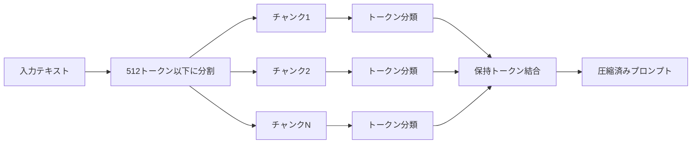

本記事は [https://arxiv.org/abs/2403.12968](https://arxiv.org/abs/2403.12968) の解説記事です。

## 論文概要

LLMLingua-2は、GPT-4によるデータ蒸留とTransformerエンコーダによるトークン二値分類を組み合わせることで、タスク非依存かつ高品質なプロンプト圧縮を実現する手法である。著者らは、従来手法が情報エントロピーに基づく因果言語モデル（LLaMA-7Bなど）を用いていた問題点を指摘し、圧縮を「各トークンを保持するか除去するか」の二値分類問題として再定式化している。XLM-RoBERTa-large（355Mパラメータ）やmBERT（110Mパラメータ）といった小規模なTransformerエンコーダで双方向コンテキストを捉えることにより、既存手法比で3倍から6倍の高速化と、2倍から5倍の圧縮率において品質損失2%以下を達成したと報告している。

この記事は [Zenn記事: LLMアプリのトークンコスト削減実践：5層最適化で月額80%カットを実現する](https://zenn.dev/0h_n0/articles/2cb1f48834fdda) の深掘りです。

## 情報源

| 項目 | 内容 |
|------|------|
| arXiv ID | [2403.12968](https://arxiv.org/abs/2403.12968) |
| URL | [https://arxiv.org/abs/2403.12968](https://arxiv.org/abs/2403.12968) |
| 著者 | Zhuoshi Pan, Qianhui Wu, Huiqiang Jiang, Menglin Xia, Xufang Luo, Jue Zhang, Qingwei Lin, Victor Ruhle, Yuqing Yang, Chin-Yew Lin, H. Vicky Zhao, Lili Qiu, Dongmei Zhang |
| 発表 | Findings of ACL 2024 |
| 分野 | cs.CL（自然言語処理）、cs.LG（機械学習） |
| コード | [https://aka.ms/LLMLingua-2](https://aka.ms/LLMLingua-2) |

## 背景と動機

LLMの入力コンテキストが長大化するにつれ、推論コストとレイテンシの増大が実運用上の課題となっている。RAGパイプラインや長文要約、Few-shotプロンプトなどでは、入力トークン数が数千から数万に達することも珍しくない。プロンプト圧縮はこの問題に対する直接的なアプローチであり、入力テキストから冗長な情報を除去し、LLMの性能を維持しつつトークン数を削減する。

しかし従来手法には根本的な課題があった。Selective-ContextやLLMLingua（初代）は、因果言語モデル（LLaMA-7B）の情報エントロピーに基づいてトークンの重要度を推定していた。著者らは、この方式には以下の問題があると指摘している。第一に、因果言語モデルは左方向のコンテキストのみを参照するため、文の後半に出現する重要情報を適切に評価できない。第二に、LLaMA-7Bクラスのモデルを圧縮のためだけに推論する計算コストが高く、GPUメモリも大量に消費する（著者らの計測で約16.6GB）。第三に、情報エントロピーベースの手法は元のテキストに存在しない情報（幻覚）を圧縮結果に含めてしまう可能性がある。

LLMLingua-2はこれらの問題を解決するため、GPT-4による高品質な蒸留データを用い、小規模なTransformerエンコーダでトークン分類を行うという新しいアプローチを採用している。

## 主要な貢献

著者らが主張する本論文の貢献は以下の通りである。

1. **データ蒸留パイプラインの設計**: GPT-4を教師モデルとして、「重要でない単語のみを除去する」「元の語順を維持する」等の5つの制約に従わせることで、高品質な圧縮データセットを構築した。品質管理にはVariation Rate（VR）とAlignment Gap（AG）の2指標を導入している
2. **トークン二値分類への再定式化**: プロンプト圧縮を各トークンの保持/除去の二値分類問題として定式化し、圧縮結果の原文への忠実性を保証する設計とした。これにより幻覚コンテンツの混入を構造的に防止している
3. **小規模Transformerエンコーダの活用**: XLM-RoBERTa-large（355M）およびmBERT（110M）を使用することで、双方向コンテキストの活用、推論速度の大幅向上（3倍から6倍）、GPUメモリ消費の8倍削減を同時に達成した
4. **タスク非依存性の実証**: MeetingBankでの訓練のみで、LongBench、GSM8K、BBHなどのOut-of-Domainベンチマークでも既存手法を上回る性能を示した
5. **多言語対応**: XLM-RoBERTaの多言語能力により、中国語テキストの圧縮においても既存手法比で約10ポイントの改善を報告している

## 技術的詳細

### データ蒸留プロセス

著者らは、GPT-4を用いてプロンプト圧縮の訓練データを構築するデータ蒸留パイプラインを設計している。MeetingBankデータセットの5,169件の会議転写テキスト（41,746チャンク）を入力とし、GPT-4に以下の5つの制約を課している。

1. 元のテキストに存在しない単語を追加しない
2. 元のテキストの語順を変更しない
3. 元のテキストの意味を保持する
4. 圧縮結果は自然な言語として読める
5. 対応するQAタスクの回答に必要な情報を保持する

蒸留されたデータに対して、著者らは2つの品質管理指標を導入している。

**Variation Rate (VR)** は、圧縮結果に元のテキストに存在しない単語（幻覚コンテンツ）がどの程度含まれるかを測定する。

$$
VR = \frac{1}{|S_{\text{comp}}|} \sum_{w \in S_{\text{comp}}} \mathbb{I}(w \notin S_{\text{ori}})
$$

ここで、$S_{\text{comp}}$ は圧縮後のテキストの単語集合、$S_{\text{ori}}$ は元のテキストの単語集合、$\mathbb{I}(\cdot)$ は指示関数である。VRが低いほど、元のテキストに忠実な圧縮が行われていることを示す。

**Alignment Gap (AG)** は、アノテーション品質を評価する指標であり、以下で定義される。

$$
AG = HR - MR
$$

ここで、$MR$（Matching Rate）と$HR$（Hit Rate）はそれぞれ以下の通りである。

$$
MR = \frac{1}{|S_{\text{ori}}|} \sum_{w \in S_{\text{ori}}} \mathbb{I}(l(w) = \text{True})
$$

$$
HR = \frac{1}{|S_{\text{ori}}|} \sum_{w \in S_{\text{ori}}} \mathbb{I}(w \in S_{\text{comp}})
$$

$l(w)$ はワードレベルのアラインメントにより得られたラベル（保持=True）であり、$MR$ はアラインメントにより保持と判定された単語の割合、$HR$ は圧縮結果に実際に出現する単語の割合を表す。AGが0に近いほど、アラインメントの品質が高いことを意味する。著者らは平均圧縮率2.57倍のデータセットを構築したと報告している。

### トークン二値分類モデル

蒸留データを用いて、Transformerエンコーダベースのトークン分類モデルを訓練する。入力テキスト $x = (x_1, x_2, \ldots, x_n)$ に対し、各トークンを「保持」または「除去」に分類する。

まず、Transformerエンコーダ $f_\theta$ で入力の隠れ表現を得る。

$$
\mathbf{h} = f_\theta(x)
$$

ここで $\mathbf{h} = (\mathbf{h}_1, \mathbf{h}_2, \ldots, \mathbf{h}_n)$ は各トークンの隠れ状態ベクトルである。

各トークンの保持確率は、線形変換とsoftmaxにより計算される。

$$
p(x_i, \Theta) = \text{softmax}(W\mathbf{h}_i + b)
$$

ここで $W$ は重み行列、$b$ はバイアス項、$\Theta = \{\theta, W, b\}$ はモデルパラメータ全体を表す。

損失関数はクロスエントロピーであり、以下で定義される。

$$
L(\Theta) = \frac{1}{N} \sum_{i=1}^{N} \text{CrossEntropy}(y_i, p(x_i, \Theta))
$$

ここで $y_i$ はGPT-4による蒸留データから得られた正解ラベル（保持=1、除去=0）、$N$ は全トークン数である。

著者らはXLM-RoBERTa-large（355Mパラメータ）を主要モデル、multilingual-BERT（110Mパラメータ）を軽量版として使用している。双方向Transformerエンコーダを用いることで、因果言語モデルでは捉えられなかった後方コンテキストも考慮したトークン重要度の推定が可能となっている。

### チャンク単位圧縮

長文テキストの処理には、512トークン以下のチャンクに分割して各チャンクを独立に圧縮する方式を採用している。



各チャンクに対してトークン分類を実行し、保持と判定されたトークンのみを元の語順で結合することで、圧縮済みプロンプトを得る。チャンク分割により、Transformerの最大入力長の制約を回避しつつ、線形な計算量でスケールする設計となっている。

### 推論時のPython実装例

以下は、LLMLingua-2を用いたプロンプト圧縮の基本的な実装パターンを示すコード例である。

```python
from typing import Optional
from llmlingua import PromptCompressor


def compress_prompt(
    original_prompt: str,
    target_ratio: float = 0.5,
    force_tokens: Optional[list[str]] = None,
) -> dict[str, str | float | int]:
    """LLMLingua-2を用いてプロンプトを圧縮する。

    Args:
        original_prompt: 圧縮対象のプロンプトテキスト。
        target_ratio: 目標圧縮率（0.0-1.0）。0.5は元の50%に圧縮。
        force_tokens: 圧縮後も必ず保持するトークンのリスト。

    Returns:
        圧縮結果を含む辞書。compressed_prompt, origin_tokens,
        compressed_tokens, ratio のキーを持つ。
    """
    compressor = PromptCompressor(
        model_name="microsoft/llmlingua-2-xlm-roberta-large-meetingbank",
        use_llmlingua2=True,
    )

    result: dict = compressor.compress_prompt(
        original_prompt,
        rate=target_ratio,
        force_tokens=force_tokens or [],
        drop_consecutive=True,
    )

    return {
        "compressed_prompt": result["compressed_prompt"],
        "origin_tokens": result["origin_tokens"],
        "compressed_tokens": result["compressed_tokens"],
        "ratio": result["ratio"],
    }
```

## 実装のポイント

LLMLingua-2を実運用に適用する際に留意すべき設計上の要点を整理する。

**モデル選択のトレードオフ**: 著者らはXLM-RoBERTa-large（355M）とmBERT（110M）の2つのモデルサイズを提供している。論文Table 1によると、MeetingBankのQAタスクではXLM-RoBERTa-large版がEM 86.92に対しmBERT版がEM 85.82と、性能差は約1ポイントである。一方でGPUメモリは2.1GBで済み、LLaMA-7Bベースの従来手法（16.6GB）の約8分の1である。レイテンシ制約が厳しい環境ではmBERT版が適している。

**圧縮率と品質の関係**: 著者らの実験結果から、2倍から3倍の圧縮率ではIn-Domain性能の低下が2%以下に抑えられている。5倍圧縮ではOut-of-Domain（LongBench）で39.1と、原文比での低下が見られるが、同条件のLLMLingua（34.6）やSelective-Context（24.8）を大きく上回っている。実運用では圧縮率をタスクの許容品質に応じて調整する設計が求められる。

**語順保持の利点**: LLMLingua-2の設計上の特徴として、圧縮後のテキストが元の語順を維持する点がある。これは圧縮をトークンの保持/除去として定式化しているためであり、結果として圧縮済みプロンプトの可読性が高く、デバッグや品質検証が容易である。

**チャンク境界の影響**: 512トークン単位のチャンク分割では、チャンク境界をまたぐ文脈情報が失われる可能性がある。著者らはこの影響について明示的な分析を報告していないが、実運用ではセンテンス境界でのチャンク分割や、チャンク間のオーバーラップなどの工夫が有効と考えられる。

## Production Deployment Guide

LLMLingua-2をAWS上で実運用に展開する場合の実装パターンを示す。以下は論文の知見を踏まえた、プロンプト圧縮パイプラインの実践的な構成ガイドである。コスト試算は2026年9月時点のAWS ap-northeast-1（東京）リージョン料金に基づく概算値であり、実際のコストはトラフィックパターン、リージョン、バースト使用量により変動する。最新料金はAWS料金計算ツールで確認を推奨する。

### AWS実装パターン

| 構成 | ユースケース | 月額概算 (ap-northeast-1) | 主要サービス |
|------|-------------|--------------------------|-------------|
| Small | PoC・社内ツール、~100 req/日 | $50-150 | Lambda, API Gateway, S3, DynamoDB |
| Medium | プロダクション初期、~1000 req/日 | $300-800 | ECS Fargate, ALB, ElastiCache, CloudWatch |
| Large | 大規模RAGパイプライン、10000+ req/日 | $1,500-4,000 | EKS + Karpenter, GPU Instances, Redis Cluster |

**Small構成**: Lambda関数でLLMLingua-2のmBERT版（110Mパラメータ）をロードし、API Gateway経由でリクエストを受け付ける。モデルサイズが小さいため、Lambda（メモリ3GB）での推論が可能である。コールドスタート対策としてProvisioned Concurrencyを1-2に設定する。月額内訳: Lambda ($10-30), API Gateway ($5-15), S3 ($1-5), DynamoDB ($5-20), CloudWatch ($5-10)。

**Medium構成**: ECS FargateでXLM-RoBERTa-large版をホストし、ALBでトラフィックを分散する。圧縮済みプロンプトのキャッシュにElastiCache（Redis）を導入し、同一プロンプトの再圧縮を回避する。オートスケーリングにより負荷に応じてタスク数を2-8に調整する。月額内訳: ECS Fargate ($100-250), ALB ($20-50), ElastiCache ($50-100), Bedrock/LLM API ($100-350), CloudWatch ($20-50)。

**Large構成**: EKSクラスタ上でLLMLingua-2をGPU対応コンテナとしてデプロイし、Karpenterによるノードの自動スケーリングでg5.xlargeのSpot Instancesを活用する。バッチ推論により高スループットを実現し、RAGパイプラインの前段に組み込む。月額内訳: EKS ($75), EC2 GPU Spot ($800-2,500), Redis Cluster ($200-400), ALB ($30-60), モニタリング ($100-200)。

### Terraformインフラコード

#### Small構成: Lambda + API Gateway

```hcl
terraform {
  required_version = ">= 1.6"
  required_providers {
    aws = {
      source  = "hashicorp/aws"
      version = "~> 5.70"
    }
  }
}

provider "aws" {
  region = "ap-northeast-1"
}

variable "project_name" {
  type    = string
  default = "llmlingua2-compressor"
}

# --- Lambda関数 ---

resource "aws_lambda_function" "compressor" {
  function_name = "${var.project_name}-compress"
  runtime       = "python3.12"
  handler       = "handler.lambda_handler"
  memory_size   = 3072
  timeout       = 120

  filename         = "${path.module}/lambda/compressor.zip"
  source_code_hash = filebase64sha256("${path.module}/lambda/compressor.zip")
  role             = aws_iam_role.lambda_exec.arn

  environment {
    variables = {
      MODEL_NAME      = "microsoft/llmlingua-2-bert-base-multilingual-cased-meetingbank"
      DEFAULT_RATE    = "0.5"
      CACHE_TABLE     = aws_dynamodb_table.prompt_cache.name
      POWERTOOLS_SERVICE_NAME = var.project_name
    }
  }

  layers = [
    "arn:aws:lambda:ap-northeast-1:017000801446:layer:AWSLambdaPowertoolsPythonV3-python312-x86_64:7"
  ]

  tags = {
    Project = var.project_name
  }
}

resource "aws_lambda_provisioned_concurrency_config" "compressor" {
  function_name                  = aws_lambda_function.compressor.function_name
  provisioned_concurrent_executions = 2
  qualifier                      = aws_lambda_alias.live.name
}

resource "aws_lambda_alias" "live" {
  name             = "live"
  function_name    = aws_lambda_function.compressor.function_name
  function_version = aws_lambda_function.compressor.version
}

# --- API Gateway ---

resource "aws_apigatewayv2_api" "compressor" {
  name          = "${var.project_name}-api"
  protocol_type = "HTTP"
}

resource "aws_apigatewayv2_stage" "default" {
  api_id      = aws_apigatewayv2_api.compressor.id
  name        = "$default"
  auto_deploy = true

  access_log_settings {
    destination_arn = aws_cloudwatch_log_group.api_logs.arn
    format = jsonencode({
      requestId = "$context.requestId"
      ip        = "$context.identity.sourceIp"
      method    = "$context.httpMethod"
      path      = "$context.path"
      status    = "$context.status"
      latency   = "$context.responseLatency"
    })
  }
}

resource "aws_apigatewayv2_integration" "compressor" {
  api_id                 = aws_apigatewayv2_api.compressor.id
  integration_type       = "AWS_PROXY"
  integration_uri        = aws_lambda_alias.live.invoke_arn
  payload_format_version = "2.0"
}

resource "aws_apigatewayv2_route" "compress" {
  api_id    = aws_apigatewayv2_api.compressor.id
  route_key = "POST /compress"
  target    = "integrations/${aws_apigatewayv2_integration.compressor.id}"
}

# --- DynamoDB キャッシュテーブル ---

resource "aws_dynamodb_table" "prompt_cache" {
  name         = "${var.project_name}-cache"
  billing_mode = "PAY_PER_REQUEST"
  hash_key     = "prompt_hash"

  attribute {
    name = "prompt_hash"
    type = "S"
  }

  ttl {
    attribute_name = "expires_at"
    enabled        = true
  }

  point_in_time_recovery {
    enabled = true
  }

  server_side_encryption {
    enabled = true
  }

  tags = {
    Project = var.project_name
  }
}

# --- IAM ---

resource "aws_iam_role" "lambda_exec" {
  name = "${var.project_name}-lambda-exec"

  assume_role_policy = jsonencode({
    Version = "2012-10-17"
    Statement = [{
      Action = "sts:AssumeRole"
      Effect = "Allow"
      Principal = {
        Service = "lambda.amazonaws.com"
      }
    }]
  })
}

resource "aws_iam_role_policy_attachment" "lambda_basic" {
  role       = aws_iam_role.lambda_exec.name
  policy_arn = "arn:aws:iam::aws:policy/service-role/AWSLambdaBasicExecutionRole"
}

resource "aws_iam_role_policy" "dynamodb_access" {
  name = "dynamodb-cache-access"
  role = aws_iam_role.lambda_exec.id

  policy = jsonencode({
    Version = "2012-10-17"
    Statement = [{
      Effect = "Allow"
      Action = [
        "dynamodb:GetItem",
        "dynamodb:PutItem",
        "dynamodb:DeleteItem"
      ]
      Resource = aws_dynamodb_table.prompt_cache.arn
    }]
  })
}

# --- CloudWatch ---

resource "aws_cloudwatch_log_group" "api_logs" {
  name              = "/aws/apigateway/${var.project_name}"
  retention_in_days = 30
}

resource "aws_cloudwatch_log_group" "lambda_logs" {
  name              = "/aws/lambda/${aws_lambda_function.compressor.function_name}"
  retention_in_days = 30
}
```

#### Large構成: EKS + Karpenter + GPU

```hcl
# --- EKS クラスタ ---

module "eks" {
  source  = "terraform-aws-modules/eks/aws"
  version = "~> 20.0"

  cluster_name    = "${var.project_name}-cluster"
  cluster_version = "1.31"

  vpc_id     = module.vpc.vpc_id
  subnet_ids = module.vpc.private_subnets

  cluster_endpoint_public_access = true

  eks_managed_node_groups = {
    system = {
      instance_types = ["m7i.large"]
      min_size       = 2
      max_size       = 4
      desired_size   = 2

      labels = {
        role = "system"
      }
    }
  }

  cluster_addons = {
    coredns    = { most_recent = true }
    kube-proxy = { most_recent = true }
    vpc-cni    = { most_recent = true }
  }

  tags = {
    Project   = var.project_name
    ManagedBy = "terraform"
  }
}

# --- Karpenter (GPU Spot Instances) ---

module "karpenter" {
  source  = "terraform-aws-modules/eks/aws//modules/karpenter"
  version = "~> 20.0"

  cluster_name = module.eks.cluster_name

  node_iam_role_additional_policies = {
    AmazonSSMManagedInstanceCore = "arn:aws:iam::aws:policy/AmazonSSMManagedInstanceCore"
  }
}

resource "kubectl_manifest" "karpenter_node_class" {
  yaml_body = yamlencode({
    apiVersion = "karpenter.k8s.aws/v1"
    kind       = "EC2NodeClass"
    metadata = {
      name = "gpu-compressor"
    }
    spec = {
      amiSelectorTerms = [{
        alias = "al2023@latest"
      }]
      role       = module.karpenter.node_iam_role_name
      subnetSelectorTerms = [{
        tags = { "karpenter.sh/discovery" = module.eks.cluster_name }
      }]
      securityGroupSelectorTerms = [{
        tags = { "karpenter.sh/discovery" = module.eks.cluster_name }
      }]
      blockDeviceMappings = [{
        deviceName = "/dev/xvda"
        ebs = {
          volumeSize = "100Gi"
          volumeType = "gp3"
          encrypted  = true
        }
      }]
    }
  })
}

resource "kubectl_manifest" "karpenter_node_pool" {
  yaml_body = yamlencode({
    apiVersion = "karpenter.sh/v1"
    kind       = "NodePool"
    metadata = {
      name = "gpu-compressor"
    }
    spec = {
      template = {
        spec = {
          nodeClassRef = {
            group = "karpenter.k8s.aws"
            kind  = "EC2NodeClass"
            name  = "gpu-compressor"
          }
          requirements = [
            { key = "karpenter.sh/capacity-type", operator = "In", values = ["spot", "on-demand"] },
            { key = "node.kubernetes.io/instance-type", operator = "In", values = ["g5.xlarge", "g5.2xlarge"] },
            { key = "kubernetes.io/arch", operator = "In", values = ["amd64"] }
          ]
          taints = [{
            key    = "nvidia.com/gpu"
            value  = "true"
            effect = "NoSchedule"
          }]
        }
      }
      limits = {
        cpu    = "64"
        memory = "256Gi"
      }
      disruption = {
        consolidationPolicy = "WhenEmptyOrUnderutilized"
        consolidateAfter    = "60s"
      }
    }
  })
}
```

### セキュリティベストプラクティス

- **転送中の暗号化**: API Gateway/ALBでTLS 1.2以上を強制。内部通信もVPCエンドポイント経由でTLS化
- **保存時の暗号化**: DynamoDBはAWS管理キーで暗号化。S3はSSE-S3またはSSE-KMSを使用
- **アクセス制御**: Lambda実行ロールには最小権限ポリシーを適用。API Gatewayにはリクエスト制限（throttling）を設定
- **ネットワーク分離**: EKS/ECSはプライベートサブネットに配置。パブリックアクセスはALB/API Gatewayのみ
- **監査ログ**: CloudTrailで全APIコールを記録。VPC Flow Logsでネットワークトラフィックを監視
- **シークレット管理**: モデル認証情報やAPIキーはAWS Secrets Managerで管理。環境変数に直接記載しない
- **入力バリデーション**: プロンプトの最大長チェック、悪意ある入力のサニタイズをLambda/コンテナ側で実装

### 運用・監視設定

```python
from typing import Any
import boto3


def setup_cloudwatch_alarms(
    project_name: str,
    lambda_function_name: str,
    sns_topic_arn: str,
) -> list[dict[str, Any]]:
    """CloudWatchアラームを設定する。

    Args:
        project_name: プロジェクト名。リソースの命名に使用。
        lambda_function_name: 監視対象のLambda関数名。
        sns_topic_arn: アラーム通知先のSNSトピックARN。

    Returns:
        作成されたアラームの情報リスト。
    """
    client = boto3.client("cloudwatch", region_name="ap-northeast-1")
    alarms: list[dict[str, Any]] = []

    alarm_configs = [
        {
            "name": f"{project_name}-lambda-errors",
            "metric": "Errors",
            "namespace": "AWS/Lambda",
            "threshold": 5.0,
            "period": 300,
            "evaluation_periods": 2,
            "comparison": "GreaterThanThreshold",
            "dimensions": [
                {"Name": "FunctionName", "Value": lambda_function_name}
            ],
            "description": "Lambda関数のエラー率が閾値を超過",
        },
        {
            "name": f"{project_name}-lambda-duration",
            "metric": "Duration",
            "namespace": "AWS/Lambda",
            "threshold": 90000.0,
            "period": 300,
            "evaluation_periods": 3,
            "comparison": "GreaterThanThreshold",
            "statistic": "p99",
            "dimensions": [
                {"Name": "FunctionName", "Value": lambda_function_name}
            ],
            "description": "Lambda P99レイテンシが90秒を超過",
        },
        {
            "name": f"{project_name}-dynamodb-throttle",
            "metric": "ThrottledRequests",
            "namespace": "AWS/DynamoDB",
            "threshold": 10.0,
            "period": 60,
            "evaluation_periods": 3,
            "comparison": "GreaterThanThreshold",
            "dimensions": [
                {"Name": "TableName", "Value": f"{project_name}-cache"}
            ],
            "description": "DynamoDBスロットリングが発生",
        },
    ]

    for config in alarm_configs:
        client.put_metric_alarm(
            AlarmName=config["name"],
            MetricName=config["metric"],
            Namespace=config["namespace"],
            Threshold=config["threshold"],
            Period=config["period"],
            EvaluationPeriods=config["evaluation_periods"],
            ComparisonOperator=config["comparison"],
            Statistic=config.get("statistic", "Sum"),
            Dimensions=config["dimensions"],
            AlarmDescription=config["description"],
            AlarmActions=[sns_topic_arn],
            OKActions=[sns_topic_arn],
            TreatMissingData="notBreaching",
        )
        alarms.append({"name": config["name"], "status": "created"})

    return alarms
```

**X-Ray トレーシング**: Lambda関数でX-Rayを有効化し、圧縮処理のボトルネックを可視化する。圧縮前後のトークン数、処理時間、キャッシュヒット率をカスタムメトリクスとして記録する。

**Cost Explorer**: LLMLingua-2導入によるLLM API呼び出しコスト削減効果を定量化するため、圧縮前後のトークン数差分をCloudWatchカスタムメトリクスとして記録し、Cost Explorerと組み合わせてROIを継続監視する。

### コスト最適化チェックリスト

**インフラ最適化**:
- [ ] Lambda メモリサイズを負荷テストで最適化（3072MBが初期推奨）
- [ ] Provisioned Concurrencyをトラフィックパターンに合わせて調整
- [ ] DynamoDB TTLでキャッシュの自動クリーンアップを有効化
- [ ] CloudWatch Logsの保持期間を30日に設定（デフォルト無期限を回避）
- [ ] 不要なCloudWatchメトリクスの詳細モニタリングを無効化
- [ ] ECS/EKSの場合、Spot Instancesを活用（最大90%削減）
- [ ] Reserved Instancesの1年コミットを検討（安定ワークロード向け）

**モデル・圧縮最適化**:
- [ ] mBERT版（110M）とXLM-RoBERTa-large版（355M）の品質/コスト比較を実施
- [ ] 圧縮率を2倍から開始し、品質メトリクスを監視しつつ段階的に上げる
- [ ] 同一プロンプトのキャッシュヒット率を監視（DynamoDB TTL: 24-72h推奨）
- [ ] バッチ処理可能なリクエストはまとめて推論（GPU利用効率向上）
- [ ] ONNXランタイムへのモデル変換を検討（CPU推論で20-40%高速化の報告あり）

**LLM API コスト削減**:
- [ ] 圧縮前後のトークン数をログに記録し、削減率を定量化
- [ ] 圧縮により削減されたトークン数 x API単価でROIを月次計算
- [ ] Bedrock Prompt Cachingとの併用効果を測定
- [ ] 低優先度リクエストにはBedrock Batch APIを検討（50%削減）
- [ ] 圧縮が不要な短いプロンプト（100トークン以下）はバイパスする閾値を設定

**セキュリティ・コンプライアンス**:
- [ ] IAMロールの最小権限を定期レビュー（IAM Access Analyzer活用）
- [ ] API Gatewayのレート制限を設定（DoS対策）
- [ ] VPCエンドポイントでプライベート通信を確保
- [ ] CloudTrailの有効化を確認
- [ ] 入力プロンプトにPIIが含まれる場合のマスキング処理を実装

**運用**:
- [ ] アラーム閾値を初期トラフィックで校正（1週間のベースライン取得後）
- [ ] ダッシュボードにKPIを集約（圧縮率、レイテンシP99、エラー率、コスト削減額）
- [ ] 障害時のフォールバック（圧縮スキップ→原文のまま送信）を実装
- [ ] デプロイパイプライン（CI/CD）にモデル品質テストを組み込む

## 実験結果

### In-Domain性能（MeetingBank）

著者らはMeetingBankデータセットを用いたIn-Domain評価を報告している（論文Table 1より）。

| 手法 | QA EM | Summary BLEU | トークン数 | 圧縮率 |
|------|-------|-------------|----------|--------|
| Original（圧縮なし） | 87.75 | 22.34 | 3,003 | 1.0x |
| Selective-Context | 66.28 | 10.83 | 1,222 | 2.5x |
| LLMLingua | 67.52 | 8.94 | 1,176 | 2.5x |
| LLMLingua-2-small (mBERT) | 85.82 | 17.41 | 984 | 3.0x |
| **LLMLingua-2** (XLM-RoBERTa) | **86.92** | **17.37** | **970** | **3.1x** |

LLMLingua-2は約3倍の圧縮率を維持しつつ、QA EMで原文比0.83ポイント差に収まっている。従来手法（Selective-Context、LLMLingua）が20ポイント以上の性能低下を示すのに対し、大幅な改善である。

### Out-of-Domain性能

著者らは、MeetingBankで訓練したモデルをそのまま他のベンチマークに適用するOut-of-Domain評価も報告している。

| ベンチマーク | 圧縮率 | LLMLingua-2 | LLMLingua | Selective-Context |
|------------|--------|------------|-----------|-------------------|
| LongBench (英語) | 5x | 39.1 | 34.6 | 24.8 |
| LongBench (中国語) | 5x | 38.1 | 28.6 | - |
| GSM8K (1-shot) | 5x | 79.08% | 79.08% | 53.98% |
| BBH (1-shot) | 3x | 70.02% | 70.11% | - |

LongBenchでは5倍圧縮でもLLMLinguaを4.5ポイント上回っている。GSM8Kでは両手法が同等の79.08%を達成しており、数学的推論タスクにおいても情報損失が最小限であることが示されている。特筆すべきは中国語LongBenchでの約10ポイントの差であり、XLM-RoBERTaの多言語能力が圧縮品質に貢献していると考えられる。

### 推論効率

著者らはV100 GPU上でのEnd-to-endスピードアップを報告している。

| 圧縮率 | スピードアップ | GPUメモリ |
|--------|-------------|----------|
| 2x | 1.6x | 2.1 GB |
| 3x | 2.1x | 2.1 GB |
| 5x | 2.9x | 2.1 GB |
| LLMLingua (比較) | - | 16.6 GB |
| Selective-Context (比較) | - | 26.5 GB |

GPUメモリ使用量がLLMLingua比で約8倍削減されている点は、リソース制約の厳しい環境での実用性を大きく高めている。LLMLingua-2の推論速度はLLMLinguaの3倍から6倍と報告されており、圧縮処理自体がボトルネックとならない設計となっている。

## 実運用への応用

LLMLingua-2は、関連するZenn記事「[LLMアプリのトークンコスト削減実践：5層最適化で月額80%カットを実現する](https://zenn.dev/0h_n0/articles/2cb1f48834fdda)」で解説されている第1層「プロンプト最適化とトークン圧縮」に直接対応する技術である。

**RAGパイプラインへの適用**: 検索結果として取得した複数のドキュメントチャンクをLLMに入力する前にLLMLingua-2で圧縮することで、入力トークン数を2倍から5倍削減できる。Zenn記事で言及されている月額コスト80%削減の実現において、プロンプト圧縮は最も直接的な効果を持つ施策の一つである。

**Few-shotプロンプトの最適化**: 多数のFew-shot例を含む長大なプロンプトに対して、各例の冗長な部分を自動で除去できる。著者らがGSM8K（1-shot, 5倍圧縮）で79.08%を達成している結果は、Few-shot例の圧縮が推論性能を損なわないことを示唆している。

**長文コンテキストの前処理**: 会議議事録、技術文書、コードレビューログなど、長文テキストをLLMで処理する際の前処理としてLLMLingua-2を組み込むことで、コンテキストウィンドウの制約を緩和しつつ処理コストを削減できる。

**既存パイプラインとの統合**: LLMLingua-2はPythonライブラリとして公開されており（`pip install llmlingua`）、既存のLangChainやLlamaIndexパイプラインに数行の追加で統合可能である。GPUメモリ2.1GBという低い要件は、LLM推論用のGPUリソースと共存しやすい。

## 関連研究

1. **Selective-Context** (Li et al., 2023): 因果言語モデルの自己情報量（self-information）に基づいてトークンの重要度を推定し、低重要度のトークンを除去する手法。LLMLingua-2と比較して、単方向コンテキストのみの参照、大規模モデル（GPT-2/LLaMA）の必要性、幻覚コンテンツの混入リスクが課題である

2. **LLMLingua** (Jiang et al., 2023): LLaMA-7Bの情報エントロピーに基づくプロンプト圧縮手法。Budget Controller、Token-level Iterative Compression、Distribution Alignmentの3コンポーネントで構成される。LLMLingua-2の直接の前身であり、情報エントロピーベースからトークン分類ベースへのパラダイムシフトの起点となった

3. **LongLLMLingua** (Jiang et al., 2023): 長文コンテキストに特化したプロンプト圧縮手法。Question-Awareな圧縮により、質問に関連する情報を優先的に保持する。タスク依存の設計であり、LLMLingua-2のタスク非依存アプローチとは相補的な関係にある

4. **RECOMP** (Xu et al., 2023): 検索結果の圧縮に特化した手法。Extractive CompressorとAbstractive Compressorの2段構成で、RAGパイプライン向けに設計されている。生成ベースの圧縮であるため、元のテキストへの忠実性はLLMLingua-2のトークン保持/除去方式に劣る可能性がある

## まとめと今後の展望

LLMLingua-2は、プロンプト圧縮をGPT-4によるデータ蒸留とトークン二値分類として再定式化することで、品質・速度・リソース効率の三方面で従来手法を上回る成果を示した。特に、小規模なTransformerエンコーダ（110M-355M）でLLaMA-7Bベースの手法を超える性能を達成した点は、「大きなモデルが常に良い」という直感に反する結果であり、タスクに適した問題設定の重要性を示している。

今後の発展として、著者らは特定ドメイン（医療、法律文書など）への適応やさらなる圧縮率の向上を課題として挙げている。また、LLMのコンテキストウィンドウが拡大を続ける中でも、推論コストの削減手段としてプロンプト圧縮の重要性は増すと考えられる。

## 参考文献

1. Pan, Z., Wu, Q., Jiang, H., Xia, M., Luo, X., Zhang, J., Lin, Q., Ruhle, V., Yang, Y., Lin, C.-Y., Zhao, H. V., Qiu, L., & Zhang, D. (2024). LLMLingua-2: Data Distillation for Efficient and Faithful Task-Agnostic Prompt Compression. *Findings of ACL 2024*. [https://arxiv.org/abs/2403.12968](https://arxiv.org/abs/2403.12968)
2. Jiang, H., Wu, Q., Lin, C.-Y., Yang, Y., & Qiu, L. (2023). LLMLingua: Compressing Prompts for Accelerated Inference of Large Language Models. *EMNLP 2023*. [https://arxiv.org/abs/2310.05736](https://arxiv.org/abs/2310.05736)
3. Jiang, H., Wu, Q., Luo, X., Li, D., Lin, C.-Y., Yang, Y., & Qiu, L. (2023). LongLLMLingua: Accelerating and Enhancing LLMs in Long Context Scenarios via Prompt Compression. *ACL 2024*. [https://arxiv.org/abs/2310.06839](https://arxiv.org/abs/2310.06839)
4. Li, Y., Bubeck, S., Eldan, R., Del Giorno, A., Gunasekar, S., & Lee, Y. T. (2023). Textbooks Are All You Need II: phi-1.5 technical report. [https://arxiv.org/abs/2309.05463](https://arxiv.org/abs/2309.05463)
5. Xu, F., Shi, W., & Choi, E. (2023). RECOMP: Improving Retrieval-Augmented LMs with Compression and Selective Augmentation. *ICLR 2024*. [https://arxiv.org/abs/2310.04408](https://arxiv.org/abs/2310.04408)
