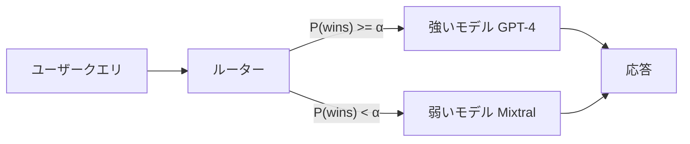

本記事は [https://arxiv.org/abs/2406.18665](https://arxiv.org/abs/2406.18665) の解説記事です。

## 論文概要（Abstract）

LLMの推論コスト削減は実用上の重要課題である。GPT-4クラスの高性能モデルはトークンあたり約$24.7/Mと高額だが、Mixtral 8x7Bなどのオープンモデルは約$0.24/Mと100倍以上安価である。しかし単純に安価なモデルへ切り替えると品質が低下する。著者らは、人間の嗜好データ（Chatbot Arenaの対戦結果）を活用してクエリごとに強いモデルと弱いモデルを動的に振り分けるルーターを学習するフレームワーク「RouteLLM」を提案している。MT Benchにおいて品質95%を維持しながら推論コストを3.66倍削減し、異なるモデルペアへの汎化性能も確認されたと報告されている。

この記事は [Zenn記事: LLMアプリのトークンコスト削減実践：5層最適化で月額80%カットを実現する](https://zenn.dev/0h_n0/articles/2cb1f48834fdda) の深掘りです。

## 情報源

- **arXiv ID**: 2406.18665
- **URL**: [https://arxiv.org/abs/2406.18665](https://arxiv.org/abs/2406.18665)
- **著者**: Isaac Ong, Amjad Almahairi, Vincent Wu, et al.
- **発表**: ICLR 2025
- **分野**: cs.CL, cs.LG
- **コード**: [https://github.com/lm-sys/RouteLLM](https://github.com/lm-sys/RouteLLM)

## 背景と動機（Background & Motivation）

LLMの商用APIは性能とコストのトレードオフが顕著である。GPT-4のような最先端モデルはMMLUやGSM8Kで高いスコアを達成するが、トークンコストが高い。一方、Mixtral 8x7BやLlama 3 8Bなどのオープンモデルはコストが2桁低いものの、複雑な推論タスクでは品質が劣る。

従来のコスト削減手法として、プロンプト圧縮やキャッシング、バッチ処理などが存在するが、これらはクエリの難易度に応じたモデル選択という観点が欠けている。実際のユーザークエリには「今日の天気は？」のような単純なものから「再帰的なデータ構造をRustで実装して」のような高度なものまで混在しており、全てのクエリに高額モデルを使う必要はない。

著者らはこの観察に基づき、クエリレベルでモデルを動的に選択するルーティングという問題を定式化している。核心的な課題は「このクエリは弱いモデルで十分な品質を達成できるか」を事前に判断することであり、人間の嗜好データをこの判断の学習に活用する点がRouteLLMの独自性である。



## 主要な貢献（Key Contributions）

- **貢献1: 嗜好データを活用したルーター学習フレームワーク** — Chatbot Arenaの人間対戦データ（80k battles）を用いて、クエリごとに弱いモデルが強いモデルに勝てるかを予測するルーターを訓練する手法を確立した
- **貢献2: 4種類のルーターアーキテクチャの提案と比較** — 学習不要のSW Rankingから、Matrix Factorization、BERT分類器、因果LLM分類器まで、計算コストと精度のトレードオフが異なる4手法を体系的に比較している
- **貢献3: コスト効率の定量評価指標PGR/APGRの導入** — Performance Gap Recovery（PGR）とその閾値平均APGRにより、ルーティング品質を単一スカラーで評価可能にした
- **貢献4: クロスモデル汎化の実証** — GPT-4/Mixtralペアで訓練したルーターがClaude 3 Opus/SonnetやLlama 3 70B/8Bペアでも有効であることを示し、ルーターの再訓練なしでモデル入れ替えが可能であると報告している
- **貢献5: データ拡張手法の提案** — LLM-as-Judgeによる合成データ（D_judge: 約120kサンプル、収集コスト$700）でルーター性能を向上させる手法を示した

## 技術的詳細（Technical Details）

### 問題定式化

RouteLLMはルーティングを二値分類問題として定式化する。強いモデル $M_s$ と弱いモデル $M_w$ のペアが与えられたとき、クエリ $q$ に対して弱いモデルが強いモデルに「勝てる」確率 $P_\theta(\text{wins} \mid q)$ を推定する。

学習目標は以下の対数尤度最大化である:

$$
\max_\theta \sum_{(q, l_{s,w}) \in \mathcal{D}} \log P_\theta(l_{s,w} \mid q)
$$

ここで、
- $\theta$: ルーターのパラメータ
- $q$: ユーザークエリ
- $l_{s,w} \in \{0, 1\}$: 弱いモデルが強いモデルに勝ったかどうかのラベル
- $\mathcal{D}$: 訓練データセット（嗜好データ）

ルーティング決定は閾値 $\alpha$ を用いて行う:

$$
R^\alpha(q) = \begin{cases} M_{\text{weak}} & \text{if } P_\theta(\text{wins} \mid q) < \alpha \\ M_{\text{strong}} & \text{otherwise} \end{cases}
$$

$\alpha$ が高いほど弱いモデルへの振り分けが増え、コスト削減が大きくなるが品質は低下する。$\alpha$ は品質とコストのトレードオフを制御するハイパーパラメータである。

### 4つのルーターアーキテクチャ

#### 1. Similarity-Weighted (SW) Ranking

学習不要のベースライン手法である。各訓練クエリに対してBradley-Terryモデルで勝率を計算し、新しいクエリとの類似度で重み付け平均を取る。

$$
P(\text{wins} \mid q) = \frac{1}{1 + e^{-(\xi_s - \xi_w)}}
$$

ここで $\xi_s, \xi_w$ はそれぞれ強いモデル・弱いモデルのBradley-Terryレーティングである。新しいクエリに対しては、embeddingの類似度を $\gamma = 10$ で指数スケーリングして重み付けする。

```python
import numpy as np
from numpy.typing import NDArray


def sw_ranking_predict(
    query_embedding: NDArray[np.float32],
    train_embeddings: NDArray[np.float32],
    train_win_labels: NDArray[np.int32],
    gamma: float = 10.0,
) -> float:
    """Similarity-Weighted Ranking による勝率予測

    Args:
        query_embedding: クエリのembeddingベクトル (d,)
        train_embeddings: 訓練データのembedding行列 (n, d)
        train_win_labels: 弱いモデルが勝った場合1、負けた場合0 (n,)
        gamma: 類似度の指数スケーリング係数

    Returns:
        弱いモデルが勝つ確率 [0, 1]
    """
    # コサイン類似度を計算
    similarities = train_embeddings @ query_embedding
    similarities /= (
        np.linalg.norm(train_embeddings, axis=1) * np.linalg.norm(query_embedding)
    )

    # 指数スケーリングで重み付け
    weights = np.exp(gamma * similarities)
    weights /= weights.sum()

    # 重み付き勝率
    win_probability: float = float(np.dot(weights, train_win_labels))
    return win_probability
```

#### 2. Matrix Factorization (MF)

Chatbot Arenaの対戦データを行列分解で表現する。モデルID $M$ のembedding $\mathbf{v}_m$ とクエリ $q$ のembedding $\mathbf{v}_q$ から、以下のスコアを計算する:

$$
\delta(M, q) = \mathbf{w}_2^\top \left( \mathbf{v}_m \odot (\mathbf{W}_1^\top \mathbf{v}_q + \mathbf{b}) \right)
$$

ここで、
- $\mathbf{v}_m$: モデル $M$ のembeddingベクトル
- $\mathbf{v}_q$: クエリ $q$ のembeddingベクトル
- $\mathbf{W}_1, \mathbf{b}$: クエリembeddingの線形変換パラメータ
- $\mathbf{w}_2$: 最終スコアへの射影ベクトル
- $\odot$: 要素ごとの積（Hadamard積）

訓練は8GB GPU上で約10エポック、バッチサイズ64、学習率$3 \times 10^{-4}$で実行されている（論文Section 3.2より）。

#### 3. BERT Classifier

BERT_BASEの`[CLS]`トークン表現に線形分類ヘッドを追加する:

$$
P(\text{wins} \mid q) = \sigma(\mathbf{W} \mathbf{h}_{\text{CLS}} + b)
$$

ここで、
- $\mathbf{h}_{\text{CLS}}$: BERTの`[CLS]`トークンの隠れ状態ベクトル
- $\mathbf{W}, b$: 線形分類ヘッドのパラメータ
- $\sigma$: シグモイド関数

訓練には2基のL4 GPUを使用し、約2000ステップ、バッチサイズ16、学習率$1 \times 10^{-5}$で実行されている（論文Section 3.3より）。

#### 4. Causal LLM Classifier

Llama 3 8Bを指示追従モードで利用し、クエリのカテゴリ分類を行う。クエリを提示して「このクエリは強いモデルが必要か」を判断させる。8基のA100 GPUを使用し、約2000ステップ、バッチサイズ8、学習率$1 \times 10^{-6}$で訓練されている（論文Section 3.4より）。

4手法のリソース要件と特性を以下に整理する:

| ルーター | 訓練GPU | 訓練時間 | 推論コスト ($/M req) | スループット (req/sec) |
|---------|---------|---------|---------------------|---------------------|
| SW Ranking | 不要 | 不要 | N/A | N/A |
| Matrix Factorization | 8GB GPU | ~10 epochs | $3.32 | 155.16 |
| BERT Classifier | 2x L4 | ~2000 steps | $3.19 | 69.62 |
| Causal LLM | 8x A100 | ~2000 steps | 高い | 低い |

論文Table 7より、最もコストが高いルーターでもGPT-4の生成コストの0.4%以下であると報告されている。

### 評価指標: PGR と APGR

ルーターの品質を定量化するため、著者らはPerformance Gap Recovery（PGR）を導入している:

$$
\text{PGR} = \frac{r(M_{R^\alpha}) - r(M_w)}{r(M_s) - r(M_w)}
$$

ここで、
- $r(M_{R^\alpha})$: ルーター $R^\alpha$ によるルーティング結果のスコア
- $r(M_s)$: 強いモデル単体のスコア
- $r(M_w)$: 弱いモデル単体のスコア

PGR = 1.0は強いモデルと同等の品質を意味し、PGR = 0.0は弱いモデルと同等を意味する。さらに、閾値 $\alpha$ の影響を平均化したAPGRを定義している:

$$
\text{APGR} \approx \frac{1}{10} \sum_{i=1}^{10} \text{PGR}(M_{R^{\alpha_i}})
$$

$\alpha_i$ は弱いモデルへの振り分け割合が10%, 20%, ..., 100%となる閾値である。

## 実装のポイント（Implementation）

RouteLLMの実装において注意すべき点を以下に整理する。

**データ前処理**: Chatbot Arenaの生データ（80k battles）から有効な比較ペアを抽出し、65k比較（D_arena）を構築する。タイや片方のモデルが不明なバトルは除外する。

**データ拡張**: D_arenaだけでは特定ドメイン（数学・コーディング）のカバレッジが不十分な場合がある。著者らはLLM-as-Judgeで合成データ（D_judge: 約120kサンプル）を生成し、収集コスト約$700でルーター性能を向上させている（論文Section 4.2より）。さらに、MMLUの検証問題から正解/不正解で勝敗ラベルを付与したD_gold（約1500サンプル）も使用している。

**閾値キャリブレーション**: $\alpha$ の選択はコスト・品質トレードオフに直結する。著者らは検証セットでPGRカーブを描き、目標品質（例: 95%）に対応する $\alpha$ を選択することを推奨している。

**embeddingモデルの選択**: SW RankingとMFではクエリembeddingの品質が性能に直結する。論文ではtext-embedding-3-smallが使用されているが、多言語対応が必要な場合はmultilingual-e5-largeなどへの変更を検討すべきである。

```python
from routellm.controller import Controller


def create_router(
    router_type: str = "mf",
    strong_model: str = "gpt-4-1106-preview",
    weak_model: str = "mixtral-8x7b-instruct-v0.1",
    threshold: float = 0.11593,
) -> Controller:
    """RouteLLMルーターを初期化する

    Args:
        router_type: ルーター種別 ("sw", "mf", "bert", "causal_llm")
        strong_model: 強いモデルのID
        weak_model: 弱いモデルのID
        threshold: ルーティング閾値（品質/コストトレードオフ）

    Returns:
        初期化済みのControllerインスタンス
    """
    controller = Controller(
        routers=[router_type],
        strong_model=strong_model,
        weak_model=weak_model,
    )
    return controller
```

## Production Deployment Guide

RouteLLMを本番環境にデプロイする際のAWS構成パターンを示す。以下のコスト試算は2026年9月時点のAWS ap-northeast-1（東京）リージョン料金に基づく概算値であり、実際のコストはトラフィックパターン、リージョン、バースト使用量により変動する。最新料金はAWS料金計算ツールで確認を推奨する。

### AWS実装パターン（コスト最適化重視）

RouteLLMの本番デプロイでは、ルーター推論とLLM呼び出しの2段構成が基本となる。ルーター自体の推論コストは論文Table 7よりGPT-4生成コストの0.4%以下であるため、アーキテクチャ選択はLLM呼び出しパターンに依存する。

| 構成 | トラフィック | 月額概算 | 主要サービス |
|------|------------|---------|------------|
| Small | ~100 req/日 | $50-150 | Lambda + Bedrock + DynamoDB |
| Medium | ~1,000 req/日 | $300-800 | ECS Fargate + Bedrock + ElastiCache |
| Large | 10,000+ req/日 | $2,000-5,000 | EKS + Spot + vLLM自前ホスト |

**Small構成（~100 req/日）**: Lambda関数でMFルーターを実行し、Bedrockで強いモデル（Claude 3.5 Sonnet）と弱いモデル（Claude 3 Haiku）を呼び分ける。DynamoDBにルーティング結果とコストを記録する。Lambda 256MB、Bedrock On-Demand料金で月額$50-150程度。

**Medium構成（~1,000 req/日）**: ECS Fargateでルーターをコンテナ化し、ElastiCacheでembeddingキャッシュを保持する。BERTルーターを使用する場合はGPUインスタンス（g5.xlarge）が必要だが、MFルーターならCPUインスタンスで十分である。月額$300-800程度。

**Large構成（10,000+ req/日）**: EKSクラスタ上でルーターと弱いモデル（vLLM on Spot Instances）を自前ホストし、強いモデルのみBedrock APIを利用する。Karpenterによる自動スケーリングとSpot Instancesの活用で推論コストを大幅に削減できる。月額$2,000-5,000程度。

**コスト削減テクニック**:
- Spot Instances活用（vLLMワーカー）: 最大90%削減
- Reserved Instances購入（EKSノード）: 最大72%削減
- Bedrock Batch API使用（非リアルタイム処理）: 50%削減
- Prompt Caching有効化: 30-90%削減

### Terraformインフラコード

#### Small構成（Serverless）

```hcl
# RouteLLM Small構成: Lambda + Bedrock + DynamoDB
# 2026年9月時点の設定

terraform {
  required_version = ">= 1.9"
  required_providers {
    aws = {
      source  = "hashicorp/aws"
      version = "~> 5.70"
    }
  }
}

provider "aws" {
  region = "ap-northeast-1"
}

# --- IAMロール（最小権限） ---
resource "aws_iam_role" "router_lambda" {
  name = "routellm-router-lambda"
  assume_role_policy = jsonencode({
    Version = "2012-10-17"
    Statement = [{
      Action    = "sts:AssumeRole"
      Effect    = "Allow"
      Principal = { Service = "lambda.amazonaws.com" }
    }]
  })
}

resource "aws_iam_role_policy" "router_lambda" {
  name = "routellm-router-policy"
  role = aws_iam_role.router_lambda.id
  policy = jsonencode({
    Version = "2012-10-17"
    Statement = [
      {
        Effect   = "Allow"
        Action   = ["bedrock:InvokeModel"]
        Resource = [
          "arn:aws:bedrock:ap-northeast-1::foundation-model/anthropic.claude-3-5-sonnet*",
          "arn:aws:bedrock:ap-northeast-1::foundation-model/anthropic.claude-3-haiku*"
        ]
      },
      {
        Effect   = "Allow"
        Action   = ["dynamodb:PutItem", "dynamodb:GetItem", "dynamodb:Query"]
        Resource = [aws_dynamodb_table.routing_log.arn]
      },
      {
        Effect   = "Allow"
        Action   = ["logs:CreateLogGroup", "logs:CreateLogStream", "logs:PutLogEvents"]
        Resource = ["arn:aws:logs:ap-northeast-1:*:*"]
      }
    ]
  })
}

# --- DynamoDB（ルーティングログ） ---
resource "aws_dynamodb_table" "routing_log" {
  name         = "routellm-routing-log"
  billing_mode = "PAY_PER_REQUEST"  # On-Demandでコスト最適化
  hash_key     = "request_id"
  range_key    = "timestamp"

  attribute {
    name = "request_id"
    type = "S"
  }
  attribute {
    name = "timestamp"
    type = "S"
  }

  server_side_encryption {
    enabled = true  # KMS暗号化
  }

  point_in_time_recovery {
    enabled = true
  }
}

# --- Lambda関数 ---
resource "aws_lambda_function" "router" {
  function_name = "routellm-router"
  runtime       = "python3.12"
  handler       = "handler.lambda_handler"
  role          = aws_iam_role.router_lambda.arn
  filename      = "lambda_package.zip"
  memory_size   = 256  # MFルーターはCPUで十分
  timeout       = 30

  environment {
    variables = {
      ROUTER_TYPE    = "mf"
      STRONG_MODEL   = "anthropic.claude-3-5-sonnet-20241022-v2:0"
      WEAK_MODEL     = "anthropic.claude-3-haiku-20240307-v1:0"
      THRESHOLD      = "0.11593"
      DYNAMODB_TABLE = aws_dynamodb_table.routing_log.name
    }
  }

  tracing_config {
    mode = "Active"  # X-Ray有効化
  }
}

# --- CloudWatchアラーム（コスト監視） ---
resource "aws_cloudwatch_metric_alarm" "lambda_errors" {
  alarm_name          = "routellm-lambda-errors"
  comparison_operator = "GreaterThanThreshold"
  evaluation_periods  = 2
  metric_name         = "Errors"
  namespace           = "AWS/Lambda"
  period              = 300
  statistic           = "Sum"
  threshold           = 5
  alarm_description   = "RouteLLM Lambda error rate alert"

  dimensions = {
    FunctionName = aws_lambda_function.router.function_name
  }
}
```

#### Large構成（Container）

```hcl
# RouteLLM Large構成: EKS + Karpenter + Spot Instances
# 2026年9月時点の設定

module "eks" {
  source          = "terraform-aws-modules/eks/aws"
  version         = "~> 20.24"
  cluster_name    = "routellm-cluster"
  cluster_version = "1.31"

  vpc_id     = module.vpc.vpc_id
  subnet_ids = module.vpc.private_subnets

  # コントロールプレーンのみ（ワーカーはKarpenter管理）
  cluster_endpoint_public_access = false
}

# --- Karpenter Provisioner（Spot優先） ---
resource "kubectl_manifest" "karpenter_provisioner" {
  yaml_body = yamlencode({
    apiVersion = "karpenter.sh/v1"
    kind       = "NodePool"
    metadata   = { name = "routellm-gpu" }
    spec = {
      template = {
        spec = {
          requirements = [
            { key = "karpenter.sh/capacity-type", operator = "In", values = ["spot", "on-demand"] },
            { key = "node.kubernetes.io/instance-type", operator = "In",
              values = ["g5.xlarge", "g5.2xlarge", "g6.xlarge"] },
          ]
          nodeClassRef = { name = "default" }
        }
      }
      limits   = { cpu = "64", memory = "256Gi" }
      disruption = {
        consolidationPolicy = "WhenEmptyOrUnderutilized"
        consolidateAfter    = "30s"
      }
    }
  })
}

# --- Secrets Manager（モデル設定） ---
resource "aws_secretsmanager_secret" "bedrock_config" {
  name                    = "routellm/bedrock-config"
  recovery_window_in_days = 7
}

resource "aws_secretsmanager_secret_version" "bedrock_config" {
  secret_id = aws_secretsmanager_secret.bedrock_config.id
  secret_string = jsonencode({
    strong_model = "anthropic.claude-3-5-sonnet-20241022-v2:0"
    threshold    = 0.11593
    region       = "ap-northeast-1"
  })
}

# --- AWS Budgets（予算アラート） ---
resource "aws_budgets_budget" "routellm_monthly" {
  name         = "routellm-monthly"
  budget_type  = "COST"
  limit_amount = "5000"
  limit_unit   = "USD"
  time_unit    = "MONTHLY"

  notification {
    comparison_operator       = "GREATER_THAN"
    threshold                 = 80
    threshold_type            = "PERCENTAGE"
    notification_type         = "ACTUAL"
    subscriber_email_addresses = ["ops-team@example.com"]
  }

  cost_filter {
    name   = "TagKeyValue"
    values = ["user:project$routellm"]
  }
}
```

### 運用・監視設定

**CloudWatch Logs Insights クエリ（コスト異常検知）**:

```
fields @timestamp, router_decision, model_used, input_tokens, output_tokens
| stats count() as request_count,
        sum(input_tokens + output_tokens) as total_tokens,
        avg(latency_ms) as avg_latency
  by bin(1h) as time_bucket, model_used
| sort time_bucket desc
```

**CloudWatch アラーム設定**:

```python
import boto3


def create_cost_alarm(
    function_name: str = "routellm-router",
    threshold_invocations: int = 10000,
) -> dict:
    """Bedrockトークン使用量スパイク検知アラームを作成する

    Args:
        function_name: Lambda関数名
        threshold_invocations: 1時間あたりの閾値

    Returns:
        CloudWatch APIのレスポンス
    """
    cloudwatch = boto3.client("cloudwatch", region_name="ap-northeast-1")
    response: dict = cloudwatch.put_metric_alarm(
        AlarmName="routellm-invocation-spike",
        MetricName="Invocations",
        Namespace="AWS/Lambda",
        Statistic="Sum",
        Period=3600,
        EvaluationPeriods=1,
        Threshold=threshold_invocations,
        ComparisonOperator="GreaterThanThreshold",
        Dimensions=[{"Name": "FunctionName", "Value": function_name}],
        AlarmActions=["arn:aws:sns:ap-northeast-1:ACCOUNT_ID:routellm-alerts"],
    )
    return response
```

**X-Ray トレーシング設定**:

```python
from aws_xray_sdk.core import xray_recorder, patch_all

# boto3自動計装
patch_all()


@xray_recorder.capture("route_query")
def route_query(query: str, threshold: float = 0.11593) -> dict:
    """クエリをルーティングしX-Rayトレースを記録する

    Args:
        query: ユーザークエリ
        threshold: ルーティング閾値

    Returns:
        ルーティング結果とモデル応答
    """
    subsegment = xray_recorder.current_subsegment()
    if subsegment:
        subsegment.put_annotation("router_type", "mf")
        subsegment.put_metadata("query_length", len(query))

    # ルーティング判定
    win_prob = predict_win_probability(query)
    model = "weak" if win_prob < threshold else "strong"

    if subsegment:
        subsegment.put_annotation("routed_to", model)
        subsegment.put_annotation("win_probability", round(win_prob, 4))

    return {"model": model, "win_probability": win_prob}
```

**Cost Explorer自動レポート**:

```python
import boto3
from datetime import datetime, timedelta


def get_daily_cost_report() -> dict:
    """日次コストレポートを取得しBedrock/Lambda/EKSコストを抽出する

    Returns:
        サービス別コスト辞書
    """
    ce = boto3.client("ce", region_name="ap-northeast-1")
    end = datetime.utcnow().strftime("%Y-%m-%d")
    start = (datetime.utcnow() - timedelta(days=1)).strftime("%Y-%m-%d")

    response = ce.get_cost_and_usage(
        TimePeriod={"Start": start, "End": end},
        Granularity="DAILY",
        Metrics=["UnblendedCost"],
        Filter={
            "Tags": {
                "Key": "project",
                "Values": ["routellm"],
            }
        },
        GroupBy=[{"Type": "DIMENSION", "Key": "SERVICE"}],
    )

    costs: dict[str, float] = {}
    for group in response["ResultsByTime"][0]["Groups"]:
        service = group["Keys"][0]
        amount = float(group["Metrics"]["UnblendedCost"]["Amount"])
        costs[service] = amount

    total = sum(costs.values())
    if total > 100.0:
        sns = boto3.client("sns", region_name="ap-northeast-1")
        sns.publish(
            TopicArn="arn:aws:sns:ap-northeast-1:ACCOUNT_ID:routellm-cost-alert",
            Message=f"RouteLLM daily cost exceeded $100: ${total:.2f}",
            Subject="RouteLLM Cost Alert",
        )

    return costs
```

### コスト最適化チェックリスト

**アーキテクチャ選択**:
- [ ] トラフィック量に応じた構成を選択（~100 req/日: Serverless、~1000 req/日: Hybrid、10000+ req/日: Container）
- [ ] ルーターの選択はMFを基本とする（コスト$3.32/M req、スループット155 req/sec）

**リソース最適化**:
- [ ] EC2/EKS: Spot Instances優先（vLLMワーカーで最大90%削減）
- [ ] Reserved Instances: 1年コミットで最大72%削減
- [ ] Savings Plans: コンピューティング使用量が予測可能な場合に検討
- [ ] Lambda: メモリサイズをMFルーターに最適化（256MBで十分）
- [ ] ECS/EKS: Karpenterでアイドル時スケールダウン（consolidateAfter: 30s）

**LLMコスト削減**:
- [ ] RouteLLMルーターで弱いモデルへの振り分けを最大化（論文よりMT Benchで品質95%維持で3.66倍削減）
- [ ] Bedrock Batch API使用（非リアルタイム処理で50%削減）
- [ ] Prompt Caching有効化（繰り返しプレフィックスで30-90%削減）
- [ ] トークン数制限（max_tokensの適切な設定）
- [ ] 弱いモデルの自前ホスト（Large構成でBedrock API費用を回避）

**監視・アラート**:
- [ ] AWS Budgets設定（月額上限のアラート）
- [ ] CloudWatch アラーム（Lambda エラー率、Bedrock呼び出し数）
- [ ] Cost Anomaly Detection有効化
- [ ] 日次コストレポート（Cost Explorer API + SNS通知）
- [ ] ルーティング比率の監視（弱いモデル/強いモデルの振り分け割合）

**リソース管理**:
- [ ] 未使用リソース削除（不要なLambda、停止中のECSタスク）
- [ ] タグ戦略（project=routellm で全リソースをタグ付け）
- [ ] DynamoDBのTTL設定（古いルーティングログの自動削除）
- [ ] 開発環境の夜間停止（EKSノードのスケジュールスケーリング）
- [ ] embeddingキャッシュのライフサイクルポリシー（ElastiCacheの有効期限設定）

## 実験結果（Results）

### MT Benchでの評価

論文Table 2より、D_arena + D_judgeで訓練した各ルーターのMT Bench結果を以下に示す:

| ルーター | CPT(50%) | CPT(80%) | APGR |
|---------|----------|----------|------|
| Matrix Factorization | 13.40% | 31.31% | 0.802 |
| SW Ranking | 23.21% | 36.04% | 0.759 |
| BERT Classifier | 19.58% | 34.02% | 0.751 |

CPT(X%)は「強いモデルの品質のX%を達成するために必要な強いモデルへの振り分け率」を意味する。MFルーターはCPT(50%)=13.40%であり、品質の50%を維持するのに強いモデルの呼び出しを13.40%に抑えられることを示している。APGRではMFが0.802と最高値を記録している。

### ベンチマーク別コスト削減

論文Table 6より、MFルーターの品質維持とコスト削減の関係を以下に示す:

| ベンチマーク | 品質維持率 | コスト削減倍率 |
|-------------|----------|--------------|
| MT Bench | 95% | 3.66x |
| MMLU | 92% | 1.41x |
| GSM8K | 87% | 1.49x |

MT Benchでは品質95%維持で3.66倍のコスト削減を達成している。MMLUやGSM8Kではコスト削減倍率が低いが、これは数学・知識問題では弱いモデルと強いモデルの性能差が大きいためであると著者らは分析している。

### クロスモデル汎化

論文Table 4より、GPT-4/Mixtralペアで訓練したルーターを異なるモデルペアに適用した結果を示す:

| 対象モデルペア | SW Ranking改善率 |
|--------------|----------------|
| Claude 3 Opus / Sonnet | 56.6% |
| Llama 3.1 70B / 8B | 49.8% |

GPT-4/Mixtralで訓練したルーターが、再訓練なしでClaude 3やLlama 3のペアでも有効に機能することが示されている。これはルーターがモデル固有の特性ではなく、クエリの難易度を学習していることを示唆している。

### ルーティングオーバーヘッド

論文Table 7より、ルーター自体の運用コストは極めて低い:

| ルーター | コスト ($/M requests) | スループット (req/sec) |
|---------|---------------------|---------------------|
| MF | $3.32 | 155.16 |
| BERT | $3.19 | 69.62 |

GPT-4の生成コスト（~$24.7/M tokens）と比較して、ルーター自体のコストは0.4%以下であり、ルーティングのオーバーヘッドは無視できる水準であると報告されている。

## 実運用への応用（Practical Applications）

RouteLLMの実運用適用にあたり、Zenn記事「LLMアプリのトークンコスト削減実践」の第2層「モデルルーティング」と密接に関連する。Zenn記事ではルーティング戦略の設計とルーター実装が解説されているが、RouteLLMはその学術的基盤を提供している。

**段階的導入戦略**: まずSW Ranking（学習不要）で効果を検証し、十分なログが蓄積された段階でMFルーターへ移行する。MFルーターはGPU不要で推論可能であり（論文Table 7: 155 req/sec on CPU）、Lambda上でも動作する。

**閾値の動的調整**: 本番環境ではトラフィックパターンが時間帯で変動する。ピーク時は $\alpha$ を上げてコスト削減を優先し、オフピーク時は $\alpha$ を下げて品質を優先する運用が考えられる。

**モデルペア更新への対応**: 論文のクロスモデル汎化結果（Table 4）から、新しいモデルがリリースされた際にルーターを再訓練せずにモデルペアを入れ替えることが可能である。ただし、性能差が大きく異なるモデルペアでは再訓練が推奨される。

**マルチモデル拡張**: 論文では2モデル（強/弱）のルーティングを扱っているが、実運用では3段階以上のモデル階層（例: GPT-4 / Claude 3.5 Sonnet / Haiku）へのカスケードルーティングも検討に値する。この場合、複数の閾値を設定し、段階的にモデルを選択する方式が有効である。

## 関連研究（Related Work）

- **FrugalGPT** (Chen et al., 2023): LLMカスケードによるコスト削減を提案。複数モデルを順に呼び出し、品質が十分なら途中で停止する。RouteLLMは単一ルーター判定で1回のモデル呼び出しに収める点で効率的だが、FrugalGPTは品質保証が確実な点で優れる
- **AutoMix** (Madaan et al., 2023): モデル自身に「この応答の品質は十分か」を判断させるself-verification方式。追加のLLM呼び出しが必要なためレイテンシが増加する。RouteLLMはルーター推論が高速（155 req/sec）で追加のLLM呼び出しが不要
- **Hybrid LLM** (Ding et al., 2024): RouteLLMと同様にクエリレベルのルーティングを扱うが、BERTベースの分類器のみを検討。RouteLLMは4種類のアーキテクチャを比較し、MFルーターが最も効率的であることを示した点で網羅的である

## まとめと今後の展望

RouteLLMは、Chatbot Arenaの人間嗜好データを活用してLLMルーターを訓練し、品質を維持しながら推論コストを大幅に削減するフレームワークである。特にMFルーターはAPGR 0.802を達成し、GPU不要で155 req/secの高スループットを実現している点が実用的である。クロスモデル汎化により、ルーターの再訓練なしでモデルペアを入れ替えられることも本番運用において重要な特性である。

今後の研究方向として、著者らはマルチターン対話への対応、ドメイン固有のルーター（コーディング・数学特化）、および3段階以上のモデル階層への拡張を挙げている。LLMの推論コスト削減は実務上の重要課題であり、RouteLLMはその基盤技術として広く活用が期待される。

## 参考文献

- **arXiv**: [https://arxiv.org/abs/2406.18665](https://arxiv.org/abs/2406.18665)
- **Code**: [https://github.com/lm-sys/RouteLLM](https://github.com/lm-sys/RouteLLM)
- **Related Zenn article**: [https://zenn.dev/0h_n0/articles/2cb1f48834fdda](https://zenn.dev/0h_n0/articles/2cb1f48834fdda)
- **FrugalGPT**: Chen et al., "FrugalGPT: How to Use Large Language Models While Reducing Cost and Improving Performance," arXiv:2305.05176
- **AutoMix**: Madaan et al., "AutoMix: Automatically Mixing Language Models," arXiv:2310.12963
- **Hybrid LLM**: Ding et al., "Hybrid LLM: Cost-Efficient and Quality-Aware Query Routing," arXiv:2404.14618
